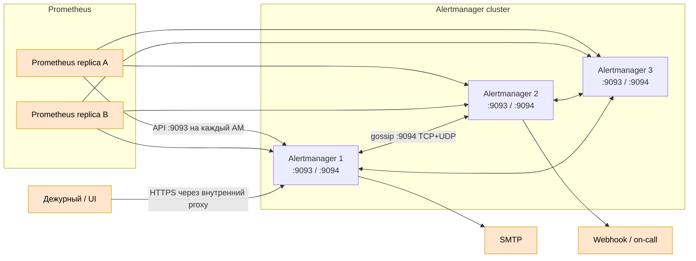

# Prometheus Alertmanager 0.34.0 — маршрутизация оповещений

В запросе продукт назван **AlterManager**. Официальное название — **Prometheus Alertmanager**. Это отдельная программа экосистемы Prometheus, которая принимает уже вычисленные алерты, группирует, дедуплицирует, подавляет и отправляет уведомления.

Документ фиксирует версию **0.34.0**, выпущенную 16 августа 2026. Образ: `quay.io/prometheus/alertmanager:v0.34.0`. Если Alertmanager ставится как часть зафиксированного `kube-prometheus-stack`, версия должна совпадать с проверенной матрицей чарта, а не заменяться отдельно «на latest».

Документация: https://prometheus.io/docs/alerting/latest/alertmanager/  
Релиз: https://github.com/prometheus/alertmanager/releases/tag/v0.34.0

---

## Назначение системы

Alertmanager превращает поток одинаковых срабатываний из Prometheus в управляемые уведомления дежурным. Он применяет дерево маршрутов, группирует похожие алерты, не отправляет повтор одного события с каждой реплики Prometheus, учитывает silence и inhibition и вызывает настроенные receivers.

Alertmanager **не вычисляет условия алертов** — это делает Prometheus по alerting rules. Он не хранит метрики, не заменяет систему управления инцидентами и не гарантирует доставку, если внешний SMTP/webhook/on-call сервис не принял сообщение.

---

## Перечень функций

1. **Принимать алерты** от Prometheus по HTTP API v2.
2. **Группировать** алерты по выбранным labels, чтобы одна авария не создавала сотни сообщений.
3. **Дедуплицировать** одинаковые алерты от HA-реплик Prometheus.
4. **Маршрутизировать** по дереву `route` в разные receivers, команды и окружения.
5. **Подавлять уведомления silence** на заданный срок и набор matchers.
6. **Применять inhibition**: например, не уведомлять о сервисах, если уже сработал алерт недоступности площадки.
7. **Повторять уведомления** по `repeat_interval`, пока алерт остаётся активным.
8. **Рендерить шаблоны** заголовков и текста уведомлений.
9. **Отправлять** в email, webhook и поддерживаемые on-call/chat интеграции.
10. **Работать HA-кластером** через gossip для обмена silences и координации уведомлений.
11. **Перезагружать конфигурацию** без полной остановки после её проверки.
12. **Отдавать UI, API и собственные Prometheus-метрики**.

Alertmanager работает по принципу fail-open: при разделении кластера возможны дубли уведомлений, чтобы не потерять критическое сообщение. Это не Raft-кворум и не гарантия «ровно один раз».

---

## Основные элементы системы и зависимости

### Схема инстансов и потоков

Оранжевые блоки — внешние системы. Prometheus и каналы доставки не входят в Alertmanager.

### Описание компонентов

- **HTTP API/UI** — принимает алерты, показывает группы и управляет silences. Это часть процесса Alertmanager, стандартный порт 9093.
- **Dispatcher** — сопоставляет labels дереву маршрутов, группирует и планирует уведомления. Часть процесса.
- **Inhibitor** — подавляет дочерние алерты при наличии более общего активного алерта.
- **Silence store** — хранит временные правила подавления и реплицирует их между peers.
- **Notification pipeline** — формирует шаблон и вызывает receiver.
- **Gossip cluster** — связь процессов Alertmanager по 9094/TCP+UDP. Кворума нет; при сетевом разделении обе стороны могут отправлять.
- **Prometheus** — отдельная система, вычисляющая алерты и регулярно отправляющая их каждому Alertmanager.
- **SMTP/webhook/on-call** — внешние системы доставки. Их отказ и rate limits проектируются отдельно.

### Как читать схему

1. Каждая реплика Prometheus отправляет активные алерты **каждому** Alertmanager. Балансировщик между Prometheus и кластером — официальный anti-pattern.
2. Alertmanager-процессы обмениваются состоянием gossip по 9094.
3. Один peer отвечает за уведомление группы; если связь между peers пропала, возможен дубль — это безопаснее полного молчания.
4. Маршрут выбирает receiver по labels. Receiver — не человек, а настроенный канал доставки.
5. Silence временно блокирует уведомление, но не удаляет правило Prometheus и не устраняет причину.

Термины:

- **Alert** — набор labels/annotations и времён активности, присланный клиентом.
- **Route** — правило выбора получателя и параметров группировки.
- **Receiver** — конфигурация канала уведомлений.
- **Grouping** — объединение нескольких алертов в одно уведомление.
- **Deduplication** — исключение повторных уведомлений об одном и том же алерте.
- **Silence** — временное подавление по matchers.
- **Inhibition** — подавление одного алерта другим активным алертом.
- **Gossip** — обмен состоянием между peers без центрального лидера.
- **Fail-open** — при сомнении отправить возможный дубль, а не потерять уведомление.

### Что входит в состав

| Элемент | Назначение | Масштабирование |
|---|---|---|
| Alertmanager process | API, маршруты, группы, уведомления | Обычно 2–3 peers в одном контуре |
| Configuration | Route tree, receivers, inhibition, интервалы | Одинаковая на всех peers |
| Templates | Текст уведомлений | Одинаковые файлы/ConfigMap |
| Gossip state | Silences и координация | Реплицируется между peers |
| Notification log | Дедупликация уведомлений | Обменивается кластером |

Prometheus, reverse proxy, SMTP и on-call платформа в состав не входят.

### Порты (контракт сети)

| Порт | Назначение | Кому открывать |
|---|---|---|
| **9093/TCP** | UI, API v2, приём алертов, `/metrics` | Prometheus и внутренний proxy |
| **9094/TCP+UDP** | Gossip между peers | Только Alertmanager peers |

При TLS транспорта gossip используется TCP. `--cluster.advertise-address` должен быть маршрутизируемым **IP:port**, не hostname.

---

## Краткие вводные

### Отказоустойчивость

Рекомендуемая схема одного контура — 2–3 peer. Prometheus знает адрес каждого peer и отправляет всем. Кластер Alertmanager не имеет кворума: даже один доступный peer продолжает отправку. При split-brain ждём дубли, а не тишину. В multi-DC неизвестный RTT и потери сначала измеряются; независимые контуры часто безопаснее растянутого gossip.

### Масштабирование

Alertmanager масштабируют не ради хранения метрик, а по числу активных групп, скорости уведомлений и доступности. Бесконтрольное увеличение peers повышает gossip-трафик и задержку согласования. Основные рычаги — корректные labels, grouping, интервалы и устранение alert storm у источника.

### Безопасность

- 9093 не публиковать в интернет; UI позволяет видеть инфраструктуру и создавать silences.
- Включить TLS и аутентификацию через `--web.config.file`/внутренний proxy.
- Для gossip через недоверенную сеть использовать mTLS.
- Пароли SMTP, webhook URL и токены хранить как Secret/Vault; применять варианты `*_file`, где доступны.
- Проверять шаблоны: labels/annotations из приложений могут содержать персональные данные и служебные URL.

---

## Допущения

1. Используется self-hosted Alertmanager **0.34.0**.
2. Alertmanager получает алерты прежде всего от Prometheus; прямые клиенты API — исключение.
3. В одном дата-центре запускаются 2–3 peers с одинаковой конфигурацией.
4. Для каждого receiver есть владелец, тестовый маршрут и понятная эскалация.
5. Секреты не хранятся в открытом git.
6. Совместимость с версией Prometheus Operator/kube-prometheus-stack проверяется отдельно.

---

## Источники

- Обзор Alertmanager: https://prometheus.io/docs/alerting/latest/alertmanager/
- Релиз 0.34.0: https://github.com/prometheus/alertmanager/releases/tag/v0.34.0
- Конфигурация: https://prometheus.io/docs/alerting/latest/configuration/
- High availability: https://prometheus.io/docs/alerting/latest/high_availability/
- HTTPS и authentication: https://prometheus.io/docs/alerting/latest/https/
- Alerts API v2: https://prometheus.io/docs/alerting/latest/alerts_api/
- Notification templates: https://prometheus.io/docs/alerting/latest/notifications/
- Клиенты и Alertmanager в Prometheus: https://prometheus.io/docs/prometheus/latest/configuration/configuration/#alertmanager_config
