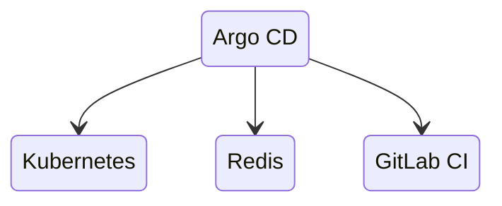
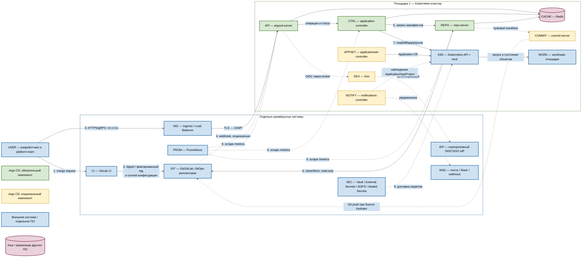

# Argo CD 3.5.2 — GitOps-доставка в Kubernetes

Argo CD — декларативная система непрерывной доставки (**CD**) для Kubernetes. Она сравнивает желаемое состояние из Git с фактическими объектами кластера и синхронизирует различия. Этот документ фиксирует версию **3.5.2**, выпущенную 27 августа 2026 года.

Документация: https://argo-cd.readthedocs.io/en/stable/
Релиз: https://github.com/argoproj/argo-cd/releases/tag/v3.5.2
Образ: `quay.io/argoproj/argocd:v3.5.2`, без тега `latest`.
Установочные манифесты должны быть взяты из тега `v3.5.2`, а не из изменяемой ветки `stable`.

Argo CD — **не CI-система**: он не собирает код и контейнеры. GitLab CI тестирует код, собирает образ и обновляет Git-репозиторий конфигурации; Argo CD применяет это состояние в Kubernetes.

---

## Назначение системы

Argo CD нужен, чтобы выкладки в Kubernetes были воспроизводимыми и проверяемыми: требуемая версия приложения, Helm values или Kustomize overlays хранятся в Git, а контроллер постоянно обнаруживает отклонения кластера от Git.

Для платформы Argo CD является границей между процессом сборки и runtime-кластерами. CI не нужны постоянные административные ключи каждого кластера: он изменяет Git, после чего Argo CD внутри управляемого контура выполняет синхронизацию согласно RBAC и AppProject.

Git остаётся источником желаемого состояния, Kubernetes API и etcd — источниками фактического состояния. Argo CD **не** хранит бизнес-данные, не заменяет резервное копирование, Kafka, Camunda или мониторинг и не делает ошибочный манифест безопасным.

---

## Перечень функций

1. **Сравнивать Git и кластер** и показывать состояния `Synced`/`OutOfSync`, `Healthy`/`Degraded`.
2. **Синхронизировать Kubernetes-ресурсы** вручную или автоматически.
3. **Работать с plain YAML, Helm, Kustomize и Jsonnet**, а также с Config Management Plugins.
4. **Возвращаться к ранее применённой Git-ревизии**; для GitOps предпочтителен revert коммита в Git. Откат Kubernetes-манифеста не откатывает данные БД.
5. **Удалять лишние управляемые ресурсы** (`prune`) и восстанавливать ручные изменения (`selfHeal`) при явно включённой политике.
6. **Упорядочивать применение** через sync phases, waves и hooks.
7. **Ограничивать область управления** объектами `AppProject`: разрешённые репозитории, кластеры, namespaces и виды ресурсов.
8. **Управлять несколькими Kubernetes-кластерами** из одного control plane либо работать отдельным экземпляром на кластер или площадку.
9. **Предоставлять Web UI, CLI, gRPC/REST API**, SSO и собственную RBAC-модель.
10. **Генерировать Applications** контроллером ApplicationSet из Git, списков кластеров и других генераторов.
11. **Принимать Git webhooks** для ускорения обновления; периодическая сверка остаётся основным резервным механизмом обнаружения изменений.
12. **Отдавать Prometheus-метрики** компонентов и создавать события Kubernetes.
13. **Проверять подписи Git-коммитов и тегов** для настроенных проектов.
14. **Показывать diff перед применением**, состояние ресурсов и историю операций.
15. **Опционально отправлять уведомления** через Notifications controller и настроенные внешние каналы.
16. **Опционально гидратировать манифесты и записывать результат в Git** через выключенные по умолчанию Source Hydrator и commit-server; в Argo CD 3.5 эта возможность имеет статус beta.

Чего система не делает: не собирает контейнеры, не сканирует код вместо CI, не является хранилищем секретов, не резервирует etcd и persistent volumes, не гарантирует корректность Helm-шаблона и не должна автоматически синхронизировать всё с правами `cluster-admin`.

---

## Основные элементы системы и зависимости

Argo CD состоит из контроллеров и сетевых сервисов, развёрнутых в Kubernetes. Долговременная конфигурация хранится преимущественно в Kubernetes-объектах и etcd, а желаемое состояние приложений — в Git. Redis является восстанавливаемым кэшем, а не базой данных истины.

**Допущение схемы:** одна площадка, один Kubernetes-кластер, один экземпляр Argo CD **3.5.2**. Stretch control plane на несколько дата-центров нет: порога допустимого RTT у Argo CD для этого нет, а Git и Kubernetes API должны быть доступны этому экземпляру. Продукт умеет управлять несколькими кластерами из одного control plane, но это отдельное решение про сеть, cluster credentials и зону отказа; на схеме его нет.

**Сильная сторона** одного локального экземпляра: reconciliation идёт к своему Kubernetes API без межплощадочной сети, blast radius ограничен этой площадкой. **Слабая:** отказ этой площадки вместе с её etcd останавливает и Argo CD, и новые выкладки; уже запущенные приложения при этом продолжают работать, пока жив сам runtime. **Критично:** не публиковать UI без TLS; не давать `cluster-admin` «по умолчанию»; не хранить открытые секреты в Git; не включать auto-sync+prune+self-heal без теста удаления.

Архитектура: https://argo-cd.readthedocs.io/en/stable/operator-manual/architecture/  
HA: https://argo-cd.readthedocs.io/en/stable/operator-manual/high_availability/

### Схема инстансов и потоков

Имена внутри блоков — роли, не обязательные DNS-имена. Сплошная стрелка — рабочий поток показанной базовой схемы; пунктир — опциональный путь. Направление стрелки — кто открывает соединение. Рамки subgraph **без заливки**: цвет задаёт сам квадратик, подложка его не перекрашивает.

**Легенда:**

- ■ **Зелёный** — процессы Argo CD, без которых базовый GitOps-контур не работает (`argocd-server`, application-controller, repo-server).
- ■ **Жёлтый, пунктирная рамка** — компоненты поставки Argo CD, которые на одной площадке можно не использовать (ApplicationSet, Dex, Notifications, commit-server).
- ■ **Синий** — отдельно развёрнутые системы и участники. Argo CD их не кластеризует и не заменяет.
- ■ **Розовый цилиндр** — Redis как кэш другого ПО. Он входит в манифест поставки, но не является источником истины.

### Описание блоков

#### USER — разработчики и platform team

- **Что это:** люди и их рабочие станции.
- **Технологии и варианты:** браузер, Git-клиент, `argocd` CLI той же версии **3.5.2**.
- **Назначение:** создавать merge request, смотреть diff и запускать разрешённые операции UI/CLI.
- **Развёртывание:** внешние участники, не компонент Argo CD.

#### CI — GitLab CI

- **Что это:** внешняя система непрерывной интеграции.
- **Технологии и варианты:** GitLab CI; конкретный executor и registry задаёт контур CI, не Argo CD.
- **Назначение:** тестировать код, собрать и просканировать образ, зафиксировать неизменяемый digest или фиксированный tag и изменить GitOps-репозиторий. Не должна параллельно выполнять `kubectl apply` для тех же ресурсов.
- **Развёртывание:** отдельно развёрнутая система. Argo CD — CD/GitOps, не CI. ([CI automation](https://argo-cd.readthedocs.io/en/stable/user-guide/ci_automation/))

#### GIT — Git/GitLab: GitOps-репозитории

- **Что это:** Git-сервис и источник желаемого состояния.
- **Технологии и варианты:** GitLab или иной Git; содержимое — plain YAML, Helm values, Kustomize overlays или Jsonnet. Для обычного потока repo-server использует read-only credentials; write нужен только Source Hydrator.
- **Назначение:** хранить историю и манифесты, по которым Argo CD сверяет кластер.
- **Развёртывание:** отдельно развёрнутая система. Git — desired state; Kubernetes/etcd — live state.

#### ING — Ingress / Load Balancer

- **Что это:** внешняя точка входа HTTPS/gRPC к `argocd-server`.
- **Технологии и варианты:** Ingress-контроллер платформы, Service типа LoadBalancer или внешний балансировщик; схема должна учитывать HTTPS и gRPC. ([Ingress](https://argo-cd.readthedocs.io/en/stable/operator-manual/ingress/))
- **Назначение:** публиковать UI/API с TLS. `kubectl port-forward` — только стенд или диагностика, не боевой вход.
- **Развёртывание:** отдельно развёрнутая система, не входит в Argo CD.

#### IDP — корпоративный OIDC/SSO IdP

- **Что это:** внешний провайдер идентификации.
- **Технологии и варианты:** Keycloak, иной корпоративный OIDC; либо прямой OIDC в `argocd-server`, либо через Dex. ([user management](https://argo-cd.readthedocs.io/en/stable/operator-manual/user-management/))
- **Назначение:** выдать identity claims и группы для RBAC. После проверки SSO встроенного `admin` отключают.
- **Развёртывание:** отдельно развёрнутая система. Технически опционален, для production SSO предпочтителен.

#### PROM — Prometheus

- **Что это:** система сбора метрик.
- **Технологии и варианты:** Prometheus; scrape endpoint компонентов версии `v3.5.2`. ([metrics](https://argo-cd.readthedocs.io/en/stable/operator-manual/metrics/))
- **Назначение:** наблюдать control plane. Не участвует в sync и не останавливает уже работающие приложения при своём отказе.
- **Развёртывание:** отдельно развёрнутая система.

#### SEC — механизм секретов

- **Что это:** отдельный контур доставки секретов в Kubernetes.
- **Технологии и варианты:** Vault + External Secrets Operator; SOPS; Sealed Secrets. Архитектуры разные, в ядро Argo CD не входят. Открытые пароли и токены в Git запрещены.
- **Назначение:** дать кластеру секреты, не складывая их открытым текстом в GitOps-репозиторий. Argo CD может синхронизировать ссылки, зашифрованные файлы или CR внешнего оператора, но сам хранилищем секретов не является.
- **Развёртывание:** отдельно развёрнутая система / отдельный оператор.

#### MSG — почта / Slack / webhook

- **Что это:** внешний канал событийных уведомлений.
- **Технологии и варианты:** SMTP, Slack-совместимый API, HTTP webhook; конкретный сервис задаёт Notifications controller, не Argo CD.
- **Назначение:** сообщить о смене статуса Application/AppProject. Нужен только если включён Notifications.
- **Развёртывание:** отдельно развёрнутая система.

#### API — argocd-server

- **Что это:** API-сервер и Web UI экземпляра.
- **Технологии и варианты:** процесс `argocd-server` на Go; образ `quay.io/argoproj/argocd:v3.5.2`. Stateless; в HA — несколько реплик за Service/Ingress. ([architecture](https://argo-cd.readthedocs.io/en/stable/operator-manual/architecture/))
- **Назначение:** UI, REST/gRPC API, CLI, auth/RBAC, приём Git webhook.
- **Развёртывание:** входит в Argo CD, ставится в namespace экземпляра на этой площадке.

#### CTRL — application-controller

- **Что это:** Kubernetes-контроллер приложений.
- **Технологии и варианты:** `argocd-application-controller` на Go, тот же образ `v3.5.2`. Число реплик и шардирование — только после измерений, не из «типовых» CPU/RAM. ([HA](https://argo-cd.readthedocs.io/en/stable/operator-manual/high_availability/))
- **Назначение:** читать `Application`, запросить манифесты у repo-server, сравнить desired/live state, посчитать health, выполнить sync, hooks и prune.
- **Развёртывание:** входит в Argo CD. Права к Kubernetes — минимально достаточные, не безусловный `cluster-admin`.

#### REPO — repo-server

- **Что это:** внутренний сервис генерации манифестов.
- **Технологии и варианты:** `argocd-repo-server` на Go, gRPC **8081**; генераторы — встроенные Helm, Kustomize, Jsonnet или sidecar Config Management Plugin. Непроверенный plugin с произвольным кодом из репозитория не использовать. ([architecture](https://argo-cd.readthedocs.io/en/stable/operator-manual/architecture/))
- **Назначение:** clone/fetch разрешённых Git/Helm/OCI-источников и собрать итоговые манифесты. Сам объекты в кластер не применяет.
- **Развёртывание:** входит в Argo CD, отдельный Deployment от controller.

#### APPSET — applicationset-controller

- **Что это:** контроллер, который создаёт и сопровождает объекты `Application`.
- **Технологии и варианты:** `argocd-applicationset-controller` из поставки 3.5.2; generators — список кластеров, Git directories/files, явный list и другие, описанные в документации. ([ApplicationSet](https://argo-cd.readthedocs.io/en/stable/operator-manual/applicationset/))
- **Назначение:** размножить однотипные `Application` по шаблону. Без него обычные `Application` продолжают работать.
- **Развёртывание:** входит в поставку Argo CD; использование опционально.

#### CACHE — Redis

- **Что это:** восстанавливаемый кэш между компонентами Argo CD.
- **Технологии и варианты:** Redis из манифеста поставки. Non-HA — одиночный экземпляр; HA-манифест — HA-топология с Sentinel. Redis Cluster как замена этой поставки официальная HA-схема не описывает. ([HA](https://argo-cd.readthedocs.io/en/stable/operator-manual/high_availability/))
- **Назначение:** снизить повторные обращения к Git и Kubernetes API и держать кэш UI/состояния. Не хранит желаемое состояние и не является БД истины: её можно пересобрать.
- **Развёртывание:** ставится вместе с Argo CD как зависимость поставки, но это отдельное ПО (кэш), не процесс `argocd-*`. HA Redis сам по себе не делает HA всего Argo CD.

#### DEX — Dex

- **Что это:** опциональный identity broker.
- **Технологии и варианты:** Dex из стандартных манифестов Argo CD; коннекторы к внешним IdP. Не нужен, если `argocd-server` ходит в OIDC напрямую. Несколько реплик Dex могут расходиться: у него in-memory состояние. ([user management](https://argo-cd.readthedocs.io/en/stable/operator-manual/user-management/), [HA](https://argo-cd.readthedocs.io/en/stable/operator-manual/high_availability/))
- **Назначение:** связать UI/API с корпоративным IdP.
- **Развёртывание:** входит в поставку Argo CD отдельным Deployment; использование опционально.

#### NOTIFY — notifications-controller

- **Что это:** контроллер уведомлений.
- **Технологии и варианты:** Notifications controller из поставки Argo CD; templates/triggers и внешний канал (почта, chat, webhook).
- **Назначение:** наблюдать Application/AppProject и отправлять события наружу. В reconciliation и sync не участвует.
- **Развёртывание:** входит в поставку; использование опционально.

#### COMMIT — commit-server

- **Что это:** внутренний gRPC-сервис Source Hydrator.
- **Технологии и варианты:** `argocd-commit-server`; в Argo CD 3.5 функция **beta** и выключена по умолчанию. ([Source Hydrator](https://argo-cd.readthedocs.io/en/stable/user-guide/source-hydrator/))
- **Назначение:** принять уже сгенерированные манифесты и сделать Git push в настроенную ветку.
- **Развёртывание:** входит в поставку отдельным сервисом; для обычного pull-based GitOps не нужен. Требует write credentials к Git.

#### K8S — Kubernetes API + etcd

- **Что это:** control plane управляемого кластера этой площадки.
- **Технологии и варианты:** kube-apiserver и etcd выбранного дистрибутива Kubernetes; порт API — фактический URL кластера, часто **443** или **6443**.
- **Назначение:** хранить CRD/CR `Application`, `AppProject`, `ApplicationSet`, Secrets репозиториев/кластеров и live-объекты. Сюда controller читает состояние и применяет манифесты.
- **Развёртывание:** отдельно развёрнутая платформа. Argo CD не резервирует и не восстанавливает etcd.

#### WORK — workloads площадки

- **Что это:** управляемые приложения и прочие Kubernetes-объекты этой площадки.
- **Технологии и варианты:** Deployment, StatefulSet, Service и соседние системы как workload (Kafka, Camunda, БД) — не внутренние части Argo CD.
- **Назначение:** исполнять полезную нагрузку, которую Argo CD приводит к Git.
- **Развёртывание:** отдельные приложения в том же кластере. Потеря Argo CD не должна их останавливать.

#### Рамки SITE / EXT и блоки легенды

- **Что это:** группировка и пояснение цветов, не runtime-процессы.
- **Технологии и варианты:** служебные блоки Mermaid; заливки у рамок нет, чтобы не перекрашивать квадратики.
- **Назначение:** отделить экземпляр на площадке 1 от внешних систем; легенда повторяет цвета узлов.
- **Развёртывание:** на схему не ставятся.

### Как читать схему

1. **Это одна площадка.** В рамке `Площадка 1` — один Kubernetes-кластер и один экземпляр Argo CD. Второго и третьего ЦОДа на рисунке нет: их появление потребовало бы отдельных экземпляров или явно принятого multi-cluster с измеренным RTT, а не растягивания этого control plane.
2. **Сначала смотрите на цвет квадратика, не на рамку.** Зелёный — ядро Argo CD. Жёлтый пунктир — тот же продукт, но его можно не включать. Синий — чужой жизненный цикл (Git, CI, IdP, Ingress, Kubernetes, Prometheus, секреты, канал уведомлений, workload). Розовый цилиндр — Redis: ставится с продуктом, но это кэш другого ПО. Рамки `SITE` и `EXT` специально без заливки, чтобы не перекрашивать узлы.
3. **Читайте основной путь по номерам 1–9.** Человек инициирует изменение; CI проверяет артефакт и пишет Git; Argo CD читает Git и применяет его к Kubernetes. CI и Argo CD не должны одновременно владеть одними ресурсами.
4. **Шаги 1–2 — это CI, не Argo CD.** Argo CD не компилирует код и не собирает контейнер. На выходе CI должны быть неизменяемый образ (digest или фиксированный tag) и проверяемый commit в GitOps-репозитории.
5. **Шаг 3 — вход человека.** Пользователь не ходит в controller и не ходит в Git «вместо Argo CD». Он приходит на `ING`, тот отдаёт трафик `argocd-server`. Боевой вход — контролируемый Ingress/LB с TLS; `kubectl port-forward` только для закрытого стенда.
6. **Шаг 4 пунктирный, потому что webhook необязателен.** Он только ускоряет refresh. Даже без него application-controller периодически делает reconciliation. Endpoint webhook нужно защищать secret, иначе посторонние вызовы создают лишнюю нагрузку.
7. **Шаги 5–6 превращают Git в манифесты.** Controller передаёт repo-server ссылку, revision, path и параметры. Repo-server клонирует источник и запускает Helm, Kustomize, Jsonnet или разрешённый plugin. Результат он не применяет в кластер.
8. **Шаг 7 — единственное место, где кластер меняют.** Controller читает live state из Kubernetes API, строит diff и при ручном либо явно разрешённом auto-sync вызывает apply. `prune` (удалить пропавшее из Git) и `selfHeal` (вернуть ручной drift) включают отдельно; GitOps сам по себе их не включает. ([auto sync](https://argo-cd.readthedocs.io/en/stable/user-guide/auto_sync/))
9. **Стрелка `APPSET → K8S` создаёт CR, а не workload.** ApplicationSet пишет объекты `Application`. Их уже обрабатывает `CTRL` и уже он управляет `WORK`.
10. **Стрелки к Redis внутренние.** Потеря кэша ухудшает UI и reconciliation до пересборки кэша, но Git и etcd остаются источниками истины. Конфигурацию и бизнес-данные в Redis не кладут.
11. **SSO на схеме показан через Dex.** Это один вариант. Если IdP отдаёт подходящий OIDC, `API` может ходить в `IDP` напрямую, и жёлтый `DEX` отсутствует.
12. **Поток 8 — не часть ядра Argo CD.** Секреты доставляет выбранный внешний механизм в Kubernetes API. Открытый Kubernetes Secret в Git от этого не становится допустимым.
13. **Поток 9 только наблюдает.** Prometheus снимает `/metrics` с включённых компонентов. Он не синхронизирует приложения. Для картины нужны метрики controller и repo-server, не только UI.
14. **Жёлтые `NOTIFY` и `COMMIT` не нужны базовой доставке.** Notifications шлёт события в `MSG`. Source Hydrator, в отличие от обычного read-only pull, требует write в Git и в 3.5 имеет статус beta.
15. **Потеря Argo CD не равна потере приложений.** Исчезает возможность новых sync, refresh и self-heal на этой площадке. Уже созданные объекты в `WORK` продолжают исполняться, пока живы Kubernetes и зависимости самих приложений. Откат Git-манифеста не откатывает данные БД.
16. **Эту схему нельзя читать как multi-cluster.** Если позже появится один Argo CD на несколько кластеров, `CTRL` начнёт ходить к чужим Kubernetes API через межплощадочную сеть, а credentials удалённых кластеров окажутся Secrets в namespace Argo CD. Это другой blast radius и отдельное решение, не «дорисованные квадратики B и C».

### Специальные термины

- **Application** — custom resource Argo CD, связывающий источник манифестов с кластером и namespace назначения.
- **ApplicationSet** — custom resource-шаблон для генерации набора `Application`.
- **AppProject** — policy-граница Argo CD для разрешённых источников, назначений, видов ресурсов, ролей и некоторых sync-ограничений.
- **Auto-sync** — автоматический запуск синхронизации при обнаружении допустимого `OutOfSync`.
- **Blast radius** — область систем и кластеров, которые может затронуть один отказ, credential или ошибочное изменение.
- **CD (Continuous Delivery)** — подготовка и управляемая доставка проверенного изменения в среду; Argo CD реализует CD, но не CI.
- **CI (Continuous Integration)** — сборка, тестирование и проверка кода/образа до изменения желаемого состояния.
- **Config Management Plugin (CMP)** — отдельно настроенный генератор манифестов, обычно sidecar repo-server; выполнение непроверенного кода из репозитория опасно.
- **Control plane Argo CD** — совокупность API-сервера, контроллеров, repo-server и внутренних сервисов Argo CD; не следует путать с Kubernetes control plane.
- **Custom Resource (CR)** — объект Kubernetes пользовательского API, например `Application`.
- **CustomResourceDefinition (CRD)** — схема, регистрирующая пользовательский тип ресурса в Kubernetes API.
- **Desired state** — желаемое состояние ресурсов, сгенерированное из зафиксированного источника Git.
- **Dex** — опциональный identity broker, связывающий Argo CD с внешними провайдерами идентификации.
- **Diff** — вычисленная разница между желаемым манифестом и live-объектом.
- **Digest образа** — неизменяемый криптографический идентификатор содержимого контейнерного образа; надёжнее изменяемого тега.
- **Drift** — отклонение live state от желаемого состояния Git.
- **etcd** — распределённое key-value-хранилище состояния Kubernetes control plane.
- **Generator** — источник параметров ApplicationSet, например список кластеров, Git directories/files или явный list.
- **GitOps** — модель, в которой версионируемый Git задаёт желаемое состояние, а контроллер регулярно сверяет и приводит систему к нему.
- **gRPC** — RPC-протокол поверх HTTP/2, используемый API и внутренними сервисами Argo CD.
- **Health** — оценка работоспособности ресурса или приложения (`Healthy`, `Progressing`, `Degraded` и другие), отдельная от статуса sync.
- **Helm** — пакетный менеджер и шаблонизатор Kubernetes; Argo CD использует Helm для генерации манифестов, но не выполняет `helm install`.
- **Hook** — ресурс, запускаемый на фазе sync, например Job миграции; успешный откат манифеста не означает откат данных миграции.
- **Hydrated manifests** — полностью сгенерированные Kubernetes-манифесты, записываемые Source Hydrator обратно в Git.
- **IdP (Identity Provider)** — внешняя система аутентификации пользователей.
- **Immutable tag** — организационно запрещённый к перезаписи тег образа; digest даёт более строгую идентичность содержимого.
- **Ingress** — Kubernetes-маршрутизация внешнего HTTP(S)/gRPC-трафика к Service по правилам контроллера Ingress.
- **Instance / экземпляр** — независимая установка Argo CD со своими компонентами, конфигурацией и областью управления.
- **Jsonnet** — язык генерации JSON-конфигурации, поддерживаемый Argo CD как источник манифестов.
- **Kustomize** — декларативный инструмент наложения изменений на Kubernetes YAML без шаблонов.
- **Live state** — фактические объекты, прочитанные из Kubernetes API.
- **Multi-cluster** — режим, в котором один экземпляр Argo CD управляет более чем одним Kubernetes-кластером.
- **Namespace** — логическая область изоляции имён и политик внутри Kubernetes-кластера.
- **OIDC (OpenID Connect)** — протокол аутентификации поверх OAuth 2.0 для интеграции с IdP.
- **OutOfSync / Synced** — наличие или отсутствие значимой разницы между desired и live state.
- **Plain YAML** — готовые Kubernetes-манифесты без этапа шаблонизации.
- **Prune** — удаление управляемого ресурса, который исчез из желаемого состояния; требует явного разрешения.
- **Pull-based GitOps** — модель, в которой контроллер внутри управляемого контура сам читает Git и применяет состояние.
- **RBAC (Role-Based Access Control)** — разграничение действий по ролям; RBAC Argo CD и Kubernetes RBAC — разные, совместно действующие уровни.
- **Reconciliation** — повторяющийся цикл чтения desired/live state, сравнения и обновления статуса или исправления расхождения.
- **Repo-server** — внутренний сервис Argo CD для получения источников и генерации манифестов.
- **Revision** — конкретная ветка, tag или commit Git; для воспроизводимости предпочтителен неизменяемый commit/tag.
- **Rollback** — возврат к ранее применённому состоянию; при включённом auto-sync надёжнее revert в Git, а данные внешних систем требуют собственного плана.
- **Runtime** — исполняющиеся приложения и их зависимости, в отличие от управляющего control plane доставки.
- **Self-heal** — автоматическое восстановление желаемых полей после ручного drift; включается отдельно.
- **Sidecar** — дополнительный контейнер в одном Pod; CMP обычно запускается как sidecar рядом с repo-server.
- **Source Hydrator** — beta-функция Argo CD 3.5, генерирующая манифесты и сохраняющая их через commit-server в Git; выключена по умолчанию.
- **SSO (Single Sign-On)** — единый вход через корпоративный IdP.
- **Sync** — применение желаемого состояния к Kubernetes API.
- **Sync phase** — стадия операции (`PreSync`, `Sync`, `PostSync`, `SyncFail`, `PostDelete`), определяющая момент выполнения hook/resource.
- **Sync wave** — числовой порядок применения ресурсов внутри фазы.
- **Webhook** — входящий HTTP-вызов от Git-сервиса, ускоряющий refresh; не заменяет периодический reconciliation.
- **Workload** — исполняемый Kubernetes-ресурс или приложение, которым управляет Argo CD.

### Что входит в состав

| Роль | Статус в поставке | Назначение | Варианты и масштабирование |
|---|---|---|---|
| **`argocd-server`** | Основной компонент | UI, REST/gRPC API, CLI, auth/RBAC, Git webhook | Stateless; несколько реплик за Service/Ingress |
| **`argocd-application-controller`** | Основной компонент | Reconciliation, health, diff, sync, hooks, prune | Несколько реплик и шардирование после измерений |
| **`argocd-repo-server`** | Основной компонент | Clone/fetch и генерация манифестов | Несколько реплик; локальные рабочие данные и внешний Redis-кэш восстанавливаемы |
| **`argocd-applicationset-controller`** | В поставке, использование опционально | Генерация и сопровождение объектов `Application` | Отдельный controller; HA по поддерживаемой конфигурации с leader election |
| **Redis** | Входит как зависимость поставки | Восстанавливаемый кэш | Standalone в non-HA-манифесте; HA-топология в HA-манифесте |
| **Dex** | Опциональный | SSO broker | Отдельный Deployment; исключается при прямом OIDC |
| **Notifications controller** | В поставке, использование опционально | Событийные уведомления | Отдельный controller и внешние каналы |
| **Commit-server / Source Hydrator** | Beta, выключен по умолчанию | Запись сгенерированных манифестов обратно в Git | Отдельный сервис; требует явного включения и write credentials |
| **Config Management Plugin** | Не ядро; опциональное расширение | Пользовательская генерация манифестов | Проверенный sidecar рядом с repo-server |

Git-сервис, GitLab CI, корпоративный IdP, Kubernetes control plane/etcd, Ingress-контроллер, Prometheus, Vault/External Secrets/SOPS/Sealed Secrets и каналы уведомлений **не входят** в Argo CD и разворачиваются отдельно.

### Порты (контракт сети)

| Порт / протокол | Поток | Назначение | Обязательность и ограничение |
|---|---|---|---|
| **443/TCP** | Пользователь/CLI → Ingress или Load Balancer → `argocd-server` | Внешний HTTPS; gRPC для CLI при выбранной схеме публикации | Для production; открыть только доверенным сетям, использовать TLS |
| **80/TCP** | Пользователь → Ingress | Опциональный HTTP redirect на HTTPS | Не публиковать как незашифрованный API |
| **8080/TCP** | Ingress/Service → `argocd-server` container | Внутренний listener API-сервера по умолчанию; TLS termination зависит от схемы | Только внутри кластера/между доверенными прокси; не равен обязательному внешнему порту |
| **8081/TCP** | Компоненты Argo CD → `argocd-repo-server` | Внутренний gRPC repo-server | Только namespace/компоненты Argo CD; поддерживается mTLS |
| **8086/TCP** | Repo-server/компоненты → `argocd-commit-server` | Внутренний gRPC commit-server | Только если включён beta Source Hydrator; закрыт от внешних клиентов |
| **5556/TCP** | `argocd-server` → Dex | Dex HTTP/OIDC connector endpoint | Только при использовании Dex, внутри доверенного контура |
| **6379/TCP** | Компоненты Argo CD → Redis | Кэш | Только компоненты Argo CD; TLS/NetworkPolicy задаются требованиями контура |
| **443/TCP**, обычно | Controller/server → Kubernetes API | Чтение live state и применение ресурсов | Точный порт берётся из URL API конкретного кластера; часто `443` за балансировщиком |
| **6443/TCP**, часто | Controller/server → Kubernetes API | Прямой стандартный secure port kube-apiserver | Не считать универсальным: использовать фактический endpoint кластера |
| **22/TCP** | Repo-server → Git | Git over SSH | Опциональная альтернатива HTTPS; только разрешённые репозитории |
| **443/TCP** | Repo-server → Git/Helm/OCI; commit-server → Git | Git HTTPS, Helm/OCI registry; Git push для Hydrator | Исходящий доступ по allowlist; commit-server write-доступ опционален |
| **443/TCP** | `argocd-server`/Dex → IdP | OIDC discovery, authorize/token/userinfo согласно IdP | Только выбранный SSO-вариант и доверенный CA |
| **Порты `/metrics` из манифеста** | Prometheus → компоненты Argo CD | Prometheus scrape | Не публиковать наружу; значения сверять с Service/ServiceMonitor именно версии `v3.5.2` |
| **Порт внешнего сервиса** | Notifications → почта/chat/webhook | Отправка уведомлений | Опционально; определяется внешним сервисом, не Argo CD |
| **Порт внешнего secret backend** | Secret controller/plugin → Vault/KMS и т. п. | Получение/расшифровка секретов | Опционально; поток принадлежит выбранному механизму секретов |

NetworkPolicy и firewall должны разрешать конкретные направления, а не просто перечисленные номера портов. Порты Service, container port и внешний listener Ingress могут различаться. Метрики, profiling и debug endpoint нельзя публиковать пользователям; profiling по умолчанию выключен.

Официальные источники для проверки:

- архитектура: https://argo-cd.readthedocs.io/en/stable/operator-manual/architecture/
- HA: https://argo-cd.readthedocs.io/en/stable/operator-manual/high_availability/
- Ingress: https://argo-cd.readthedocs.io/en/stable/operator-manual/ingress/
- параметры сервисов и портов: https://argo-cd.readthedocs.io/en/stable/operator-manual/argocd-cmd-params-cm-yaml/
- метрики: https://argo-cd.readthedocs.io/en/stable/operator-manual/metrics/
- SSO: https://argo-cd.readthedocs.io/en/stable/operator-manual/user-management/
- ApplicationSet: https://argo-cd.readthedocs.io/en/stable/operator-manual/applicationset/
- автоматическая синхронизация: https://argo-cd.readthedocs.io/en/stable/user-guide/auto_sync/
- Source Hydrator: https://argo-cd.readthedocs.io/en/stable/user-guide/source-hydrator/
