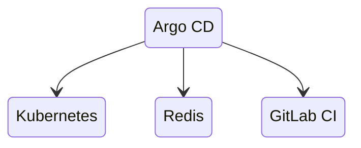

# Argo CD 3.5.2 — GitOps-доставка в Kubernetes

Argo CD — декларативная система непрерывной доставки (**CD**) для Kubernetes. Она сравнивает желаемое состояние из Git с фактическими объектами кластера и синхронизирует различия. Этот документ фиксирует версию **3.5.2**, выпущенную 27 августа 2026 года.

Документация: https://argo-cd.readthedocs.io/en/stable/
Релиз: https://github.com/argoproj/argo-cd/releases/tag/v3.5.2
Образ: `quay.io/argoproj/argocd:v3.5.2`, без тега `latest`.
Установочные манифесты должны быть взяты из тега `v3.5.2`, а не из изменяемой ветки `stable`.

Argo CD — **не CI-система**: он не собирает код и контейнеры. GitLab CI тестирует код, собирает образ и обновляет Git-репозиторий конфигурации; Argo CD применяет это состояние в Kubernetes.

---

## Назначение системы

Argo CD нужен, чтобы выкладки в Kubernetes были воспроизводимыми и проверяемыми: требуемая версия приложения, Helm values или Kustomize overlays хранятся в Git, а контроллер постоянно обнаруживает отклонения кластера от Git.

Для платформы Argo CD является границей между процессом сборки и runtime-кластерами. CI не нужны постоянные административные ключи каждого кластера: он изменяет Git, после чего Argo CD внутри управляемого контура выполняет синхронизацию согласно RBAC и AppProject.

Git остаётся источником желаемого состояния, Kubernetes API и etcd — источниками фактического состояния. Argo CD **не** хранит бизнес-данные, не заменяет резервное копирование, Kafka, Camunda или мониторинг и не делает ошибочный манифест безопасным.

---

## Перечень функций

1. **Сравнивать Git и кластер** и показывать состояния `Synced`/`OutOfSync`, `Healthy`/`Degraded`.
2. **Синхронизировать Kubernetes-ресурсы** вручную или автоматически.
3. **Работать с plain YAML, Helm, Kustomize и Jsonnet**, а также с Config Management Plugins.
4. **Возвращаться к ранее применённой Git-ревизии**; для GitOps предпочтителен revert коммита в Git. Откат Kubernetes-манифеста не откатывает данные БД.
5. **Удалять лишние управляемые ресурсы** (`prune`) и восстанавливать ручные изменения (`selfHeal`) при явно включённой политике.
6. **Упорядочивать применение** через sync phases, waves и hooks.
7. **Ограничивать область управления** объектами `AppProject`: разрешённые репозитории, кластеры, namespaces и виды ресурсов.
8. **Управлять несколькими Kubernetes-кластерами** из одного control plane либо работать отдельным экземпляром на кластер или площадку.
9. **Предоставлять Web UI, CLI, gRPC/REST API**, SSO и собственную RBAC-модель.
10. **Генерировать Applications** контроллером ApplicationSet из Git, списков кластеров и других генераторов.
11. **Принимать Git webhooks** для ускорения обновления; периодическая сверка остаётся основным резервным механизмом обнаружения изменений.
12. **Отдавать Prometheus-метрики** компонентов и создавать события Kubernetes.
13. **Проверять подписи Git-коммитов и тегов** для настроенных проектов.
14. **Показывать diff перед применением**, состояние ресурсов и историю операций.
15. **Опционально отправлять уведомления** через Notifications controller и настроенные внешние каналы.
16. **Опционально гидратировать манифесты и записывать результат в Git** через выключенные по умолчанию Source Hydrator и commit-server; в Argo CD 3.5 эта возможность имеет статус beta.

Чего система не делает: не собирает контейнеры, не сканирует код вместо CI, не является хранилищем секретов, не резервирует etcd и persistent volumes, не гарантирует корректность Helm-шаблона и не должна автоматически синхронизировать всё с правами `cluster-admin`.

---

## Основные элементы системы и зависимости

Argo CD состоит из контроллеров и сетевых сервисов, развёрнутых в Kubernetes. Долговременная конфигурация хранится преимущественно в Kubernetes-объектах и etcd, а желаемое состояние приложений — в Git. Redis является восстанавливаемым кэшем, а не базой данных истины.

Ниже показано **проектное допущение** для трёх площадок при неизвестной задержке сети: по отдельному экземпляру Argo CD в каждом Kubernetes-кластере. Это уменьшает зависимость reconciliation от межплощадочной сети и радиус поражения. Альтернатива — один центральный экземпляр, управляющий несколькими кластерами; её можно выбирать только после проверки доступности Kubernetes API, RTT, модели cluster credentials и допустимой общей зоны отказа.

### Схема инстансов и потоков

```mermaid
flowchart TB
  USER["EXT-USER<br/>Разработчики и platform team"]
  CI["EXT-CI<br/>GitLab CI"]
  GIT["EXT-GIT<br/>Git/GitLab: GitOps-репозитории"]
  IDP["EXT-IDP<br/>Корпоративный OIDC/SSO IdP"]
  PROM["EXT-PROM<br/>Prometheus"]
  SECRETS["EXT-SEC<br/>Vault / External Secrets / SOPS / Sealed Secrets"]
  CHANNEL["EXT-MSG<br/>Почта / Slack / webhook-получатель"]

  subgraph SITE_A["Площадка A — Kubernetes-кластер A"]
    direction TB
    subgraph ARGO_A["INST-A — экземпляр Argo CD 3.5.2"]
      direction LR
      API_A["A-API<br/>argocd-server"]
      CTRL_A["A-CTRL<br/>application-controller"]
      REPO_A["A-REPO<br/>repo-server"]
      APPSET_A["A-APPSET<br/>applicationset-controller"]
      REDIS_A["A-CACHE<br/>Redis"]
      DEX_A["A-DEX<br/>Dex, опционально"]
      NOTIF_A["A-NOTIFY<br/>notifications-controller, опционально"]
      COMMIT_A["A-COMMIT<br/>commit-server, beta и опционально"]
    end
    KAPI_A["EXT-K8S-A<br/>Kubernetes API + etcd кластера A"]
    WORK_A["EXT-WORK-A<br/>Workloads площадки A"]
  end

  subgraph SITE_B["Площадка B — Kubernetes-кластер B"]
    direction TB
    subgraph ARGO_B["INST-B — экземпляр Argo CD 3.5.2"]
      direction LR
      API_B["B-API<br/>argocd-server"]
      CTRL_B["B-CTRL<br/>application-controller"]
      REPO_B["B-REPO<br/>repo-server"]
      APPSET_B["B-APPSET<br/>applicationset-controller"]
      REDIS_B["B-CACHE<br/>Redis"]
      DEX_B["B-DEX<br/>Dex, опционально"]
      NOTIF_B["B-NOTIFY<br/>notifications-controller, опционально"]
      COMMIT_B["B-COMMIT<br/>commit-server, beta и опционально"]
    end
    KAPI_B["EXT-K8S-B<br/>Kubernetes API + etcd кластера B"]
    WORK_B["EXT-WORK-B<br/>Workloads площадки B"]
  end

  subgraph SITE_C["Площадка C — Kubernetes-кластер C"]
    direction TB
    subgraph ARGO_C["INST-C — экземпляр Argo CD 3.5.2"]
      direction LR
      API_C["C-API<br/>argocd-server"]
      CTRL_C["C-CTRL<br/>application-controller"]
      REPO_C["C-REPO<br/>repo-server"]
      APPSET_C["C-APPSET<br/>applicationset-controller"]
      REDIS_C["C-CACHE<br/>Redis"]
      DEX_C["C-DEX<br/>Dex, опционально"]
      NOTIF_C["C-NOTIFY<br/>notifications-controller, опционально"]
      COMMIT_C["C-COMMIT<br/>commit-server, beta и опционально"]
    end
    KAPI_C["EXT-K8S-C<br/>Kubernetes API + etcd кластера C"]
    WORK_C["EXT-WORK-C<br/>Workloads площадки C"]
  end

  USER -->|"1. merge request"| CI
  CI -->|"2. immutable image digest / фиксированный tag<br/>и commit конфигурации"| GIT
  USER -->|"3. HTTPS/gRPC: UI и CLI"| API_A
  USER -->|"3. HTTPS/gRPC: UI и CLI"| API_B
  USER -->|"3. HTTPS/gRPC: UI и CLI"| API_C
  GIT -.->|"4. webhook, опциональное ускорение"| API_A
  GIT -.->|"4. webhook, опциональное ускорение"| API_B
  GIT -.->|"4. webhook, опциональное ускорение"| API_C

  API_A -->|"операции и статус"| CTRL_A
  CTRL_A -->|"5. запрос манифестов"| REPO_A
  REPO_A -->|"6. clone/fetch, read-only"| GIT
  CTRL_A -->|"7. read/diff/apply/prune"| KAPI_A
  APPSET_A -->|"создание/изменение Application CR"| KAPI_A
  KAPI_A -->|"запуск и состояние объектов"| WORK_A
  API_A --> REDIS_A
  CTRL_A --> REDIS_A
  REPO_A --> REDIS_A
  API_A -.->|"OIDC через broker"| DEX_A
  DEX_A -.->|"аутентификация"| IDP
  NOTIF_A -.->|"наблюдение Application/AppProject"| KAPI_A
  NOTIF_A -.->|"уведомление"| CHANNEL
  REPO_A -.->|"hydrated manifests"| COMMIT_A
  COMMIT_A -.->|"Git push при Source Hydrator"| GIT

  API_B -->|"операции и статус"| CTRL_B
  CTRL_B -->|"5. запрос манифестов"| REPO_B
  REPO_B -->|"6. clone/fetch, read-only"| GIT
  CTRL_B -->|"7. read/diff/apply/prune"| KAPI_B
  APPSET_B -->|"создание/изменение Application CR"| KAPI_B
  KAPI_B -->|"запуск и состояние объектов"| WORK_B
  API_B --> REDIS_B
  CTRL_B --> REDIS_B
  REPO_B --> REDIS_B
  API_B -.->|"OIDC через broker"| DEX_B
  DEX_B -.->|"аутентификация"| IDP
  NOTIF_B -.->|"наблюдение Application/AppProject"| KAPI_B
  NOTIF_B -.->|"уведомление"| CHANNEL
  REPO_B -.->|"hydrated manifests"| COMMIT_B
  COMMIT_B -.->|"Git push при Source Hydrator"| GIT

  API_C -->|"операции и статус"| CTRL_C
  CTRL_C -->|"5. запрос манифестов"| REPO_C
  REPO_C -->|"6. clone/fetch, read-only"| GIT
  CTRL_C -->|"7. read/diff/apply/prune"| KAPI_C
  APPSET_C -->|"создание/изменение Application CR"| KAPI_C
  KAPI_C -->|"запуск и состояние объектов"| WORK_C
  API_C --> REDIS_C
  CTRL_C --> REDIS_C
  REPO_C --> REDIS_C
  API_C -.->|"OIDC через broker"| DEX_C
  DEX_C -.->|"аутентификация"| IDP
  NOTIF_C -.->|"наблюдение Application/AppProject"| KAPI_C
  NOTIF_C -.->|"уведомление"| CHANNEL
  REPO_C -.->|"hydrated manifests"| COMMIT_C
  COMMIT_C -.->|"Git push при Source Hydrator"| GIT

  SECRETS -.->|"8. отдельный механизм доставки секретов"| KAPI_A
  SECRETS -.->|"8. отдельный механизм доставки секретов"| KAPI_B
  SECRETS -.->|"8. отдельный механизм доставки секретов"| KAPI_C
  PROM -.->|"9. scrape /metrics"| API_A
  PROM -.->|"9. scrape /metrics"| CTRL_A
  PROM -.->|"9. scrape /metrics"| REPO_A
  PROM -.->|"9. scrape /metrics"| API_B
  PROM -.->|"9. scrape /metrics"| CTRL_B
  PROM -.->|"9. scrape /metrics"| REPO_B
  PROM -.->|"9. scrape /metrics"| API_C
  PROM -.->|"9. scrape /metrics"| CTRL_C
  PROM -.->|"9. scrape /metrics"| REPO_C

  LEGEND_INTERNAL["Легенда: синий — компонент Argo CD"]
  LEGEND_EXTERNAL["Легенда: оранжевый — внешняя система"]
  LEGEND_OPTIONAL["Легенда: пунктир — опциональный поток или компонент"]

  classDef internal fill:#dae8fc,stroke:#6c8ebf,color:#000;
  classDef external fill:#ffe6cc,stroke:#d79b00,color:#000;
  classDef optional fill:#e1d5e7,stroke:#9673a6,color:#000,stroke-dasharray: 5 5;
  classDef legend fill:#f5f5f5,stroke:#666,color:#000;

  class API_A,CTRL_A,REPO_A,APPSET_A,REDIS_A,API_B,CTRL_B,REPO_B,APPSET_B,REDIS_B,API_C,CTRL_C,REPO_C,APPSET_C,REDIS_C internal;
  class USER,CI,GIT,IDP,PROM,SECRETS,CHANNEL,KAPI_A,WORK_A,KAPI_B,WORK_B,KAPI_C,WORK_C external;
  class DEX_A,NOTIF_A,COMMIT_A,DEX_B,NOTIF_B,COMMIT_B,DEX_C,NOTIF_C,COMMIT_C optional;
  class LEGEND_INTERNAL,LEGEND_EXTERNAL,LEGEND_OPTIONAL legend;
```

Сплошная стрелка обозначает обязательный для показанного базового потока вызов, пунктирная — опциональную интеграцию. Цвет показывает принадлежность, а не степень доверия: оранжевый Kubernetes API остаётся критической внешней зависимостью каждого экземпляра.

### Описание блоков

Повторяющиеся блоки `A-*`, `B-*` и `C-*` имеют одинаковую роль, но являются отдельными Deployment/Service/Pod-наборами в соответствующих кластерах. Их отказ и credentials не должны автоматически распространяться на другие площадки.

- **`EXT-USER` — разработчики и platform team.** Люди и их рабочие станции с браузером, Git-клиентом и `argocd` CLI. Создают merge request, рассматривают diff и запускают разрешённые операции. Это внешние участники, не компонент Argo CD.
- **`EXT-CI` — GitLab CI.** Внешняя CI-система: тестирует код, собирает и сканирует образ, публикует неизменяемый digest или фиксированный tag и изменяет GitOps-репозиторий. Не должна параллельно выполнять `kubectl apply` для тех же ресурсов.
- **`EXT-GIT` — Git/GitLab.** Внешний Git-сервис и источник желаемого состояния. Хранит историю, манифесты, Helm values или Kustomize overlays. Для обычного потока repo-server получает read-only credentials; write-доступ требуется только опциональному Source Hydrator/commit-server.
- **`EXT-IDP` — корпоративный IdP.** Внешний OIDC-провайдер идентификации, например Keycloak или корпоративный сервис. Выдаёт identity claims и группы для RBAC. Опционален технически, но для production SSO предпочтительнее постоянного использования встроенного `admin`.
- **`EXT-PROM` — Prometheus.** Отдельно развёрнутая система мониторинга, которая снимает метрики с endpoint компонентов. Не входит в Argo CD; её отказ не останавливает уже работающие приложения.
- **`EXT-SEC` — механизм секретов.** Внешняя интеграция: Vault с External Secrets Operator, SOPS или Sealed Secrets. Эти варианты различаются архитектурой и не входят в ядро Argo CD. Открытые пароли и токены хранить в Git нельзя.
- **`EXT-MSG` — канал уведомлений.** Отдельная почтовая система, Slack-совместимый канал или HTTP webhook-получатель. Нужен только при использовании Notifications controller.
- **`INST-A`, `INST-B`, `INST-C` — экземпляры Argo CD.** Три независимо развёрнутых control plane Argo CD 3.5.2. Каждый управляет локальным кластером в базовой схеме. Вариант, где один экземпляр управляет удалёнными кластерами, поддерживается, но требует отдельного сетевого и security-решения.
- **`A/B/C-API` — `argocd-server`.** Stateless-сервис на Go с Web UI, REST/gRPC API, endpoint Git webhook, аутентификацией и проверкой RBAC. Входит в Argo CD и разворачивается внутри каждого экземпляра; в HA-варианте масштабируется несколькими репликами за Kubernetes Service/Ingress.
- **`A/B/C-CTRL` — `argocd-application-controller`.** Kubernetes controller на Go. Читает `Application`, запрашивает манифесты у repo-server, сравнивает desired/live state, вычисляет health и выполняет sync, hooks и prune. Встроен в Argo CD; права к Kubernetes должны быть минимально достаточными, а не безусловный `cluster-admin`.
- **`A/B/C-REPO` — `argocd-repo-server`.** Внутренний gRPC-сервис на Go. Клонирует разрешённые Git/Helm/OCI-источники, кэширует данные и генерирует итоговые манифесты через встроенные Helm, Kustomize, Jsonnet или sidecar Config Management Plugin. Входит в Argo CD и разворачивается отдельно от controller; ему не нужны права на применение объектов в Kubernetes.
- **`A/B/C-APPSET` — `argocd-applicationset-controller`.** Kubernetes controller на Go, создающий и изменяющий объекты `Application` по generators и template. Входит в поставку и разворачивается отдельным Deployment. Опционален по использованию: без `ApplicationSet` обычные `Application` продолжают работать.
- **`A/B/C-CACHE` — Redis.** Отдельный Pod/набор Pod внутри поставки Argo CD, используемый как восстанавливаемый кэш и средство обмена кэшированными данными. Redis не является источником истины. В non-HA-манифесте применяется простой вариант; HA-поставка использует HA-топологию, но HA Redis не делает доступными остальные компоненты автоматически.
- **`A/B/C-DEX` — Dex.** Опциональный identity broker, поставляемый отдельным Deployment в стандартных манифестах. Соединяет `argocd-server` с поддерживаемыми identity-коннекторами. Можно не использовать, если `argocd-server` подключён к OIDC-провайдеру напрямую.
- **`A/B/C-NOTIFY` — Notifications controller.** Опционально используемый отдельный controller из поставки Argo CD. Наблюдает ресурсы и отправляет уведомления по templates/triggers в настроенные внешние сервисы. Не участвует в reconciliation и sync.
- **`A/B/C-COMMIT` — commit-server.** Опциональный внутренний gRPC-сервис Source Hydrator. В Argo CD 3.5 функция beta и выключена по умолчанию; сервис принимает сгенерированные манифесты и выполняет Git push в настроенную ветку. Разворачивается отдельно, требует write credentials и не нужен обычному pull-based GitOps-потоку.
- **`EXT-K8S-A/B/C` — Kubernetes API и etcd.** Внешний относительно Argo CD control plane API управляемого кластера и его хранилище состояния. Здесь находятся CRD/CR `Application`, `AppProject`, `ApplicationSet`, cluster/repository Secrets и живые workload-объекты. Kubernetes развёрнут отдельно; Argo CD не резервирует и не восстанавливает etcd.
- **`EXT-WORK-A/B/C` — workloads.** Управляемые приложения и инфраструктурные Kubernetes-объекты площадки: Deployment, StatefulSet, Service, Kafka/Camunda-компоненты и другие ресурсы. Они развёрнуты отдельно от Argo CD и после потери Argo CD продолжают работать, пока зависящие от них runtime-системы исправны.
- **`LEGEND-*` — легенда.** Служебные блоки диаграммы: синий означает компоненты Argo CD, оранжевый — внешние системы, фиолетовый пунктирный блок и пунктирные стрелки — опциональность. Они не представляют runtime-компоненты.

### Как читать схему

1. **Сначала определите границы экземпляров.** Внутри `INST-A`, `INST-B`, `INST-C` находятся компоненты трёх независимых Argo CD. Kubernetes API нарисован снаружи этих границ, потому что Argo CD использует Kubernetes, но не является его control plane.
2. **Читайте основной путь по номерам от 1 до 9.** Разработчик инициирует изменение через merge request; CI проверяет артефакт и фиксирует новую версию в Git; Argo CD затем получает желаемое состояние и применяет его. CI и Argo CD не должны одновременно владеть одними ресурсами.
3. **Шаги 1–2 относятся к CI, а не к Argo CD.** Argo CD не компилирует код и не строит контейнер. Результатом CI должен быть неизменяемый образ и проверяемое изменение Git.
4. **Шаг 3 — административный поток.** Пользователь работает с `argocd-server` через UI или CLI. Для production endpoint публикуется через контролируемый Ingress/Load Balancer с TLS; `kubectl port-forward` подходит только для закрытого стенда или диагностики.
5. **Шаг 4 пунктирный, потому что webhook необязателен.** Webhook лишь ускоряет refresh. Даже без него application-controller периодически выполняет reconciliation. Webhook endpoint следует защищать secret, иначе публичные запросы могут создавать лишнюю нагрузку.
6. **Шаги 5–6 превращают Git-источник в манифесты.** Controller передаёт repo-server ссылку, revision, path и параметры. Repo-server получает содержимое Git и запускает Helm/Kustomize/Jsonnet или разрешённый plugin как генератор, но сам не применяет результат в кластер.
7. **Шаг 7 объединяет чтение и изменение Kubernetes.** Controller читает live state, строит diff и при ручной либо разрешённой автоматической синхронизации вызывает Kubernetes API. `prune` и `selfHeal` — независимые настройки; они не включаются самим фактом включения GitOps.
8. **Стрелка `APPSET → K8S API` означает создание CR, а не workload напрямую.** ApplicationSet controller создаёт объекты `Application`; application-controller уже обрабатывает их и управляет целевыми ресурсами.
9. **Связи с Redis внутренние.** Потеря кэша ухудшает работу control plane до восстановления, но Git и Kubernetes/etcd остаются источниками истины. В Redis нельзя полагаться на долговременное хранение конфигурации или бизнес-данных.
10. **SSO имеет два допустимых варианта.** На схеме показан Dex как broker. Если корпоративный IdP поддерживает подходящий OIDC, `argocd-server` может обращаться к нему напрямую, и блок Dex отсутствует.
11. **Доставка секретов вынесена в отдельный поток 8.** Argo CD может синхронизировать ссылки, зашифрованные документы или CR внешнего оператора, но не делает открытый Kubernetes Secret в Git безопасным. Выбор Vault/External Secrets, SOPS или Sealed Secrets является отдельным архитектурным решением.
12. **Мониторинг в шаге 9 наблюдает, но не управляет.** Prometheus читает `/metrics`; он не участвует в sync. Для полной картины собирают метрики всех включённых компонентов, а не только `argocd-server`.
13. **Notifications и Source Hydrator показаны пунктиром.** Они не нужны базовой доставке. Notifications отправляет события наружу. Source Hydrator, напротив обычного read-only pull-потока, требует commit-server и контролируемого write-доступа в Git.
14. **Три площадки используют общий Git, но не общее runtime-состояние Argo CD.** Один commit может быть источником для всех экземпляров, однако продвижение по средам следует разделять ветками, каталогами, тегами или pull request-процессом так, чтобы ошибка не синхронизировалась во все площадки без контроля.
15. **Потеря одного экземпляра не должна останавливать workload.** Она прекращает для его площадки новые sync, refresh и self-heal, но уже созданные Kubernetes-объекты продолжают исполняться. Потеря Kubernetes control plane или зависимостей самого приложения имеет другие последствия и Argo CD их не устраняет.
16. **Центральный multi-cluster вариант меняет стрелки.** Тогда `A-CTRL`, например, обращается также к `EXT-K8S-B/C` через межплощадочную сеть, а credentials удалённых кластеров хранятся как Secrets в namespace Argo CD. Это увеличивает общий blast radius и не принимается без измерений RTT и требований доступности.

### Специальные термины

- **Application** — custom resource Argo CD, связывающий источник манифестов с кластером и namespace назначения.
- **ApplicationSet** — custom resource-шаблон для генерации набора `Application`.
- **AppProject** — policy-граница Argo CD для разрешённых источников, назначений, видов ресурсов, ролей и некоторых sync-ограничений.
- **Auto-sync** — автоматический запуск синхронизации при обнаружении допустимого `OutOfSync`.
- **Blast radius** — область систем и кластеров, которые может затронуть один отказ, credential или ошибочное изменение.
- **CD (Continuous Delivery)** — подготовка и управляемая доставка проверенного изменения в среду; Argo CD реализует CD, но не CI.
- **CI (Continuous Integration)** — сборка, тестирование и проверка кода/образа до изменения желаемого состояния.
- **Config Management Plugin (CMP)** — отдельно настроенный генератор манифестов, обычно sidecar repo-server; выполнение непроверенного кода из репозитория опасно.
- **Control plane Argo CD** — совокупность API-сервера, контроллеров, repo-server и внутренних сервисов Argo CD; не следует путать с Kubernetes control plane.
- **Custom Resource (CR)** — объект Kubernetes пользовательского API, например `Application`.
- **CustomResourceDefinition (CRD)** — схема, регистрирующая пользовательский тип ресурса в Kubernetes API.
- **Desired state** — желаемое состояние ресурсов, сгенерированное из зафиксированного источника Git.
- **Dex** — опциональный identity broker, связывающий Argo CD с внешними провайдерами идентификации.
- **Diff** — вычисленная разница между желаемым манифестом и live-объектом.
- **Digest образа** — неизменяемый криптографический идентификатор содержимого контейнерного образа; надёжнее изменяемого тега.
- **Drift** — отклонение live state от желаемого состояния Git.
- **etcd** — распределённое key-value-хранилище состояния Kubernetes control plane.
- **Generator** — источник параметров ApplicationSet, например список кластеров, Git directories/files или явный list.
- **GitOps** — модель, в которой версионируемый Git задаёт желаемое состояние, а контроллер регулярно сверяет и приводит систему к нему.
- **gRPC** — RPC-протокол поверх HTTP/2, используемый API и внутренними сервисами Argo CD.
- **Health** — оценка работоспособности ресурса или приложения (`Healthy`, `Progressing`, `Degraded` и другие), отдельная от статуса sync.
- **Helm** — пакетный менеджер и шаблонизатор Kubernetes; Argo CD использует Helm для генерации манифестов, но не выполняет `helm install`.
- **Hook** — ресурс, запускаемый на фазе sync, например Job миграции; успешный откат манифеста не означает откат данных миграции.
- **Hydrated manifests** — полностью сгенерированные Kubernetes-манифесты, записываемые Source Hydrator обратно в Git.
- **IdP (Identity Provider)** — внешняя система аутентификации пользователей.
- **Immutable tag** — организационно запрещённый к перезаписи тег образа; digest даёт более строгую идентичность содержимого.
- **Ingress** — Kubernetes-маршрутизация внешнего HTTP(S)/gRPC-трафика к Service по правилам контроллера Ingress.
- **Instance / экземпляр** — независимая установка Argo CD со своими компонентами, конфигурацией и областью управления.
- **Jsonnet** — язык генерации JSON-конфигурации, поддерживаемый Argo CD как источник манифестов.
- **Kustomize** — декларативный инструмент наложения изменений на Kubernetes YAML без шаблонов.
- **Live state** — фактические объекты, прочитанные из Kubernetes API.
- **Multi-cluster** — режим, в котором один экземпляр Argo CD управляет более чем одним Kubernetes-кластером.
- **Namespace** — логическая область изоляции имён и политик внутри Kubernetes-кластера.
- **OIDC (OpenID Connect)** — протокол аутентификации поверх OAuth 2.0 для интеграции с IdP.
- **OutOfSync / Synced** — наличие или отсутствие значимой разницы между desired и live state.
- **Plain YAML** — готовые Kubernetes-манифесты без этапа шаблонизации.
- **Prune** — удаление управляемого ресурса, который исчез из желаемого состояния; требует явного разрешения.
- **Pull-based GitOps** — модель, в которой контроллер внутри управляемого контура сам читает Git и применяет состояние.
- **RBAC (Role-Based Access Control)** — разграничение действий по ролям; RBAC Argo CD и Kubernetes RBAC — разные, совместно действующие уровни.
- **Reconciliation** — повторяющийся цикл чтения desired/live state, сравнения и обновления статуса или исправления расхождения.
- **Repo-server** — внутренний сервис Argo CD для получения источников и генерации манифестов.
- **Revision** — конкретная ветка, tag или commit Git; для воспроизводимости предпочтителен неизменяемый commit/tag.
- **Rollback** — возврат к ранее применённому состоянию; при включённом auto-sync надёжнее revert в Git, а данные внешних систем требуют собственного плана.
- **Runtime** — исполняющиеся приложения и их зависимости, в отличие от управляющего control plane доставки.
- **Self-heal** — автоматическое восстановление желаемых полей после ручного drift; включается отдельно.
- **Sidecar** — дополнительный контейнер в одном Pod; CMP обычно запускается как sidecar рядом с repo-server.
- **Source Hydrator** — beta-функция Argo CD 3.5, генерирующая манифесты и сохраняющая их через commit-server в Git; выключена по умолчанию.
- **SSO (Single Sign-On)** — единый вход через корпоративный IdP.
- **Sync** — применение желаемого состояния к Kubernetes API.
- **Sync phase** — стадия операции (`PreSync`, `Sync`, `PostSync`, `SyncFail`, `PostDelete`), определяющая момент выполнения hook/resource.
- **Sync wave** — числовой порядок применения ресурсов внутри фазы.
- **Webhook** — входящий HTTP-вызов от Git-сервиса, ускоряющий refresh; не заменяет периодический reconciliation.
- **Workload** — исполняемый Kubernetes-ресурс или приложение, которым управляет Argo CD.

### Что входит в состав

| Роль | Статус в поставке | Назначение | Варианты и масштабирование |
|---|---|---|---|
| **`argocd-server`** | Основной компонент | UI, REST/gRPC API, CLI, auth/RBAC, Git webhook | Stateless; несколько реплик за Service/Ingress |
| **`argocd-application-controller`** | Основной компонент | Reconciliation, health, diff, sync, hooks, prune | Несколько реплик и шардирование после измерений |
| **`argocd-repo-server`** | Основной компонент | Clone/fetch и генерация манифестов | Несколько реплик; локальные рабочие данные и внешний Redis-кэш восстанавливаемы |
| **`argocd-applicationset-controller`** | В поставке, использование опционально | Генерация и сопровождение объектов `Application` | Отдельный controller; HA по поддерживаемой конфигурации с leader election |
| **Redis** | Входит как зависимость поставки | Восстанавливаемый кэш | Standalone в non-HA-манифесте; HA-топология в HA-манифесте |
| **Dex** | Опциональный | SSO broker | Отдельный Deployment; исключается при прямом OIDC |
| **Notifications controller** | В поставке, использование опционально | Событийные уведомления | Отдельный controller и внешние каналы |
| **Commit-server / Source Hydrator** | Beta, выключен по умолчанию | Запись сгенерированных манифестов обратно в Git | Отдельный сервис; требует явного включения и write credentials |
| **Config Management Plugin** | Не ядро; опциональное расширение | Пользовательская генерация манифестов | Проверенный sidecar рядом с repo-server |

Git-сервис, GitLab CI, корпоративный IdP, Kubernetes control plane/etcd, Ingress-контроллер, Prometheus, Vault/External Secrets/SOPS/Sealed Secrets и каналы уведомлений **не входят** в Argo CD и разворачиваются отдельно.

### Порты (контракт сети)

| Порт / протокол | Поток | Назначение | Обязательность и ограничение |
|---|---|---|---|
| **443/TCP** | Пользователь/CLI → Ingress или Load Balancer → `argocd-server` | Внешний HTTPS; gRPC для CLI при выбранной схеме публикации | Для production; открыть только доверенным сетям, использовать TLS |
| **80/TCP** | Пользователь → Ingress | Опциональный HTTP redirect на HTTPS | Не публиковать как незашифрованный API |
| **8080/TCP** | Ingress/Service → `argocd-server` container | Внутренний listener API-сервера по умолчанию; TLS termination зависит от схемы | Только внутри кластера/между доверенными прокси; не равен обязательному внешнему порту |
| **8081/TCP** | Компоненты Argo CD → `argocd-repo-server` | Внутренний gRPC repo-server | Только namespace/компоненты Argo CD; поддерживается mTLS |
| **8086/TCP** | Repo-server/компоненты → `argocd-commit-server` | Внутренний gRPC commit-server | Только если включён beta Source Hydrator; закрыт от внешних клиентов |
| **5556/TCP** | `argocd-server` → Dex | Dex HTTP/OIDC connector endpoint | Только при использовании Dex, внутри доверенного контура |
| **6379/TCP** | Компоненты Argo CD → Redis | Кэш | Только компоненты Argo CD; TLS/NetworkPolicy задаются требованиями контура |
| **443/TCP**, обычно | Controller/server → Kubernetes API | Чтение live state и применение ресурсов | Точный порт берётся из URL API конкретного кластера; часто `443` за балансировщиком |
| **6443/TCP**, часто | Controller/server → Kubernetes API | Прямой стандартный secure port kube-apiserver | Не считать универсальным: использовать фактический endpoint кластера |
| **22/TCP** | Repo-server → Git | Git over SSH | Опциональная альтернатива HTTPS; только разрешённые репозитории |
| **443/TCP** | Repo-server → Git/Helm/OCI; commit-server → Git | Git HTTPS, Helm/OCI registry; Git push для Hydrator | Исходящий доступ по allowlist; commit-server write-доступ опционален |
| **443/TCP** | `argocd-server`/Dex → IdP | OIDC discovery, authorize/token/userinfo согласно IdP | Только выбранный SSO-вариант и доверенный CA |
| **Порты `/metrics` из манифеста** | Prometheus → компоненты Argo CD | Prometheus scrape | Не публиковать наружу; значения сверять с Service/ServiceMonitor именно версии `v3.5.2` |
| **Порт внешнего сервиса** | Notifications → почта/chat/webhook | Отправка уведомлений | Опционально; определяется внешним сервисом, не Argo CD |
| **Порт внешнего secret backend** | Secret controller/plugin → Vault/KMS и т. п. | Получение/расшифровка секретов | Опционально; поток принадлежит выбранному механизму секретов |

NetworkPolicy и firewall должны разрешать конкретные направления, а не просто перечисленные номера портов. Порты Service, container port и внешний listener Ingress могут различаться. Метрики, profiling и debug endpoint нельзя публиковать пользователям; profiling по умолчанию выключен.

Официальные источники для проверки:

- архитектура: https://argo-cd.readthedocs.io/en/stable/operator-manual/architecture/
- HA: https://argo-cd.readthedocs.io/en/stable/operator-manual/high_availability/
- Ingress: https://argo-cd.readthedocs.io/en/stable/operator-manual/ingress/
- параметры сервисов и портов: https://argo-cd.readthedocs.io/en/stable/operator-manual/argocd-cmd-params-cm-yaml/
- метрики: https://argo-cd.readthedocs.io/en/stable/operator-manual/metrics/
- SSO: https://argo-cd.readthedocs.io/en/stable/operator-manual/user-management/
- ApplicationSet: https://argo-cd.readthedocs.io/en/stable/operator-manual/applicationset/
- автоматическая синхронизация: https://argo-cd.readthedocs.io/en/stable/user-guide/auto_sync/
- Source Hydrator: https://argo-cd.readthedocs.io/en/stable/user-guide/source-hydrator/
