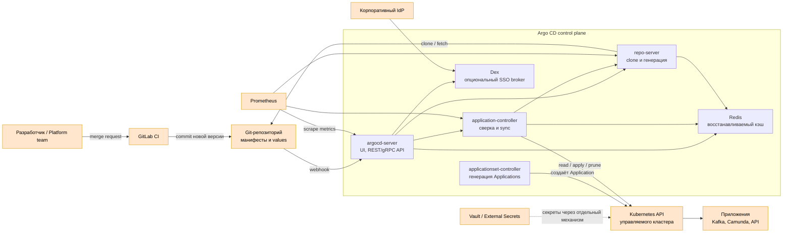

# Argo CD 3.5.2 — GitOps-доставка в Kubernetes

Argo CD — декларативная система непрерывной доставки (**CD**) для Kubernetes. Она сравнивает желаемое состояние из Git с фактическими объектами кластера и синхронизирует различия. Этот документ фиксирует версию **3.5.2**, выпущенную 27 августа 2026.

Документация: https://argo-cd.readthedocs.io/en/stable/  
Релиз: https://github.com/argoproj/argo-cd/releases/tag/v3.5.2  
Образы: `quay.io/argoproj/argocd:v3.5.2`, без тега `latest`.  
Установочные манифесты должны быть взяты из тега `v3.5.2`, а не из изменяемой ветки `stable`.

Argo CD — **не CI-система**: он не собирает код и контейнеры. GitLab CI тестирует код, собирает образ и обновляет Git-репозиторий конфигурации; Argo CD применяет это состояние в Kubernetes.

---

## Назначение системы

Argo CD нужен, чтобы выкладки в Kubernetes были воспроизводимыми и проверяемыми: требуемая версия приложения, Helm values или Kustomize overlays хранятся в Git, а контроллер постоянно обнаруживает отклонения кластера от Git.

Для платформы Argo CD является границей между процессом сборки и runtime-кластерами. CI не получает постоянные административные ключи каждого кластера: он изменяет Git, после чего Argo CD внутри управляемого контура выполняет синхронизацию согласно RBAC и AppProject.

Git остаётся источником желаемого состояния, Kubernetes API — источником фактического состояния. Argo CD **не** хранит бизнес-данные, не заменяет резервное копирование, Kafka, Camunda или мониторинг и не делает ошибочный манифест безопасным.

---

## Перечень функций

1. **Сравнивать Git и кластер** и показывать состояния `Synced`/`OutOfSync`, `Healthy`/`Degraded`.
2. **Синхронизировать Kubernetes-ресурсы** вручную или автоматически.
3. **Работать с plain YAML, Helm, Kustomize и Jsonnet**, а также с Config Management Plugins.
4. **Откатывать состояние** на ранее применённую Git-ревизию; надёжный рабочий путь — revert коммита в Git.
5. **Удалять лишние ресурсы** (`prune`) и восстанавливать ручные изменения (`selfHeal`) при явно включённой автоматической политике.
6. **Упорядочивать применение** через sync phases, waves и hooks.
7. **Ограничивать область управления** объектами `AppProject`: разрешённые репозитории, кластеры, namespaces и виды ресурсов.
8. **Управлять несколькими Kubernetes-кластерами** из одного control plane либо работать отдельным экземпляром на кластер/площадку.
9. **Предоставлять Web UI, CLI, gRPC/REST API**, SSO и собственную RBAC-модель.
10. **Генерировать Applications** контроллером ApplicationSet из Git, списков кластеров и других генераторов.
11. **Принимать Git webhooks** для ускорения обновления; периодическая сверка остаётся страховкой.
12. **Отдавать Prometheus-метрики** компонентов и события Kubernetes.
13. **Проверять подпись Git-коммитов/тегов** для настроенных проектов.
14. **Показывать diff перед применением**, включая состояние ресурсов и историю операций.

Чего система не делает: не собирает контейнеры, не сканирует код вместо CI, не хранит секреты безопаснее Git без внешнего механизма, не резервирует etcd и persistent volumes, не гарантирует корректность Helm-шаблона и не должна автоматически синхронизировать всё с cluster-admin.

---

## Основные элементы системы и зависимости

Argo CD состоит из нескольких контроллеров и сервисов Kubernetes. Долговременное состояние хранится преимущественно в Kubernetes-объектах и etcd; Redis используется как восстанавливаемый кэш.

### Схема инстансов и потоков

Оранжевые блоки — **внешние системы**. GitLab CI, Git, IdP, Kubernetes, Vault и Prometheus не входят в состав Argo CD.

### Описание компонентов

- **argocd-server** — stateless API-сервер на Go. Отдаёт Web UI, REST/gRPC API, принимает CLI и webhook, выполняет аутентификацию и проверяет RBAC. Разворачивается как часть Argo CD; масштабируется репликами за Service/Ingress.
- **argocd-application-controller** — Kubernetes controller на Go. Читает объекты `Application`, сравнивает желаемое и фактическое состояние, выполняет sync/prune и оценивает health. Это основной компонент продукта с доступом к управляемым кластерам.
- **argocd-repo-server** — внутренний сервис на Go. Клонирует разрешённые Git/Helm-репозитории и генерирует итоговые манифесты через Helm, Kustomize, Jsonnet или plugin. Входит в Argo CD; не должен иметь Kubernetes-привилегий.
- **applicationset-controller** — контроллер, создающий много объектов `Application` из генераторов. Входит в поставку; ошибка шаблона может массово изменить набор приложений.
- **Dex** — опциональный отдельный identity broker. Входит в стандартные манифесты Argo CD, но может не использоваться, если `argocd-server` напрямую подключён к OIDC-провайдеру.
- **Redis** — кэш Argo CD. В стандартной поставке разворачивается рядом, в HA-манифесте — с HA-топологией. Источником истины не является и может быть восстановлен.
- **Git-репозиторий** — внешняя система (например, GitLab). Хранит желаемое состояние и историю изменений.
- **Kubernetes API/etcd** — внешняя управляемая система. Хранит `Application`, `AppProject`, Secrets кластеров и фактические ресурсы.
- **Vault/External Secrets/Sealed Secrets** — внешние варианты доставки секретов. Argo CD сам не превращает открытый секрет в Git в безопасный.
- **Prometheus** — внешняя система, снимающая метрики Argo CD.

### Как читать схему

1. Разработчик не изменяет боевой Deployment вручную. CI после проверок обновляет версию образа в Git.
2. Webhook ускоряет обнаружение коммита, но reconciliation также выполняется периодически.
3. Application controller просит repo-server получить репозиторий и сгенерировать точный набор Kubernetes-объектов.
4. Controller читает фактическое состояние через Kubernetes API и показывает diff.
5. При разрешённой синхронизации controller применяет объекты. `prune` удаляет ресурсы, которых больше нет в Git; `selfHeal` возвращает вручную изменённые поля.
6. Секреты доставляет отдельный механизм. Git хранит ссылки/зашифрованные представления согласно выбранной модели, а не открытые пароли.
7. Prometheus наблюдает Argo CD, но падение Prometheus не останавливает уже работающие приложения.

Термины:

- **GitOps** — управление желаемым состоянием через версионируемый Git и автоматическую сверку.
- **Application** — объект Argo CD, связывающий источник в Git с назначением в Kubernetes.
- **AppProject** — граница разрешённых репозиториев, кластеров, namespaces и ресурсов.
- **Reconciliation** — повторная сверка желаемого и фактического состояния.
- **Sync** — применение желаемого состояния в кластер.
- **Prune** — удаление управляемого ресурса, исчезнувшего из Git.
- **Self-heal** — возврат ручного изменения к состоянию Git.
- **Diff** — различие между сгенерированным манифестом и живым объектом.
- **Sync wave** — числовой порядок применения групп ресурсов.
- **Hook** — ресурс, запускаемый на фазе синхронизации, например миграция.
- **Drift** — отклонение живого кластера от Git.
- **Config Management Plugin** — внешний генератор манифестов, выполняемый рядом с repo-server.

### Что входит в состав

| Роль | Назначение | Как масштабируется |
|---|---|---|
| **argocd-server** | UI, API, CLI, auth, webhook | Горизонтально; stateless |
| **application-controller** | Сверка, health, sync, prune | Реплики с шардированием кластеров/контроллеров |
| **repo-server** | Clone и генерация манифестов | Горизонтально; кэш локальный |
| **applicationset-controller** | Генерация объектов Application | HA/leader election по поддерживаемой конфигурации |
| **Dex** | Опциональный SSO broker | Обычно один; можно заменить прямым OIDC |
| **Redis** | Восстанавливаемый кэш | Standalone на стенде, HA в HA-манифесте |
| **Notifications controller** | Опциональные уведомления о событиях | Реплики согласно поставке |

### Порты (контракт сети)

| Порт | Назначение | Кому открывать |
|---|---|---|
| **443/TCP** | HTTPS и gRPC через `argocd-server` Service | Пользователи, CLI, Ingress |
| **80/TCP** | HTTP с перенаправлением на HTTPS | Только через контролируемый Ingress |
| **8081/TCP** | Внутренний gRPC repo-server | Только компоненты Argo CD |
| **8086/TCP** | Внутренний commit-server, если используется | Только компоненты Argo CD |
| **5556/TCP** | Dex | Только argocd-server/внутренний контур |
| **6379/TCP** | Redis | Только компоненты Argo CD; включить TLS по требованиям контура |
| **6443/TCP** | Kubernetes API | application-controller/server → управляемые кластеры |
| **22 или 443/TCP** | Git SSH или HTTPS | repo-server → разрешённые репозитории |

Порты метрик компонентов зависят от манифеста и параметров запуска; открывать их только Prometheus. Профилирование на metrics endpoint по умолчанию выключено и в бою без необходимости не включается.

### Зависимости окружения

- Живой Kubernetes control plane и etcd: Argo CD не восстанавливает их.
- Доступ repo-server к разрешённым Git/Helm/OCI-источникам.
- DNS, корпоративный CA и точное время.
- Ingress, поддерживающий выбранную схему HTTPS/gRPC.
- IdP/OIDC и группы для RBAC.
- Отдельный механизм секретов.
- Prometheus и канал оповещения для контроля самого Argo CD.

---

## Краткие вводные

### Как устроена отказоустойчивость

Argo CD в основном stateless, но зависит от Kubernetes API/etcd и Git.

- Несколько `argocd-server` сохраняют UI/API при потере пода.
- Несколько repo-server позволяют продолжать генерацию при потере реплики; локальный кэш каждой реплики не является данными истины.
- Application controller масштабируется и распределяет обработку, но доступность не спасает от ошибочного массового sync.
- Redis — восстанавливаемый кэш; HA-манифест запускает его в HA-режиме.
- Официальный HA bundle требует минимум **три разных Kubernetes-узла** из-за pod anti-affinity.
- Потеря Git останавливает получение нового желаемого состояния; уже запущенные приложения продолжают работать.
- Потеря Argo CD не должна останавливать runtime, но прекращает сверку, выкладки и восстановление drift.

Один растянутый control plane на три дата-центра без известного RTT не обещается. Практичный вариант — экземпляр Argo CD на Kubernetes-кластер/площадку или control plane в одной отказоустойчивой площадке с явно спроектированным доступом к остальным кластерам.

### Как устроено масштабирование

Нагрузка определяется числом Applications, Kubernetes-ресурсов, кластеров, частотой reconciliation и стоимостью генерации Helm/Kustomize:

1. API/UI — реплики `argocd-server`.
2. Генерация — реплики repo-server, лимиты параллелизма и размер репозиториев.
3. Сверка — application-controller и шардирование по кластерам.
4. Массовое создание — производительность ApplicationSet generators.
5. Git — webhook уменьшает задержку, но всплеск коммитов может вызвать очередь refresh.

Числа CPU/RAM без размера репозиториев и числа ресурсов не задаются. Измерять reconcile queue, Git request latency, manifest generation, Kubernetes API throttling и controller workqueue.

### Безопасность самого Argo CD

- Компрометация Argo CD с правами записи равна возможности изменить приложения во всех подключённых кластерах.
- Использовать SSO/OIDC, проекты и RBAC по минимальным полномочиям; встроенного `admin` после настройки SSO отключить.
- Ограничить destination и resource allow/deny lists в AppProject.
- Репозитории разрешать явно; неизвестный pull request не должен запускать произвольный Config Management Plugin.
- Cluster credentials хранятся как Kubernetes Secrets в namespace Argo CD — доступ к нему критичен.
- Межкомпонентный TLS проверять строго; Redis по умолчанию требует отдельного решения для TLS.
- Проверять подписи образов Argo CD и release provenance.
- Не хранить открытые секреты приложений в Git. Выбрать External Secrets, Vault, SOPS или Sealed Secrets и зафиксировать модель.
- Webhook secret обязателен; публичный endpoint без секрета создаёт лишнюю нагрузку на refresh.

---

## Допущения

1. Используется self-managed Argo CD **3.5.2**, не SaaS и не OpenShift GitOps.
2. GitLab CI собирает образы и обновляет отдельный GitOps-репозиторий; Argo CD не запускает CI.
3. Каждый Kubernetes-кластер/площадка имеет собственный экземпляр Argo CD либо явно закреплён за одним control plane; единый stretch-кластер не предполагается.
4. Для боя используется официальный HA manifest версии `v3.5.2` или Helm chart с проверенным `appVersion: v3.5.2`.
5. Auto-sync, prune и self-heal включаются по классам приложений, а не глобально без проверки.
6. Секреты доставляются через согласованный внешний механизм; открытых Secret manifests в Git нет.
7. Нагрузка неизвестна, поэтому число реплик и ресурсы определяются стендом.
8. Argo CD управляет Kubernetes-ресурсами приложений, но не самим etcd, физическими БД и внешней инфраструктурой без отдельных контроллеров.

---

## Критически важные условия, которых нет в исходном контексте

| Пробел | Почему это влияет на решение |
|---|---|
| Один Kubernetes-кластер или по кластеру на площадку | Определяет число Argo CD и сетевые границы |
| RTT и доступность Kubernetes API между площадками | Центральный controller может потерять управляемый кластер |
| Структура GitOps-репозиториев и владельцы | Без неё нет понятного approve/revert и разделения prod/test |
| Модель секретов | Открытый Secret в Git превращает GitOps в утечку |
| Кто имеет право менять AppProject и root Application | Эти объекты могут дать доступ ко всем кластерам |
| Политика auto-sync/prune/self-heal | Ошибка Git может автоматически удалить боевые ресурсы |
| Масштаб: Applications, ресурсов и репозиториев | Нужен для controller/repo-server sizing |
| DR Git и Kubernetes control plane | Argo CD не является их резервной копией |
| Миграции БД и sync hooks | Неудачный rollback манифеста не откатывает данные |

---

## Источники

- Релиз 3.5.2: https://github.com/argoproj/argo-cd/releases/tag/v3.5.2
- Архитектура: https://argo-cd.readthedocs.io/en/stable/operator-manual/architecture/
- Getting Started: https://argo-cd.readthedocs.io/en/stable/getting_started/
- High Availability: https://argo-cd.readthedocs.io/en/stable/operator-manual/high_availability/
- Security: https://argo-cd.readthedocs.io/en/stable/operator-manual/security/
- Ingress и порты API: https://argo-cd.readthedocs.io/en/stable/operator-manual/ingress/
- Declarative setup: https://argo-cd.readthedocs.io/en/stable/operator-manual/declarative-setup/
- Automated sync: https://argo-cd.readthedocs.io/en/stable/user-guide/auto_sync/
- Sync phases, waves и hooks: https://argo-cd.readthedocs.io/en/stable/user-guide/sync-waves/
- AppProject: https://argo-cd.readthedocs.io/en/stable/user-guide/projects/
- RBAC: https://argo-cd.readthedocs.io/en/stable/operator-manual/rbac/
- SSO: https://argo-cd.readthedocs.io/en/stable/operator-manual/user-management/
- Private repositories: https://argo-cd.readthedocs.io/en/stable/user-guide/private-repositories/
- Release signatures: https://argo-cd.readthedocs.io/en/stable/operator-manual/signed-release-assets/

Утверждения вида «один Argo CD безусловно управляет тремя ЦОДами» или «N реплик хватит на все сервисы» в документации отсутствуют. Это определяется топологией Kubernetes, сетью и измеренной нагрузкой.
