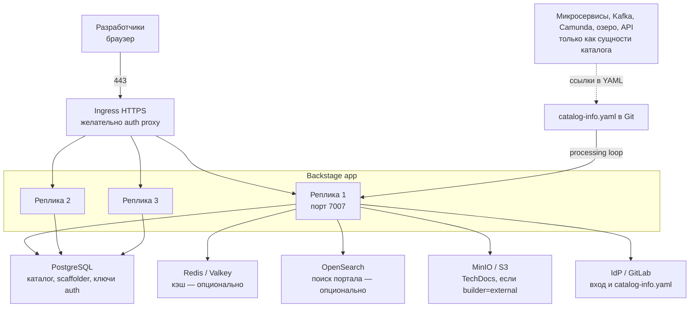

# Backstage 1.54.0 — развёртывание и настройка

Backstage — внутренний портал для разработчиков: какие у нас сервисы, кто владелец, где репозиторий, как поднять новый. Это **фреймворк**, не готовый бинарь «скачал — работает»: вы собираете *свой* экземпляр (`create-app`) и наполняете плагинами. Это **не** озеро эталонных клиентских данных, **не** шина событий, **не** процессный движок и **не** интеграционное API к государственным сервисам.

Версия, о которой этот документ: **Backstage 1.54.0** (релиз основной линии 18 августа 2026; на дату подготовки — последний стабильный main-line релиз).  
Документация: https://backstage.io/docs/  
Релизы: https://github.com/backstage/backstage/releases/tag/v1.54.0  
Создание приложения: `npx @backstage/create-app@latest`.  
Образы: **своего** приложения. Официальный Docker-гайд собирает образ из репозитория app; базовый runtime в шаблоне 1.54 — `node:24-trixie-slim`.  
На Kubernetes: Backstage **задуман** как stateless Deployment + внешний PostgreSQL. Официальный путь Spotify: собрать Docker-образ → registry → Deployment YAML. Чарт проекта: **Helm `backstage/backstage` 2.8.2** (17 июня 2026, `https://backstage.github.io/charts`, OCI `ghcr.io/backstage/charts/backstage`). Чарт **прямо пишет**: дефолтный образ — vanilla demo, **для боя скорее всего не подходит**; в бой кладут **свой** образ своего app.

Лицензия **Apache 2.0**. License-server нет. Проект в CNCF Incubating. Версия `1.54.0` **не semver продукта**: ломающие изменения бывают в minor. Релиз **1.54.0** содержит **critical security fixes** плагина Kubernetes — в бой без этого патча линейки 1.54 не идти, если плагин включён.

Этот текст — не набор команд «скопируй `app-config.yaml`», а правила, без которых система не будет одновременно устойчивой к сбоям, масштабируемой и безопасной. Пошаговая установка — в `Backstage.install.md`.

---

## Назначение системы

Backstage нужен, чтобы **сотня команд не потеряла свои же сервисы**: кто владелец, какой репозиторий, какая OpenAPI, как завести новый сервис «как у всех». Каталог хранит метаданные *программного обеспечения организации*, не карточки клиентов.

Kafka доставляет факт. Озеро хранит истину о клиентах. Camunda ведёт процесс. Интеграционное API ходит наружу. Портал отвечает на другой вопрос: карта микросервисов, шаблоны скелета (логгер, метрики, контракт Kafka), документация рядом с кодом. Он **не** делает ваши микросервисы event-sourced и **не** ищет клиента по ИНН.

Нечестная роль: «положим клиентов и эталон в каталог, озеро не нужно». Каталог не ACID-модель персональных данных и не переживает «удалили YAML — сущность осиротела» так, как озеро должно переживать юридическую истину.

---

## Перечень функций

Что умеет self-hosted Backstage (по документации проекта; набор зависит от ваших плагинов):

1. **Показывать Software Catalog** — реестр сущностей (сервисы, API, сайты, библиотеки, люди, группы). Каждая сущность описывается YAML `catalog-info.yaml` в Git. Фоновый цикл периодически заново обрабатывает все сущности (`catalog.processingInterval`).
2. **Подтягивать сущности самим** (entity provider) по расписанию или webhook: организация в GitLab, LDAP и т.п. Произвольный pull request не должен заводить `User` / `Group` / `Template` — это задают `catalog.rules`.
3. **Генерировать репозитории по шаблону** (Scaffolder / Software Templates). Действия выполняются **на хосте backend**. Это не Camunda и не процесс заявки в госорган.
4. **Отдавать документацию рядом с кодом** (TechDocs, Markdown → MkDocs). Сборка *внутри* пода (`builder: local`) или заранее в CI, а портал только читает из объектного хранилища (`external`).
5. **Искать по каталогу и докам.** Сам Backstage поисковиком не является: подключают Lunr (в памяти процесса — дефолт create-app, в бою официально **крайне не рекомендован**), PostgreSQL или Elasticsearch/OpenSearch.
6. **Впускать людей через IdP** (GitLab, GitHub, OIDC, SAML, reverse proxy). Вход «гостем» в документации: удобно не в бою; в Docker-гайде — **не для контейнеров**.
7. **Выдавать JWT** (Backstage token), которым UI доказывает backend «я вот этот пользователь». Ключи подписи по умолчанию **короткоживущие и теряются при рестарте**, если не задать свой keystore.
8. **Решать «можно ли это действие»** (permission framework). **По умолчанию выключен**: все залогиненные видят и делают почти всё. Включается `permission.enabled: true` + ваша политика. В create-app часто стоит allow-all — это не RBAC «из коробки».
9. **Проксировать HTTP из браузера** (обход CORS). Опасно, если в него вшивают секреты: любой, кто дошёл до портала, бьёт ими во внешний API.
10. **Отдавать пробы Kubernetes** с 1.29: `/.backstage/health/v1/liveness` и `/.backstage/health/v1/readiness`.
11. **Масштабироваться репликами** одинаковых подов за балансировщиком с общей PostgreSQL. Несколько подов **не выбирают лидера**. Состояние — в базе. Дальше backend можно резать на несколько Deployment (каталог отдельно от шаблонов) — из коробки «поставил два Deployment и заработало» документация **не обещает**.

Чего система **не** делает и часто путают: она не источник истины клиентских данных, не шина Kafka, не BPMN, не поиск по терабайтам логов, не кластерный консенсус, не готовый RBAC «включи галочку», не ГОСТ TLS. Демо-образ Helm как бой чарт 2.8.2 прямо запрещает. Официального порога задержки между дата-центрами нет: для подов важен RTT до **PostgreSQL** и Git, не «магия Backstage».

---

## Требования к развёртыванию

### Требования к ПО

| Что | Что ставить | Комментарий |
|---|---|---|
| **Формат поставки** | Контейнеры Kubernetes (свой образ) | Официальный путь: host build (`yarn tsc` + `yarn build:backend`) → Docker → Deployment. Helm 2.8.2 описывает Deployment, не заменяет сборку app. Дефолтный `ghcr.io/backstage/backstage:latest` в чарте **не** целевой бой. |
| **Kubernetes** | Deployment (не StatefulSet для самого Backstage) | Probes на health v1, PDB, topology spread по зонам. PVC нужен **PostgreSQL и объектному хранилищу**, не «диску каталога внутри пода». Prerequisites чарта: Kubernetes **1.25+** (в таблице requirements ещё `>= 1.19` — расхождение в README). Прогон 2.8.2 на вашей версии этим файлом не сертифицирован. |
| **ОС** | Linux в контейнере | **Боевые поды Backstage на Windows-хосте в схеме с Kubernetes не предполагаются.** |
| **Node.js** | Ровно **две соседние чётные** версии. С релиза **1.46.0** это **22 и 24** | Шаблон Docker 1.54 — **Node 24**. Сборку `yarn` и runtime образа делают **одной** major: нативные модули иначе падают. |
| **Yarn** | **Yarn 4.4.1** | Getting started на дату документации: `corepack` + `yarn set version 4.4.1`. |
| **PostgreSQL в бою** | Предпочтительная база | Политика: поддерживаются **последние 5 major**, тестируют самый новый и самый старый из этого окна. На август 2026 это ориентир **14…18**. Пример в k8s-гайде с образом `postgres:13.2-alpine` — **учебный YAML**, не официальная версия для боя. Модуль поиска Postgres требует **≥ 12**. SQLite `:memory:` — дефолт create-app: рестарт = пустой каталог. |
| **Единый вход** | Корпоративный IdP | Guest и `file:` locations — для теста. |
| **Секреты** | Kubernetes Secret / Vault | Токены Git, client secret IdP, пароль базы — не `app-config` в git. K8s-гайд прямо: Secret в API **base64, не шифрование**; нужен encryption at rest etcd. |
| **TLS** | На Ingress | Node по умолчанию слушает HTTP **7007**. HTTPS на 7007 **не** является встроенным «кластерным» TLS. |

Опционально рядом: Redis/Valkey (кэш; `memory` — только локальная разработка), OpenSearch (поиск портала, не озеро персональных данных), объектное хранилище (TechDocs), аутентифицирующий reverse proxy.

### Требования к ресурсам

Цифр «сколько ядер на ваши сервисы» у проекта **нет** — нагрузки в исходном запросе не было, и портал не хранит озеро. Ниже то, что явно есть в исходных материалах, не смета закупки.

| Роль | CPU | RAM | Диск |
|---|---|---|---|
| **Поды Backstage (бой)** | Цифры ядер в документации проекта **нет**. HPA в чарте: `targetCPUUtilizationPercentage: 80`, `maxReplicas: 100` — **дефолты чарта, не расчёт нагрузки** | Лимиты памяти с запасом под Node heap + нативные модули (isolated-vm у scaffolder) | PVC **не** нужен самому поду. Каталог живёт в PostgreSQL |
| **Учебный один процесс** | Как «чтобы открылось» | В исходном тексте стенда: **512 МиБ–1 ГиБ** | SQLite in-memory или маленький Postgres |
| **Реплики Deployment** | Пример golden-path: **`replicas: 3`** — это **пример**, не расчёт под вашу нагрузку | Одинаковые реплики за балансировщиком | Sticky sessions документация масштабирования **не** требует |
| **PostgreSQL каталога** | Как у вашего HA Postgres | Как у вашего HA Postgres | Состояние каталога, задач scaffolder, ключи auth. Реплики Backstage бэкапом не являются |
| **TechDocs / поиск** | — | Lunr = память **этого** процесса (не для нескольких реплик) | Объектное хранилище под статику доков, если `builder: external` |

Дополнительно:

- Ёмкость = число сущностей каталога + индекс поиска + артефакты TechDocs, не терабайты озера.
- Bitnami `postgresql.enabled` чарта как боевая база не брать (standalone, в 2.8.2 ещё workaround-образ `bitnamilegacy/postgresql`).
- PDB в чарте по умолчанию выключен (`create: false`) — включить самим.

---

## Основные элементы системы и зависимости

Это одно ПО из **нескольких процессов**. Ниже — те, что живут отдельными инстансами, и как они вызывают друг друга.

### Схема инстансов и потоков



Как читать схему:

1. Человек открывает HTTPS на Ingress. TLS обычно заканчивается на балансировщике. Поды слушают **7007**. Порт **3000** — только dev-сервер `yarn start`; в бою его нет, если UI раздаёт тот же backend.
2. Реплики **одинаковые** и stateless. Координация работы — через PostgreSQL («database handles coordination»). Падение одного пода при живой базе = пользователь попал на соседний.
3. **Каталог** периодически читает `catalog-info.yaml` из Git. Упал Git — цикл не обновляет YAML, портал показывает **старое**. Упал IdP — нельзя войти. Это не отказ Node.
4. **TechDocs** при нескольких репликах не живут на диске пода: `builder: local` + пустой диск = гонки. Рекомендованная схема — **external** + объектное хранилище.
5. **Поиск Lunr** у каждого процесса свой индекс в RAM; документация Search для Lunr прямо предупреждает про мультинодовый сценарий.
6. Микросервисы, Kafka, Camunda, озеро — только карточки и ссылки в каталоге, не рантайм портала.

Рядом, но это уже другое ПО: PostgreSQL, Redis, OpenSearch, MinIO, GitLab, IdP. Их отказ проектируется отдельно.

### Что входит в состав

| Роль | Зачем | Как масштабируется |
|---|---|---|
| **Frontend (app)** | UI портала | По умолчанию раздаётся **тем же** backend. Можно вынести в NGINX/CDN — тогда конфиг **запекается на сборке** |
| **Backend** | API плагинов, каталог, шаблоны, вход, прокси | Горизонтально: одинаковые реплики, общая база. Вертикально: CPU/RAM Node. Дальше — **резать** на несколько Deployment |
| **Auth plugin** | Вход людей и выдача Backstage token | Для высокой изоляции — **отдельный** Deployment и **своя** база (threat model) |
| **Catalog plugin** | Реестр сущностей, processing loop | Упирается в PostgreSQL и во внешний Git (rate limit). Метрика: `catalog.processing.duration` |
| **Scaffolder** | Генерация репозиториев, действия на хосте | Очередь задач; тяжёлые шаблоны не должны душить каталог |
| **TechDocs backend** | Отдать статику доков | `local` считает MkDocs *в поде*; `external` только читает из S3/GCS/Azure/MinIO |
| **Search backend** | Индекс для строки поиска | Lunr = память процесса. Postgres / OpenSearch — внешний индекс |
| **Permission backend** | Решения allow/deny | Без него залогиненный = почти суперпользователь UI |
| **Proxy** | CORS-обход к внешним HTTP | Не масштабирует внешнюю систему; дырка, если вшиты токены |

### Порты (контракт сети)

| Порт / путь | Назначение | Кому открывать |
|---|---|---|
| **7007/TCP** | Backend (и UI, если frontend в том же процессе). В Helm: Service `http-backend` | Только через Ingress. Не в интернет |
| **3000/TCP** | Dev-сервер frontend при `yarn start` | Только учебный хост. В бою нет |
| `/.backstage/health/v1/liveness` | Liveness (≥ 1.29) | Kubernetes, не мир |
| `/.backstage/health/v1/readiness` | Readiness | Kubernetes |
| `/.backstage/auth/v1/jwks.json` | Ключи плагина для service-to-service | Другие backend-плагины |
| `/api/<pluginId>/…` | HTTP API плагина | Через Ingress после входа |

UDP нет. Балансировщик HTTP перед 7007 **нормален** (это не Kafka). `app.baseUrl` / `backend.baseUrl` должны совпадать с тем, что видит браузер — иначе логин и CORS ломаются. В 1.54.0 allowlist OAuth redirect **ужесточили** (breaking).

### Зависимости окружения (что ещё должно быть)

- Стабильный DNS до PostgreSQL; от подов — до GitLab/IdP; от браузера — до `app.baseUrl`.
- Идентификация: люди — SSO; группы для политики прав — из sign-in resolver + User/Group в каталоге (ingestion из доверенного источника).
- `/metrics` в свежем app **нет**, пока сами не настроите OpenTelemetry (это отмечает Helm README).

---

## Краткие вводные

### Как устроена отказоустойчивость

Это **не кворум**. Падение пода Backstage при `replicas ≥ 2` и живом PostgreSQL = пользователь попал на соседний под. Падение PostgreSQL = портал «глухой», даже если поды живы.

**1) Процесс Backstage**

| Что падает | Что происходит |
|---|---|
| Один под из нескольких за Service | Остальные отвечают. Координация — через базу |
| Все поды одной зоны, остальные зоны живы, topology spread сделан | Сервис жив, если PostgreSQL жив |
| Единственный под (`replicas: 1`) | Выкат и падение ноды = простой UI/API |
| `builder: local` + диск пода | Рестарт и вторая реплика **не делят** сгенерированные доки |
| Lunr на нескольких репликах | У каждого процесса **свой** индекс в RAM |

Официальный горизонтальный масштаб: увеличить `replicas` у Deployment. Пример в golden-path: `replicas: 3`.

**2) PostgreSQL**

Без HA базы «HA Backstage» — табличка. Реплики каталога не копируют данные друг другу. Политика бэкапа и failover — в контуре PostgreSQL. Учебный манифест k8s-гайда: **1 replica** Postgres + `hostPath` — для minikube, в бою том должен переживать ноду.

**3) Ключи входа**

По умолчанию signing keys теряются при рестарте. После rolling update пользователи могут словить «неизвестный kid». Для боя рассматривают `auth.keyStore.provider: static`.

**4) Внешние системы**

Упал Git — каталог замирает (UI со старыми данными может ещё отвечать). Упал IdP — нельзя войти.

### Как устроено масштабирование

Несколько независимых осей (golden-path Scaling):

1. **Больше пользователей и плагинов** → сначала **больше одинаковых реплик** за балансировщиком. Это простой путь; его советуют исчерпать раньше split.
2. **Каталог не успевает** (`catalog.processing.duration` растёт) → processingInterval, rate limit Git, мощность Postgres, затем **вынести catalog** в отдельный Deployment.
3. **Очередь Scaffolder** → отдельный backend только со scaffolder (изоляция CPU и секретов Git write).
4. **Медленный UI** → вынести frontend на CDN/NGINX.
5. **Поиск** → уйти с Lunr на Postgres (десятки тысяч документов — формулировка документации) или на OpenSearch.

Сигналы «пора масштабировать»: рост latency API, отставание catalog processing, очередь scaffolder, жалобы на медленные страницы.

Для split **нужен свой DiscoveryService**. Модули живут **в том же** процессе, что плагин, который расширяют. Нельзя вынести GitLab entity provider в другой Deployment отдельно от catalog. Начинать со split «на всякий случай» без требования ИБ — лишняя сложность.

### Безопасность самого Backstage

Компрометация портала = карта всех сервисов, токены Git/IdP, шаблоны, которые **пишут в Git и крутят код на хосте**, прокси к внутренним API. Threat model проекта:

- Рассчитан на **защищённый контур**, не на публичный интернет. От DoS — только «зачаточная» защита; оператор ставит proxy/WAF/лимиты сам.
- Рекомендуемый вход: **аутентифицирующий reverse proxy** плюс нормальный sign-in.
- С backend ≥ **1.24** есть встроенная защита API от анонимов, **если не** выставлен `backend.auth.dangerouslyDisableDefaultAuthPolicy`. Frontend-бандл при этом по умолчанию **всё равно скачивается**.
- Залогиненный пользователь **по умолчанию видит и может почти всё**. Тонкий доступ — только `permission.enabled: true` и своя policy.
- Плагины на одном хосте и с доступом к **чужой** логической базе считаются имеющими полный доступ к тому плагину. Для высокой безопасности **auth — отдельный сервис со своей базой**.
- `oauth2Proxy` **не проверяет** подпись заголовков — внутренний злоумышленник может подделать identity.
- Список доверенных хостов UrlReader — `backend.reading.allow`. Ошибка списка = чтение metadata облака (`169.254.169.254`) или внутренних админок.
- Релиз **1.54.0** — critical fixes плагина Kubernetes; `skipTLSVerify: true` пишет warning в 1.54 — в бою не оставлять.

«Поставили Helm с `image.tag: latest` и Guest» — это витрина, не портал организации.

---

## Допущения

Ниже то, чего не было в исходном запросе, но без чего нельзя нарисовать конкретную схему. Если допущение неверно — схему надо пересмотреть.

1. Берём **self-hosted Backstage 1.54.0** как свой app из `create-app`, не Red Hat Developer Hub и не SaaS.
2. Бой крутится в Kubernetes, образ — **собранный вами**. Helm 2.8.2 — способ описать Deployment. Чарты пинить **версией**, не `latest`.
3. Три дата-центра = три зоны отказа Kubernetes. Три зала с общим питанием spread подов не спасают.
4. Цель отказа: пережить **1** дата-центр, не 2 из 3.
5. Нагрузки нет — нет цифры «N реплик и M CPU». Есть сигналы (latency, processing duration, очередь scaffolder, heap Node) и рычаги (реплики, split backend, кэш, поисковый движок).
6. Формального SLA / RPO / RTO нет. Живые 3 пода ≠ юридический 24/7. RPO портала ≈ RPO PostgreSQL + то, что ещё не успел обработать catalog из Git.
7. Корпоративный IdP и Git есть или будут. Guest и `file:` locations — для теста.
8. Идентификация людей в бою — SSO, не Guest.
9. Шифрование канала пользователя — TLS на Ingress. Отдельная криптография государством не озвучена.
10. Учебный стенд изолирован. На нём допустимы SQLite, Guest, Lunr, `builder: local`. В бой их не копируем.
11. Kafka, Camunda, озеро, интеграционное API — объекты *каталога* и ссылки, не часть этого ПО.
12. PostgreSQL, OpenSearch, Redis, Vault — отдельные продукты со своими HA.
13. Лицензия Apache 2.0. Следить нужно за **плагинами из npm**: threat model требует vetting как любого пакета.
14. Один логический каталог на организацию. Три независимых Backstage без общей базы и без общего Git = три карты сервисов.

---

## Критически важные условия, которых нет в исходном контексте

Их нужно закрыть **до** «нарисовали Deployment и забыли».

| Пробел | Почему это ломает решение |
|---|---|
| **Один Kubernetes на три площадки или три изолированных** | Несколько реплик имеют смысл, только если они видят **одну** PostgreSQL (или осознанный active/passive). Три каталога без общей базы — три истины |
| **Задержка до PostgreSQL** (p50/p95/p99, все пары площадка↔база) | Каждый запрос каталога бьёт в базу. Высокий RTT → медленный UI, таймауты пула, ложные readiness |
| **Где живёт Git и IdP** | Processing и логин зависят от них. Если Git только в одном дата-центре — падение этой площадки = каталог замирает |
| **Нужен ли Scaffolder в бою** | Это выполнение шаблонов **на хосте** с часто широкими правами на Git. Без политики — главный attack surface портала |
| **TechDocs: CI или local builder** | `local` + несколько реплик + пустой диск пода = гонки. Документация: recommended setup — **external** + объектное хранилище |
| **Кто пользователи** | От этого зависят permission policy, catalog.rules, можно ли Guest на препроде |
| **Какой Git и какие токены** | `url` locations без integration не читаются. Org-admin токен — большой радиус взлома |
| **Что нельзя светить в каталоге** | В сущность легко положить внутренние URL, владельцев, связи с адаптерами к госслужбам. Каталог — карта атаки |
| **Совместимость Helm 2.8.2 с вашей версией Kubernetes** | Формальный минимум не заменяет прогон в вашем контуре |
| **Нужен ли split auth/catalog/scaffolder сразу** | Threat model советует отдельный auth+база для high-security. Сложность Discovery растёт |

---

## Краткое описание ключевых этапов и элементов развертывания

Общий каркас (и тест, и бой):

1. Зафиксировать **релиз 1.54.0**. Не смешивать next-line в бою. Соблюдать skew: frontend-плагин и его backend обновляют вместе, backend **раньше или одновременно**.
2. Собрать **свой** app: плагины, SignInPage **без Guest в production-конфиге**, `app.baseUrl` / `backend.baseUrl` / CORS под реальный URL.
3. Подключить **PostgreSQL** (`client: pg`, SSL по политике ИБ). Проверить, что плагины создали базы `backstage_plugin_*` (или схемы).
4. Включить **реальный auth provider** и sign-in resolver. Прогнать логин и OAuth redirect (breaking 1.54).
5. Настроить **integrations** Git и `catalog.locations`. Задать **catalog.rules**.
6. Решить **Search** (не Lunr в бою) и **TechDocs** (`external` + бакет vs осознанный local только на тесте).
7. Включить **permission.enabled** и политику не allow-all, как только появятся разные роли.
8. Собрать Docker-образ **той же** Node, что в runtime; пробы на `/.backstage/health/v1/*`.
9. Выложить за Ingress с TLS.
10. Метрики: OpenTelemetry, latency API, `catalog.processing.duration`, очередь scaffolder, пул базы.

Боевая схема на несколько дата-центров — в `Backstage.install.md`. Ниже — только учебный стенд.

---

### 1 инстанс: тестовый стенд, 1 площадка, без нагрузки

**Цель стенда:** увидеть каталог, `catalog-info.yaml`, логин, один шаблон, TechDocs. **Не** цель: доказать отказ дата-центра и ёмкость.

**Путь A — ноутбук / виртуальная машина** (быстрее понять продукт):

```text
npx @backstage/create-app@latest
cd <app>
yarn start
```

UI: `http://localhost:3000`, backend: **7007**. Нужны Node 22 или 24, Yarn 4.4.1. База по умолчанию — SQLite in-memory.

**Путь B — Docker-образ своего app + PostgreSQL** (ближе к бою, всё ещё 1 площадка):

Официальный host build, затем `docker run -p 7007:7007`. Гостевой провайдер в контейнерах **не предназначен**. Нужен Postgres и не-Guest auth (хотя бы тестовый OIDC/GitLab).

На Kubernetes: Deployment `replicas: 1`, Secret с паролем базы, как в https://backstage.io/docs/deployment/k8s/ — понимать, что пример Postgres там **не HA**. Helm 2.8.2 с demo-образом — только чтобы пощупать чарт, не как эталон app.

#### Что сознательно упрощаем

| Параметр | На тесте | Почему можно |
|---|---|---|
| Число реплик | 1 | Нет требования пережить выкат |
| База | SQLite или один Postgres без реплик | Нет требования пережить диск |
| Вход | Guest **или** тестовый IdP; Guest не в Docker | Документация: Guest удобен не в бою |
| Search | Lunr | Ноль сервисов; индекс умрёт с процессом — на стенде ок |
| TechDocs | `builder: local`, publisher `local` | CI и S3 ещё нет |
| Permission | выкл. или allow-all | Иначе команда не увидит сущности, пока нет policy |
| CPU | 512 МиБ–1 ГиБ как «чтобы открылось» | Не цель — ёмкость |
| catalog.rules | дефолт create-app | На стенде мало сущностей |
| Split backend | нет | Учит продукт, не DiscoveryService |

#### Чего на тесте **не** стоит упрощать

- Версия **1.54.0** app и тех же плагинов (skew policy).
- Понимание, что **SQLite `:memory:`** не переживёт рестарт.
- Хотя бы один **настоящий** `catalog-info.yaml` из Git (type `url`), не только `file:` examples: в бою `file:` для боевых данных **не** рекомендуют.
- `app.baseUrl` / `backend.baseUrl` совпадают с тем, как открываете браузер.
- Запомнить: Helm demo image и Guest **не** есть «почти бой».
- Breaking 1.54: шаблоны OAuth redirect. Поймать на тесте дешевле, чем в день вывода SSO.

#### Сильные стороны такой схемы

- Поднимается за часы, совпадает с Getting Started / Docker / k8s tutorial.
- Дешево показывает, как ваши микросервисы лягут в модель Catalog (owner, API, dependsOn).
- SQLite и Lunr официально для эксперимента/dev.

#### Слабые стороны (обязательно понимать)

- Нет модели отказа площадки, нет доказанной ёмкости, нет общего кэша/поиска между процессами.
- Успешный `yarn start` **не** доказывает, что SSO, permission и TechDocs-S3 заведутся.
- Guest и открытый 7007 приучают «зайти без учётки».

Практическая рекомендация: препрод = маленькая **копия боевой топологии** (свой образ 1.54.0, Postgres, SSO без Guest, Search не Lunr, TechDocs external если так будет в бою, `replicas ≥ 2`), даже без боевого трафика. Всё это **в одном** дата-центре.

---

## Сводка: что считать «экземпляр готов»

| Требование | Тест (1 площадка) | Бой |
|---|---|---|
| Отказоустойчивость | Не требуется | ≥2 пода; HA PostgreSQL; цель — отказ одной машины; прогнанный restore базы; не Lunr и не local-диск как единственная копия доков. Схема на 2–3 дата-центра — в `Backstage.install.md` |
| Производительность / масштаб | Не требуется | Сначала реплики; сигналы processing/latency/очередь; кэш не memory; поиск Postgres или OpenSearch; split — по факту, не «на слайде» |
| Безопасность | Guest только в изоляции; не светить 3000/7007 в сеть | Нет Guest; SSO; permission включён; нет dangerouslyDisable; UrlReader минимальный; секреты не в git; 1.54.0 из‑за Kubernetes plugin; контур не public internet |

**Не готов к бою**, если: SQLite `:memory:`; Guest в контейнере; Lunr на нескольких репликах как «поиск организации»; Helm demo `latest`; `replicas: 1` без запаса; TechDocs `local` на emptyDir; `permission.enabled` выключен при разных ролях; `oauth2Proxy` без проверки подписи; задержку до Postgres не мерили, а поды уже в трёх площадках; каталог назначен эталоном клиентских персональных данных; шаблоны scaffolder может менять любой залогиненный.

---

## Источники (чтобы не принимать на веру)

- Релиз 1.54.0 (18 Aug 2026): https://github.com/backstage/backstage/releases/tag/v1.54.0
- Политика версий, Node 22/24 (с 1.46.0), PostgreSQL last 5 major: https://backstage.io/docs/overview/versioning-policy
- Архитектура, БД на плагин, кэш Redis/Valkey: https://backstage.io/docs/overview/architecture-overview/
- Getting started, порты 3000/7007, Yarn 4.4.1: https://backstage.io/docs/getting-started/
- Docker, Guest не для контейнеров, Node 24 в шаблоне: https://backstage.io/docs/deployment/docker
- Kubernetes, stateless + Postgres: https://backstage.io/docs/deployment/k8s/
- Масштаб: реплики, split, frontend отдельно: https://backstage.io/docs/golden-path/deployment/scaling
- Split backend, Discovery не из коробки: https://backstage.io/docs/backend-system/building-backends/
- Auth, Guest не для prod UI, keyStore static: https://backstage.io/docs/auth/
- Threat model: https://backstage.io/docs/overview/threat-model
- Permissions: https://backstage.io/docs/permissions/overview
- SQLite → Postgres: https://backstage.io/docs/tutorials/switching-sqlite-postgres/
- Catalog rules, readonly, processingInterval: https://backstage.io/docs/features/software-catalog/configuration
- Search Lunr/Postgres/ES, Lunr не для prod: https://backstage.io/docs/features/search/search-engines
- TechDocs: https://backstage.io/docs/features/techdocs/configuration
- Health v1: https://backstage.io/docs/plugins/observability
- Helm 2.8.2, demo image не для prod, порт 7007: https://github.com/backstage/charts
- CNCF Incubating, Apache 2.0: https://www.cncf.io/projects/backstage/

Утверждения вида «Backstage переживёт два дата-центра» или «N миллисекунд — можно размазать поды» в документации проекта **отсутствуют** — поэтому в этом файле их нет. Задержку до PostgreSQL и Git надо измерить у себя. Число реплик `3` из golden-path — пример, не смета.
