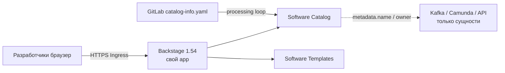
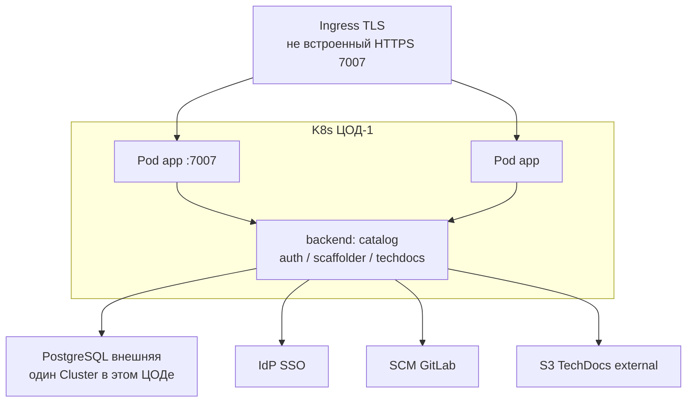
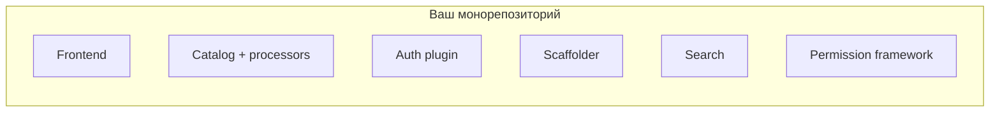
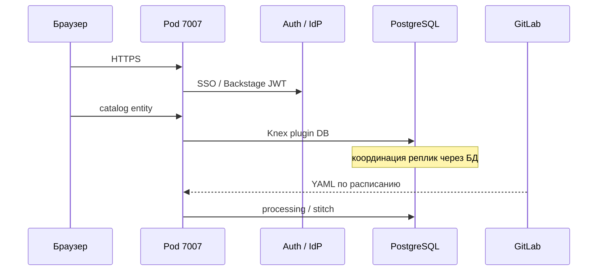
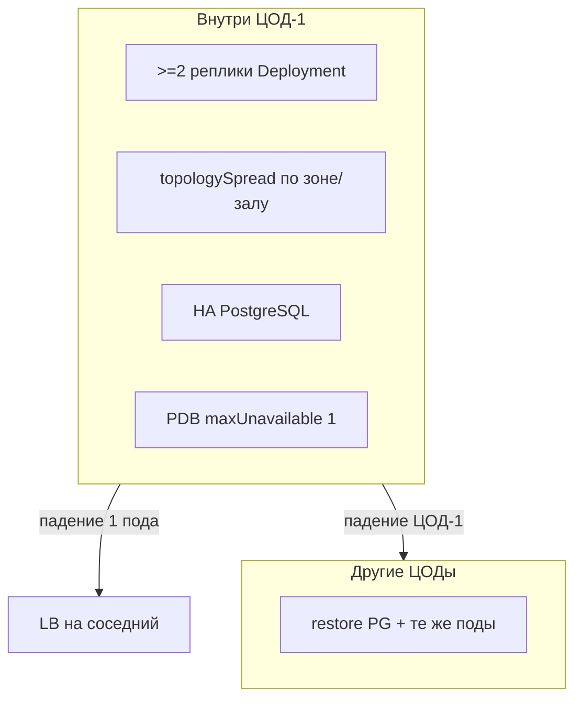
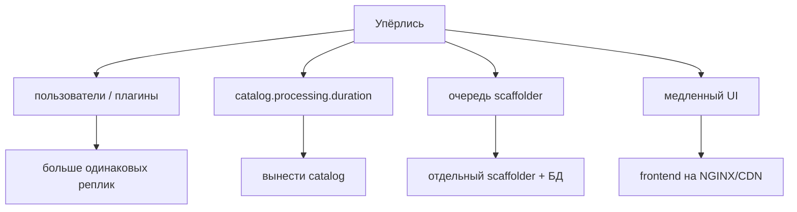
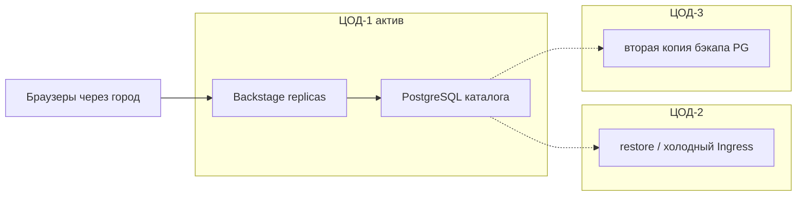

# Backstage 1.54.0 — схемы устройства

Связанные документы: правила — `Backstage.md`; установка — `Backstage.install.md`.

C4 / «D4»: контекст → контейнеры → компоненты. Код плагинов не рисуем.

Допущения: **свой** app из `create-app` на **1.54.0**, не demo-образ Helm. Stretch PostgreSQL каталога на 2–3 ЦОДа **нет**. Несколько подов **не** выбирают лидера: состояние в БД. Нагрузки нет (`replicas: 3` в golden-path — пример).

---

## 1. Контекст

Backstage — **карта ПО организации**, не озеро клиентов и не Camunda.

Честные роли: каталог сервисов, шаблоны скелета, TechDocs рядом с кодом. Нечестная: «положим клиентов в Catalog вместо озера».

---

## 2. Контейнеры (stateless + внешняя БД)

Порт **7007** — backend (и UI, если frontend в том же процессе). Dev `yarn start` ещё слушает **3000** — в проде этого порта нет. Health с 1.29: `/.backstage/health/v1/liveness` и `readiness`. JWKS: `/.backstage/auth/v1/jwks.json`.

Helm **`backstage/backstage` 2.8.2**: дефолтный vanilla image **для прода скорее всего не подходит**. `postgresql.enabled` чарта — не прод-БД.

---

## 3. Компоненты внутри app

По умолчанию permission **выключен**: залогиненный видит почти всё. Lunr — поиск **в RAM процесса**; на нескольких репликах официально **не** для прода. Scaffolder выполняет действия **на хосте** пода — это не BPMN.

Split catalog/auth/scaffolder на разные Deployment документация **не** обещает «из коробки»: нужен свой DiscoveryService.

---

## 4. Поток: открыть сущность

Упал GitLab — портал показывает **старое**. Упал Postgres — поды живы, каталог глухой. Signing keys по умолчанию **теряются при рестарте**; в проде — `auth.keyStore.provider: static`.

---

## 5. Отказоустойчивость — что настраивать

| Ручка | Если забыть |
|---|---|
| Свой образ 1.54.0 | Demo `latest` Helm ≠ портал |
| Внешний Postgres | SQLite `:memory:` = пустой каталог после рестарта |
| Не Lunr / не TechDocs local | Индекс и доки не шарятся между репликами |
| Stretch PG «чтобы UI ближе» | Каждый клик — SQL; порога RTT у Backstage нет |
| Прогнанный restore БД | Реплики Node бэкапом не являются |

Три независимых Backstage без общей БД = **три карты** сервисов. Вариант «поды везде, одна БД через город» — решение PostgreSQL, не Node; на схемах не выбран.

---

## 6. Масштабируемость — что настраивать

Сначала исчерпать реплики. HPA чарта (`maxReplicas: 100`, CPU 80%) — **дефолт чарта**, не расчёт. Search: Postgres-модуль или отдельный OpenSearch портала, не индекс озера ПДн. Кэш `memory` — только Dev; прод — Redis/Valkey.

---

## 7. 2–3 ЦОДа без stretch

Третий writer Postgres каталога **не** появляется. Пользователи из других ЦОДов ходят на Ingress ЦОД-1.

**Сильное:** нет межЦОДового SQL на каждый клик. **Слабое:** падение площадки с БД = нет портала, пока restore; RPO ≈ RPO PostgreSQL + то, что catalog не успел взять из Git.

---

## 8. Безопасность

1. Нет Guest в SignInPage и в контейнере. Не включать `dangerouslyDisableDefaultAuthPolicy`.
2. `permission.enabled: true`, убрать allow-all; User/Group только из доверенного provider.
3. UrlReader: `backend.reading.allow` минимальный; не metadata 169.254.169.254.
4. Proxy plugin: не вшивать Authorization. Scaffolder — не org-admin токен на всех.
5. Релиз **1.54.0** — critical fixes плагина Kubernetes; `skipTLSVerify` в проде не оставлять.
6. Контур внутренний + auth proxy. DoS-защита — ваша, не «встроена».

Источники: `Backstage.md`. Порога RTT «для подов в трёх ЦОДах» у проекта **нет**.
