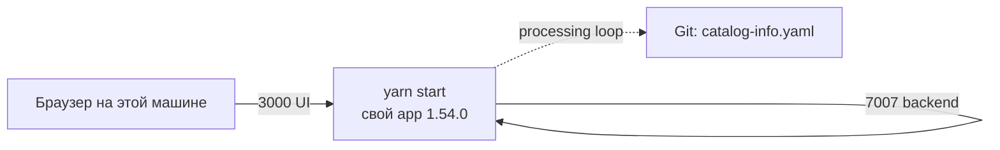

# Backstage 1.54.0 — установка (учебный контур)

Backstage — внутренний портал: карта сервисов организации, шаблоны, документация рядом с кодом. Это **фреймворк**: вы собираете *свой* app командой `create-app`. Готового «скачал образ с Docker Hub — это наш портал» нет. Чарт Helm прямо пишет: vanilla demo image для боя скорее всего не подходит.

**Допущение:** одна Unix-машина (ноутбук или VM) в закрытой сети. SQLite, Guest и Lunr — **только здесь**. Боевой запуск сюда не копировать.

Официальный путь учёбы: [Standalone Installation](https://backstage.io/docs/getting-started/). Версия app — **1.54.0** ([релиз 18 августа 2026](https://github.com/backstage/backstage/releases/tag/v1.54.0)): critical fixes плагина Kubernetes; без этого патча линейки плагин в бой не включать.

**npx** — программа, которая ставится вместе с Node.js и запускает пакет из npm, не устанавливая его глобально навсегда. **Docker** — программа, которая запускает **образ** (упакованная программа с зависимостями) как **контейнер**. На этом стенде Docker нужен TechDocs (`runIn: docker` в шаблоне) и опциональному образу своего app; основной путь — `yarn start`, не demo-образ Helm.

Связанные файлы: `Backstage.md`, `Backstage.info.md`, `Backstage.shema.md`.

---

## Куда ставить и сколько ресурсов (учебный контур)

**Куда.** Одна машина с Unix: Linux, macOS или **WSL** на Windows ([Getting Started](https://backstage.io/docs/getting-started/)). Команды — в bash этой машины, не в PowerShell без WSL. Не внутри Kubernetes как Ingress. Не на нескольких дата-центрах: состояние каталога — в базе; порога RTT в доке проекта **нет**.

Writer PostgreSQL (если появится) — на этой же машине. Второй зал в этот стенд не входит.



**Сколько.** Цифр «хватит N ядер для портала» в мануале **нет**. Минимум, чтобы *standalone* с демо-данными открылся:

| Зачем | CPU | RAM | Диск | Откуда |
|---|---|---|---|---|
| Standalone + демо | в доке вендора нет | **≥ 6 ГБ** | **≥ 20 ГБ** | [Getting Started](https://backstage.io/docs/getting-started/) |

Node **22 или 24** (с релиза 1.46.0 — две соседние чётные; [versioning policy](https://backstage.io/docs/overview/versioning-policy)). Yarn **4.4.1**. Сборку `yarn` и runtime образа делают **одной** major: иначе падают нативные модули. Шаблон Docker 1.54 — `node:24-trixie-slim`.

PostgreSQL на этом пути **не нужна**: дефолт create-app — SQLite `:memory:` ([switching to PostgreSQL](https://backstage.io/docs/tutorials/switching-sqlite-postgres/)). Рестарт процесса = пустой каталог. Это ожидаемо на стенде, не норма боя.

**Сильная сторона:** совпадает с Getting Started, один процесс. **Слабая:** падение машины = нет UI; успешный `yarn start` не доказывает SSO, HA и TechDocs в S3.

**Критично:** порты **3000** и **7007** в интернет не публиковать. В шаблоне `backend.listen.host: 127.0.0.1` закомментирован — процесс может слушать не только loopback. Не `latest` после пина 1.54.0. Не SQLite и не Guest как привычка «почти бой». Один процесс — не кластер: поды не выбирают лидера.

---

## Установка для новичка

Страница шагов: https://backstage.io/docs/getting-started/

### Что должно быть до установки

**Есть:**

- Unix (Linux / macOS / WSL), права ставить пакеты
- Node.js **22 или 24** (`nvm install 22` или `nvm install 24` — так в гайде)
- Yarn **4.4.1**: `corepack enable`, затем `yarn set version 4.4.1`
- git, curl или wget, GNU-сборка (`make` / `build-essential` или `xcode-select --install` на macOS)
- свободны порты **3000** (dev-сервер frontend) и **7007** (backend)
- ≥ 6 ГБ RAM, ≥ 20 ГБ диска
- закрытая сеть

**Нет** (и не должно появиться на этом хосте):

- публикация 3000/7007 в интернет
- Guest в Docker-контейнере (Docker-гайд: Guest **не** для контейнеров)
- SQLite как «база боя»
- demo-образ Helm `ghcr.io/backstage/backstage:latest` как «наш портал»
- `app-config.local.yaml` с токенами в git

PostgreSQL **не** требуется, пока идёте `yarn start`. Она понадобится, если собираете Docker-образ своего app: тогда ещё не-Guest auth ([Building a Docker image](https://backstage.io/docs/deployment/docker)).

### Этап 1. Проверяем Node и Yarn

**Что делаем:** фиксируем runtime до `create-app`. Иначе шаблон соберётся на чужой major.

```bash
node -v
corepack enable
yarn set version 4.4.1
yarn -v
```

Успех: Node **v22** или **v24**; Yarn **4.4.1**.

### Этап 2. Создаём свой app

**Что делаем:** `npx` скачивает `@backstage/create-app` и генерирует монорепозиторий (frontend `packages/app`, backend `packages/backend`, `app-config.yaml`). Спросит имя каталога. Первый раз — подтверждение `Need to install … ok to proceed?` → `y`. Может занять несколько минут.

```bash
npx @backstage/create-app@latest
```

Пример имени из гайда: `my-backstage-app`. Успех: в конце `Successfully created …`; есть `app-config.yaml`, `packages/app`, `packages/backend`.

### Этап 3. Пин 1.54.0

**Что делаем:** `create-app@latest` берёт *текущий* шаблон main-line. App фиксируем на **1.54.0**, не на next-line. Команда bump ставит все пакеты `@backstage/*` из одного релиза ([Keeping Backstage Updated](https://backstage.io/docs/getting-started/keeping-backstage-updated)).

```bash
cd my-backstage-app
cat backstage.json
yarn backstage-cli versions:bump --release 1.54.0
cat backstage.json
```

Успех: в `backstage.json` версия **1.54.0**. Если уже была 1.54.0 — bump подтверждает, не «обновляет до latest». Next-line (`--release next`) не брать.

### Этап 4. Запуск

**Что делаем:** `yarn start` поднимает frontend и backend **в одном окне** (процессы `[0]` и `[1]`). Конфиг — `app-config.yaml`.

```bash
yarn start
```

Успех: в логе `Rspack compiled successfully`; backend пишет инициализацию плагинов (`catalog`, `auth`, …). Браузер: `http://localhost:3000`. Если окно не открылось — открыть этот URL вручную (так в гайде).

Проба backend (≥ 1.29):

```bash
curl -sS http://127.0.0.1:7007/.backstage/health/v1/liveness
curl -sS http://127.0.0.1:7007/.backstage/health/v1/readiness
```

Успех: HTTP 200, не пустой ответ. `/metrics` в свежем app **нет**, пока сами не настроите OpenTelemetry (это отмечает Helm README) — не считать это ошибкой стенда.

### Этап 5. Один `catalog-info.yaml` из Git

**Что делаем:** шаблон уже кормит каталог **файлами** `examples/*.yaml` (`type: file` — только учёба и примеры, [не для боевых данных](https://backstage.io/docs/features/software-catalog/configuration)). Чтобы стенд был похож на платформу, кладём дескриптор в Git и подключаем `type: url`. Имя файла рекомендуют `catalog-info.yaml` ([descriptor format](https://backstage.io/docs/features/software-catalog/descriptor-format)).

Минимум сущности (подставьте owner/имя):

```yaml
apiVersion: backstage.io/v1alpha1
kind: Component
metadata:
  name: example-service
  description: учебный сервис
spec:
  type: service
  lifecycle: experimental
  owner: guests
```

В `app-config.yaml` (или лучше `app-config.local.yaml`, этот файл в `.gitignore`):

```yaml
integrations:
  gitlab:
    - host: gitlab.example.local
      token: ${GITLAB_TOKEN}
      apiBaseUrl: https://gitlab.example.local/api/v4
catalog:
  locations:
    - type: url
      target: https://gitlab.example.local/group/example-service/-/blob/main/catalog-info.yaml
```

Токен **не** в git: переменная окружения или `app-config.local.yaml`. Для GitHub вместо этого блока — `integrations.github` + `${GITHUB_TOKEN}` ([GitHub Locations](https://backstage.io/docs/integrations/github/locations), [Getting Started auth](https://backstage.io/docs/getting-started/config/authentication/)). Без integration `url` из Git не читается. Перезапуск: Ctrl+C, снова `yarn start`.

Успех: в Catalog видна сущность `example-service` (не только примеры `file:`).

### Этап 6. (необязательно) Docker-образ *своего* app

**Что делаем:** только если нужен контейнер, ближе к выкладке. Это **не** demo Helm. Сначала: Postgres + **не-Guest** auth. Guest в контейнерах проект не предназначен.

На хосте, **той же** Node, что в образе (`node:24-trixie-slim`):

```bash
yarn install --immutable
yarn tsc
yarn build:backend
docker image build . -f packages/backend/Dockerfile --tag backstage-app:1.54.0
docker run --rm -p 127.0.0.1:7007:7007 backstage-app:1.54.0
```

Привязка к `127.0.0.1` обязательна. UI тогда с того же backend: `http://127.0.0.1:7007` ([Docker](https://backstage.io/docs/deployment/docker)). Учебный Postgres `13.2-alpine` из k8s-гайда — **не** версия боя (ориентир major **14…18**, окно «последние 5»).

Helm `backstage/backstage` **2.8.2** с demo-образом — пощупать чарт, не этот стенд и не эталон app.

**Чего этот стенд не доказывает:** отказ дата-центра, rolling update при `replicas ≥ 2`, SSO без Guest, permission не allow-all, поиск не Lunr, TechDocs `external` + бакет, restore PostgreSQL, stretch SQL, нагрузку. Успешный `yarn start` ≠ «портал организации». Рестарт при SQLite `:memory:` опустошает каталог — так и должно быть.

---

## Первый запуск — URL, порт, учётка, смена пароля

| Что | URL / порт | Кто открывает |
|---|---|---|
| UI при `yarn start` | `http://localhost:3000` | браузер на этой машине |
| Backend (API, в Docker ещё и UI) | `http://localhost:7007` | браузер / `curl`; в шаблоне `backend.baseUrl` |
| Liveness / readiness | `http://127.0.0.1:7007/.backstage/health/v1/liveness` и `…/readiness` | вы, не интернет |
| GitHub OAuth callback (если включите) | `http://localhost:7007/api/auth/github/handler/frame` | IdP |
| GitLab OAuth callback | `http://localhost:7007/api/auth/gitlab/handler/frame` | IdP |

`app.baseUrl` в шаблоне 1.54 — `http://localhost:3000`; `backend.baseUrl` / `listen.port` — **7007**; CORS origin — `http://localhost:3000`. Если открываете не так, как в конфиге (другой хост, HTTPS, path) — логин и CORS ломаются. В 1.54.0 allowlist OAuth redirect **ужесточили** (breaking): шаблон `http://localhost:*` больше не покрывает любой путь; нужен `http://localhost:*/*`, если задаёте сами.

**Учётка.** Готового логина/пароля «admin / admin» у Backstage **нет**. Шаблон включает Guest: вход без IdP, общая личность `user:development/guest` (в логе: `Issuing token for user:development/guest`). Пароля нет — менять нечего.

Guest — **только development**. Пакет гостевого провайдера для не-dev **явно выключен**; флаг `dangerouslyAllowOutsideDevelopment` в бой не ставить ([Guest provider](https://backstage.io/docs/auth/guest/provider)). В Docker-контейнере Guest не использовать.

**Чем заменить на этом же стенде, если нужен «настоящий» вход (всё ещё учёба):**

1. OAuth-приложение в GitHub или в **GitLab** (SCM платформы). Homepage UI: `http://localhost:3000`. Callback — строка из таблицы выше, без `/` после `frame` у GitLab.
2. `clientId` / `clientSecret` — в `app-config.local.yaml` или `${AUTH_GITLAB_CLIENT_ID}` / `${AUTH_GITLAB_CLIENT_SECRET}` (аналог GitHub: `AUTH_GITHUB_*`). Не в git.
3. Модуль backend: `@backstage/plugin-auth-backend-module-gitlab-provider` или `-github-provider`. Sign-in resolver, например `usernameMatchingUserEntityName`, плюс сущность `User` в каталоге — иначе «Failed to sign-in, unable to resolve user identity» ([Getting Started auth](https://backstage.io/docs/getting-started/config/authentication/), [GitLab provider](https://backstage.io/docs/auth/gitlab/provider)).
4. Guest убрать с SignInPage, когда SSO заработал. Учебные секреты OAuth в бой не копировать — там Vault / Secret.

Ключи подписи Backstage token по умолчанию **теряются при рестарте**. На стенде это раздражает сессию, не HA. В бою смотрят `auth.keyStore.provider: static` ([Auth](https://backstage.io/docs/auth/)) — не этот файл.

---

## Подключение к своей системе

Backstage **не вызывают** микросервисы как шину. Наоборот: каталог **сам** читает YAML из Git (processing loop). Клиент в платформе — **браузер разработчика** → UI (3000 на учёбе, в выкладке тот же backend на **7007** за Ingress). HTTP API плагинов: `/api/<pluginId>/…`. Kafka, Camunda, озеро, интеграционное API — только **карточки** в каталоге, не рантайм портала.

**Что класть в git (источник правды каталога — GitLab/CI, не клики в UI):**

- `catalog-info.yaml` в репозитории каждого сервиса (`kind: Component` / `API` / …).
- `catalog.locations` типа `url` или entity provider по организации. `catalog.readonly: true`, если зеркало Git и UI-регистрация локаций запрещена.
- `catalog.rules`: `User`/`Group` не из произвольного merge request; `Template` — узкий allow-list.

**Что класть в секрет (не в `app-config.yaml` в git):**

| Секрет | Зачем | Ориентир scope (дока вендора) |
|---|---|---|
| `GITLAB_TOKEN` | читать YAML, org, шаблоны | integration: `api`, `read_repository`, `write_repository` ([GitLab Locations](https://backstage.io/docs/integrations/gitlab/locations)) |
| `GITHUB_TOKEN` | то же для github.com | чтение компонентов: `repo`; org: `read:org`, `read:user`, `user:email`; шаблоны: `repo` + `workflow` |
| `AUTH_GITLAB_CLIENT_ID` / `CLIENT_SECRET` (или GitHub) | вход людей | OAuth app, не PAT каталога |
| Пароль Postgres | когда уйдёте с SQLite | `${POSTGRES_*}` |

На учёбе — `app-config.local.yaml` или env. В выкладке платформы — Vault / Kubernetes Secret (Secret в API — base64, не шифрование). Org-admin токен на все шаблоны — лишний радиус взлома; для записи в Git лучше user OAuth, не один мощный PAT в поде.

Плагин Kubernetes смотрит на **ваши** кластеры (сеть площадки). Релиз **1.54.0** — ради critical fixes этого плагина. `skipTLSVerify: true` в 1.54 пишет warning — на постоянку не оставлять.

**Это не:**

| Сосед / роль | Чем отличается |
|---|---|
| GitLab | Код и CI. Backstage — карта и шаблоны *поверх* |
| Grafana | Операционные дашборды, не каталог сервисов |
| Kafka / Camunda / озеро / интеграционное API | Рантайм платформы. В портале — ссылки в YAML, не шина и не BPMN |
| Эталон клиентских ПДн | Catalog не ACID-модель персональных данных и не поиск по ИНН |
| Helm demo `latest` | Витрина чарта, не ваш app 1.54.0 |
| Scaffolder | Действия **на хосте** backend, не Camunda и не заявка в госорган |

Три независимых Backstage без общего Git (и без общей БД) = **три карты** сервисов.

---

## Ссылки на материал

| Факт | URL |
|---|---|
| Релиз **1.54.0** (18 Aug 2026), critical fixes Kubernetes plugin, breaking OAuth redirect | https://github.com/backstage/backstage/releases/tag/v1.54.0 |
| Getting Started: Node 22/24, Yarn 4.4.1, ≥ 6 ГБ / 20 ГБ, порты 3000 и 7007, `npx @backstage/create-app@latest`, `yarn start`, UI `localhost:3000` | https://backstage.io/docs/getting-started/ |
| Пин релиза: `yarn backstage-cli versions:bump --release 1.54.0` | https://backstage.io/docs/getting-started/keeping-backstage-updated |
| Node 22 и 24 с 1.46.0; PostgreSQL last 5 major (ориентир 14…18 на авг 2026) | https://backstage.io/docs/overview/versioning-policy |
| Шаблон: `app.baseUrl` :3000, `backend` :7007, SQLite `:memory:`, Guest, `GITHUB_TOKEN` | https://github.com/backstage/backstage/blob/v1.54.0/packages/create-app/templates/default-app/app-config.yaml.hbs |
| Docker, Guest не для контейнеров, `node:24-trixie-slim`, UI на :7007 | https://backstage.io/docs/deployment/docker |
| Kubernetes: stateless + Postgres | https://backstage.io/docs/deployment/k8s/ |
| Health `/.backstage/health/v1/*` с 1.29 | https://backstage.io/docs/plugins/observability |
| Guest только development | https://backstage.io/docs/auth/guest/provider |
| Auth, SignInPage, Guest не для prod UI, static keyStore | https://backstage.io/docs/auth/ |
| GitHub OAuth + PAT в `app-config.local.yaml` | https://backstage.io/docs/getting-started/config/authentication/ |
| GitHub token scopes | https://backstage.io/docs/integrations/github/locations |
| GitLab OAuth, callback `/api/auth/gitlab/handler/frame` | https://backstage.io/docs/auth/gitlab/provider |
| GitLab integration token scopes | https://backstage.io/docs/integrations/gitlab/locations |
| `catalog-info.yaml`, `type: url` / `file`, rules, readonly | https://backstage.io/docs/features/software-catalog/configuration |
| Формат дескриптора | https://backstage.io/docs/features/software-catalog/descriptor-format |
| SQLite → Postgres | https://backstage.io/docs/tutorials/switching-sqlite-postgres/ |
| Lunr не для prod | https://backstage.io/docs/features/search/search-engines |
| Scaling, `replicas: 3` как пример | https://backstage.io/docs/golden-path/deployment/scaling |
| Helm 2.8.2, demo не для prod, порт 7007 | https://artifacthub.io/packages/helm/backstage/backstage |
| Зачем продукт, порты, железо | `Backstage.md` |
| Словарь | `Backstage.info.md` |
| Схема стыковки с платформой | `Backstage.shema.md` |
| Роль консультанта | `Backstage.consultant.md` |
| PostgreSQL каталога (когда уйдёте с SQLite) | `PostgreSQL.install.md` |

**В доке вендора нет (и здесь не выдумано):** число ядер CPU «хватит для портала»; порог RTT между залами; смета реплик (в golden-path `replicas: 3` — пример); готовый пароль учётки Guest; точный npm-тег `@backstage/create-app`, который *гарантированно* шьёт 1.54.0 без `versions:bump`; сертификация Helm 2.8.2 на вашей версии Kubernetes.
