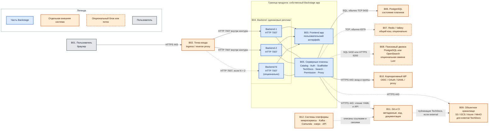

# Backstage 1.54.0 — развёртывание и настройка

Backstage — внутренний портал для разработчиков: какие у нас сервисы, кто владелец, где репозиторий, как поднять новый. Это **фреймворк**, не готовый бинарь «скачал — работает»: вы собираете *свой* экземпляр (`create-app`) и наполняете плагинами. Это **не** озеро эталонных клиентских данных, **не** шина событий, **не** процессный движок и **не** интеграционное API к государственным сервисам.

Версия, о которой этот документ: **Backstage 1.54.0** (релиз основной линии 18 августа 2026; на дату подготовки — последний стабильный main-line релиз).  
Документация: https://backstage.io/docs/  
Релизы: https://github.com/backstage/backstage/releases/tag/v1.54.0  
Создание приложения: `npx @backstage/create-app@latest`.  
Образы: **своего** приложения. Официальный Docker-гайд собирает образ из репозитория app; базовый runtime в шаблоне 1.54 — `node:24-trixie-slim`.  
На Kubernetes: Backstage **задуман** как stateless Deployment + внешний PostgreSQL. Официальный путь Spotify: собрать Docker-образ → registry → Deployment YAML. Чарт проекта: **Helm `backstage/backstage` 2.8.2** (17 июня 2026, `https://backstage.github.io/charts`, OCI `ghcr.io/backstage/charts/backstage`). Чарт **прямо пишет**: дефолтный образ — vanilla demo, **для боя скорее всего не подходит**; в бой кладут **свой** образ своего app.

Лицензия **Apache 2.0**. License-server нет. Проект в CNCF Incubating. Версия `1.54.0` **не semver продукта**: ломающие изменения бывают в minor. Релиз **1.54.0** содержит **critical security fixes** плагина Kubernetes — в бой без этого патча линейки 1.54 не идти, если плагин включён.

Этот текст — не набор команд «скопируй `app-config.yaml`», а правила, без которых система не будет одновременно устойчивой к сбоям, масштабируемой и безопасной. Пошаговая установка — в `Backstage.install.md`.

---

## Назначение системы

Backstage нужен, чтобы **сотня команд не потеряла свои же сервисы**: кто владелец, какой репозиторий, какая OpenAPI, как завести новый сервис «как у всех». Каталог хранит метаданные *программного обеспечения организации*, не карточки клиентов.

Kafka доставляет факт. Озеро хранит истину о клиентах. Camunda ведёт процесс. Интеграционное API ходит наружу. Портал отвечает на другой вопрос: карта микросервисов, шаблоны скелета (логгер, метрики, контракт Kafka), документация рядом с кодом. Он **не** делает ваши микросервисы event-sourced и **не** ищет клиента по ИНН.

Нечестная роль: «положим клиентов и эталон в каталог, озеро не нужно». Каталог не ACID-модель персональных данных и не переживает «удалили YAML — сущность осиротела» так, как озеро должно переживать юридическую истину.

---

## Перечень функций

Что умеет self-hosted Backstage (по документации проекта; набор зависит от ваших плагинов):

1. **Показывать Software Catalog** — реестр сущностей (сервисы, API, сайты, библиотеки, люди, группы). Каждая сущность описывается YAML `catalog-info.yaml` в Git. Фоновый цикл периодически заново обрабатывает все сущности (`catalog.processingInterval`).
2. **Подтягивать сущности самим** (entity provider) по расписанию или webhook: организация в GitLab, LDAP и т.п. Произвольный pull request не должен заводить `User` / `Group` / `Template` — это задают `catalog.rules`.
3. **Генерировать репозитории по шаблону** (Scaffolder / Software Templates). Действия выполняются **на хосте backend**. Это не Camunda и не процесс заявки в госорган.
4. **Отдавать документацию рядом с кодом** (TechDocs, Markdown → MkDocs). Сборка *внутри* пода (`builder: local`) или заранее в CI, а портал только читает из объектного хранилища (`external`).
5. **Искать по каталогу и докам.** Сам Backstage поисковиком не является: подключают Lunr (в памяти процесса — дефолт create-app, в бою официально **крайне не рекомендован**), PostgreSQL или Elasticsearch/OpenSearch.
6. **Впускать людей через IdP** (GitLab, GitHub, OIDC, SAML, reverse proxy). Вход «гостем» в документации: удобно не в бою; в Docker-гайде — **не для контейнеров**.
7. **Выдавать JWT** (Backstage token), которым UI доказывает backend «я вот этот пользователь». Ключи подписи по умолчанию **короткоживущие и теряются при рестарте**, если не задать свой keystore.
8. **Решать «можно ли это действие»** (permission framework). **По умолчанию выключен**: все залогиненные видят и делают почти всё. Включается `permission.enabled: true` + ваша политика. В create-app часто стоит allow-all — это не RBAC «из коробки».
9. **Проксировать HTTP из браузера** (обход CORS). Опасно, если в него вшивают секреты: любой, кто дошёл до портала, бьёт ими во внешний API.
10. **Отдавать пробы Kubernetes** с 1.29: `/.backstage/health/v1/liveness` и `/.backstage/health/v1/readiness`.
11. **Масштабироваться репликами** одинаковых подов за балансировщиком с общей PostgreSQL. Несколько подов **не выбирают лидера**. Состояние — в базе. Дальше backend можно резать на несколько Deployment (каталог отдельно от шаблонов) — из коробки «поставил два Deployment и заработало» документация **не обещает**.

Чего система **не** делает и часто путают: она не источник истины клиентских данных, не шина Kafka, не BPMN, не поиск по терабайтам логов, не кластерный консенсус, не готовый RBAC «включи галочку», не ГОСТ TLS. Демо-образ Helm как бой чарт 2.8.2 прямо запрещает. Официального порога задержки между дата-центрами нет: для подов важен RTT до **PostgreSQL** и Git, не «магия Backstage».

---

## Основные элементы системы и зависимости

Backstage — одно приложение, но его пользовательская часть, серверные плагины и зависимости могут жить в разных процессах и системах. На схеме показана типовая боевая топология; число реплик и выбор опциональных зависимостей определяются отдельно по нагрузке и требованиям организации.

### Схема инстансов и потоков

Оранжевые блоки развёртываются и сопровождаются отдельно от Backstage. Фиолетовые блоки и пунктирные стрелки обозначают варианты, которые не обязательны для каждого экземпляра. Синие блоки входят в собранное организацией приложение Backstage. Серый блок — пользователь, а блоки легенды не являются участниками потоков.

### Описание блоков

| Блок | Что это; технологии и варианты | Назначение | Принадлежность |
|---|---|---|---|
| **B01. Пользователь** | Браузер разработчика, владельца сервиса или оператора каталога | Открывает портал, ищет сущности, читает документацию, запускает разрешённые шаблоны | Не часть продукта |
| **B02. Точка входа** | Ingress-контроллер или reverse proxy; конкретная реализация платформой не задана. Аутентифицирующий proxy — рекомендуемый, но не обязательный вариант | Принимает HTTPS, завершает TLS, направляет запросы на живые backend-реплики; может выполнять предварительную аутентификацию и сетевые ограничения | Отдельная система |
| **B03. Frontend app** | React-приложение Backstage. Обычно его статические файлы раздаёт backend; опционально их можно вынести в NGINX или CDN | Отображает каталог, поиск, шаблоны, документацию и страницы установленных frontend-плагинов | Часть продукта |
| **B04. Backend** | Приложение Node.js с одинаковыми репликами. На схеме две реплики показаны как пример рабочей избыточности, `Backend-N` — явная возможность дальнейшего горизонтального масштабирования, а не обязательное число | Обслуживает HTTP API и frontend, запускает серверные плагины. Реплики не выбирают лидера и используют общую базу для состояния и координации | Часть продукта |
| **B05. Серверные плагины** | Модули backend: Catalog, Auth, Scaffolder, TechDocs, Search, Permission и Proxy. Фактический набор определяется сборкой приложения. При необходимости плагины можно разнести по нескольким backend-приложениям, но для этого требуется настроенное обнаружение сервисов | Реализуют функции портала: обработку каталога, вход, шаблоны, документацию, поиск, решения о доступе и HTTP-проксирование | Часть продукта |
| **B06. PostgreSQL** | Внешняя PostgreSQL. В локальной разработке возможна SQLite, но она не заменяет общую базу для нескольких реплик | Хранит состояние плагинов, включая каталог и задачи Scaffolder; обеспечивает общую точку координации backend-реплик. Доступность и резервное копирование базы проектируются отдельно | Отдельная система; практически обязательна для боевого многорепличного экземпляра |
| **B07. Redis / Valkey** | Совместимое внешнее хранилище ключей и значений. Подключается только если выбран общий кэш; локальный кэш процесса остаётся вариантом для разработки | Даёт нескольким репликам общий кэш. Не является базой каталога и не заменяет PostgreSQL | Отдельная опциональная система |
| **B08. Поисковый движок** | Варианты backend поиска: PostgreSQL или Elasticsearch/OpenSearch. Lunr встроен в память процесса, но документация крайне не рекомендует его для production и нескольких узлов | Индексирует каталог и TechDocs для строки поиска | Отдельная опциональная система, если не используется индекс в PostgreSQL; Lunr является библиотекой внутри процесса |
| **B09. Объектное хранилище** | S3, Google Cloud Storage, Azure Blob Storage либо S3-совместимое MinIO. Нужно для рекомендуемого варианта TechDocs с внешней сборкой; локальная сборка и локальная публикация допустимы как отдельный вариант для разработки | Хранит готовые статические материалы TechDocs независимо от жизненного цикла backend-реплик | Отдельная система; опциональна относительно Backstage, но нужна для показанного варианта `external` |
| **B10. Корпоративный IdP** | Провайдер идентификации через OIDC, OAuth, SAML или доверенный reverse proxy. Конкретный способ зависит от установленного auth-модуля. Guest предназначен не для боевого входа | Подтверждает личность пользователя; при выбранной интеграции может быть источником групп, используемых при сопоставлении с сущностями каталога | Отдельная система |
| **B11. Git и CI** | GitHub, GitLab или другой поддержанный Git-провайдер; CI — отдельный конвейер организации и на схеме нужен для варианта внешней сборки TechDocs | Git хранит `catalog-info.yaml`, исходный код и документацию. Backstage читает метаданные и API Git, а Scaffolder при разрешённой конфигурации создаёт или изменяет репозитории. CI может собирать и публиковать TechDocs | Отдельные системы |
| **B12. Системы платформы** | Микросервисы, Kafka, Camunda, озеро данных и интеграционные API | Представлены в каталоге метаданными, владельцами, связями и ссылками. Схема не означает, что Backstage исполняет их код, переносит их данные или входит в их тракт запросов | Отдельные системы; не компоненты Backstage |

### Как проходят потоки

1. Браузер обращается к единой точке входа по HTTPS. В типовой схеме TLS завершается до backend, а порт **7007/TCP** остаётся доступен только внутри доверенного контура.
2. Точка входа распределяет запросы между доступными одинаковыми backend-репликами. Число `N` не задано документацией как норматив: оно выбирается по измеренной нагрузке и целям доступности.
3. Frontend загружается в браузер и вызывает API серверных плагинов. Отдельная стрелка от frontend к внешним системам не показана намеренно: штатные интеграции выполняются через backend, чтобы не выдавать браузеру серверные секреты и не зависеть от CORS внешних API.
4. Все реплики обращаются к одной логической PostgreSQL. Падение реплики не уничтожает каталог, но недоступность базы нарушает работу зависящих от неё плагинов. Реплики Backstage не являются копиями или резервными копиями базы.
5. Catalog периодически читает `catalog-info.yaml` и данные провайдеров из Git. Если Git временно недоступен, уже сохранённые данные могут оставаться видимыми, но обработка новых изменений останавливается до восстановления источника.
6. Auth перенаправляет пользователя к выбранному IdP и после успешного входа выдаёт идентичность Backstage. Доступность IdP поэтому находится в критическом пути нового входа.
7. При `TechDocs` в варианте `external` CI собирает документацию и помещает результат в объектное хранилище, а backend только читает и отдаёт готовые файлы. Вариант `local` существует, но локальный диск отдельной реплики не является общим хранилищем.
8. Поиск может хранить индекс в PostgreSQL либо во внешнем OpenSearch/Elasticsearch. Lunr держит индекс в памяти конкретного процесса, поэтому не подходит как общий боевой индекс нескольких реплик.
9. Redis/Valkey участвует только при явно настроенном внешнем кэше. Его наличие не меняет роль PostgreSQL и не делает каталог источником истины клиентских данных.
10. Связь B12 → B11 пунктирная и логическая: команды описывают системы платформы в YAML, хранящемся рядом с кодом. Backstage показывает эту карту, но Kafka, Camunda, озеро и интеграционные API продолжают работать независимо от портала.

### Что входит в состав

| Роль | Зачем | Как масштабируется |
|---|---|---|
| **Frontend (app)** | UI портала | По умолчанию раздаётся **тем же** backend. Можно вынести в NGINX/CDN — тогда конфиг **запекается на сборке** |
| **Backend** | API плагинов, каталог, шаблоны, вход, прокси | Горизонтально: одинаковые реплики, общая база. Вертикально: CPU/RAM Node. Дальше — **резать** на несколько Deployment |
| **Auth plugin** | Вход людей и выдача Backstage token | Для высокой изоляции — **отдельный** Deployment и **своя** база (threat model) |
| **Catalog plugin** | Реестр сущностей, processing loop | Упирается в PostgreSQL и во внешний Git (rate limit). Метрика: `catalog.processing.duration` |
| **Scaffolder** | Генерация репозиториев, действия на хосте | Очередь задач; тяжёлые шаблоны не должны душить каталог |
| **TechDocs backend** | Отдать статику доков | `local` считает MkDocs *в поде*; `external` только читает из S3/GCS/Azure/MinIO |
| **Search backend** | Индекс для строки поиска | Lunr = память процесса. Postgres / OpenSearch — внешний индекс |
| **Permission backend** | Решения allow/deny | Без него залогиненный = почти суперпользователь UI |
| **Proxy** | CORS-обход к внешним HTTP | Не масштабирует внешнюю систему; дырка, если вшиты токены |

Frontend и перечисленные backend-плагины входят в приложение Backstage. PostgreSQL, Redis/Valkey, поисковый движок, объектное хранилище, IdP, Git, CI, Ingress и наблюдаемые системы платформы в поставку Backstage не входят.

### Порты (контракт сети)

| Порт / путь | Назначение | Кому открывать |
|---|---|---|
| **7007/TCP** | Backend (и UI, если frontend в том же процессе). В Helm: Service `http-backend` | Только через Ingress. Не в интернет |
| **3000/TCP** | Dev-сервер frontend при `yarn start` | Только учебный хост. В бою нет |
| `/.backstage/health/v1/liveness` | Liveness (≥ 1.29) | Kubernetes, не мир |
| `/.backstage/health/v1/readiness` | Readiness | Kubernetes |
| `/.backstage/auth/v1/jwks.json` | Ключи плагина для service-to-service | Другие backend-плагины |
| `/api/<pluginId>/…` | HTTP API плагина | Через Ingress после входа |

UDP нет. Балансировщик HTTP перед 7007 **нормален** (это не Kafka). `app.baseUrl` / `backend.baseUrl` должны совпадать с тем, что видит браузер — иначе логин и CORS ломаются. В 1.54.0 allowlist OAuth redirect **ужесточили** (breaking).

Порты внешних систем на схеме — распространённые значения, а не неизменяемое требование Backstage: PostgreSQL обычно использует **5432/TCP**, Redis/Valkey — **6379/TCP**, OpenSearch — **9200/TCP**, HTTPS API Git, IdP и объектного хранилища — **443/TCP**. Фактические порты определяются конфигурацией этих отдельных систем.

### Зависимости окружения (что ещё должно быть)

- Стабильный DNS до PostgreSQL; от подов — до GitLab/IdP; от браузера — до `app.baseUrl`.
- Идентификация: люди — SSO; группы для политики прав — из sign-in resolver + User/Group в каталоге (ingestion из доверенного источника).
- `/metrics` в свежем app **нет**, пока сами не настроите OpenTelemetry (это отмечает Helm README).

---

## Краткие вводные

### Как устроена отказоустойчивость

Это **не кворум**. Падение пода Backstage при `replicas ≥ 2` и живом PostgreSQL = пользователь попал на соседний под. Падение PostgreSQL = портал «глухой», даже если поды живы.

**1) Процесс Backstage**

| Что падает | Что происходит |
|---|---|
| Один под из нескольких за Service | Остальные отвечают. Координация — через базу |
| Все поды одной зоны, остальные зоны живы, topology spread сделан | Сервис жив, если PostgreSQL жив |
| Единственный под (`replicas: 1`) | Выкат и падение ноды = простой UI/API |
| `builder: local` + диск пода | Рестарт и вторая реплика **не делят** сгенерированные доки |
| Lunr на нескольких репликах | У каждого процесса **свой** индекс в RAM |

Официальный горизонтальный масштаб: увеличить `replicas` у Deployment. Пример в golden-path: `replicas: 3`.

**2) PostgreSQL**

Без HA базы «HA Backstage» — табличка. Реплики каталога не копируют данные друг другу. Политика бэкапа и failover — в контуре PostgreSQL. Учебный манифест k8s-гайда: **1 replica** Postgres + `hostPath` — для minikube, в бою том должен переживать ноду.

**3) Ключи входа**

По умолчанию signing keys теряются при рестарте. После rolling update пользователи могут словить «неизвестный kid». Для боя рассматривают `auth.keyStore.provider: static`.

**4) Внешние системы**

Упал Git — каталог замирает (UI со старыми данными может ещё отвечать). Упал IdP — нельзя войти.

### Как устроено масштабирование

Несколько независимых осей (golden-path Scaling):

1. **Больше пользователей и плагинов** → сначала **больше одинаковых реплик** за балансировщиком. Это простой путь; его советуют исчерпать раньше split.
2. **Каталог не успевает** (`catalog.processing.duration` растёт) → processingInterval, rate limit Git, мощность Postgres, затем **вынести catalog** в отдельный Deployment.
3. **Очередь Scaffolder** → отдельный backend только со scaffolder (изоляция CPU и секретов Git write).
4. **Медленный UI** → вынести frontend на CDN/NGINX.
5. **Поиск** → уйти с Lunr на Postgres (десятки тысяч документов — формулировка документации) или на OpenSearch.

Сигналы «пора масштабировать»: рост latency API, отставание catalog processing, очередь scaffolder, жалобы на медленные страницы.

Для split **нужен свой DiscoveryService**. Модули живут **в том же** процессе, что плагин, который расширяют. Нельзя вынести GitLab entity provider в другой Deployment отдельно от catalog. Начинать со split «на всякий случай» без требования ИБ — лишняя сложность.

### Безопасность самого Backstage

Компрометация портала = карта всех сервисов, токены Git/IdP, шаблоны, которые **пишут в Git и крутят код на хосте**, прокси к внутренним API. Threat model проекта:

- Рассчитан на **защищённый контур**, не на публичный интернет. От DoS — только «зачаточная» защита; оператор ставит proxy/WAF/лимиты сам.
- Рекомендуемый вход: **аутентифицирующий reverse proxy** плюс нормальный sign-in.
- С backend ≥ **1.24** есть встроенная защита API от анонимов, **если не** выставлен `backend.auth.dangerouslyDisableDefaultAuthPolicy`. Frontend-бандл при этом по умолчанию **всё равно скачивается**.
- Залогиненный пользователь **по умолчанию видит и может почти всё**. Тонкий доступ — только `permission.enabled: true` и своя policy.
- Плагины на одном хосте и с доступом к **чужой** логической базе считаются имеющими полный доступ к тому плагину. Для высокой безопасности **auth — отдельный сервис со своей базой**.
- `oauth2Proxy` **не проверяет** подпись заголовков — внутренний злоумышленник может подделать identity.
- Список доверенных хостов UrlReader — `backend.reading.allow`. Ошибка списка = чтение metadata облака (`169.254.169.254`) или внутренних админок.
- Релиз **1.54.0** — critical fixes плагина Kubernetes; `skipTLSVerify: true` пишет warning в 1.54 — в бою не оставлять.

«Поставили Helm с `image.tag: latest` и Guest» — это витрина, не портал организации.

---

## Допущения

Ниже то, чего не было в исходном запросе, но без чего нельзя нарисовать конкретную схему. Если допущение неверно — схему надо пересмотреть.

1. Берём **self-hosted Backstage 1.54.0** как свой app из `create-app`, не Red Hat Developer Hub и не SaaS.
2. Бой крутится в Kubernetes, образ — **собранный вами**. Helm 2.8.2 — способ описать Deployment. Чарты пинить **версией**, не `latest`.
3. Три дата-центра = три зоны отказа Kubernetes. Три зала с общим питанием spread подов не спасают.
4. Цель отказа: пережить **1** дата-центр, не 2 из 3.
5. Нагрузки нет — нет цифры «N реплик и M CPU». Есть сигналы (latency, processing duration, очередь scaffolder, heap Node) и рычаги (реплики, split backend, кэш, поисковый движок).
6. Формального SLA / RPO / RTO нет. Живые 3 пода ≠ юридический 24/7. RPO портала ≈ RPO PostgreSQL + то, что ещё не успел обработать catalog из Git.
7. Корпоративный IdP и Git есть или будут. Guest и `file:` locations — для теста.
8. Идентификация людей в бою — SSO, не Guest.
9. Шифрование канала пользователя — TLS на Ingress. Отдельная криптография государством не озвучена.
10. Учебный стенд изолирован. На нём допустимы SQLite, Guest, Lunr, `builder: local`. В бой их не копируем.
11. Kafka, Camunda, озеро, интеграционное API — объекты *каталога* и ссылки, не часть этого ПО.
12. PostgreSQL, OpenSearch, Redis, Vault — отдельные продукты со своими HA.
13. Лицензия Apache 2.0. Следить нужно за **плагинами из npm**: threat model требует vetting как любого пакета.
14. Один логический каталог на организацию. Три независимых Backstage без общей базы и без общего Git = три карты сервисов.

---

## Критически важные условия, которых нет в исходном контексте

Их нужно закрыть **до** «нарисовали Deployment и забыли».

| Пробел | Почему это ломает решение |
|---|---|
| **Один Kubernetes на три площадки или три изолированных** | Несколько реплик имеют смысл, только если они видят **одну** PostgreSQL (или осознанный active/passive). Три каталога без общей базы — три истины |
| **Задержка до PostgreSQL** (p50/p95/p99, все пары площадка↔база) | Каждый запрос каталога бьёт в базу. Высокий RTT → медленный UI, таймауты пула, ложные readiness |
| **Где живёт Git и IdP** | Processing и логин зависят от них. Если Git только в одном дата-центре — падение этой площадки = каталог замирает |
| **Нужен ли Scaffolder в бою** | Это выполнение шаблонов **на хосте** с часто широкими правами на Git. Без политики — главный attack surface портала |
| **TechDocs: CI или local builder** | `local` + несколько реплик + пустой диск пода = гонки. Документация: recommended setup — **external** + объектное хранилище |
| **Кто пользователи** | От этого зависят permission policy, catalog.rules, можно ли Guest на препроде |
| **Какой Git и какие токены** | `url` locations без integration не читаются. Org-admin токен — большой радиус взлома |
| **Что нельзя светить в каталоге** | В сущность легко положить внутренние URL, владельцев, связи с адаптерами к госслужбам. Каталог — карта атаки |
| **Совместимость Helm 2.8.2 с вашей версией Kubernetes** | Формальный минимум не заменяет прогон в вашем контуре |
| **Нужен ли split auth/catalog/scaffolder сразу** | Threat model советует отдельный auth+база для high-security. Сложность Discovery растёт |

---

## Глоссарий

- **ACID** — набор свойств транзакционной базы данных: атомарность, согласованность, изоляция и долговечность.
- **API** — программный интерфейс, через который одна система вызывает функции другой.
- **App / Backstage app** — конкретное приложение Backstage, которое организация создаёт, настраивает, дополняет плагинами и собирает самостоятельно.
- **Auth plugin** — серверный плагин Backstage для входа пользователей и выдачи токенов.
- **Backend** — серверная часть Backstage: принимает HTTP-запросы и запускает серверные плагины.
- **Backstage token / JWT** — подписанный токен, которым пользовательская или серверная часть подтверждает идентичность при вызове backend.
- **BPMN** — стандарт графического описания бизнес-процессов; Camunda исполняет такие процессы, Backstage — нет.
- **Catalog / Software Catalog** — реестр метаданных о программных сущностях организации и связях между ними.
- **Catalog entity** — отдельная сущность каталога, например Component, API, Resource, User, Group или Template.
- **`catalog-info.yaml`** — YAML-файл с описанием одной или нескольких сущностей каталога.
- **`catalog.rules`** — правила, ограничивающие допустимые типы сущностей из конкретных источников каталога.
- **CDN** — распределённая сеть выдачи статических файлов; может отдельно раздавать frontend.
- **CI** — автоматический конвейер сборки и проверки изменений; в схеме может также собирать TechDocs.
- **Container / контейнер** — изолированный процесс, запускаемый из подготовленного образа с приложением и зависимостями.
- **CORS** — браузерное правило, ограничивающее запросы страницы к другому источнику.
- **`create-app`** — официальный генератор исходного проекта собственного Backstage app.
- **Deployment** — объект Kubernetes, который поддерживает заданное число одинаковых pod и управляет их обновлением.
- **DiscoveryService** — механизм Backstage, по которому разнесённые backend-плагины находят HTTP-адреса друг друга.
- **Entity provider** — модуль, который массово поставляет и обновляет сущности каталога из внешнего источника.
- **Failover** — переключение на резервный экземпляр или площадку после отказа основного.
- **Framework / фреймворк** — программная основа, из которой организация собирает своё приложение; это не неизменяемый готовый бинарный продукт.
- **Frontend** — пользовательская часть Backstage, выполняемая в браузере.
- **Git** — система версионирования; в этом документе также обозначает сервер репозиториев, где лежат код, документация и YAML каталога.
- **Guest** — гостевой провайдер входа без полноценной корпоративной идентификации; не вариант боевой аутентификации.
- **HA** — высокая доступность, достигаемая избыточными экземплярами и устранением одиночных точек отказа.
- **Helm chart** — параметризованный пакет Kubernetes-манифестов; он описывает ресурсы запуска, но не создаёт собственный Backstage app.
- **IdP** — корпоративный поставщик идентификации, который проверяет пользователя.
- **Ingress** — точка публикации HTTP/HTTPS-сервиса Kubernetes и маршрутизации запросов к нему.
- **Instance / инстанс** — отдельный работающий экземпляр процесса или системы.
- **JWKS** — набор открытых ключей, по которым проверяют подпись JWT.
- **Kafka** — отдельная платформа передачи событий; в Backstage она может быть описана как ресурс или зависимость, но не исполняется порталом.
- **Keystore** — хранилище ключей, которыми Auth подписывает токены.
- **Kubernetes** — система управления контейнерными приложениями.
- **Liveness probe** — проверка Kubernetes, отвечающая, нужно ли перезапустить контейнер.
- **Lunr** — поисковая библиотека с индексом в памяти процесса; не общий индекс нескольких backend-реплик.
- **MinIO** — S3-совместимое объектное хранилище.
- **MkDocs** — генератор статической документации из Markdown, используемый TechDocs.
- **Node.js** — среда выполнения JavaScript, в которой работает backend Backstage.
- **OAuth / OIDC / SAML** — протоколы и стандарты, через которые Backstage может подключаться к внешней системе входа; конкретная поддержка зависит от auth-модуля.
- **Object storage / объектное хранилище** — хранилище файлов как объектов в бакетах; применяется для готовых материалов TechDocs.
- **OpenSearch / Elasticsearch** — внешние поисковые движки, которые могут хранить общий индекс Backstage.
- **OpenTelemetry** — стандарт сбора телеметрии приложения; метрики не появляются только от установки Backstage без настройки.
- **Permission framework** — механизм Backstage, который перед выполнением поддерживаемого действия запрашивает решение allow или deny у политики.
- **Plugin / плагин** — модуль, добавляющий Backstage пользовательскую или серверную функцию.
- **Pod** — минимальный запускаемый объект Kubernetes; в типовой схеме содержит одну backend-реплику Backstage.
- **PostgreSQL** — реляционная база данных, используемая серверными плагинами для постоянного состояния и координации.
- **Processing loop** — периодическая обработка источников и сущностей каталога.
- **Proxy plugin** — backend-плагин, который выполняет HTTP-запрос к внешней системе от имени frontend.
- **RBAC** — модель прав на основе ролей; Backstage Permission framework позволяет реализовать политику, но не даёт универсальную готовую RBAC-модель одной настройкой.
- **Readiness probe** — проверка Kubernetes, определяющая, можно ли направлять запросы на pod.
- **Redis / Valkey** — внешние совместимые хранилища ключей и значений, используемые как общий кэш.
- **Replica / реплика** — один из одинаковых одновременно работающих backend-процессов.
- **Reverse proxy** — промежуточный HTTP-сервер перед Backstage; принимает клиентское соединение и пересылает запрос backend.
- **RPO** — допустимый объём потери данных, измеряемый временем относительно последней сохранённой копии.
- **RTO** — допустимое время восстановления сервиса после отказа.
- **RTT** — время прохождения запроса до другой системы и ответа обратно.
- **S3** — API объектного хранилища; его реализуют облачные сервисы и совместимые продукты.
- **Scaffolder / Software Templates** — плагин шаблонов, который создаёт заготовки проектов и выполняет настроенные действия, включая операции с Git.
- **Service** — объект Kubernetes со стабильным сетевым адресом, распределяющий трафик между подходящими pod.
- **Service-to-service** — взаимодействие серверных плагинов или сервисов без браузера пользователя.
- **Sign-in resolver** — правило, сопоставляющее учётную запись внешнего IdP с идентичностью пользователя Backstage.
- **Split backend** — размещение групп серверных плагинов в разных backend-приложениях вместо одного процесса.
- **SQLite** — встраиваемая база данных; вариант для локальной разработки, но не общая база нескольких реплик.
- **SSO** — единый корпоративный вход через общий IdP.
- **Stateless** — свойство процесса, при котором долговременное состояние вынесено наружу, поэтому экземпляр можно заменить другой репликой.
- **TechDocs** — подсистема Backstage для сборки, хранения и показа документации рядом с сущностями каталога.
- **TLS / HTTPS** — шифрование HTTP-соединения и протокол HTTP поверх этого шифрования.
- **UrlReader** — служба Backstage, читающая файлы и URL из разрешённых внешних источников.
- **Vault** — внешняя система управления секретами; конкретная реализация в состав Backstage не входит.
- **Webhook** — входящий HTTP-вызов, которым внешняя система сообщает об изменении.
- **YAML** — текстовый формат структурированных данных, применяемый в `catalog-info.yaml` и конфигурации.
- **Вертикальное масштабирование** — увеличение CPU или памяти одного процесса.
- **Горизонтальное масштабирование** — увеличение числа одинаковых реплик.
- **Кворум** — правило согласования большинства участников распределённой системы; backend-реплики Backstage собственного кворума не образуют.
- **Озеро данных** — отдельное хранилище больших объёмов исходных и подготовленных данных; Software Catalog его не заменяет.
- **Репозиторий** — управляемое Git хранилище файлов и истории изменений проекта.
- **Шина событий** — инфраструктура доставки событий между системами; в платформенном контексте эту роль выполняет Kafka, а не Backstage.

---

## Источники (чтобы не принимать на веру)

- Релиз 1.54.0 (18 Aug 2026): https://github.com/backstage/backstage/releases/tag/v1.54.0
- Политика версий, Node 22/24 (с 1.46.0), PostgreSQL last 5 major: https://backstage.io/docs/overview/versioning-policy
- Архитектура, БД на плагин, кэш Redis/Valkey: https://backstage.io/docs/overview/architecture-overview/
- Getting started, порты 3000/7007, Yarn 4.4.1: https://backstage.io/docs/getting-started/
- Docker, Guest не для контейнеров, Node 24 в шаблоне: https://backstage.io/docs/deployment/docker
- Kubernetes, stateless + Postgres: https://backstage.io/docs/deployment/k8s/
- Масштаб: реплики, split, frontend отдельно: https://backstage.io/docs/golden-path/deployment/scaling
- Split backend, Discovery не из коробки: https://backstage.io/docs/backend-system/building-backends/
- Auth, Guest не для prod UI, keyStore static: https://backstage.io/docs/auth/
- Threat model: https://backstage.io/docs/overview/threat-model
- Permissions: https://backstage.io/docs/permissions/overview
- SQLite → Postgres: https://backstage.io/docs/tutorials/switching-sqlite-postgres/
- Catalog rules, readonly, processingInterval: https://backstage.io/docs/features/software-catalog/configuration
- Search Lunr/Postgres/ES, Lunr не для prod: https://backstage.io/docs/features/search/search-engines
- TechDocs: https://backstage.io/docs/features/techdocs/configuration
- Health v1: https://backstage.io/docs/plugins/observability
- Helm 2.8.2, demo image не для prod, порт 7007: https://github.com/backstage/charts
- CNCF Incubating, Apache 2.0: https://www.cncf.io/projects/backstage/

Утверждения вида «Backstage переживёт два дата-центра» или «N миллисекунд — можно размазать поды» в документации проекта **отсутствуют** — поэтому в этом файле их нет. Задержку до PostgreSQL и Git надо измерить у себя. Число реплик `3` из golden-path — пример, не смета.
