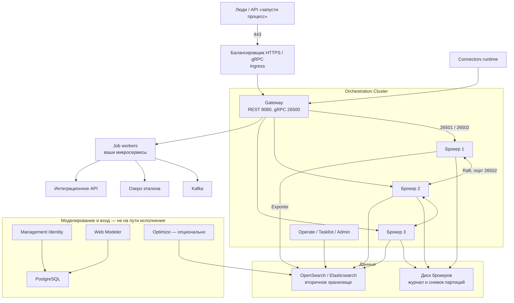

# Camunda 8.9 — развёртывание и настройка

Camunda 8 — движок долгих бизнес-процессов: схема (прямоугольники «задачи», ромбы «решения») исполняется на отдельном кластере, а ваши программы только берут работу и возвращают короткий результат. Это **не** очередь событий (Kafka), **не** озеро клиентских карточек и **не** интеграционная шина к государственным сервисам.

Версия, о которой этот документ: линейка **8.9** (стандартная поддержка до **13 октября 2027**). Целевой патч для Kubernetes: Helm-чарт **`camunda-platform` 14.8.5** → образ Orchestration Cluster `camunda/camunda:8.9.17` (матрица https://helm.camunda.io/camunda-platform/version-matrix/camunda-8.9/). Соседние образы той же строки чарта: Connectors `8.9.8`, Optimize `8.9.17`, Management Identity `8.9.8`, Web Modeler `8.9.7`, Console `8.9.88`.

Документация линейки: https://docs.camunda.io/  
Поддерживаемые среды: https://docs.camunda.io/docs/reference/supported-environments/  
Репозиторий чарта: `https://helm.camunda.io`, чарт `camunda/camunda-platform`.

**8.10** на дату документа — **Alpha** (Camunda Hub, chart 15.x, нужен Helm CLI **v4**). В бой этого файла **не** берём. Линейка **8.8** ещё в standard support до 13 апреля 2027; переход на 8.9 — только с 8.8.x, не «через одну minor».

Ставите **свою** установку Self-Managed, не облако Camunda Cloud. С 8.6 production Self-Managed **требует лицензию**. Без ключа компоненты пишут Non-Production — это не «можно в банк».

Этот текст — не набор команд «скопируй Helm values и запусти», а правила, без которых система не будет одновременно устойчивой к сбоям, масштабируемой и безопасной. Пошаговая установка — в `Camunda 8.install.md`.

---

## Назначение системы

Camunda 8 нужна, чтобы **помнить длинный сценарий**, который не укладывается в один вызов API: «запросили выписку → ждём дни → пришёл ответ → развилка → человек одобрил». Движок хранит *состояние живого процесса* (на каком шаге заявка), а не клиентское досье.

Событие «клиент изменился» живёт в Kafka. Эталон карточки — в озере. Наружу в ведомства ходит ваше интеграционное API. Camunda говорит процессу «сейчас нужен клиент / сейчас ждём ответ ведомства»; воркер (отдельная ваша программа) сходит куда надо и вернёт в процесс идентификатор и статус, не сырой SOAP и не XML досье.

Движок **всегда удалённый**: ваши микросервисы не встраивают его в ту же JVM. Упал воркер — работы копятся в движке. Упало большинство брокеров — новые шаги не стартуют ни у кого.

---

## Перечень функций

Что умеет Camunda 8 Self-Managed из коробки (по документации поставщика):

1. **Исполнять схемы процессов и таблицы решений** (BPMN и DMN): задеплоенная схема — определение процесса; один конкретный прогон («заявка №123») — экземпляр.
2. **Хранить состояние живых процессов** на диске брокера: журнал партиции (как шард) плюс снимок. Это память процесса, не склад клиентов.
3. **Копировать каждую партицию** на несколько брокеров протоколом Raft. Запись считается принятой, только когда большинство копий подтвердило. Сколько копий — `replicationFactor` (для трёх копий большинство = 2).
4. **Принимать команды через вход (gateway)**: REST **8080** и gRPC **26500**. Клиенты и воркеры ходят на gateway, не на брокеры как на «балансировщик Kafka». С 8.8 в Helm вход по умолчанию **встроен** в брокер; его всё равно масштабируют репликами входа.
5. **Выдавать сервисные задачи воркерам.** Задача в схеме становится «работой» с именем типа (`fetch-client-from-lake`). Её забирает **отдельная программа**, делает дело, говорит движку «готово» или «ошибка». Движок **не** вызывает ваш Java-метод внутри своей JVM.
6. **Показывать оператору, где застрял процесс** (Operate) и **человеческие задачи** (Tasklist). Оба читают **вторичное** хранилище (OpenSearch / Elasticsearch / СУБД), не диск брокера. Без экспортёра экраны пустые, хотя процессы уже идут.
7. **Разграничивать доступ** встроенным Admin кластера (пользователи, права на процессы, задачи, API). Это **не** то же самое, что Management Identity для Web Modeler / Console / Optimize.
8. **Копировать события движка во вторичное хранилище** (Camunda Exporter). Если экспортёр не может писать, срабатывает backpressure: движок сам притормаживает пользовательские команды.
9. **Исполнять готовые коннекторы** (HTTP, Kafka и т.п.) отдельным runtime. Это не замена вашего интеграционного API к ведомствам.
10. **Считать аналитику по процессам** (Optimize) — отдельная опция, сильно нагружает вторичное хранилище.
11. **Рисовать схемы** в Desktop Modeler (программа на ПК) или Web Modeler (сервер + PostgreSQL). Уже задеплоенные процессы живут и без Web Modeler.
12. **Снимать согласованный бэкап** через API компонентов (движок + индексы экспорта) с одним идентификатором снимка. Снимок диска брокера «как виртуальная машина» согласованным бэкапом кластера **не** считается.

Чего система **не** делает и часто путают: она не шина событий, не озеро эталона, не встроенный движок в Spring Boot (это другая линейка продукта), не прозрачный «умер дата-центр — сами переключились» (официальная схема на две площадки требует **ручной** процедуры, а на три площадки как first-class HA у поставщика нет). В переменных процесса поставщик **не** рекомендует большие данные: потолок порядка **~3 МБ** на экземпляр; бенчмарки считают килобайты. Терабайты — озеру и Kafka.

---

## Требования к развёртыванию

### Требования к ПО

| Что | Что ставить | Комментарий |
|---|---|---|
| **Формат поставки** | Контейнеры в Kubernetes (официальный Helm) **или** локальная сборка / Docker Compose для учёбы | Бой: чарт `camunda/camunda-platform` **14.8.5**, не `latest`. Учебный Camunda 8 Run и Compose поставщик прямо относит к разработке и тесту, не к бою. |
| **Kubernetes** | Certified Kubernetes, Helm CLI **v3** | В матрице 14.8.x указан Helm **3.20.x**. Helm v4 — требование линейки **8.10**, не 8.9. Совместимость чарта с вашей версией Kubernetes проверять на стенде (CSI, topology spread, PDB). |
| **ОС** | Linux на нодах Kubernetes | Это основной контур. Windows/macOS как хост — только учебный Run/Compose. **Боевой кластер брокеров на Windows-хосте в схеме с Kubernetes не предполагается.** |
| **Java на брокерах / Optimize / Connectors** | OpenJDK **21–25** | Management Identity: **17+**. Клиент воркера (Java): **8+** — это ваши микросервисы, не брокеры. |
| **Диск брокера** | Локальный **SSD**, том на каждого брокера (RWO) | Официально: **≥ 1000 IOPS**, задержка записи/msync в **низких единицах миллисекунд**, p99 **< 300 мс**. HDD не поддерживается. `emptyDir` = потеря журнала при рестарте пода. NFS — только если POSIX, не переставляет операции и **не** отдаёт один том на запись двум контейнерам (иначе порча данных). |
| **Вторичное хранилище (8.9)** | Elasticsearch **8.19+** или **9.4+**, **или** OpenSearch **2.19+** или **3.6+**, **или** поддержанная СУБД | С 8.9 в Helm тип **обязательно** задать явно (`orchestration.data.secondaryStorage.type`). Кластер **один** на Operate, Tasklist и Admin (не «каждый на своём»). H2 — дефолт Camunda 8 Run для ноутбука, **не** для нескольких брокеров в бою. |
| **PostgreSQL** | Внешний кластер (CloudNativePG или ваш HA), если нужны Identity / Web Modeler | В бою Bitnami-subchart из чарта **выключают**. |
| **Лицензия** | `CAMUNDA_LICENSE_KEY` / секрет Helm | С 8.6 прод Self-Managed без ключа нельзя. Единая модель на движок, Operate, Tasklist, Optimize, Identity, Connectors, Console, Web Modeler. |
| **Единый вход** | Корпоративный IdP (OIDC) | Дефолт чарта: `global.security.authentication.method: basic`. Учётка `demo` — только стенд. |
| **Бэкап** | Снимок индексов OpenSearch/ES **и** отдельное объектное хранилище для partition backup Zeebe | Снимок диска брокера «как VM» не считается. |
| **Часы** | NTP на нодах | Без синхронизации времени выборы Raft и сессии ведут себя непредсказуемо. |

Готовая локальная сборка Camunda 8 Run у поставщика есть — для знакомства, не для боя.

### Требования к ресурсам

Цифр «сколько ядер на ваши процессы» у проекта **нет** — нагрузки в исходном запросе не было. Ниже ориентиры поставщика и эвристики из sizing-гайда, не смета закупки.

| Роль | CPU | RAM | Диск |
|---|---|---|---|
| **Брокер движка** | В старых замерах поставщика по задержке фигурирует порядка **3,5 ядра** — это намёк не душить CPULimit в ноль, **не** ваша смета | Запас под журнал и снимок состояния; тяжёлые переменные процесса раздувают диск и экспорт | **SSD**, **≥ 1000 IOPS**, p99 записи **< 300 мс**. Типичный ориентир: партиция тянет порядка **1 ГиБ** суммарного payload |
| **Вход (gateway)** | Растёт от числа воркеров и стартов процессов, **если** партиции уже тянут | Как у реплик входа | Без своего склада процессов |
| **Вторичное хранилище (OpenSearch / ES)** | Отдельно от брокеров. Optimize на реалистичном ворклоаде: примерно **×3,4 CPU** и **×3,6 диск** поискового кластера; на максимуме пропуск движка падает на **25–50%** | Как у вашего кластера OpenSearch | Срок хранения записей процесса: при включённом Optimize поставщик рекомендует `minimum-age` **не короче 3 дней**, лучше **≥ 7**, в примере **30d** |
| **Учебный один брокер / C8 Run** | Как в values-local / Run | Меньше боевого | Маленький том; H2 вместо OpenSearch. На бой так нельзя |

Дополнительно:

- Потолок переменных экземпляра порядка **~3 МБ**; в бенчмарках 11 КиБ против 0,5 КиБ меняет диск **в 10–20 раз**.
- Правило большого пальца из sizing-гайда: закладывать порядка **20×** средней нагрузки, если важны пики и задержка. Это **не** замена замера.
- Dual-region у поставщика: минимум **8** брокеров, коэффициент копирования **4**. Это другая схема, не «три брокера на три площадки».
- Встроенной метрики размера очереди работ (backlog jobs) поставщик прямо пишет, что **нет**.

---

## Основные элементы системы и зависимости

Платформа — это **несколько отдельных программ**, а не один процесс. Ниже — те из них, которые ставятся как отдельные инстансы (свой процесс, часто свой под или машина), и как они вызывают друг друга.

### Схема инстансов и потоков

Как читать схему:

1. Человек или сервис заходит по HTTPS на балансировщик, тот отдаёт REST **8080** и gRPC **26500** на **gateway**. На внутренние порты **26501** (команды gateway → брокер) и **26502** (разговор брокеров: Gossip + Raft) внешний мир не пускают.
2. **Брокеры** равноправны: нет «главного сервера навсегда». У каждой партиции свой лидер; запись коммитится, когда большинство копий подтвердило. Тройка `clusterSize` / `partitionCount` / `replicationFactor` на всех брокерах должна быть **одинаковой**; коэффициент копирования не может быть больше числа брокеров.
3. Состояние живого процесса лежит **на диске брокера**. Operate и Tasklist смотрят во **вторичное** хранилище, куда пишет экспортёр. Без него экраны пустые; если экспортёр встал — сначала отстаёт картинка, потом движок сам душит команды.
4. **Воркеры** — ваши микросервисы. Они ходят в Kafka, озеро и интеграционное API. Движок их не содержит. Лишние воркеры одного типа делят работы.
5. **Connectors** — отдельный деплой готовых кубиков из схемы. Не второй контур интеграций в ведомства.
6. **Web Modeler**, **Management Identity** и **Optimize** живут рядом (свой PostgreSQL, свой вход). Их падение не останавливает уже задеплоенные процессы. Optimize в первом боевом контуре обычно выключают: он дорог по диску и CPU поиска.

Рядом, но это уже другое ПО: ваш кластер **OpenSearch 3.8.0** (ветка 3.6+ подходит для 8.9), PostgreSQL, объектное хранилище бэкапов, Ingress, корпоративный IdP. Ваша Kafka — источник и приёмник для воркеров, не транспорт ядра Camunda.

### Что входит в поставку

| Роль | Зачем | Как масштабируется |
|---|---|---|
| **Брокеры (Zeebe)** | Исполнение схем, журнал, Raft | Горизонтально: брокеры + партиции. Копии и зоны — для отказа, не «ещё запросов в секунду» |
| **Gateway** (часто встроен) | Вход gRPC/REST | Реплики входа; партиции на брокерах должны быть готовы заранее |
| **Operate / Tasklist / Admin** | Наблюдение, человеческие задачи, права кластера | Читают вторичное хранилище. Живой экран ≠ живой движок |
| **Exporter → OpenSearch / ES / СУБД** | Чтобы экраны и поисковые API видели процессы | Скорость экспорта ограничивает *видимость* и при застое — сам движок |
| **Connectors runtime** | Исполнение коннекторных задач из схемы | Несколько реплик; повтор той же работы без побочного эффекта — на вас |
| **Optimize** | Отчёты по процессам | Отдельный импортёр; официально сильно нагружает поиск |
| **Management Identity + Keycloak** | Вход в Modeler / Console / Optimize | Свой PostgreSQL; не кворум брокеров |
| **Web Modeler** | Совместная рисовалка | PostgreSQL; падение ≠ остановка уже задеплоенных процессов |
| **Клиенты / job workers** | Ваши микросервисы | Масштабируются **отдельно** от брокеров |

### Порты (контракт сети)

В YAML брокера порты такие. В одном фрагменте страницы Network ports значения переменных окружения для 26502/9600 скопированы ошибочно на 26501 — ориентир **поля YAML**, не эта опечатка. UDP для Raft/Gossip как отдельный контракт поставщик не описывает: это TCP ниже.

| Порт | Назначение | Кому открывать |
|---|---|---|
| **8080/TCP** | REST API gateway (клиенты, часть UI/API) | Воркеры, приложения, Ingress. Не в интернет без TLS и входа |
| **26500/TCP** | gRPC клиентов и воркеров | То же. Балансировщик должен понимать **долгие** потоки воркеров (обычный HTTP L7 рвёт стримы) |
| **26501/TCP** | Команды gateway → брокер (внутренний протокол) | Только внутри кластера движка |
| **26502/TCP** | Gossip + Raft между брокерами и gateway | Только брокеры и gateway |
| **9600/TCP** | Служебные метрики, готовность, API бэкапа | Prometheus, операторы бэкапа. Не в интернет |

Клиентов направляют на **gateway** (Service/Ingress 8080 и 26500). На 26501/26502 внешний мир не пускают. Балансировщик «как HTTP round-robin на 26502 всех брокеров» ломает Raft.

### Зависимости окружения (что ещё должно быть)

- Стабильный DNS или IP брокеров на 26501/26502; клиентам — до gateway.
- Один кластер вторичного хранилища на весь Orchestration Cluster. У вас уже есть контур **OpenSearch 3.8.0** — для 8.9 это попадает в ветку 3.6+. Это **не** тот кластер, что бизнес-поиск, и не Wazuh indexer.
- Пароли, лицензионный ключ, секреты коннекторов и OIDC — в Vault (или аналог), не в git и не в схеме процесса.
- Grafana смотрит здоровье брокеров и лаг экспорта — не бизнес-дэшборды заявок.

---

## Краткие вводные

### Как устроена отказоустойчивость

Это **не** один общий механизм на весь продукт. Несколько слоёв, у каждого свой отказ. Путать «docker compose с одной нодой» с отказоустойчивостью — главная ошибка.

**1) Брокеры и копии партиции**

Официальные примеры кворума:

| Копий (RF) | Кворум записи | Сценарий из документации |
|---|---|---|
| **3** | лидер + ещё **1** последователь | Один регион, **3 зоны**. Один брокер (одна зона) может умереть без потери закоммиченных данных |
| **5** | лидер + **2** последователя | Терпите потерю **двух** брокеров; дороже диском и сетью |
| **4** | исключение | Только схема **dual-region**: копии всегда на обеих площадках; потеря **целого** региона → кворума нет, обработка **встаёт**, оператор делает failover. Данные при правильной схеме не теряются (RPO 0) |

Нечётное число копий — норма для одного «региона из трёх зон». Чётное «на троих дата-центрах как у Kafka RF=3» **не** является описанным паттерном Camunda.

| Что падает | Что происходит |
|---|---|
| Один брокер из 3 при RF=3, копии в разных зонах | Выборы лидера на затронутых партициях. Закоммиченное живо |
| Два брокера из 3 | Кворума нет. Партиции не коммитят. Процессы **стоят** |
| Все брокеры в одном дата-центре | Падение площадки = падение движка. «Три пода в одном пуле нод» — не три площадки |
| Gateway / Ingress | Движок может быть жив, воркеры не достучатся. Нужны несколько реплик входа |
| OpenSearch (экспортёр не пишет) | Сначала Operate отстаёт (секунды–минуты — нормальная задержка видимости). Потом backpressure душит команды по всему кластеру |
| Job workers | Движок копит работы. Процессы не идут вперёд. Это **не** падение Raft, но для бизнеса = простой |
| Нет бэкапа движка + поиска с одним идентификатором | Копии не спасают от «удалили том / кривой rolling / шифровальщик» |

**2) Схема на две площадки (dual-region)**

Официально сертифицированная схема на **две** Kubernetes-площадки, минимум 8 брокеров, RF=4. При гибели региона обработка **останавливается немедленно**, пока не выполнят процедуру (failover в тестах поставщика: **< 1 минуты** *без* DNS). Failover **не автоматический**. OpenSearch как вторичное хранилище в этой схеме **не поддерживается** — только Elasticsearch, свои кластеры в каждом регионе. Третьего региона как кворумной схемы у поставщика нет.

**3) Экраны**

Падение Operate ≠ падение движка. Падение Tasklist ≠ «процессы умерли», но люди не закроют задачи.

### Как устроено масштабирование

Несколько независимых осей (их путают):

1. **Больше параллельных экземпляров и сервисных задач** → больше **партиций** и брокеров. Партиции планируют **до** нагрузки; это операция cluster scaling, не слайдер в UI.
2. **Больше входа** (воркеры, старты процессов) → больше реплик gateway, **если** партиции уже тянут.
3. **Тяжёлые переменные** → диск движка, объём экспорта, задержка. Ориентир: ~1 ГиБ payload на партицию; килобайты, не досье.
4. **Operate и поиск** → мощность **отдельного** OpenSearch, не «добавим брокер».
5. **Optimize** → примерно ×3,4 CPU и ×3,6 диск поиска; на максимуме пропуск движка падает на 25–50%. Включать «на всякий случай» — купить второй поисковый кластер зря.
6. **Воркеры** считаются отдельно. Здоровый кластер **не** значит, что очередь работ тает.

Нагрузки у вас нет — поэтому **нет** цифры «N брокеров и M партиций». Есть сигналы: backpressure, задержка commit, лаг экспорта, диск брокера, IOPS.

### Безопасность самой Camunda 8

Компрометация Orchestration Cluster = кто угодно стартует процессы, читает переменные (часто персональные данные и статусы госинтеракций), закрывает чужие задачи, дёргает воркеров. Учётка `demo:demo` (дефолт Basic в линейке 8.8+) равносильна ключу от операционки процессов.

Заявленное поставщиком:

- С 8.6 **прод Self-Managed без лицензии нельзя**. Ключ: `CAMUNDA_LICENSE_KEY` / `global.license.secret`.
- Дефолт аутентификации Helm 8.9: **basic**. Для боя — **OIDC**, свой IdP. Admin кластера и Management Identity — **разные** контуры; в бою оба смотрят на корпоративный IdP.
- Compose / C8 Run / basic `demo` — стенд. В интернет 8080/26500 так не выкладывают.
- Helm `values-tls.yaml` закрывает TLS **к** OpenSearch/ES/PostgreSQL/OIDC. **Не** закрывает весь gRPC между подами: для этого поставщик отсылает на service mesh или свою схему.
- Секреты коннекторов и клиентские секреты OIDC — в Secret/Vault, не в Git и не в схеме процесса.
- Шифрование журнала на диске — шифрование тома/CSI. Встроенного «encrypt partition» как замены диску нет.

«Поднять C8 Run и выдать 8080 разработчикам в VPN» — нормальный стенд. «Тот же YAML в бой» — инцидент.

---

## Допущения

Ниже то, чего не было в исходном запросе, но без чего нельзя нарисовать конкретную схему. Если допущение неверно — схему надо пересмотреть.

1. Берём **Camunda 8.9 Self-Managed**, не SaaS Camunda Cloud и не линейку 7. Облако и семёрка живут по другим манифестам, лицензиям и модели отказов.
2. Бой крутится в Kubernetes, установщик — официальный Helm `camunda-platform` **14.8.5** (пинить версию чарта и appVersion, не `latest`). Bitnami Elasticsearch/PostgreSQL из чарта — только оценка; в бою **выключены**.
3. Вторичное хранилище боя — **отдельный кластер OpenSearch 3.8.0**, тип Helm: `opensearch`. Не тот кластер, что бизнес-поиск, и не Wazuh. Dual-region с OpenSearch **нельзя** — если выберете dual-region, вторичное станет **Elasticsearch**, это смена допущения.
4. Три дата-центра = три независимых отказа. Три зала с общим питанием эту схему не спасают.
5. Цель отказа базовой схемы: пережить **1** дата-центр из 3, не 2 из 3. Два мёртвых дата-центра при трёх брокерах снимают кворум.
6. Dual-region (две площадки, RF=4) **не выбран по умолчанию:** он требует Elasticsearch, ручную процедуру, остановку обработки на время failover и сеть 26500–26502 между **двумя** Kubernetes. Третий дата-центр в этой схеме не даёт «кворум 2 из 3».
7. Нагрузки нет — нет сметы ядер. Есть рычаги (партиции, брокеры, воркеры, что класть в переменные, Optimize вкл/выкл).
8. Формального SLA / RPO / RTO нет. Цифры dual-region (RPO 0 / RTO failover < 1 мин без DNS) — тесты **поставщика** и **их** процедура, не ваш замер.
9. Лицензия Enterprise Self-Managed для боя **будет**. Без этого юридически схемы боя нет, сколько бы брокеров ни поставили.
10. Корпоративный OIDC будет. Basic/demo — для теста.
11. Интеграции с государственными сервисами идут только через ваше интеграционное API. Воркеры — клиенты этого API. Коннекторы Camunda в ведомства не плодим без отдельного решения архитектуры.
12. В переменных процесса — идентификаторы и статусы, не досье. Терабайты остаются в озере; Kafka несёт события изменений.
13. Шифрование канала — TLS JDK / mesh. Отдельная криптография по требованиям государства не озвучена.
14. Учебный стенд изолирован. C8 Run, Compose, H2, одна копия партиции на нём допустимы. В бой их не копируем.
15. Optimize в первом боевом контуре **выключен**, пока нет заказчика на отчёты и отдельного бюджета OpenSearch (×3–4).
16. Web Modeler не на критическом пути исполнения. Рисовать можно Desktop Modeler; выкладка схемы — через CI, не «кнопка из браузера в бой».

---

## Критически важные условия, которых нет в исходном контексте

Их нужно закрыть **до** «поставили Helm и забыли».

| Пробел | Почему это ломает решение |
|---|---|
| **Задержка и потери на 26501/26502 между дата-центрами** (p50/p95/p99, все пары) | Каждый commit ждёт кворум. Высокий или плавающий RTT → медленные процессы, ложные отказы брокера, постоянный backpressure. Для dual-region ориентир поставщика **≤ 100 мс**, не гарантия вашей сети. Для трёх площадок отдельной цифры нет |
| **Один Kubernetes на три площадки или три изолированных** | Raft требует прямого под↔под на 26501/26502. Иначе это не один кластер. Dual-region требует **два** Kubernetes с открытыми 9200/26500/26501/26502 |
| **Лицензия на бой** | С 8.6 без ключа прод Self-Managed нелегален. Закупка — не «потом, когда заработает Operate» |
| **Профиль процессов** (экземпляров в день, сервисных задач, пик за 2 часа, размер переменных) | Без этого партиции и диск — гадание. Поставщик просит замер **вашей** модели |
| **Что в переменных** (персональные данные? PDF? ответ ведомства целиком?) | Размер партиции, экспорт в OpenSearch, утечка через Operate |
| **Отдельный OpenSearch для Camunda vs общий с поиском** | Экспортёр и Optimize бьют диск. Общий кластер = Operate убил поиск по клиентам (или наоборот) |
| **Нужен ли dual-region** vs три зоны одного региона vs «мозг в одном дата-центре + восстановление из снимка» | **Трёхрегиональной** схемы у поставщика нет. Пока сеть не измерена, выбор — лотерея |
| **Кто воркеры и какой у них запас** | Кластер движка зелёный, а интеграционное API лежит → процессы стоят на работах |
| **Где бэкап движка и снимок OpenSearch** | Если бакет только в одном дата-центре — падение этой площадки убивает единственную согласованную точку восстановления |
| **IdP, кто видит чужие заявки** | Basic `demo` в бою. Права 8.8+ надо спроектировать, иначе любой оператор видит все процессы |
| **gRPC-балансировщик и потоковые воркеры** | Обычный HTTP L7 на 26500 рвёт стримы. Нужен L4 или gRPC-aware Ingress |
| **IOPS диска брокера** | Медленный том = задержка commit при живом кворуме. Поставщик: SSD, ≥1000 IOPS |
| **Совместимость чарта 14.8.5 с вашей версией Kubernetes** | «Certified K8s» не заменяет проверку CSI, topology.spread, PDB |

---

## Краткое описание ключевых этапов и элементов развертывания

Общий каркас (и тест, и бой):

1. Зафиксировать **8.9.x** и **тот же** патч у Connectors/Optimize/Identity, если они есть. Источник истины версий — матрица Helm, не ручные теги «поновее».
2. Выбрать **вторичное хранилище** (`opensearch` / `elasticsearch` / `rdbms`) **до** первого `helm install`. С 8.9 без `orchestration.data.secondaryStorage.type` чарт **не ставится**. Смена семейства потом — **не** замена на месте.
3. Поднять брокеры: одинаковые `clusterSize`, `partitionCount`, `replicationFactor`; список контактов со **всеми** брокерами.
4. Выпустить **лицензию** (бой), **OIDC**, TLS до OpenSearch и Ingress **до** боевых процессов.
5. Настроить **бэкап**: репозиторий снимков на OpenSearch **и** хранилище для Zeebe; прогнать backup API с **одним** идентификатором и **восстановление** в другой namespace. Снимок VM брокера не считается.
6. Включить метрики `:9600/metrics` (backpressure, диск, экспортёр, задержка gateway) и лаг индексов Camunda в OpenSearch.
7. Задеплоить **пустой** процесс с одной сервисной задачей, живой воркер, убедиться что экземпляр **доходит до конца** и виден в Operate.
8. Прогнать «убили один брокер» / «убили воркер» / «остановили OpenSearch на 2 минуты» — понять разные классы отказа.
9. Только потом — Optimize, пакет коннекторов, Web Modeler, тонкие права, dual-region.

Боевая схема на несколько дата-центров, порядок включения и проверки — в `Camunda 8.install.md`. Ниже — только тестовый стенд.

---

### 1 инстанс: тестовый стенд, 1 площадка, без нагрузки

**Цель стенда:** чтобы разработчики рисовали схемы, деплоили, писали воркер, смотрели Operate. **Не** цель: доказать отказ дата-центра, Raft между площадками и ёмкость.

Три официальных минимальных пути (выберите один, не смешивайте привычки):

**Путь A — Camunda 8 Run** (быстрее понять продукт): локальная сборка Orchestration Cluster + Connectors, вторичное хранилище по умолчанию **H2**. Поставщик прямо: **не для production**.

**Путь B — Docker Compose** из developer quickstart: то же ограничение — quick start / test. Образы Linux amd64/arm64; Windows/macOS как хост — только учёба.

**Путь C — Helm в учебном кластере** с `values-local.yaml` (kind/minikube): ближе к бою, но ресурсы урезаны. Всё ещё не копия боя.

На Kubernetes теста: один брокер, одна копия партиции, одна партиция, маленький том. OpenSearch может быть однонодовый в **отдельном** namespace (или H2 только если сознательно не тестируете экспорт). Этот values в бой не копировать.

#### Что сознательно упрощаем

| Параметр | На тесте | Почему можно |
|---|---|---|
| Число брокеров / копий | 1 / 1 | Нет требования пережить выкат |
| Партиции | 1 | Иначе команда отлаживает Raft вместо схемы |
| Вторичное хранилище | H2 (C8 Run) или маленький OpenSearch | H2 не учит снимки поиска — на препроде OpenSearch обязателен |
| Вход | basic, локальные пользователи | Иначе утонете в IdP раньше, чем в воркере |
| Лицензия | Non-Production | Стенд не бой; привычка «без ключа» не должна уехать на бой |
| CPU / диск | как в values-local / C8 Run | Не цель — ёмкость |
| Optimize / Web Modeler | выкл | Не нужны, чтобы понять воркер |
| Connectors | по желанию | Ваш контур всё равно через своё API |
| Бэкап движка | можно отложить на день | Нельзя забыть на препроде |

#### Чего на тесте **не** стоит упрощать

- Версия **8.9.x** на движке и **совместимый** клиент воркера (стартер под 8.9).
- Воркеры **снаружи** движка, маленький payload (идентификатор клиента, не JSON досье).
- Понимание: процесс **не** транзакция с PostgreSQL озера. Сходили в озеро — записали id/версию в переменную.
- Запомнить: C8 Run с H2 **не** есть «почти бой».
- Не выключать авторизацию «навсегда»: в 8.8+ API по умолчанию закрываются; привычка открытого 8080 уедет в бой.

#### Сильные стороны такой схемы

- Поднимается за часы, совпадает с официальным C8 Run / Compose.
- Дешево показывает, что команда умеет внешних воркеров, а не встроенный listener в той же JVM.
- Официально предназначена для разработки и теста.

#### Слабые стороны (обязательно понимать)

- Нет модели отказа площадки, нет Raft между машинами, нет доказанной ёмкости экспорта в ваш OpenSearch 3.8.0.
- Успешный прогон на H2 **не** доказывает, что экспортёр переживёт политику индексов и что backpressure при падении OpenSearch ведёт себя приемлемо.
- Basic `demo` приучает «зайти без IdP».

Практическая рекомендация: препрод = маленькая **копия боевой топологии** (3 брокера, RF=3, свой OpenSearch, OIDC хотя бы stage, backup API), даже без боевого трафика. Всё это **в одном** дата-центре.

---

## Сводка: что считать «экземпляр готов»

| Требование | Тест (1 площадка) | Бой |
|---|---|---|
| Отказоустойчивость | Не требуется | Не меньше трёх брокеров и RF=3 внутри площадки; цель — отказ одной машины (и одной зоны, если сеть позволяет); OpenSearch Camunda с запасом; бэкап движка+поиска с прогнанным восстановлением; воркеры ≥2 на тип работы. Схема на 2–3 дата-центра — в `Camunda 8.install.md` |
| Производительность / масштаб | Не требуется | Партиции как единица масштаба; SSD ≥1000 IOPS; маленькие переменные; экспорт не на том же OpenSearch, что поиск клиентов; рост брокеров пачками; воркеры отдельно |
| Безопасность | Basic в изоляции | Лицензия; OIDC; нет `demo`; TLS на входе; 26501/26502 закрыты; секреты не в Git; шифрование томов |

**Не готов к бою**, если: C8 Run / Compose / H2; одна копия партиции на нескольких площадках; все брокеры в одной зоне; `demo`/basic в открытой сети; нет лицензии; Camunda пишет в тот же OpenSearch, что Wazuh или поиск клиентов; dual-region на OpenSearch; терабайты в переменных; коннекторы в обход вашего API; нет прогнанного восстановления; задержку сети не мерили, а схему уже размазали; ждут автоматического переживания **двух** дата-центров на трёх брокерах.

---

## Источники (чтобы не принимать на веру)

- Матрица Helm 8.9 / чарт 14.8.5 / `camunda/camunda:8.9.17`: https://helm.camunda.io/camunda-platform/version-matrix/ и https://helm.camunda.io/camunda-platform/version-matrix/camunda-8.9/
- Поддерживаемые среды (Java 21–25, OpenSearch 3.6+/2.19+, ES 8.19+/9.4+, диск ≥1000 IOPS, SSD, NFS single-writer): https://docs.camunda.io/docs/reference/supported-environments/
- Кластер, RF 3/5, dual-region RF 4: https://docs.camunda.io/docs/components/zeebe/technical-concepts/clustering/
- Dual-region (RPO 0, ручной failover, стоп при потере региона, OpenSearch/СУБД не поддерживаются, RTT ≤100 мс как ориентир, порты 9200/26500/26501/26502): https://docs.camunda.io/docs/self-managed/concepts/multi-region/dual-region/
- Порты gateway/брокера: https://docs.camunda.io/docs/self-managed/components/orchestration-cluster/zeebe/operations/network-ports/
- Sizing (payload ~3 МБ, 1 ГиБ/партиция как typical, Optimize ×3.4 CPU / ×3.6 диск, 20× пик, нет метрики backlog): https://docs.camunda.io/docs/components/best-practices/architecture/sizing-your-environment/
- Эталонная архитектура (3 брокера / 3 зоны, вторичное отдельно): https://docs.camunda.io/docs/self-managed/reference-architecture/reference-architecture/
- Helm 8.9: явный `secondaryStorage.type`, без дефолтного ES: https://docs.camunda.io/docs/self-managed/upgrade/prepare-for-upgrade/
- Бэкап: API, не disk snapshot брокеров; один идентификатор для пути OS/ES: https://docs.camunda.io/docs/self-managed/operational-guides/backup-restore/backup-and-restore/
- C8 Run / Compose не бой: https://docs.camunda.io/docs/self-managed/quickstart/developer-quickstart/c8run/ и https://docs.camunda.io/docs/self-managed/deployment/docker/docker/
- Лицензия 8.6+: https://camunda.com/blog/2024/10/camunda-licensing-what-you-need-to-know/ и https://camunda.com/pricing/
- Helm TLS не покрывает весь gRPC между подами: комментарий `values-tls.yaml` чарта 8.9 (репозиторий camunda-platform-helm)

Утверждения вида «Camunda переживёт два дата-центра на трёх брокерах», «N миллисекунд — можно размазать Raft на троих», «OpenSearch в dual-region» в документации **отсутствуют или прямо запрещены** — поэтому в этом файле их нет. Задержку на 26502 надо измерить у себя. Цифры Optimize и payload — результаты **нагрузочных тестов поставщика**, не обещание вашей системы.
