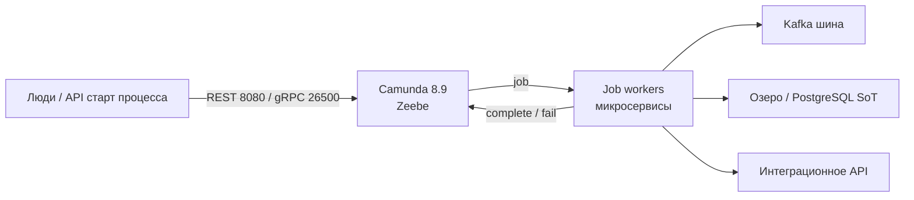
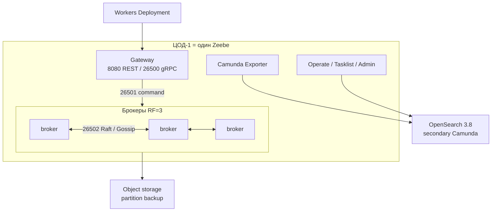
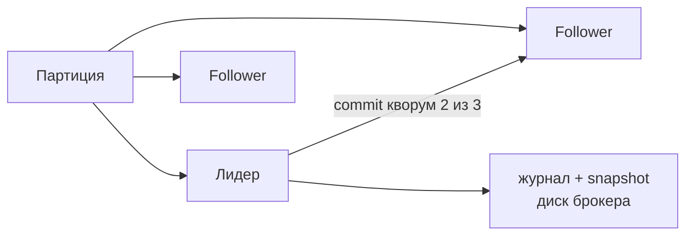
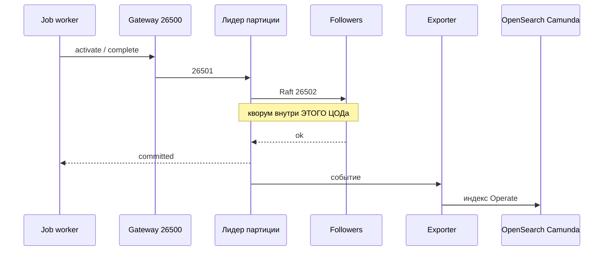
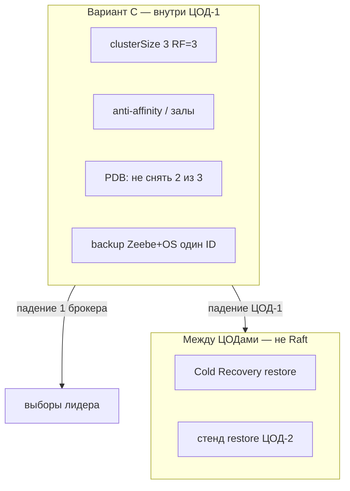
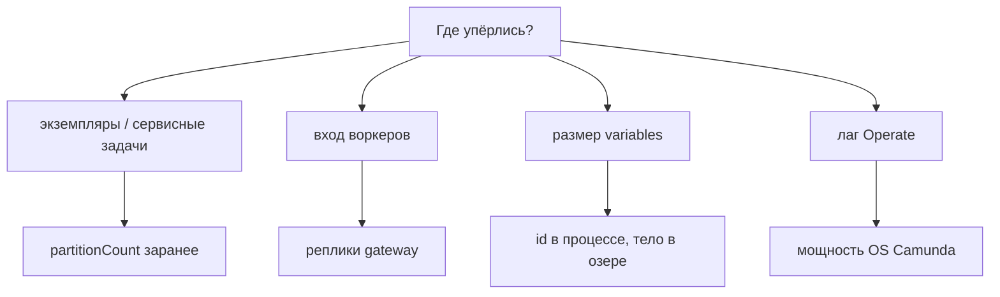
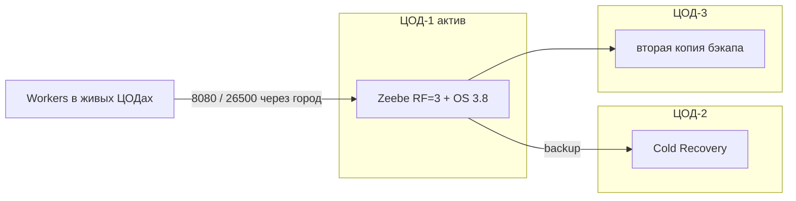

# Camunda 8.9 — схемы устройства

Связанные документы: правила — `Camunda 8.md`; установка — `Camunda 8.install.md`.

C4 / «D4»: контекст → контейнеры → компоненты. BPMN-схемы заявок не рисуем.

Допущения: Helm **`camunda-platform` 14.8.5** → образ **`camunda/camunda:8.9.17`**. Stretch брокеров на 2–3 ЦОДа **нет**. Официальный **dual-region** (RF=4, две площадки) — тоже stretch, **не выбран**. Целевой прод: **вариант C** — RF=3 **внутри одного ЦОДа** + Cold Recovery. Secondary — **OpenSearch 3.8**, не бизнес-поиск. Нагрузки нет.

---

## 1. Контекст

Camunda — **оркестратор длинных сценариев**, не шина и не SoT карточки.

Воркеры **снаружи** JVM движка. Коннектор «напрямую в ведомство» плодит второй контур интеграций. Переменные процесса — id/статус, не XML досье (ориентир вендора ~**3 МБ** на экземпляр).

---

## 2. Контейнеры Orchestration Cluster

С 8.8 gateway в Helm часто **embedded** в брокер; вход всё равно масштабируют репликами. Клиенты **не** ходят на 26501/26502. **9600** — actuator/metrics/backup API, не в интернет.

Bitnami Elasticsearch/PostgreSQL subchart в проде **выключены**. С 8.9 без `orchestration.data.secondaryStorage.type` чарт не ставится.

---

## 3. Компоненты данных

Параллелизм ≈ **partitionCount**, не «ещё Operate». RF не больше числа брокеров. Тройка `clusterSize` / `partitionCount` / `replicationFactor` **одинаковая** на всех брокерах. HDD не поддерживается; PVC RWO, SSD, ≥1000 IOPS.

Optimize в первом проде **выкл** (×3–4 диск OS). Web Modeler / Identity — PostgreSQL рядом, не на пути исполнения.

---

## 4. Поток: complete job

Падение OS: сначала Operate отстаёт, потом **backpressure** душит команды по кластеру. HA Zeebe без HA secondary — дырявая.

---

## 5. Отказоустойчивость — что настраивать

| Ручка | Если забыть |
|---|---|
| RF=3 в **одном** ЦОДе | Stretch 26502 = латентность каждого commit; порога RTT на 3 площадки нет |
| Dual-region | Stretch RF=4; OpenSearch **нельзя**; failover **ручной**; не выбран |
| Отдельный OS 3.8 | Экспорт в бизнес-поиск / Wazuh убивает оба контура |
| Прогнанный restore | Реплики не спасают от DROP PVC |
| Воркеры ≥2 на job type | Zeebe green, API лежит → процессы стоят на jobs |

Два мёртвых брокера из трёх снимают кворум. Dual-region при потере региона **сразу останавливает** обработку — это не «тихо пережили».

---

## 6. Масштабируемость — что настраивать

Лишние воркеры одного типа делят работы. Встроенной метрики backlog вендор **нет**. Gateway не ускорит партиции, которых нет. Терабайты — не в Zeebe.

---

## 7. 2–3 ЦОДа без stretch

Третий ЦОД **не** член Raft. Клиенты в штате пишут в gateway ЦОД-1.

**Сильное:** commit не ждёт чужой ЦОД; OpenSearch 3.8 остаётся secondary. **Слабое:** смерть площадки движка = нет оркестрации, пока restore; RPO/RTO = как часто бэкап и как быстро его прогнали.

---

## 8. Безопасность

1. Лицензия `CAMUNDA_LICENSE_KEY` с 8.6; без ключа прод Self-Managed нелегален.
2. OIDC, не `demo:demo` / basic. Admin кластера ≠ Management Identity.
3. Ingress 8080/26500 TLS; 26501/26502 только брокеры+gateway (NetworkPolicy).
4. Helm `values-tls` **не** закрывает весь pod-to-pod gRPC — mesh отдельно.
5. L4 или gRPC-aware LB на 26500: HTTP L7 рвёт стримы воркеров.

Источники: `Camunda 8.md`. Dual-region и stretch 3 AZ на схемах не целевые.
