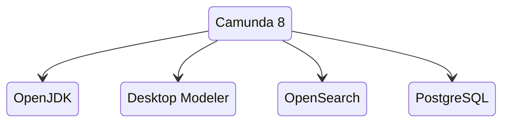
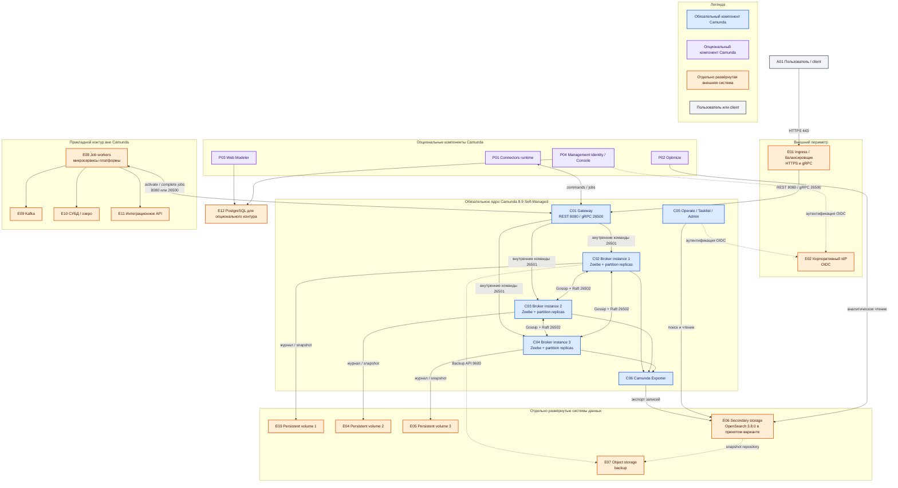

# Camunda 8.9 — назначение, состав и взаимодействие компонентов

Camunda 8 — платформа оркестрации долгих бизнес-процессов. Она исполняет модели процессов, хранит состояние каждого запущенного экземпляра и выдаёт работу внешним программам. Это **не** шина событий (роль Kafka), **не** хранилище клиентских досье и **не** интеграционный шлюз к ведомственным системам.

Документ описывает прежде всего **Camunda 8 Self-Managed 8.9**: Helm-чарт `camunda-platform` **14.8.5**, образ Orchestration Cluster `camunda/camunda:8.9.17`. Совместимые версии соседних компонентов из матрицы чарта: Connectors `8.9.8`, Optimize `8.9.17`, Management Identity `8.9.8`, Web Modeler `8.9.7`, Console `8.9.88`.

Линейка **8.10** на дату документа имеет статус Alpha и в целевой вариант не входит. Переход на 8.9 поддерживается с 8.8.x. Номера компонентов нельзя выравнивать вручную «до одинакового патча»: совместимый набор определяет матрица конкретной версии Helm-чарта.

## Назначение системы

Camunda 8 нужна для сценария, который не помещается в один вызов API: например, «получить заявку → запросить сведения → ждать ответ несколько дней → выполнить проверку → передать человеку на согласование».

Движок хранит состояние процесса: текущий шаг, идентификаторы, сроки, короткие результаты и ошибки. Полные карточки клиентов, документы, SOAP/XML-ответы и крупные бизнес-объекты должны оставаться в профильных системах. В контексте этой платформы:

- Kafka переносит события об изменениях;
- СУБД или озеро хранят эталонные данные;
- интеграционное API взаимодействует с ведомствами;
- Camunda определяет порядок действий и ожиданий;
- внешний job worker выполняет конкретную работу и возвращает идентификатор, статус либо ошибку.

Движок удалённый: он не встраивается в JVM прикладного сервиса. Если worker временно недоступен, работа остаётся в движке и может быть взята позднее. Если партиция потеряла кворум брокеров, новые записи в неё не подтверждаются до восстановления кворума.

## Перечень функций

Camunda 8 Self-Managed предоставляет следующие функции:

1. **Исполнение BPMN-процессов и DMN-решений.** Опубликованная модель становится определением процесса; каждый запуск создаёт отдельный экземпляр.
2. **Хранение состояния активных процессов.** Брокеры ведут журнал партиции и создают снимки состояния. Это операционная память процесса, а не мастер-хранилище бизнес-данных.
3. **Репликация партиций.** Zeebe копирует журнал между брокерами по Raft; запись подтверждается после согласия кворума копий.
4. **Приём клиентских команд через gateway.** Клиенты используют REST на **8080/TCP** или gRPC на **26500/TCP**, а не внутренние порты брокеров.
5. **Выдача сервисных задач внешним workers.** Worker активирует работу определённого типа, вызывает прикладные системы и сообщает движку об успешном завершении либо ошибке.
6. **Операторское наблюдение и пользовательские задачи.** Operate показывает состояние процессов, Tasklist — задачи людей, Admin — права и ресурсы Orchestration Cluster.
7. **Экспорт событий во вторичное хранилище.** Camunda Exporter переносит записи движка в OpenSearch, Elasticsearch либо поддерживаемую реляционную СУБД, чтобы приложения чтения могли выполнять поиск.
8. **Управление доступом.** Встроенный Admin управляет авторизацией Orchestration Cluster. Management Identity обслуживает отдельный контур Web Modeler, Console и Optimize; это не один и тот же компонент.
9. **Исполнение готовых connectors.** Отдельный Connectors runtime выполняет поддержанные интеграционные шаблоны. В этой платформе он не заменяет собственное интеграционное API.
10. **Аналитика процессов.** Опциональный Optimize строит отчёты на данных вторичного хранилища и создаёт дополнительную нагрузку на него.
11. **Моделирование.** Desktop Modeler работает на компьютере пользователя; опциональный Web Modeler обеспечивает совместное браузерное моделирование и использует PostgreSQL.
12. **Согласованный backup.** API компонентов позволяет связать резервную копию данных движка и снимок индексов одним идентификатором. Обычный снимок диска брокера не равен согласованной резервной копии кластера.

Camunda 8 не является Kafka, озером данных, встроенным BPMN-движком Camunda 7 или автоматическим трёхрегиональным решением. В переменных процесса следует хранить небольшие данные; поставщик указывает практический предел порядка **3 МБ на экземпляр**, но это верхняя граница, а не рекомендуемый размер.

## Варианты поставки и границы версий

### Self-Managed 8.9

Организация управляет Kubernetes, сетью, хранилищами, обновлениями и компонентами Camunda. В целевом варианте этого документа Orchestration Cluster работает на версии 8.9.17, а версии опциональных продуктов берутся из матрицы чарта 14.8.5.

В 8.9 Orchestration Cluster объединяет Zeebe, Operate, Tasklist и Admin. Gateway может быть встроен в процесс брокера, однако на логической схеме показан отдельно, потому что у него самостоятельная сетевая роль.

Вторичное хранилище 8.9 выбирается из поддерживаемых вариантов: OpenSearch **2.19+ или 3.6+**, Elasticsearch **8.19+ или 9.4+**, либо поддержанная реляционная СУБД. Для принятого платформенного варианта используется отдельно развёрнутый **OpenSearch 3.8.0**.

### Camunda 8 SaaS

В SaaS управляющий контур, эксплуатация Orchestration Cluster и поддерживаемое вторичное хранилище находятся в зоне ответственности Camunda. Клиент видит логические сущности кластера, API, моделирования и задач, но не управляет брокерными pod, их дисками, внутренними портами **26501/26502** или Camunda Exporter.

В SaaS подключение clients/workers выполняется к выданным облачным endpoints с облачной аутентификацией. Поэтому приведённая ниже физическая топология брокеров, дисков, OpenSearch и внутренних портов — описание **Self-Managed**, а не инструкция по устройству Camunda SaaS.

### Компоненты, которые нельзя считать обязательным ядром

- **Connectors runtime** — опциональный исполнитель готовых connectors.
- **Optimize** — опциональная аналитика; не включается автоматически только потому, что нужен Operate.
- **Web Modeler**, **Management Identity**, **Console** и их **PostgreSQL** — отдельный контур совместного моделирования и управления.
- **Desktop Modeler** — самостоятельное клиентское приложение и не серверный instance.
- **Kafka, озеро, интеграционное API, IdP, OpenSearch, PostgreSQL, Ingress и object storage** — внешние системы, не части продукта Camunda, даже если Camunda зависит от них.

## Основные элементы системы и зависимости

### Схема instances и потоков

Каждый прямоугольник имеет постоянное имя вида **C01**, **P01** или **E01**. Оно связывает схему с описаниями после неё. Синие блоки — обязательное ядро Camunda, фиолетовые — опциональные компоненты Camunda, оранжевые — отдельно развёрнутые внешние системы, серый блок — пользователь или внешний client.

### Как читать схему

1. **Сначала смотрите на цвет.** Синий контур `CORE` — путь исполнения процесса. Фиолетовый `OPTIONAL` добавляет возможности, но его блоки не следует мысленно включать в обязательную установку. Оранжевые блоки эксплуатируются отдельно от Camunda.
2. **Сплошная стрелка показывает рабочий поток**, пунктирная — вспомогательную связь аутентификации или backup. Подпись на стрелке задаёт протокол, порт либо смысл передачи.
3. **Внешний client A01 не обращается к brokers.** Он приходит через E01 к C01. Публичный порт балансировщика обычно 443; внутри C01 предоставляет REST 8080 и gRPC 26500.
4. **Gateway C01 маршрутизирует команду к лидеру partition.** Внутренний обмен gateway с brokers использует 26501. Этот порт не является клиентским endpoint.
5. **Brokers C02–C04 образуют кластер.** У каждой partition есть свой leader и replicas. Двунаправленные стрелки 26502 показывают Gossip и Raft; они не означают, что все данные каждый раз идут через все brokers.
6. **Каждый broker пишет на собственный persistent volume.** E03–E05 не изображают одно общее сетевое файловое хранилище. Журнал и snapshot на этих volumes содержат рабочее состояние движка.
7. **Путь чтения отделён от пути записи процесса.** Brokers передают записи через C06 во secondary storage E06. C05 читает E06, поэтому задержка Operate не обязательно означает остановку исполнения.
8. **Workers E08 находятся вне Camunda.** Они долго опрашивают gateway, получают jobs и вызывают Kafka, озеро или интеграционное API. Ответ в Camunda должен содержать только нужный процессу результат.
9. **Фиолетовые ветви независимы.** P01, P02 и связка P03–P04 — разные опции. Выбор Connectors не требует Optimize или Web Modeler. Падение Web Modeler не останавливает уже опубликованные процессы.
10. **Backup состоит из согласованных частей.** Данные Zeebe и secondary storage сохраняются их штатными механизмами с общим backup id; стрелки к E07 не означают копирование обычного filesystem snapshot.
11. **Для SaaS схему читают логически.** A01 и E08 используют облачный endpoint, но блоки C02–C06, E03–E07 и их внутренние связи управляются Camunda и не доступны клиенту как его инфраструктура.

### Описание каждого блока

#### A01 — Пользователь / client

- **Технологии и варианты:** браузер, REST-client, Zeebe client, Camunda Java client, CI/CD.
- **Назначение:** запускает экземпляры, публикует модели, получает данные API или работает с пользовательскими экранами.
- **Принадлежность:** внешний потребитель, не часть Camunda.

#### C01 — Gateway

- **Технологии и варианты:** REST 8080/TCP, gRPC 26500/TCP; в 8.9 gateway обычно встроен в Orchestration Cluster, но логически остаётся входом.
- **Назначение:** аутентифицирует и маршрутизирует клиентские команды к нужной partition.
- **Принадлежность:** обязательная часть Orchestration Cluster.

#### C02, C03, C04 — Broker instances

- **Технологии и варианты:** Zeebe, partitioned log, Raft replicas; число brokers, partitions и replication factor зависит от выбранной топологии.
- **Назначение:** исполняют BPMN/DMN, хранят состояние и таймеры, создают jobs, согласуют записи.
- **Принадлежность:** обязательная часть Orchestration Cluster. Три блока показывают типовой кластер, а не универсальное требование для SaaS или учебного режима.

#### C05 — Operate / Tasklist / Admin

- **Технологии и варианты:** web applications и API, объединённые с Orchestration Cluster в линии 8.9.
- **Назначение:** Operate — эксплуатационный обзор процессов; Tasklist — human tasks; Admin — пользователи, роли, authorizations и ресурсы кластера.
- **Принадлежность:** часть Orchestration Cluster 8.9. Не путать Admin с Management Identity.

#### C06 — Camunda Exporter

- **Технологии и варианты:** встроенный exporter в OpenSearch, Elasticsearch или поддержанную реляционную СУБД.
- **Назначение:** проецирует записи журнала в модель данных для поиска и пользовательских приложений.
- **Принадлежность:** часть Orchestration Cluster; целевое хранилище E06 — отдельная система.

#### E01 — Ingress / балансировщик

- **Технологии и варианты:** Kubernetes Ingress/Gateway API, L4 load balancer либо gRPC-aware proxy.
- **Назначение:** завершает внешний TLS и направляет REST/gRPC traffic на gateway replicas.
- **Принадлежность:** инфраструктура платформы, не часть Camunda.

#### E02 — Корпоративный IdP

- **Технологии и варианты:** OIDC-совместимый identity provider.
- **Назначение:** единый вход и выдача identity tokens для компонентов Camunda.
- **Принадлежность:** отдельно развёрнутая корпоративная система.

#### E03, E04, E05 — Persistent volumes

- **Технологии и варианты:** поддерживаемые SSD block volumes, по одному writable volume на broker.
- **Назначение:** сохраняют journal и snapshots partitions при перезапуске broker instance.
- **Принадлежность:** внешнее инфраструктурное хранилище, не компонент Camunda.

#### E06 — Secondary storage

- **Технологии и варианты:** для 8.9 — OpenSearch 2.19+/3.6+, Elasticsearch 8.19+/9.4+ либо поддержанная RDBMS; принят вариант OpenSearch 3.8.0.
- **Назначение:** индексированное представление процессов для Operate, Tasklist, Admin и, при выборе, Optimize.
- **Принадлежность:** отдельно развёрнутая система. Это не primary state Zeebe и не общий бизнес-поиск платформы.

#### E07 — Object storage

- **Технологии и варианты:** объектное хранилище, поддержанное выбранным backup backend; snapshot repository OpenSearch/Elasticsearch.
- **Назначение:** хранит согласованные резервные копии движка и secondary storage.
- **Принадлежность:** внешняя система.

#### E08 — Job workers

- **Технологии и варианты:** Java/Spring, JavaScript/TypeScript, Go, C# и другие поддерживаемые clients; REST или gRPC.
- **Назначение:** активируют jobs, выполняют прикладную работу и завершают её результатом либо ошибкой.
- **Принадлежность:** микросервисы платформы, не часть Camunda.

#### E09 — Kafka

- **Технологии и варианты:** корпоративный Apache Kafka-совместимый event bus.
- **Назначение:** переносит business events, которые workers читают или публикуют.
- **Принадлежность:** отдельная система; не транспорт Raft и не внутренний broker Camunda.

#### E10 — СУБД / озеро

- **Технологии и варианты:** профильная реляционная СУБД, lakehouse или data lake.
- **Назначение:** хранит полные и эталонные business records; процесс держит ссылки и статусы.
- **Принадлежность:** отдельная система данных.

#### E11 — Интеграционное API

- **Технологии и варианты:** корпоративные REST/SOAP adapters, gateway интеграционного контура.
- **Назначение:** централизует взаимодействие с ведомствами и скрывает их протоколы от процессов.
- **Принадлежность:** отдельная прикладная система.

#### P01 — Connectors runtime

- **Технологии и варианты:** runtime готовых Camunda connectors, включая HTTP и Kafka connectors.
- **Назначение:** выполняет connector tasks из BPMN-моделей.
- **Принадлежность:** опциональный компонент Camunda. Не заменяет E11 без отдельного архитектурного решения.

#### P02 — Optimize

- **Технологии и варианты:** Camunda Optimize совместимой версии из матрицы чарта.
- **Назначение:** аналитика, dashboards и отчёты по процессам.
- **Принадлежность:** опциональный компонент Camunda с отдельным importer; не нужен для работы Operate.

#### P03 — Web Modeler

- **Технологии и варианты:** серверное web-приложение; альтернатива для индивидуальной работы — Desktop Modeler.
- **Назначение:** совместное моделирование BPMN/DMN и управление моделями.
- **Принадлежность:** опциональный компонент Camunda; не находится на критическом пути уже опубликованных процессов.

#### P04 — Management Identity / Console

- **Технологии и варианты:** Management Identity, Console и OIDC integration в совместимых версиях.
- **Назначение:** identity management для Web Modeler, Console и Optimize, а также обзор установок через Console.
- **Принадлежность:** опциональный управляющий контур Camunda; отличается от Admin в C05.

#### E12 — PostgreSQL

- **Технологии и варианты:** внешний поддерживаемый PostgreSQL cluster.
- **Назначение:** хранит данные Web Modeler и Management Identity; конкретные базы и schemas разделяются по требованиям компонентов.
- **Принадлежность:** отдельно развёрнутая система; не primary или secondary storage Orchestration Cluster.

#### Блоки легенды LC, LP, LE, LA

- **Технологии и варианты:** служебные элементы Mermaid без runtime.
- **Назначение:** объясняют цветовую кодировку.
- **Принадлежность:** не являются instances или системами.

### Состав продукта

| Группа | Компоненты | Статус |
|---|---|---|
| Orchestration Cluster 8.9 | Zeebe brokers, gateway, Operate, Tasklist, Admin, Camunda Exporter | Ядро Self-Managed |
| Execution extensions | Connectors runtime | Опция |
| Analytics | Optimize | Опция |
| Modeling and management | Web Modeler, Management Identity, Console | Опция; отдельный контур |
| Client tools | Desktop Modeler, client libraries | Поставляются экосистемой Camunda, но не являются server instances кластера |
| Platform dependencies | OpenSearch/Elasticsearch/RDBMS, PostgreSQL, IdP, Ingress, volumes, object storage | Внешние отдельно управляемые системы |
| Business dependencies | workers, Kafka, озеро/СУБД, интеграционное API | Внешние прикладные системы |

### Порты

| Порт | Протокол и назначение | Кто использует |
|---|---|---|
| **443/TCP** | Внешний HTTPS/gRPC endpoint | Пользователи и clients → Ingress; инфраструктурный порт, не фиксированный внутренний порт Camunda |
| **8080/TCP** | REST API gateway и HTTP endpoints Orchestration Cluster | Clients, workers, Ingress |
| **26500/TCP** | gRPC API gateway, включая долгоживущие потоки workers | Clients, workers, gRPC-aware Ingress/L4 load balancer |
| **26501/TCP** | Внутренние команды gateway → broker | Только instances Orchestration Cluster |
| **26502/TCP** | Gossip и Raft между brokers/gateway | Только instances Orchestration Cluster |
| **9600/TCP** | Management endpoints: metrics, health и Backup API в зависимости от endpoint | Monitoring и backup operators внутри служебной сети |

Клиенты направляются на gateway, а не на 26501/26502. Конкретные порты OpenSearch, PostgreSQL, IdP и приложений не являются портами Camunda и определяются их собственными контрактами. В SaaS внутренние 26501/26502/9600 клиенту не предоставляются.

## Глоссарий

- **Admin** — приложение управления пользователями, ролями, authorizations и ресурсами Orchestration Cluster.
- **Alpha** — предварительная версия, не предназначенная для принятого production-контура этого документа.
- **API** — программный интерфейс, через который системы обмениваются командами и данными.
- **Authorization** — правило, определяющее, кто может выполнить действие над ресурсом.
- **Backpressure** — автоматическое замедление приёма команд, когда нижележащая часть системы не успевает их обрабатывать.
- **Backup** — согласованная резервная копия состояния, создаваемая штатными API компонентов.
- **BPMN** — стандарт графического описания исполняемых бизнес-процессов.
- **Broker** — server instance Zeebe, который исполняет partitions и хранит их журнал.
- **Camunda Exporter** — компонент, переносящий записи движка во secondary storage.
- **Camunda 8 SaaS** — облачный сервис Camunda, где инфраструктурой кластера управляет поставщик.
- **Client** — программа или пользовательский инструмент, отправляющий команды в Camunda API.
- **Commit** — запись журнала, подтверждённая требуемым кворумом replicas.
- **Connector** — готовый интеграционный шаблон задачи.
- **Connectors runtime** — отдельный runtime, исполняющий connector tasks.
- **Container** — изолированная упаковка программы и её зависимостей.
- **Console** — приложение обзора и управления установками/кластерами в управляющем контуре Camunda.
- **Data lake / озеро** — хранилище полных исходных и аналитических данных; не память процесса.
- **Dashboard** — экран с агрегированными показателями.
- **Desktop Modeler** — настольное приложение для редактирования BPMN/DMN.
- **DMN** — стандарт описания таблиц и логики решений.
- **Elasticsearch** — поддерживаемый вариант поискового secondary storage.
- **Endpoint** — сетевой адрес API.
- **Exporter** — модуль, копирующий поток записей движка во внешнее представление данных.
- **Failover** — переключение работы после отказа; не обязательно автоматическое.
- **Gateway** — клиентская точка входа, маршрутизирующая команды к brokers.
- **Gossip** — внутренний протокол распространения сведений о составе и состоянии кластера.
- **gRPC** — двоичный RPC-протокол, используемый clients и workers Camunda.
- **Health endpoint** — служебный API, сообщающий о готовности и работоспособности instance.
- **Helm chart** — версионированный пакет Kubernetes-манифестов и настроек.
- **HTTP/HTTPS** — прикладной web-протокол; HTTPS означает HTTP поверх TLS.
- **Human task** — шаг процесса, который должен выполнить человек.
- **IdP** — identity provider, система аутентификации пользователей и приложений.
- **Ingress** — инфраструктурная точка входа traffic в Kubernetes.
- **Instance** — отдельно работающий процесс/контейнер компонента; также «process instance» означает один запуск модели.
- **Job** — единица работы, созданная сервисной задачей процесса.
- **Job type** — имя, по которому worker выбирает jobs нужного вида.
- **Job worker / worker** — внешняя программа, активирующая и выполняющая jobs.
- **Journal / log** — последовательный журнал команд и событий partition.
- **JVM** — среда выполнения Java; движок Camunda 8 не встраивается в JVM прикладного микросервиса.
- **Kafka** — event streaming platform; в этой архитектуре шина событий, а не движок процессов.
- **Kubernetes** — платформа управления containers, на которой может работать Self-Managed.
- **L4 load balancer** — балансировщик транспортного уровня, распределяющий TCP-соединения без разбора HTTP.
- **Leader** — replica partition, принимающая и упорядочивающая записи.
- **Load balancer** — инфраструктурный компонент, распределяющий соединения между несколькими instances.
- **Management Identity** — отдельный identity-компонент для Web Modeler, Console и Optimize.
- **Mermaid** — текстовый язык диаграмм, которым записана схема в этом документе.
- **Minor version** — ветка версии вида 8.9; обновление между minor имеет отдельные правила совместимости.
- **Monitoring / metrics** — сбор числовых технических показателей для наблюдения за системой.
- **OIDC** — протокол федеративной аутентификации поверх OAuth 2.0.
- **Object storage** — хранилище объектов, используемое здесь как backend резервных копий.
- **OpenSearch** — поддерживаемый вариант поискового secondary storage; в принятом варианте используется версия 3.8.0.
- **Operate** — приложение наблюдения и устранения проблем process instances.
- **Optimize** — опциональный продукт аналитики процессов.
- **Orchestration Cluster** — объединённое ядро Camunda 8.9: Zeebe, gateway, Operate, Tasklist, Admin и exporter.
- **Partition** — часть журнала и состояния Zeebe с собственным leader и replicas.
- **Payload** — данные, передаваемые в команде, событии или переменной процесса.
- **Persistent volume** — постоянный disk volume, переживающий перезапуск container/pod.
- **Pod** — минимальная запускаемая единица Kubernetes из одного или нескольких containers.
- **PostgreSQL** — реляционная СУБД опционального моделирующего/identity-контура.
- **Primary state** — авторитетное рабочее состояние Zeebe в журнале и snapshots brokers.
- **Process definition** — опубликованная исполняемая версия BPMN-модели.
- **Process instance** — один конкретный запуск process definition.
- **Production / бой** — рабочая среда, обслуживающая реальные бизнес-процессы.
- **Quorum / кворум** — минимальное большинство replicas, необходимое для подтверждения записи.
- **Raft** — протокол выбора leader и согласования replicated log большинством replicas.
- **RDBMS / реляционная СУБД** — база данных с таблицами и транзакциями.
- **Replica** — копия partition на broker.
- **Replication factor** — количество replicas каждой partition.
- **REST** — HTTP-стиль программного API.
- **Runtime** — исполняемая серверная программа компонента.
- **Schema** — логическая область/набор объектов внутри реляционной базы; не BPMN-схема.
- **Secondary storage** — поисковое или реляционное представление экспортированных данных для чтения приложениями.
- **Self-Managed** — вариант Camunda, инфраструктурой и эксплуатацией которого управляет организация.
- **Service task** — автоматический шаг BPMN, обычно создающий job для worker.
- **Snapshot** — компактный снимок состояния partition либо снимок индексов; его смысл зависит от компонента.
- **SOAP** — протокол XML web services, который в этой платформе скрывает интеграционный контур.
- **Tasklist** — приложение для выполнения human tasks.
- **TLS** — шифрование сетевого соединения.
- **Token** — подписанное удостоверение клиента или пользователя, выдаваемое IdP.
- **Traffic** — поток сетевых запросов и ответов.
- **Web Modeler** — опциональное web-приложение совместного моделирования.
- **XML** — текстовый формат структурированных данных, часто используемый SOAP.
- **Zeebe** — распределённый движок исполнения процессов в Camunda 8.

## Источники

- Матрица Camunda 8.9 и Helm-чарта 14.8.5: https://helm.camunda.io/camunda-platform/version-matrix/camunda-8.9/
- Поддерживаемые среды и версии secondary storage: https://docs.camunda.io/docs/reference/supported-environments/
- Архитектура Orchestration Cluster 8.9: https://docs.camunda.io/docs/self-managed/components/orchestration-cluster/
- Кластеризация Zeebe, partitions, replicas и Raft: https://docs.camunda.io/docs/components/zeebe/technical-concepts/clustering/
- Сетевые порты Zeebe: https://docs.camunda.io/docs/self-managed/components/orchestration-cluster/zeebe/operations/network-ports/
- Secondary storage: https://docs.camunda.io/docs/self-managed/concepts/orchestration-cluster/secondary-storage/
- Backup и restore: https://docs.camunda.io/docs/self-managed/operational-guides/backup-restore/backup-and-restore/
- SaaS и Self-Managed: https://docs.camunda.io/docs/reference/camunda-8-vs-camunda-7/
- Sizing и ограничение process instance payload: https://docs.camunda.io/docs/components/best-practices/architecture/sizing-your-environment/
