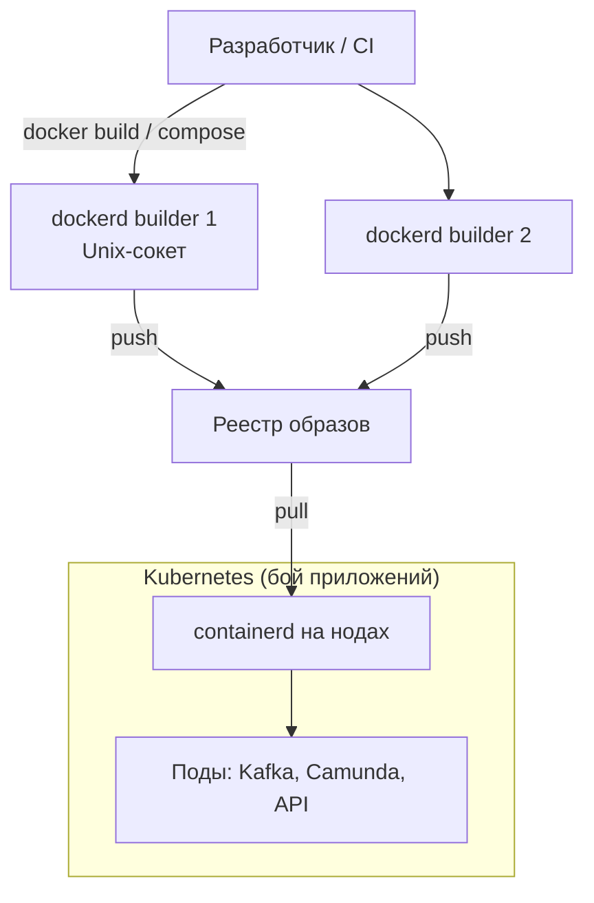

# Docker Engine 24.0.9 — развёртывание и настройка

Docker Engine — демон на одной Linux-машине: тянет образы, запускает контейнеры, собирает Dockerfile. Это **не** кластер и не Kubernetes. Один `dockerd` = один хост. Этот документ про **свою установку** версии **24.0.9** (последний патч линии 24.0; релиз **31 января 2024**).

Релиз-ноты линии: https://docs.docker.com/engine/release-notes/24.0/  
Документация Engine: https://docs.docker.com/engine/

**Статус линии 24.0 (проверено 26 августа 2026):** ветка `24.0` в репозитории Moby помечена как **Unmaintained**. На [endoflife.date/docker-engine](https://endoflife.date/docker-engine) окончание security-поддержки указано как **8 июня 2024**. После 24.0.9 патчей этой линии нет. На ту же дату поддерживаемая линия Engine у Docker Inc. — **29.x** (последний патч на момент проверки — 29.7.2).

В архитектуре платформы уже выбран **Kubernetes**. Engine 24.0.9 здесь — инструмент **сборки и стенда**, не runtime боевых подов. Его **нельзя** честно назвать боевым runtime кластера 1.36.

Этот текст — не набор команд «скопируй apt install docker-ce», а правила, без которых экземпляр не будет одновременно устойчивым к сбоям, масштабируемым и безопасным. Пошаговая установка — в `Docker 24.install.md`.

---

## Назначение системы

Docker Engine нужен, чтобы **собирать OCI-образы** и **запускать контейнеры на одной машине** (стенд разработчика, CI, сборочные VM). Команда привыкла думать «контейнер = docker» — это нормально для сборки и отладки.

Система **не** оркестрирует прод на трёх площадках, **не** заменяет Kubernetes, **не** хранит эталон клиентов и **не** является шиной событий. Kafka, Camunda, интеграционное API в бою живут **в подах Kubernetes** (runtime — containerd), не «в docker run на трёх ВМ». Образы те же OCI: собрали Docker'ом — запустили containerd.

---

## Перечень функций

Что умеет Docker Engine 24.0.9 CE:

1. **Собирать образы** (`docker build`, BuildKit). С Engine 23.0 BuildKit — сборщик по умолчанию. В **24.0.9 вендор явно пишет**: известные CVE BuildKit **не закрыты**; фикс — Engine **25.0.2+**.
2. **Запускать контейнеры** из образа: namespaces + cgroups. Падение демона по умолчанию **убивает** контейнеры, если не включён live restore.
3. **Хранить слои** драйвером **overlay2** (дефолт 24.x на Linux). Писать «в контейнер» как в диск — плохая идея; данные — в **volume**. Volume переживает удаление контейнера, **не** падение хоста и **не** копируется на соседнюю машину.
4. **Поднимать несколько контейнеров на одном хосте** файлом Compose (`compose.yaml`). Это не оркестратор на три дата-центра. В пакетах 24.0.x плагин Compose обновляли отдельно (например 24.0.7 → Compose **v2.21.0**).
5. **Слушать API** через Unix-сокет `/var/run/docker.sock` (обычно). Кто пишет в сокет — тот **управляет демоном**. Официально это равносильно root на хосте. Опционально TCP **2375** (без TLS — удалённый root) и **2376** (TLS).
6. **Не убивать контейнеры при рестарте демона** (`live restore`) — только для standalone-контейнеров. Со **Swarm mode несовместим**.
7. **Включить Swarm mode** (`docker swarm init`): сервисы, overlay-сеть, Raft у manager-нод. Это **конкурент Kubernetes**, не плагин к нему. В этой архитектуре — не целевой путь.
8. **Ограничивать контейнер:** seccomp (по умолчанию), AppArmor/SELinux если дистрибутив включил, лимиты memory/cpus, `no-new-privileges`. `--privileged` почти все ограничения снимает.
9. **Работать rootless** (демон от непривилегированного пользователя) — меньше ущерба при взломе, больше ограничений. Не «включил и забыл».
10. **Отдавать Engine API 1.43** (номер API, не «версия Docker»). В бандле 24.0.9: runc **1.1.12**, containerd часто **v1.7.13** — сверять `docker info`.

Чего система **не** делает и часто путают: она не реализует CRI для kubelet 1.24+ (нужен containerd / CRI-O, либо сторонний cri-dockerd). Не является реестром образов. Не реплицирует volumes между площадками. Не сканирует CVE. Не закрывает ГОСТ TLS. Линия 24.0 в 2026 **не** получает патчи вендора. Штатный путь боя приложений — Kubernetes, не Swarm и не `dockerd` на каждой worker-ноде.

---

## Требования к развёртыванию

### Требования к ПО

| Что | Что ставить | Комментарий |
|---|---|---|
| **Формат поставки** | Виртуальные машины (или железо) с пакетами Linux | Пакеты Docker Inc. того времени (`docker-ce` **24.0.9**), не `docker.io` дистрибутива «какой apt назвал docker», не Docker Desktop, не static tarball в бой (вендор: нет автообновлений зависимостей). |
| **Kubernetes** | Engine **не** ставится на worker'ы как runtime | CRI кластера — **containerd** (см. `Kubernetes.md`). cri-dockerd — антипаттерн: лишний hop, root-демон на каждой ноде, EOL Engine под kubelet 1.36. |
| **ОС** | **Linux 64-bit** на серверах | **Windows-контейнеры и Docker Desktop как «тот же бой» не рассматриваем.** На ноутбуке разработчика Desktop — другой продукт (VM + UI). |
| **Ядро** | overlay, cgroup, iptables/nft | Конкретный минимум в текущих гайдах — «свежее ядро дистрибутива». Старый текст про «ядро ≥ 3.10» **не** является сайзингом боя. |
| **Диск** | Локальный SSD/NVMe под `/var/lib/docker` | **Не NFS.** Сетевая папка как data-root — путь к порче слоёв. |
| **Реестр** | Harbor / свой registry | Без зеркала в закрытом контуре `docker pull` мёртв. Docker Hub с builder'а в контуре гособмена — канал утечки. |
| **Часы** | NTP | TLS, логи, при Swarm — Raft. |
| **Compose** | Плагин той же поставки CE | Не отдельный «docker-compose 1.x с GitHub» вслепую. |

containerd image store в 24.0 — **experimental**. В бой 24.0 **не** брать.

### Требования к ресурсам

Цифр «сколько сборочных VM на ваши терабайты» у проекта **нет** — нагрузки не было, и терабайты **не** кладут в Docker. Ниже только то, что было в исходном тексте.

| Сценарий | CPU | RAM | Диск |
|---|---|---|---|
| **Учебный Compose «чтобы вообще завелось»** (не сайзинг боя) | **2 CPU** | **4 ГиБ** | локальный диск под `/var/lib/docker` и volumes стенда |
| **Боевой builder** | цифры закупки **нет** | цифры закупки **нет** | отдельный том под `/var/lib/docker`; мониторинг заполнения и inode. Размер от профиля сборки (частота build, размер образов), которого в запросе нет |

Дополнительно:

- Данные озера/Kafka **не** в записываемый слой overlay2 и не в `/var/lib/docker` «потому что удобно». Слой — для кода.
- У драйвера логов `json-file` **по умолчанию нет** max-size; без ротации стенд/builder убивает диск.
- На одном хосте обязательны **лимиты** (`memory`, `cpus`): без них один контейнер съедает машину.
- Горизонталь сборки = больше **независимых** builder-хостов, не «один docker с 128 ядрами» как единственная стратегия.

---

## Основные элементы системы и зависимости

Это одно ПО на **одном хосте**. Несколько `dockerd` не склеиваются в кворум, пока не включить Swarm — а Swarm в этой архитектуре не целевой путь.

### Схема инстансов и потоков



Как читать схему:

1. Человек или CI говорит с **`dockerd`** через Unix-сокет (не через 2375 в сеть). Демон собирает образ и пушит в **реестр**.
2. Builder'ы **независимы**: нет общего Raft. Упал один — очередь CI берёт другой. Общее состояние сборки — реестр, не `/var/lib/docker` соседа.
3. Ноды Kubernetes **тянут тот же образ** через **containerd**. `dockerd` на worker'ах нет.
4. Swarm на этой схеме **нет**. Overlay UDP 4789 между площадками не открываем «на всякий случай».

Рядом, но это уже другое ПО: реестр образов, Kubernetes, сканер CVE (Trivy/Grype), Vault. Отказ реестра = деплой встал, даже если builder'ы живы.

### Что входит в состав

| Роль | Зачем | Как масштабируется |
|---|---|---|
| **`dockerd`** | Демон на хосте | Горизонталь = ещё машины со своим демоном. Вертикаль = CPU/диск **этой** машины |
| **`docker` CLI** | Клиент | Без своего склада |
| **containerd / runc** | Низкоуровневый запуск | В бандле 24.0.9: runc 1.1.12; containerd сверять `docker info` |
| **Compose-плагин** | Несколько контейнеров на одном хосте | Не оркестратор площадок |
| **Swarm (опционально)** | Встроенный оркестратор | Не целевой путь этой платформы |

### Порты (контракт сети)

| Порт | Назначение | Кому открывать |
|---|---|---|
| Unix-сокет `/var/run/docker.sock` | API демона | Локальный root / поимённая группа `docker`. Не в контейнеры приложений |
| **2375/TCP** | API без TLS | **Никогда не слушать** |
| **2376/TCP** | API + TLS | Только если удалённое управление доказано необходимым. Ключи = root |
| **2377/TCP** | Swarm Raft | Только если Swarm включён (здесь — нет). Не в интернет |
| **7946/TCP+UDP** | Swarm gossip | То же |
| **4789/UDP** | Swarm VXLAN | Вендор: не на периметр; VXLAN без аутентификации |

Пример «открыли 2375 в VLAN теста» — удалённый root, не удобство CI.

### Зависимости окружения

- Если образы не с Docker Hub — зеркало/реестр.
- Группа `docker` даёт доступ к сокету **без sudo**. Официальный post-install это включает и **предупреждает**: это привилегированный доступ. Не раздавать всему отделу.
- iptables, которые пишет Docker, конфликтуют с «чужим» firewall и с CNI Kubernetes. На ноде с kubelet Engine **не** ставить рядом.

---

## Краткие вводные

### Как устроена отказоустойчивость

**Один `dockerd` отказоустойчивости не даёт.** Упал хост или демон без live restore — контейнеры этого хоста мертвы. Live restore спасает от **рестарта демона**, не от смерти машины.

Отказоустойчивость «как у etcd» появляется **только** у Swarm (кворум manager'ов: 3 переживут 1). В вашей схеме оркестратор уже Kubernetes. Второй Raft на тех же площадках удваивает операционку и не лечит Kafka/Postgres.

Для **сборки** (целевая роль): несколько независимых builder'ов в разных площадках + живой реестр. Упал один демон — не падает Kafka и не падает интеграционное API.

| Что падает | Что происходит (роль builder) |
|---|---|
| Один builder из двух+ | Очередь CI берёт другой. Приложения в Kubernetes живы |
| Реестр | Сборка может пройти, **выкат** встанет |
| `/var/lib/docker` переполнился | Все контейнеры **этого** хоста. Это инцидент доступности |
| Сокет в CI-поде скомпрометирован | Root на builder-хосте |

### Как устроено масштабирование

Две оси, их путают со «горизонтальным Docker»:

1. **Больше контейнеров на одном хосте** → CPU/RAM **одной** машины; contention на `docker0`/iptables. Лимиты обязательны.
2. **Больше хостов с собственным `dockerd`** → суммарная сборка. Потолок — реестр, сеть, люди, которые патчат N демонов.

«Терабайты» не кладут в overlay2. Сборка упирается в CPU, диск слоёв, сеть до реестра.

`userland-proxy` по умолчанию **true**: отдельный процесс на опубликованный порт. На Linux часто ставят `false`, полагаясь на iptables — только поняв firewall **этого** хоста.

Для Swarm (если кто-то предложит вместо Kubernetes): вендор пишет, что **больше manager'ов = хуже write** состояния. Масштаб нагрузки — worker'ы, не «9 manager'ов».

### Безопасность самого Docker

Компрометация сокета / группы `docker` / 2375 = root на хосте: можно смонтировать `/` хоста в контейнер.

Опасные значения и привычки:

| Что | Как бывает «из коробки / из примера» | Почему опасно |
|---|---|---|
| TCP 2375 | можно включить руками | Удалённый root |
| Группа `docker` | post-install предлагает | Весь отдел = root на builder'ах |
| Монтаж сокета в CI | «чтобы внутри был docker» | Типичный путь побега (DinD/socket) |
| `--privileged` / `seccomp=unconfined` | «чтобы завелось» | Снята изоляция |
| `json-file` без max-size | дефолт | Диск кончился — хост лёг |
| BuildKit на 24.0.9 | сборщик по умолчанию | CVE **не закрыты** (цитата релиз-нотов 24.0.9) |
| `:latest` с Docker Hub | привычка | Supply chain и утечки |

Линия **unmaintained**: vendor-security в 2026 **нет**. Компенсации (нет 2375, свой реестр, сканер, запрет privileged) **не заменяют** патчи. ИБ может запретить 24 — и будет права.

ГОСТ TLS Engine не закрывает. Content Trust (подписи Notary) — не замена сканера CVE.

---

## Допущения

Ниже то, чего не было в исходном запросе, но без чего нельзя нарисовать конкретную схему. Если допущение неверно — схему надо пересмотреть.

1. Целевой бинарь — **Docker Engine 24.0.9 CE на Linux**, не Desktop, не Mirantis Container Runtime, не podman.
2. Прод-оркестратор — Kubernetes (`Kubernetes.md`), CRI — **containerd**. Engine 24 **не** ставится на worker'ы.
3. Роль 24.0.9, если линию всё же фиксируют: сборочные/утилитарные хосты и стенды. Не шина событий, не озеро, не Camunda.
4. Три дата-центра = три домена отказа. Если это три зала с общим питанием — раскладка Swarm 1-1-1 врёт так же, как etcd 1-1-1.
5. Нагрузки нет — нет числа сборочных VM и размера `/var/lib/docker`.
6. Формального SLA нет. «Беспрерывная работа» не закрывает дыру unmaintained-линии.
7. Образы приложений — OCI: формат не привязывает бой к `dockerd`.
8. Учебный стенд изолирован. На тесте допустим один демон и Compose; секреты боя туда не копируем.
9. ИБ может потребовать ГОСТ / запрет Docker Hub. Тогда зеркало и свой CA для 2376 — отдельные работы.
10. Если руководство **настоит** считать Swarm оркестратором вместо Kubernetes — это смена архитектуры, не «настройка Docker».

---

## Критически важные условия, которых нет в исходном контексте

Их нужно закрыть **до** закупки «Docker на три площадки».

| Пробел | Почему это ломает решение |
|---|---|
| **Зачем именно линия 24, а не поддерживаемый Engine** | 24.0.9 не получает CVE-фиксов с июня 2024. Уже в день релиза 24.0.9 вендор написал, что BuildKit CVE этой сборкой не закрыты. В августе 2026 это замороженная поверхность атаки на сборочный контур |
| **Docker — runtime Kubernetes или только CI?** | От этого зависит, появится ли cri-dockerd на каждой ноде. Для Kubernetes 1.36 штатный путь — containerd |
| **Кто владеет реестром и допускается ли Docker Hub** | Закрытый контур без зеркала = CI встанет. Публичный Hub = утечки и supply chain |
| **RTT между дата-центрами** | Нужен, если кто-то предлагает stretch-Swarm. Цифры порога в доке Docker **нет** |
| **Профиль сборки** (частота, размер образов, параллелизм) | Без этого нельзя сказать, сколько builder-хостов и какой диск |
| **Требования ИБ: 152-ФЗ, КИИ, rootless, запрет privileged** | Часто ответ ИБ на 24.0.9 — «нет, нет патчей» |
| **Кто патчит хосты 24/7** | Unmaintained Engine + живой kernel — развилка: либо исключение с датой вывода, либо уход с 24 |
| **Есть ли уже «docker.sock в Jenkins»** | Скрытый cluster-admin хоста. Пока сокет торчит в job'ы — модель безопасности фикция |

---

## Краткое описание ключевых этапов и элементов развертывания

Общий каркас (и тест, и «бой» builder'ов):

1. Зафиксировать **24.0.9** только если есть письменный стоп-фактор; иначе смена линии — **первый** шаг. Если фиксируете 24 — понимать, что требование «безопасность» вендорской поддержкой **не закрывается**.
2. Ставить **пакеты**, не static tarball в `/usr/bin`.
3. Вынести `daemon.json`: overlay2, ротация логов, live restore **только если нет Swarm**.
4. Закрыть API: только Unix-сокет; 2375 не слушать.
5. Не давать приложению `--privileged`, не монтировать сокет, лимиты памяти/CPU.
6. Диск и inode `/var/lib/docker` в мониторинг.
7. Образы — со своего реестра, не `latest` в бою.

Боевая схема builder'ов на несколько дата-центров — в `Docker 24.install.md`. Ниже — только учебный стенд.

---

### 1 инстанс: тестовый стенд, 1 площадка, без нагрузки

**Цель стенда:** собирать образы, поднимать Compose (Postgres/Redis рядом с сервисом), отлаживать Dockerfile. **Не** цель: доказать HA трёх площадок и эмулировать Kubernetes.

**Путь A — один `dockerd` 24.0.9 на Linux VM:** default bridge + user-defined сети Compose; overlay/Swarm **не** нужны; `live-restore: true`; Compose-плагин той же поставки. Минимум «чтобы завелось»: 2 CPU / 4 ГиБ.

Пример смысла `daemon.json` (не «весь мануал»):

```json
{
  "live-restore": true,
  "storage-driver": "overlay2",
  "log-driver": "json-file",
  "log-opts": { "max-size": "10m", "max-file": "3" },
  "icc": false,
  "no-new-privileges": true
}
```

- `icc: false` — контейнеры на default bridge не ходят друг к другу без явной сети. Compose создаёт user-defined сеть — там связность есть.
- Ротация логов обязательна: у `json-file` нет max-size по умолчанию.

Не слушать `-H tcp://0.0.0.0:2375` даже «только в VLAN теста».

**Путь B — Docker Desktop на ноутбуке:** другой продукт. Образы те же OCI, эксплуатация — нет.

#### Что сознательно упрощаем

| Параметр | На тесте | Почему можно |
|---|---|---|
| Один демон | да | Некому строить кворум |
| Без TLS API | да, **только Unix-сокет** | Нет удалённых клиентов |
| Swarm | нет | Иначе нельзя live-restore, и это не путь боя |
| DCT / подписи | можно отложить | Изолированный стенд |
| Rootless | можно отложить | Сложность vs польза на одном ноутбуке |
| Experimental containerd store | **нет** | В 24.0 это experiment |

#### Чего на тесте **не** стоит упрощать в Dockerfile/Compose

- `USER` не root (иначе в Kubernetes PSA `restricted` сломается).
- Явные лимиты памяти.
- Секреты не в Git и не в `environment:` в репозитории.
- Тег образа = digest или неизменяемый tag, не `:latest`.
- Не монтировать `/var/run/docker.sock` в сервисы.

#### Сильные стороны такой схемы

- Поднимается за часы. Совпадает с тем, как разработчики думают о контейнерах.
- Образы те же OCI, что потом уедут в Kubernetes.

#### Слабые стороны (обязательно понимать)

- Падение VM = простой всего стенда.
- Стенд **не** ловит: CRI, CNI, истечение сертификатов 2376, поведение cri-dockerd.
- Успешный Compose **не** является доказательством готовности боя.
- **24.0.9 на тесте приучает CI к линии без патчей.** Имеет смысл на тесте уже собирать тем же major, что уйдёт в builder-бой.

Практическая рекомендация: препрод-сборка — отдельный хост с тем же `daemon.json`, что у builder'ов, плюс push в **тот же** класс реестра.

---

## Сводка: что считать «экземпляр готов»

| Требование | Тест (1 площадка) | Бой |
|---|---|---|
| Отказоустойчивость | Не требуется от одного `dockerd` | Для **приложений** — Kubernetes, не Docker. Для **сборки** — ≥2 независимых builder'а в разных площадках + HA реестра. Схема — в `Docker 24.install.md` |
| Производительность / масштаб | Не требуется | Горизонталь builder'ов; лимиты; диск под слои; не класть терабайты в overlay2 |
| Безопасность | Изолированная сеть, Unix-сокет, без privileged | **Линия 24.0.9 сама по себе не обеспечивает** vendor-security. Плюс: нет 2375, свой реестр, сокет не в приложениях, профили ядра включены, BuildKit-CVE осознаны |

**Не готов к бою**, если: Engine 24.0.9 стоит на worker'ах Kubernetes «потому что привыкли к docker»; открыт 2375; группа `docker` у всего отдела; сокет в CI-подах; Swarm и Kubernetes на одних нодах; `latest` с Docker Hub в интеграционном контуре; NFS как `/var/lib/docker`; нет ротации логов; RTT неизвестен, а stretch-Swarm уже в презентации.

**Честный вывод:** требование «безопасность» для платформенного ПО в 2026 году с линией **24.0** не выполняется вендорской поддержкой. Этот файл — «как удержать 24.0.9 в узкой роли CI, пока не уйдёте». Runtime боя — containerd под Kubernetes.

---

## Источники (чтобы не принимать на веру)

- Релиз-ноты 24.0, в т.ч. 24.0.9 (runc 1.1.12, BuildKit CVE **не** закрыты, отсылка к 25.0.2): https://docs.docker.com/engine/release-notes/24.0/
- Статус веток Moby (`24.0` — Unmaintained): https://github.com/moby/moby/blob/master/project/BRANCHES-AND-TAGS.md
- Даты security-поддержки Engine: https://endoflife.date/docker-engine
- Конфиг демона, overlay2: https://docs.docker.com/engine/daemon/
- Live restore; standalone vs Swarm: https://docs.docker.com/engine/daemon/live-restore/
- Swarm admin (кворум, 1-1-1, бэкап): https://docs.docker.com/engine/swarm/admin_guide/
- Порты Swarm, VXLAN 4789: https://docs.docker.com/engine/swarm/swarm-tutorial/
- Attack surface демона, сокет = root: https://docs.docker.com/engine/security/
- Защита сокета: SSH и TLS :2376: https://docs.docker.com/engine/security/protect-access/
- Удаление dockershim в Kubernetes 1.24: https://kubernetes.io/blog/2022/02/17/dockershim-faq/
- Static binaries «не рекомендуем в прод»: https://docs.docker.com/engine/install/binaries/

Утверждения про конкретный миллисекундный порог RTT «для здорового Swarm Raft» в документации Docker **отсутствуют**.
