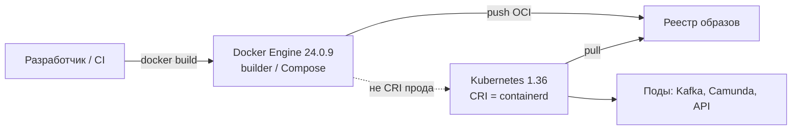
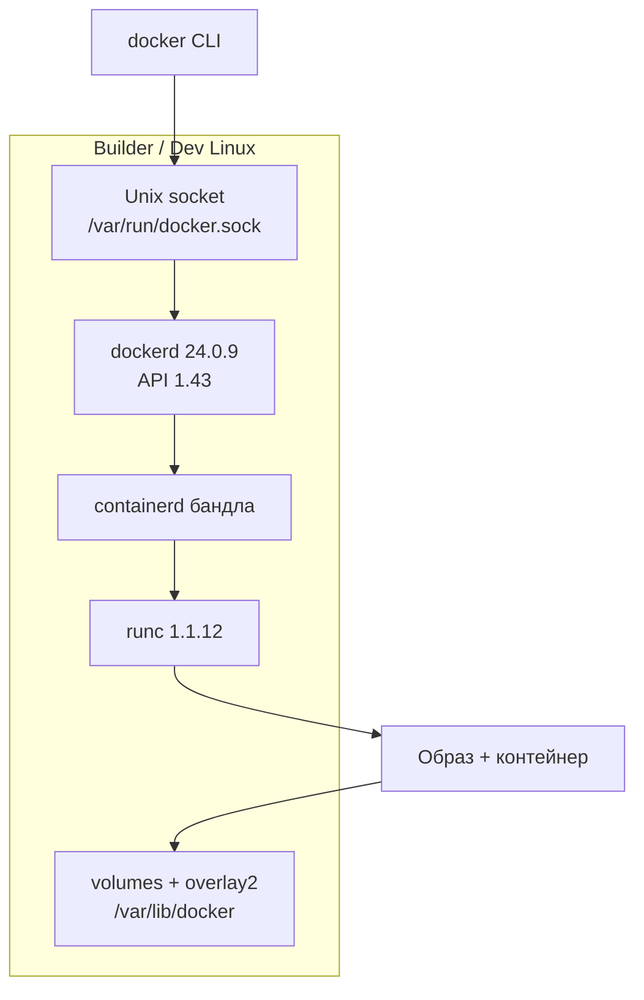
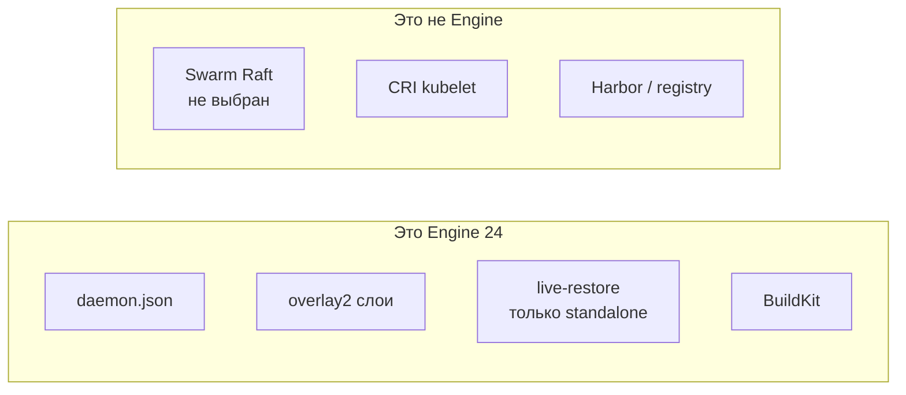
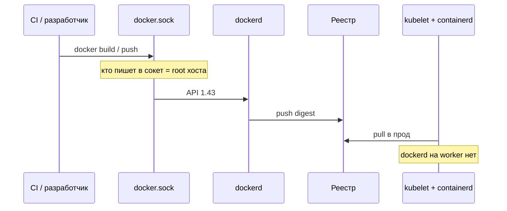
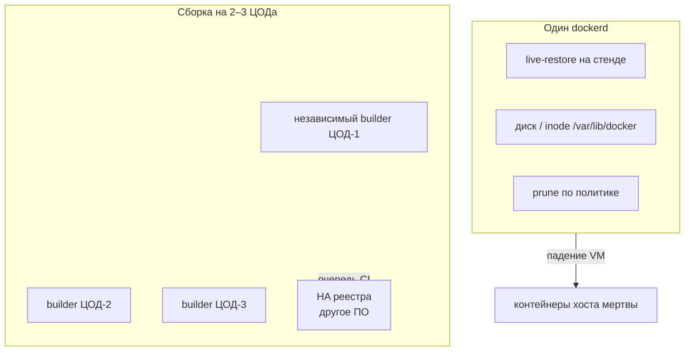
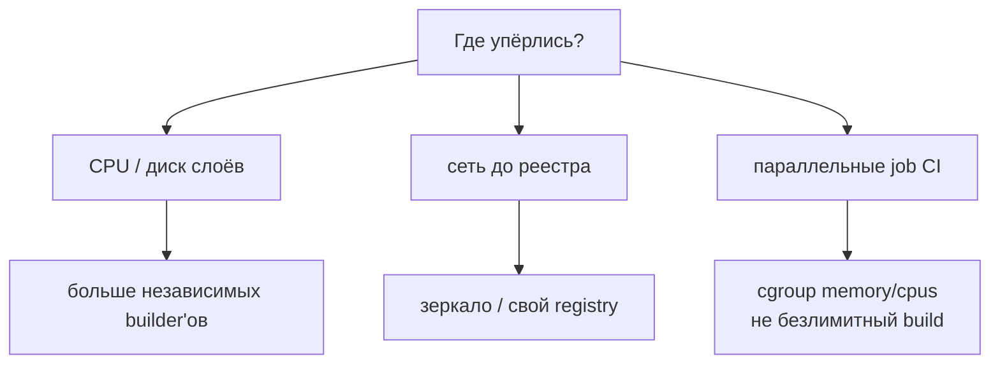
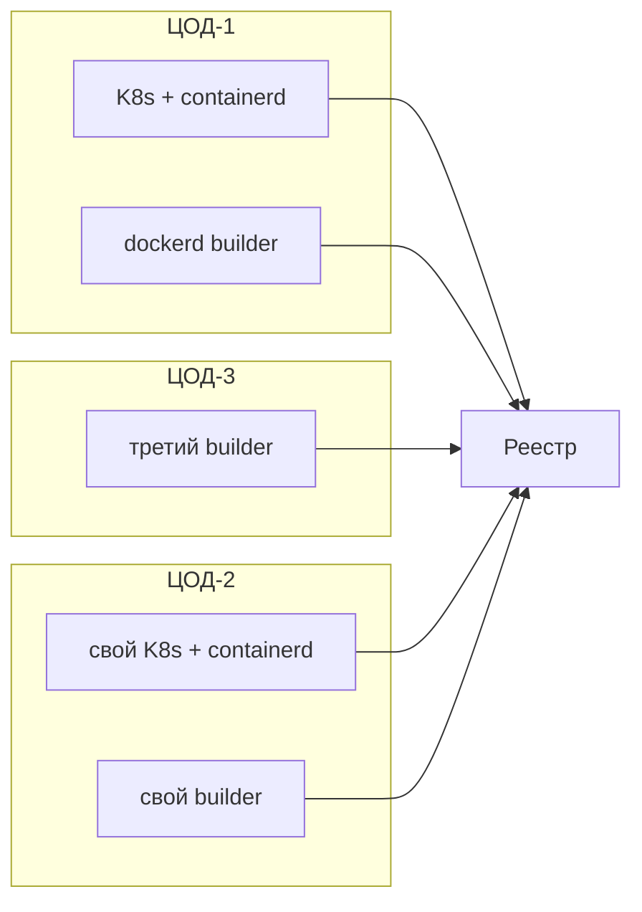

# Docker Engine 24.0.9 — схемы устройства

Связанные документы: правила — `Docker 24.md`; установка — `Docker 24.install.md`.

C4 / «D4»: контекст → контейнеры → компоненты. Код CLI не рисуем.

Допущения: линия **24.0 Unmaintained** (после 24.0.9 патчей нет; BuildKit CVE этой сборкой **не** закрыты). Прод-оркестратор — Kubernetes, CRI — **containerd**, не `dockerd`. Swarm Raft **не** путь. Stretch Swarm на 2–3 ЦОДа **нет**. Нагрузки нет.

---

## 1. Контекст

Engine 24 — **сборка и стенд**, не runtime прода и не шина.

Образы OCI можно собрать Docker'ом и запустить containerd. Это **не** значит, что на worker'ах нужен `dockerd`.

| Стрелка | Зачем помнить |
|---|---|
| CI → Engine | Сборка, не оркестрация 24/7 |
| Engine → реестр | Общее состояние сборки. Упал builder — бизнес-поды живы |
| K8s → containerd | dockershim убрали в Kubernetes **1.24**; cri-dockerd — антипаттерн |

---

## 2. Контейнеры (один хост = один демон)

Один `dockerd` = один хост. Volume **не** реплицируется на соседнюю VM. NFS как data-root демона — путь к порче слоёв.

**Не на этой схеме:** Swarm manager Raft (2377 / overlay 4789). Это второй оркестратор рядом с Kubernetes. Целевой путь платформы — **вариант C**: Engine только на CI/builder.

---

## 3. Компоненты, которые путают с «кластером»

`live-restore` спасает от рестарта **демона**, не от смерти машины. Со Swarm **несовместим**. containerd image store в 24.0 — experimental, в прод 24 **не** брать.

---

## 4. Поток: сборка образа

Порт **2375** без TLS = удалённый root. Не слушать. Удалённо — SSH или mTLS **2376**, ключи как root-пароль.

---

## 5. Отказоустойчивость — что настраивать

| Ручка | Если забыть |
|---|---|
| ≥2 builder в разных ЦОДах | Сборка = SPOF одной VM |
| Реестр живой | Builder жив, выкат в K8s встал |
| Не Swarm «чтобы HA» | Лишний Raft, UDP 4789, конфликт с kubelet |
| Не cri-dockerd на worker | Root-демон + EOL Engine под kubelet 1.36 |
| Ротация `json-file` | Дефолт без max-size заполняет диск |

Падение ЦОДа с одним builder'ом: очередь берёт другой. Выкат приложений — Kubernetes и реестр, не Docker.

---

## 6. Масштабируемость — что настраивать

Горизонталь = **N демонов**, не «один docker на 128 ядер» как единственная стратегия. Терабайты озера **не** в writable-слой overlay2. `userland-proxy` и iptables Docker конфликтуют с CNI — ещё одна причина не ставить Engine рядом с kubelet.

---

## 7. 2–3 ЦОДа без stretch

Общего кворума Docker **нет** и не нужно. Stretch-Swarm 1-1-1 в презентацию **не** класть: порога RTT у Docker нет, оркестратор уже Kubernetes.

**Сильное:** падение builder'а не роняет Kafka/Camunda. **Слабое:** линия 24 без vendor-fix; ИБ может запретить 24 целиком.

---

## 8. Безопасность (сокет = root)

1. Только Unix-сокет; **2375 никогда**; группа `docker` поимённо.
2. Не монтировать сокет в CI-поды и приложения. DinD — изолированная VM, не сокет хоста.
3. Не `--privileged`, не seccomp `unconfined`. `no-new-privileges`.
4. Свой реестр, не Docker Hub из госконтура. Тег = digest, не `:latest`.
5. Честно: **24.0.9 не закрывает требование «безопасность»** вендорскими патчами. Компенсации — не замена ухода с линии.

Источники: `Docker 24.md`. Swarm на схемах — отказ, не целевой HA.
