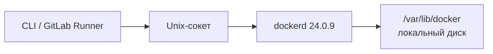

# Docker Engine 24.0.9 — установка (учебный контур)

Docker Engine — демон `dockerd` на одной Linux-машине: тянет **образы** (упакованная программа с зависимостями) и запускает их как **контейнеры**. Это не Kubernetes и не кластер. Один `dockerd` = один хост.

**Допущение:** закрытая учебная сеть, одна Linux-машина 64-bit, пакеты Docker Inc. **24.0.9**. Стенд в бой не копировать.

Линия **24.0** в Moby — [Unmaintained](https://github.com/moby/moby/blob/master/project/BRANCHES-AND-TAGS.md). Security-поддержка закончилась **8 июня 2024** ([endoflife.date](https://endoflife.date/docker-engine)). После 24.0.9 патчей нет. В релиз-нотах 24.0.9 вендор прямо пишет: известные CVE BuildKit **этой сборкой не закрыты** (фикс — Engine 25.0.2+). В 2026 году 24.0.9 **не** безопасный runtime. CRI боевого Kubernetes — **containerd**, не `dockerd`.

Официальный путь: пакеты Docker Inc. на Linux 64-bit, не `docker.io` дистрибутива, не Docker Desktop, не [static tarball](https://docs.docker.com/engine/install/binaries/) (вендор: нет автообновлений зависимостей). Скрипт `get.docker.com` ставит **latest** (сейчас 29.x) — для пина 24.0.9 не использовать.

---

## Куда ставить и сколько ресурсов (учебный контур)

**Куда.** Одна выделенная Linux-VM **64-bit** (учебный пример ниже — **Ubuntu 22.04 jammy**: в [pool Docker Inc.](https://download.docker.com/linux/ubuntu/dists/jammy/pool/stable/amd64/) лежат `.deb` **24.0.9**). Не на worker Kubernetes: iptables Docker конфликтует с CNI, а CRI кластера — containerd (`Kubernetes.install.md`).

Каталог данных демона — `/var/lib/docker` на **локальном** диске. Два демона на одном каталоге (в том числе NFS) вендор описывает как трудноотлаживаемые ошибки ([daemon data directory](https://docs.docker.com/engine/daemon/)).

API — Unix-сокет `/var/run/docker.sock`. **2375 не слушать** (TCP без TLS = удалённый root). Swarm **не** включать.



**Сколько.** В документации Docker Inc. **нет** цифр CPU/RAM для Engine. Ориентир «чтобы завелось» на учёбе — **2 CPU / 4 ГиБ** и локальный диск под `/var/lib/docker` — из `Docker 24.md`, не смета вендора и не «хватит для терабайтов». Размера тома в мануале нет.

**Сильная сторона:** один хост, официальные пакеты, те же OCI-образы, что потом уедут в Kubernetes. **Слабая:** падение VM = простой стенда; линия без патчей.

**Критично:** не `-H tcp://0.0.0.0:2375`. Не `latest`. Не Swarm (на этом стенде нужен `live-restore`; он только для standalone-контейнеров, [не для Swarm services](https://docs.docker.com/engine/daemon/live-restore/)). Не Desktop «как тот же бой».

---

## Установка для новичка

Команды — **на Linux-машине стенда**, не в PowerShell. Нужен `sudo`. Страница методов: https://docs.docker.com/engine/install/ubuntu/ (jammy всё ещё в списке ОС). Путь «specific version» в текущем гайде показывает **29.x** — для 24.0.9 берём официальный **Install from a package**: `.deb` из pool.

### Что должно быть до установки

**Есть:**

- Ubuntu **22.04** 64-bit (jammy) или другой Linux 64-bit, у которого в pool Docker Inc. есть `docker-ce` **24.0.9**
- закрытая сеть; вход с jump-хоста / VPN
- ядро с overlay и cgroup; диск под `/var/lib/docker` **локальный**, не NFS
- доступ к `download.docker.com` **или** заранее скачанные пять `.deb` (плюс образ `hello-world`, если Hub закрыт)

**Нет** (и не должно появиться на этой VM):

- пакеты `docker.io` / `podman-docker` / чужой `containerd` и `runc` (конфликт с бандлом Docker Inc.)
- kubelet на той же машине
- слушатель **2375**
- Docker Desktop
- `IMAGE`/`apt install docker-ce` без пина версии (получите 29.x)

### Этап 1. Проверка машины

**Что делаем:** убеждаемся, что это Linux 64-bit и место на локальном диске.

```bash
uname -m
. /etc/os-release && echo "$ID $VERSION_ID $VERSION_CODENAME"
free -h
df -h /var
```

Успех: `x86_64` (или другой 64-bit); для пути ниже — Ubuntu 22.04 jammy; `/var` на локальной ФС, не NFS.

### Этап 2. Снять конфликтующие пакеты

**Что делаем:** убираем неофициальный Docker дистрибутива, иначе пакеты Docker Inc. не встанут. Образы в `/var/lib/docker` команда **не** удаляет.

```bash
sudo apt remove $(dpkg --get-selections docker.io docker-compose docker-compose-v2 docker-doc docker-buildx podman-docker containerd runc | cut -f1)
```

Успех: `apt` либо снял пакеты, либо сообщил, что их не было. Команда — с [Install Docker Engine on Ubuntu](https://docs.docker.com/engine/install/ubuntu/).

### Этап 3. Скачать пакеты 24.0.9

**Что делаем:** берём `.deb` **той** версии из официального pool, не `apt install docker-ce` без номера. Имена проверены в [jammy/pool/stable/amd64](https://download.docker.com/linux/ubuntu/dists/jammy/pool/stable/amd64/) (файлы от 7 февраля 2024 и `containerd.io_1.6.28-1` от 31 января 2024).

```bash
mkdir -p ~/docker-24.0.9 && cd ~/docker-24.0.9
BASE=https://download.docker.com/linux/ubuntu/dists/jammy/pool/stable/amd64
wget "$BASE/containerd.io_1.6.28-1_amd64.deb"
wget "$BASE/docker-ce_24.0.9-1~ubuntu.22.04~jammy_amd64.deb"
wget "$BASE/docker-ce-cli_24.0.9-1~ubuntu.22.04~jammy_amd64.deb"
wget "$BASE/docker-buildx-plugin_0.11.2-1~ubuntu.22.04~jammy_amd64.deb"
wget "$BASE/docker-compose-plugin_2.21.0-1~ubuntu.22.04~jammy_amd64.deb"
```

Успех: пять файлов на диске. `containerd.io` здесь **1.6.28**, не v1.7.13 из *static* бандла релиз-нотов — пакетный путь отдельный; runc 1.1.12 идёт в `docker-ce` 24.0.9.

Если `apt list --all-versions docker-ce` после настройки [apt-репозитория](https://docs.docker.com/engine/install/ubuntu/#install-using-the-repository) всё ещё показывает `5:24.0.9-1~ubuntu.22.04~jammy` — можно ставить так (плагины и `containerd.io` тоже пинить, иначе apt подтянет текущие):

```bash
sudo apt install \
  docker-ce=5:24.0.9-1~ubuntu.22.04~jammy \
  docker-ce-cli=5:24.0.9-1~ubuntu.22.04~jammy \
  containerd.io=1.6.28-1 \
  docker-buildx-plugin=0.11.2-1~ubuntu.22.04~jammy \
  docker-compose-plugin=2.21.0-1~ubuntu.22.04~jammy
```

В индексе 2026 года строки 24.0.9 может не быть — тогда только `.deb` из pool.

### Этап 4. Установить и зафиксировать версию

**Что делаем:** ставим пакеты и запрещаем `apt upgrade` уехать на 29.x.

```bash
cd ~/docker-24.0.9
sudo dpkg -i \
  ./containerd.io_1.6.28-1_amd64.deb \
  ./docker-ce_24.0.9-1~ubuntu.22.04~jammy_amd64.deb \
  ./docker-ce-cli_24.0.9-1~ubuntu.22.04~jammy_amd64.deb \
  ./docker-buildx-plugin_0.11.2-1~ubuntu.22.04~jammy_amd64.deb \
  ./docker-compose-plugin_2.21.0-1~ubuntu.22.04~jammy_amd64.deb
sudo apt-get install -f -y
sudo systemctl enable --now docker.service containerd.service
sudo apt-mark hold docker-ce docker-ce-cli containerd.io docker-buildx-plugin docker-compose-plugin
```

Порядок `dpkg` — с [Install from a package](https://docs.docker.com/engine/install/ubuntu/#install-from-a-package). `enable` — с [post-install](https://docs.docker.com/engine/install/linux-postinstall/).

Успех: `systemctl is-active docker` → `active`.

### Этап 5. Версия демона

**Что делаем:** проверяем, что поднялся именно 24.0.9, а не «какой скачался». Docker CLI (`docker`) ходит к демону через сокет.

```bash
sudo docker version
sudo docker version --format 'Server={{.Server.Version}} API={{.Server.APIVersion}}'
sudo docker info --format 'Runc={{.Runc.Version}} Driver={{.Driver}}'
```

Успех: Server **24.0.9**, API **1.43**, Runc **1.1.12**, Driver **overlay2**. Client может совпасть с 24.0.9 (пакет `docker-ce-cli` той же сборки).

### Этап 6. `daemon.json`

**Что делаем:** кладём конфиг демона (предпочтительнее флагов в unit, [обзор daemon](https://docs.docker.com/engine/daemon/)). Ключ `hosts` **не** добавляем: иначе конфликт с `-H` у systemd, и легко включить 2375.

```bash
sudo mkdir -p /etc/docker
sudo tee /etc/docker/daemon.json <<'EOF'
{
  "live-restore": true,
  "storage-driver": "overlay2",
  "log-driver": "json-file",
  "log-opts": {
    "max-size": "10m",
    "max-file": "3"
  },
  "icc": false,
  "no-new-privileges": true
}
EOF
sudo systemctl restart docker
```

| Ключ | Зачем | Откуда |
|---|---|---|
| `live-restore` | Рестарт `dockerd` не убивает standalone-контейнеры | [live restore](https://docs.docker.com/engine/daemon/live-restore/) |
| `overlay2` | Драйвер слоёв на Linux 24.x | [daemon data](https://docs.docker.com/engine/daemon/) |
| `log-opts` 10m × 3 | У `json-file` **нет** max-size по умолчанию (unlimited) | [json-file](https://docs.docker.com/engine/logging/drivers/json-file/) — тот же пример |
| `icc: false` | На default bridge контейнеры не ходят друг к другу без явной сети. Compose всё равно создаёт user-defined сеть | [dockerd / daemon.json](https://docs.docker.com/reference/cli/dockerd/#daemon-configuration-file) |
| `no-new-privileges` | Запрет повышения привилегий через setuid у новых контейнеров | тот же справочник `dockerd` |

Успех: `systemctl is-active docker` → `active`; `sudo docker info --format '{{.LiveRestoreEnabled}}'` → `true`. Невалидный JSON — демон не стартует.

### Этап 7. `hello-world` без сети контейнера

**Что делаем:** Docker запускает готовый образ. Сначала **pull** (нужна сеть до Hub **или** заранее загруженный образ), затем контейнер с `--network none` — без сети контейнера, как в карточке стенда.

```bash
sudo docker pull hello-world
sudo docker run --rm --network none hello-world
sudo docker compose version
ss -lnt | grep 2375 || true
```

Успех: текст Hello from Docker; Compose-плагин отвечает (на пакете стенда — **v2.21.0**); строка `:2375` **пуста**. Публикация портов на учёбе — только `127.0.0.1`, не `-p 5432:5432` на все интерфейсы.

**Чего этот стенд не доказывает:** отказ зала, нагрузку сборки, выборы лидера (у одного `dockerd` их нет), CRI/CNI Kubernetes, cri-dockerd, TLS на 2376, безопасность линии 24.0 в 2026, закрытые CVE BuildKit. Успешный Compose ≠ готовность боя.

---

## Первый запуск — URL, порт, учётка, смена пароля

Веб-UI у Engine **нет**. Docker Desktop — другой продукт (VM + UI). Portainer и аналоги сюда не ставим.

**Куда ходить:** Unix-сокет `/var/run/docker.sock` на этой машине. Это файл-канал, не HTTP-URL. Клиент: `docker` CLI (или SDK) на том же хосте. По умолчанию сокет принадлежит root; без членства в группе `docker` команды — через `sudo`.

**Порт TCP не открываем.** **2375** — API без TLS (удалённый root). **2376** — API с TLS; ключи равны root-паролю. На стенде ни того ни другого: только сокет. Удалённо, если когда-нибудь понадобится — SSH (`DOCKER_HOST=ssh://…`), не 2375 ([protect-access](https://docs.docker.com/engine/security/protect-access/), [attack surface](https://docs.docker.com/engine/security/#docker-daemon-attack-surface)).

**Учётка.** Логина/пароля Engine нет. Доступ = uid root **или** группа `docker`. Вендор предупреждает: группа даёт **root-эквивалент** (можно смонтировать `/` хоста в контейнер). Не раздавать отделу.

Один учебный пользователь (не обязательно):

```bash
sudo usermod -aG docker "$USER"
newgrp docker
docker version --format '{{.Server.Version}}'
```

Успех без sudo: Server **24.0.9**. Смена «пароля» не предусмотрена: выход из группы / `gpasswd -d`. Пароля `admin` нет.

**Секрет реестра** (это не пароль демона): `docker login` к **вашему** реестру пишет `~/.docker/config.json`. В git не класть. На закрытом контуре Docker Hub с builder'а — канал утечки; для `hello-world` на учёбе Hub допустим только если сеть стенда это позволяет.

---

## Подключение к своей системе

Говорят с **этим** `dockerd` через Unix-сокет (или SSH на сокет), не через 2375.

| Кто | Как | Зачем |
|---|---|---|
| Разработчик на этой VM | `docker` / `docker compose` → `/var/run/docker.sock` | Сборка и Compose-стенд |
| GitLab Runner на **builder-VM** | executor `docker` к сокету **этой** машины; в бою CI предпочитает BuildKit rootless, не сокет в job-поде (`GitLab CI.install.md`) | Сборка образа → push в реестр |
| kubelet / поды Kafka, Camunda, API | **не** ходят в этот демон | Runtime боя — containerd |

Протокол: Engine API **1.43** по Unix-сокету. В git — Dockerfile / `compose.yaml` без паролей. В секрет — логин реестра (`docker login` / переменные CI), не содержимое сокета.

**Не монтировать** `/var/run/docker.sock` в контейнеры приложений и в CI-поды: кто пишет в сокет, тот root на хосте. DinD — отдельная изолированная VM, не сокет хоста.

Образы, которые уедут в Kubernetes, пушить в **свой** реестр по digest (не `:latest` с Hub). `dockerd` на worker'ах для этого не нужен: OCI-образ собирает Docker, запускает containerd.

### Чем продукт не является

| Сосед | Чем отличается |
|---|---|
| containerd как CRI | Runtime kubelet 1.24+; dockershim убрали в Kubernetes **1.24**. cri-dockerd не ставим |
| Docker Desktop | Другой продукт (VM + UI), не Engine 24 на сервере |
| Kubernetes | Оркестратор платформы. Engine 24 — сборка/стенд |
| Swarm | Встроенный оркестратор Docker. Конкурент Kubernetes, не плагин. На 3 ЦОДа не собираем |
| Реестр (Harbor и т.п.) | Хранилище OCI; демон его не заменяет |
| Kafka / Camunda | В бою живут в подах, не в `docker run` на этой VM |

---

## Ссылки на материал

| Факт | URL |
|---|---|
| Релиз **24.0.9** (31 января 2024), runc **1.1.12**, BuildKit CVE не закрыты, фикс 25.0.2+; containerd v1.7.13 только в static | https://docs.docker.com/engine/release-notes/24.0/ |
| Ветка `24.0` — Unmaintained | https://github.com/moby/moby/blob/master/project/BRANCHES-AND-TAGS.md |
| EOL security 24.0 — **8 июня 2024**; latest линии 24.0.9 | https://endoflife.date/docker-engine |
| Установка Ubuntu: не `docker.io`, не convenience script в прод, specific version / `.deb` из pool | https://docs.docker.com/engine/install/ubuntu/ |
| Static tarball не для прода | https://docs.docker.com/engine/install/binaries/ |
| Группа `docker` = root; сокет; json-file без ротации забивает диск | https://docs.docker.com/engine/install/linux-postinstall/ |
| `daemon.json` `/etc/docker/daemon.json`; data-root `/var/lib/docker`; не шарить каталог (NFS) | https://docs.docker.com/engine/daemon/ |
| `live-restore`; не для Swarm services | https://docs.docker.com/engine/daemon/live-restore/ |
| Пример `log-opts` max-size 10m / max-file 3; default max-size unlimited | https://docs.docker.com/engine/logging/drivers/json-file/ |
| Ключи `icc`, `no-new-privileges`, `live-restore`; предупреждение про `-H tcp://…:2375` | https://docs.docker.com/reference/cli/dockerd/#daemon-configuration-file |
| Сокет = root; TCP API без TLS нельзя | https://docs.docker.com/engine/security/ |
| Удалённо: SSH или TLS **2376**, не 2375 | https://docs.docker.com/engine/security/protect-access/ |
| API v1.43 (список изменений) | https://docs.docker.com/reference/api/engine/version-history/ |
| `.deb` 24.0.9 jammy amd64 (проверено наличие в pool) | https://download.docker.com/linux/ubuntu/dists/jammy/pool/stable/amd64/ |
| dockershim убран в Kubernetes 1.24; Engine не реализует CRI | https://kubernetes.io/blog/2022/02/17/dockershim-faq/ |
| Зачем продукт, порты, железо | `Docker 24.md` |
| Словарь | `Docker 24.info.md` |
| Схема стыковки с платформой | `Docker 24.shema.md` |
| Роль консультанта | `Docker 24.consultant.md` |
| CRI боя | `Kubernetes.install.md` |
| Runner / сборка без сокета в поде | `GitLab CI.install.md` |

**В доке вендора нет (и здесь не выдумано):** CPU/RAM «хватит для Engine» (2/4 — из `Docker 24.md`); размер `/var/lib/docker`; порог RTT для Swarm Raft; пакет `docker-ce` 24.0.9 под Ubuntu 24.04 noble (релиз Engine раньше noble; в jammy pool файлы есть); готовый веб-UI и пароль admin; обещание security-патчей 24.0 после 8 июня 2024.
