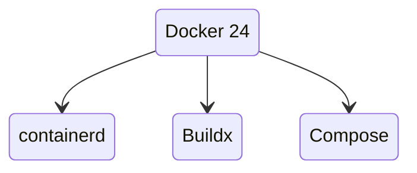
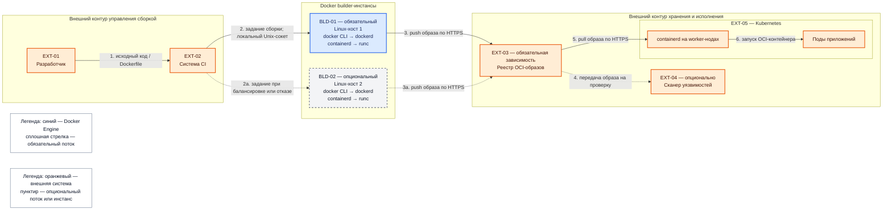

# Docker Engine 24.0.9 — развёртывание и настройка

Docker Engine — демон на одной Linux-машине: тянет образы, запускает контейнеры, собирает Dockerfile. Это **не** кластер и не Kubernetes. Один `dockerd` = один хост. Этот документ про **свою установку** версии **24.0.9** (последний патч линии 24.0; релиз **31 января 2024**).

Релиз-ноты линии: https://docs.docker.com/engine/release-notes/24.0/  
Документация Engine: https://docs.docker.com/engine/

**Статус линии 24.0 (проверено 26 августа 2026):** ветка `24.0` в репозитории Moby помечена как **Unmaintained**. На [endoflife.date/docker-engine](https://endoflife.date/docker-engine) окончание security-поддержки указано как **8 июня 2024**. После 24.0.9 патчей этой линии нет. На ту же дату поддерживаемая линия Engine у Docker Inc. — **29.x** (последний патч на момент проверки — 29.7.2).

В архитектуре платформы уже выбран **Kubernetes**. Engine 24.0.9 здесь — инструмент **сборки и стенда**, не runtime боевых подов. Его **нельзя** честно назвать боевым runtime кластера 1.36.

Этот текст — не набор команд «скопируй apt install docker-ce», а правила, без которых экземпляр не будет одновременно устойчивым к сбоям, масштабируемым и безопасным. Пошаговая установка — в `Docker 24.install.md`.

---

## Назначение системы

Docker Engine нужен, чтобы **собирать OCI-образы** и **запускать контейнеры на одной машине** (стенд разработчика, CI, сборочные VM). Команда привыкла думать «контейнер = docker» — это нормально для сборки и отладки.

Система **не** оркестрирует прод на трёх площадках, **не** заменяет Kubernetes, **не** хранит эталон клиентов и **не** является шиной событий. Kafka, Camunda, интеграционное API в бою живут **в подах Kubernetes** (runtime — containerd), не «в docker run на трёх ВМ». Образы те же OCI: собрали Docker'ом — запустили containerd.

---

## Перечень функций

Что умеет Docker Engine 24.0.9 CE:

1. **Собирать образы** (`docker build`, BuildKit). С Engine 23.0 BuildKit — сборщик по умолчанию. В **24.0.9 вендор явно пишет**: известные CVE BuildKit **не закрыты**; фикс — Engine **25.0.2+**.
2. **Запускать контейнеры** из образа: namespaces + cgroups. Падение демона по умолчанию **убивает** контейнеры, если не включён live restore.
3. **Хранить слои** драйвером **overlay2** (дефолт 24.x на Linux). Писать «в контейнер» как в диск — плохая идея; данные — в **volume**. Volume переживает удаление контейнера, **не** падение хоста и **не** копируется на соседнюю машину.
4. **Поднимать несколько контейнеров на одном хосте** файлом Compose (`compose.yaml`). Это не оркестратор на три дата-центра. В пакетах 24.0.x плагин Compose обновляли отдельно (например 24.0.7 → Compose **v2.21.0**).
5. **Слушать API** через Unix-сокет `/var/run/docker.sock` (обычно). Кто пишет в сокет — тот **управляет демоном**. Официально это равносильно root на хосте. Опционально TCP **2375** (без TLS — удалённый root) и **2376** (TLS).
6. **Не убивать контейнеры при рестарте демона** (`live restore`) — только для standalone-контейнеров. Со **Swarm mode несовместим**.
7. **Включить Swarm mode** (`docker swarm init`): сервисы, overlay-сеть, Raft у manager-нод. Это **конкурент Kubernetes**, не плагин к нему. В этой архитектуре — не целевой путь.
8. **Ограничивать контейнер:** seccomp (по умолчанию), AppArmor/SELinux если дистрибутив включил, лимиты memory/cpus, `no-new-privileges`. `--privileged` почти все ограничения снимает.
9. **Работать rootless** (демон от непривилегированного пользователя) — меньше ущерба при взломе, больше ограничений. Не «включил и забыл».
10. **Отдавать Engine API 1.43** (номер API, не «версия Docker»). В бандле 24.0.9: runc **1.1.12**, containerd часто **v1.7.13** — сверять `docker info`.

Чего система **не** делает и часто путают: она не реализует CRI для kubelet 1.24+ (нужен containerd / CRI-O, либо сторонний cri-dockerd). Не является реестром образов. Не реплицирует volumes между площадками. Не сканирует CVE. Не закрывает ГОСТ TLS. Линия 24.0 в 2026 **не** получает патчи вендора. Штатный путь боя приложений — Kubernetes, не Swarm и не `dockerd` на каждой worker-ноде.

---

## Основные элементы системы и зависимости

Docker Engine — ПО одного Linux-хоста. Каждый обязательный builder-инстанс автономен: несколько демонов `dockerd` не образуют кластер и не имеют общего состояния. Для целевой роли сборки общими точками служат внешний реестр образов и система CI; Kubernetes получает готовые образы из реестра и не зависит от Docker Engine во время исполнения приложений.

### Схема инстансов и потоков

Как читать схему:

1. Прямоугольник — именованный блок. Префикс `BLD` обозначает инстанс Docker Engine, `EXT` — внешнюю по отношению к Docker Engine систему. Вложенная рамка показывает контур или систему, но не означает, что её компоненты входят в поставку Docker Engine.
2. Синий блок `BLD-01` — единственный обязательный инстанс Docker Engine для минимальной схемы. Серый пунктирный `BLD-02` — **опциональный** независимый инстанс для параллельных сборок или переключения заданий при отказе `BLD-01`; он не превращает Docker Engine в кластер.
3. Оранжевые блоки — внешние системы. Они не устанавливаются вместе с Docker Engine. `EXT-03` обязателен для показанного полного потока доставки образа в Kubernetes; `EXT-04` опционален. `EXT-05` уже выбран платформой, но не является зависимостью, необходимой для локального запуска Docker Engine.
4. Нумерация стрелок задаёт порядок основного потока: исходный код поступает в CI, CI назначает сборку builder-инстансу, builder публикует образ в реестр, а Kubernetes загружает образ и запускает приложение.
5. Сплошные стрелки показывают обязательный путь полной схемы. Пунктирные стрелки `2а`, `3а` используются только при наличии **опционального** второго builder-инстанса; стрелка `4` — только при подключённом **опциональном** сканере.
6. Связь CI с `dockerd` должна завершаться на локальном Unix-сокете builder-хоста. Схема не требует сетевого API `2375/TCP`; открывать его нельзя. Если удалённое управление действительно необходимо, отдельно проектируют защищённый доступ, а не заменяют сокет открытым `2375/TCP`.
7. Образ после сборки хранится в `EXT-03`, а не синхронизируется между каталогами `/var/lib/docker` блоков `BLD-01` и `BLD-02`. Отказ одного builder-инстанса не удаляет уже опубликованные образы.
8. В Kubernetes образ принимает `containerd`, после чего низкоуровневый runtime создаёт контейнеры подов. Docker Engine и его `dockerd` на worker-нодах в этой схеме отсутствуют.
9. Swarm отсутствует намеренно. Поэтому порты Swarm не участвуют в обязательном сетевом контракте и открываются только при отдельном, **нецелевом для этой платформы**, решении включить Swarm.

### Что входит в состав

| Элемент | Обязательность | Тип | Технологии / варианты | Назначение | Способ поставки |
|---|---|---|---|---|---|
| **`dockerd`** | **Обязателен** | Системный демон | Docker Engine 24.0.9 CE на Linux; rootful по умолчанию, rootless — отдельный **опциональный** режим | Принимает команды Engine API, управляет образами, сетями, томами и контейнерами одного хоста | **Встроен** в Docker Engine |
| **`docker` CLI** | **Обязателен** для показанного управления | Клиент командной строки | CLI 24.0.9; локальный Unix-сокет — целевой вариант, SSH или TLS API — **опциональные** варианты удалённого доступа | Передаёт команды сборки, запуска, публикации и диагностики демону | **Встроен** в пакетную поставку Docker CE |
| **containerd** | **Обязателен** для штатного запуска контейнеров Engine | Высокоуровневый runtime | Версию бандла проверять командой `docker info`; experimental containerd image store в 24.0 **не включать** | Управляет жизненным циклом контейнеров по поручению `dockerd` | **Встроен** как зависимость Docker Engine; это не `containerd` Kubernetes из блока `EXT-05` |
| **runc** | **Обязателен** для штатного запуска контейнеров Engine | Низкоуровневый OCI runtime | runc 1.1.12 в Engine 24.0.9 | Создаёт процесс контейнера с изоляцией Linux | **Встроен** как зависимость Docker Engine |
| **BuildKit** | **Обязателен для целевой функции сборки**, но контейнеры можно запускать без сборки | Сборщик образов | С Engine 23.0 используется по умолчанию; в 24.0.9 известные CVE BuildKit не закрыты | Выполняет инструкции Dockerfile и формирует OCI-образ | **Встроен** в Docker Engine |
| **Драйвер хранения `overlay2`** | **Обязателен в принятой конфигурации** | Драйвер файловой системы | `overlay2` на поддерживаемой Linux-файловой системе | Хранит слои образов и записываемые слои контейнеров в пределах одного хоста | **Встроен** в Docker Engine; использует возможности ядра Linux |
| **Сети Docker** | **Обязательна хотя бы одна сеть** для сетевого контейнера | Виртуальная сеть одного хоста | default bridge; user-defined bridge — рекомендуемый вариант для Compose; host/none — специальные варианты | Обеспечивает связность контейнеров и публикацию портов на одном хосте | **Встроены** в Docker Engine |
| **Volumes** | **Опциональны**; обязательны только когда контейнеру нужны сохраняемые данные | Постоянное локальное хранилище контейнера | Именованный volume или bind mount; volume не реплицируется между хостами | Отделяет данные от удаляемого записываемого слоя контейнера | **Встроенный механизм** Engine; фактическое хранилище предоставляет хост |
| **Compose-плагин** | **Опционален** | Клиентский плагин | Docker Compose v2 совместимой пакетной поставки | Описывает и запускает несколько контейнеров на одном Docker-хосте | **Устанавливается отдельным пакетом-плагином**, работает поверх Engine API |
| **Swarm mode** | **Опционален и не используется в целевой архитектуре** | Встроенный оркестратор | Manager/worker, Raft, overlay-сеть | Оркестрирует сервисы между Docker-хостами | **Встроен**, но активируется отдельно командой инициализации |

### Описание именованных блоков

| Блок | Обязательность | Тип | Технологии / варианты | Назначение | Встроенный или отдельно развёрнутый |
|---|---|---|---|---|---|
| **BLD-01 — основной builder** | **Обязателен** | Инстанс Docker Engine на отдельном Linux-хосте | Docker Engine 24.0.9 CE, `dockerd`, CLI, BuildKit, containerd, runc, `overlay2`; VM или физический сервер | Собирает, локально проверяет и публикует OCI-образы | Docker-компоненты встроены в инстанс; Linux-хост развёртывается отдельно |
| **BLD-02 — дополнительный builder** | **Опционален** | Второй независимый инстанс Docker Engine | Та же зафиксированная конфигурация, что у `BLD-01`; без общего data-root и без Swarm | Добавляет параллелизм и позволяет CI переназначать сборки при недоступности `BLD-01` | Развёртывается отдельно; не является репликой состояния `BLD-01` |
| **EXT-01 — разработчик** | **Опционален для автоматического CI-потока**, обычный источник изменений | Пользователь или рабочее место | Git-клиент, IDE; локальный Docker Desktop — другой, **опциональный** продукт | Создаёт исходный код и Dockerfile, запускает сборку вручную либо через CI | Внешний блок, развёртывается отдельно |
| **EXT-02 — система CI** | **Обязательна для показанного автоматического потока**; при ручных сборках опциональна | Система управления заданиями | GitLab CI, Jenkins или эквивалент; конкретный продукт проектом не зафиксирован | Выбирает доступный builder, передаёт задание и получает статус | Внешняя система, развёртывается отдельно |
| **EXT-03 — реестр OCI-образов** | **Обязателен для доставки образов в Kubernetes**; для полностью локального стенда опционален | Сервис хранения и раздачи образов | Harbor, совместимый private registry; публичный Docker Hub — только если это разрешено политикой | Хранит опубликованные версии образов и отдаёт их среде исполнения | Внешняя система, развёртывается отдельно или предоставляется как сервис |
| **EXT-04 — сканер уязвимостей** | **Опционален технически**, но может быть обязательным по требованиям ИБ | Анализатор образов | Trivy, Grype или сканер реестра; выбор не зафиксирован | Находит известные уязвимости в образе; не исправляет EOL Docker Engine | Внешний компонент, развёртывается отдельно либо встраивается в реестр/CI |
| **EXT-05 — Kubernetes** | **Не нужен для работы Docker Engine**, но **обязателен как выбранная боевая среда платформы** | Внешний оркестратор контейнеров | Kubernetes; CRI runtime — containerd | Загружает образ из реестра и запускает боевые поды | Внешняя система, развёртывается отдельно; `dockerd` в неё не входит |

### Порты (контракт сети)

| Интерфейс / порт | Обязательность | Поток | Назначение | Кому разрешать |
|---|---|---|---|---|
| Unix-сокет `/var/run/docker.sock` | **Обязателен в целевой схеме** | `EXT-02 → BLD-01/BLD-02`, локально на каждом builder-хосте | Engine API без публикации в сеть | Только локальному root или поимённым доверенным агентам CI в группе `docker`; доступ равносилен root. Не монтировать в контейнеры приложений |
| **443/TCP** или иной настроенный HTTPS-порт реестра | **Обязателен для потоков push/pull через `EXT-03`** | `BLD-* → EXT-03`, `EXT-05 → EXT-03` | Публикация и загрузка OCI-образов | Между builder-инстансами, Kubernetes и реестром по правилам межсетевого экрана; точный порт определяется конфигурацией внешнего реестра |
| **2375/TCP** | **Запрещён в целевой и опциональной схемах** | Удалённый клиент → `dockerd` без TLS | Незащищённый Engine API | **Никому; не слушать** |
| **2376/TCP** | **Опционален; по умолчанию закрыт** | Удалённый доверенный клиент → `dockerd` с TLS | Защищённый удалённый Engine API | Только если необходимость удалённого API обоснована; доступ к ключам равносилен привилегированному управлению хостом |
| **2377/TCP** | **Опционален только при включённом Swarm; в целевой схеме закрыт** | Swarm-ноды → manager | Управление кластером и Raft | Только между Swarm-нодами; не в интернет |
| **7946/TCP+UDP** | **Опционален только при включённом Swarm; в целевой схеме закрыт** | Между Swarm-нодами | Обнаружение и обмен состоянием нод | Только между Swarm-нодами |
| **4789/UDP** | **Опционален только при включённом Swarm; в целевой схеме закрыт** | Между Swarm-нодами | Трафик overlay-сети VXLAN | Только между доверенными Swarm-нодами; не публиковать на периметр |

`2375/TCP`, `2376/TCP`, `2377/TCP`, `7946/TCP+UDP` и `4789/UDP` для показанной целевой схемы не требуются. Сетевые порты пользовательских контейнеров определяются самими приложениями и в контракт Docker Engine не входят.

---

## Глоссарий

| Термин | Значение в этом документе |
|---|---|
| **API** | Программный интерфейс, через который CLI или другая система отдаёт команды сервису. |
| **AppArmor / SELinux** | Механизмы Linux, ограничивающие разрешённые действия процессов, включая процессы контейнеров. |
| **Builder / builder-инстанс** | Отдельный Linux-хост с Docker Engine, используемый для сборки образов. |
| **BuildKit** | Встроенный в рассматриваемую поставку сборщик, который исполняет Dockerfile и создаёт образ. |
| **CA** | Центр сертификации, которому доверяют участники TLS-соединения. |
| **CE** | Community Edition — пакетная редакция Docker Engine, рассматриваемая в документе. |
| **CI** | Система непрерывной интеграции, которая автоматически запускает задания сборки и проверки. |
| **CLI** | Клиент командной строки `docker`, передающий команды демону. |
| **CNI** | Интерфейс сетевых плагинов Kubernetes; к сети Docker Engine напрямую не относится. |
| **Compose** | Плагин и формат YAML для описания нескольких контейнеров на одном Docker-хосте. |
| **Container / контейнер** | Изолированный процесс, запущенный из образа с заданными ограничениями и файловой системой. |
| **containerd** | Runtime, который по поручению `dockerd` управляет жизненным циклом контейнеров; отдельный containerd также служит runtime Kubernetes. |
| **Contention** | Конкуренция нескольких процессов или контейнеров за ограниченный ресурс одного хоста. |
| **cgroups** | Механизм ядра Linux для учёта и ограничения CPU, памяти и других ресурсов процесса. |
| **CRI** | Интерфейс Kubernetes для взаимодействия kubelet с runtime контейнеров. Docker Engine 24.0.9 его штатно не предоставляет. |
| **CRI-O / cri-dockerd** | Сторонние реализации CRI: CRI-O является runtime, а cri-dockerd связывает kubelet с Docker Engine. В целевой схеме не используются. |
| **CVE** | Идентификатор публично известной уязвимости. |
| **Daemon / демон** | Долго работающий фоновый системный процесс; здесь — `dockerd`. |
| **Data-root** | Каталог состояния Docker Engine, по умолчанию `/var/lib/docker`, локальный для одного хоста. |
| **Docker Desktop** | Отдельный настольный продукт Docker с виртуальной машиной и интерфейсом пользователя; не серверный Docker Engine из этого документа. |
| **Docker Hub** | Публичный внешний реестр образов Docker. |
| **Digest** | Неизменяемый криптографический идентификатор содержимого образа. |
| **Dockerfile** | Текстовый файл с инструкциями сборки образа. |
| **Engine API** | Интерфейс управления `dockerd`, доступный через Unix-сокет или опционально через TCP. |
| **EOL / unmaintained** | Состояние линии, для которой завершена поддержка и не выпускаются штатные исправления безопасности. |
| **Firewall / межсетевой экран** | Средство, разрешающее или запрещающее сетевые соединения по адресам, протоколам и портам. |
| **Gossip** | Протокол обмена служебным состоянием между нодами Swarm. |
| **ГОСТ TLS** | TLS с криптографическими алгоритмами и средствами, требуемыми российскими стандартами; Docker Engine сам это требование не закрывает. |
| **HA / отказоустойчивость** | Способность сервиса продолжать работу при отказе части компонентов. Один `dockerd` HA не обеспечивает. |
| **HTTPS** | HTTP поверх TLS; в схеме используется для защищённого обмена образами с реестром. |
| **Image / образ** | Неизменяемый пакет файлов и метаданных, из которого запускается контейнер. |
| **Inode** | Структура файловой системы для учёта файла; её исчерпание блокирует создание новых файлов даже при наличии свободного места. |
| **iptables** | Подсистема Linux для правил сетевой фильтрации и перенаправления трафика; Docker создаёт в ней собственные правила. |
| **Kubernetes** | Внешний оркестратор, который размещает и поддерживает контейнеризованные приложения на группе нод. |
| **Kubelet** | Агент Kubernetes на worker-ноде, который через CRI управляет runtime контейнеров. |
| **Live restore** | Опциональный режим Docker Engine, позволяющий standalone-контейнерам продолжить работу во время недоступности демона. |
| **Namespace** | Механизм ядра Linux, изолирующий процессы, сеть и другие ресурсы контейнера. |
| **NFS** | Сетевая файловая система; не должна использоваться как общий data-root Docker Engine. |
| **NTP** | Протокол синхронизации времени между хостами. |
| **OCI** | Открытые спецификации формата образа и запуска контейнера, позволяющие собрать образ Docker Engine и запустить его другим совместимым runtime. |
| **Overlay2** | Драйвер Docker для послойного хранения образов и записываемых слоёв контейнеров на Linux. |
| **Overlay-сеть** | Виртуальная сеть между несколькими Docker-хостами в Swarm; не то же самое, что драйвер хранения `overlay2`. |
| **Pod / под** | Минимальная единица запуска приложения в Kubernetes, содержащая один или несколько контейнеров. |
| **`--privileged`** | Режим запуска, который снимает большую часть изоляционных ограничений контейнера и даёт расширенный доступ к хосту. |
| **Push / pull** | Соответственно публикация образа в реестр и загрузка образа из реестра. |
| **Raft** | Алгоритм согласования состояния manager-нод Swarm, требующий кворума. |
| **Registry / реестр** | Отдельный сервис для хранения и раздачи версий OCI-образов. В Docker Engine не входит. |
| **Root / rootful / rootless** | Root — привилегированный пользователь Linux; rootful-демон работает с его полномочиями, rootless — в ограниченном пользовательском режиме. |
| **RTT** | Время прохождения сетевого запроса до другой стороны и ответа обратно. |
| **seccomp** | Механизм Linux, ограничивающий набор системных вызовов, доступных процессу контейнера. |
| **SSH** | Защищённый протокол удалённого доступа, который может использоваться для управления Docker-хостом. |
| **Standalone-контейнер** | Контейнер, которым напрямую управляет один Docker Engine, а не сервис Swarm. |
| **Supply chain** | Цепочка происхождения исходного кода, зависимостей, сборки и доставки программного артефакта. |
| **Runtime** | Компонент, который создаёт, запускает и останавливает контейнеры. |
| **Swarm mode** | Опциональный встроенный режим Docker Engine для оркестрации сервисов между несколькими Docker-хостами. |
| **TCP / UDP** | Транспортные сетевые протоколы; вместе с номером порта задают сетевой интерфейс сервиса. |
| **TLS** | Протокол шифрования и взаимной проверки сторон сетевого соединения. |
| **Unix-сокет** | Локальный файл специального типа для обмена командами между процессами одного хоста; здесь `/var/run/docker.sock`. |
| **VM / виртуальная машина** | Изолированный программный сервер со своей операционной системой. |
| **Volume / том** | Управляемое Docker локальное хранилище данных, живущее отдельно от записываемого слоя контейнера. |
| **VXLAN** | Технология инкапсуляции сетевого трафика, используемая overlay-сетью Swarm. |
| **Worker-нода** | Сервер Kubernetes, на котором kubelet и runtime запускают поды приложений. |
| **YAML** | Текстовый формат конфигурации, используемый, например, файлами Compose. |

---

## Краткие вводные

### Как устроена отказоустойчивость

**Один `dockerd` отказоустойчивости не даёт.** Упал хост или демон без live restore — контейнеры этого хоста мертвы. Live restore спасает от **рестарта демона**, не от смерти машины.

Отказоустойчивость «как у etcd» появляется **только** у Swarm (кворум manager'ов: 3 переживут 1). В вашей схеме оркестратор уже Kubernetes. Второй Raft на тех же площадках удваивает операционку и не лечит Kafka/Postgres.

Для **сборки** (целевая роль): несколько независимых builder'ов в разных площадках + живой реестр. Упал один демон — не падает Kafka и не падает интеграционное API.

| Что падает | Что происходит (роль builder) |
|---|---|
| Один builder из двух+ | Очередь CI берёт другой. Приложения в Kubernetes живы |
| Реестр | Сборка может пройти, **выкат** встанет |
| `/var/lib/docker` переполнился | Все контейнеры **этого** хоста. Это инцидент доступности |
| Сокет в CI-поде скомпрометирован | Root на builder-хосте |

### Как устроено масштабирование

Две оси, их путают со «горизонтальным Docker»:

1. **Больше контейнеров на одном хосте** → CPU/RAM **одной** машины; contention на `docker0`/iptables. Лимиты обязательны.
2. **Больше хостов с собственным `dockerd`** → суммарная сборка. Потолок — реестр, сеть, люди, которые патчат N демонов.

«Терабайты» не кладут в overlay2. Сборка упирается в CPU, диск слоёв, сеть до реестра.

`userland-proxy` по умолчанию **true**: отдельный процесс на опубликованный порт. На Linux часто ставят `false`, полагаясь на iptables — только поняв firewall **этого** хоста.

Для Swarm (если кто-то предложит вместо Kubernetes): вендор пишет, что **больше manager'ов = хуже write** состояния. Масштаб нагрузки — worker'ы, не «9 manager'ов».

### Безопасность самого Docker

Компрометация сокета / группы `docker` / 2375 = root на хосте: можно смонтировать `/` хоста в контейнер.

Опасные значения и привычки:

| Что | Как бывает «из коробки / из примера» | Почему опасно |
|---|---|---|
| TCP 2375 | можно включить руками | Удалённый root |
| Группа `docker` | post-install предлагает | Весь отдел = root на builder'ах |
| Монтаж сокета в CI | «чтобы внутри был docker» | Типичный путь побега (DinD/socket) |
| `--privileged` / `seccomp=unconfined` | «чтобы завелось» | Снята изоляция |
| `json-file` без max-size | дефолт | Диск кончился — хост лёг |
| BuildKit на 24.0.9 | сборщик по умолчанию | CVE **не закрыты** (цитата релиз-нотов 24.0.9) |
| `:latest` с Docker Hub | привычка | Supply chain и утечки |

Линия **unmaintained**: vendor-security в 2026 **нет**. Компенсации (нет 2375, свой реестр, сканер, запрет privileged) **не заменяют** патчи. ИБ может запретить 24 — и будет права.

ГОСТ TLS Engine не закрывает. Content Trust (подписи Notary) — не замена сканера CVE.

---

## Допущения

Ниже то, чего не было в исходном запросе, но без чего нельзя нарисовать конкретную схему. Если допущение неверно — схему надо пересмотреть.

1. Целевой бинарь — **Docker Engine 24.0.9 CE на Linux**, не Desktop, не Mirantis Container Runtime, не podman.
2. Прод-оркестратор — Kubernetes (`Kubernetes.md`), CRI — **containerd**. Engine 24 **не** ставится на worker'ы.
3. Роль 24.0.9, если линию всё же фиксируют: сборочные/утилитарные хосты и стенды. Не шина событий, не озеро, не Camunda.
4. Три дата-центра = три домена отказа. Если это три зала с общим питанием — раскладка Swarm 1-1-1 врёт так же, как etcd 1-1-1.
5. Нагрузки нет — нет числа сборочных VM и размера `/var/lib/docker`.
6. Формального SLA нет. «Беспрерывная работа» не закрывает дыру unmaintained-линии.
7. Образы приложений — OCI: формат не привязывает бой к `dockerd`.
8. Учебный стенд изолирован. На тесте допустим один демон и Compose; секреты боя туда не копируем.
9. ИБ может потребовать ГОСТ / запрет Docker Hub. Тогда зеркало и свой CA для 2376 — отдельные работы.
10. Если руководство **настоит** считать Swarm оркестратором вместо Kubernetes — это смена архитектуры, не «настройка Docker».

---

## Критически важные условия, которых нет в исходном контексте

Их нужно закрыть **до** закупки «Docker на три площадки».

| Пробел | Почему это ломает решение |
|---|---|
| **Зачем именно линия 24, а не поддерживаемый Engine** | 24.0.9 не получает CVE-фиксов с июня 2024. Уже в день релиза 24.0.9 вендор написал, что BuildKit CVE этой сборкой не закрыты. В августе 2026 это замороженная поверхность атаки на сборочный контур |
| **Docker — runtime Kubernetes или только CI?** | От этого зависит, появится ли cri-dockerd на каждой ноде. Для Kubernetes 1.36 штатный путь — containerd |
| **Кто владеет реестром и допускается ли Docker Hub** | Закрытый контур без зеркала = CI встанет. Публичный Hub = утечки и supply chain |
| **RTT между дата-центрами** | Нужен, если кто-то предлагает stretch-Swarm. Цифры порога в доке Docker **нет** |
| **Профиль сборки** (частота, размер образов, параллелизм) | Без этого нельзя сказать, сколько builder-хостов и какой диск |
| **Требования ИБ: 152-ФЗ, КИИ, rootless, запрет privileged** | Часто ответ ИБ на 24.0.9 — «нет, нет патчей» |
| **Кто патчит хосты 24/7** | Unmaintained Engine + живой kernel — развилка: либо исключение с датой вывода, либо уход с 24 |
| **Есть ли уже «docker.sock в Jenkins»** | Скрытый cluster-admin хоста. Пока сокет торчит в job'ы — модель безопасности фикция |

---

## Источники (чтобы не принимать на веру)

- Релиз-ноты 24.0, в т.ч. 24.0.9 (runc 1.1.12, BuildKit CVE **не** закрыты, отсылка к 25.0.2): https://docs.docker.com/engine/release-notes/24.0/
- Статус веток Moby (`24.0` — Unmaintained): https://github.com/moby/moby/blob/master/project/BRANCHES-AND-TAGS.md
- Даты security-поддержки Engine: https://endoflife.date/docker-engine
- Конфиг демона, overlay2: https://docs.docker.com/engine/daemon/
- Live restore; standalone vs Swarm: https://docs.docker.com/engine/daemon/live-restore/
- Swarm admin (кворум, 1-1-1, бэкап): https://docs.docker.com/engine/swarm/admin_guide/
- Порты Swarm, VXLAN 4789: https://docs.docker.com/engine/swarm/swarm-tutorial/
- Attack surface демона, сокет = root: https://docs.docker.com/engine/security/
- Защита сокета: SSH и TLS :2376: https://docs.docker.com/engine/security/protect-access/
- Удаление dockershim в Kubernetes 1.24: https://kubernetes.io/blog/2022/02/17/dockershim-faq/
- Static binaries «не рекомендуем в прод»: https://docs.docker.com/engine/install/binaries/

Утверждения про конкретный миллисекундный порог RTT «для здорового Swarm Raft» в документации Docker **отсутствуют**.
