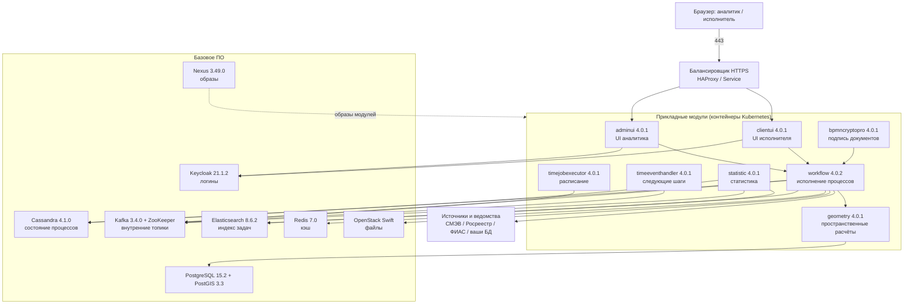

# GeoData 4.0.1 / workflow 4.0.2 — развёртывание и настройка

GeoData — коммерческая low-code платформа ООО «АйТи Гео» (IT Geo): управление данными, процессы в нотации BPMN, пространственный анализ, интеграции, конструкторы форм и электронных документов с электронной подписью. В реестре российского ПО — запись **№ 17166 от 03.04.2023**. Свидетельство о регистрации программы ЭВМ **№ 2023612186 от 31.01.2023**. Скачать её как бесплатный образ с Docker Hub нельзя: нужен дистрибутив поставщика.

Сайт: https://datageo.ru/ · документация: https://docs.datageo.ru/ · вендор: https://www.it-geo.ru/

Версии прикладных модулей в руководстве администратора на docs.datageo.ru: **clientui / adminui / timejobexecutor / bpmncryptopro / timeeventhandler / geometry / statistic — 4.0.1**, **workflow — 4.0.2**. Публичного changelog «последний релиз на август 2026» у поставщика нет — опираемся на **опубликованное руководство**, а не на догадку о более новой линейке.

Страница «Среда развертывания ППО» и глава «Аварийные ситуации» с портала документации **не были загружены** (таймаут). Если поставщик там уточняет отказ нескольких дата-центров — это нужно дочитать у него, а не выдумывать.

Этот текст — не набор команд «скопируй yaml и запусти», а правила, без которых система не будет одновременно устойчивой к сбоям, масштабируемой и безопасной. Пошаговая установка — в `GeoData.install.md`.

---

## Назначение системы

GeoData — слой **сборки процессов, экранных форм и пространственных расчётов** у себя в контуре. Аналитик в браузере собирает процесс (загрузка данных, госуслуга, сравнение контуров), исполнитель заполняет формы, платформа ходит в ваши базы и — если так включите — в готовые адаптеры к ведомствам.

Система **исполняет свои модели процессов** своим движком `workflow`. Она **не** является общесистемной шиной событий (у вас для этого платформенный Kafka), **не** является Camunda и **не** озеро эталонных клиентских карточек. Состояние своих процессов она хранит в **своей** Cassandra; геометрию считает через **свой** PostgreSQL с расширением PostGIS.

Покупать GeoData «рядом» с Camunda и своим интеграционным API к ведомствам без явного решения «кто исполняет заявку» — значит получить два места правды по одной госуслуге.

---

## Перечень функций

Что платформа умеет из коробки (по документации и сайту поставщика):

1. **Собирать процессы без отдельного сервиса на каждый шаг** (модуль аналитика `adminui`): источники, формы, права, BPMN, встроенный язык платформы.
2. **Исполнять эти процессы** (модуль `workflow` версии **4.0.2**): модель — чертёж, экземпляр — один прогон (заявка, загрузка). Это **свой** движок, не Camunda.
3. **Давать экран исполнителю** (модуль `clientui`): кнопки, формы, документы.
4. **Считать геометрию** (модуль `geometry`): пересечения, буферы, контуры. Ходит в PostgreSQL с PostGIS, не в Cassandra.
5. **Подключать источники из интерфейса**: PostgreSQL, MongoDB, Cassandra, MS SQL, Oracle, Elasticsearch; очереди Kafka и RabbitMQ. На сайте — готовые модули **ФИАС, Росреестр, СМЭВ 3.0, Яндекс, Почта РФ**; в кейсах также PostGIS, geojson, PBF, XML, XLSX, REST, ЕГРН, DaData.
6. **Подписывать электронные документы** (модуль `bpmncryptopro`) через **КриптоПро**. Без лицензии и носителей ключей это не «просто ещё один Java-контейнер».
7. **Ставить шаги по расписанию и по времени** (`timejobexecutor`, `timeeventhandler`).
8. **Писать статистику исполнения** (`statistic`) во внутреннюю Kafka и в Elasticsearch.
9. **Хранить файлы документов** в объектном хранилище (в инсталляторе — OpenStack Swift).
10. **Пускать людей через единый вход** (Keycloak, протокол OAuth).
11. **Разграничивать доступ** в разделе «Безопасность»: до папки процесса, задачи, формы; субъект — пользователь, должность, подразделение, атрибут.
12. **Переносить процессы между стендами** zip-экспортом (официальная методика: папка **без** вложенных папок).

Надстройка **AI Network** (локальные модели, YandexGPT/GigaChat, боты) в главах установки базового и прикладного ПО **не описана** — это отдельный контур (видеокарты, исходящие API, тексты в запросах к модели).

Чего система **не** делает и часто путают: она не замена платформенного Kafka (у GeoData **своя** Kafka **3.4.0** и ZooKeeper и свои служебные топики), не Camunda, не озеро эталона, не OpenSearch платформы, не готовый Helm «на любой Kubernetes». Штатный путь прикладных модулей — `docker load` архивов → реестр образов → `kubectl apply`. Инсталлятор базового ПО написан вокруг **одной** площадки (`dc0`), не «пережили дата-центр».

---

## Требования к развёртыванию

### Требования к ПО

| Что | Что ставить | Комментарий |
|---|---|---|
| **Формат поставки** | Прикладные модули — контейнеры Kubernetes. Базовое ПО — отдельные серверы/кластеры тех версий, что в таблице поставщика | Публичного образа на Docker Hub нет. Дистрибутив: каталог `Distr/Apps/` (tar.gz, yaml, скрипты `setup*.sh`). Конфиг прикладных модулей в инструкции **вшивают в образ** (`docker cp` + `docker commit`) — для боя это слабое место, не норма |
| **Kubernetes** | В таблице поставщика — **1.24.1** | Официального оператора / Helm «GeoData на любой кластер» нет. Совместимость манифестов 1.24 с более новой линией **не заявлена**. Самодельный чарт = вы сами чините отказ |
| **ОС базового ПО** | **Ubuntu 22.04 LTS** (Debian-подобные — с оговоркой поставщика) | Это путь глав установки базового ПО. **Windows как сервер GeoData не заявлена.** |
| **Браузеры** | Chrome ≥ 81, Яндекс.Браузер ≥ 76, Opera ≥ 12, Safari ≥ 13 | Нужен **WebGL 1.0**. Без него карта и часть интерфейса не встанут |
| **Базовое ПО (версии из таблицы руководства)** | Cassandra **4.1.0**, Kafka **3.4.0** + ZooKeeper, Elasticsearch **8.6.2**, PostgreSQL **15.2** + PostGIS **3.3**, Redis **7.0.8**, Swift **2.29.2**, HAProxy **2.4**, Keepalived **2.2.4**, Nexus **3.49.0** | Не «поставьте что угодно свежее». Платформенный Kafka 4.x, OpenSearch, PostgreSQL другой мажорной линии **не подставлять** вместо этого списка, пока поставщик письменно не разрешит |
| **Keycloak** | В главе установки — дерево **`keycloak-21.1.2`**, OpenJDK **11** | В сводной таблице руководства указано «3.4». Версии **не совпадают** — закрывать с поставщиком, не выбирать «на глаз». Для текста ниже важнее глава установки |
| **Электронная подпись** | КриптоПро и контур ключей | Если юридически значимые документы входят в задачу. Модуль в дистрибутиве есть в любом случае; отключаемость без поставщика не подтверждаем |
| **Часы** | NTP на **всех** машинах | Без синхронизации времени кластеры Cassandra/Kafka и сессии ведут себя непредсказуемо |
| **Лицензия** | Договор + дистрибутив. Отдельно — Elasticsearch 8.x и КриптоПро | Elasticsearch 8.x — не та же свободная лицензия, что у OpenSearch. Юристы должны увидеть условия **до** «у нас уже есть поиск, поставим ещё один» |

Готовой учебной виртуальной машины «всё в одном docker-compose» поставщик в прочитанных главах не даёт. Сжимать базовое ПО можно, но не в самодельную кучу контейнеров, если такого профиля нет в поставке.

### Требования к ресурсам

Цифры ниже — **минимумы поставщика «чтобы кластер базового ПО считался кластером»**, не смета вашей нагрузки. Нагрузки в исходном запросе не было. Для прикладных подов CPU и RAM в загруженных главах **не нормированы**.

| Роль | CPU | RAM | Диск |
|---|---|---|---|
| **Узел Cassandra** | не нормирован отдельно | **от 8 ГиБ** | **от 100 ГиБ**; минимум **3 узла на площадку** |
| **Узел Kafka 3.4** | **4 ядра** | **8 ГиБ** | **100 ГиБ**; минимум 3 узла |
| **Узел Elasticsearch** | не нормирован отдельно | **8 ГиБ** | **100 ГиБ**; рекомендуется 3 узла |
| **PostgreSQL + PostGIS** (в инструкции — один сервер) | не нормирован отдельно | **от 4 ГиБ** | **от 2 ГиБ** — это «чтобы поставилось», не терабайты контуров |
| **Redis** (в инструкции — один сервер) | **4 ядра** | **4 ГиБ** | **20 ГиБ** |
| **Keycloak** (в инструкции — один сервер) | **2 ядра** | **4 ГиБ** | **250 ГиБ** |
| **Swift** | — | — | фактор копирования **3**; «рекомендуется **5 узлов**», копий не больше числа узлов. В примере колец — **3** адреса в одном регионе/зоне |

Дополнительно:

- Терабайты геометрии живут на диске и индексах **PostGIS**, не в копиях внутренней Kafka.
- Файлы документов — **Swift**, не пустой том пода Kubernetes.
- 100 ГиБ на узел Cassandra из мануала — пол тестовый; под нагрузку считать отдельно.
- На тестовой песочнице минимумы можно не требовать. Этот «облегчённый» стенд **нельзя** переносить в бой как «официальный минимум».

---

## Основные элементы системы и зависимости

Платформа — это **два слоя отдельных программ**, а не один процесс. Ниже — те из них, которые ставятся как отдельные инстансы, и как они вызывают друг друга.

### Схема инстансов и потоков

Как читать схему:

1. Человек заходит по HTTPS на балансировщик, тот отдаёт запрос на **adminui** (аналитик) или **clientui** (исполнитель). Оба пускают через **Keycloak**.
2. Бизнес-логика процесса считается в **workflow**. Состояние экземпляров — в **Cassandra** (пространство ключей `workflow_schema`), не в поде.
3. Служебные сообщения (следующие шаги, логи, статистика, файлы) едут во **внутреннюю** Kafka 3.4.0. Это **не** ваши бизнес-топики вроде `client.updated` и **не** платформенный Kafka 4.x.
4. **geometry** ходит в PostgreSQL/PostGIS. Геометрию «запихнуть в Cassandra» продукт так не умеет.
5. **statistic** читает свою Kafka и пишет в Elasticsearch и Cassandra.
6. Файлы и PDF — **Swift**. ЭП — отдельный модуль **bpmncryptopro** (КриптоПро).
7. Образы прикладных модулей забираются из **Nexus** (или согласованного реестра).

Рядом, но это уже другое ПО: ваш платформенный Kafka, Camunda, озеро эталона, интеграционное API к ведомствам, OpenSearch. Их отказ проектируется отдельно. Пока нет письма поставщика — это **соседние** продукты, не «тот же кластер».

### Что входит в поставку

**Прикладные модули** (в примере поставщика namespace `geodata`, в манифестах часто **3** реплики):

| Роль | Зачем | Как масштабируется |
|---|---|---|
| **adminui** | Интерфейс аналитика (nginx + JS) | Несколько подов за отдельным Service/LB |
| **clientui** | Интерфейс исполнителя | То же |
| **workflow** | Исполнение BPMN и скриптов | Несколько подов **плюс** Cassandra и внутренние топики. Образ **4.0.2** |
| **geometry** | Пространственные расчёты | Поды **и** PostgreSQL/PostGIS. Тяжёлые пересечения не лечатся «ещё одним clientui» |
| **bpmncryptopro** | Подпись ЭП | Отдельные поды; контур ключей — не Kubernetes Secret «на глаз» |
| **timejobexecutor** / **timeeventhandler** | Расписание и постановка следующих шагов | Реплики есть; отдельный LB в таблице адресов поставщика **не** указан |
| **statistic** | Статистика исполнения | Свой файл настроек; Kafka + Elasticsearch + Cassandra |

**Базовое ПО** — см. таблицу версий выше. HAProxy 2.4 и Keepalived 2.2.4 входят в матрицу поставщика; линейка 2.4 старше актуального LTS вашего документа по HAProxy — что ставить, решает совместимость с yaml GeoData, не «самая новая».

Служебные топики Kafka, которые создаёт инсталлятор (фактор копирования **2**, **50** партиций; для служебных смещений — фактор **3**): `jobtimeeventtopicprod`, `timeeventtopicprod`, `tokentoexecute`, `workflowlogs`, `workflowtokenstatus`, `statistictopic`, `filestorageactiontopic`, `audittopics`. Продюсер statistic в примере: ждать подтверждения от всех копий.

### Порты (контракт сети)

Отдельной таблицы «все порты GeoData» в загруженных главах нет. Ниже — порты **базового ПО и входа**, которые нужно закладывать в файрвол. Перед боем **сверить** с руководством **вашей** поставки.

| Порт / вход | Назначение | Кому открывать |
|---|---|---|
| **443/TCP** | HTTPS интерфейсов adminui / clientui | Сеть единого входа, не интернет без нужды |
| **Keycloak** (HTTPS выбранного вами порта) | Логины UI | UI и браузер; не мир |
| **9042** и служебные Cassandra | Клиенты workflow | Только прикладные модули и узлы Cassandra |
| **9092** и служебные Kafka 3.4 / ZooKeeper | Внутренние топики GeoData | Только модули GeoData и брокеры **этого** кластера, не платформенный Kafka 4.x |
| **9200** Elasticsearch | Индекс задач | Только statistic / workflow. В примере поставщика защита **выключена** — в бою так нельзя |
| **5432** PostgreSQL | Геометрия | Только geometry. Не мир |
| **6379** Redis | Кэш | Только модули GeoData. В примере слушает везде без защиты |
| **Swift API** | Файлы документов | Только workflow / файловый контур |
| SMTP | Уведомления | Исходящий с узлов, которые шлют почту |

Исходящие к СМЭВ, Росреестру, Яндексу, Почте РФ, DaData — только те адреса, которые реально включите. Без сети адаптер не «отказоустойчив», он просто не работает.

### Зависимости окружения (что ещё должно быть)

- Дистрибутив прикладных модулей и доступ в закрытый контур (Nexus или совместимый реестр, если поставщик разрешит замену) + сертификат для Docker `certs.d`.
- Kubernetes той версии, которую **подтвердит поставщик**. Строка 1.24.1 в доке при вашей более новой линии — **блокер**, пока нет письма.
- DNS / полное имя на все узлы базового ПО и на балансировщики прикладных модулей.
- SMTP для уведомлений.
- КриптоПро — если нужны юридически значимые документы.

---

## Краткие вводные

### Как устроена отказоустойчивость

Это **не** один общий механизм на весь продукт. Поставщик на сайте пишет «горизонтальная масштабируемость и отказоустойчивость». В **руководстве администратора** это расшифровывается так:

**1) Прикладные модули в Kubernetes**

| Что падает | Что происходит |
|---|---|
| Один под, когда реплик два или больше | Остальные обслуживают интерфейс и API, **если** состояние не в этом поде, а в Cassandra / Redis / Postgres |
| Все поды `workflow` | Процессы не идут. Данные в Cassandra **на месте** |
| Три реплики в одной зоне / на одной ноде | Падение этой зоны = нет прикладного слоя |

Три реплики Deployment — это не три дата-центра.

**2) Cassandra, Kafka, Elasticsearch, Swift**

| Компонент | Что в инструкции | Что это значит |
|---|---|---|
| Cassandra | ≥ 3 узлов **на площадку**; рабочее пространство ключей — стратегия **без понятия о дата-центрах**, фактор копирования **2** | Переживёт падение **узла**, если вторая копия жива. Копии **не** раскладываются по площадкам этой настройкой |
| Kafka 3.4 + ZooKeeper | 3 брокера; топики с фактором 2; смещения с фактором 3 | Падение 1 брокера: смещения, скорее всего, живы; пользовательский топик с фактором 2 может пережить 1 брокер, **не** 1 дата-центр |
| Elasticsearch | 3 узла, роли data+master | Типичный маленький кластер одной площадки. Разнос по зонам в процитированном фрагменте **не задан** |
| Swift | фактор 3, в примере узлы в одном регионе/зоне | Файлы в трёх копиях на трёх машинах **одной** зоны |

**3) Одиночки в инструкции**

Redis, PostgreSQL и Keycloak в руководстве — **по одному серверу**. Падение этой машины = деградация кэша, геометрии или входа в интерфейс. Это точка отказа, не «кластер из коробки».

Итого: инсталлятор даёт **внутриплощадочную** устойчивость части хранилищ и подов. «Упал один из трёх дата-центров — GeoData жива» **этим текстом не доказано**.

**4) Ведомство снаружи**

Ночь, когда Росреестр не отвечает, GeoData не лечит. Нужны таймауты, повтор без двойной заявки и очередь на стороне процесса.

### Как устроено масштабирование

Единицы роста разные (их путают):

1. **Больше людей в интерфейсе** → больше подов adminui/clientui. Они упираются в `workflow` и Keycloak, не в «ещё 20 экранов».
2. **Больше экземпляров процессов** → поды `workflow` **плюс** Cassandra и внутренние топики (у них уже 50 партиций — запас параллелизма **внутри** GeoData).
3. **Тяжёлая геометрия** → CPU подов `geometry` **и** диск/индексы PostGIS.
4. **Объём файлов** → узлы и диски Swift.
5. **Cassandra** — поставщик явно: добавлять узлы, считать **по площадкам**.

Нагрузки нет — поэтому **нет** числа «хватит N воркеров». Есть только минимумы «чтобы базовое ПО считалось кластером».

### Безопасность самой GeoData

Компрометация учётки аналитика с широкими правами = процессы, источники, выгрузки, часто и контуры. Раздел «Безопасность» в интерфейсе — прикладные права, не замена сетевой политики и шифрования каналов базового ПО.

Опасные значения «из коробки / из примера»:

| Что | Как в примере | Почему опасно |
|---|---|---|
| Elasticsearch | защита выключена | Любой, кто достучался до 9200, читает и пишет индекс задач |
| Redis | слушает везде, защитный режим выкл | Открытый кэш без штатной защиты |
| Секреты | пароли в файле настроек, затем `docker commit` | Слой образа хранит секрет. Смена пароля = пересборка образа |
| Пароли и хранилище ключей | приведены открытым текстом в инструкции | Их нельзя переносить в ваш контур |
| Почта | доверять любому сертификату SMTP | Подмена сервера почты |
| Модуль ЭП | КриптоПро | Это отдельный контур ИБ. Он **не** чинит пункты выше |

Исходящие коммерческие API (Яндекс, DaData): персональные адреса уходят наружу. Юридическое основание — до включения адаптера.

---

## Допущения

Ниже то, чего не было в исходном запросе, но без чего нельзя нарисовать конкретную схему. Если допущение неверно — схему надо пересмотреть.

1. Берём **установку у себя**, не облако datageo.ru. Иначе ваш Kubernetes ни при чём: ставит поставщик.
2. Версии прикладных модулей — **4.0.1 / workflow 4.0.2**, базовое ПО — как в таблице руководства. Более новые сборки возможны у поставщика; без пакета поставки не утверждаем.
3. Целевая роль — **либо** пространственный контур и загрузка поверх вашего озера, **либо** процессы и госинтеграции в GeoData. Не оба сразу с Camunda и своим интеграционным API на те же заявки. Если выберете узкую роль — урезать базовое ПО можно только с письма поставщика (не мы выкидываем Cassandra).
4. Платформенный Kafka 4.x и OpenSearch — **соседние** продукты, не backend GeoData.
5. Три дата-центра = три независимых отказа (питание, сеть). Три зала с общим ИБП — это не три площадки. Инсталлятор GeoData к размазыванию **не приспособлен из коробки**.
6. Задержка сети между площадками неизвестна. Пока её не измерили — не обещаем один кластер Cassandra/Kafka на три стороны.
7. Нагрузки нет. Нет ёмкости дисков «под терабайты».
8. Формального «сколько данных готовы потерять / как быстро восстановиться» поставщик в загруженных главах **не даёт**.
9. Keycloak **21.1.2** (глава установки) важнее строки «3.4» в сводной таблице, **пока поставщик не скажет иначе**.
10. КриптоПро нужен, если электронные документы с подписью входят в задачу.
11. AI Network **не входит** в минимальный контур.
12. Совместимость манифестов с Kubernetes сильно новее 1.24 **не проверена**. Для боя: либо поставщик сертифицирует ваш кластер, либо под GeoData держат отдельный кластер поддерживаемой версии.
13. Страница «Среда развертывания ППО» не прочитана. Допущение: критичных сюрпризов по составу базового ПО там нет. Если появится — этот документ обновляют.

---

## Критически важные условия, которых нет в исходном контексте

Их нужно закрыть **до** договора и «постановки в бой».

| Пробел | Почему это ломает решение |
|---|---|
| **Роль GeoData vs Camunda vs интеграционное API vs озеро** | Без решения будут два движка процессов и два пути в СМЭВ. Отказоустойчивость «системы» станет неопределённой |
| **Письмо поставщика: несколько дата-центров, время восстановления, один кластер vs актив плюс запас** | Публичный инсталлятор — односайтовый. Сами «докрутить копии и стойки» без поддержки = серая схема |
| **Совместимость с вашим Kubernetes (не 1.24.1)** | Устаревшие объекты, политики безопасности, диски, вход — типичные причины «yaml из дистрибутива не накатился» |
| **Можно ли заменить Elasticsearch→OpenSearch, Kafka 3.4→4.x, Swift→MinIO, Nexus→Harbor** | Логично для унификации и **не обещано**. Замена без поставщика = вы сами сопровождаете форк |
| **Профиль нагрузки geometry и размер PostGIS** | «Терабайты» могут оказаться в контурах зданий. Тогда одиночка Postgres из инструкции неприемлема даже на одной площадке |
| **Задержка и канал между дата-центрами** | Размазанная Cassandra чувствительна к задержке; Swift между площадками — к ширине канала |
| **Контур СМЭВ: тест / промышленность, сертификаты, простой ведомства** | Живой GeoData не лечит молчание Росреестра |
| **Персональные и кадастровые данные, аттестация** | Меняет, можно ли облако поставщика, куда писать индекс без защиты, нужен ли отдельный сегмент |
| **Лицензии: GeoData, КриптоПро, Elasticsearch** | Закрыть до установки |
| **Кто патчит базовое ПО** | Поставщик фиксирует Cassandra 4.1.0, Kafka 3.4.0, Elasticsearch 8.6.2, Kubernetes 1.24.1. Жить на них без патчей — отдельный риск. Кто имеет право поднять минор? |

---

## Краткое описание ключевых этапов и элементов развертывания

Общий каркас (и тест, и бой) — **порядок поставщика**, его не переставлять:

1. Имена в DNS, сеть, диски под Cassandra / Kafka / Elasticsearch / Swift / Postgres.
2. Базовое ПО в последовательности руководства (Cassandra → Elasticsearch → … → Redis). Шаг можно пропустить, только если **тот же** продукт **той же** мажорной линии уже стоит и поставщик это разрешил.
3. Keycloak: область, клиент входа (в примере `workflowprod`), сертификат для интерфейса.
4. Nexus + загрузка образов прикладных модулей.
5. Пространство имён Kubernetes, сервисы-балансировщики, реплики модулей, настройки **без** паролей из мануала.
6. Проверка: в браузере открывается стартовая страница **модуля аналитика** после логина — так поставщик определяет «система жива».
7. Отдельно: перенос процессов zip-экспортом по методике поставщика.

Боевая схема на несколько дата-центров, порядок включения и проверки — в `GeoData.install.md`. Ниже — только тестовый стенд.

---

### 1 инстанс: тестовый стенд, 1 площадка, без нагрузки

**Цель стенда:** аналитики собирают процесс, разработчики смотрят коннекторы, понятен язык платформы. **Не** цель: доказать переживание дата-центра и терабайты PostGIS.

ОПО можно сжать относительно боя, но **не** в «один compose со всем», если поставщик такого профиля не дал.

- Одно пространство имён `geodata`.
- Прикладные модули: **по 1 реплике** (не копировать «3 из примера»).
- Cassandra: **3 узла всё же лучше 1** — иначе не увидите даже копирование с фактором 2. Если железа нет — 1 узел и фактор 1 **только** с пометкой «песочница, не кластер GeoData».
- Kafka 3.4 + ZooKeeper: 1 или 3 брокера; на 1 брокере топики только с фактором 1.
- Elasticsearch: 1 узел с ролями master и data.
- Postgres+PostGIS, Redis, Swift, Keycloak, Nexus — по одному.
- HAProxy/Keepalived на тесте можно заменить Service/Ingress Kubernetes, **если** поставщик не завязал поставку на конкретные виртуальные адреса из примера.

Сеть теста — изолированная. Пример с открытым Redis и выключенной защитой Elasticsearch **допустим только здесь**, и то лучше сразу включить пароль, чтобы привычка не уехала в бой.

#### Что сознательно упрощаем

| Параметр | На тесте | Почему можно |
|---|---|---|
| Реплики прикладных модулей | 1 | Нет нагрузки и нет требования пережить падение пода |
| Копии Cassandra/Kafka | 1 на совсем маленьком стенде | Некому копировать |
| КриптоПро | заглушка / тестовый удостоверяющий центр, если юристы разрешат | Иначе стенд встанет на закупке средства криптозащиты |
| СМЭВ | тестовый контур или заглушка | Промышленный СМЭВ на тесте опасен и часто запрещён |
| AI Network | выкл | Иначе тексты датасетов уедут в модель |

#### Чего на тесте **не** стоит упрощать

- Имена внутренних топиков Kafka и пространство ключей `workflow_schema` — иначе перенос процессов на бой сломается неожиданными именами.
- Вход через Keycloak (не «встроим простой пароль навсегда»).
- Отдельный Postgres для PostGIS, не «запихнем геометрию в Cassandra».
- Экспорт/импорт процессов по методике поставщика — это ваш конвейер для BPMN.
- Понимание: успешный прогон на одном `workflow` **не** доказывает копирование, 50 партиций и падение Keycloak.

#### Сильные стороны такой схемы

- Близко к тому, как поставщик реально поставляет ПО (Kubernetes + базовое ПО), а не к фантазии «это просто веб-морда».
- Дешево показывает, есть ли у вас роль для продукта, до контракта на промышленное базовое ПО.

#### Слабые стороны (обязательно понимать)

- Стенд не ловит: перекладку Kafka, расхождение Cassandra, медленный PostGIS, падение Keycloak, заполнение Swift.
- Если на тесте выключить защиту Elasticsearch, в бой это утащат копипастой.
- Совместимость yaml 1.24 с вашей линией Kubernetes **не** проверена.

Практическая рекомендация: препрод = уменьшенная **копия односайтовой** инструкции поставщика (3 Cassandra, 3 Kafka, 3 Elasticsearch, 3 реплики прикладных модулей, фактор копирования как в мануале) уже с шифрованием каналов и секретами не в образе. Всё это **в одном** дата-центре.

---

## Сводка: что считать «экземпляр готов»

| Требование | Тест (1 площадка) | Бой |
|---|---|---|
| Отказоустойчивость | Не требуется | Не меньше трёх узлов Cassandra/Kafka/Elasticsearch **на активной площадке**; 3 реплики прикладных модулей не на одной ноде; Redis/Postgres/Keycloak — не молчаливая одиночка без бэкапа; бэкап Cassandra+Postgres+Swift с учебной восстановкой. Схема на 2–3 дата-центра — в `GeoData.install.md` |
| Производительность / масштаб | Не требуется | Геометрия — диск PostGIS; файлы — Swift; UI упирается в workflow; минимумы 8 ГиБ / 100 ГиБ — не смета нагрузки |
| Безопасность | Свои пароли; порты не с интернета; лучше сразу пароль Redis/Elasticsearch | Нет примера «защита Elasticsearch выкл» и открытого Redis; секреты не в слое образа; шифрование каналов; исходящие только в согласованные ведомства; ограничение прав в интерфейсе; ЭП — отдельный контур ИБ; журналы не только в том же зале, что единственная Cassandra |

**Не готов к бою**, если: yaml 1.24 накатили на более новый Kubernetes без письма; внутренние топики положили на платформенный Kafka 4.x; второй движок процессов рядом с Camunda на те же госуслуги; Elasticsearch без защиты; секреты только в образе; нет прогнанного восстановления; нет решения «узкая гео-роль или широкие процессы»; ждут, что три реплики в Kubernetes = три дата-центра.

---

## Источники (чтобы не принимать на веру)

- Руководство администратора: https://docs.datageo.ru/
- Продукт: https://datageo.ru/ · https://datageo.ru/platform.html · https://datageo.ru/cases.html
- Реестр ПО № 17166; патент RU 2790038 (логические компоненты, не инсталлятор)
- Незагруженные главы HA: «Среда развертывания ППО», «Аварийные ситуации» — дочитать у поставщика

Утверждения вида «GeoData переживёт два дата-центра» в загруженной документации **отсутствуют** — поэтому в этом файле их нет. Схему нескольких площадок спрашивать у поставщика, не собирать из соседних платформенных гайдов. Боевая раскладка — в `GeoData.install.md`.
