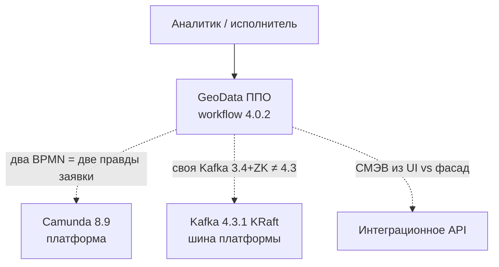
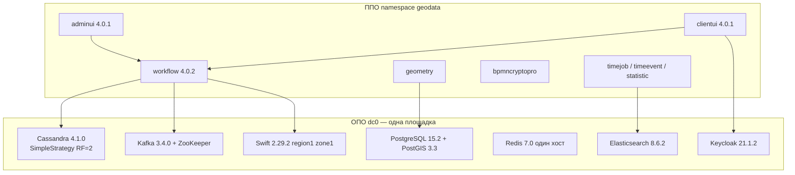
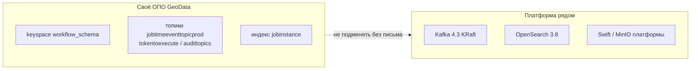
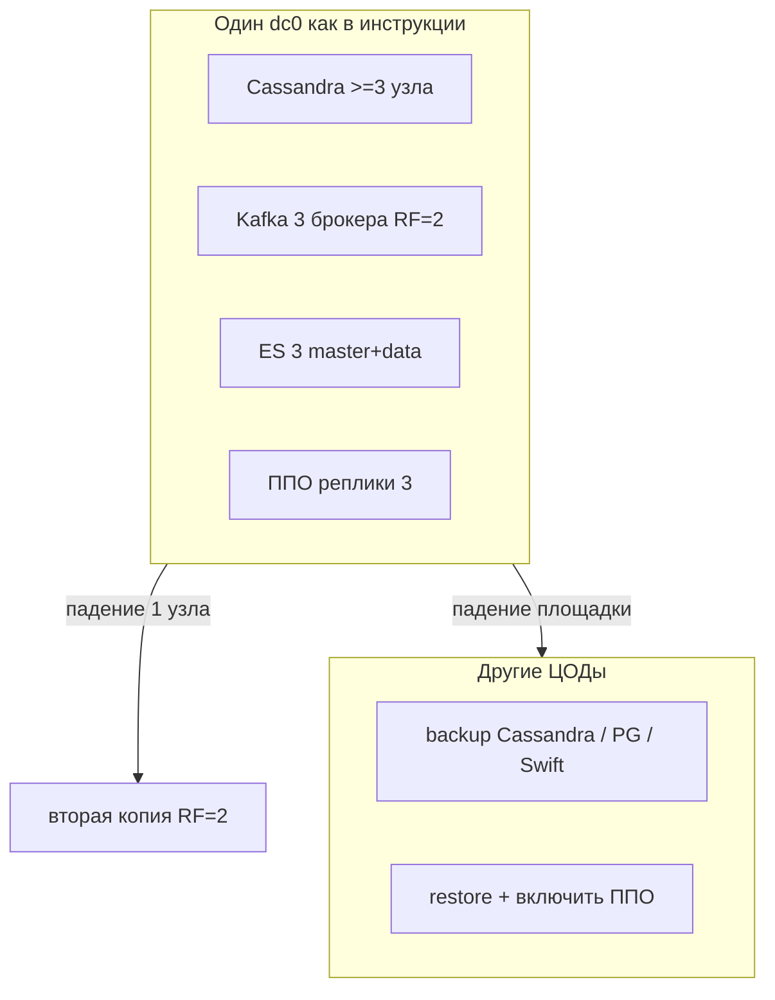
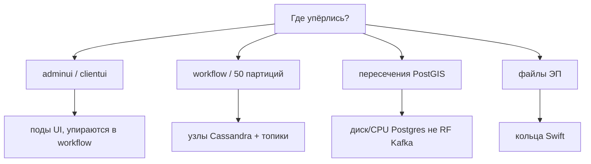
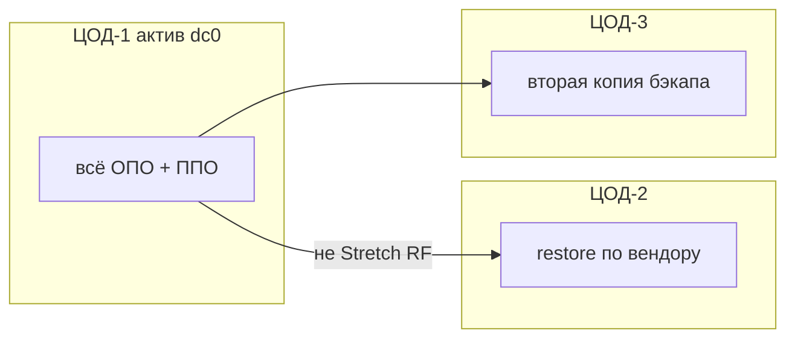

# GeoData 4.0.1 / workflow 4.0.2 — схемы устройства

Связанные документы: правила — `GeoData.md`; установка — `GeoData.install.md`.

C4 / «D4»: контекст → контейнеры → компоненты. BPMN аналитика не рисуем.

Допущения: on-premise ООО «АйТи Гео», модули **4.0.1**, **workflow 4.0.2**. Stretch на 2–3 ЦОДа **не выдумываем**: публичный инсталлятор — один логический **`dc0`**. Глава «Аварийные ситуации» с портала **не загружена**. Нагрузки нет.

---

## 1. Контекст

GeoData — **свой** low-code контур (процессы + гео + адаптеры). Это конфликт с платформой, его не прятать.



Три честных роли — выбрать **одну**: (А) гео-ETL; (Б) процессы+госинтеграции вместо дубля Camunda/API; (В) «всё сразу» — запрещён по умолчанию.

Готовые адаптеры вендора: ФИАС, Росреестр, СМЭВ 3.0. Это **клиент** к ведомству, не доказанная замена вашего фасада.

---

## 2. Контейнеры: ППО + ОПО инсталлятора



В примере вендора реплики ППО = **3** и отдельные `*-lb`. Три пода в одном ЦОДе ≠ три ЦОДа. Конфиг вшивают в образ (`docker commit`) — слабое место поставки.

Манифесты рассчитаны на Kubernetes **1.24.1**. Платформа — **1.36**. Совместимость **не заявлена** — блокер до письма вендора, не «наверное заведётся».

---

## 3. Компоненты данных (не платформенные)



Служебные топики инсталлятора: RF=2, 50 партиций; `offsets.topic.replication.factor=3`. Это **не** `client.updated`. Elasticsearch ≠ OpenSearch платформы. Redis и Postgres в инструкции — **по одному серверу** = SPOF кэша и геометрии.

---

## 4. Поток: шаг процесса

```mermaid
sequenceDiagram
  participant U as UI clientui
  participant W as workflow
  participant C as Cassandra
  participant K as Kafka 3.4
  participant G as geometry / PostGIS
  participant S as Swift

  U->>W: задача / форма
  W->>C: состояние экземпляра
  W->>K: tokentoexecute / logs
  W->>G: контур если нужно
  W->>S: файл / ЭП
  Note over W: Keycloak на логине; без него UI не пускает
```

Критерий вендора «система жива»: стартовая страница **модуля аналитика** после логина. Экспорт процессов — zip по методике (папка **без** вложенных папок).

---

## 5. Отказоустойчивость — что настраивать

Не рисуем NetworkTopologyStrategy на 3 ЦОДа: инсталлятор этого **не** собирает.



| Что в инструкции | Что это даёт |
|---|---|
| SimpleStrategy RF=2 | Узел, не ЦОД. Стратегия **не знает** про площадки |
| Kafka топики RF=2 | 1 брокер, не 1 ЦОД. Offsets RF=3 |
| Swift 3 IP zone 1 | Три машины **одной** зоны |
| Redis / Postgres / Keycloak ×1 | SPOF входа, геометрии, кэша |
| 3 реплики workflow | Под, если состояние в Cassandra |

RPO/RTO вендор в загруженных главах **не даёт**. Честный прод: **P1** — актив в одном ЦОДе + прогнанный restore. P2 stretch — только после проекта с вендором.

---

## 6. Масштабируемость — что настраивать



Минимумы вендора (3×Cassandra «на ЦОД», 3 Kafka, 3 ES) — «чтобы считалось кластером», не ёмкость терабайт контуров. Добавлять узлы Cassandra вендор просит **считать по ЦОДам** — это про sizing узлов, не готовая схема 3 площадок.

---

## 7. 2–3 ЦОДа без выдуманного stretch



Третий `dc` в Cassandra **сами не добавляем**. HAProxy 2.4 + Keepalived 2.2.4 есть в матрице ОПО — балансировка **внутри** сайта, не межЦОДовый Raft.

**Сильное:** совпадает с публичным дистрибутивом. **Слабое:** потеря активного ЦОДа = простой GeoData; люди примут «3 реплики K8s» за 3 ЦОДа.

---

## 8. Безопасность и разрыв версий

1. Пример `xpack.security.enabled: false` и Redis `protected-mode no` — только лаборатория.
2. Пароли не в `docker commit` и не из текста мануала. JKS — секретный том.
3. TLS на Kafka/ES/Cassandra/Postgres/Keycloak/Swift/Ingress. `mail.smtp.ssl.trust=*` — нет.
4. RBAC в UI («Безопасность» до папки процесса) ≠ NetworkPolicy ОПО.
5. КриптоПро — отдельный контур СКЗИ, не чинит plaintext ES.
6. **K8s 1.24 yaml vs 1.36 платформы** — стоп, пока вендор не сертифицирует. Замена Kafka/ES/Swift на платформенные кластеры **не обещана**.

Источники: `GeoData.md`. ТрёхЦОДовой HA из публичной доки **не следует** — на схемах её нет.
