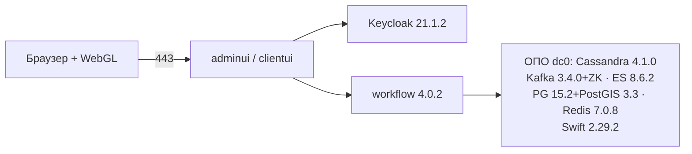

# GeoData 4.0.1 / workflow 4.0.2 — установка (учебный контур)

GeoData — платная low-code платформа ООО «АйТи Гео»: процессы (свой движок `workflow`), формы, геометрия. Без договора образов нет: Docker Hub не отдаёт поставку. Готового docker-compose вендор в прочитанных главах **не даёт** — не собирать «как у Grafana».

**Допущение:** закрытая сеть, установка **у себя** (не облако datageo.ru), один логический `dc0`. Версии прикладных модулей из руководства: **4.0.1**, `workflow` **4.0.2**. Базовое ПО — **пин вендора**, не платформенный Kafka 4.x / OpenSearch / «свежий» Postgres.

**Docker** — программа, которая запускает **образ** (упакованная программа с зависимостями) как контейнер. Путь прикладных модулей: `docker load` из tar.gz → реестр (в таблице вендора — Nexus **3.49.0**) → `kubectl apply` (накатить YAML в Kubernetes). Официального Helm «на любой кластер» нет.

Документация: https://docs.datageo.ru/ · продукт: https://datageo.ru/  
На этой сверке портал отдал **только оглавление**. Тела глав «Подготовка к работе», «Описание операций», «Среда развертывания ППО», «Аварийные ситуации» **не загружены**. Команды ниже — те, что уже есть в локальных `.md` (они снимались с руководства поставки). Без каталога `Distr/Apps/` шаги не выдумать.

---

## Куда ставить и сколько ресурсов (учебный контур)

**Куда.** Базовое ПО — отдельные машины **Ubuntu 22.04 LTS** (Debian-подобные — с оговоркой вендора). Windows-сервер не заявлен. Прикладные модули — в Kubernetes **1.24.1** (так в таблице руководства). Совместимость манифестов с платформенным **1.36.x** (`Kubernetes.install.md`) **не заявлена**: до письма поставщика — отдельный кластер 1.24.1 **или** поставка стопорится. Накатывать yaml «на глаз» на чужой кластер нельзя.

Один живой контур — **одна площадка**. Инсталлятор вокруг `dc0`; Cassandra с SimpleStrategy RF=2 и кольца Swift в одной зоне — схема одного зала, не «пережили дата-центр». Порог RTT в доке GeoData **нет** — stretch не обещать.



**Сколько.** Цифры — минимумы вендора «чтобы кластер базового ПО считался кластером», не смета нагрузки. CPU/RAM прикладных подов в загруженных главах **не нормированы**.

| Роль | CPU | RAM | Диск | Узлы на учебный контур |
|---|---|---|---|---|
| Cassandra **4.1.0** | в главе не нормирован отдельно | **от 8 ГиБ** | **от 100 ГиБ** | вендор: **≥ 3 на площадку**; 1 узел RF=1 — только пометка «песочница, не кластер» |
| Kafka **3.4.0** + ZooKeeper | **4 ядра** | **8 ГиБ** | **100 ГиБ** | вендор: 3; на 1 брокере топики только RF=1 |
| Elasticsearch **8.6.2** | в главе не нормирован отдельно | **8 ГиБ** | **100 ГиБ** | вендор рекомендует 3; на учёбе допустим 1 (master+data) |
| PostgreSQL **15.2** + PostGIS **3.3** | в главе не нормирован отдельно | **от 4 ГиБ** | **от 2 ГиБ** («чтобы поставилось», не терабайты контуров) | в инструкции — **один** сервер |
| Redis **7.0.8** | **4 ядра** | **4 ГиБ** | **20 ГиБ** | в инструкции — **один** хост |
| Keycloak (глава: дерево **`keycloak-21.1.2`**, OpenJDK **11**) | **2 ядра** | **4 ГиБ** | **250 ГиБ** | один сервер. В сводной таблице руководства — «3.4»: **расхождение**, закрывать с поставщиком; для установки важнее глава |
| Swift **2.29.2** | — | — | RF=**3**; «рекомендуется **5** узлов», копий не больше числа узлов | в примере колец — **3** адреса в одном region/zone |
| Nexus **3.49.0** | — | — | — | реестр образов дистрибутива |
| HAProxy **2.4** + Keepalived **2.2.4** | — | — | — | в матрице ОПО; на учёбе можно Service/Ingress Kubernetes, **если** поставка не завязана на VIP из примера |
| ППО (`adminui`, `clientui`, `workflow` **4.0.2**, `geometry`, `bpmncryptopro`, `timejobexecutor`, `timeeventhandler`, `statistic` **4.0.1**) | не нормированы | не нормированы | не `emptyDir` | на учёбе реплики **1** (не копировать «3 из примера») |

Сайт https://datageo.ru/platform.html пишет «commodity» и onPremise/onCloud — **без** этой таблицы. PDF https://datageo.ru/GeoData_2025.pdf ядер/гигабайт тоже не даёт. Навигация «Аппаратное обеспечение» с сайта: URL `hardware.html` на сверке — **404**.

Каталоги данных Cassandra / Kafka / Elasticsearch / Postgres — **локальные диски**, не NFS «на всякий случай» (NFS как единственный диск ОПО вендор не описывает). NTP на всех машинах.

**Сильная сторона:** совпадает с публичным инсталлятором. **Слабая:** Redis, Postgres, Keycloak в инструкции — одиночки; падение этой VM = деградация кэша, геометрии или входа.

**Критично:** 443 / Keycloak / 9042 / 9092 / 9200 / 5432 / 6379 / Swift API в интернет не публиковать. Не `latest`. Не подставлять платформенный Kafka 4.x, OpenSearch, Postgres другой мажорной линии, Swift 2.37 / MinIO, Harbor вместо Nexus — пока нет письма.

---

## Установка для новичка

В этом репозитории **нет** `Distr/Apps/` (tar.gz, yaml, скрипты `setup*.sh`). Без дистрибутива поставщика команды установки ОПО и полный текст манифестов **не выдумать**. Ниже — порядок и те команды, которые уже есть в локальных `.md` / карточке. Порядок базового ПО **не переставлять**.

Браузер клиента: Chrome ≥ 81, Яндекс.Браузер ≥ 76, Opera ≥ 12, Safari ≥ 13, нужен **WebGL 1.0**.

### Что должно быть до установки

**Есть:**

- договор и каталог `Distr/Apps/`
- Ubuntu 22.04 для ОПО; DNS / FQDN на узлы
- Kubernetes **1.24.1** (или письмо, что ваша линия допустима)
- закрытая сеть, NTP, локальные диски под Cassandra / Kafka / ES / Postgres / Swift
- браузер с WebGL

**Нет:**

- публичных образов на Docker Hub
- самодельного compose «весь GeoData в одном файле»
- yaml с платформенного Kubernetes 1.36 без письма
- AI Network (в главах установки ОПО/ППО её нет — в этот стенд не входит)

### Этап 1. Сеть и диски

**Что делаем:** готовим машины ОПО и кластер ППО. Без имён в DNS и локальных каталогов данных следующие шаги бессмысленны.

Успех: узлы пингуются по FQDN, время совпадает, каталоги данных не на NFS.

### Этап 2. Базовое ПО — версии из таблицы, порядок руководства

**Что делаем:** ставим ОПО **своих** версий по руководству вашей поставки (команды — в `setup*.sh` и главе установки, не здесь). Последовательность в локальных файлах: **Cassandra → Elasticsearch → … → Redis**. Пропуск шага — только если тот же продукт **той же** мажорной линии уже стоит **и** поставщик разрешил.

Зафиксировать:

| Компонент | Версия |
|---|---|
| Cassandra | **4.1.0**, keyspace процессов `workflow_schema` |
| Kafka + ZooKeeper | **3.4.0** (не KRaft, не платформенный 4.x) |
| Elasticsearch | **8.6.2** |
| PostgreSQL + PostGIS | **15.2** / **3.3** |
| Redis | **7.0.8** |
| Swift | **2.29.2** |

Пример вендора: Elasticsearch `xpack.security.enabled: false`, Redis `protected-mode no` и `#bind 127.0.0.1` — **только** изолированный стенд. Лучше сразу пароль, чтобы привычка не уехала.

Служебные топики **внутренней** Kafka (не `client.updated` платформы; инсталлятор: RF=2, 50 партиций; offsets RF=3): `jobtimeeventtopicprod`, `timeeventtopicprod`, `tokentoexecute`, `workflowlogs`, `workflowtokenstatus`, `statistictopic`, `filestorageactiontopic`, `audittopics`. На одном брокере — только RF=1 и пометка «песочница».

Успех: процессы ОПО слушат свои порты; в Cassandra есть пространство ключей; топики созданы. Точные `systemctl`/`cqlsh` — в мануале поставки, публичное оглавление их не отдало.

### Этап 3. Keycloak

**Что делаем:** область и клиент входа. В примере руководства клиент `oauth.clientid` = **`workflowprod`**. Каталог установки: **`keycloak-21.1.2`**, OpenJDK **11**.

Успех: страница логина Keycloak открывается в закрытой сети. Порт HTTPS — тот, что в **вашей** главе; отдельной таблицы «все порты GeoData» в загруженных главах нет.

### Этап 4. Реестр и образы ППО

**Что делаем:** **Docker** загружает архивы из `Distr/Apps/`, ставит теги **4.0.1** (`workflow` — **4.0.2**), пушит в Nexus **3.49.0** (сертификат docker `certs.d`). Не учебный `storepass password` из примера.

```bash
docker load -i <модуль>.tar.gz
docker tag … <registry>/…:4.0.1   # workflow: 4.0.2
docker push …
```

В инструкции вендора конфиг (`application-dit.properties`) копируют в контейнер и **вшивают в образ** (`docker cp` + `docker commit`) перед push. Слой образа хранит секрет; смена пароля = пересборка. Даже на учёбе лучше секрет Kubernetes, если манифест это переживёт; иначе зафиксировать долг.

Успех: в реестре теги **4.0.1** / **4.0.2**, не `latest`.

### Этап 5. Kubernetes: namespace и манифесты дистрибутива

**Что делаем:** пространство имён (в примере — `geodata`), Service/LB (`adminui-lb`, `clientui-lb`, `workflow-lb`, `geometry-lb`, `bpmncryptopro-lb`), Deployment из yaml поставки. На учёбе реплики **1**.

```bash
kubectl apply -f …
```

Имена файлов — из `Distr/Apps/`, не выдумывать. HAProxy 2.4 + Keepalived 2.2.4 — если yaml ждёт VIP из примера вендора (диапазон вида 192.168.10.20x — **их** адресация, не ваша).

Успех: поды Running; образы с тегами 4.0.1 / 4.0.2.

### Этап 6. «Система жива»

**Что делаем:** критерий вендора — в браузере открывается стартовая страница **модуля аналитика** (`adminui`) **после логина** через Keycloak.

Дополнительно на стенде: один учебный процесс доходит до шага; геометрия ходит в PostGIS, не в Cassandra. Zip-перенос процессов — папка **без** вложенных папок (методика: https://docs.datageo.ru/ , раздел «Инструкция по переносу процессов между стендами»; тело на сверке не загружено).

**Чего этот стенд не доказывает:** отказ зала, копирование Cassandra RF=2, 50 партиций Kafka, падение Keycloak, выборы лидера ОПО, терабайты PostGIS, нагрузку geometry, главу «Аварийные ситуации». Успешный прогон на одном `workflow` ≠ кластер. Снесли VM с единственной Cassandra — процессы пропали: на песочнице так и должно быть.

КриптоПро / `bpmncryptopro`: заглушка только если юристы разрешат. СМЭВ — тестовый контур или заглушка, не промышленность.

---

## Первый запуск — URL, порт, учётка, смена пароля

Вход людей — **HTTPS :443** на балансировщик / Service, дальше `adminui` (аналитик) или `clientui` (исполнитель). Оба пускают через **Keycloak** (OAuth). Точный hostname и порт Keycloak — в руководстве **вашей** поставки и в Ingress/VIP стенда. В публичном оглавлении https://docs.datageo.ru/ готовой строки «откройте http://…» нет.

| Куда | Порт / вход | Кому |
|---|---|---|
| UI | **443/TCP** | закрытая сеть стенда, не интернет |
| Keycloak | HTTPS выбранного вами порта | браузер и UI |
| Cassandra | **9042** | только ППО и узлы Cassandra |
| Kafka 3.4 / ZK | **9092** (+ служебные ZK) | только модули **этого** GeoData, не Kafka 4.x платформы |
| Elasticsearch | **9200** | statistic / workflow |
| PostgreSQL | **5432** | geometry |
| Redis | **6379** | модули GeoData |

Отдельной таблицы «все порты» в загруженных главах нет — перед боем сверить с мануалом поставки.

**Учётка.** Логин — пользователь области Keycloak, клиент в примере **`workflowprod`**. Строк логина/пароля по умолчанию публичное оглавление **не отдало**. Берёте значения из главы установки Keycloak **вашего** комплекта. Пароли из мануала (и примеры JKS / SMTP `mail.smtp.ssl.trust=*`) = **только закрытый стенд**. Сразу сменить: Keycloak admin, Cassandra/Postgres/Redis/OAuth, пароль хранилища ключей Nexus. Новые секреты — сейф / Vault, не git и по возможности не слой образа.

Заводской вход «без Keycloak навсегда» не делать: перенос процессов на другой стенд сломается неожиданными именами и схемой входа.

---

## Подключение к своей системе

Платформенные приложения **не** встраивают GeoData как библиотеку. Люди открывают UI за Ingress **этого** зала. Процессы и геометрия живут **внутри** GeoData: состояние — Cassandra `workflow_schema`, контуры — PostGIS, файлы — Swift 2.29.2, служебные события — **своя** Kafka **3.4.0** + ZooKeeper.

Платформенные Kafka **4.x**, Camunda 8, OpenSearch, Swift 2.37 — **соседи**. Их не подставлять вместо ОПО GeoData и не класть внутренние топики GeoData на шину платформы. Два BPMN-движка (GeoData `workflow` и Camunda) на те же заявки — два места правды; без решения архитектуры так не делать.

Госинтеграции: коннекторы GeoData (ФИАС, Росреестр, СМЭВ 3.0 — https://datageo.ru/platform.html) **или** ваше интеграционное API, не оба молча. Исходящие Яндекс / Почта РФ / DaData — только если включите и есть основание.

| Кто | Протокол | Куда |
|---|---|---|
| Браузер аналитика / исполнителя | HTTPS 443 | `adminui` / `clientui` → Keycloak + `workflow` |
| `workflow` | клиенты ОПО | Cassandra 9042, Kafka 9092, Redis 6379, Swift API, `geometry` |
| `geometry` | JDBC | PostgreSQL 15.2+PostGIS 3.3 :5432 |
| `statistic` | Kafka + ES + Cassandra | индекс задач (в примере statistic — `jobinstance`), не OpenSearch платформы |
| Источники из UI | как заведёт аналитик | ваши БД / очереди — **коннектор**, не «озеро эталона» |

Клиент в платформе — человек в браузере и, если решите, адаптер к ведомству **из** GeoData. Машинный «наш сервис пишет в топик GeoData» на платформенный Kafka 4.x — **не** штатный путь.

### Секреты (не в git)

| Секрет | Где живёт на учёбе | Куда не класть |
|---|---|---|
| Пароли ОПО, OAuth, Keycloak | конфиг поставки; цель — Secret / Vault | git, чат, слой образа как единственное место |
| `application-dit.properties` | вендор: `docker commit` | норма боя так не делается |
| JKS / сертификаты docker `certs.d` | секретный том / PKI | публичный репозиторий ключа |
| Пароли из текста мануала | сменить в день установки | любой контур кроме закрытого стенда |

В git — процедура без значений. Ротация пароля при `docker commit` = пересборка образов.

### Чем продукт не является

| Сосед | Чем отличается |
|---|---|
| GeoServer OSGeo | классический OGC-сервер, не эта платформа |
| Kafka 4.x платформы | другая мажорная линия, без ZooKeeper; не backend GeoData |
| OpenSearch платформы | не Elasticsearch **8.6.2** GeoData |
| PostgreSQL другой линии | не **15.2**+PostGIS **3.3** из таблицы |
| Swift / MinIO платформы | не Swift **2.29.2** инсталлятора |
| Camunda 8 | другой процессный движок |
| Озеро эталона карточек | процессы GeoData — не эталон клиента |
| AI Network | отдельный контур (GPU, исходящие LLM); в установку ОПО/ППО не входит |

---

## Ссылки на материал

| Факт | URL |
|---|---|
| Оглавление руководства администратора (тела глав на сверке не отданы) | https://docs.datageo.ru/ |
| Продукт, onCloud / onPremise, адаптеры ФИАС / Росреестр / СМЭВ 3.0 / Яндекс / Почта РФ | https://datageo.ru/ · https://datageo.ru/platform.html |
| Кейсы (PostGIS, geojson, СМЭВ, ЭП) | https://datageo.ru/cases.html |
| Поддержка, демо, info@it-geo.ru | https://datageo.ru/support.html |
| Маркетинговый PDF (без таблицы CPU/RAM) | https://datageo.ru/GeoData_2025.pdf |
| Вендор ООО «АйТи Гео» | https://www.it-geo.ru/ |
| Реестр ПО № 17166 (03.04.2023) | запись в реестре отечественного ПО |
| Зачем продукт, порты, железо, версии ОПО | `GeoData.md` |
| Словарь | `GeoData.info.md` |
| Схема стыковки с платформой | `GeoData.shema.md` |
| Роль консультанта | `GeoData.consultant.md` |
| Не подменять кластеры | `Apache Kafka.install.md`, `Camunda 8.install.md`, `PostgreSQL.install.md`, `OpenSearch.install.md`, `OpenStack Swift.install.md`, `Kubernetes.install.md` |

**В доке вендора на этой сверке нет (и здесь не выдумано):** тела глав установки; «Среда развертывания ППО»; «Аварийные ситуации»; готовый docker-compose; Helm на любой Kubernetes; порог RTT; нормы CPU/RAM подов ППО; публичные строки паролей по умолчанию; changelog «последний релиз август 2026»; совместимость манифестов 1.24.1 с Kubernetes 1.36; разрешение заменить Kafka 3.4→4.x, ES→OpenSearch, Swift→MinIO, Nexus→Harbor; страница «Аппаратное обеспечение» по URL `https://datageo.ru/hardware.html` (404).
