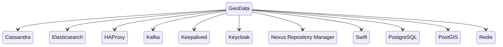

# GeoData 4.0.1 / workflow 4.0.2 — назначение, функции и состав

GeoData — коммерческая low-code платформа ООО «АйТи Гео» (IT Geo) для управления данными, описания и исполнения процессов в нотации BPMN, пространственного анализа, интеграций, создания экранных форм и электронных документов с электронной подписью.

Сайт продукта: https://datageo.ru/

Описание возможностей: https://datageo.ru/platform.html

Руководство администратора: https://docs.datageo.ru/

Версии ниже взяты из опубликованного руководства администратора: прикладные модули — **4.0.1**, модуль `workflow` — **4.0.2**. Публичного перечня более новых выпусков в проверенных источниках нет. Фактические версии и совместимость необходимо сверять с комплектом поставки и письмом поставщика; неизвестные детали в этом документе не заменены предположениями.

---

## Назначение системы

GeoData — слой **сборки процессов, экранных форм и пространственных расчётов** в собственном контуре организации. Аналитик в браузере описывает процесс: например, загрузку данных, обработку заявления или сравнение пространственных контуров. Исполнитель работает с созданными формами, а платформа обращается к настроенным источникам данных и, если это предусмотрено приобретённой поставкой, к готовым адаптерам внешних систем.

Система исполняет созданные в ней модели процессов собственным модулем `workflow`. Состояние своих процессов она хранит в Cassandra, а пространственные операции выполняет с использованием PostgreSQL и PostGIS.

GeoData **не является**:

- общесистемной шиной событий: внутренняя Kafka GeoData обслуживает сам продукт и не подменяет платформенную Kafka;
- Camunda или другим внешним процессным движком;
- озером данных либо эталонным хранилищем клиентских карточек;
- платформенным OpenSearch, PostgreSQL, Swift или иным общим сервисом организации.

Если GeoData используется рядом с Camunda и собственным интеграционным API, владелец архитектуры должен отдельно определить, какая система исполняет конкретный процесс и какая хранит его основное состояние. Иначе появляются два независимых места правды.

---

## Перечень функций

По официальному описанию продукта и опубликованному руководству GeoData предоставляет следующие функции:

1. **Создание процессов без отдельного сервиса на каждый шаг** в модуле аналитика `adminui`: настройка источников, форм, прав, моделей BPMN и команд встроенного языка.
2. **Исполнение процессов** модулем `workflow` версии **4.0.2**. Модель описывает порядок работы, а экземпляр представляет один конкретный запуск, например одну заявку или загрузку.
3. **Рабочее место исполнителя** в модуле `clientui`: экранные формы, действия и документы.
4. **Пространственные расчёты** в модуле `geometry`: операции с контурами, включая пересечения и буферы, с использованием PostgreSQL и PostGIS.
5. **Подключение источников данных**. В руководстве перечислены PostgreSQL, MongoDB, Cassandra, MS SQL, Oracle, Elasticsearch, Kafka и RabbitMQ. На сайте поставщика названы готовые модули ФИАС, Росреестр, СМЭВ 3.0, Яндекс и Почта России; также упомянуты GeoJSON, PBF и DaData. Наличие конкретного адаптера и его версия зависят от комплекта поставки.
6. **Формирование и подписание электронных документов** через модуль `bpmncryptopro` и отдельно лицензируемое средство КриптоПро.
7. **Запуск действий по расписанию и времени** через `timejobexecutor` и `timeeventhandler`.
8. **Сбор статистики исполнения** модулем `statistic` с использованием внутренней Kafka, Elasticsearch и Cassandra.
9. **Хранение файлов документов** в объектном хранилище; в описанной поставщиком конфигурации используется OpenStack Swift.
10. **Аутентификация пользователей** через Keycloak по протоколу OAuth.
11. **Разграничение доступа** к папкам процессов, задачам и формам по пользователю, должности, подразделению и атрибутам.
12. **Перенос моделей процессов между средами** с помощью ZIP-экспорта по официальной методике поставщика.

Надстройка **AI Network** присутствует на сайте поставщика, но не описана в проверенных разделах установки базового состава. Поэтому она не включена в схему ниже. Её состав, лицензирование, использование локальных или внешних моделей и требования к данным нужно уточнять у поставщика.

---

## Основные элементы системы и зависимости

GeoData состоит из прикладных модулей продукта и отдельно работающего базового программного обеспечения. Кроме них на схеме показаны внешние системы, которые не входят в GeoData, но могут участвовать в потоках.

### Схема инстансов и потоков

```mermaid
flowchart TB
  U["B01 · Пользователь<br/>аналитик / исполнитель"]
  ENTRY["B02 · Точка входа<br/>HAProxy 2.4 или Kubernetes Service / Ingress"]

  subgraph APP["Прикладные модули GeoData"]
    ADMIN["B03 · adminui 4.0.1<br/>интерфейс аналитика"]
    CLIENT["B04 · clientui 4.0.1<br/>интерфейс исполнителя"]
    WF["B05 · workflow 4.0.2<br/>исполнение процессов"]
    GEO["B06 · geometry 4.0.1<br/>пространственные расчёты"]
    CRYPT["B07 · bpmncryptopro 4.0.1<br/>электронная подпись"]
    TJE["B08 · timejobexecutor 4.0.1<br/>запуск по расписанию"]
    TEH["B09 · timeeventhandler 4.0.1<br/>события по времени"]
    STAT["B10 · statistic 4.0.1<br/>статистика исполнения"]
  end

  subgraph BASE["Отдельно работающее базовое ПО контура GeoData"]
    CS["B11 · Cassandra 4.1.0<br/>состояние процессов"]
    KF["B12 · Kafka 3.4.0 + ZooKeeper<br/>внутренние сообщения"]
    ES["B13 · Elasticsearch 8.6.2<br/>индексы продукта"]
    PG["B14 · PostgreSQL 15.2 + PostGIS 3.3<br/>пространственные данные"]
    RD["B15 · Redis 7.0.8<br/>кэш"]
    SW["B16 · OpenStack Swift 2.29.2<br/>файлы"]
    KC["B17 · Keycloak<br/>версия требует сверки"]
    NX["B18 · Nexus 3.49.0<br/>реестр образов"]
    HAK["B19 · Keepalived 2.2.4<br/>виртуальный адрес при выбранной схеме"]
  end

  subgraph EXT["Внешние отдельно развёрнутые системы"]
    DS["B20 · Источники и получатели данных<br/>БД / очереди / геосервисы"]
    GOV["B21 · Ведомства и коммерческие сервисы<br/>СМЭВ / Росреестр / ФИАС / Яндекс / DaData / Почта России"]
    CPRO["B22 · КриптоПро<br/>средство электронной подписи"]
    SMTP["B23 · Почтовый сервер<br/>SMTP"]
    NEIGH["B24 · Соседние платформенные системы<br/>Camunda / Kafka / OpenSearch / озеро / интеграционное API"]
  end

  U -->|"HTTPS, обычно 443/TCP"| ENTRY
  ENTRY --> ADMIN
  ENTRY --> CLIENT
  ADMIN -->|"аутентификация; порт выбирается отдельно"| KC
  CLIENT -->|"аутентификация; порт выбирается отдельно"| KC
  ADMIN --> WF
  CLIENT --> WF

  WF -->|"9042/TCP"| CS
  WF -->|"9092/TCP"| KF
  WF -->|"9200/TCP"| ES
  WF -->|"6379/TCP"| RD
  WF -->|"Swift API; порт не зафиксирован"| SW
  WF --> GEO
  GEO -->|"5432/TCP"| PG

  CRYPT --> WF
  CRYPT -.->|"точный интерфейс уточнить"| CPRO
  TJE --> KF
  TEH --> KF
  STAT --> KF
  STAT --> ES
  STAT --> CS

  NX -.->|"образы модулей"| APP
  HAK -.->|"виртуальный адрес, если используется"| ENTRY
  WF -.->|"настроенные адаптеры; протоколы зависят от источника"| DS
  WF -.->|"только приобретённые и настроенные интеграции"| GOV
  WF -.->|"отправитель и порт требуют уточнения"| SMTP
  NEIGH -.->|"соседи, не замена базового ПО GeoData"| WF

  classDef person fill:#F3F4F6,stroke:#4B5563,color:#111827
  classDef product fill:#DCFCE7,stroke:#15803D,color:#14532D
  classDef base fill:#DBEAFE,stroke:#1D4ED8,color:#1E3A8A
  classDef external fill:#FFEDD5,stroke:#C2410C,color:#7C2D12
  class U person
  class ADMIN,CLIENT,WF,GEO,CRYPT,TJE,TEH,STAT product
  class ENTRY,CS,KF,ES,PG,RD,SW,KC,NX,HAK base
  class DS,GOV,CPRO,SMTP,NEIGH external
```

**Легенда:**

- серый блок — человек, работающий с системой;
- зелёный блок — прикладной модуль, входящий в продукт GeoData;
- синий блок — отдельно запущенное базовое или инфраструктурное ПО контура GeoData; оно необходимо выбранной поставке, но не является прикладным модулем GeoData;
- оранжевый блок — внешняя, отдельно развёрнутая система, не входящая в GeoData;
- сплошная стрелка — основной внутренний поток, описанный в имеющихся материалах;
- пунктирная стрелка — поставочный, инфраструктурный или внешний поток, точная реализация которого зависит от конфигурации либо требует подтверждения поставщика.

### Как подробно читать схему

1. Чтение начинается с **B01**. Аналитик или исполнитель открывает веб-интерфейс. Запрос по HTTPS обычно приходит на **B02** по порту **443/TCP**.
2. **B02** направляет запрос в один из двух интерфейсов: **B03** для аналитика или **B04** для исполнителя. Конкретный вариант точки входа — HAProxy, Kubernetes Service или Ingress — зависит от согласованной конфигурации; схема не утверждает, что они используются одновременно.
3. **B03** и **B04** обращаются к **B17 Keycloak** для входа пользователя. Точный HTTPS-порт Keycloak в доступном материале не закреплён и должен определяться конфигурацией поставки.
4. После действий пользователя интерфейсы обращаются к **B05 workflow**. Этот модуль исполняет модель процесса. Он не заменяется Camunda автоматически и не должен делить один процесс с другим движком без отдельного архитектурного решения.
5. **B05** хранит состояние экземпляров процессов в **B11 Cassandra**, обменивается внутренними сообщениями через **B12 Kafka**, использует **B15 Redis** как кэш, обращается к **B13 Elasticsearch** для индексов продукта и к **B16 Swift** для файлов. Стрелки показывают назначение связей, но не полный перечень внутренних вызовов.
6. Когда процессу нужна пространственная операция, **B05** вызывает **B06 geometry**, а тот работает с **B14 PostgreSQL + PostGIS**. Поэтому Cassandra и PostgreSQL/PostGIS на схеме выполняют разные роли.
7. **B08 timejobexecutor** и **B09 timeeventhandler** участвуют в запуске действий по расписанию и обработке временных событий через внутреннюю Kafka. **B10 statistic** использует Kafka, Elasticsearch и Cassandra для статистики исполнения.
8. **B07 bpmncryptopro** — модуль GeoData, а **B22 КриптоПро** — отдельное лицензируемое средство. Пунктир означает, что точный интерфейс между ними в доступном материале не зафиксирован и его нельзя придумывать.
9. **B18 Nexus** хранит образы прикладных модулей. Это поток доставки программных образов, а не пользовательский или бизнес-поток.
10. **B19 Keepalived** может участвовать в предоставлении виртуального адреса совместно с балансировщиками. Его фактическое место зависит от выбранной схемы; наличие в матрице ПО не доказывает обязательность этого потока в каждом варианте.
11. **B20–B23** — внешние системы. Связи с ними появляются только после настройки соответствующего источника, адаптера, электронной подписи или почтового уведомления. Направление, протокол, порт и формат данных зависят от конкретной интеграции.
12. **B24** специально показан как соседний контур. Платформенные Kafka, Camunda, OpenSearch, озеро данных и интеграционное API не являются штатной заменой одноимённых или близких по смыслу зависимостей GeoData. Такая замена возможна только после подтверждения совместимости поставщиком.

### Описание блоков

#### Пользовательский доступ

- **B01 · Пользователь.** Аналитик создаёт и настраивает процессы; исполнитель работает с задачами, формами и документами. Технология доступа — браузер. Это пользователь продукта, а не компонент поставки.
- **B02 · Точка входа.** Принимает HTTPS-запросы и направляет их к интерфейсам. Варианты, названные в материалах: HAProxy либо средства Kubernetes — Service/Ingress. Keepalived может предоставлять виртуальный адрес в схеме с HAProxy. Это отдельная инфраструктура контура, не прикладной модуль GeoData. Какой вариант поддерживается конкретной поставкой, нужно уточнять.

#### Прикладные модули GeoData

- **B03 · `adminui` 4.0.1.** Веб-интерфейс аналитика для настройки источников, форм, прав и моделей процессов. Технологии внутри образа подробно не фиксируются в этом документе. Входит в продукт.
- **B04 · `clientui` 4.0.1.** Веб-интерфейс исполнителя для задач, форм и документов. Входит в продукт.
- **B05 · `workflow` 4.0.2.** Собственный движок исполнения моделей BPMN и команд платформы. Использует хранилища и служебные сообщения контура GeoData. Входит в продукт.
- **B06 · `geometry` 4.0.1.** Выполняет пространственные расчёты и обращается к PostgreSQL/PostGIS. Точный набор операций определяется версией и приобретённой поставкой. Входит в продукт.
- **B07 · `bpmncryptopro` 4.0.1.** Участвует в подписании электронных документов. Работает вместе с отдельно лицензируемым КриптоПро; схема ключей и точный интерфейс не описаны здесь. Модуль входит в продукт, КриптоПро — нет.
- **B08 · `timejobexecutor` 4.0.1.** Запускает предусмотренные моделью действия по расписанию. Входит в продукт.
- **B09 · `timeeventhandler` 4.0.1.** Обрабатывает события времени и постановку последующих действий процесса. Входит в продукт.
- **B10 · `statistic` 4.0.1.** Собирает статистику исполнения и использует внутренние Kafka, Elasticsearch и Cassandra. Входит в продукт.

#### Базовое и инфраструктурное ПО контура GeoData

- **B11 · Cassandra 4.1.0.** Распределённая база данных для состояния процессов GeoData. Клиентский порт в имеющихся материалах — **9042/TCP**; дополнительные межузловые порты здесь не перечислены, потому что полного сетевого контракта поставщик в доступных разделах не дал. Это отдельная система, не модуль GeoData.
- **B12 · Kafka 3.4.0 + ZooKeeper.** Внутренняя система сообщений GeoData. Kafka хранит служебные потоки, ZooKeeper координирует этот выпуск Kafka. Клиентский порт — **9092/TCP**; служебные порты Kafka и ZooKeeper нужно брать из конкретной поставки. Это отдельная система контура и не платформенная Kafka.
- **B13 · Elasticsearch 8.6.2.** Поисковый и индексный сервис продукта, в том числе для задач и статистики. Порт — **9200/TCP**. Это отдельная система, не платформенный OpenSearch.
- **B14 · PostgreSQL 15.2 + PostGIS 3.3.** Реляционная база данных с расширением пространственных типов и операций. Используется модулем `geometry`. Порт — **5432/TCP**. Это отдельная система.
- **B15 · Redis 7.0.8.** Быстрое хранилище временных данных, используемое как кэш. Порт — **6379/TCP**. Это отдельная система.
- **B16 · OpenStack Swift 2.29.2.** Объектное хранилище файлов и документов. Используемый API-порт зависит от конфигурации endpoint и в доступной таблице портов не зафиксирован. Это отдельная система.
- **B17 · Keycloak.** Сервис аутентификации и единого входа. В главе установки упоминается дерево `keycloak-21.1.2`, а в сводной таблице — значение `3.4`; это расхождение необходимо закрыть с поставщиком. Протокол — OAuth, конкретный HTTPS-порт выбирается конфигурацией. Это отдельная система.
- **B18 · Nexus 3.49.0.** Реестр, из которого среда исполнения получает контейнерные образы модулей. Допустимость другого совместимого реестра не подтверждена и требует согласования. Это отдельная инфраструктурная система.
- **B19 · Keepalived 2.2.4.** Средство предоставления виртуального IP-адреса в конфигурациях с несколькими балансировщиками. Входит в матрицу базового ПО, но необходимость конкретного инстанса зависит от выбранной схемы. Это отдельная инфраструктурная система.

#### Внешние отдельно развёрнутые системы

- **B20 · Источники и получатели данных.** Возможные технологии: PostgreSQL, MongoDB, Cassandra, MS SQL, Oracle, Elasticsearch, Kafka, RabbitMQ, REST, GeoJSON и PBF. Они дают или принимают данные. Не входят в GeoData; фактический перечень, протоколы и порты определяются настройкой интеграции.
- **B21 · Ведомства и коммерческие сервисы.** В официальном описании названы ФИАС, Росреестр, СМЭВ 3.0, Яндекс, DaData и Почта России. GeoData может работать с ними через приобретённые и настроенные адаптеры. Сами ведомственные и коммерческие системы в продукт не входят. Наличие адаптера нельзя считать подтверждением доступа к промышленному контуру.
- **B22 · КриптоПро.** Отдельно лицензируемое средство электронной подписи и работы с ключами. Нужно для юридически значимой подписи, если она входит в сценарий. Не входит в GeoData как самостоятельная система; комплектность лицензий уточняется договором.
- **B23 · Почтовый сервер.** Внешняя система отправки уведомлений по SMTP. Не входит в GeoData. Какой модуль выступает отправителем, какой порт и какой режим защиты используются, определяется настройками поставки.
- **B24 · Соседние платформенные системы.** Camunda, платформенная Kafka, OpenSearch, озеро данных и интеграционное API решают общеплатформенные задачи. Они не входят в GeoData и не подменяют её штатное базовое ПО без письменного подтверждения поставщика.

### Порты: сетевой контракт верхнего уровня

Полной официальной таблицы всех портов GeoData в проверенных разделах нет. Ниже сохранены только вход и клиентские порты, зафиксированные в имеющихся материалах. Служебные межузловые порты, адреса и режимы шифрования необходимо сверять с руководством именно приобретённой поставки.

| Порт или вход | Назначение | Кому требуется доступ |
|---|---|---|
| **443/TCP** | HTTPS интерфейсов `adminui` и `clientui` | Пользователям и системе единого входа через точку входа; открытие в интернет само по себе не требуется |
| **Keycloak: выбранный HTTPS-порт** | Вход пользователей | Интерфейсам и браузерам; точное значение зависит от конфигурации |
| **9042/TCP** и служебные порты Cassandra | Состояние процессов | Прикладным модулям и узлам Cassandra |
| **9092/TCP** и служебные порты Kafka/ZooKeeper | Внутренние сообщения GeoData | Модулям GeoData и узлам именно внутреннего кластера |
| **9200/TCP** | Elasticsearch API | Модулям `workflow` и `statistic` согласно имеющейся схеме |
| **5432/TCP** | PostgreSQL/PostGIS | Модулю `geometry` |
| **6379/TCP** | Redis | Прикладным модулям GeoData согласно конфигурации |
| **Swift API: порт endpoint не зафиксирован** | Файлы документов | Модулям файлового контура GeoData |
| **SMTP: порт не зафиксирован** | Почтовые уведомления | Модулю-отправителю; точный клиент требует уточнения |

Порты внешних ведомств, коммерческих API и пользовательских источников в эту таблицу не включены: они зависят от реально выбранной интеграции. Значения нельзя назначать по аналогии.

---

## Глоссарий

- **Адаптер** — программный компонент, который преобразует вызовы и данные между GeoData и конкретной внешней системой.
- **API** — формальный программный интерфейс, через который одна система вызывает другую.
- **Backend** — серверная часть системы, выполняющая логику и работающая с данными.
- **BPMN 2.0** — стандарт графического описания бизнес-процессов.
- **Брокер Kafka** — отдельный сервер Kafka, принимающий и хранящий сообщения.
- **Буфер геометрии** — область заданной ширины вокруг пространственного объекта.
- **Виртуальный IP-адрес** — адрес, который может переключаться между несколькими серверами и не привязан навсегда к одному из них.
- **Геосервис** — внешний сетевой сервис, предоставляющий пространственные данные или операции.
- **GeoJSON** — текстовый формат JSON для представления географических объектов.
- **Движок процессов** — программа, которая читает модель процесса и исполняет её шаги.
- **Единый вход** — механизм, позволяющий пользователю проходить аутентификацию через общий сервис учётных записей.
- **Индекс Elasticsearch** — структура хранения, подготовленная для быстрого поиска.
- **Ingress** — объект Kubernetes, задающий правила входящего HTTP/HTTPS-трафика к сервисам.
- **Инстанс** — отдельно запущенный экземпляр программы или сервиса.
- **Интерфейс, UI** — видимая пользователю часть программы.
- **Кэш** — временное быстрое хранилище данных; он не должен автоматически считаться эталонным источником.
- **Контейнер** — изолированно запускаемый пакет приложения и его зависимостей.
- **Контур** — логически и сетево отделённая группа систем, например тестовая или промышленная.
- **Low-code** — подход, при котором значительная часть логики создаётся визуальной настройкой и готовыми командами, а не отдельным программным кодом.
- **Место правды** — система, чьё состояние считается основным при расхождении копий.
- **Модель процесса** — описание шагов и правил; **экземпляр процесса** — один конкретный запуск этой модели.
- **OAuth** — протокол выдачи приложению ограниченного доступа от имени пользователя; в этой схеме применяется для входа через Keycloak.
- **Образ контейнера** — неизменяемый пакет программы, из которого запускаются контейнеры.
- **Объектное хранилище** — сервис, сохраняющий файлы как объекты и предоставляющий доступ к ним через API.
- **On-premise** — размещение программного продукта в инфраструктуре самой организации.
- **Партиция Kafka** — часть топика, позволяющая хранить и обрабатывать сообщения параллельно.
- **PBF** — компактный двоичный формат Protocol Buffers; в геоданных часто используется для крупных наборов объектов.
- **Pod, под** — минимальная запускаемая единица Kubernetes, содержащая один или несколько контейнеров.
- **PostGIS** — расширение PostgreSQL для хранения пространственных данных и выполнения геометрических операций.
- **Реестр образов** — сервис хранения и выдачи контейнерных образов; на схеме эту роль выполняет Nexus.
- **REST** — распространённый стиль HTTP API для работы с ресурсами.
- **Service Kubernetes** — стабильная сетевая точка доступа к группе подов.
- **SMTP** — сетевой протокол отправки электронной почты.
- **TCP** — транспортный сетевой протокол; номер TCP-порта определяет сетевую точку входа программы.
- **Топик Kafka** — именованный поток сообщений.
- **ФИАС** — федеральная информационная адресная система.
- **СМЭВ 3.0** — государственная система межведомственного электронного взаимодействия версии 3.
- **Электронная подпись, ЭП** — криптографический реквизит электронного документа, позволяющий проверить подписанта и целостность документа.
- **Endpoint** — конкретный сетевой адрес API, включая протокол, имя узла и порт.
- **HTTPS** — HTTP с шифрованием канала; обычно использует TCP-порт 443.
- **Kubernetes** — система запуска и управления контейнерными приложениями.
- **ZooKeeper** — сервис координации, используемый указанной версией внутренней Kafka GeoData.
- **ZIP-экспорт** — переносимый архив с моделью процесса по методике поставщика.

---

## Источники и границы подтверждения

- Руководство администратора: https://docs.datageo.ru/
- Официальное описание платформы и функций: https://datageo.ru/platform.html
- Сайт продукта: https://datageo.ru/
- Сайт вендора: https://www.it-geo.ru/

Портал руководства публикует разделы через веб-интерфейс без устойчивых глубоких URL в доступном представлении, поэтому ссылка дана на корень официального руководства. Версии компонентов, полный сетевой контракт, состав приобретённых адаптеров и расхождение версии Keycloak необходимо сверять с конкретным дистрибутивом и официальным ответом поставщика. Утверждений о неизвестных протоколах, портах и заменяемости базового ПО в документ не добавлено.
