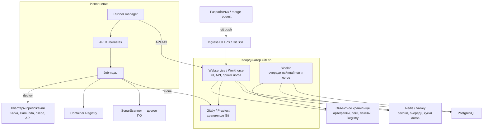

# GitLab CI/CD 19.3.0 — развёртывание и настройка

GitLab CI/CD — встроенный конвейер поставки: файл `.gitlab-ci.yml` в репозитории описывает, *что* собрать, протестировать и выкатить. Отдельного продукта «поставить только CI» нет. Без инстанса GitLab (репозитории, очередь работ, артефакты, API) агент сборки (Runner) не к чему регистрироваться. Этот документ покрывает **два контура**, которые вместе и есть GitLab CI: координатор (GitLab) и исполнители (Runner).

Это **не** шина событий (Kafka), **не** процессный движок (Camunda) и не «кнопка DevOps включена».

Версия координатора: **GitLab 19.3.0** (minor-релиз 20 августа 2026).  
Версия агента сборки: **GitLab Runner 19.3.0** (выходит в тот же день).  
Helm GitLab (сам инстанс на Kubernetes): чарт **`gitlab/gitlab` 10.3.0** → GitLab **19.3.0**.  
Helm Runner: чарт **`gitlab/gitlab-runner`**, версия чарта **не равна** версии Runner. На дату документа в репозитории виден тег `v0.91.0` (16 июля 2026, линия 19.2). Чарт под Runner **19.3.0** нужно снять командой `helm search repo -l gitlab/gitlab-runner` и пинить по колонке **APP VERSION = 19.3.0**, не по «последнему тегу, который запомнили».

Документация CI: https://docs.gitlab.com/ci/  
Runner: https://docs.gitlab.com/runner/  
Референс-архитектуры: https://docs.gitlab.com/administration/reference_architectures/  
Чарт GitLab: https://docs.gitlab.com/charts/

Политика поддержки на дату документа: **19.3** — bug + security; **19.2** и **19.1** — security. Критический патч GraphQL 17 августа 2026 закрыт в **19.2.4 / 19.1.6 / 19.0.8 / 18.11.11**; 19.3.0 вышел позже (20 августа). Патчи 19.3.x ставить по мере выхода, не замирать на `.0`, если появился security-патч.

Ядро CI (координатор + Runner) живёт в Free. **Межплощадочное восстановление инстанса штатно — это Geo, и это Premium/Ultimate.** Без Premium честный запас координатора = бэкап + restore.

Этот текст — не набор команд «скопируй `.gitlab-ci.yml`», а правила, без которых система не будет одновременно устойчивой к сбоям, масштабируемой и безопасной. Пошаговая установка — в `GitLab CI.install.md`.

---

## Назначение системы

GitLab CI нужен, чтобы **поставлять код одинаковым конвейером**: merge-request запускает сборку, тесты, Quality Gate, сборку образа и выкладку. Без конвейера выкладка — ручной риск: «на стенде собралось, в бой скопировали образ».

Система хранит Git-репозитории, метаданные пайплайнов, логи и артефакты сборок. Она **не** держит runtime Kafka и Camunda. Падение GitLab **не должно** ронять уже работающие сервисы. Падение GitLab **должно** быть заложено в процесс: либо поставка встаёт, либо (хуже) люди катят в обход.

Честные роли: поставка микросервисов и манифестов; качество до выкладки (сканер SonarQube живёт **в работе CI**, не внутри GitLab); сборка образов в закрытый реестр. Нечестная роль: «CI переживёт два дата-центра, потому что Runner в Kubernetes». Runner без живого GitLab, хранилища Git и бакета — очередь серых `pending`.

---

## Перечень функций

Что умеет self-managed GitLab CI/CD (по документации поставщика):

1. **Принимать push и merge-request**, создавать pipeline (прогон по событию) и отдавать работы (jobs) агентам Runner. Один job = как правило один под Kubernetes при kubernetes-executor.
2. **Хранить Git** через Gitaly. Работа **клонирует** код отсюда. Упал Gitaly — CI не из чего собирать. Несколько копий репозитория и автоfailover — Gitaly Cluster (Praefect) на виртуальных машинах; в Kubernetes вендор кладёт **шарды** (каждый репозиторий на одном Gitaly), Praefect в Kubernetes — **beta**.
3. **Исполнять `.gitlab-ci.yml`**: стадии (`build` → `test` → `deploy`), правила, теги Runner (ярлык пула), protected Runner (только защищённые ветки — чтобы секреты боя не утекли из merge-request с форка).
4. **Сохранять артефакты и логи.** На боевом мультинодовом GitLab это **объектное хранилище**, не диск пода. Без incremental logging (куски лога в Redis → объектное хранилище) лог может потеряться, если его принял один Rails, а фоновые задачи живут на другом.
5. **Кэшировать зависимости** между работами. На нескольких Runner без distributed cache (S3) кэш «прилипает» к одному менеджеру и не шарится.
6. **Отдавать Container Registry**, пакеты, LFS — тоже через объектное хранилище.
7. **Масштабировать вход** (Webservice / Workhorse) горизонтально и фоновые очереди (Sidekiq) отдельными воркерами под CI.
8. **Регистрировать Runner** современным токеном `glrt-`. Старый registration token deprecated, снятие запланировано на **GitLab 20.0**.
9. **Копировать инстанс на вторую площадку** (Geo): реплика «на чтение» + ручной failover. Это **Premium/Ultimate**, не Free. Для нескольких **регионов**, не замена Gitaly Cluster.

Чего система **не** делает и часто путают: она не шина бизнес-событий, не BPMN, не озеро эталона, не Active/Active GitLab на три дата-центра, не Redis Cluster «потому что HA» (Redis Cluster **не поддерживается**, в том числе для incremental logging). Zero-downtime upgrade Cloud Native Hybrid *not supported*. Сборка образов «из коробки» через Docker-in-Docker почти всегда требует privileged — поставщик прямо: это снимает изоляцию контейнера. Kaniko Google архивирован 3 июня 2025 — в новый бой как стратегию не закладывать; замена в доке GitLab — BuildKit rootless. Реплики Gitaly не заменяют бэкап: Praefect спасает от падения **ноды**, не от `git push --force` и не от гибели всех копий + бакета.

---

## Требования к развёртыванию

### Требования к ПО

| Что | Что ставить | Комментарий |
|---|---|---|
| **Формат поставки координатора** | Kubernetes (Cloud Native Hybrid) **или** пакет Linux (Omnibus) для учёбы и для машин Gitaly | Бой: Helm **`gitlab/gitlab` 10.3.0**. Встроенные в чарт PostgreSQL / Redis / MinIO — для PoC. Цитата чарта: *The default Helm chart configuration is not intended for production.* |
| **Формат поставки Runner** | Контейнеры, чарт **`gitlab/gitlab-runner`**, executor **kubernetes** | Совместимость: Runner не старше GitLab **более чем на одну major**; целевой пин — **та же minor 19.3**. Встроенный runner чарта GitLab (`gitlab-runner.install` default **true**) в бою выключают или жёстко конфигурируют. |
| **Kubernetes** | Дистрибутив, удовлетворяющий prerequisites чарта | Поведение CSI/CNI — **вне** поддержки GitLab. Совместимость 10.3.0 с вашей версией Kubernetes смотреть на момент установки. |
| **ОС координатора / Gitaly** | Linux x86_64 | **Боевой Gitaly на Windows-хосте в схеме с Kubernetes не предполагается.** Swap в референс-архитектурах **не рекомендуется**. |
| **PostgreSQL** | Внешний в бою | Версию смотреть в *installation requirements* выбранного 19.3, не из памяти «всегда 14». HA writer — ваша. GitLab базу не кластеризует. |
| **Redis или Valkey** | Standalone + Sentinel (HA) | **Redis Cluster не поддерживается.** Serverless-варианты поставщик **не** поддерживает. В референсах Cloud Native — **два** инстанса: cache и persistent (разная политика вытеснения). |
| **Диск Gitaly** | Предсказуемый IOPS, не burstable «по кредитам» | NFS как диск репозиториев в бою — путь страдания. Объектное хранилище — для артефактов, не замена Git. `emptyDir` = потеря репозиториев при рестарте. |
| **Объектное хранилище** | S3-совместимое с HA | Для распределённого GitLab **обязателен**: артефакты, логи, LFS, пакеты, часто Registry. |
| **Сеть HA** | Задержка **< 5 мс** | Цитата: *Network latency should be as low as possible … Generally this should be lower than 5 ms.* Один environment **между регионами** не поддерживается. Support по инфраструктуре multi-DC: *generally at your own risk*. Praefect: *ideally single-digit milliseconds*, *single location*. |
| **Сборка образов в бою** | BuildKit rootless | Без privileged DinD на общем пуле. Если DinD всё же нужен — изолированный пул, не ноды Kafka/Camunda. |
| **Редакция** | Free достаточен для ядра CI; Geo — Premium/Ultimate | Без Premium межплощадочный DR координатора = бэкап + restore. |

### Требования к ресурсам

Цифр «сколько ядер на ваши репозитории» у проекта **нет** — нагрузки и RPS в исходном запросе не было. Ниже ориентиры референс-архитектур поставщика, не смета закупки. Поставщик **сайзит координатор по RPS** (запросов в секунду к GitLab), не по «терабайтам озера».

| Размер референса | Целевой RPS | CI в формулировке поставщика | Что уже рисует вендор для Cloud Native |
|---|---|---|---|
| **S** | ≤ **100** | Лёгкое параллельное исполнение пайплайнов; **not suitable for actively used monorepos** | Webservice **6–9** подов, Sidekiq **8–12**, Gitaly **3** шарда без автоскейла |
| **M** | ≤ **200** | Умеренная конкурентность пайплайнов | См. таблицу референса |
| **L** | ≤ **500** | Тяжёлое использование CI при правильном масштабе Sidekiq | См. таблицу референса |
| **XL** | ≤ **1000** | Интенсивное | См. таблицу референса |

Дополнительно:

- Linux-package HA «с завода» поставщик в целом рекомендует от **~60 RPS / 3000 users**. Меньше — часто дешевле **бэкап**, чем полный HA. Ожидание непрерывной поставки + несколько дата-центров — аргумент **за HA координатора**, даже если людей меньше 3000. Это продуктовое решение, не формула.
- Дефолт `concurrent` (сколько работ один Runner manager готов вести сразу) в чарте GitLab для встроенного runner: **20**. Это не ёмкость кластера.
- Praefect, отказ одной ноды: RPO поставщика *less than 1 minute* (асинхронная реплика записи); RTO *less than 10 seconds* при 10 неудачных health check.
- Дефолтный `helm install` с bundled Postgres — **не** размер S.
- Полный clone монорепозитория на каждую работу насыщает канал. Лечится shallow clone и LFS, не «ещё один брокер Kafka».

---

## Основные элементы системы и зависимости

Это одно ПО из **нескольких процессов**. Ниже — те, что живут отдельными инстансами, и как они вызывают друг друга.

### Схема инстансов и потоков

Как читать схему:

1. Человек пушит код. GitLab создаёт pipeline и кладёт работы в очередь. Runner manager **спрашивает** API «есть работа?» и создаёт эфемерный под на каждую работу.
2. **Webservice / Workhorse** — HTTP API и UI. Снаружи обычно виден Workhorse, не «голый» Puma. Несколько подов за балансировщиком. Алгоритм балансировщика в референсах: **least connections**, не round-robin.
3. **Sidekiq** — фоновые задачи: архивация логов, пайплайны, почта, Geo. Очередь CI без живого Sidekiq деградирует. UI может быть жив, архив логов — нет.
4. **Gitaly** хранит Git. В боевом Hybrid вендор указывает **Praefect на VM** (копии репозитория, автоfailover). Шард в Kubernetes = точка отказа **своих** репозиториев.
5. **PostgreSQL и Redis** — снаружи. Redis Cluster нельзя. Incremental logging включён **до** второго Rails.
6. **Объектное хранилище** переживает тот же отказ, что вы обещаете CI. Бакет «только диск первой площадки» = артефакты умрут вместе с ней.
7. Job-под клонирует код, гоняет тесты и сканер, собирает образ (BuildKit rootless → Registry), выкладывает в кластеры приложений. Рантайм 24/7 CI собирает, но не заменяет.

Рядом, но это уже другое ПО: SonarQube, Vault, ваш Registry, Ingress. Их отказ проектируется отдельно.

### Что входит в состав

| Роль | Зачем | Как масштабируется |
|---|---|---|
| **Webservice / Workhorse** | UI, API, приём логов Runner, git HTTP | Горизонтально: больше подов. HPA в Cloud Native |
| **Sidekiq** | Очереди: архив логов, пайплайны, крючки | Больше worker'ов; отдельные очереди под CI при нагрузке |
| **Gitaly** | Git, из которого работа клонирует код | Вертикаль диска/CPU; HA git = **Praefect на VM**, не «ещё один Deployment» |
| **PostgreSQL** | Метаданные проектов, пайплайнов, работ | Своя HA. GitLab базу не кластеризует |
| **Redis / Valkey** | Сессии, Sidekiq, куски incremental logs | **Standalone + Sentinel**. **Redis Cluster не поддерживается** |
| **Object storage** | Артефакты, логи после архива, LFS, пакеты, Registry | Ёмкость и HA бакета, не подов GitLab |
| **Runner manager** | Забрать работу, создать под, вернуть статус | Несколько менеджеров; `concurrent`; отдельные пулы по тегам |
| **Job-под** | Исполнение `.gitlab-ci.yml` | Горизонтально: ноды Kubernetes + лимиты namespace |

Редакции — это не «тариф UI»:

| Нужно | Free / CE | Premium | Ultimate |
|---|---|---|---|
| Сам CI/CD, Runner, kubernetes-executor, артефакты | да | да | да |
| Gitaly Cluster (Praefect) как **фича** | да (tier Free) | да | да |
| Техподдержка Praefect у GitLab Support | ограничена | да | да |
| **Geo** (вторая площадка, DR инстанса) | **нет** | да | да |
| Merge trains, часть «больших» CI-фич | нет / урезанно | да | да |

### Порты (контракт сети)

| Порт (default Linux package) | Назначение | Кому открывать |
|---|---|---|
| **443 / 80** | HTTPS/HTTP UI и API (сюда же Runner) | Внутренняя сеть / прокси единого входа. Не мир без TLS и IdP |
| **22** | Git SSH | Разработчики и job-поды, не мир без нужды |
| **8075** (TLS **9999**) | Gitaly | Только координатор и Praefect |
| **2305** (TLS **3305**) | Praefect | Только Gitaly и координатор |
| **5432** | PostgreSQL | Только координатор |
| **6379** | Redis; Sentinel **26379** | Только координатор |
| **5050 / 5000** | Container Registry | Job-поды и разработчики, не анонимный push |
| **8150** | GitLab Agent for Kubernetes (KAS) | Если включили. Это **не** Runner |
| **8080 / 8181** | внутренние Puma / Workhorse в пакете | Снаружи обычно не торчат |
| **6443** | API Kubernetes | Runner manager создаёт job-поды |

Runner с kubernetes-executor ходит: **к API GitLab (443)** и **к API Kubernetes**. Job-под ходит: clone (443/22), объектное хранилище, Registry, ваши сервисы по NetworkPolicy.

### Зависимости окружения (что ещё должно быть)

- Внешние PostgreSQL и Redis/Valkey; S3-совместимый бакет с HA.
- Ingress/LB **свой** перед HTTPS; корпоративный CA на Runner'ах (иначе clone и Registry не доверят сертификату).
- Образы сборки в **вашем** registry (не «всегда тянуть с Docker Hub в закрытый контур»).
- Стабильный DNS до Gitaly на 8075; клиентам — до VIP 443.

---

## Краткие вводные

### Как устроена отказоустойчивость

Три разных контура. Путать их — главная ошибка.

**1) Исполнение работ (Runner)**

| Что падает | Что происходит |
|---|---|
| Один job-под | Эта работа красная; retry; остальные Runner'ы живы |
| Один Runner manager из нескольких | `concurrent` этого менеджера пропал; другие менеджеры продолжают спрашивать API |
| Весь дата-центр с job-подами | Работы **в полёте на этой площадке** погибли. Новые работы могут взять менеджеры в живых площадках, **если** координатор жив |
| Все Runner'ы | Пайплайны в `pending`. Код в Git целый |

Эфемерный kubernetes-executor — сильное место: нет «грязной VM, на которой вчерашняя работа оставила malware». Слабое: без resource requests работы съедят ноды приложений.

**2) Координатор (GitLab)**

| Что падает | Что происходит |
|---|---|
| Один под Webservice из нескольких | Балансировщик уводит трафик; Runner переподключается |
| Sidekiq | UI может быть жив, архив логов и часть пайплайнов — нет |
| PostgreSQL writer | Инстанс «глухой». Реплика read-only GitLab как живой primary **не** заменяет штатный failover базы |
| Redis | Сессии, Sidekiq, куски incremental log. Это не кэш «можно прогреть» |
| Object storage | Нет устойчивых артефактов/логов в мультиноде; Registry/LFS |
| Один sharded Gitaly | Репозитории **этого** шарда недоступны; CI этих проектов не клонирует |
| Praefect: 1 Gitaly из 3 (replication factor 3, одна площадка) | Автоfailover; RPO/RTO одной ноды — см. таблицу ресурсов |
| Весь кластер Gitaly / площадка, где лежали все копии | Git нет. Нужен бэкап официальными Rake, не snapshot одной ноды Praefect |

**3) Площадки**

Gitaly Cluster официально: **несколько нод, одна location**, задержка *< 1 с, ideally ms*. Geo: **несколько location**, задержка *up to one minute*, failover **ручной**, консистентность eventual, покрывает **весь** инстанс.

Следствие: «размазать один Praefect на три дата-центра с неизвестной задержкой» **не** следует из гайда. «Поднять Geo на вторую площадку» — штатный запас, но это **Premium** и не Active/Active.

### Как устроено масштабирование

Несколько независимых осей:

1. **Больше параллельных пайплайнов** → больше **Runner managers** + `concurrent` + **ноды Kubernetes** под job-поды + Quota. Это главная ось CI. Координатор при этом может быть ещё «маленьким».
2. **Больше клонов больших репозиториев** → Gitaly CPU/диск/сеть. Поставщик отдельно предупреждает: *Hundreds of concurrent CI jobs for large repositories* — дополнительная нагрузка сверх таблиц RPS.
3. **Больше UI/API/MR** → Webservice (HPA), PostgreSQL, Redis cache.
4. **Больше артефактов и логов** → объектное хранилище + retention (`expire_in` в YAML + админские TTL) + Sidekiq delete workers. Терабайты озера сюда **не** попадают сами — попадают zip'ы работ, которые вы не чистите.
5. **Sidekiq CI** → отдельные процессы/поды под тяжёлые очереди, если общий Sidekiq забит архивацией логов.

HPA Webservice не лечит монорепозиторий.

### Безопасность самого GitLab CI

Компрометация CI в контуре с госинтеграциями = компрометация **исходников интеграционного API, секретов выкладки, образов, карты сервисов**. Токен Runner и `CI_JOB_TOKEN` — ключи к этому.

Официально и практически:

- **Registration token** (legacy) позволяет зарегистрировать **любой** Runner, кто его украл. Переход на **`glrt-`**. Снятие legacy — план **20.0**.
- **Privileged / DinD:** *By enabling privileged mode, you are effectively disabling all the container’s security mechanisms*. Если без privileged нельзя — изолированные эфемерные VM и **protected** Runner только на protected-ветки, не общий пул merge-request.
- **Shell executor** на общей машине — работы видят друг друга. Для боя микросервисов не ваш путь.
- **`CI_JOB_TOKEN`:** маскируется в логах, живёт пока работа. Включайте **ограничение scope** (allowlist проектов).
- Переменные: секреты боя — **Protected + Masked**, лучше Vault по короткоживущим учёткам, не вечный ключ в UI.
- Shared runner на всём инстансе + Developer может запустить произвольный `script:` = чужой код на ваших нодах. Для закрытого контура: отдельные пулы `build` / `prod-deploy`, NetworkPolicy, Restricted на job-namespace (privileged пул — отдельный namespace и ноды).
- Helm GitLab по умолчанию ставит **вложенный** `gitlab-runner`. На бою его либо жёстко конфигурируют, либо выключают и ставят отдельный чарт.

«Открыли LoadBalancer GitLab в интернет, DinD privileged, registration token в Confluence» — это новая поверхность атаки, не платформа поставки.

---

## Допущения

Ниже то, чего не было в исходном запросе, но без чего нельзя нарисовать конкретную схему. Если допущение неверно — схему надо пересмотреть.

1. Берём **self-managed GitLab**, не GitLab.com и не Dedicated. Три своих дата-центра SaaS поставщика не заменяют.
2. Бой координатора — **Cloud Native Hybrid:** Webservice/Sidekiq в Kubernetes; **Gitaly Cluster (Praefect) на VM**; PostgreSQL, Redis, объектное хранилище — внешние.
3. Бой Runner — kubernetes-executor, официальный чарт `gitlab/gitlab-runner`, менеджеры в Kubernetes. Пин — **та же minor 19.3**.
4. Версия — **19.3.0 + патчи линии 19.3.** Не 18.x «потому что привыкли». Не `latest` без пина.
5. Сборка образов в бою — **без privileged DinD на общем пуле.** Путь: BuildKit rootless. Kaniko Google **не** использовать как стратегический инструмент.
6. Три дата-центра = три зоны отказа в одном городе / одном region. Один GitLab environment **между регионами** поставщик не поддерживает.
7. Цель отказа координатора: пережить 1 дата-центр только если сеть и кворум PG/Redis/Praefect это позволяют **и** объектное хранилище не умерло вместе с этой площадкой. Цель «пережить 2 из 3» **не** обещать.
8. Пока задержку не измерили, stretch Praefect/Patroni/Redis на три площадки — гипотеза, не план. Если RTT ≥ 5 мс — координатор в 1–2 площадках, третья: Runner + (если Premium) Geo secondary.
9. Geo в базовый Free-план не входит. Если лицензии Premium нет, DR инстанса = бэкапы Gitaly/PG/бакета + прогон restore.
10. Нагрузки и RPS нет — нет цифры «N webservice и M concurrent». Есть сигналы (pending jobs, очередь Sidekiq, CPU Gitaly, latency 443, saturating clone) и рычаги.
11. Формального SLA на CI нет. Политика: блокирует ли мёртвый GitLab выкладку.
12. Учебный стенд изолирован. На нём допустимы Omnibus all-in-one и bundled chart. В бой их не копируем.
13. Kafka, Camunda, озеро, интеграционное API — **репозитории и runtime**, не HA-зависимости GitLab. Работы не должны иметь NetworkPolicy «весь кластер».
14. SonarQube, Vault, Registry — соседние платформенные сервисы. Сканер и секреты живут в работах, не внутри процесса Runner.
15. Zero-downtime upgrade Hybrid не используем как обещание. Окно выката координатора закладываем.
16. Шифрование канала — обычный TLS. Требования отдельной криптографии государством не озвучены.

---

## Критически важные условия, которых нет в исходном контексте

Их нужно закрыть **до** «helm install gitlab и забыли».

| Пробел | Почему это ломает решение |
|---|---|
| **Задержка и потери между дата-центрами** (p50/p95/p99), отдельно до PostgreSQL, Redis, Gitaly **8075**, объектного хранилища | Поставщик: HA sync **< 5 мс**. Praefect — миллисекунды, одна location. Без замера схема «три площадки = три зоны» — лотерея |
| **Один Kubernetes на три площадки или три кластера** | Runner может быть в каждом кластере. Координатор и Praefect — нет |
| **Где writer PostgreSQL, Redis primary, бакет артефактов** | Падение площадки с writer/бакетом = падение CI, сколько ни плодь Runner'ов |
| **Редакция (Free vs Premium) и нужен ли Geo** | Без Geo нет штатного межплощадочного DR инстанса |
| **Профиль CI:** монорепозиторий или 30 мелких; сколько параллельных работ; полный clone vs fetch; размер артефактов | Таблица RPS «пользователи» врёт, если каждый MR клонирует гигабайты |
| **Где собирать образы** | Privileged на общих worker-нодах приложений = вы отдаёте root ноды любому `script:` |
| **Политика при недоступном GitLab / красном pipeline** | Не спроектировали — в инциденте либо встанет релизный поезд, либо все катят руками |
| **Куда смотрит UI/API** | Публичный 443 + слабый root + открытая регистрация Runner — инцидент |
| **Персональные данные в логах и артефактах** | Job log и cache легко уносят токены и куски персональных данных из фикстур |
| **Нужен ли Container Registry / KAS** | Это дополнительные порты, бакеты и RBAC, не «включено само» |
| **Совместимость чарта 10.3.0 с вашей версией Kubernetes** | Смотреть prerequisites чарта на момент установки |

---

## Краткое описание ключевых этапов и элементов развертывания

Общий каркас (и тест, и бой):

1. Зафиксировать **GitLab 19.3.x** и **Runner 19.3.x**, чарт GitLab **10.3.x**, чарт Runner по APP VERSION 19.3.x. Не смешивать major.
2. Сначала **PostgreSQL + Redis + бакет**, потом GitLab, потом Runner. Обратный порядок даёт «UI есть, работы pending / артефакты на emptyDir».
3. Выпустить **свои** пароли root, токены `glrt-`, ключи объектного хранилища, сертификаты **до** первого боевого проекта.
4. Прогнать **один** репозиторий: pipeline зелёный, лог виден после завершения работы, артефакт скачивается, образ (если есть) в Registry.
5. Включить метрики: pending jobs, `ci_running_builds`, очередь Sidekiq, latency clone, диск Gitaly, 5xx Workhorse.
6. Только потом — защищённые ветки, раздельные пулы Runner, Vault, блок merge по Quality Gate.

Боевая схема на несколько дата-центров — в `GitLab CI.install.md`. Ниже — только учебный стенд.

---

### 1 инстанс: тестовый стенд, 1 площадка, без нагрузки

**Цель стенда:** чтобы команда написала `.gitlab-ci.yml`, увидела работу в UI, поняла теги Runner и kubernetes-executor. **Не** цель: доказать отказ дата-центра и ёмкость «сотни параллельных сборок».

Два официальных минимальных пути (выберите один):

**Путь A — Omnibus на одной виртуальной машине** (быстрее понять продукт):

- Пакет GitLab CE или EE, один хост, встроенные PostgreSQL/Redis.
- HTTPS хотя бы с внутренним CA, не оставлять HTTP, если стенд маршрутизируется дальше localhost.
- Один Runner: `docker` или `kubernetes` executor на тот же/соседний хост.
- Токен **`glrt-`**, не registration token «на будущее в бой».

**Путь B — Helm `gitlab/gitlab` 10.3.0 как PoC** — ближе к оркестратору, **опаснее привычкой**:

- Поставщик прямо: дефолтный чарт — **не бой** (bundled Postgres/Redis/MinIO).
- Для стенда на неделю допустимо; если стенд живёт месяцами — вынести Postgres/Redis/бакет сразу.
- Встроенный `gitlab-runner` чарта можно оставить на тесте, понимая, что в бою его пересоберёте.
- `privileged: false`. Сборку образа на тесте — BuildKit rootless или вообще «работа echo hello», чтобы не учить DinD как норму.

Режим «Praefect на 3 VM + Geo» для знакомства с YAML **не нужен**.

#### Что сознательно упрощаем

| Параметр | На тесте | Почему можно |
|---|---|---|
| Praefect / Geo | нет | Нет требования пережить узел git |
| Внешний Redis Sentinel | часто нет | Один процесс Redis на Omnibus |
| Incremental logging | можно не трогать на одном узле | Нет второго Rails |
| HPA Webservice | выкл | Нет RPS |
| Несколько Runner managers | 1 | Нет очереди |
| Restricted на job-namespace | желательно, но не блокер дня 1 | Иначе команда утонет в политиках раньше YAML |
| Единый вход | локальные пользователи | На тесте важнее контур работы |

#### Чего на тесте **не** стоит упрощать

- HTTPS и свой пароль `root` (не `5iveL!fe` из старых гайдов, если до стенда есть сеть).
- Регистрация Runner через **`glrt-`**.
- Хотя бы одна работа **реального** сервиса, не только `echo`.
- Понимание: **Runner ≠ GitLab**. Убитый Runner оставляет UI живым и пайплайны серыми.
- `privileged: false` как дефолт.
- Запомнить: зелёный pipeline на одном Omnibus **не** доказывает Hybrid, Praefect и задержку между площадками.

#### Сильные стороны такой схемы

- Поднимается за часы.
- Совпадает с Try GitLab / chart PoC.
- Дёшево показывает, как 30 репозиториев превратятся в 30 YAML и в очередь работ.

#### Слабые стороны (обязательно понимать)

- Нет модели отказа площадки, нет HA объектного хранилища, нет Praefect.
- Bundled MinIO/Postgres в чарте приучают «данные живут в кластере как у приложения».
- Shared runner без тегов на тесте легко уезжает в бой «как было».
- Успех `hello world` **не** доказывает clone монорепозитория 20 ГиБ × N работ.

Практическая рекомендация: препрод = маленький **боевой профиль** (внешние PG/Redis/бакет, 2 Webservice, 1 Gitaly с PVC не emptyDir, 2 Runner manager, HTTPS, `glrt-`, без privileged), даже без боевого трафика. Всё это **в одном** дата-центре.

---

## Сводка: что считать «экземпляр готов»

| Требование | Тест (1 площадка) | Бой |
|---|---|---|
| Отказоустойчивость | Не требуется | Hybrid: ≥2 Webservice, HA **writer** PostgreSQL, Redis Sentinel (не Cluster), бакет переживает отказ площадки или вы это приняли явно, Praefect на VM **или** честный SPOF шарда; несколько Runner managers. Geo только с Premium. Схема на 2–3 дата-центра — в `GitLab CI.install.md`. Переживание **двух** площадок не обещать |
| Производительность / масштаб | Не требуется | Ось №1 — job-поды и `concurrent`; Gitaly под clone; Sidekiq под логи; retention артефактов; RPS-класс как старт, не смета; HPA не лечит монорепозиторий |
| Безопасность | Дефолт паролей только в изоляции; без privileged | Нет registration token; `glrt-`; HTTPS; IdP; scope job token; NetworkPolicy; без DinD на общем пуле; pin 19.3.x; секреты не в Git |

**Не готов к бою**, если: дефолтный Helm с bundled Postgres/MinIO; Redis Cluster; NFS логов между Rails при нескольких нодах без incremental logging; один sharded Gitaly в Kubernetes выдан за «HA как Praefect»; Praefect растянут на три площадки без замера задержки; privileged DinD на нодах приложений; shared registration token; `latest`; три независимых GitLab «для HA»; ждут, что Runner переживёт падение GitLab; ждут, что CI заменит Kafka/Camunda/озеро; нет учения отказа writer и одной зоны Runner; нет бэкапа Gitaly официальным путём; Kaniko как стратегия на годы.

---

## Источники (чтобы не принимать на веру)

- Релиз GitLab 19.3 / Runner 19.3 (20 Aug 2026): https://docs.gitlab.com/releases/19/gitlab-19-3-released/
- Политика поддержки: https://docs.gitlab.com/policy/maintenance/
- Критический патч 19.2.4 (17 Aug 2026): https://docs.gitlab.com/releases/patches/patch-release-gitlab-19-2-4-released/
- Соответствие чарта 10.3.0 → GitLab 19.3.0: https://docs.gitlab.com/charts/installation/version_mappings/
- Референс-архитектуры, RPS, HA от ~3k users, Geo, < 5 мс, multi-DC own risk: https://docs.gitlab.com/administration/reference_architectures/
- Cloud Native: Gitaly в K8s только шарды, PG/Redis/object storage снаружи, размеры S/M/L/XL: https://docs.gitlab.com/administration/reference_architectures/cloud_native/
- Дефолтный Helm ≠ прод: https://docs.gitlab.com/charts/
- Gitaly Cluster (Praefect): https://docs.gitlab.com/administration/gitaly/praefect/
- Gitaly on Kubernetes: https://docs.gitlab.com/administration/gitaly/kubernetes/
- Kubernetes executor: https://docs.gitlab.com/runner/executors/kubernetes/
- Безопасность Runner, privileged = breakout: https://docs.gitlab.com/runner/security/
- DinD требует privileged: https://docs.gitlab.com/ci/docker/docker_in_docker/
- BuildKit rootless: https://docs.gitlab.com/ci/docker/using_buildkit/
- Архив Kaniko (3 Jun 2025): https://github.com/GoogleContainerTools/kaniko
- Токены `glrt-`, снятие registration token в 20.0: https://docs.gitlab.com/ci/runners/new_creation_workflow/
- `CI_JOB_TOKEN`: https://docs.gitlab.com/ci/jobs/ci_job_token/
- Артефакты, object storage: https://docs.gitlab.com/administration/cicd/job_artifacts/
- Incremental logging, Redis Cluster не поддерживается: https://docs.gitlab.com/administration/cicd/job_logs/
- Geo + Helm: https://docs.gitlab.com/charts/advanced/geo/
- Порты пакета: https://docs.gitlab.com/administration/package_information/defaults/
- `gitlab-runner.concurrent` default 20: https://docs.gitlab.com/charts/installation/command-line-options/

Утверждения вида «GitLab CI переживёт два дата-центра» или «N concurrent на интеграционный сервис» в документации поставщика **отсутствуют** — поэтому в этом файле их нет. Порог **5 мс** есть как общее требование HA-сети; для Praefect отдельно — *ideally single-digit milliseconds* и *single location*. Их надо измерить у себя.
