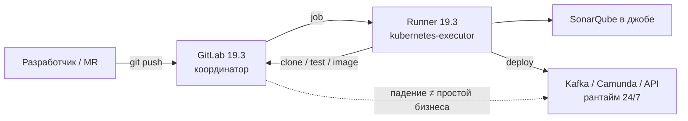
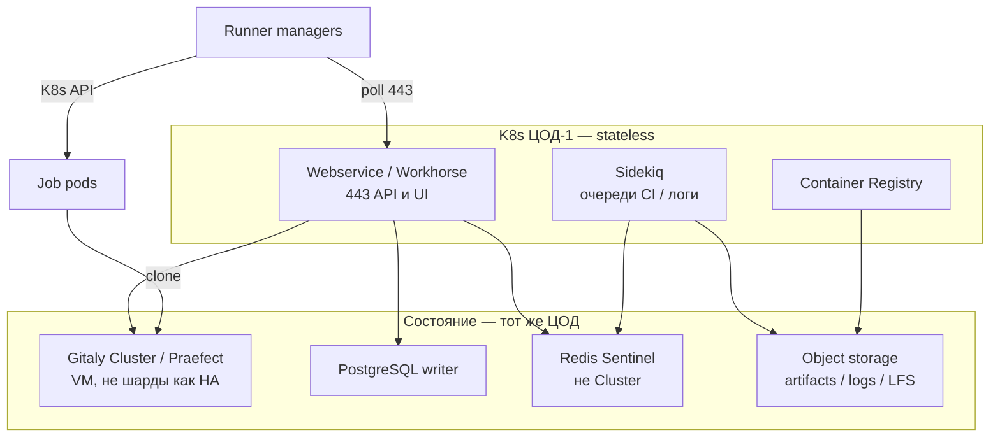
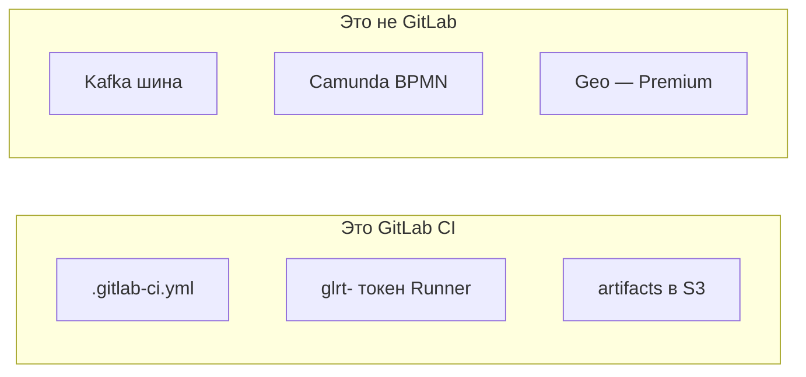
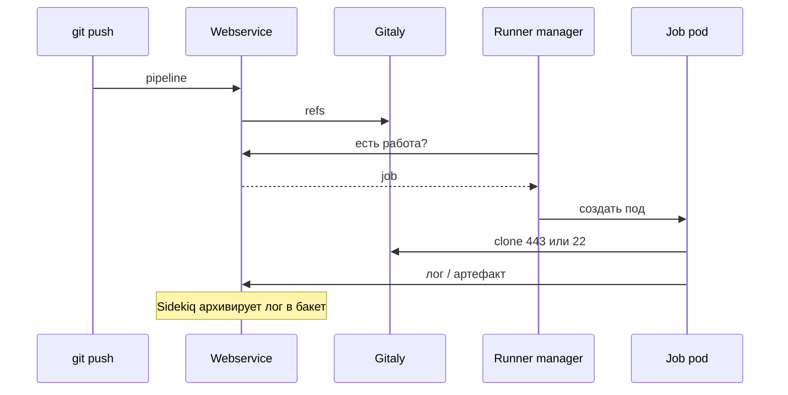
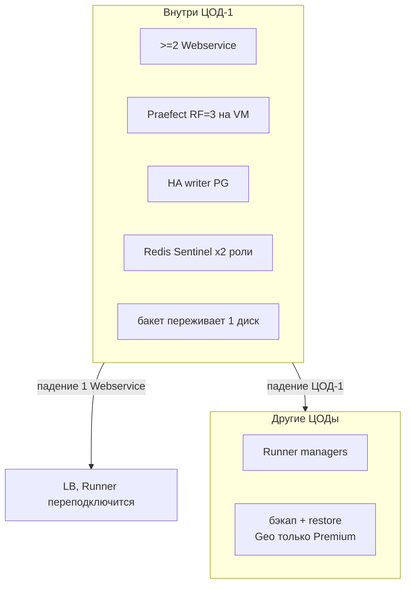
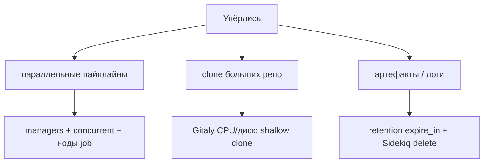
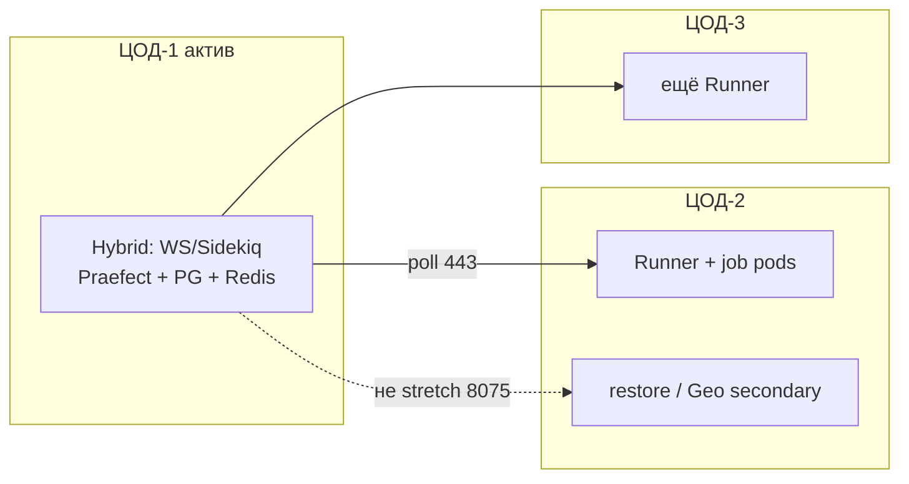

# GitLab 19.3.0 — схемы устройства

Связанные документы: правила — `GitLab CI.md`; установка — `GitLab CI.install.md`.

C4 / «D4»: контекст → контейнеры → компоненты. YAML джобов не рисуем.

Допущения: GitLab **19.3.0** + Runner **19.3.0**, Helm **`gitlab/gitlab` 10.3.0**. Stretch Gitaly/PostgreSQL/Redis на 2–3 ЦОДа **нет** (вендор HA **< 5 ms**, Praefect — *single location*). Bundled Postgres чарта **не** reference architecture S. Нагрузки/RPS нет.

---

## 1. Контекст

Отдельного продукта «только CI» нет. CI — подсистема GitLab. Пайплайн **поставляет** код, не держит runtime.

Runner без живого GitLab/Gitaly/бакета = очередь `pending`. Живые сервисы при мёртвом GitLab **не** должны падать.

---

## 2. Контейнеры координатора

Cloud Native Hybrid: stateless в Kubernetes; Gitaly Cluster на VM; PostgreSQL, Redis, object storage — **снаружи**.

Порты: **443** Runner↔GitLab; Gitaly **8075** (TLS 9999); Praefect **2305**; PG **5432**; Redis **6379** / Sentinel **26379**; Registry **5050/5000**. Incremental logging: куски лога в Redis → бакет. Иначе мультинодовый Rails теряет трейс.

**Дефолтный Helm** с bundled Postgres/Redis/MinIO — PoC. Цитата чарта: *not intended for production*.

---

## 3. Компоненты, которые путают с HA

Gitaly в Cloud Native K8s — **шарды**: каждый под = SPOF **своих** репо. Praefect в K8s — **beta**. Redis Cluster **не поддерживается** (в т.ч. incremental logging).

---

## 4. Поток: джоб

`CI_JOB_TOKEN` живёт, пока джоб. Allowlist проектов, иначе токен ходит шире группы.

---

## 5. Отказоустойчивость — что настраивать

| Ручка | Если забыть |
|---|---|
| Внешние PG/Redis/S3 | Bundled chart ≠ размер S референса |
| Praefect на VM | Sharded Gitaly в K8s — простой репо при рестарте STS |
| Incremental logging + бакет | Лог принял один Rails, Sidekiq на другом — дыра |
| Runner в нескольких ЦОДах | Падение зоны исполнения = все джобы в полёте там мертвы |
| Geo без Premium | Штатного межплощадочного DR инстанса **нет** |

Падение writer PG / Gitaly / бакета = нет CI, сколько ни плодь Runner'ов. Переживание **двух** ЦОДов не обещать.

---

## 6. Масштабируемость — что настраивать

Ось №1 CI — job-поды, не «ещё Kafka». HPA Webservice не лечит монорепу. Таблица RPS S/M/L — ориентир вендора, не смета. `concurrent` дефолт чарта **20** — не ёмкость кластера.

Сборка образов: **BuildKit rootless**, не privileged DinD на нодах приложений. Kaniko Google архивирован (июнь 2025) — не стратегия.

---

## 7. 2–3 ЦОДа без stretch

Один environment GitLab **между регионами** вендор не поддерживает. Три независимых GitLab = три SoT кода.

**Сильное:** латентность git/PG не прибита межЦОДовым RTT. **Слабое:** смерть ЦОД-1 = нет координатора, пока restore (или ручной Geo failover при Premium).

---

## 8. Безопасность

1. Нет legacy registration token (снятие в **20.0**); только `glrt-`.
2. 443 с нужных сетей; 8075/PG/Redis не с мира.
3. Job-namespace: NetworkPolicy, PSA; `deploy-prod` — protected runner.
4. Секреты — Protected/Masked, лучше Vault; scope `CI_JOB_TOKEN`.
5. Pin **10.3.x / 19.3.x**; `gitlab-runner.install` в проде выключить или полностью свои values.

Источники: `GitLab CI.md`. Порог **5 ms** — общее требование HA-сети вендора; на схемах stretch не целевой.
