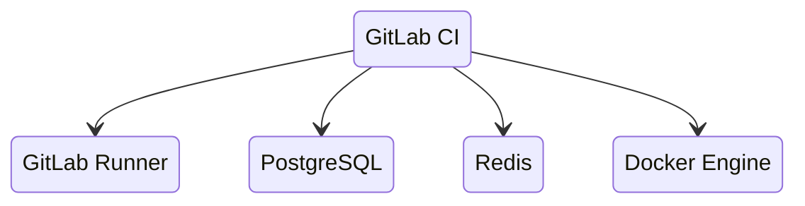
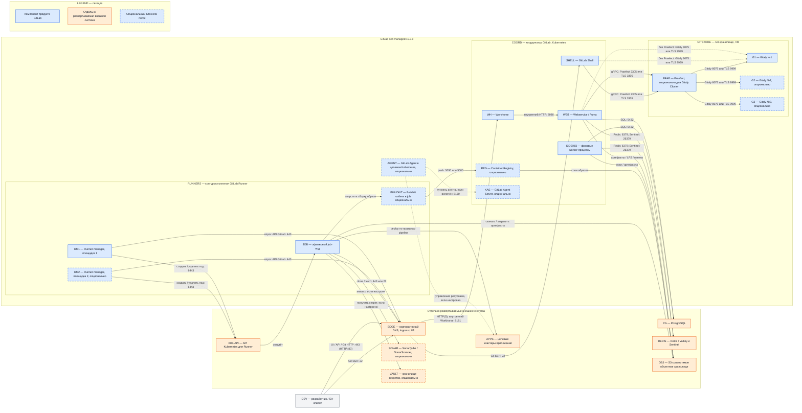

# GitLab CI/CD 19.3.0 — развёртывание и настройка

GitLab CI/CD — встроенный конвейер поставки: файл `.gitlab-ci.yml` в репозитории описывает, *что* собрать, протестировать и выкатить. Отдельного продукта «поставить только CI» нет. Без инстанса GitLab (репозитории, очередь работ, артефакты, API) агент сборки (Runner) не к чему регистрироваться. Этот документ покрывает **два контура**, которые вместе и есть GitLab CI: координатор (GitLab) и исполнители (Runner).

Это **не** шина событий (Kafka), **не** процессный движок (Camunda) и не «кнопка DevOps включена».

Версия координатора: **GitLab 19.3.0** (minor-релиз 20 августа 2026).  
Версия агента сборки: **GitLab Runner 19.3.0** (выходит в тот же день).  
Helm GitLab (сам инстанс на Kubernetes): чарт **`gitlab/gitlab` 10.3.0** → GitLab **19.3.0**.  
Helm Runner: чарт **`gitlab/gitlab-runner`**, версия чарта **не равна** версии Runner. На дату документа в репозитории виден тег `v0.91.0` (16 июля 2026, линия 19.2). Чарт под Runner **19.3.0** нужно снять командой `helm search repo -l gitlab/gitlab-runner` и пинить по колонке **APP VERSION = 19.3.0**, не по «последнему тегу, который запомнили».

Документация CI: https://docs.gitlab.com/ci/  
Runner: https://docs.gitlab.com/runner/  
Референс-архитектуры: https://docs.gitlab.com/administration/reference_architectures/  
Чарт GitLab: https://docs.gitlab.com/charts/

Политика поддержки на дату документа: **19.3** — bug + security; **19.2** и **19.1** — security. Критический патч GraphQL 17 августа 2026 закрыт в **19.2.4 / 19.1.6 / 19.0.8 / 18.11.11**; 19.3.0 вышел позже (20 августа). Патчи 19.3.x ставить по мере выхода, не замирать на `.0`, если появился security-патч.

Ядро CI (координатор + Runner) живёт в Free. **Межплощадочное восстановление инстанса штатно — это Geo, и это Premium/Ultimate.** Без Premium честный запас координатора = бэкап + restore.

Этот текст — не набор команд «скопируй `.gitlab-ci.yml`», а правила, без которых система не будет одновременно устойчивой к сбоям, масштабируемой и безопасной. Пошаговая установка — в `GitLab CI.install.md`.

---

## Назначение системы

GitLab CI нужен, чтобы **поставлять код одинаковым конвейером**: merge-request запускает сборку, тесты, Quality Gate, сборку образа и выкладку. Без конвейера выкладка — ручной риск: «на стенде собралось, в бой скопировали образ».

Система хранит Git-репозитории, метаданные пайплайнов, логи и артефакты сборок. Она **не** держит runtime Kafka и Camunda. Падение GitLab **не должно** ронять уже работающие сервисы. Падение GitLab **должно** быть заложено в процесс: либо поставка встаёт, либо (хуже) люди катят в обход.

Честные роли: поставка микросервисов и манифестов; качество до выкладки (сканер SonarQube живёт **в работе CI**, не внутри GitLab); сборка образов в закрытый реестр. Нечестная роль: «CI переживёт два дата-центра, потому что Runner в Kubernetes». Runner без живого GitLab, хранилища Git и бакета — очередь серых `pending`.

---

## Перечень функций

Что умеет self-managed GitLab CI/CD (по документации поставщика):

1. **Принимать push и merge-request**, создавать pipeline (прогон по событию) и отдавать работы (jobs) агентам Runner. Один job = как правило один под Kubernetes при kubernetes-executor.
2. **Хранить Git** через Gitaly. Работа **клонирует** код отсюда. Упал Gitaly — CI не из чего собирать. Несколько копий репозитория и автоfailover — Gitaly Cluster (Praefect) на виртуальных машинах; в Kubernetes вендор кладёт **шарды** (каждый репозиторий на одном Gitaly), Praefect в Kubernetes — **beta**.
3. **Исполнять `.gitlab-ci.yml`**: стадии (`build` → `test` → `deploy`), правила, теги Runner (ярлык пула), protected Runner (только защищённые ветки — чтобы секреты боя не утекли из merge-request с форка).
4. **Сохранять артефакты и логи.** На боевом мультинодовом GitLab это **объектное хранилище**, не диск пода. Без incremental logging (куски лога в Redis → объектное хранилище) лог может потеряться, если его принял один Rails, а фоновые задачи живут на другом.
5. **Кэшировать зависимости** между работами. На нескольких Runner без distributed cache (S3) кэш «прилипает» к одному менеджеру и не шарится.
6. **Отдавать Container Registry**, пакеты, LFS — тоже через объектное хранилище.
7. **Масштабировать вход** (Webservice / Workhorse) горизонтально и фоновые очереди (Sidekiq) отдельными воркерами под CI.
8. **Регистрировать Runner** современным токеном `glrt-`. Старый registration token deprecated, снятие запланировано на **GitLab 20.0**.
9. **Копировать инстанс на вторую площадку** (Geo): реплика «на чтение» + ручной failover. Это **Premium/Ultimate**, не Free. Для нескольких **регионов**, не замена Gitaly Cluster.

Чего система **не** делает и часто путают: она не шина бизнес-событий, не BPMN, не озеро эталона, не Active/Active GitLab на три дата-центра, не Redis Cluster «потому что HA» (Redis Cluster **не поддерживается**, в том числе для incremental logging). Zero-downtime upgrade Cloud Native Hybrid *not supported*. Сборка образов «из коробки» через Docker-in-Docker почти всегда требует privileged — поставщик прямо: это снимает изоляцию контейнера. Kaniko Google архивирован 3 июня 2025 — в новый бой как стратегию не закладывать; замена в доке GitLab — BuildKit rootless. Реплики Gitaly не заменяют бэкап: Praefect спасает от падения **ноды**, не от `git push --force` и не от гибели всех копий + бакета.

---

## Основные элементы системы и зависимости

GitLab CI/CD — не один процесс. Координатор, Git-хранилище, исполнители и хранилища данных образуют систему, а часть зависимостей развёртывается отдельно. Схема ниже показывает **логические инстансы и сетевые потоки**, но не задаёт число реплик: без профиля нагрузки и измеренной задержки его нельзя определить честно.

### Схема инстансов и потоков

### Как читать схему

1. **Сначала смотрите на цвет.** Синие блоки — компоненты GitLab или GitLab Runner. Оранжевые — системы, которые устанавливаются и эксплуатируются отдельно от GitLab. Серый блок — человек и его клиентское ПО. Пунктирная рамка блока либо пунктирный поток означает опциональность.
2. **Читайте слева направо по стрелкам.** Подпись на стрелке указывает действие, протокол или сетевой порт. Сплошная стрелка показывает основной поток; пунктирная — вариант, который появляется только при выбранной конфигурации.
3. **Начальный поток — от DEV.** Разработчик обращается к EDGE: по HTTPS для UI, API и Git HTTP либо по SSH для Git. EDGE передаёт HTTP-трафик в Workhorse, а SSH-трафик — в GitLab Shell.
4. **Координатор фиксирует состояние pipeline.** Webservice работает с PostgreSQL и Redis/Valkey, Sidekiq выполняет фоновые задачи, а данные артефактов и логов уходят в объектное хранилище.
5. **Git хранится отдельно от метаданных.** При Gitaly Cluster Webservice и GitLab Shell идут через Praefect к нескольким Gitaly. Без Praefect они обращаются к Gitaly напрямую; этот вариант показан пунктиром.
6. **Runner не получает работу входящим вызовом.** RM1 и опциональный RM2 сами опрашивают API GitLab через EDGE, затем обращаются к API своего Kubernetes и создают временный JOB.
7. **JOB выполняет пользовательский сценарий.** Он клонирует репозиторий через внешний GitLab endpoint, работает с артефактами и, только если это задано pipeline, вызывает SonarQube, Vault, BuildKit, Registry и целевые кластеры приложений. Опциональная агентская интеграция показана отдельным потоком AGENT → KAS и не является соединением от job-пода.
8. **Схема не обещает размещение по трём ЦОД.** RM2 иллюстрирует возможность второго пула исполнения, но количество менеджеров и площадок не задано. G2/G3 показывают вариант Gitaly Cluster в одной location, а не разрешение растянуть Praefect между дата-центрами с неизвестной задержкой.

### Описание блоков

#### Границы схемы

- **PRODUCT — GitLab self-managed 19.3.x.** Сущность: логическая граница компонентов поставщика, а не один процесс или один хост. Технологии/варианты: GitLab 19.3.x и GitLab Runner 19.3.x в принятом варианте Cloud Native Hybrid. Назначение: отделить части продукта от инфраструктурных зависимостей. **Граница продукта GitLab; физическое размещение задают вложенные блоки.**
- **EXT — отдельно развёртываемые внешние системы.** Сущность: логическая группа инфраструктуры и соседних платформенных сервисов. Технологии/варианты: выбираются владельцами соответствующих систем и в исходных данных полностью не заданы. Назначение: показать зависимости и потребителей, жизненный цикл которых не управляется установкой GitLab. **Не часть продукта GitLab.**

#### Участник и внешняя точка входа

- **DEV — разработчик / Git-клиент.** Сущность: пользователь и его рабочая станция либо автоматизированный Git-клиент. Технологии/варианты: браузер, Git по HTTPS или SSH, вызовы API. Назначение: отправлять код, создавать merge request и наблюдать pipeline. **Не часть продукта и не отдельно развёртываемая серверная система.**
- **EDGE — корпоративный DNS, Ingress / LB.** Сущность: единая внешняя точка входа. Технологии/варианты: существующий корпоративный DNS и отдельно выбранные Ingress-контроллер или балансировщик; конкретная реализация в исходных данных не задана. Назначение: завершать или передавать сетевые подключения к компонентам GitLab. **Отдельно развёртываемая внешняя система.**

#### Координатор GitLab

- **COORD — координатор GitLab.** Сущность: группа серверных процессов GitLab, показанная как логический контур. Технологии/варианты: для принятого боевого допущения — Cloud Native Hybrid в Kubernetes; учебный all-in-one Omnibus является другим вариантом и на схеме не детализирован. Назначение: UI, API, планирование pipeline и фоновые операции. **Часть продукта GitLab.**
- **WH — Workhorse.** Сущность: прокси-процесс перед Webservice. Технологии/варианты: GitLab Workhorse в составе поставки GitLab. Назначение: принимать HTTP-запросы, Git HTTP и передачу больших файлов, разгружая Rails-приложение. **Часть продукта GitLab.**
- **WEB — Webservice / Puma.** Сущность: экземпляры веб-приложения GitLab. Технологии/варианты: Rails-приложение, запускаемое Puma; число реплик определяется нагрузкой. Назначение: UI, API, логика проектов, pipeline и работ. **Часть продукта GitLab.**
- **SHELL — GitLab Shell.** Сущность: серверный компонент Git-доступа по SSH. Технологии/варианты: GitLab Shell из поставки GitLab. Назначение: авторизовать Git SSH и направлять операции к Gitaly либо Praefect. **Часть продукта GitLab.**
- **SIDEKIQ — фоновые worker-процессы.** Сущность: исполнители асинхронных задач. Технологии/варианты: Sidekiq; очереди могут разделяться между группами процессов при известном профиле нагрузки. Назначение: выполнять фоновые операции pipeline, обработку логов, webhooks и другие отложенные задачи. **Часть продукта GitLab.**
- **REG — Container Registry, опционально.** Сущность: реестр OCI/Docker-образов, интегрированный с GitLab. Технологии/варианты: GitLab Container Registry; в платформе может использоваться иной внешний реестр, но такой вариант на схеме не утверждён. Назначение: принимать и отдавать собранные образы. **Опциональная часть продукта GitLab.**
- **KAS — GitLab Agent Server, опционально.** Сущность: сервер GitLab Agent for Kubernetes. Технологии/варианты: KAS, включаемый только при использовании агентской интеграции Kubernetes. Назначение: поддерживать канал между GitLab и агентом в Kubernetes. **Опциональная часть продукта GitLab; это не Runner.**
- **AGENT — GitLab Agent, опционально.** Сущность: агентский процесс в целевом Kubernetes-кластере. Технологии/варианты: GitLab Agent for Kubernetes при отдельно настроенной интеграции. Назначение: устанавливать исходящее соединение с KAS и выполнять разрешённые операции с ресурсами кластера. **Опциональная часть продукта GitLab, развёртываемая в отдельной системе Kubernetes.**

#### Git-хранилище

- **GITSTORE — Git-хранилище.** Сущность: отдельный контур хранения репозиториев. Технологии/варианты: один Gitaly либо Gitaly Cluster с Praefect; в принятом боевом допущении компоненты размещаются на Linux VM. Назначение: хранить Git-репозитории, из которых выполняется clone/fetch. **Часть продукта GitLab.**
- **PRAE — Praefect, опционально.** Сущность: прокси и координатор Gitaly Cluster. Технологии/варианты: Praefect перед несколькими Gitaly; прямой доступ к одному Gitaly — вариант без него. Назначение: маршрутизация запросов, репликация репозиториев и автоматический failover ноды Gitaly. **Опциональная часть продукта GitLab.**
- **G1 — Gitaly №1.** Сущность: обязательный на данной схеме сервер Git-репозиториев. Технологии/варианты: Gitaly на Linux VM; одиночный сервер либо участник Gitaly Cluster. Назначение: физически хранить Git-данные и выполнять серверные Git-операции. **Часть продукта GitLab.**
- **G2 и G3 — дополнительные Gitaly, опционально.** Сущность: дополнительные серверы хранения. Технологии/варианты: Gitaly под управлением Praefect; точное число узлов схема не задаёт. Назначение: копии репозиториев и переживание отказа отдельной ноды в пределах поддерживаемой топологии. **Опциональные части продукта GitLab.**

#### Контур исполнения

- **RUNNERS — контур исполнения GitLab Runner.** Сущность: логическая группа менеджеров и создаваемых ими работ. Технологии/варианты: GitLab Runner 19.3.x с Kubernetes executor. Назначение: получать jobs от координатора и исполнять `.gitlab-ci.yml`. **Часть решения GitLab CI/CD; устанавливается отдельно от координатора, но является продуктом GitLab Runner.**
- **RM1 — Runner manager, площадка 1.** Сущность: постоянно работающий процесс GitLab Runner. Технологии/варианты: официальный Runner и Kubernetes executor. Назначение: опрашивать API GitLab, создавать job-поды и возвращать статус. **Часть продукта GitLab Runner.**
- **RM2 — Runner manager, площадка 2, опционально.** Сущность: дополнительный независимый менеджер. Технологии/варианты: тот же Runner, возможно в другом Kubernetes-кластере; возможность не означает гарантированную межплощадочную отказоустойчивость координатора. Назначение: дополнительная ёмкость или пул исполнения. **Опциональная часть продукта GitLab Runner.**
- **JOB — эфемерный job-под.** Сущность: временный Kubernetes pod, создаваемый на одну работу. Технологии/варианты: образ и команды определяет `.gitlab-ci.yml`; фактические ограничения задаёт конфигурация Runner и Kubernetes. Назначение: clone/fetch, сборка, тест, анализ и deploy. **Временный экземпляр исполнения продукта GitLab Runner, содержащий пользовательскую рабочую нагрузку.**
- **BUILDKIT — BuildKit rootless в job, опционально.** Сущность: процесс сборки контейнерного образа без привилегированного Docker-in-Docker. Технологии/варианты: BuildKit в rootless-режиме. Назначение: собирать образ и отправлять его в Registry. **Не самостоятельный сервис GitLab; опциональный инструмент внутри job.**

#### Отдельно развёртываемые зависимости и потребители

- **PG — PostgreSQL.** Сущность: реляционная СУБД. Технологии/варианты: внешний PostgreSQL; конкретная версия и HA-реализация должны выбираться по требованиям GitLab 19.3 и инфраструктуры. Назначение: хранить метаданные проектов, pipeline и jobs. **Отдельно развёртываемая внешняя система.**
- **REDIS — Redis / Valkey и Sentinel.** Сущность: хранилище оперативного состояния и механизм обнаружения primary. Технологии/варианты: Redis либо поддерживаемый Valkey в конфигурации standalone + Sentinel; Redis Cluster не поддерживается. Назначение: сессии, очереди Sidekiq и части incremental logs. **Отдельно развёртываемая внешняя система.**
- **OBJ — S3-совместимое объектное хранилище.** Сущность: бакеты объектов. Технологии/варианты: внешний S3-совместимый сервис; поставщик в исходных данных не выбран. Назначение: артефакты, архивированные логи, LFS, пакеты и данные Registry. **Отдельно развёртываемая внешняя система.**
- **K8S-API — API Kubernetes для Runner.** Сущность: управляющий API Kubernetes-кластера, где исполняются jobs. Технологии/варианты: имеющийся поддерживаемый дистрибутив Kubernetes; версия в исходных данных не задана. Назначение: создавать и удалять job-поды. **Часть отдельной платформы Kubernetes, не часть GitLab.**
- **SONAR — SonarQube / SonarScanner, опционально.** Сущность: внешний сервер анализа качества и клиент-сканер внутри job. Технологии/варианты: SonarQube и SonarScanner; конкретная редакция и endpoint не заданы. Назначение: анализировать код и возвращать результат проверки качества. **Опциональная отдельно развёртываемая внешняя система; сканер вызывается из job.**
- **VAULT — хранилище секретов, опционально.** Сущность: внешний сервис секретов. Технологии/варианты: в контексте указан Vault; способ аутентификации не задан. Назначение: выдавать job краткоживущие или управляемые секреты вместо хранения постоянных ключей в репозитории. **Опциональная отдельно развёртываемая внешняя система.**
- **APPS — целевые кластеры приложений.** Сущность: runtime-платформа сервисов. Технологии/варианты: отдельные Kubernetes-кластеры площадок; Kafka, Camunda, озеро и интеграционное API являются рабочими нагрузками или соседними сервисами, а не внутренностями CI. Назначение: принимать deploy из разрешённых jobs. **Отдельные внешние системы и потребители результатов CI.**
- **LEGEND — легенда.** Сущность: пояснение визуальных обозначений. Технологии/варианты: служебные Mermaid-блоки. Назначение: различать продуктовые, внешние и опциональные элементы. **Не компонент системы.**

Редакции — это не «тариф UI»:

| Нужно | Free / CE | Premium | Ultimate |
|---|---|---|---|
| Сам CI/CD, Runner, kubernetes-executor, артефакты | да | да | да |
| Gitaly Cluster (Praefect) как **фича** | да (tier Free) | да | да |
| Техподдержка Praefect у GitLab Support | ограничена | да | да |
| **Geo** (вторая площадка, DR инстанса) | **нет** | да | да |
| Merge trains, часть «больших» CI-фич | нет / урезанно | да | да |

### Порты (контракт сети)

| Порт (default Linux package) | Назначение | Кому открывать |
|---|---|---|
| **443 / 80** | HTTPS/HTTP UI и API (сюда же Runner) | Внутренняя сеть / прокси единого входа. Не мир без TLS и IdP |
| **22** | Git SSH | Разработчики и job-поды, не мир без нужды |
| **8075** (TLS **9999**) | Gitaly | Только координатор и Praefect |
| **2305** (TLS **3305**) | Praefect | Только Gitaly и координатор |
| **5432** | PostgreSQL | Только координатор |
| **6379** | Redis; Sentinel **26379** | Только координатор |
| **5050 / 5000** | Container Registry | Job-поды и разработчики, не анонимный push |
| **8150** | GitLab Agent for Kubernetes (KAS) | Если включили. Это **не** Runner |
| **8080 / 8181** | внутренние Puma / Workhorse в пакете | Снаружи обычно не торчат |
| **6443** | API Kubernetes | Runner manager создаёт job-поды |

Runner с kubernetes-executor ходит: **к API GitLab (443)** и **к API Kubernetes**. Job-под ходит: clone (443/22), объектное хранилище, Registry, ваши сервисы по NetworkPolicy.

### Зависимости окружения (что ещё должно быть)

- Внешние PostgreSQL и Redis/Valkey; S3-совместимый бакет с HA.
- Ingress/LB **свой** перед HTTPS; корпоративный CA на Runner'ах (иначе clone и Registry не доверят сертификату).
- Образы сборки в **вашем** registry (не «всегда тянуть с Docker Hub в закрытый контур»).
- Стабильный DNS до Gitaly на 8075; клиентам — до VIP 443.

---

## Краткие вводные

### Как устроена отказоустойчивость

Три разных контура. Путать их — главная ошибка.

**1) Исполнение работ (Runner)**

| Что падает | Что происходит |
|---|---|
| Один job-под | Эта работа красная; retry; остальные Runner'ы живы |
| Один Runner manager из нескольких | `concurrent` этого менеджера пропал; другие менеджеры продолжают спрашивать API |
| Весь дата-центр с job-подами | Работы **в полёте на этой площадке** погибли. Новые работы могут взять менеджеры в живых площадках, **если** координатор жив |
| Все Runner'ы | Пайплайны в `pending`. Код в Git целый |

Эфемерный kubernetes-executor — сильное место: нет «грязной VM, на которой вчерашняя работа оставила malware». Слабое: без resource requests работы съедят ноды приложений.

**2) Координатор (GitLab)**

| Что падает | Что происходит |
|---|---|
| Один под Webservice из нескольких | Балансировщик уводит трафик; Runner переподключается |
| Sidekiq | UI может быть жив, архив логов и часть пайплайнов — нет |
| PostgreSQL writer | Инстанс «глухой». Реплика read-only GitLab как живой primary **не** заменяет штатный failover базы |
| Redis | Сессии, Sidekiq, куски incremental log. Это не кэш «можно прогреть» |
| Object storage | Нет устойчивых артефактов/логов в мультиноде; Registry/LFS |
| Один sharded Gitaly | Репозитории **этого** шарда недоступны; CI этих проектов не клонирует |
| Praefect: 1 Gitaly из 3 (replication factor 3, одна площадка) | Автоfailover; заявленные поставщиком RPO/RTO одной ноды — см. документацию Praefect в источниках |
| Весь кластер Gitaly / площадка, где лежали все копии | Git нет. Нужен бэкап официальными Rake, не snapshot одной ноды Praefect |

**3) Площадки**

Gitaly Cluster официально: **несколько нод, одна location**, задержка *< 1 с, ideally ms*. Geo: **несколько location**, задержка *up to one minute*, failover **ручной**, консистентность eventual, покрывает **весь** инстанс.

Следствие: «размазать один Praefect на три дата-центра с неизвестной задержкой» **не** следует из гайда. «Поднять Geo на вторую площадку» — штатный запас, но это **Premium** и не Active/Active.

### Как устроено масштабирование

Несколько независимых осей:

1. **Больше параллельных пайплайнов** → больше **Runner managers** + `concurrent` + **ноды Kubernetes** под job-поды + Quota. Это главная ось CI. Координатор при этом может быть ещё «маленьким».
2. **Больше клонов больших репозиториев** → Gitaly CPU/диск/сеть. Поставщик отдельно предупреждает: *Hundreds of concurrent CI jobs for large repositories* — дополнительная нагрузка сверх таблиц RPS.
3. **Больше UI/API/MR** → Webservice (HPA), PostgreSQL, Redis cache.
4. **Больше артефактов и логов** → объектное хранилище + retention (`expire_in` в YAML + админские TTL) + Sidekiq delete workers. Терабайты озера сюда **не** попадают сами — попадают zip'ы работ, которые вы не чистите.
5. **Sidekiq CI** → отдельные процессы/поды под тяжёлые очереди, если общий Sidekiq забит архивацией логов.

HPA Webservice не лечит монорепозиторий.

### Безопасность самого GitLab CI

Компрометация CI в контуре с госинтеграциями = компрометация **исходников интеграционного API, секретов выкладки, образов, карты сервисов**. Токен Runner и `CI_JOB_TOKEN` — ключи к этому.

Официально и практически:

- **Registration token** (legacy) позволяет зарегистрировать **любой** Runner, кто его украл. Переход на **`glrt-`**. Снятие legacy — план **20.0**.
- **Privileged / DinD:** *By enabling privileged mode, you are effectively disabling all the container’s security mechanisms*. Если без privileged нельзя — изолированные эфемерные VM и **protected** Runner только на protected-ветки, не общий пул merge-request.
- **Shell executor** на общей машине — работы видят друг друга. Для боя микросервисов не ваш путь.
- **`CI_JOB_TOKEN`:** маскируется в логах, живёт пока работа. Включайте **ограничение scope** (allowlist проектов).
- Переменные: секреты боя — **Protected + Masked**, лучше Vault по короткоживущим учёткам, не вечный ключ в UI.
- Shared runner на всём инстансе + Developer может запустить произвольный `script:` = чужой код на ваших нодах. Для закрытого контура: отдельные пулы `build` / `prod-deploy`, NetworkPolicy, Restricted на job-namespace (privileged пул — отдельный namespace и ноды).
- Helm GitLab по умолчанию ставит **вложенный** `gitlab-runner`. На бою его либо жёстко конфигурируют, либо выключают и ставят отдельный чарт.

«Открыли LoadBalancer GitLab в интернет, DinD privileged, registration token в Confluence» — это новая поверхность атаки, не платформа поставки.

---

## Допущения

Ниже то, чего не было в исходном запросе, но без чего нельзя нарисовать конкретную схему. Если допущение неверно — схему надо пересмотреть.

1. Берём **self-managed GitLab**, не GitLab.com и не Dedicated. Три своих дата-центра SaaS поставщика не заменяют.
2. Бой координатора — **Cloud Native Hybrid:** Webservice/Sidekiq в Kubernetes; **Gitaly Cluster (Praefect) на VM**; PostgreSQL, Redis, объектное хранилище — внешние.
3. Бой Runner — kubernetes-executor, официальный чарт `gitlab/gitlab-runner`, менеджеры в Kubernetes. Пин — **та же minor 19.3**.
4. Версия — **19.3.0 + патчи линии 19.3.** Не 18.x «потому что привыкли». Не `latest` без пина.
5. Сборка образов в бою — **без privileged DinD на общем пуле.** Путь: BuildKit rootless. Kaniko Google **не** использовать как стратегический инструмент.
6. Три дата-центра = три зоны отказа в одном городе / одном region. Один GitLab environment **между регионами** поставщик не поддерживает.
7. Цель отказа координатора: пережить 1 дата-центр только если сеть и кворум PG/Redis/Praefect это позволяют **и** объектное хранилище не умерло вместе с этой площадкой. Цель «пережить 2 из 3» **не** обещать.
8. Пока задержку не измерили, stretch Praefect/Patroni/Redis на три площадки — гипотеза, не план. Если RTT ≥ 5 мс — координатор в 1–2 площадках, третья: Runner + (если Premium) Geo secondary.
9. Geo в базовый Free-план не входит. Если лицензии Premium нет, DR инстанса = бэкапы Gitaly/PG/бакета + прогон restore.
10. Нагрузки и RPS нет — нет цифры «N webservice и M concurrent». Есть сигналы (pending jobs, очередь Sidekiq, CPU Gitaly, latency 443, saturating clone) и рычаги.
11. Формального SLA на CI нет. Политика: блокирует ли мёртвый GitLab выкладку.
12. Учебный стенд изолирован. На нём допустимы Omnibus all-in-one и bundled chart. В бой их не копируем.
13. Kafka, Camunda, озеро, интеграционное API — **репозитории и runtime**, не HA-зависимости GitLab. Работы не должны иметь NetworkPolicy «весь кластер».
14. SonarQube, Vault, Registry — соседние платформенные сервисы. Сканер и секреты живут в работах, не внутри процесса Runner.
15. Zero-downtime upgrade Hybrid не используем как обещание. Окно выката координатора закладываем.
16. Шифрование канала — обычный TLS. Требования отдельной криптографии государством не озвучены.

---

## Критически важные условия, которых нет в исходном контексте

Их нужно закрыть **до** «helm install gitlab и забыли».

| Пробел | Почему это ломает решение |
|---|---|
| **Задержка и потери между дата-центрами** (p50/p95/p99), отдельно до PostgreSQL, Redis, Gitaly **8075**, объектного хранилища | Поставщик: HA sync **< 5 мс**. Praefect — миллисекунды, одна location. Без замера схема «три площадки = три зоны» — лотерея |
| **Один Kubernetes на три площадки или три кластера** | Runner может быть в каждом кластере. Координатор и Praefect — нет |
| **Где writer PostgreSQL, Redis primary, бакет артефактов** | Падение площадки с writer/бакетом = падение CI, сколько ни плодь Runner'ов |
| **Редакция (Free vs Premium) и нужен ли Geo** | Без Geo нет штатного межплощадочного DR инстанса |
| **Профиль CI:** монорепозиторий или 30 мелких; сколько параллельных работ; полный clone vs fetch; размер артефактов | Таблица RPS «пользователи» врёт, если каждый MR клонирует гигабайты |
| **Где собирать образы** | Privileged на общих worker-нодах приложений = вы отдаёте root ноды любому `script:` |
| **Политика при недоступном GitLab / красном pipeline** | Не спроектировали — в инциденте либо встанет релизный поезд, либо все катят руками |
| **Куда смотрит UI/API** | Публичный 443 + слабый root + открытая регистрация Runner — инцидент |
| **Персональные данные в логах и артефактах** | Job log и cache легко уносят токены и куски персональных данных из фикстур |
| **Нужен ли Container Registry / KAS** | Это дополнительные порты, бакеты и RBAC, не «включено само» |
| **Совместимость чарта 10.3.0 с вашей версией Kubernetes** | Смотреть prerequisites чарта на момент установки |

---

## Глоссарий

| Термин | Значение в этом документе |
|---|---|
| **API** | Программный интерфейс, через который клиенты и Runner обращаются к GitLab или Kubernetes. |
| **Artifact / артефакт** | Файл, сохранённый после job: отчёт, архив, бинарный файл или другой результат работы. |
| **BuildKit rootless** | Инструмент сборки контейнерных образов, запущенный без полномочий root и без privileged Docker-in-Docker. |
| **CA** | Центр сертификации, которому должны доверять клиенты внутренних TLS-сертификатов. |
| **Cache / кэш CI** | Повторно используемые зависимости и промежуточные файлы jobs; не является эталонным хранилищем данных. |
| **CI/CD** | Автоматизация сборки, проверки и поставки изменений программного обеспечения. |
| **CI_JOB_TOKEN** | Краткоживущий токен, который GitLab выдаёт job для разрешённых обращений к ресурсам. |
| **Cloud Native Hybrid** | Архитектура GitLab, где часть компонентов работает в Kubernetes, а stateful-компоненты и внешние хранилища размещаются вне него. |
| **Container Registry / Registry** | Сервис хранения и выдачи контейнерных образов. |
| **Coordinator / координатор** | Серверная часть GitLab, которая хранит состояние pipeline, раздаёт jobs и принимает их результаты. |
| **DinD** | Docker-in-Docker — запуск Docker daemon внутри контейнера; обычно требует privileged-режим. |
| **DR** | Disaster Recovery — восстановление сервиса после потери площадки или крупного сбоя. |
| **Executor** | Способ, которым Runner запускает job; здесь основной вариант — Kubernetes executor. |
| **Failover** | Переключение запросов с отказавшего экземпляра на работоспособный. |
| **Geo** | Функция GitLab Premium/Ultimate для репликации целого инстанса на другую площадку и ручного переключения. |
| **Git** | Распределённая система контроля версий, данные которой в GitLab обслуживает Gitaly. |
| **Gitaly** | Компонент GitLab, который хранит репозитории и выполняет серверные Git-операции. |
| **Gitaly Cluster** | Несколько Gitaly под управлением Praefect для репликации репозиториев и failover отдельной ноды. |
| **GitLab Shell** | Компонент GitLab, который авторизует Git-доступ по SSH и направляет его к Git-хранилищу. |
| **GitLab Agent for Kubernetes** | Опциональный агент в целевом Kubernetes-кластере, который устанавливает соединение с KAS; не Runner. |
| **gRPC** | Протокол удалённых вызовов, используемый между компонентами GitLab и Git-хранилищем. |
| **HA** | High Availability — архитектура, уменьшающая простой при отказе отдельного компонента. |
| **Helm chart / чарт** | Версионированный пакет шаблонов и настроек для установки приложения в Kubernetes. |
| **HPA** | Horizontal Pod Autoscaler — механизм Kubernetes, меняющий число pod по метрикам. |
| **HTTP / HTTPS** | Протокол веб-доступа; HTTPS — HTTP, защищённый TLS. |
| **IdP** | Identity Provider — внешняя система корпоративной аутентификации пользователей. |
| **Incremental logging** | Передача лога job частями через Redis с последующим сохранением в объектное хранилище. |
| **Ingress / LB / VIP** | Соответственно маршрутизатор входящего трафика Kubernetes, балансировщик нагрузки и его виртуальный сетевой адрес. |
| **Instance / инстанс** | Отдельно запущенный экземпляр процесса или логически целая установка GitLab — значение определяется контекстом. |
| **IOPS** | Число операций ввода-вывода диска в секунду. |
| **Job / работа** | Одна исполняемая единица pipeline с командами из `.gitlab-ci.yml`. |
| **Job-под** | Временный Kubernetes pod, в котором Kubernetes executor запускает job. |
| **KAS** | GitLab Agent Server — серверная часть интеграции GitLab Agent for Kubernetes; не Runner. |
| **Kaniko** | Архивированный проект сборки контейнерных образов; в этом документе не выбран как стратегический инструмент. |
| **Kubernetes** | Оркестратор контейнеров, в котором могут работать компоненты GitLab, Runner manager и job-поды. |
| **LFS** | Git Large File Storage — механизм хранения больших файлов, связанных с Git-репозиторием. |
| **Location / площадка** | Сетево близкая зона размещения; у GitLab это не автоматически любой набор дата-центров. |
| **Merge request / MR** | Запрос на включение набора изменений в ветку репозитория с проверками и обсуждением. |
| **NetworkPolicy** | Правило Kubernetes, ограничивающее сетевые соединения pod. |
| **Object storage / S3** | Хранилище объектов в бакетах с API, совместимым с Amazon S3. |
| **OCI-образ** | Стандартизированный контейнерный образ приложения и его зависимостей. |
| **Omnibus / Linux package** | Пакетный способ установки GitLab на Linux-машину со связанными компонентами. |
| **Pipeline / конвейер** | Набор stages и jobs, запускаемый GitLab для изменения кода. |
| **Pod / под** | Минимальная запускаемая единица Kubernetes, содержащая один или несколько контейнеров. |
| **Port / порт** | Номер сетевой точки подключения к сервису. |
| **Praefect** | Прокси и координатор Gitaly Cluster, управляющий маршрутизацией и репликацией репозиториев. |
| **Protected branch / Protected Runner** | Защищённая ветка и Runner, ограниченный выполнением доверенных работ для защиты секретов и deploy. |
| **Puma** | Сервер приложений, запускающий Rails-веб-приложение GitLab. |
| **Quality Gate** | Набор условий качества, по результату которых продолжение поставки разрешается или блокируется. |
| **RBAC** | Role-Based Access Control — управление разрешениями по ролям. |
| **Redis / Valkey** | Совместимые хранилища оперативного состояния, используемые GitLab для сессий, очередей и логов. |
| **Redis Cluster** | Режим шардирования Redis, который для описанного использования GitLab не поддерживается. |
| **RPO / RTO** | Допустимая потеря данных по времени и целевое время восстановления после сбоя. |
| **RPS** | Число запросов к GitLab в секунду, используемое в референсном сайзинге координатора. |
| **Runner** | Продукт GitLab, который получает job от координатора и запускает её выбранным executor. |
| **Runner manager** | Постоянно работающий процесс Runner, который опрашивает GitLab и управляет исполнителями jobs. |
| **SaaS** | Сервис поставщика, используемый через сеть без самостоятельного развёртывания; GitLab.com — пример SaaS. |
| **Self-managed** | GitLab, который организация развёртывает и эксплуатирует в своей инфраструктуре. |
| **Sentinel** | Механизм Redis для наблюдения за экземплярами и обнаружения primary при отказе. |
| **Sidekiq** | Компонент GitLab для выполнения фоновых задач из очередей. |
| **SPOF** | Single Point of Failure — единственный компонент, отказ которого останавливает функцию системы. |
| **SSH** | Защищённый сетевой протокол, используемый в том числе для Git-доступа. |
| **Stage / стадия** | Логическая фаза pipeline, например build, test или deploy. |
| **TLS** | Криптографический протокол защиты сетевого соединения. |
| **Token `glrt-`** | Современный токен аутентификации зарегистрированного GitLab Runner. |
| **Legacy registration token** | Устаревший токен регистрации Runner, снятие которого запланировано в GitLab 20.0. |
| **Vault** | Внешняя система управления секретами, которую job может вызывать при отдельно настроенной интеграции. |
| **VM** | Виртуальная машина с собственной гостевой операционной системой. |
| **Webservice** | Rails-приложение GitLab, предоставляющее UI и API. |
| **Webhook** | Исходящий HTTP-вызов GitLab при заданном событии. |
| **Workhorse** | Прокси-компонент GitLab перед Webservice, обрабатывающий HTTP и передачу больших данных. |
| **Writer / primary** | Экземпляр хранилища данных, принимающий записи. |
| **Zero-downtime upgrade** | Обновление без перерыва сервиса; для Cloud Native Hybrid оно не заявлено как поддерживаемое обещание. |

---

## Источники (чтобы не принимать на веру)

- Релиз GitLab 19.3 / Runner 19.3 (20 Aug 2026): https://docs.gitlab.com/releases/19/gitlab-19-3-released/
- Политика поддержки: https://docs.gitlab.com/policy/maintenance/
- Критический патч 19.2.4 (17 Aug 2026): https://docs.gitlab.com/releases/patches/patch-release-gitlab-19-2-4-released/
- Соответствие чарта 10.3.0 → GitLab 19.3.0: https://docs.gitlab.com/charts/installation/version_mappings/
- Референс-архитектуры, RPS, HA от ~3k users, Geo, < 5 мс, multi-DC own risk: https://docs.gitlab.com/administration/reference_architectures/
- Cloud Native: Gitaly в K8s только шарды, PG/Redis/object storage снаружи, размеры S/M/L/XL: https://docs.gitlab.com/administration/reference_architectures/cloud_native/
- Дефолтный Helm ≠ прод: https://docs.gitlab.com/charts/
- Gitaly Cluster (Praefect): https://docs.gitlab.com/administration/gitaly/praefect/
- Gitaly on Kubernetes: https://docs.gitlab.com/administration/gitaly/kubernetes/
- Kubernetes executor: https://docs.gitlab.com/runner/executors/kubernetes/
- Безопасность Runner, privileged = breakout: https://docs.gitlab.com/runner/security/
- DinD требует privileged: https://docs.gitlab.com/ci/docker/docker_in_docker/
- BuildKit rootless: https://docs.gitlab.com/ci/docker/using_buildkit/
- Архив Kaniko (3 Jun 2025): https://github.com/GoogleContainerTools/kaniko
- Токены `glrt-`, снятие registration token в 20.0: https://docs.gitlab.com/ci/runners/new_creation_workflow/
- `CI_JOB_TOKEN`: https://docs.gitlab.com/ci/jobs/ci_job_token/
- Артефакты, object storage: https://docs.gitlab.com/administration/cicd/job_artifacts/
- Incremental logging, Redis Cluster не поддерживается: https://docs.gitlab.com/administration/cicd/job_logs/
- Geo + Helm: https://docs.gitlab.com/charts/advanced/geo/
- Порты пакета: https://docs.gitlab.com/administration/package_information/defaults/
- `gitlab-runner.concurrent` default 20: https://docs.gitlab.com/charts/installation/command-line-options/

Утверждения вида «GitLab CI переживёт два дата-центра» или «N concurrent на интеграционный сервис» в документации поставщика **отсутствуют** — поэтому в этом файле их нет. Порог **5 мс** есть как общее требование HA-сети; для Praefect отдельно — *ideally single-digit milliseconds* и *single location*. Их надо измерить у себя.
