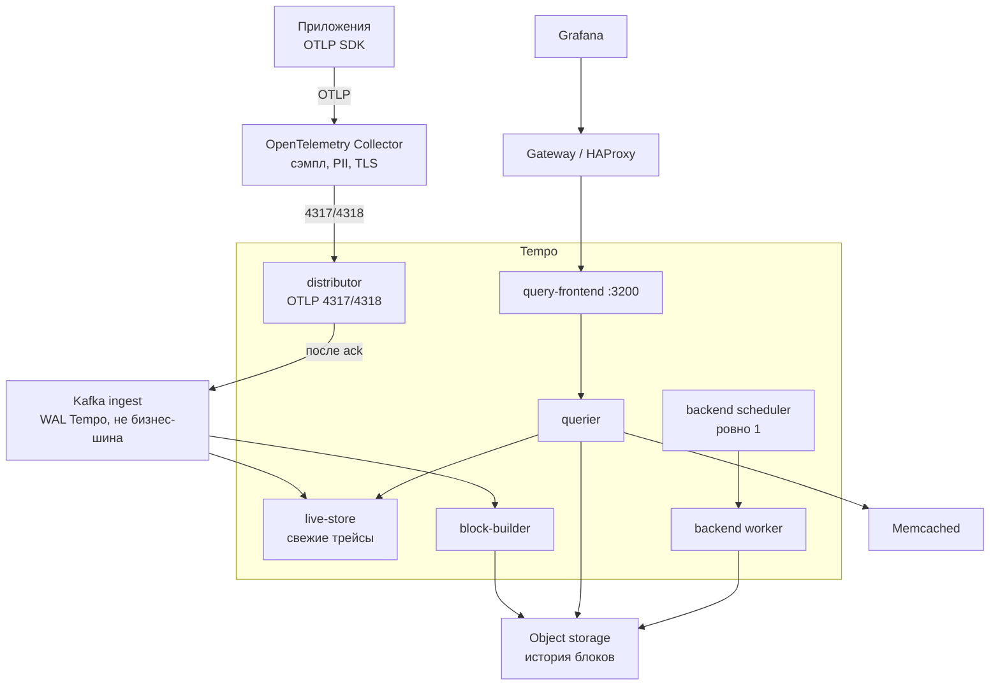

# Grafana Tempo 3.0.3 — развёртывание и настройка

Grafana Tempo — бэкенд распределённой трассировки: хранит цепочки вызовов («клиент вызвал API → API дернул Kafka → Camunda ждала ведомство») и отдаёт их по Trace ID или через язык TraceQL. Этот документ про **свою установку** версии **3.0.3** (патч линии 3.0, опубликован 13 августа 2026; на дату подготовки — последний стабильный патч линии 3.0).

Документация: https://grafana.com/docs/tempo/latest/  
Релиз 3.0: https://grafana.com/docs/tempo/latest/release-notes/v3-0/  
Образ: `grafana/tempo:3.0.3`.  
На Kubernetes официальные пути: Helm-чарт **`tempo-distributed`** (репозиторий `grafana-community/helm-charts`) и **Tempo Operator** (`TempoStack`).

Линия 3.0 — major с ломающей архитектурой: ingester и compactor **удалены**. Писать бой на 2.x «потому что привычнее» — значит сразу закладывать миграцию без in-place downgrade. В бой берём **уже вышедший патч 3.0.3**, не `latest` и не 2.10.x.

Helm-чарт `tempo-distributed` **3.0.6** (17 июля 2026) по умолчанию тянет **Tempo 3.0.2**. Образ нужно **переопределить на 3.0.3**: в 3.0.3 закрыты CVE через обновление Go 1.26.5, gRPC, `x/net`, `x/text` и OpenTelemetry. Чарты Grafana после 30 января 2026 живут в `grafana-community/helm-charts`, не в старом `grafana/helm-charts`.

Это не Grafana Cloud Traces: там другие манифесты, их сюда копировать нельзя.

Этот текст — не набор команд «скопируй values.yaml», а правила, без которых система не будет одновременно устойчивой к сбоям, масштабируемой и безопасной. Пошаговая установка — в `Grafana Tempo.install.md`.

---

## Назначение системы

Tempo нужен, чтобы **связать шаги одного запроса** через микросервисы, Kafka, Camunda и интеграционное API. Когда «заявка зависла», лог одного пода не показывает цепочку. Трейс как раз про это: найти конкретный запрос по Trace ID из заголовка `traceparent` за секунды; искать «все вызовы дольше N секунд» через TraceQL (это уже дороже).

Система **наблюдает** вызовы. Она **не** оркестрирует Camunda, **не** ходит в госслужбы вместо интеграционного API, **не** хранит эталон клиента и **не** заменяет логи (Loki) и метрики (Prometheus). Если в спаны положить тело ответа ведомства или карточку клиента — Tempo станет архивом персональных данных с поиском по атрибутам.

---

## Перечень функций

Что умеет self-hosted Tempo OSS 3.0.3:

1. **Принимать трейсы** по OTLP (gRPC обычно порт **4317**, HTTP — **4318**). Jaeger/Zipkin-приёмники в конфигурации ещё есть; OpenCensus в 3.0 **убран**. Практичный контракт для новой системы: **только OTLP**.
2. **Доставать трейс целиком по Trace ID** дёшево — главная суперсила Tempo.
3. **Искать по TraceQL** («найди трейсы сервиса X дольше 2 секунд»). С 3.0 TraceQL metrics — GA (`rate()`, средняя длительность); алертинг по ним — experimental.
4. **Работать монолитом** (`-target=all`) для теста: один процесс, Kafka **не** нужен. Grafana для боя так ставить не рекомендует.
5. **Работать микросервисами** для боя: distributor, live-store, block-builder, querier, query-frontend, backend scheduler/worker. **Нужен Kafka-совместимый брокер** как буфер записи и **object storage** как долгое хранилище.
6. **Держать свежие трейсы в live-store** (память + локальный WAL), пока блок ещё не в object storage. Типичное окно в документации — минуты–около часа.
7. **Собирать Apache Parquet-блоки** (block-builder) и класть их в S3 / GCS / Azure / S3-совместимое. Блок пишется **один раз** (RF1).
8. **Компактить и удалять старое** (backend scheduler раздаёт работы, worker исполняет). Одновременно должен работать **только один** scheduler. Дефолт хранения манифеста: **336 часов = 14 дней**.
9. **Отдавать HTTP API** на порту **3200** (`/api/...`, `/metrics`) и внутренний gRPC на **9095**. Своего «дашборда как у Wazuh» нет — UI это Grafana.
10. **Изолировать тенантов** заголовком `X-Scope-OrgID`. Клиентов, которые сами ставят этот заголовок, Tempo **считает доверенными**. Встроенной аутентификации **нет**.

Чего система **не** делает и часто путают: она не сэмплирует сама (это Collector или SDK); не копирует историю на три инстанса, как в 2.x (долговечность ingest — у Kafka, истории — у object storage); не является шиной бизнес-событий (Kafka Tempo — отдельный топик-WAL, не `client.updated`). Несколько монолитных инстансов как кластер в 3.0.3 из документации **убрали**. По умолчанию OTLP с Tempo **2.7** слушает **localhost**, не `0.0.0.0` — в Docker/Kubernetes endpoint надо явно биндить.

---

## Требования к развёртыванию

### Требования к ПО

| Что | Что ставить | Комментарий |
|---|---|---|
| **Формат поставки** | Контейнеры Docker **или** поды Kubernetes | Образ `grafana/tempo:3.0.3`. Тест — монолит. Бой — чарт `tempo-distributed` (образ **переопределить** с 3.0.2 на 3.0.3) или Tempo Operator. |
| **Kubernetes** | Свой кластер ≥ **1.25** для чарта `tempo-distributed` 3.0.6 | Требование чарта. Не `latest`. |
| **ОС** | Linux x86_64 / ARM64 | Это основной контур. **Боевой Tempo на Windows-хосте в схеме с Kubernetes не предполагается.** |
| **Kafka** | Только микросервисный режим | Apache Kafka / Redpanda / WarpStream. Топик ingest создаём **вручную**. Автосоздание на **1000 партиций** — авария на боевом кластере. |
| **Object storage** | S3 / GCS / Azure / S3-совместимое | Без него прод-микросервисы Tempo **не живут**. `backend: local` и docker-MinIO вендор помечает как test/eval, **not production**. |
| **Memcached** | Кэш чтения (bloom, parquet-footer) | Redis для кэша Tempo — experimental. |
| **OpenTelemetry Collector** | Сэмплирование, PII, батч, заголовок тенанта | **Не часть Tempo**, но в бою без него почти всегда плохо. Приложения не пишут в Tempo в обход Collector. |
| **Диск WAL** | CSI-тома RWO, локальные, не NFS | Live-store и block-builder. Без PVC рестарт пода = дырка в свежих трейсах. |
| **Вход** | Reverse proxy / gateway | Цитата документации: *Grafana Tempo does not come with any included authentication layer.* |
| **Часы** | NTP | TraceQL и окна компакции завязаны на время спанов. |

Java на сам Tempo **не нужна**. Java понадобится рядом, если приложения так инструментированы.

### Требования к ресурсам

Цифр «сколько ядер на ваши терабайты трейсов» у проекта **нет** — нагрузки в исходном запросе не было. Ниже ориентиры Grafana «с чего начать» (страница Size the cluster); вендор предупреждает, что цифры живут от релиза к релизу. Это не смета закупки.

| Компонент | Старт по входу | CPU / RAM (ориентир вендора) |
|---|---|---|
| **Distributor** | 1 реплика на **~10 MB/s** входа | **2 ядра / 2 ГБ** |
| **Live-store** | 1 реплика на **~6–10 MB/s**; в Helm — **~10 MB/s** на активную реплику | **1 ядро / 4–20 ГБ** (зависит от состава трейса) |
| **Block-builder** | 1 реплика на партицию Kafka | **0.5 ядра / 5–10 ГБ** |
| **Querier** | 1 реплика на **~1–2 MB/s** входа (для «типичного» поиска) | RAM **4–20 ГБ** |
| **Query-frontend** | **2 реплики** (HA) | **4–20 ГБ** |
| **Backend scheduler** | **ровно 1** | **0.5 ядра / 1–2 ГБ** |
| **Backend worker** | по нагрузке компакции (у вендора «to be determined») | **0.5 ядра / 1–2 ГБ** |
| **Учебный монолит / Helm quick-test** | одна партиция | нода **от 6 CPU / 16 ГБ RAM** — лабораторный минимум, не бой |

Дополнительно:

- Грубая арифметика хранения (порядок величины, не смета): `объём ≈ пиковый_MB/s × доля_сэмпла × 86400 × дни_retention`. Пик неизвестен — **цифры PVC/бакета нет**.
- Три копии live-store на партицию (все зоны) = **×3 чтение Kafka** той же партиции.
- Дефолтные лимиты ingest из примеров Helm (это **пример**, не закон): 5 MB/s на тенанта, 1000 live traces, 10 MB на трейс.
- «Терабайты» в озере **не** равны терабайтам в Tempo. Наполняют: 100% сэмплирование, огромные атрибуты, длинный retention.

---

## Основные элементы системы и зависимости

Это одно ПО из **нескольких процессов** (один бинарник, разные `-target`). Ниже — те, что живут отдельными инстансами, и как они вызывают друг друга.

### Схема инстансов и потоков

Как читать схему:

1. Приложения шлют OTLP в **Collector**, не напрямую в каждый под Tempo. Collector батчит, сэмплирует, режет персональные данные, ставит заголовок тенанта.
2. **Distributor** принимает спаны и в микросервисах пишет в **Kafka**. Пока Kafka не подтвердила запись — клиенту «успех» не возвращают.
3. **Live-store** держит свежие трейсы, чтобы искать через секунды. **Block-builder** читает Kafka, собирает Parquet-блоки, кладёт в object storage **один раз** (RF1).
4. Поиск: Grafana → gateway → **query-frontend** → **querier** ходит в live-store и в бакет. На порты Kafka и memberlist клиентов не пускают.
5. **Backend scheduler** — ровно один процесс: компакция, retention. Падение этого пода = останавливается компакция, **не** приём трейсов.
6. В монолите (тест) Kafka нет: всё in-process, хранение часто `local`. Это другой режим отказа, чем бой.

Рядом, но это уже другое ПО: Kafka ingest, object storage, Memcached, Collector, Grafana, gateway. Их отказ проектируется отдельно. Tempo по умолчанию готов **автосоздать топик на 1000 партиций** — на боевой шине событий так нельзя.

### Что входит в состав

| Роль | Зачем | Как масштабируется |
|---|---|---|
| **Distributor** | Приём спанов, лимиты, запись в Kafka | Горизонтально: больше реплик |
| **Live-store** | Свежие трейсы | По числу партиций × число зон |
| **Block-builder** | Сборка блоков → object storage | Обычно 1 реплика на Kafka-партицию |
| **Query-frontend** | API поиска | 2+ реплики для HA |
| **Querier** | Исполнение кусков запроса | Горизонтально под объём поиска |
| **Backend scheduler** | Очередь компакции/retention | **Ровно 1** |
| **Backend worker** | Исполнение этих работ | Горизонтально |
| **Metrics-generator** | Метрики из спанов | Опционально, отдельно |

### Порты (контракт сети)

| Порт | Назначение | Кому открывать |
|---|---|---|
| **4317/TCP** | OTLP gRPC | Collector → distributor. Не мир |
| **4318/TCP** | OTLP HTTP | То же |
| **3200/TCP** | HTTP API Tempo, `/metrics` | Gateway / Grafana. Не мир |
| **9095/TCP** | Внутренний gRPC | Только компоненты Tempo |
| **7946/TCP+UDP** | Memberlist (gossip кольца) | Только члены кластера Tempo |
| **11211/TCP** | Memcached | Querier. Отдельное ПО |

С Tempo **2.7** OTLP-приёмник по умолчанию слушает **localhost**. В контейнере без явного `0.0.0.0` соседний Collector получит пустой Tempo.

### Зависимости окружения

- Прямая связность: distributor → Kafka, querier → live-store (gRPC), все → object storage, gossip-члены → 7946.
- StatefulSet со стабильными ordinal'ами для live-store и block-builder (привязка к партициям).
- Идентификация: gateway аутентифицирует; Tempo видит только выставленный `X-Scope-OrgID`. Ключи S3 и SASL Kafka — в Vault, не в ConfigMap.

---

## Краткие вводные

### Как устроена отказоустойчивость

Это **три разных контура**. Путать их — главная ошибка.

**1) Приём (distributor + Kafka)**

| Что падает | Что происходит |
|---|---|
| Один distributor | Collector идут на Service, живые реплики принимают |
| Kafka не подтвердила запись | Distributor **не** считает запись успешной. Клиенту — ошибка. Это правильно |
| Весь дата-центр с частью брокеров | Как у Kafka: переживает 1 площадку только при RF=3, min.ISR=2. Tempo RF1 **не** спасает, если Kafka потеряла данные |
| Collector смотрит в один под без Service | Падение этого пода = слепой ingest |

HA приёма = несколько distributor + Service + **живой Kafka-кластер**. Tempo здесь тонкий.

**2) Свежие данные (live-store)**

| Что падает | Что происходит |
|---|---|
| Live-store одной зоны при zone-aware (две+ зоны) | Другая зона отдаёт ту же партицию. Чтение: кворум **1** |
| Все live-store партиции | Свежее окно недоступно из памяти. История в object storage ещё может искаться |
| PVC потерян, Kafka retention ещё держит | Реплей. Если Kafka уже вычистила — дырка |

В 3.0.2+ по умолчанию `live_store.fail_on_high_lag=true`: лаг Kafka пересекается с окном запроса — **ошибка**, а не «тихо неполный результат».

**3) История (object storage + block-builder + scheduler)**

| Что падает | Что происходит |
|---|---|
| Один block-builder | Его партиция перестаёт собираться, пока под не вернётся. Данные пока в Kafka. Если retention Kafka истечёт раньше — **потеря истории** |
| Backend scheduler | Приём идёт. Компакция и retention **встают**. Автовыбора второго scheduler **нет** |
| Object storage недоступен | Новые блоки не пишутся; старые не читаются. Это потеря **всей** исторической трассировки |
| Object storage живёт в одном дата-центре | Падение этой площадки = RPO по всей истории, сколько ни ставьте live-store в трёх залах |

Официально: после ack Kafka Tempo работает с **RF1**. Второй копией истории Tempo не занимается.

### Как устроено масштабирование

Единица параллелизма write path — **Kafka-партиция Tempo**, не «ещё один Deployment».

1. Distributor шардирует по **hash(Trace ID)** → все спаны одного трейса на одну партицию.
2. Чтобы добавить инстансы live-store / block-builder, нужно **сначала** добавить партиции Kafka, потом реплики StatefulSet. С `partitions_per_instance: 1` число block-builder = число партиций.
3. Querier масштабируется отдельно под поисковую нагрузку (огромная при широком TraceQL, нулевая при «только Trace ID»).
4. Autoscaling distributor относительно безопасен. Autoscaling block-builder «как HTTP Deployment» **ломает** привязку к партициям.

Рычаги объёма, когда появятся цифры: сэмпл в Collector, `max_bytes_per_trace` / `rate_limit_bytes`, `block_retention`, лимиты metrics-generator.

### Безопасность самого Tempo

Компрометация Tempo / бакета / Kafka-топика ingest = карта вызовов всей системы: кто с кем говорит, идентификаторы заявок, тайминги интеграций, иногда персональные данные в атрибутах.

Факты из документации:

1. **Встроенной аутентификации нет.** Анонимный доступ к 3200/4317 = читать и писать трейсы.
2. **`X-Scope-OrgID` — не пароль.** Подставить чужой OrgID может кто угодно, пока прокси не выставляет его **сам** после логина.
3. **`multitenancy_enabled` по умолчанию `false`.** Один общий тенант: любой читатель видит всё.
4. **`log_received_spans`** помечен как не для боя: пишет спаны в лог процесса.
5. Ключи object storage и SASL Kafka в ConfigMap — обычная дыра Helm-установок.
6. Трейс с телом SOAP/REST ведомства — уже контур персональных/служебных данных.

«Включили tempo-distributed и отдали query-frontend в интернет» — это новый внешний архив трассировки, не «просто мониторинг». Штатный TLS — не СКЗИ по требованиям КИИ, если ИБ их выдвинет.

---

## Допущения

Ниже то, чего не было в исходном запросе, но без чего нельзя нарисовать конкретную схему. Если допущение неверно — схему надо пересмотреть.

1. Берём **self-hosted OSS Tempo 3.0.3**, не Grafana Cloud Traces и не Enterprise Traces.
2. Бой — **микросервисный режим** + внешние Kafka и object storage. Тест — **монолит**, без Kafka.
3. Три дата-центра = три зоны отказа Kubernetes. Tempo не делает «магический stretch». Пока RTT неизвестен, один логический кластер — только если Kafka, object storage и memberlist реально живут на этой сети.
4. Цель отказа: пережить **1** дата-центр, не 2 из 3. Scheduler один. Object storage должен сам переживать 1 площадку. Live-store — минимум **две** зоны в документации (пример RF2, quorum 1).
5. Kafka для ingest Tempo — **отдельный** кластер (или жёстко изолированный топик), не общая шина событий. Автосоздание топика с 1000 партиций на боевом кластере — отдельная авария.
6. Object storage — production-grade S3 API. Локальный `backend: local` и docker-MinIO — test/eval, not production. Community MinIO: upstream archived, бинарники CE больше не публикуют.
7. Нагрузка неизвестна — нет числа партиций, реплик и терабайт бакета.
8. Формального SLA на «каждый запрос протрассирован» нет. Сэмплирование будет (ошибки/медленные почти 100%, остальное N%).
9. Инструментация — OpenTelemetry SDK + Collector. ПДн и тела интеграций в спаны не кладём. Redaction API 3.0 — аварийный инструмент, не политика «можно писать всё».
10. TLS — стандартный (не ГОСТ). Grafana как UI уже будет или появится.
11. Один тенант Tempo на контур (prod / test раздельно), `multitenancy_enabled: true` даже для одного OrgID.
12. Учебный стенд изолирован. На нём допустимы insecure OTLP и local storage. Формат экспорта OTLP и запрет PII лучше сразу как в бою.

---

## Критически важные условия, которых нет в исходном контексте

Их нужно закрыть **до** «поставили чарт и забыли».

| Пробел | Почему это ломает решение |
|---|---|
| **RTT и потери между дата-центрами** на memberlist 7946, Kafka, S3, gRPC querier↔live-store | Порога в доке Tempo нет. Если сеть «как WAN с джиттером» — не растягивать один Tempo+Kafka |
| **Профиль нагрузки в MB/s** | Сайзинг от спанов/с и размера спана, не от слова «высокая» |
| **Сэмплирование** | Иначе object storage и Kafka Tempo станут вторым озером |
| **Object storage на отказ площадки** | Tempo историю **не** реплицирует. Прогнать отказ бакета, не только подов Tempo |
| **Kafka ingest vs бизнес-Kafka** | Пик трейсов забивает диск брокеров и латентность `acks=all` у Camunda |
| **Политика ПДн в спанах** | Allowlist атрибутов; запрет raw payload |
| **SLA поиска** | TraceQL по широкому окну бьёт querier. Квоты, таймауты, Memcached |
| **Кто ходит в Tempo** | Нет auth. Нужен gateway + IdP |

---

## Краткое описание ключевых этапов и элементов развертывания

Общий каркас (и тест, и бой):

1. Зафиксировать **3.0.3** (не тег чарта 3.0.2, не 2.x).
2. Тест — монолит и `backend: local`. Бой — микросервисы, Kafka ingest, object storage.
3. OTLP явно на `0.0.0.0` в контейнере. Collector — единственная точка от приложений.
4. Выпустить TLS и gateway **до** боевого трафика. Нет публичного 3200/4317.
5. Overrides-лимиты (`rate_limit_bytes`, `max_bytes_per_trace`) включить до открытия контура.
6. Прогнать write → read Trace ID → простой TraceQL. Убить distributor / live-store / scheduler и понять, что именно встало.

Боевая схема на несколько дата-центров — в `Grafana Tempo.install.md`. Ниже — только учебный стенд.

---

### 1 инстанс: тестовый стенд, 1 площадка, без нагрузки

**Цель стенда:** OTLP → поиск в Grafana по Trace ID и простому TraceQL. **Не** цель: доказать отказ дата-центра и Kafka-WAL.

**Режим:** monolithic (`-target=all`). Kafka **не ставить** «для правды теста» — в монолите его нет в write path.

**Путь A — Docker** (быстрее понять продукт): один процесс, `storage.trace.backend: local`, порты 3200/4317/4318 на localhost. OTLP явно `0.0.0.0` внутри контейнера, на хосте — только `127.0.0.1`.

**Путь B — Kubernetes:** один StatefulSet/Deployment Tempo 3.0.3, PVC на `/var/tempo`, Service 4317/4318/3200. Этот YAML в бой не копировать.

Состав рядом: один Collector contrib (на тесте `tls.insecure: true` допустим **только здесь**), Grafana + datasource Tempo на `http://tempo:3200`, одно-два приложения с OTel SDK (или `telemetrygen` / Vulture).

#### Что сознательно упрощаем

| Параметр | На тесте | Почему можно |
|---|---|---|
| Режим | monolithic | Иначе команда утонет в Kafka раньше OTLP |
| Хранение | `local` на volume | Вендор: не для боя |
| Kafka | нет | В монолите не в write path |
| TLS OTLP | insecure допустим | Изолированный стенд |
| Сэмпл | можно 100% | Нет нагрузки; в бой не копировать |
| `log_received_spans` | выкл | Не полезная привычка |
| 3200/4317 с мира | запрещён | Даже «на посмотреть» |

#### Чего на тесте **не** стоит упрощать

- Тег **3.0.3**, не 3.0.2 «потому что чарт» и не 2.10.
- OTLP через Collector, не из каждого пода в обход.
- Тела HTTP/XML ведомств в атрибуты не класть.
- Формат экспорта как в бою.
- Понимание: монолит на local **не** доказывает zone-aware, scheduler=1 и RF1.

#### Сильные стороны такой схемы

- Совпадает с официальным getting started. Мало движущихся частей.
- Дёшево проверить инструментацию: запрос прошёл → в Grafana тот же Trace ID, что в `traceparent`.

#### Слабые стороны (обязательно понимать)

- Ничего не говорит про Kafka-WAL, zone-aware, scheduler=1, object storage.
- Другой failure mode, чем у боя.
- Легко привыкнуть слать 100% спанов и персональные данные.

Практическая рекомендация: препрод = маленькая **копия боевой топологии** (микросервисы, Kafka ingest, бакет, gateway, лимиты) даже без боевого трафика. Всё это **в одном** дата-центре.

---

## Сводка: что считать «экземпляр готов»

| Требование | Тест (1 площадка) | Бой |
|---|---|---|
| Отказоустойчивость | Не требуется | Микросервисы; Kafka ingest RF=3/min.ISR=2; object storage переживает 1 площадку; live-store ≥2 зоны внутри кластера; scheduler=1 с runbook; PVC на WAL. Схема на 2–3 дата-центра — в `Grafana Tempo.install.md` |
| Производительность / масштаб | Не требуется | Партиции как единица масштаба; сайзинг от MB/s; сэмпл; retention не «как озеро»; Memcached; querier отдельно от ingest |
| Безопасность | PLAINTEXT только в изоляции | Нет публичного 3200/OTLP; gateway+TLS; тенант; ACL Kafka; ключи бакета в Vault; PII не в спанах |

**Не готов к бою**, если: monolithic на нагрузке; `backend: local`; docker-MinIO как «хранилище на годы»; ingest на боевом Kafka с auto-create 1000 партиций; образ чарта 3.0.2 без патча 3.0.3; query-frontend в интернете без auth; 100% спанов с телами ведомств; два scheduler; RTT неизвестен, а схема уже stretch.

---

## Источники (чтобы не принимать на веру)

- Релиз v3.0.3 (13 Aug 2026): https://github.com/grafana/tempo/releases
- Release notes 3.0 (RF1, scheduler/worker, TraceQL metrics GA): https://grafana.com/docs/tempo/latest/release-notes/v3-0/
- Планирование, Kafka обязателен в микросервисах: https://grafana.com/docs/tempo/latest/set-up-for-tracing/setup-tempo/plan/
- Режимы deployment: https://grafana.com/docs/tempo/latest/reference-tempo-architecture/deployment-modes/
- Live-store, zone-aware, quorum 1: https://grafana.com/docs/tempo/latest/reference-tempo-architecture/components/live-store/
- «Only one scheduler»: https://grafana.com/docs/tempo/latest/configuration/
- Сайзинг: https://grafana.com/docs/tempo/latest/set-up-for-tracing/setup-tempo/plan/size/
- Auth отсутствует: https://grafana.com/docs/tempo/latest/operations/authentication/
- Манифест дефолтов (порты, `block_retention: 336h`, auto-create 1000 партиций): https://grafana.com/docs/tempo/latest/configuration/manifest/
- Object storage, local для dev: https://grafana.com/docs/tempo/latest/reference-tempo-architecture/object-storage/
- Artifact Hub `tempo-distributed` 3.0.6 → appVersion **3.0.2**, K8s **^1.25**: https://artifacthub.io/packages/helm/grafana-community/tempo-distributed

Утверждения про «типичный порог RTT для трёх ЦОДов» и про «хватит N реплик под ваши терабайты» в документации Grafana Tempo **отсутствуют**.
