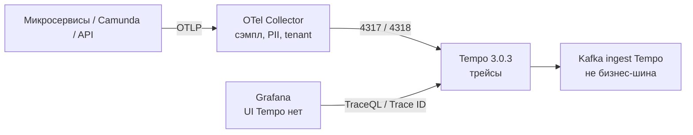
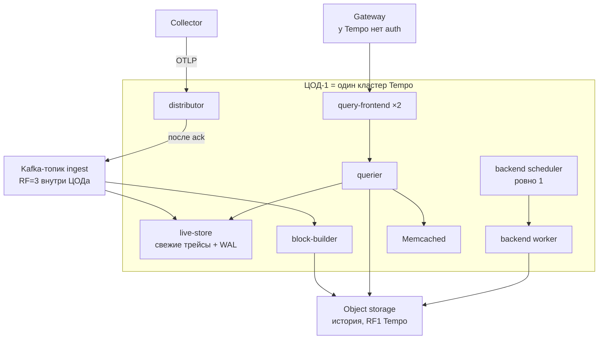
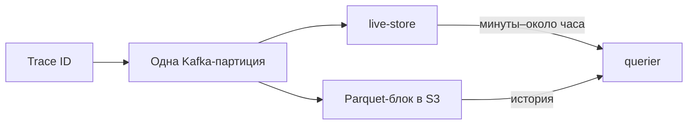
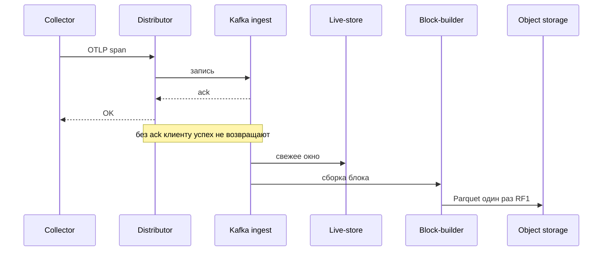
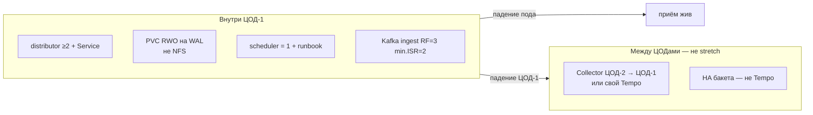
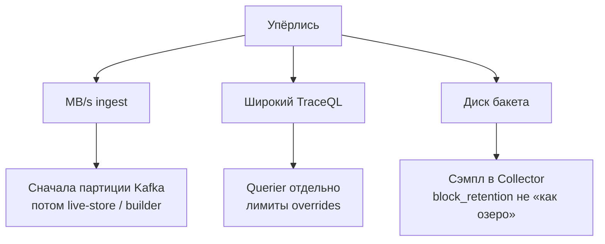
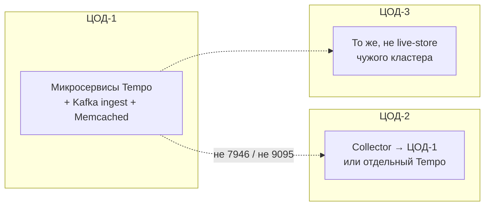

# Grafana Tempo 3.0.3 — схемы устройства

Связанные документы: правила — `Grafana Tempo.md`; установка — `Grafana Tempo.install.md`.

C4 / «D4»: контекст → контейнеры → компоненты. Код SDK не рисуем.

Допущения: stretch микросервисов одного кластера на 2–3 ЦОДа **нет**; линия **3.0** — ingester и compactor **удалены**; Helm `tempo-distributed` 3.0.6 по умолчанию тянет **3.0.2** — образ **переопределить на 3.0.3**; нагрузка не замерена.

---

## 1. Контекст

Tempo — **бэкенд трейсов** (Trace ID дёшево, TraceQL дороже). Не логи, не метрики нод, не SoT карточки.

Приложения **не** пишут в Tempo в обход Collector. Тело SOAP ведомства в атрибуте — нелегальный архив ПДн, не «observability».

---

## 2. Контейнеры (микросервисы одного ЦОДа)

Монолит `-target=all` — стенд, без Kafka в write path. Прод — роли одного бинаря + внешние Kafka и object storage.

Порты: **4317** OTLP gRPC, **4318** HTTP, **3200** API, **9095** внутренний gRPC, **7946** memberlist. С 2.7 OTLP по умолчанию **localhost** — в K8s биндить явно.

**Сильное:** после ack Kafka Tempo работает RF1 — экономия места. **Слабое:** вторую копию истории Tempo **не** делает; её дают Kafka (коротко) и бакет (долго).

---

## 3. Компоненты данных

Параллелизм write path = **число партиций**, не «ещё один Deployment». `partitions_per_instance: 1` → число block-builder = число партиций. Autoscaling builder «как HTTP» **ломает** привязку.

Scheduler: цитата доки — *only one at a time*. Два scheduler — конфликт работ, не HA.

---

## 4. Поток записи (ingest)

`fail_on_high_lag: true` (дефолт 3.0): лучше ошибка «свежие данные отстают», чем тихий неполный TraceQL.

---

## 5. Что настраивать: отказоустойчивость

| Ручка | Если не настроить |
|---|---|
| Override образа **3.0.3** | Чарт оставит 3.0.2 без CVE-патча Go |
| Топик руками, не auto-create | Дефолт **1000 партиций** на боевом кластере |
| Gateway + `X-Scope-OrgID` с прокси | Анонимный 3200 = читать все трейсы |
| Retention топика > цикл builder | Реплей не успеет — дырка в истории |

Падение scheduler: **приём идёт**, компакция/retention встают. Падение бакета = потеря **всей** истории.

---

## 6. Что настраивать: масштабируемость

Формула объёма порядка: пиковый MB/s × доля сэмпла × 86400 × дни retention. Пика нет — **цифры бакета нет**. Дефолт манифеста retention **336h**.

---

## 7. Прод: 2 или 3 ЦОДа без stretch

Не открывать memberlist между ЦОДами «чтобы один кластер». Не ставить второй scheduler в ЦОД-2.

**Сильное:** memberlist и ingest локальные. **Слабое:** падение ЦОД-1 = нет этого Tempo; второй кластер чужие блоки сам не подхватит.

---

## 8. Безопасность (ручки на той же схеме)

Встроенной auth **нет**. Gateway сам ставит OrgID после логина — `X-Scope-OrgID` не пароль. `multitenancy_enabled` дефолт **false**. `log_received_spans` не для прода. Ключи S3/SASL — Vault, не ConfigMap.

Источники: `Grafana Tempo.md`. Порога RTT у Tempo **нет**.
