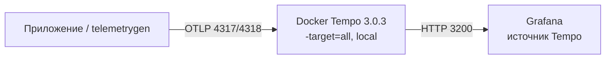

# Grafana Tempo 3.0.3 — установка (учебный контур)

Grafana Tempo — хранилище **трейсов** (цепочек вызовов: API → Kafka → Camunda). Своего UI нет: смотрят в **Grafana**. Ставите **свою** копию **3.0.3**, образ `grafana/tempo:3.0.3`, не Grafana Cloud Traces.

**Допущение:** закрытая сеть, один Docker-монолит (`--target=all`), **без Kafka**, `backend: local`. Учебный запуск в прод не копировать. Линия 3.0: ingester и compactor **удалены**. Несколько монолитов как кластер из документации **убрали**.

**Docker** — программа, которая запускает **образ** (упакованная программа с зависимостями) как **контейнер**. Конфиг — из [Deploy on Linux](https://grafana.com/docs/tempo/latest/set-up-for-tracing/setup-tempo/deploy/locally/linux/) (монолит без Kafka). Официальный Compose `single-binary` тянет Redpanda — **не** этот стенд.

---

## Куда ставить и сколько ресурсов (учебный контур)

**Куда.** Одна Linux-машина (или Docker Desktop к ней) **рядом** с учебным контуром, не «кластер на три зала». Процесс Tempo — монолит: один контейнер делает приём, хранение и поиск. Порты **3200** (HTTP API), **4317** (OTLP gRPC), **4318** (OTLP HTTP) на хосте только `127.0.0.1`. Между площадками не открывать **7946** / **9095** / **4317** «чтобы один кластер».



Боевой Tempo на Windows-хосте в схеме с Kubernetes карточка не предполагает. На учёбе достаточно Docker.

**Сколько.** Цифр «хватит под ваши терабайты» у вендора **нет**. Ниже — старт **монолита на одной ноде**, не смета закупки и не сайзинг микросервисов.

| Зачем | CPU | RAM | Диск | Откуда |
|---|---|---|---|---|
| Хост самого Tempo, монолит | **4** ядра | **4–8 ГБ** | локальный volume; гигабайт вендор не нормирует | [Deploy on Linux](https://grafana.com/docs/tempo/latest/set-up-for-tracing/setup-tempo/deploy/locally/linux/) |
| На той же машине ещё Grafana / Collector | те же 4 ядра | **от 16 ГБ** | то же | та же страница: colocation увеличивает давление на память |

Сайзинг микросервисов (distributor ~10 MB/s → 2 ядра / 2 ГБ и т.д.) — страница [Size the cluster](https://grafana.com/docs/tempo/latest/set-up-for-tracing/setup-tempo/plan/size/); к этому Docker-стенду не применяется. Нагрузки в контексте платформы нет — **не** обещать «хватит».

**Сильная сторона:** совпадает с официальным монолитом, Kafka не нужна, за минуты виден Trace ID. **Слабая:** другой режим отказа, чем у боя (там Kafka ingest + object storage + один scheduler).

**Критично:** 3200/4317/4318 в интернет не публиковать. С Tempo **2.7** OTLP по умолчанию слушает **localhost** внутри процесса — без `0.0.0.0` соседний Collector получит пустой Tempo. Не тег `latest`, не образ чарта **3.0.2**. `backend: local` вендор помечает как development/test, не production.

---

## Установка для новичка

Команды — в Linux-shell на машине стенда (Docker Desktop: тот же `docker run`; в PowerShell путь к файлу — `${PWD}`). Официальные шаги конфига: https://grafana.com/docs/tempo/latest/set-up-for-tracing/setup-tempo/deploy/locally/linux/  
Проверка потока: https://grafana.com/docs/tempo/latest/set-up-for-tracing/setup-tempo/test/test-monolithic-local/

### Что должно быть до установки

**Есть:**

- Docker Engine (демон запущен)
- свободны на localhost порты **3200**, **4317**, **4318**
- закрытая сеть
- Grafana на стенде уже есть или появится (`Grafana.install.md`) — без неё «открыть Tempo как Grafana» нельзя

**Нет:**

- Kafka «для правды теста» — в монолите её нет в write path
- публикации 3200/4317/4318 на `0.0.0.0`
- Helm `tempo-distributed` (это микросервисы + Kafka; чарт **3.0.6** по умолчанию тянет Tempo **3.0.2**)

### Этап 1. Docker и порты

**Что делаем:** проверяем, что Docker жив и порты свободны.

```bash
docker version
```

Успех: клиент и Server отвечают. `Cannot connect to the Docker daemon` — демон не запущен.

### Этап 2. Файл `tempo.yaml`

**Что делаем:** пишем конфиг монолита. YAML с [Deploy on Linux](https://grafana.com/docs/tempo/latest/set-up-for-tracing/setup-tempo/deploy/locally/linux/). OTLP явно на `0.0.0.0`. В образе каталог `/var/tempo` уже создан под uid **10001**; в deb-гайде пути `/data/tempo/...` — тот же local backend, другая раскладка на диске хоста.

```yaml
stream_over_http_enabled: true

server:
  http_listen_port: 3200

distributor:
  receivers:
    otlp:
      protocols:
        grpc:
          endpoint: "0.0.0.0:4317"
        http:
          endpoint: "0.0.0.0:4318"

storage:
  trace:
    backend: local
    wal:
      path: /var/tempo/wal
    local:
      path: /var/tempo/blocks

usage_report:
  reporting_enabled: false
```

Успех: файл лежит рядом с командой `docker run`, отступы YAML не сломаны (парсер Tempo строгий).

### Этап 3. Сеть и контейнер

**Что делаем:** создаём Docker-сеть (чтобы Grafana/Collector достучались по имени, не через `127.0.0.1` внутри *их* контейнера) и запускаем образ **3.0.3**. Образ distroless: внутри нет `curl`. `--target=all` — все роли в одном процессе (дефолт, фиксируем явно).

```bash
docker network create tempo-lab
docker volume create tempo-data

docker run -d --name tempo-dev \
  --network tempo-lab \
  -p 127.0.0.1:3200:3200 \
  -p 127.0.0.1:4317:4317 \
  -p 127.0.0.1:4318:4318 \
  -v "$PWD/tempo.yaml:/etc/tempo.yaml:ro" \
  -v tempo-data:/var/tempo \
  grafana/tempo:3.0.3 \
  --target=all \
  --config.file=/etc/tempo.yaml
```

Успех: `docker ps` показывает `tempo-dev` в статусе Up. Привязка к `127.0.0.1` обязательна: `-p 3200:3200` без адреса часто слушает все интерфейсы.

Если Grafana уже в контейнере `grafana-dev`:

```bash
docker network connect tempo-lab grafana-dev
```

### Этап 4. Процесс готов

**Что делаем:** с хоста проверяем HTTP API. `GET /ready` → **200**, когда Tempo готов отдавать трафик.

```bash
curl -sS -o /dev/null -w "%{http_code}\n" http://127.0.0.1:3200/ready
curl -sS http://127.0.0.1:3200/api/status/buildinfo
```

Успех: первая команда печатает `200`; в buildinfo версия **3.0.3**, не 2.x и не 3.0.2. Не поднялся — `docker logs tempo-dev` (часто YAML или нет прав на `/var/tempo`).

### Этап 5. OTLP: порты и пробный трейс

**Порты приёма** (на хосте только loopback):

| Порт | Протокол | Кто стучится |
|---|---|---|
| **4317/TCP** | OTLP gRPC | Collector или `telemetrygen` |
| **4318/TCP** | OTLP HTTP | то же, HTTP-экспортёр |
| **3200/TCP** | HTTP API Tempo | Grafana, `curl /ready` и поиск. Не OTLP |

**Что делаем:** шлём синтетические трейсы, как на странице Validate: 20 трейсов/с, 5 секунд, insecure gRPC на localhost.

Нужна утилита OpenTelemetry **`telemetrygen`** (отдельная программа, не Tempo). Установка — prerequisite той же страницы Validate.

```bash
telemetrygen traces --otlp-insecure --rate 20 --duration 5s --otlp-endpoint 127.0.0.1:4317
```

Успех: команда завершилась без ошибки соединения. Имя сервиса по умолчанию — `telemetrygen`.

Поиск по API (подождать несколько секунд: flush на local может занять **15–30 с**):

```bash
curl -G -sS http://127.0.0.1:3200/api/search \
  --data-urlencode 'q={ resource.service.name = "telemetrygen" }'
```

Успех: в JSON есть трейсы, не пустой список. Дальше тот же Trace ID смотрят в Grafana (этап «Первый запуск»).

**Чего этот стенд не доказывает:** отказ зала; Kafka-WAL; object storage и RF1; zone-aware live-store; «ровно один scheduler» как отдельный под; выборы лидера (в монолите 3.0.3 их нет); нагрузка в MB/s; TLS и gateway. Рестарт без volume `tempo-data`: свежие трейсы пропали — для local/монолита ожидаемо.

---

## Первый запуск — URL, порт, учётка, смена пароля

У Tempo **нет** встроенного логина и пароля. Цитата вендора: *Grafana Tempo does not come with any included authentication layer.* Менять «пароль Tempo» нечего. Анонимный доступ к **3200** и **4317** = читать и писать трейсы — поэтому на стенде порты только на `127.0.0.1`.

Трейсы смотрят в **Grafana** (источник типа Tempo). UI Grafana — не UI Tempo.

| Что открывать | URL / порт | Учётка |
|---|---|---|
| Grafana (браузер с машины стенда) | `http://127.0.0.1:3000` | это учётка **Grafana** (`Grafana.install.md`: с завода `admin` / `admin`, сразу сменить). К Tempo не относится |
| HTTP API Tempo | `http://127.0.0.1:3200` (`/ready`, `/api/...`) | нет |
| OTLP gRPC | `127.0.0.1:4317` | нет |
| OTLP HTTP | `127.0.0.1:4318` | нет |

Источник в Grafana ([Configure the Tempo data source](https://grafana.com/docs/grafana/latest/datasources/tempo/configure-tempo-data-source/), проверка — [Validate](https://grafana.com/docs/tempo/latest/set-up-for-tracing/setup-tempo/test/test-monolithic-local/)):

1. Connections → Data sources → Add → **Tempo**.
2. URL — **откуда видит процесс Grafana**, не браузер: контейнеры в `tempo-lab` → `http://tempo-dev:3200`. Grafana на самом хосте → `http://127.0.0.1:3200`. Без хвоста `/api` или `/tempo` (это Grafana Cloud). Не порт **9095** (внутренний gRPC).
3. Authentication: **No authentication** (у Tempo пароля нет).
4. Save & Test → сообщение вроде `Data source is working`.
5. Explore → источник Tempo → Search → Run query. Должны быть трейсы `telemetrygen`.

В проде перед 3200 ставят reverse proxy (HAProxy / nginx / OAuth2). На этом стенде прокси нет — и это не «учётка Tempo».

---

## Подключение к своей системе

Контракт платформы: приложения шлют **OTLP** в **OpenTelemetry Collector** (отдельный процесс: батч, сэмпл, срез ПДн). Collector — в Tempo. В обход Collector из каждого пода — не надо. OpenCensus в 3.0 **убран**. Практичный приёмник: **только OTLP**.

Минимальный Collector → Tempo gRPC ([OTel Collector](https://grafana.com/docs/tempo/latest/set-up-for-tracing/instrument-send/set-up-collector/otel-collector/)):

```yaml
receivers:
  otlp:
    protocols:
      grpc:
        endpoint: 0.0.0.0:4317
      http:
        endpoint: 0.0.0.0:4318
processors:
  batch:
exporters:
  otlp:
    endpoint: tempo-dev:4317
    tls:
      insecure: true
service:
  pipelines:
    traces:
      receivers: [otlp]
      processors: [batch]
      exporters: [otlp]
```

`tls.insecure: true` — **только закрытый стенд**. Приложения на хосте: OTLP в Collector на `127.0.0.1:4317` (если порты Collector опубликованы), не напрямую в Tempo, как только стенд проверен.

Клиенты в платформе: микросервисы, Camunda, интеграционное API — SDK OpenTelemetry. Не класть трейсы в **бизнес-топики Kafka**. Тела SOAP/REST ведомств и карточка клиента в атрибуты спана — не «наблюдаемость», а архив ПДн.

**Grafana:** источник Tempo, URL как выше. Корреляции traces→logs (Loki) и traces→metrics (Prometheus) — настройки Grafana, не Tempo.

### Секреты (не в git)

На этом стенде у Tempo нет пароля и нет ключей S3/Kafka.

| Секрет | Где в проде (не этот YAML) | Куда не класть |
|---|---|---|
| Ключи object storage, SASL Kafka ingest | Vault | ConfigMap, git, образ |
| Пароль/SSO Grafana | Vault / IdP | git |
| Учебный `tls.insecure` | только стенд | прод-Collector |

В git — процедура и конфиг без ключей. `tempo.yaml` стенда без секретов класть можно; привычку insecure OTLP — нет.

### Чем продукт не является

| Сосед | Чем отличается |
|---|---|
| Grafana | UI; Tempo — склад трейсов |
| Prometheus | метрики, не трейсы |
| Loki / логи | Tempo логи не хранит |
| Бизнес-Kafka | не WAL Tempo; на стенде Kafka нет |
| Эталон карточек / SoT | Tempo не источник правды по клиенту |
| Сэмплер | Tempo сам не сэмплирует — Collector или SDK |

---

## Ссылки на материал

| Факт | URL |
|---|---|
| Релиз **3.0.3** (13 Aug 2026), CVE через Go 1.26.5 / gRPC / `x/net` / `x/text` / OTel; убраны несколько монолитов как кластер | https://github.com/grafana/tempo/releases/tag/v3.0.3 |
| Архитектура 3.0: RF1, scheduler/worker, ingester/compactor удалены | https://grafana.com/docs/tempo/latest/release-notes/v3-0/ |
| Монолит `-target=all` без Kafka; микросервисы — с Kafka и object storage; `backend: local` только monolithic | https://grafana.com/docs/tempo/latest/set-up-for-tracing/setup-tempo/plan/ |
| Режимы deployment | https://grafana.com/docs/tempo/latest/reference-tempo-architecture/deployment-modes/ |
| Конфиг монолита, OTLP `0.0.0.0:4317/4318`, local WAL/blocks, 4 CPU / 4–8 ГБ, 16 ГБ при Grafana на том же хосте, flush 15–30 с | https://grafana.com/docs/tempo/latest/set-up-for-tracing/setup-tempo/deploy/locally/linux/ |
| `telemetrygen`, Search в Grafana, URL источника `http://localhost:3200` | https://grafana.com/docs/tempo/latest/set-up-for-tracing/setup-tempo/test/test-monolithic-local/ |
| `GET /ready` → 200; `/api/status/buildinfo`; `/api/search`; `/api/traces/{id}` | https://grafana.com/docs/tempo/latest/api_docs/ |
| `--config.file`, `--target`, `--health` / `/ready`; distroless без curl | https://grafana.com/docs/tempo/latest/set-up-for-tracing/setup-tempo/command-line-flags/ |
| Auth нет; `X-Scope-OrgID` выставляет прокси | https://grafana.com/docs/tempo/latest/operations/authentication/ |
| Сайзинг микросервисов (не этот стенд); цифры живут от релиза к релизу | https://grafana.com/docs/tempo/latest/set-up-for-tracing/setup-tempo/plan/size/ |
| Object storage; local — development/testing | https://grafana.com/docs/tempo/latest/reference-tempo-architecture/object-storage/ |
| Collector: 4317/4318 без изменений в 3.0; `localhost` с 2.7; `tls.insecure` только non-prod | https://grafana.com/docs/tempo/latest/set-up-for-tracing/instrument-send/set-up-collector/otel-collector/ |
| Grafana: источник Tempo, порт 3200, без `/tempo` на self-hosted; No authentication | https://grafana.com/docs/grafana/latest/datasources/tempo/configure-tempo-data-source/ |
| Helm `tempo-distributed` **3.0.6** → appVersion **3.0.2**, Kubernetes **^1.25** | https://artifacthub.io/packages/helm/grafana-community/tempo-distributed |
| Образ: USER 10001, `/var/tempo`, ENTRYPOINT `/tempo` | https://github.com/grafana/tempo/blob/v3.0.3/cmd/tempo/Dockerfile |
| Зачем продукт, порты, железо | `Grafana Tempo.md` |
| Словарь | `Grafana Tempo.info.md` |
| Схема стыковки с платформой | `Grafana Tempo.shema.md` |
| Роль консультанта | `Grafana Tempo.consultant.md` |
| UI, учётка Grafana | `Grafana.install.md` |

**В доке вендора нет (и здесь не выдумано):** порог RTT между ЦОДами; гигабайты диска под `backend: local`; «хватит N ядер / партиций под ваши терабайты»; заводской пароль Tempo (слоя аутентификации нет). Официальный Compose `example/docker-compose/single-binary` для 3.x включает Kafka-совместимый брокер — это другой стенд, не эта инструкция.
