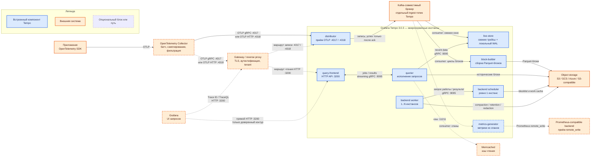

# Grafana Tempo 3.0.3 — развёртывание и настройка

Grafana Tempo — бэкенд распределённой трассировки: хранит цепочки вызовов («клиент вызвал API → API дернул Kafka → Camunda ждала ведомство») и отдаёт их по Trace ID или через язык TraceQL. Этот документ про **свою установку** версии **3.0.3** (патч линии 3.0, опубликован 13 августа 2026; на дату подготовки — последний стабильный патч линии 3.0).

Документация: https://grafana.com/docs/tempo/latest/  
Релиз 3.0: https://grafana.com/docs/tempo/latest/release-notes/v3-0/  
Образ: `grafana/tempo:3.0.3`.  
На Kubernetes официальные пути: Helm-чарт **`tempo-distributed`** (репозиторий `grafana-community/helm-charts`) и **Tempo Operator** (`TempoStack`).

Линия 3.0 — major с ломающей архитектурой: ingester и compactor **удалены**. Писать бой на 2.x «потому что привычнее» — значит сразу закладывать миграцию без in-place downgrade. В бой берём **уже вышедший патч 3.0.3**, не `latest` и не 2.10.x.

Helm-чарт `tempo-distributed` **3.0.6** (17 июля 2026) по умолчанию тянет **Tempo 3.0.2**. Образ нужно **переопределить на 3.0.3**: в 3.0.3 закрыты CVE через обновление Go 1.26.5, gRPC, `x/net`, `x/text` и OpenTelemetry. Чарты Grafana после 30 января 2026 живут в `grafana-community/helm-charts`, не в старом `grafana/helm-charts`.

Это не Grafana Cloud Traces: там другие манифесты, их сюда копировать нельзя.

Этот текст — не набор команд «скопируй values.yaml», а правила, без которых система не будет одновременно устойчивой к сбоям, масштабируемой и безопасной. Пошаговая установка — в `Grafana Tempo.install.md`.

---

## Назначение системы

Tempo нужен, чтобы **связать шаги одного запроса** через микросервисы, Kafka, Camunda и интеграционное API. Когда «заявка зависла», лог одного пода не показывает цепочку. Трейс как раз про это: найти конкретный запрос по Trace ID из заголовка `traceparent` за секунды; искать «все вызовы дольше N секунд» через TraceQL (это уже дороже).

Система **наблюдает** вызовы. Она **не** оркестрирует Camunda, **не** ходит в госслужбы вместо интеграционного API, **не** хранит эталон клиента и **не** заменяет логи (Loki) и метрики (Prometheus). Если в спаны положить тело ответа ведомства или карточку клиента — Tempo станет архивом персональных данных с поиском по атрибутам.

---

## Перечень функций

Что умеет self-hosted Tempo OSS 3.0.3:

1. **Принимать трейсы** по OTLP (gRPC обычно порт **4317**, HTTP — **4318**). Jaeger/Zipkin-приёмники в конфигурации ещё есть; OpenCensus в 3.0 **убран**. Практичный контракт для новой системы: **только OTLP**.
2. **Доставать трейс целиком по Trace ID** дёшево — главная суперсила Tempo.
3. **Искать по TraceQL** («найди трейсы сервиса X дольше 2 секунд»). С 3.0 TraceQL metrics — GA (`rate()`, средняя длительность); алертинг по ним — experimental.
4. **Работать монолитом** (`-target=all`) для теста: один процесс, Kafka **не** нужен. Grafana для боя так ставить не рекомендует.
5. **Работать микросервисами** для боя: distributor, live-store, block-builder, querier, query-frontend, backend scheduler/worker. **Нужен Kafka-совместимый брокер** как буфер записи и **object storage** как долгое хранилище.
6. **Держать свежие трейсы в live-store** (память + локальный WAL), пока блок ещё не в object storage. Типичное окно в документации — минуты–около часа.
7. **Собирать Apache Parquet-блоки** (block-builder) и класть их в S3 / GCS / Azure / S3-совместимое. Блок пишется **один раз** (RF1).
8. **Компактить и удалять старое** (backend scheduler раздаёт работы, worker исполняет). Одновременно должен работать **только один** scheduler. Дефолт хранения манифеста: **336 часов = 14 дней**.
9. **Отдавать HTTP API** на порту **3200** (`/api/...`, `/metrics`) и внутренний gRPC на **9095**. Своего «дашборда как у Wazuh» нет — UI это Grafana.
10. **Изолировать тенантов** заголовком `X-Scope-OrgID`. Клиентов, которые сами ставят этот заголовок, Tempo **считает доверенными**. Встроенной аутентификации **нет**.

Чего система **не** делает и часто путают: она не сэмплирует сама (это Collector или SDK); не копирует историю на три инстанса, как в 2.x (долговечность ingest — у Kafka, истории — у object storage); не является шиной бизнес-событий (Kafka Tempo — отдельный топик-WAL, не `client.updated`). Несколько монолитных инстансов как кластер в 3.0.3 из документации **убрали**. По умолчанию OTLP с Tempo **2.7** слушает **localhost**, не `0.0.0.0` — в Docker/Kubernetes endpoint надо явно биндить.

---

## Основные элементы системы и зависимости

Tempo — одно ПО из **нескольких процессов**: все встроенные компоненты собраны в один бинарник, а параметр `-target` выбирает роль процесса. Схема ниже показывает **микросервисный режим**: каждый синий блок Tempo запускается отдельными инстансами (поды/контейнеры). В монолите `-target=all` эти роли работают в одном процессе, Kafka в пути записи нет, а block-builder отдельно не запускается.

### Схема инстансов и потоков

Как читать схему:

1. **Цвет определяет границу поставки.** Синие блоки — роли бинарника Tempo. Оранжевые — отдельное ПО или клиентская система; их установка, отказоустойчивость и обновление не входят в Tempo.
2. **Сплошная стрелка — обязательный путь показанного микросервисного режима.** Пунктир означает опциональный блок или допустимый альтернативный маршрут. Например, Collector технически можно обойти, но для боя он рекомендуется как единая точка сэмплирования и фильтрации.
3. **Путь записи начинается слева.** Приложение создаёт спаны и отправляет их по OTLP. Collector может обработать поток и передать его напрямую distributor либо через gateway. Это альтернативы, а не две последовательные отправки одного спана.
4. **Distributor подтверждает запись только после Kafka.** В микросервисном режиме он вычисляет партицию по Trace ID, пишет туда данные и ждёт подтверждение брокера. Kafka ingest обязательна именно в этом режиме; это не бизнес-топик платформы.
5. **Из Kafka читают независимые потребители.** Live-store обслуживает свежие данные, block-builder формирует долговременные блоки, а опциональный metrics-generator строит метрики. Стрелки не означают, что данные проходят через эти три блока последовательно.
6. **Путь долговременного хранения:** block-builder собирает данные по циклам в Apache Parquet и записывает блоки в object storage. После успешной записи в Kafka Tempo использует RF1 и не создаёт вторую копию блока своими силами.
7. **Путь чтения начинается от Grafana или API-клиента.** В безопасном контуре запрос идёт через gateway к query-frontend. Прямое подключение Grafana к `:3200` допустимо только внутри доверенной сети, потому что встроенной аутентификации у Tempo нет.
8. **Query-frontend и querier делят работу.** Frontend дробит запрос на задания и объединяет ответы; querier подключается к нему по streaming gRPC, читает свежее окно из live-store и историю из object storage.
9. **Memcached не хранит первичные данные.** Это опциональный ускоритель чтения. Его потеря снижает долю попаданий в кэш, но источниками трейсов остаются live-store и object storage.
10. **Контур обслуживания истории независим от приёма.** Backend worker запрашивает задания у единственного backend scheduler и выполняет compaction, retention и redaction в object storage. Остановка scheduler не останавливает distributor, но останавливает выдачу новых работ обслуживания.
11. **Порты на стрелках — точки сетевого контракта.** Клиентские OTLP-порты не открывают в интернет; `:9095` и memberlist остаются внутри кластера. Порты Kafka и object storage задаются их собственной конфигурацией и намеренно не фиксируются схемой.
12. **Монолит читается иначе.** При `-target=all` роли Tempo находятся в одном инстансе, distributor передаёт данные live-store и metrics-generator внутри процесса, Kafka не нужна, а отдельный block-builder отсутствует. Такая схема подходит для теста, но не моделирует отказоустойчивость микросервисного режима.

### Детальное описание блоков

#### Приложения

- **Что это:** сервисы, Camunda-процессы и интеграционные API, создающие спаны.
- **Технологии и варианты:** OpenTelemetry SDK для языка приложения; прямой OTLP-экспорт технически возможен.
- **Назначение:** проставить Trace ID и Span ID, передать длительность, статус и разрешённые атрибуты операции.
- **Граница и опциональность:** отдельные системы, **не входят** в Tempo; являются источником данных. Тела запросов, ответы ведомств и карточки клиентов в атрибуты не помещать.

#### OpenTelemetry Collector

- **Что это:** промежуточный агент/шлюз телеметрии между приложениями и Tempo.
- **Технологии и варианты:** OpenTelemetry Collector или Grafana Alloy; OTLP gRPC/HTTP, batching, sampling, redaction и добавление tenant-заголовка.
- **Назначение:** централизованно ограничить поток, удалить персональные данные, повторять отправку и не связывать приложения с отдельными подами Tempo.
- **Граница и опциональность:** отдельное ПО, **не входит** в Tempo; технически **опционально**, для боевого контура настоятельно рекомендуется.

#### Gateway / reverse proxy

- **Что это:** сетевой вход перед API записи и чтения Tempo.
- **Технологии и варианты:** ingress-controller, API gateway, Envoy, NGINX или HAProxy с TLS и интеграцией с IdP.
- **Назначение:** аутентифицировать клиента, ограничить доступ и самостоятельно выставить доверенный `X-Scope-OrgID`.
- **Граница и опциональность:** отдельное ПО; **обязательно для недоверенных клиентов и боевого внешнего доступа**, опционально только в закрытом доверенном контуре.

#### Distributor

- **Что это:** точка входа спанов в Tempo.
- **Технологии и варианты:** встроенный target `distributor`; рекомендуемый протокол — OTLP gRPC, также доступен OTLP HTTP и совместимые receivers.
- **Назначение:** проверить синхронные ingest-лимиты, сгруппировать данные по хэшу Trace ID и в микросервисном режиме записать их в Kafka. Успех клиенту возвращается только после подтверждения Kafka.
- **Граница и опциональность:** встроен в Tempo, **обязателен**; в микросервисном режиме запускается отдельными масштабируемыми инстансами.

#### Kafka-совместимый брокер

- **Что это:** долговечный журнал приёма между distributor и потребителями Tempo.
- **Технологии и варианты:** Apache Kafka, Redpanda или WarpStream; отдельный ingest-топик Tempo.
- **Назначение:** сохранить подтверждённые спаны до обработки live-store, block-builder и metrics-generator; партиция выбирается по Trace ID.
- **Граница и опциональность:** отдельное ПО; **обязательно в микросервисном режиме**, в монолите не используется. Не смешивать ingest Tempo с бизнес-событиями без жёсткой изоляции; топик создавать управляемо.

#### Live-store

- **Что это:** read-path для недавних трейсов: память плюс локальный WAL в Parquet.
- **Технологии и варианты:** встроенный target `live-store`; в микросервисах читает Kafka, в монолите получает данные in-process от distributor.
- **Назначение:** дать поиск по Trace ID сразу после приёма, а после сброса в WAL — TraceQL по свежему окну; querier обращается к владельцу партиции.
- **Граница и опциональность:** встроен в Tempo, **обязателен**; в микросервисах работает отдельными инстансами, обычно со стабильной привязкой к партициям и локальным томом.

#### Block-builder

- **Что это:** write-path, формирующий долговременные блоки.
- **Технологии и варианты:** встроенный target `block-builder`, Apache Parquet, локальный scratch-диск, статическая привязка Kafka-партиций через ordinal или явное назначение.
- **Назначение:** циклически прочитать Kafka, дедуплицировать спаны, собрать блоки по tenant и загрузить их в object storage до фиксации offset.
- **Граница и опциональность:** встроен в Tempo; **обязателен и отдельный только в микросервисном режиме**. В монолите его работу по сбросу данных выполняет live-store.

#### Metrics-generator

- **Что это:** генератор метрик на основе принятых спанов.
- **Технологии и варианты:** встроенный target `metrics-generator`; процессоры service graphs, span metrics и local blocks; результат отправляется по Prometheus `remote_write`.
- **Назначение:** получить RED-метрики и граф связей из трассировки, не выполняя широкий TraceQL-запрос каждый раз.
- **Граница и опциональность:** встроен в Tempo, но **полностью опционален**; в микросервисном режиме отдельные инстансы независимо читают Kafka.

#### Object storage

- **Что это:** основное долговременное хранилище блоков и служебного состояния backend.
- **Технологии и варианты:** Amazon S3, Google Cloud Storage, Azure Blob Storage или S3-совместимое production-grade хранилище.
- **Назначение:** хранить Parquet-блоки истории, blocklist и work cache; обслуживать чтение querier и работы backend.
- **Граница и опциональность:** отдельная система; **обязательна для боевого микросервисного режима и долговременной истории**. `backend: local` допустим для разработки/теста, но не заменяет production object storage.

#### Query-frontend

- **Что это:** единая точка API запросов Tempo.
- **Технологии и варианты:** встроенный target `query-frontend`; HTTP API на `:3200`, очередь по tenant и разбиение запроса на задания.
- **Назначение:** принять Trace ID/TraceQL-запрос, распараллелить его, повторить неуспешные задания и объединить/дедуплицировать частичные ответы.
- **Граница и опциональность:** встроен в Tempo, **обязателен для штатного пути чтения**; в микросервисном режиме запускается отдельно.

#### Querier

- **Что это:** вычислительный worker пути чтения.
- **Технологии и варианты:** встроенный target `querier`; streaming gRPC с query-frontend, чтение Parquet и bloom filters.
- **Назначение:** выполнить полученные задания, запросить свежие данные у live-store, исторические — в object storage, объединить найденные спаны и вернуть результат frontend.
- **Граница и опциональность:** встроен в Tempo, **обязателен для чтения**; отдельные инстансы масштабируются независимо от ingest.

#### Memcached

- **Что это:** внешний распределённый кэш.
- **Технологии и варианты:** Memcached; поддержка Redis для кэша Tempo остаётся experimental.
- **Назначение:** кэшировать bloom filters, страницы Parquet и другие повторно читаемые данные, уменьшая обращения к object storage.
- **Граница и опциональность:** отдельное ПО, **опционально**; не является источником истины и не заменяет object storage.

#### Backend scheduler

- **Что это:** координатор фоновых работ над историческими блоками.
- **Технологии и варианты:** встроенный target `backend-scheduler`, gRPC и сохраняемый work cache.
- **Назначение:** формировать задания compaction, retention и redaction, выдавать их workers и обновлять blocklist.
- **Граница и опциональность:** встроен в Tempo, в микросервисном режиме запускается отдельно и **ровно в одном инстансе**. Это обязательный контур обслуживания истории, но не путь ingest.

#### Backend worker

- **Что это:** исполнитель фоновых заданий scheduler.
- **Технологии и варианты:** встроенный target `backend-worker`; несколько stateless-инстансов, при необходимости ring для распределения tenant polling.
- **Назначение:** объединять блоки, удалять просроченные данные, выполнять redaction и поддерживать blocklist.
- **Граница и опциональность:** встроен в Tempo, **обязателен для обслуживания истории**; в микросервисном режиме запускается отдельно и горизонтально масштабируется.

#### Grafana

- **Что это:** пользовательский интерфейс для работы с datasource Tempo.
- **Технологии и варианты:** Grafana OSS/Enterprise или иной API-клиент Tempo.
- **Назначение:** искать трейс по Trace ID, выполнять TraceQL и показывать цепочку спанов.
- **Граница и опциональность:** отдельное ПО; для самого хранения **опционально**, но у Tempo нет собственного UI, поэтому для операторской работы практически необходимо.

#### Prometheus-compatible backend

- **Что это:** получатель метрик, созданных metrics-generator.
- **Технологии и варианты:** Prometheus-совместимое хранилище с endpoint `remote_write`, например Prometheus или Grafana Mimir.
- **Назначение:** долговременно хранить и запрашивать метрики по спанам и графам сервисов.
- **Граница и опциональность:** отдельное ПО; **нужно только при включённом metrics-generator**.

### Состав Tempo

| Роль | Зачем | Как масштабируется |
|---|---|---|
| **Distributor** | Приём спанов, лимиты, запись в Kafka | Горизонтально: больше реплик |
| **Live-store** | Свежие трейсы | По числу партиций × число зон |
| **Block-builder** | Сборка блоков → object storage | Обычно 1 реплика на Kafka-партицию |
| **Query-frontend** | API поиска | 2+ реплики для HA |
| **Querier** | Исполнение кусков запроса | Горизонтально под объём поиска |
| **Backend scheduler** | Очередь компакции/retention | **Ровно 1** |
| **Backend worker** | Исполнение этих работ | Горизонтально |
| **Metrics-generator** | Метрики из спанов | Опционально, отдельно |

### Порты (контракт сети)

| Порт | Назначение | Кому открывать |
|---|---|---|
| **4317/TCP** | OTLP gRPC | Collector → distributor. Не мир |
| **4318/TCP** | OTLP HTTP | То же |
| **3200/TCP** | HTTP API Tempo, `/metrics` | Gateway / Grafana. Не мир |
| **9095/TCP** | Внутренний gRPC | Только компоненты Tempo |
| **7946/TCP+UDP** | Memberlist (gossip кольца) | Только члены кластера Tempo |
| **11211/TCP** | Memcached | Querier. Отдельное ПО |

С Tempo **2.7** OTLP-приёмник по умолчанию слушает **localhost**. В контейнере без явного `0.0.0.0` соседний Collector получит пустой Tempo.

### Зависимости окружения

- **Обязательно в микросервисном режиме:** Kafka-совместимый брокер для ingest и production object storage для истории.
- **Обязательно для безопасного недоверенного доступа:** gateway/reverse proxy, потому что встроенной аутентификации у Tempo нет.
- **Обязательно для сетевой работы компонентов:** distributor → Kafka; Kafka → live-store/block-builder; querier → live-store и object storage; worker/scheduler → object storage; memberlist между членами ring.
- **Нужно при статической привязке партиций:** стабильные ordinal'ы StatefulSet для live-store и block-builder.
- **Опционально:** Collector/Alloy перед distributor, Memcached для ускорения чтения, metrics-generator и Prometheus-compatible backend, Grafana как UI.
- **Секреты:** ключи object storage и учётные данные Kafka хранить в Vault/Secret, не в ConfigMap. Gateway после аутентификации сам выставляет `X-Scope-OrgID`.

### Термины схемы

- **Ack (acknowledgement)** — подтверждение брокера, что запись принята; только после него distributor сообщает клиенту об успехе.
- **API** — программный интерфейс, через который клиенты записывают или запрашивают данные.
- **Backend** — в этом документе контур хранения и обслуживания исторических блоков, а не пользовательский сервер приложения.
- **Blocklist** — перечень доступных блоков object storage, по которому querier определяет, где искать историю.
- **Bloom filter** — компактная вероятностная структура, позволяющая быстро пропустить блок, где нужного Trace ID точно нет.
- **Compaction** — объединение небольших Parquet-блоков в более крупные для уменьшения стоимости поиска.
- **Distributor** — встроенная точка приёма спанов Tempo.
- **Gateway / reverse proxy** — отдельный сетевой посредник, который завершает TLS, проверяет клиента и направляет запрос к Tempo.
- **gRPC** — бинарный протокол удалённых вызовов; Tempo использует его для OTLP и внутренних соединений.
- **HA (High Availability)** — способность сервиса продолжать работу при отказе отдельного инстанса или зоны.
- **Ingest** — путь приёма новых спанов от клиента до долговечного подтверждённого журнала.
- **Instance / инстанс** — отдельно запущенный процесс, контейнер или под конкретной роли.
- **Kafka offset** — позиция потребителя в партиции Kafka, по которой block-builder и live-store продолжают чтение.
- **Memberlist / gossip** — обмен состоянием ring между инстансами Tempo по порту `7946/TCP+UDP`.
- **Object storage / бакет** — объектное хранилище файлов блоков, например S3, GCS или Azure Blob.
- **OpenTelemetry (OTel)** — стандарт и набор SDK/агентов для создания и передачи телеметрии.
- **OTLP** — протокол OpenTelemetry для передачи спанов, метрик и логов; здесь используются OTLP gRPC `4317` и OTLP HTTP `4318`.
- **Parquet** — колонночный файловый формат, в котором Tempo хранит блоки трейсов и локальный WAL live-store.
- **PII / ПДн** — персональные данные; их удаляют или разрешают по allowlist до отправки в Tempo.
- **Query job** — часть запроса, выделенная query-frontend для параллельного выполнения querier.
- **Read path** — путь чтения: API → query-frontend → querier → live-store/object storage.
- **Redaction** — переписывание исторических блоков для удаления выбранных трассировочных данных.
- **Remote write** — Prometheus-протокол отправки метрик во внешнее совместимое хранилище.
- **Retention** — срок хранения и процесс удаления блоков старше этого срока.
- **RF1 (replication factor 1)** — Tempo записывает один экземпляр блока; долговечность обеспечивает внешнее object storage.
- **Ring** — распределённая карта владельцев партиций/tenant, которой компоненты Tempo координируют работу.
- **Sampling / сэмплирование** — выбор части трейсов для отправки и хранения; выполняется SDK/Collector, не Tempo.
- **Span / спан** — одна операция внутри трейса с началом, длительностью, статусом и атрибутами.
- **Tenant / тенант** — логически изолированный набор данных, выбираемый заголовком `X-Scope-OrgID`.
- **Trace / трейс** — полная цепочка связанных операций одного запроса.
- **Trace ID** — идентификатор, связывающий все спаны одного трейса.
- **TraceQL** — язык запросов Tempo для поиска и анализа трейсов.
- **WAL (write-ahead log)** — локальный журнал live-store для свежих данных и восстановления/поиска до ухода данных из свежего окна.
- **Write path** — путь записи: приложение → Collector/gateway → distributor → Kafka → потребители.
- **X-Scope-OrgID** — заголовок tenant; это идентификатор, а не пароль, поэтому его должен контролировать доверенный gateway.

---

## Краткие вводные

### Как устроена отказоустойчивость

Это **три разных контура**. Путать их — главная ошибка.

**1) Приём (distributor + Kafka)**

| Что падает | Что происходит |
|---|---|
| Один distributor | Collector идут на Service, живые реплики принимают |
| Kafka не подтвердила запись | Distributor **не** считает запись успешной. Клиенту — ошибка. Это правильно |
| Весь дата-центр с частью брокеров | Как у Kafka: переживает 1 площадку только при RF=3, min.ISR=2. Tempo RF1 **не** спасает, если Kafka потеряла данные |
| Collector смотрит в один под без Service | Падение этого пода = слепой ingest |

HA приёма = несколько distributor + Service + **живой Kafka-кластер**. Tempo здесь тонкий.

**2) Свежие данные (live-store)**

| Что падает | Что происходит |
|---|---|
| Live-store одной зоны при zone-aware (две+ зоны) | Другая зона отдаёт ту же партицию. Чтение: кворум **1** |
| Все live-store партиции | Свежее окно недоступно из памяти. История в object storage ещё может искаться |
| PVC потерян, Kafka retention ещё держит | Реплей. Если Kafka уже вычистила — дырка |

В 3.0.2+ по умолчанию `live_store.fail_on_high_lag=true`: лаг Kafka пересекается с окном запроса — **ошибка**, а не «тихо неполный результат».

**3) История (object storage + block-builder + scheduler)**

| Что падает | Что происходит |
|---|---|
| Один block-builder | Его партиция перестаёт собираться, пока под не вернётся. Данные пока в Kafka. Если retention Kafka истечёт раньше — **потеря истории** |
| Backend scheduler | Приём идёт. Компакция и retention **встают**. Автовыбора второго scheduler **нет** |
| Object storage недоступен | Новые блоки не пишутся; старые не читаются. Это потеря **всей** исторической трассировки |
| Object storage живёт в одном дата-центре | Падение этой площадки = RPO по всей истории, сколько ни ставьте live-store в трёх залах |

Официально: после ack Kafka Tempo работает с **RF1**. Второй копией истории Tempo не занимается.

### Как устроено масштабирование

Единица параллелизма write path — **Kafka-партиция Tempo**, не «ещё один Deployment».

1. Distributor шардирует по **hash(Trace ID)** → все спаны одного трейса на одну партицию.
2. Чтобы добавить инстансы live-store / block-builder, нужно **сначала** добавить партиции Kafka, потом реплики StatefulSet. С `partitions_per_instance: 1` число block-builder = число партиций.
3. Querier масштабируется отдельно под поисковую нагрузку (огромная при широком TraceQL, нулевая при «только Trace ID»).
4. Autoscaling distributor относительно безопасен. Autoscaling block-builder «как HTTP Deployment» **ломает** привязку к партициям.

Рычаги объёма, когда появятся цифры: сэмпл в Collector, `max_bytes_per_trace` / `rate_limit_bytes`, `block_retention`, лимиты metrics-generator.

### Безопасность самого Tempo

Компрометация Tempo / бакета / Kafka-топика ingest = карта вызовов всей системы: кто с кем говорит, идентификаторы заявок, тайминги интеграций, иногда персональные данные в атрибутах.

Факты из документации:

1. **Встроенной аутентификации нет.** Анонимный доступ к 3200/4317 = читать и писать трейсы.
2. **`X-Scope-OrgID` — не пароль.** Подставить чужой OrgID может кто угодно, пока прокси не выставляет его **сам** после логина.
3. **`multitenancy_enabled` по умолчанию `false`.** Один общий тенант: любой читатель видит всё.
4. **`log_received_spans`** помечен как не для боя: пишет спаны в лог процесса.
5. Ключи object storage и SASL Kafka в ConfigMap — обычная дыра Helm-установок.
6. Трейс с телом SOAP/REST ведомства — уже контур персональных/служебных данных.

«Включили tempo-distributed и отдали query-frontend в интернет» — это новый внешний архив трассировки, не «просто мониторинг». Штатный TLS — не СКЗИ по требованиям КИИ, если ИБ их выдвинет.

---

## Допущения

Ниже то, чего не было в исходном запросе, но без чего нельзя нарисовать конкретную схему. Если допущение неверно — схему надо пересмотреть.

1. Берём **self-hosted OSS Tempo 3.0.3**, не Grafana Cloud Traces и не Enterprise Traces.
2. Бой — **микросервисный режим** + внешние Kafka и object storage. Тест — **монолит**, без Kafka.
3. Три дата-центра = три зоны отказа Kubernetes. Tempo не делает «магический stretch». Пока RTT неизвестен, один логический кластер — только если Kafka, object storage и memberlist реально живут на этой сети.
4. Цель отказа: пережить **1** дата-центр, не 2 из 3. Scheduler один. Object storage должен сам переживать 1 площадку. Live-store — минимум **две** зоны в документации (пример RF2, quorum 1).
5. Kafka для ingest Tempo — **отдельный** кластер (или жёстко изолированный топик), не общая шина событий. Автосоздание топика с 1000 партиций на боевом кластере — отдельная авария.
6. Object storage — production-grade S3 API. Локальный `backend: local` и docker-MinIO — test/eval, not production. Community MinIO: upstream archived, бинарники CE больше не публикуют.
7. Нагрузка неизвестна — нет числа партиций, реплик и терабайт бакета.
8. Формального SLA на «каждый запрос протрассирован» нет. Сэмплирование будет (ошибки/медленные почти 100%, остальное N%).
9. Инструментация — OpenTelemetry SDK + Collector. ПДн и тела интеграций в спаны не кладём. Redaction API 3.0 — аварийный инструмент, не политика «можно писать всё».
10. TLS — стандартный (не ГОСТ). Grafana как UI уже будет или появится.
11. Один тенант Tempo на контур (prod / test раздельно), `multitenancy_enabled: true` даже для одного OrgID.
12. Учебный стенд изолирован. На нём допустимы insecure OTLP и local storage. Формат экспорта OTLP и запрет PII лучше сразу как в бою.

---

## Критически важные условия, которых нет в исходном контексте

Их нужно закрыть **до** «поставили чарт и забыли».

| Пробел | Почему это ломает решение |
|---|---|
| **RTT и потери между дата-центрами** на memberlist 7946, Kafka, S3, gRPC querier↔live-store | Порога в доке Tempo нет. Если сеть «как WAN с джиттером» — не растягивать один Tempo+Kafka |
| **Профиль нагрузки в MB/s** | Сайзинг от спанов/с и размера спана, не от слова «высокая» |
| **Сэмплирование** | Иначе object storage и Kafka Tempo станут вторым озером |
| **Object storage на отказ площадки** | Tempo историю **не** реплицирует. Прогнать отказ бакета, не только подов Tempo |
| **Kafka ingest vs бизнес-Kafka** | Пик трейсов забивает диск брокеров и латентность `acks=all` у Camunda |
| **Политика ПДн в спанах** | Allowlist атрибутов; запрет raw payload |
| **SLA поиска** | TraceQL по широкому окну бьёт querier. Квоты, таймауты, Memcached |
| **Кто ходит в Tempo** | Нет auth. Нужен gateway + IdP |

---

## Источники (чтобы не принимать на веру)

- Релиз v3.0.3 (13 Aug 2026): https://github.com/grafana/tempo/releases
- Release notes 3.0 (RF1, scheduler/worker, TraceQL metrics GA): https://grafana.com/docs/tempo/latest/release-notes/v3-0/
- Планирование, Kafka обязателен в микросервисах: https://grafana.com/docs/tempo/latest/set-up-for-tracing/setup-tempo/plan/
- Режимы deployment: https://grafana.com/docs/tempo/latest/reference-tempo-architecture/deployment-modes/
- Компоненты Tempo (состав и граница одного бинарника): https://grafana.com/docs/tempo/latest/reference-tempo-architecture/components/
- Distributor (приём, Kafka ack, монолит): https://grafana.com/docs/tempo/latest/reference-tempo-architecture/components/distributor/
- Live-store, zone-aware, quorum 1: https://grafana.com/docs/tempo/latest/reference-tempo-architecture/components/live-store/
- Block-builder (Kafka → Parquet → object storage): https://grafana.com/docs/tempo/latest/reference-tempo-architecture/components/block-builder/
- Query-frontend (очередь и разбиение запросов): https://grafana.com/docs/tempo/latest/reference-tempo-architecture/components/query-frontend/
- Querier (live-store, object storage, cache): https://grafana.com/docs/tempo/latest/reference-tempo-architecture/components/querier/
- Scheduler/worker (compaction, retention, redaction): https://grafana.com/docs/tempo/latest/reference-tempo-architecture/components/compaction/
- «Only one scheduler»: https://grafana.com/docs/tempo/latest/configuration/
- Сайзинг: https://grafana.com/docs/tempo/latest/set-up-for-tracing/setup-tempo/plan/size/
- Auth отсутствует: https://grafana.com/docs/tempo/latest/operations/authentication/
- Манифест дефолтов (порты, `block_retention: 336h`, auto-create 1000 партиций): https://grafana.com/docs/tempo/latest/configuration/manifest/
- Object storage, local для dev: https://grafana.com/docs/tempo/latest/reference-tempo-architecture/object-storage/
- Artifact Hub `tempo-distributed` 3.0.6 → appVersion **3.0.2**, K8s **^1.25**: https://artifacthub.io/packages/helm/grafana-community/tempo-distributed

Утверждения про «типичный порог RTT для трёх ЦОДов» и про «хватит N реплик под ваши терабайты» в документации Grafana Tempo **отсутствуют**.
