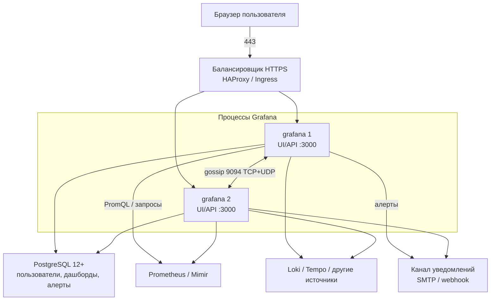

# Grafana 13.2.0 — развёртывание и настройка

Grafana — веб-приложение: рисует графики, дашборды, шлёт алерты. Само **не хранит** ряды метрик. Оно спрашивает другие системы (Prometheus, Loki, Tempo, PostgreSQL) и показывает ответ. Этот документ про **свою установку** версии **13.2.0** (релизная дата 18 августа 2026; на дату подготовки — последний стабильный релиз линии 13.2).

Документация: https://grafana.com/docs/grafana/latest/  
Образ OSS: `grafana/grafana:13.2.0`. Образ Enterprise (тот же функционал OSS + возможность включить коммерческие плагины лицензией): `grafana/grafana-enterprise:13.2.0`.  
На Kubernetes официальный путь сообщества: Helm-чарт **`grafana-community/grafana` 12.11.2** (опубликован 23 августа 2026, `appVersion` **13.2.0**). Репозиторий: `https://grafana-community.github.io/helm-charts`. Kubernetes чарта: `^1.25.0-0`.  
Альтернатива GitOps: **Grafana Operator**, Helm `oci://ghcr.io/grafana/helm-charts/grafana-operator` **5.25.0**. Это другой инсталлятор, не «тот же чарт».

Это не Grafana Cloud: там другие диски и обещания, их сюда копировать нельзя.

Этот текст — не набор команд «скопируй helm install», а правила, без которых система не будет одновременно устойчивой к сбоям, масштабируемой и безопасной. Пошаговая установка — в `Grafana.install.md`.

---

## Назначение системы

Grafana нужна, чтобы **смотреть** уже собранные метрики, логи и трейсы и **орать**, если порог нарушен. Типичные вопросы: жив ли брокер Kafka, растёт ли лаг, не упёрлись ли в диск; отвечает ли интеграция с ведомством 15 секунд; завис ли процесс Camunda; деградировал ли Kubernetes в одной площадке.

Система **читает** источники. Она **не** хранит терабайты рядов, **не** заменяет Prometheus/Mimir, **не** является SIEM (Wazuh/Falco) и **не** ходит в государственные сервисы вместо интеграционного API. Без живого источника дашборд — пустая рамка.

---

## Перечень функций

Что умеет self-hosted Grafana OSS 13.2.0:

1. **Показывать дашборды** в браузере: панели, Explore («пощупать запрос» без сохранения).
2. **Подключать источники:** Prometheus, Loki, Elasticsearch/OpenSearch, PostgreSQL, Tempo и другие. Без источника экран пустой.
3. **Класть дашборды, источники и алерты файлами** (provisioning YAML/JSON) при старте — GitOps, не только клики в UI.
4. **Считать правила алертинга** (Unified Alerting): запрос к источнику + условие «когда орать». Scheduler оценивает правила; встроенный Alertmanager отправляет уведомления (email, webhook, …). Это не отдельный процесс Prometheus Alertmanager, пока вы его сами не подключите.
5. **Работать несколькими процессами за балансировщиком** с **одной** общей БД (PostgreSQL 12+ или MySQL 8.0+). Active-active: любой живой узел обслуживает UI. Sticky session **не** обязательна: сессии живут в общей БД.
6. **Сплетничать между встроенными Alertmanager** (Memberlist, порты **9094/TCP и 9094/UDP**), чтобы не слать одно уведомление N раз. Список соседей — `ha_peers`.
7. **Разграничивать доступ:** организации, папки, роли Viewer/Editor/Admin и finer RBAC; service account для API/GitOps.
8. **Входить через SSO** (Generic OAuth, LDAP). Локальный `admin` — запасная учётка.
9. **Отдавать HTTP** на порту **3000** (UI, API, `/metrics`, `/api/health`, WebSocket Live).
10. **Шифровать пароли источников** в своей БД ключом `secret_key`. В `defaults.ini` 13.2.0 зашито одно и то же значение на все установки мира — его **надо сменить**.

Чего система **не** делает и часто путают: она не озеро метрик, не сборщик с нод (нужны экспортёры), не SIEM, не кворум «2 из 3 подов Grafana». Жив хотя бы один под **и** жива БД — UI есть. Мертва БД — UI нет, даже если поды зелёные. По умолчанию **каждый** под считает **все** правила алертов: нагрузка на Prometheus × N. Режим «считает один узел» в 13.x — public preview. Штатный путь боя — Helm/Operator + Postgres, не SQLite.

---

## Требования к развёртыванию

### Требования к ПО

| Что | Что ставить | Комментарий |
|---|---|---|
| **Формат поставки** | Контейнеры Docker **или** поды Kubernetes | Официальный образ `grafana/grafana:13.2.0`. Для Kubernetes в этом документе — Helm **grafana-community/grafana 12.11.2** или Grafana Operator 5.25.0. Пакеты Linux тоже есть в гайде вендора. |
| **Kubernetes** | Свой кластер ≥ **1.25**, если идёте чартом 12.11.x | Не `latest` чарта и не `latest` образа. Pin по тегу и digest. |
| **ОС** | Linux (основной контур). Windows/macOS — по гайду установки вендора | **Боевой Grafana на Windows-хосте в схеме с Kubernetes не предполагается.** На стенде разработчика Windows допустим как клиент Docker. |
| **БД конфигурации** | Для боя: **PostgreSQL 12+** или MySQL 8.0+ | SQLite — один файл на одном диске. Для боя и для нескольких реплик **не** годится (прямо сказано в документации установки). HA этой БД — отдельное ПО, не Grafana. |
| **Балансировщик** | HTTPS (HAProxy / Ingress) перед портом 3000 | Лучше TLS termination на нём. WebSocket: заголовки Upgrade, если нужен Live. |
| **Источник метрик** | Prometheus / Mimir (и при необходимости Loki / Tempo) | Без него Grafana — пустая рамка. Проектируется отдельно. |
| **Браузеры** | Современные | Internet Explorer не рассматриваем. |
| **Часы** | NTP | Иначе сессии и OAuth callback ведут себя странно. |
| **Лицензия OSS** | AGPLv3 | Enterprise-образ без лицензии = тот же OSS-функционал. Коммерческие плагины/KMS-провайдеры в этом тексте не включаются. |

Готовая учебная команда `docker run` у вендора есть — для знакомства, не для боя.

### Требования к ресурсам

Цифры ниже — **на процесс Grafana**, не на Prometheus и не на диск озера. Это стартовые точки вендора, не смета вашей нагрузки. Вендор прямо пишет: валидировать нагрузкой с **вашими** дашбордами.

Нагрузка Grafana (не Kafka):

| Тир | Одновременные пользователи | Правила алертов | Источники | Дашборды |
|---|---|---|---|---|
| Small | < 25 | < 100 | < 5 | < 200 |
| Medium | 25–200 | 100–1 000 | 5–25 | 200–2 000 |
| Large | 200+ | 1 000+ | 25+ | 2 000+ |

Железо процесса:

| Сценарий | CPU | RAM | Диск хоста БД Grafana | Инстансы |
|---|---|---|---|---|
| **Минимум «чтобы стартануло»** | **1 ядро** | **512 МиБ** | — | 1 |
| **Small** | **2 ядра** | **2–4 ГиБ** | **10–20 ГБ SSD** | 1 |
| **Medium** | **4–8 ядер** | **8–16 ГиБ** | **20–50 ГБ SSD** | **2** за балансировщиком |
| **Large** | **8–16+ ядер на инстанс** | **16–32+ ГиБ** на инстанс | **50+ ГБ SSD**, высокий IOPS | **3+** |
| **Large, сеть** | 10 Гбит/с или быстрее | | | |

Дополнительно:

- Диск в таблице — у **хоста БД Grafana** (пользователи, дашборды, состояние алертов), не у TSDB метрик.
- Live: порядка **50 КБ RAM на WebSocket**; дефолт **max_connections = 100**. Один пользователь ≈ одно соединение на вкладку.
- Терабайты рядов кладут в Prometheus/Mimir/Loki, **не** в Postgres Grafana.
- На тестовой песочнице 512 МиБ–2 ГиБ можно не требовать Medium. Этот стенд **нельзя** переносить в бой как «официальный минимум HA».

---

## Основные элементы системы и зависимости

Это одно ПО из **нескольких процессов**. Несколько реплик Grafana — одинаковые процессы с общей БД и (для алертов) gossip. Кворума как у etcd нет.

### Схема инстансов и потоков



Как читать схему:

1. Человек заходит по HTTPS на балансировщик, тот отдаёт запрос на любой живой процесс **grafana** (порт **3000**). Липкость сессии **не** нужна.
2. Все реплики пишут и читают **одну** PostgreSQL: пользователи, дашборды, состояние алертов. Падение БД = падение всех реплик Grafana, даже если поды зелёные.
3. Цифры Grafana **спрашивает** у Prometheus (и других источников). Падение источника = пустые панели, не «упала Grafana».
4. Встроенные Alertmanager на каждой реплике **сплетничают** по **9094 TCP и UDP**, чтобы не слать одно письмо N раз. Без `ha_peers` UI может быть «HA», а письма дублируются.
5. По умолчанию **каждая** реплика считает **все** правила алертов — нагрузка на Prometheus умножается.

Рядом, но это уже другое ПО: HA Postgres (Patroni / CloudNativePG), Redis (опция HA алертинга или Live), Image Renderer (отдельный Chromium для PNG в письмах), Keycloak. Их отказ проектируется отдельно.

### Что входит в состав

| Роль | Зачем | Как масштабируется |
|---|---|---|
| **Процесс grafana** | UI, API, оценка алертов | Горизонтально: больше реплик за LB. Сначала CPU/RAM на процесс |
| **PostgreSQL / MySQL** | Состояние Grafana | Отказоустойчивость = HA **этой** БД, не «два PVC SQLite» |
| **Unified Alerting** | Правила и отправка | Gossip (`ha_peers`) или Redis, если прямое общение невозможно |
| **Live** | WebSocket в браузер | По умолчанию in-memory; в HA без Redis стримы не общие между подами |
| **Image Renderer** | PNG дашборда для письма | Отдельный сервис, не часть бинаря. Дефолтный токен `-` |

### Порты (контракт сети)

| Порт | Назначение | Кому открывать |
|---|---|---|
| **3000/TCP** | UI, API, `/metrics`, `/api/health`, WebSocket Live | Только балансировщик / внутренняя сеть. Не мир |
| **9094/TCP + 9094/UDP** | Gossip встроенных Alertmanager. Документация: **оба** протокола | Только между подами Grafana |
| **5432 / 3306** | Не Grafana, а общая БД | Только Grafana → БД |
| **6379** | Не Grafana, а Redis (опция) | Только Grafana |
| **8081** | Типичный порт Image Renderer, если включите | Только от Grafana. Не мир |

Пример дефолтов 13.2.0 содержит `admin`/`admin` и `secret_key = SW2YcwTIb9zpOOhoPsMm`. Это **завод**, не боевые настройки.

### Зависимости окружения

- Источники метрик/логов спроектированы отдельно.
- Пароли БД, `secret_key`, client secret SSO — в Vault, не в git и не дефолт из `defaults.ini`.
- Исходящая сеть до `stats.grafana.org`, `grafana.com`, `secure.gravatar.com`, `snapshots.raintank.io` — **по умолчанию включена**. В закрытом контуре её надо **выключить**.
- Grafana смотрит здоровье источников — не бизнес-дэшборды Luxms и не SIEM.

---

## Краткие вводные

### Как устроена отказоустойчивость

Это **не** Raft. Три независимых слоя.

**1) Процессы Grafana**

| Что падает | Что происходит |
|---|---|
| Один под при N≥2 и живой БД | Балансировщик перестаёт слать на него трафик. UI жив. Остальные поды **продолжают оценивать все правила** (дефолт) |
| Все поды Grafana | Нет UI и нет оценки правил Grafana. Prometheus может быть жив — данные не пропали, пропал взгляд |
| Нет `ha_peers` / закрыт 9094 | UI может быть «HA», письма **дублируются** |
| Live без Redis в HA | Пользователь на поде A не видит realtime-событие пода B. Для классических дашбордов с refresh часто незаметно |

**2) Общая БД**

| Что падает | Что происходит |
|---|---|
| SQLite на PVC одного пода | Падение ноды = нет дашбордов, пока диск не вернули. Второй реплики файла нет |
| Postgres primary без реплики | Поды бегут, но не пишут. Это точка отказа |
| Потеря кворума Postgres | Запись дашбордов/алертов встаёт. Это история **PostgreSQL**, не Grafana |

Документация HA: «сначала сделайте MySQL/Postgres высокодоступным, это **вне** данного гайда». Три реплики Grafana без HA БД — нарисованная отказоустойчивость.

**3) Источник данных**

Падение Prometheus = пустые панели и failed evaluation алертов. Для круглосуточной картинки считают по самому слабому звену: поды Grafana, БД, источник, сеть, канал уведомлений.

Встроенный Alertmanager: лучше редкий дубль письма, чем тишина.

### Как устроено масштабирование

Три разные оси (их путают):

1. **Больше людей смотрят дашборды** → больше реплик Grafana + CPU/RAM на под. Не душить `min_refresh_interval` (дефолт не дать refresh чаще **5s**).
2. **Больше правил алертов / короткий interval** → нагрузка на **источник**. При >1000 правил или interval **< 1 мин** документация: оценка может забить CPU. Тогда выносят оценку на отдельные инстансы — не «replicas: 5 на том же Prometheus».
3. **Терабайты рядов** → масштаб Mimir/Prometheus/Loki, не `replicas` Grafana. БД Grafana остаётся маленькой.

Дефолт HA: **N реплик = N одинаковых запросов алертов** в Prometheus. Добавить реплик «для надёжности UI» можно убить источник. Preview `ha_single_node_evaluation = true` как раз про это; в бою его можно рассматривать только понимая статус public preview.

Тиры Small/Medium/Large — ориентир вендора, не ваш замер.

### Безопасность самой Grafana

Компрометация учётки **Admin** = права на все пароли источников в БД Grafana (они зашифрованы `secret_key`; если ключ дефолтный — шифрование от своего же дефолта). Viewer с широким источником видит данные запросов: метрики интеграций, иногда персональные данные в label'ах.

Опасные значения «из коробки» 13.2.0 (`conf/defaults.ini`):

| Что | Как из коробки | Почему опасно |
|---|---|---|
| `admin_user` / `admin_password` | `admin` / `admin` | Первый вход в сеть = чужой Admin. Ставятся **один раз** при первом старте; правка ini пароль в БД **не меняет** |
| `secret_key` | `SW2YcwTIb9zpOOhoPsMm` | Один ключ на все дефолтные инсталлы; дамп БД расшифровывается |
| `reporting_enabled` | `true` | Счётчики на `stats.grafana.org` каждые 24 часа |
| `check_for_updates` / плагины | `true` | GET на `grafana.com` |
| `disable_gravatar` | `false` | Хождение на `secure.gravatar.com` |
| `snapshots.external_enabled` | `true` | Кнопка публикации на `snapshots.raintank.io` |
| `cookie_secure` | `false` | Cookie сессии может уехать по HTTP |
| `/metrics` basic auth | не задан | Служебные метрики без пароля |
| Image Renderer `renderer_token` | `-` | Кто дотянулся до 8081, тот печатает PNG |

Data source proxy: Grafana **с сервера** ходит в источник. Это удобно и это SSRF: Grafana видит внутреннюю сеть. В бою — `data_source_proxy_whitelist`.

Анонимный вход и «публичная ссылка на дашборд» для контура с персональными данными — дыра, не удобство. Unsigned plugins в бою не разворачивать «чтобы завелось».

---

## Допущения

Ниже то, чего не было в исходном запросе, но без чего нельзя нарисовать конкретную схему. Если допущение неверно — схему надо пересмотреть.

1. Берём **self-hosted Grafana OSS 13.2.0**, не Grafana Cloud.
2. Лицензия OSS — AGPLv3. Если юротдел запрещает AGPL — не патчить Grafana, брать Enterprise binary или коммерческую лицензию. Это юридическое решение, не Helm.
3. Бой крутится в Kubernetes, инсталлятор — Helm **12.11.2** с образом **13.2.0**. Operator 5.25.0 — допустимая альтернатива с теми же правилами HA.
4. Общая БД — **PostgreSQL 12+**, отдельная база `grafana`, не та же, что у Camunda/озера. Нужен **кластер Postgres**, не `postgres:latest` рядом.
5. Три дата-центра = три зоны отказа. Grafana-поды можно размазать. **Postgres и gossip 9094** — нет, пока RTT неизвестен.
6. Цель отказа: пережить **1** дата-центр для UI, **если** в живых площадках остались под Grafana **и** доступна БД. Пережить 2 из 3, если БД жила только в мёртвых двух — нельзя.
7. Нагрузка неизвестна — нет цифры «N реплик и M millicores». Есть тиры вендора и рычаги.
8. Источник метрик будет (Prometheus или Mimir). Этот документ его не проектирует.
9. SSO/IdP будет или LDAP. Локальный `admin` в бою — break-glass, не ежедневный вход.
10. Закрытый контур: reporting, проверки обновлений, Gravatar, внешние snapshots — выключаем. Плагины — из **вашего** registry.
11. Учебный стенд изолирован. На нём допустимы SQLite, `admin`/`admin`, self-signed. В бой их не копируем.
12. Camunda, Kafka, озеро, интеграционный API — объекты наблюдения, не часть Grafana.
13. Image Renderer и Live HA на Redis в первом бою не обязательны.
14. Формального SLO на «алерт за 30 секунд» нет.

---

## Критически важные условия, которых нет в исходном контексте

Их нужно закрыть **до** «поставили Helm и открыли :3000».

| Пробел | Почему это ломает решение |
|---|---|
| **RTT и фильтрация UDP между дата-центрами** | Memberlist на 9094 **UDP+TCP**. Городской файрвол, дропающий UDP, = дубли алертов. Тогда путь — Redis для alerting |
| **Один Kubernetes на три площадки или три кластера** | Один Deployment Grafana + один Postgres **или** три Grafana (три правды дашбордов — плохо для дежурства) |
| **Где живёт Postgres Grafana** | Поды без локальной БД переживают зону. Postgres primary в одном ЦОДе — при смерти этой зоны Grafana везде мертва для записи |
| **Какой бэкенд метрик и какой retention** | Терабайты — вопрос Mimir/Loki, не Grafana |
| **Число дашбордов, refresh, правил, зрителей** | Без этого нельзя выбрать тир Small/Medium/Large |
| **Куда смотрит UI** | Публичный 443 с `admin`/`admin` — инцидент |
| **152-ФЗ / ПДн в метках** | PromQL может вытащить ФИО из label. Viewer = читатель этих данных |
| **Канал алертов** | Исход в интернет; секреты webhook в БД Grafana |
| **Кто дежурит** | Grafana без on-call — красивые графики после аварии |
| **Есть ли уже kube-prometheus-stack / другой Grafana** | Два Grafana без общей БД = два набора дашбордов. Вложенный Grafana стека часто оставляют на SQLite |
| **Юридический AGPL** | Решает юротдел, не Helm |

---

## Краткое описание ключевых этапов и элементов развертывания

Общий каркас (и тест, и бой):

1. Зафиксировать **Grafana 13.2.0** и способ: пакет/Docker **или** Helm 12.11.2 **или** Operator 5.25.0. Не смешивать 12.x UI с 13.2 БД «на глаз».
2. Сначала **БД** (на тесте — SQLite), потом Grafana, потом **источник** и provisioning дашборда «Hello, Prometheus».
3. Выпустить **свои** `admin_password` (до первого старта), `secret_key`, пароль БД, TLS **до** вывода в бой. Дефолт `secret_key` после сохранённых источников менять больно.
4. Включить здоровье: `/api/health` на LB; scrape `/metrics` **с auth**; для HA — `grafana_alertmanager_cluster_members`.
5. Алерты: либо 1 реплика на тесте, либо в бою сразу `ha_peers` + порты 9094. Не «сначала 3 реплики, gossip потом».
6. Один контролируемый алерт должен **дойти** до contact point.
7. Только потом — SSO, папки, RBAC, on-call.

Боевая схема на несколько дата-центров — в `Grafana.install.md`. Ниже — только учебный стенд.

---

### 1 инстанс: тестовый стенд, 1 площадка, без нагрузки

**Цель стенда:** увидеть дашборд с *вашего* Prometheus, понять UI, шум правил. **Не** цель: доказать падение дата-центра и 200 одновременных зрителей.

**Путь A — Docker OSS** (быстрее понять продукт):

```text
docker run -d --name=grafana -p 3000:3000 grafana/grafana:13.2.0
```

Первый вход: `admin` / `admin`, вендор просит сменить пароль. Данные — SQLite внутри контейнера. Удалили контейнер без volume — удалили дашборды.

**Путь B — Helm в namespace `monitoring`** (ближе к оркестратору):

- чарт `grafana-community/grafana` **12.11.2**;
- `replicas: 1`;
- SQLite **или** маленький Postgres «для тренировки миграции»;
- Ingress/port-forward только во внутренней сети;
- образ `grafana/grafana:13.2.0`.

Режим «3 реплики + SQLite + PVC RWO» для знакомства **не нужен**: получите Multi-Attach или три расходящихся SQLite.

#### Что сознательно упрощаем

| Параметр | На тесте | Почему можно |
|---|---|---|
| БД | SQLite | Нет требования пережить выкат пода |
| Реплики | 1 | Нет цели отказоустойчивости |
| `ha_peers` | не нужен | Один Alertmanager |
| PKI | self-signed / port-forward | Иначе сертификаты раньше PromQL |
| Пароль admin | сменить с `admin`, но не городить SSO | На тесте важнее контур данных |
| reporting / gravatar / snapshots | можно оставить, **если** стенд без ПДн и с интернетом | В чек-лист боя не переносить |
| Image Renderer / Live Redis | выкл | Не цель |
| CPU/memory | 512 МиБ–2 ГиБ | Не цель — ёмкость Large |

#### Чего на тесте **не** стоит упрощать

- Тег **13.2.0**, не `latest`.
- Хотя бы один источник и дашборд, который показывает **не** пусто. Проверка: панель обновилась и в Explore тот же запрос живой.
- Дашборд в UI без provisioning **умрёт** вместе с SQLite. Сразу сохранить JSON в git.
- Не публиковать 3000 в интернет «на минутку».
- Не ставить unsigned plugins с форума.

#### Сильные стороны такой схемы

- Поднимается за минуты (Docker) или за час (Helm).
- Совпадает с официальным quickstart.
- Дешево показывает, какие метрики у вас **уже есть**, а каких нет.

#### Слабые стороны (обязательно понимать)

- Нет модели отказа площадки, нет общей БД, нет gossip.
- Успешный график на ноутбуке **не** доказывает, что 3 реплики не умножат нагрузку на Prometheus.
- Привычка `admin`/`admin` и LoadBalancer из примера чарта уедет в бой, если не запретить явно.

Практическая рекомендация: препрод = маленький **боевой профиль** (Postgres, 2 реплики, `ha_peers`, свои секреты, SSO-заглушка, reporting выкл), даже без боевого трафика. Всё это **в одном** дата-центре.

---

## Сводка: что считать «экземпляр готов»

| Требование | Тест (1 площадка) | Бой |
|---|---|---|
| Отказоустойчивость | Не требуется | ≥2 реплики Grafana, **Postgres HA** (не SQLite), LB на 3000, `ha_peers`+9094 TCP/UDP (или Redis), бэкап БД. Схема на 2–3 дата-центра — в `Grafana.install.md` |
| Производительность / масштаб | Не требуется | Тир по таблице вендора; не умножать оценку алертов репликами вслепую; терабайты — задача TSDB, не Grafana |
| Безопасность | `admin` только в изоляции; :3000 не с мира | Свой `secret_key`; нет дефолт-пароля; SSO; reporting/gravatar/external snapshots выкл; `/metrics` закрыт; TLS+`cookie_secure`; pin 13.2.0 |

**Не готов к бою**, если: одна реплика с SQLite; три реплики без `ha_peers`; `admin`/`admin` или дефолтный `secret_key`; `latest`; Grafana в интернет; ждут, что Grafana *хранит* метрики Kafka; ждут, что Grafana заменит Wazuh; RTT/UDP не мерили, а gossip растянули на 3 ЦОДа; дашборды только в UI без git и без бэкапа Postgres.

---

## Источники (чтобы не принимать на веру)

- Релиз 13.2.0 (18 Aug 2026): https://github.com/grafana/grafana/releases/tag/v13.2.0
- Установка, БД SQLite/MySQL 8.0+/PostgreSQL 12+, железо Small/Medium/Large, минимум 512 МиБ / 1 ядро: https://grafana.com/docs/grafana/latest/setup-grafana/installation/
- HA: shared MySQL/Postgres, active-active, LB, sticky не обязателен: https://grafana.com/docs/grafana/latest/setup-grafana/set-up-for-high-availability/
- Alerting HA: все инстансы считают все правила; gossip 9094 TCP+UDP; Memberlist vs Redis: https://grafana.com/docs/grafana/latest/alerting/set-up/configure-high-availability/
- Дефолты 13.2.0: https://raw.githubusercontent.com/grafana/grafana/v13.2.0/conf/defaults.ini
- Live: лимит 100 соединений, ~50 КБ, HA только через Redis: https://grafana.com/docs/grafana/latest/setup-grafana/set-up-grafana-live/
- `/metrics` и optional basic auth: https://grafana.com/docs/grafana/latest/setup-grafana/set-up-grafana-monitoring/
- Envelope encryption / `secret_key`: https://grafana.com/docs/grafana/latest/setup-grafana/configure-security/configure-database-encryption/
- Helm grafana-community 12.11.2: https://github.com/grafana-community/helm-charts/releases/tag/grafana-12.11.2
- Grafana Operator Helm 5.25.0: https://grafana.github.io/grafana-operator/docs/installation/helm/
- Лицензия AGPLv3: https://github.com/grafana/grafana

Утверждения вида «Grafana переживёт два дата-центра» или «N millicores на брокер Kafka» в документации Grafana **отсутствуют**. Порога RTT в миллисекундах у Grafana нет: его надо измерить у себя.
