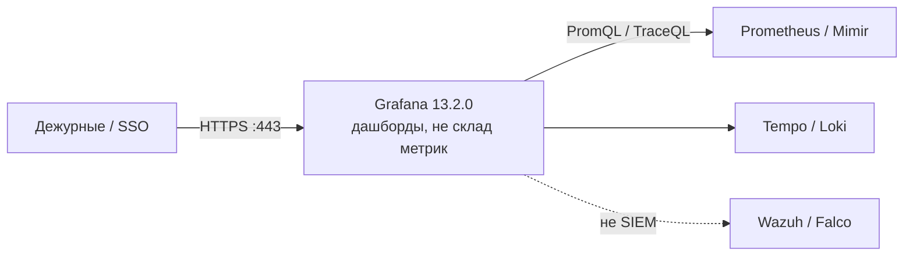
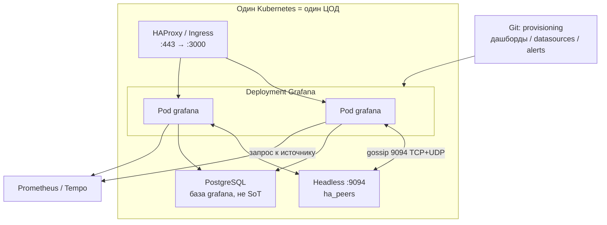
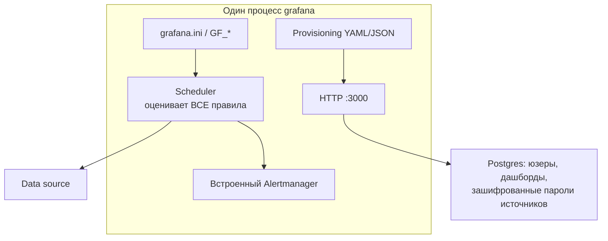
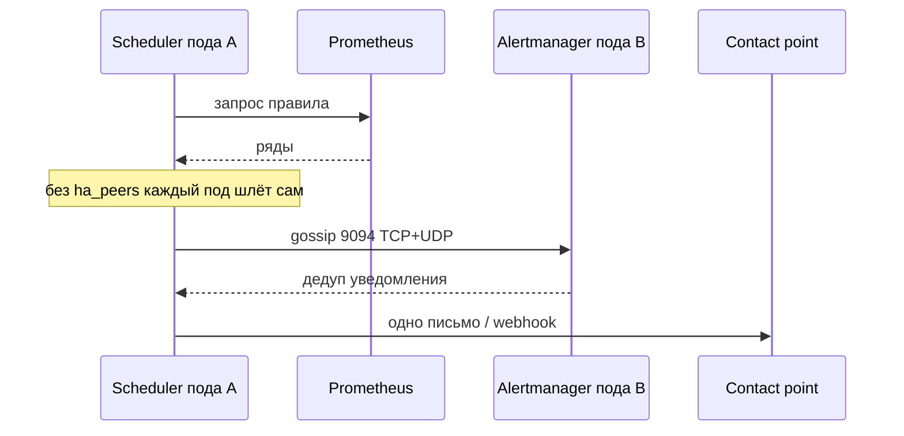
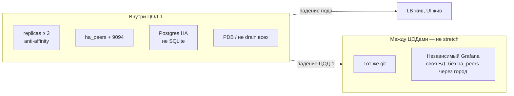
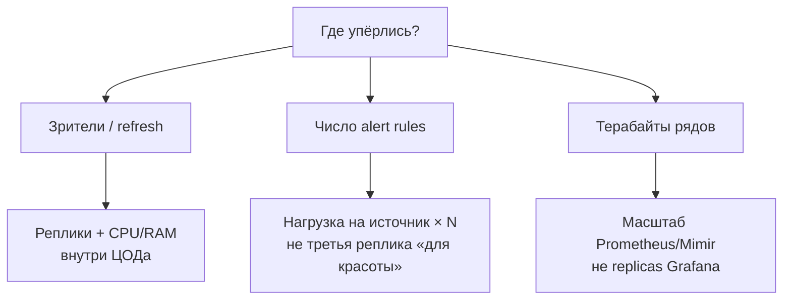
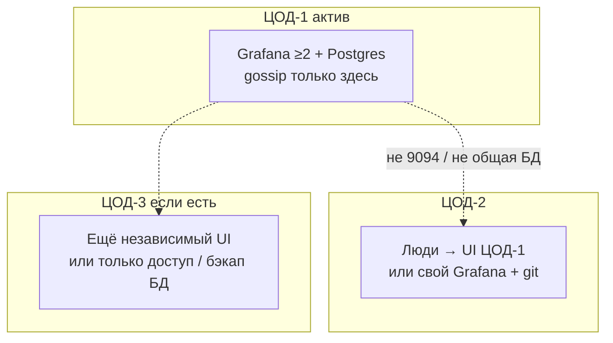

# Grafana 13.2.0 — схемы устройства

Связанные документы: правила — `Grafana.md`; установка — `Grafana.install.md`.

C4 / «D4»: контекст → контейнеры → компоненты. Код UI не рисуем.

Допущения: stretch одной Postgres + `ha_peers` на 2–3 ЦОДа **нет**; Grafana **не** TSDB; Helm `grafana-community/grafana` 12.11.2, образ `grafana/grafana:13.2.0`; нагрузка не замерена.

---

## 1. Контекст

Grafana — **визуализация и unified alerting**. Ряды живут в Prometheus/Mimir/Tempo/Loki, не в ней.

| Стрелка | Зачем помнить |
|---|---|
| Люди → Grafana | Картинка и встроенный алерт. Падение Grafana ≠ пропажа рядов |
| Grafana → источник | Без живого scrape панель пустая. Ёмкость — у TSDB |
| Grafana ↛ Wazuh | Красный график не заменяет разбор security-событий |

**Слабое место контекста:** «поставили Grafana» ≠ «мониторинг выдержал нагрузку».

---

## 2. Контейнеры (из чего состоит решение)

Несколько **одинаковых** процессов + **одна** Postgres + gossip **внутри ЦОД-1**. Это не Raft.

Порт **3000/TCP** — UI, API, `/api/health`, Live. **9094 TCP и UDP** — Memberlist встроенных Alertmanager. Sticky на LB **не** обязателен: сессии в общей БД.

**Сильное:** любой живой под обслуживает UI. **Слабое:** SQLite + `replicas > 1` — три расходящихся файла; без `ha_peers` UI «HA», письма **дублируются**.

---

## 3. Компоненты внутри процесса

| Компонент | Для чего настраивать |
|---|---|
| Unified alerting | Старый alert-на-панели выключен. Дефолт: **каждый** под считает **все** правила → нагрузка на Prometheus × N |
| `secret_key` | AES паролей источников. Дефолт `SW2YcwTIb9zpOOhoPsMm` известен всем |
| Provisioning из git | Иначе два ЦОДа = две правды дашбордов |
| Live | In-memory; HA стримов — отдельный Redis, не цель первого прода |

---

## 4. Поток: алерт (как взаимодействуют)

Встроенный Alertmanager: *availability over consistency* — редкий дубль лучше тишины. Критичные сигналы без Grafana — дублировать во **внешнем** Prometheus Alertmanager.

---

## 5. Что настраивать: отказоустойчивость

| Ручка | Если не настроить |
|---|---|
| Общая Postgres | Зелёные поды, логина нет |
| `ha_peers` в день `replicas > 1` | Дубли писем |
| Свой `secret_key` до источников | Дамп БД расшифровывается дефолтом |
| git provisioning | Клики в UI — единственная копия |

Падение **ЦОД-1** = нет этого Grafana, пока DR/второй экземпляр. Gossip 9094 между ЦОДами не открывать.

---

## 6. Что настраивать: масштабируемость

Тиры вендора (Small/Medium/Large) — стартовые точки, не смета. Preview `ha_single_node_evaluation` — не GA.

---

## 7. Прод: 2 или 3 ЦОДа без stretch

Клиенты в штате ходят на HTTPS ЦОД-1. Третий ЦОД **не** второй writer в ту же БД Grafana.

**Сильное:** латентность логина и gossip не прибита межЦОДовым RTT. **Слабое:** смерть ЦОД-1 = простой UI/встроенных алертов; два Grafana без git = две правды.

---

## 8. Безопасность (ручки на той же схеме)

Не отдельный «кластер ИБ»:

1. NetworkPolicy — 3000 только от LB; 9094 только между подами **этого** ЦОДа.
2. Нет `admin`/`admin`; SSO; `/metrics` с auth.
3. `reporting_enabled` / gravatar / external snapshots **выкл** в закрытом контуре.

Admin Grafana = ключ ко всем паролям data source. Image Renderer — отдельный Chromium, дефолтный токен `-` не оставлять.

Источники фактов: `Grafana.md`. Порога RTT у Grafana **нет** — stretch на схемах не рисуем как целевой.
