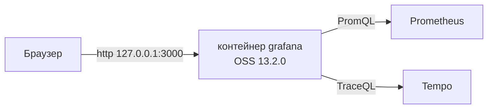

# Grafana OSS 13.2.0 — установка (учебный контур)

Grafana — веб-приложение: рисует дашборды, Explore и unified alerting. Само **ряды не хранит**: спрашивает Prometheus, Tempo и другие источники. Это не Grafana Cloud.

**Допущение:** закрытая сеть, один контейнер Docker, встроенная SQLite, версия **OSS 13.2.0**. Боевой запуск сюда не копировать.

Официальный путь: **Docker** (программа, которая запускает готовый **образ** — упакованную программу с зависимостями — как **контейнер**). Образ **`grafana/grafana:13.2.0`**, не `latest`. На странице Download у вендора по умолчанию Enterprise; здесь пиним OSS, как в карточке платформы. [Docker](https://grafana.com/docs/grafana/latest/setup-grafana/installation/docker/), [скачать OSS 13.2.0](https://grafana.com/grafana/download/13.2.0?platform=docker&edition=oss).

Windows как сервер Grafana в схеме с Kubernetes не ставим. На учёбе Docker Desktop как клиент допустим.

Один логический Grafana (одна БД + `ha_peers`) на несколько дата-центров здесь **не собираем**: порога RTT в документации Grafana нет.

---

## Куда ставить и сколько ресурсов (учебный контур)

**Куда.** Одна машина с Docker (Linux VM или ноутбук) **рядом** с учебным Prometheus/Tempo, не публичный LoadBalancer. UI/API Grafana — **3000/TCP**. На хосте публикуем **только** `127.0.0.1:3000` или доступ через VPN: пример вендора `-p 3000:3000` слушает все интерфейсы.

SQLite — встроенная файл-БД по умолчанию (в контейнере каталог `/var/lib/grafana`). Для нескольких реплик и для боя вендор SQLite **не** рекомендует ([установка](https://grafana.com/docs/grafana/latest/setup-grafana/installation/)). Здесь реплика одна.

Helm `grafana-community/grafana` **12.11.2** (`appVersion` 13.2.0) — путь Kubernetes, не этот учебный стенд.



**Сколько.** Цифры — на процесс Grafana, не на Prometheus и не на диск озера. Минимум «чтобы поднялось» и тир Small — разные строки. Путать нельзя.

| Зачем | CPU | RAM | Диск | Откуда |
|---|---|---|---|---|
| Минимум, чтобы процесс поднялся | 1 ядро | 512 МиБ | SQLite внутри volume | [установка](https://grafana.com/docs/grafana/latest/setup-grafana/installation/) |
| Учебный контур (тир Small вендора) | **2 ядра** | **2–4 ГиБ** | **10–20 ГБ SSD** у хоста БД; на SQLite хватит volume | тот же документ, таблица Small |

Для учёбы берите **не меньше 1 CPU / 512 МиБ**; удобнее 2 CPU / 2 ГиБ. Это не смета боя: вашей нагрузки в контексте нет.

**Сильная сторона:** совпадает с Docker-гайдом вендора, минуты. **Слабая:** падение этой машины / удаление volume = нет UI и нет SQLite.

**Критично:** **3000** в интернет не публиковать. Не тег `latest`. Один контейнер — не HA: нет общей Postgres, нет gossip **9094**. Дефолтный `secret_key` из `defaults.ini` известен всем. Admin Grafana = ключ к паролям источников.

---

## Установка для новичка

Команды — в оболочке Docker (Linux / Docker Desktop). На Linux без прав в группе `docker` вендор предлагает `sudo` перед `docker` ([Docker](https://grafana.com/docs/grafana/latest/setup-grafana/installation/docker/)).

Страница шагов: https://grafana.com/docs/grafana/latest/setup-grafana/installation/docker/

### Что должно быть до установки

**Есть:**

- Docker Engine (или Docker Desktop)
- закрытая сеть; вход на машину с jump-хоста / VPN
- свободен **3000/TCP** на localhost
- браузер с JavaScript ([установка](https://grafana.com/docs/grafana/latest/setup-grafana/installation/))

**Нет** (и не должно появиться на этом стенде):

- публикация `0.0.0.0:3000` в интернет
- тег `latest` / образ без номера патча
- `replicas > 1` на SQLite
- unsigned plugins

Prometheus на стенде **желателен сразу**: без живого источника дашборд — пустая рамка. Tempo — если смотрите трейсы. Их ставят своими инструкциями (`Prometheus.install.md`, `Grafana Tempo.install.md`).

### Этап 1. Docker

**Что делаем:** проверяем, что Docker отвечает. Нет демона — контейнер не стартует.

```bash
docker version
```

Успех: клиент и сервер печатают версии, без `Cannot connect to the Docker daemon`.

### Этап 2. Volume для SQLite

**Что делаем:** создаём том Docker, чтобы дашборды и учётки переживали рестарт контейнера. Без тома данные живут только в файловой системе контейнера: удалили контейнер — удалили SQLite ([Docker](https://grafana.com/docs/grafana/latest/setup-grafana/installation/docker/)).

```bash
docker volume create grafana-storage
docker volume inspect grafana-storage
```

Успех: `inspect` печатает JSON тома.

### Этап 3. Запуск образа 13.2.0

**Что делаем:** поднимаем один контейнер OSS. `-p 127.0.0.1:3000:3000` — порт хоста только на loopback. `--add-host=host.docker.internal:host-gateway` — чтобы из контейнера достучаться до Prometheus/Tempo **на хосте** (имя есть в [настройке Prometheus](https://grafana.com/docs/grafana/latest/datasources/prometheus/configure/); флаг `host-gateway` — Docker Engine, не страница Grafana).

```bash
docker run -d --name grafana-dev \
  -p 127.0.0.1:3000:3000 \
  --add-host=host.docker.internal:host-gateway \
  --volume grafana-storage:/var/lib/grafana \
  grafana/grafana:13.2.0
```

Успех: команда печатает id контейнера, без ошибки pull/run. Образ **`grafana/grafana:13.2.0`**, не `grafana/grafana-enterprise` и не `latest`.

### Этап 4. Процесс жив

**Что делаем:** проверяем контейнер и HTTP **до** браузера. `GET /api/health` — служебная точка: процесс и его БД (не Prometheus) ([Health API](https://grafana.com/docs/grafana/latest/developer-resources/api-reference/http-api/api-legacy/other/)). `grafana cli` — CLI того же образа; в 13.x команды `grafana-cli` уже нет ([CLI](https://grafana.com/docs/grafana/latest/administration/cli/), [удаление grafana-cli](https://grafana.com/whats-new/2026-04-14-removal-of-grafana-cli-and-grafana-server-commands/)).

```bash
docker ps --filter name=grafana-dev
curl -s http://127.0.0.1:3000/api/health
docker exec grafana-dev grafana cli -v
```

Успех: контейнер `Up`; JSON с `"database": "ok"` и `"version": "13.2.0"`; CLI печатает **13.2.0**. Порт в `docker ps` — `127.0.0.1:3000->3000/tcp`, не `0.0.0.0:3000`.

**Чего этот стенд не доказывает:** отказ зала, HA Postgres, gossip 9094 / отсутствие дублей писем, нагрузку тира Medium/Large, выборы лидера (их у Grafana нет: жив процесс **и** жива БД — UI есть). Удалили volume — дашборды пропали: это ожидаемо, не баг.

---

## Первый запуск — URL, порт, учётка, смена пароля

**URL:** `http://127.0.0.1:3000` — дефолт `root_url` / порт **3000** ([вход](https://grafana.com/docs/grafana/latest/setup-grafana/sign-in-to-grafana/), [defaults.ini 13.2.0](https://raw.githubusercontent.com/grafana/grafana/v13.2.0/conf/defaults.ini): `http_port = 3000`). С другой машины — SSH-туннель на этот loopback или публикация только на адрес VPN, не в интернет.

Страница входа: https://grafana.com/docs/grafana/latest/setup-grafana/sign-in-to-grafana/

**Учётка.** Завод 13.2.0: логин **`admin`**, пароль **`admin`** — так в `defaults.ini` (`admin_user` / `admin_password`) и на [странице Download OSS 13.2.0](https://grafana.com/grafana/download/13.2.0?platform=docker&edition=oss). Ставятся **один раз** при первом старте; правка ini пароль в SQLite **не** меняет.

**Смена пароля.** После успешного входа `admin` / `admin` Grafana **показывает prompt сменить пароль**; OK → новый пароль ([вход](https://grafana.com/docs/grafana/latest/setup-grafana/sign-in-to-grafana/)). Сменить **сразу**. Вендор: «We strongly recommend that you change the default administrator password». Учебный пароль в бой не копировать.

Забыли пароль на этом стенде: `docker exec grafana-dev grafana cli admin reset-admin-password <новый>` ([CLI](https://grafana.com/docs/grafana/latest/administration/cli/)).

---

## Подключение к своей системе

Люди открывают **браузер на Grafana**. Grafana **с сервера** ходит в источники (data source proxy). Клиенты платформы в Grafana не встраиваются как библиотека. В ведомства Grafana **не ходит** — только в ваши Prometheus / Tempo / (по необходимости) PostgreSQL для **операционных** графиков, не госоданные озера.

| Источник | Зачем на стенде | URL с точки зрения контейнера Grafana | Официальная страница |
|---|---|---|---|
| **Prometheus** | метрики, первая непустая панель | не `http://localhost:9090` внутри Grafana-контейнера; `http://host.docker.internal:9090` или имя/IP контейнера Prometheus | [настройка](https://grafana.com/docs/grafana/latest/datasources/prometheus/configure/) |
| **Tempo** | трейсы | HTTP Tempo на стенде (см. `Grafana Tempo.install.md`) | [Tempo](https://grafana.com/docs/grafana/latest/datasources/tempo/) |
| **Loki** | логи, если уже есть | URL Loki на стенде | [Loki](https://grafana.com/docs/grafana/latest/datasources/loki/) |
| **PostgreSQL** | операционные SQL-графики | хост:5432 той БД, которую смотрите | [PostgreSQL](https://grafana.com/docs/grafana/latest/datasources/postgres/) |

ClickHouse — не ядро Grafana, а плагин. На этот стенд не обязателен. Unsigned plugins не ставим.

**Первый источник:** Connections → Add new connection → Prometheus → Add new data source. Prometheus server URL — как в таблице. Save & test: вендор ожидает *Successfully queried the Prometheus API.* Потом Explore: тот же PromQL живой; одна панель на дашборде обновилась и не пустая.

JSON дашборда сразу в git: клики в UI умрут вместе с volume. Provisioning файлами: https://grafana.com/docs/grafana/latest/administration/provisioning/

### Секреты (не в git)

| Секрет | Где живёт | Куда не класть |
|---|---|---|
| Пароль `admin` после смены | сейф / Vault | git, чат, образ |
| Пароли источников | БД Grafana, шифр `secret_key` | git, скриншоты Settings |
| `secret_key` | ini / `GF_SECURITY_SECRET_KEY` | дефолт `SW2YcwTIb9zpOOhoPsMm` известен всем ([defaults.ini](https://raw.githubusercontent.com/grafana/grafana/v13.2.0/conf/defaults.ini), [шифрование БД](https://grafana.com/docs/grafana/latest/setup-grafana/configure-security/configure-database-encryption/)). На учёбе можно оставить; в бой — свой **до** заведения источников |

В git — JSON/YAML дашбордов и безсекретовый datasource YAML. Пароли — нет.

### Чем продукт не является

| Сосед | Чем отличается |
|---|---|
| Prometheus / Mimir | Хранят ряды. Grafana их **спрашивает** |
| Tempo / Loki | Трейсы и логи. Grafana — буква G в LGTM, не весь стек |
| Superset / Luxms BI | Предметные дашборды над складом / госо данными |
| Zabbix | Другой контур наблюдения |
| Wazuh / Falco | SIEM / runtime. Красный график не заменяет разбор security-событий |
| Интеграционное API | Grafana не ходит в ведомства |
| Кластер с кворумом | Несколько процессов + **одна** Postgres + gossip 9094. Этого стенда нет |

---

## Ссылки на материал

| Факт | URL |
|---|---|
| Релиз **13.2.0** (18 августа 2026) | https://github.com/grafana/grafana/releases/tag/v13.2.0 |
| Минимум 1 ядро / 512 МиБ; Small 2 / 2–4 ГиБ / 10–20 ГБ; SQLite vs PostgreSQL 12+ / MySQL 8.0+ | https://grafana.com/docs/grafana/latest/setup-grafana/installation/ |
| Docker: `docker run`, volume `/var/lib/grafana`, OSS-образ `grafana/grafana` | https://grafana.com/docs/grafana/latest/setup-grafana/installation/docker/ |
| Команда OSS **13.2.0**, вход default **admin/admin** | https://grafana.com/grafana/download/13.2.0?platform=docker&edition=oss |
| Первый вход: `http://localhost:3000`, admin/admin, **prompt сменить пароль** | https://grafana.com/docs/grafana/latest/setup-grafana/sign-in-to-grafana/ |
| `http_port = 3000`, `admin_user`/`admin_password` = admin, `secret_key` | https://raw.githubusercontent.com/grafana/grafana/v13.2.0/conf/defaults.ini |
| `GET /api/health` | https://grafana.com/docs/grafana/latest/developer-resources/api-reference/http-api/api-legacy/other/ |
| `grafana cli -v`, сброс пароля admin | https://grafana.com/docs/grafana/latest/administration/cli/ |
| В 13.0 удалены `grafana-cli` / `grafana-server` | https://grafana.com/whats-new/2026-04-14-removal-of-grafana-cli-and-grafana-server-commands/ |
| Prometheus: URL, `localhost` ≠ соседний контейнер, `host.docker.internal`, Save & test | https://grafana.com/docs/grafana/latest/datasources/prometheus/configure/ |
| Tempo как источник | https://grafana.com/docs/grafana/latest/datasources/tempo/ |
| Loki как источник | https://grafana.com/docs/grafana/latest/datasources/loki/ |
| PostgreSQL как источник | https://grafana.com/docs/grafana/latest/datasources/postgres/ |
| Список источников, Connections | https://grafana.com/docs/grafana/latest/datasources/ |
| Provisioning YAML/JSON | https://grafana.com/docs/grafana/latest/administration/provisioning/ |
| Envelope encryption / `secret_key` | https://grafana.com/docs/grafana/latest/setup-grafana/configure-security/configure-database-encryption/ |
| HA (не этот стенд): общая MySQL/Postgres | https://grafana.com/docs/grafana/latest/setup-grafana/set-up-for-high-availability/ |
| Alerting HA, 9094 TCP+UDP (не этот стенд) | https://grafana.com/docs/grafana/latest/alerting/set-up/configure-high-availability/ |
| Helm **12.11.2** (не этот стенд) | https://github.com/grafana-community/helm-charts/releases/tag/grafana-12.11.2 |
| Зачем продукт, порты, железо | `Grafana.md` |
| Словарь | `Grafana.info.md` |
| Схема стыковки с платформой | `Grafana.shema.md` |
| Роль консультанта | `Grafana.consultant.md` |
| Prometheus на стенде | `Prometheus.install.md` |
| Tempo на стенде | `Grafana Tempo.install.md` |

**В доке вендора нет (и здесь не выдумано):** порог RTT между залами; «хватит N ядер под вашу нагрузку»; готовая смета боя; NFS как единственный диск Grafana; флаг `--add-host=host.docker.internal:host-gateway` (это Docker Engine). Prompt смены пароля на первом входе вендор описывает на странице Sign in; отдельной кнопки «пропустить» там нет.
