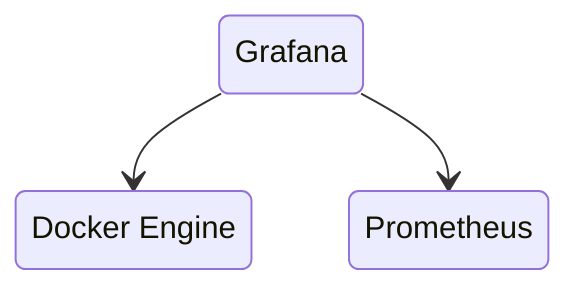
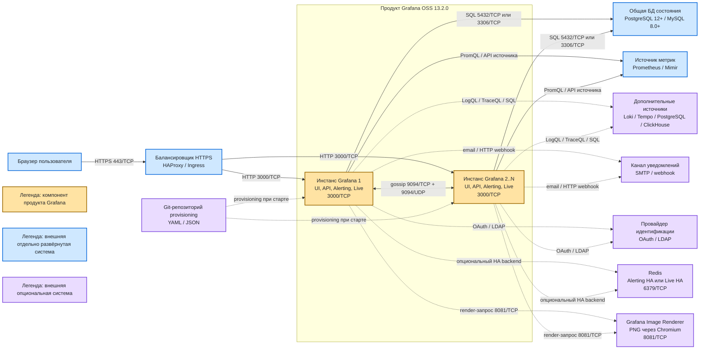

# Grafana 13.2.0 — развёртывание и настройка

Grafana — веб-приложение: рисует графики, дашборды, шлёт алерты. Само **не хранит** ряды метрик. Оно спрашивает другие системы (Prometheus, Loki, Tempo, PostgreSQL) и показывает ответ. Этот документ про **свою установку** версии **13.2.0** (релизная дата 18 августа 2026; на дату подготовки — последний стабильный релиз линии 13.2).

Документация: https://grafana.com/docs/grafana/latest/  
Образ OSS: `grafana/grafana:13.2.0`. Образ Enterprise (тот же функционал OSS + возможность включить коммерческие плагины лицензией): `grafana/grafana-enterprise:13.2.0`.  
На Kubernetes официальный путь сообщества: Helm-чарт **`grafana-community/grafana` 12.11.2** (опубликован 23 августа 2026, `appVersion` **13.2.0**). Репозиторий: `https://grafana-community.github.io/helm-charts`. Kubernetes чарта: `^1.25.0-0`.  
Альтернатива GitOps: **Grafana Operator**, Helm `oci://ghcr.io/grafana/helm-charts/grafana-operator` **5.25.0**. Это другой инсталлятор, не «тот же чарт».

Это не Grafana Cloud: там другие диски и обещания, их сюда копировать нельзя.

Этот текст — не набор команд «скопируй helm install», а правила, без которых система не будет одновременно устойчивой к сбоям, масштабируемой и безопасной. Пошаговая установка — в `Grafana.install.md`.

---

## Назначение системы

Grafana нужна, чтобы **смотреть** уже собранные метрики, логи и трейсы и **орать**, если порог нарушен. Типичные вопросы: жив ли брокер Kafka, растёт ли лаг, не упёрлись ли в диск; отвечает ли интеграция с ведомством 15 секунд; завис ли процесс Camunda; деградировал ли Kubernetes в одной площадке.

Система **читает** источники. Она **не** хранит терабайты рядов, **не** заменяет Prometheus/Mimir, **не** является SIEM (Wazuh/Falco) и **не** ходит в государственные сервисы вместо интеграционного API. Без живого источника дашборд — пустая рамка.

---

## Перечень функций

Что умеет self-hosted Grafana OSS 13.2.0:

1. **Показывать дашборды** в браузере: панели, Explore («пощупать запрос» без сохранения).
2. **Подключать источники:** Prometheus, Loki, Elasticsearch/OpenSearch, PostgreSQL, Tempo и другие. Без источника экран пустой.
3. **Класть дашборды, источники и алерты файлами** (provisioning YAML/JSON) при старте — GitOps, не только клики в UI.
4. **Считать правила алертинга** (Unified Alerting): запрос к источнику + условие «когда орать». Scheduler оценивает правила; встроенный Alertmanager отправляет уведомления (email, webhook, …). Это не отдельный процесс Prometheus Alertmanager, пока вы его сами не подключите.
5. **Работать несколькими процессами за балансировщиком** с **одной** общей БД (PostgreSQL 12+ или MySQL 8.0+). Active-active: любой живой узел обслуживает UI. Sticky session **не** обязательна: сессии живут в общей БД.
6. **Сплетничать между встроенными Alertmanager** (Memberlist, порты **9094/TCP и 9094/UDP**), чтобы не слать одно уведомление N раз. Список соседей — `ha_peers`.
7. **Разграничивать доступ:** организации, папки, роли Viewer/Editor/Admin и finer RBAC; service account для API/GitOps.
8. **Входить через SSO** (Generic OAuth, LDAP). Локальный `admin` — запасная учётка.
9. **Отдавать HTTP** на порту **3000** (UI, API, `/metrics`, `/api/health`, WebSocket Live).
10. **Шифровать пароли источников** в своей БД ключом `secret_key`. В `defaults.ini` 13.2.0 зашито одно и то же значение на все установки мира — его **надо сменить**.

Чего система **не** делает и часто путают: она не озеро метрик, не сборщик с нод (нужны экспортёры), не SIEM, не кворум «2 из 3 подов Grafana». Жив хотя бы один под **и** жива БД — UI есть. Мертва БД — UI нет, даже если поды зелёные. По умолчанию **каждый** под считает **все** правила алертов: нагрузка на Prometheus × N. Режим «считает один узел» в 13.x — public preview. Штатный путь боя — Helm/Operator + Postgres, не SQLite.

---

## Основные элементы системы и зависимости

Grafana — один продукт, который может работать одним или несколькими одинаковыми процессами. В многорепличном профиле процессы используют общую БД; встроенные Alertmanager обмениваются данными между собой. Кворума как у etcd у процессов Grafana нет.

На схеме сплошная стрелка означает основной поток, пунктирная — необязательный поток. Синий цвет обозначает систему, которая развёртывается и сопровождается отдельно от Grafana. Фиолетовым показаны отдельно развёртываемые **опциональные** системы: их наличие определяется включённой функцией, а не самим фактом установки Grafana.

### Схема инстансов и потоков

### Описание блоков

| Блок на схеме | Технологии и варианты | Назначение | Принадлежность |
|---|---|---|---|
| **Браузер пользователя** | Современный браузер; HTTPS и при необходимости WebSocket | Показывает UI, дашборды и Explore; отправляет действия пользователя в API | Клиентское ПО, не часть Grafana |
| **Балансировщик HTTPS** | HAProxy, Kubernetes Ingress или другой reverse proxy | Завершает TLS и направляет запрос на живой инстанс Grafana по 3000/TCP | Отдельная внешняя система |
| **Инстанс Grafana 1** | Бинарный пакет, контейнер `grafana/grafana:13.2.0`, pod Helm-чарта или объект Grafana Operator | Обслуживает UI/API, запрашивает источники, оценивает правила и содержит встроенный Alertmanager | Часть продукта Grafana |
| **Инстанс Grafana 2..N** | Те же варианты поставки и та же версия, что у первого инстанса | Даёт горизонтальное масштабирование и переживание отказа процесса; не образует кворум | Часть продукта Grafana; нужен только для многорепличного профиля |
| **Общая БД состояния** | PostgreSQL 12+ или MySQL 8.0+; на одиночном учебном стенде допустима встроенная SQLite | Хранит пользователей, дашборды, конфигурацию источников и состояние алертинга; ряды метрик здесь не хранятся | Отдельная система для многорепличного/HA-профиля; SQLite входит в одиночную установку |
| **Источник метрик** | Prometheus или Mimir | Хранит и отдаёт временные ряды по запросам Grafana | Отдельная внешняя система; практически необходима для заявленных сценариев мониторинга, но не входит в Grafana |
| **Дополнительные источники** | Loki для логов, Tempo для трейсов, PostgreSQL/ClickHouse и другие data source plugins | Дают дополнительные данные панелям и правилам | Отдельные опциональные системы |
| **Канал уведомлений** | SMTP-сервер, HTTP webhook и другие contact points | Доставляет рассчитанное уведомление адресату | Отдельная опциональная система; нужна только при отправке уведомлений |
| **Провайдер идентификации** | Generic OAuth, LDAP; например, отдельно установленный Keycloak как OAuth/OIDC-провайдер | Даёт единый вход и централизованное управление идентификацией | Отдельная опциональная система; локальная аутентификация Grafana остаётся доступным вариантом |
| **Git-репозиторий provisioning** | Git и файлы YAML/JSON, доставляемые выбранным GitOps-механизмом | Хранит воспроизводимое описание источников, дашбордов и правил | Отдельная опциональная система; рекомендована для управляемой конфигурации, но не является runtime-зависимостью Grafana |
| **Redis** | Совместимый Redis backend по 6379/TCP | Может заменить gossip для Alerting HA или объединить Grafana Live между репликами | Отдельная опциональная система; не нужна при одном инстансе и не обязательна при рабочем `ha_peers` |
| **Grafana Image Renderer** | Отдельный сервис с headless Chromium, обычно 8081/TCP | Формирует PNG панелей и дашбордов, например для уведомлений | Отдельная опциональная система, не часть основного бинаря Grafana |

### Развёрнутое чтение схемы

1. Пользователь открывает единый HTTPS-адрес. В типовой схеме внешний балансировщик принимает соединение на **443/TCP**, завершает TLS и передаёт HTTP/WebSocket-запрос на **3000/TCP** одного из живых инстансов Grafana. Sticky session не обязательна, когда инстансы используют общую БД.
2. Жёлтая граница охватывает только процессы Grafana. Второй и последующие инстансы — копии первого, а не отдельные роли master/worker. Один инстанс допустим для учебного или иного не-HA профиля; несколько нужны, только если требуется масштабирование либо переживание отказа процесса.
3. В многорепличном профиле все инстансы читают и изменяют одно состояние через общую PostgreSQL или MySQL. На схеме подписаны стандартные порты **5432/TCP** и **3306/TCP**. Это внешняя БД, и её собственная отказоустойчивость проектируется отдельно. Для одиночного стенда вместо неё может использоваться SQLite, поэтому внешняя БД не является безусловной зависимостью любой установки.
4. Grafana не берёт значения графиков из своей БД состояния. Каждый инстанс выполняет запрос к Prometheus/Mimir или другому источнику данных. Если источник недоступен, соответствующая панель или вычисление правила завершается ошибкой, но сохранённая конфигурация Grafana от этого не исчезает.
5. При Unified Alerting каждый инстанс по умолчанию оценивает правила. Поэтому две реплики могут создать два одинаковых запроса к источнику. Встроенные Alertmanager обмениваются состоянием по **9094/TCP и 9094/UDP**, заданному через `ha_peers`, чтобы координировать и дедуплицировать уведомления. Этот обмен не нужен единственному инстансу.
6. После срабатывания правила Grafana отправляет сообщение в настроенный contact point. SMTP и webhook на схеме пунктирные: без функции уведомлений эти внешние системы не требуются. Их конкретные порты зависят от выбранного сервера и endpoint.
7. Loki, Tempo, PostgreSQL и ClickHouse — дополнительные источники. Они подключаются только при наличии соответствующих логов, трейсов или операционных данных. Grafana обращается к их API, но не развёртывает и не администрирует эти хранилища.
8. SSO через OAuth или LDAP является вариантом входа, а не обязательным условием запуска. При его выборе Grafana обращается к отдельно развёрнутому провайдеру идентификации; локальная учётная запись администратора должна оставаться аварийным способом доступа.
9. Provisioning позволяет подать YAML/JSON при старте инстанса. Git удобен как источник контролируемой версии этих файлов, но сам процесс Grafana не обязан во время работы иметь соединение с Git: доставку файлов может выполнять внешний GitOps-конвейер.
10. Redis показан как опциональная альтернатива для Alerting HA и как backend для Grafana Live в многорепличном режиме. Его **6379/TCP** не следует открывать пользователям. Если peer-to-peer gossip работает и общие Live-потоки между инстансами не нужны, Redis не становится обязательной зависимостью.
11. Image Renderer вызывается по **8081/TCP** только если нужны изображения панелей или дашбордов. Обычный интерактивный UI работает без него.
12. Все синие и фиолетовые блоки имеют собственный жизненный цикл, резервирование, обновление и мониторинг. Количество реплик Grafana не делает автоматически отказоустойчивыми БД, источник данных, балансировщик или канал уведомлений.

### Порты (контракт сети)

| Порт | Назначение | Кому открывать |
|---|---|---|
| **3000/TCP** | UI, API, `/metrics`, `/api/health`, WebSocket Live | Только балансировщик / внутренняя сеть. Не мир |
| **9094/TCP + 9094/UDP** | Gossip встроенных Alertmanager. Документация: **оба** протокола | Только между подами Grafana |
| **5432 / 3306** | Не Grafana, а общая БД | Только Grafana → БД |
| **6379** | Не Grafana, а Redis (опция) | Только Grafana |
| **8081** | Типичный порт Image Renderer, если включите | Только от Grafana. Не мир |

Пример дефолтов 13.2.0 содержит `admin`/`admin` и `secret_key = SW2YcwTIb9zpOOhoPsMm`. Это **завод**, не боевые настройки.

### Зависимости окружения

- Для полезного мониторинга нужен хотя бы один отдельно спроектированный источник данных; Loki, Tempo и прочие дополнительные источники подключаются только при необходимости.
- Для нескольких реплик нужна общая PostgreSQL/MySQL. Одиночный учебный стенд может работать на SQLite.
- Redis, Image Renderer, SSO, Git provisioning и каналы уведомлений — **опциональные** зависимости соответствующих функций.
- Пароли БД, `secret_key`, client secret SSO — в Vault, не в git и не дефолт из `defaults.ini`.
- Исходящая сеть до `stats.grafana.org`, `grafana.com`, `secure.gravatar.com`, `snapshots.raintank.io` — **по умолчанию включена**. В закрытом контуре её надо **выключить**.
- Grafana смотрит здоровье источников — не бизнес-дэшборды Luxms и не SIEM.

---

## Краткие вводные

### Как устроена отказоустойчивость

Это **не** Raft. Три независимых слоя.

**1) Процессы Grafana**

| Что падает | Что происходит |
|---|---|
| Один под при N≥2 и живой БД | Балансировщик перестаёт слать на него трафик. UI жив. Остальные поды **продолжают оценивать все правила** (дефолт) |
| Все поды Grafana | Нет UI и нет оценки правил Grafana. Prometheus может быть жив — данные не пропали, пропал взгляд |
| Нет `ha_peers` / закрыт 9094 | UI может быть «HA», письма **дублируются** |
| Live без Redis в HA | Пользователь на поде A не видит realtime-событие пода B. Для классических дашбордов с refresh часто незаметно |

**2) Общая БД**

| Что падает | Что происходит |
|---|---|
| SQLite на PVC одного пода | Падение ноды = нет дашбордов, пока диск не вернули. Второй реплики файла нет |
| Postgres primary без реплики | Поды бегут, но не пишут. Это точка отказа |
| Потеря кворума Postgres | Запись дашбордов/алертов встаёт. Это история **PostgreSQL**, не Grafana |

Документация HA: «сначала сделайте MySQL/Postgres высокодоступным, это **вне** данного гайда». Три реплики Grafana без HA БД — нарисованная отказоустойчивость.

**3) Источник данных**

Падение Prometheus = пустые панели и failed evaluation алертов. Для круглосуточной картинки считают по самому слабому звену: поды Grafana, БД, источник, сеть, канал уведомлений.

Встроенный Alertmanager: лучше редкий дубль письма, чем тишина.

### Как устроено масштабирование

Три разные оси (их путают):

1. **Больше людей смотрят дашборды** → больше реплик Grafana + CPU/RAM на под. Не душить `min_refresh_interval` (дефолт не дать refresh чаще **5s**).
2. **Больше правил алертов / короткий interval** → нагрузка на **источник**. При >1000 правил или interval **< 1 мин** документация: оценка может забить CPU. Тогда выносят оценку на отдельные инстансы — не «replicas: 5 на том же Prometheus».
3. **Терабайты рядов** → масштаб Mimir/Prometheus/Loki, не `replicas` Grafana. БД Grafana остаётся маленькой.

Дефолт HA: **N реплик = N одинаковых запросов алертов** в Prometheus. Добавить реплик «для надёжности UI» можно убить источник. Preview `ha_single_node_evaluation = true` как раз про это; в бою его можно рассматривать только понимая статус public preview.

Тиры Small/Medium/Large — ориентир вендора, не ваш замер.

### Безопасность самой Grafana

Компрометация учётки **Admin** = права на все пароли источников в БД Grafana (они зашифрованы `secret_key`; если ключ дефолтный — шифрование от своего же дефолта). Viewer с широким источником видит данные запросов: метрики интеграций, иногда персональные данные в label'ах.

Опасные значения «из коробки» 13.2.0 (`conf/defaults.ini`):

| Что | Как из коробки | Почему опасно |
|---|---|---|
| `admin_user` / `admin_password` | `admin` / `admin` | Первый вход в сеть = чужой Admin. Ставятся **один раз** при первом старте; правка ini пароль в БД **не меняет** |
| `secret_key` | `SW2YcwTIb9zpOOhoPsMm` | Один ключ на все дефолтные инсталлы; дамп БД расшифровывается |
| `reporting_enabled` | `true` | Счётчики на `stats.grafana.org` каждые 24 часа |
| `check_for_updates` / плагины | `true` | GET на `grafana.com` |
| `disable_gravatar` | `false` | Хождение на `secure.gravatar.com` |
| `snapshots.external_enabled` | `true` | Кнопка публикации на `snapshots.raintank.io` |
| `cookie_secure` | `false` | Cookie сессии может уехать по HTTP |
| `/metrics` basic auth | не задан | Служебные метрики без пароля |
| Image Renderer `renderer_token` | `-` | Кто дотянулся до 8081, тот печатает PNG |

Data source proxy: Grafana **с сервера** ходит в источник. Это удобно и это SSRF: Grafana видит внутреннюю сеть. В бою — `data_source_proxy_whitelist`.

Анонимный вход и «публичная ссылка на дашборд» для контура с персональными данными — дыра, не удобство. Unsigned plugins в бою не разворачивать «чтобы завелось».

---

## Допущения

Ниже то, чего не было в исходном запросе, но без чего нельзя нарисовать конкретную схему. Если допущение неверно — схему надо пересмотреть.

1. Берём **self-hosted Grafana OSS 13.2.0**, не Grafana Cloud.
2. Лицензия OSS — AGPLv3. Если юротдел запрещает AGPL — не патчить Grafana, брать Enterprise binary или коммерческую лицензию. Это юридическое решение, не Helm.
3. Бой крутится в Kubernetes, инсталлятор — Helm **12.11.2** с образом **13.2.0**. Operator 5.25.0 — допустимая альтернатива с теми же правилами HA.
4. Общая БД — **PostgreSQL 12+**, отдельная база `grafana`, не та же, что у Camunda/озера. Нужен **кластер Postgres**, не `postgres:latest` рядом.
5. Три дата-центра = три зоны отказа. Grafana-поды можно размазать. **Postgres и gossip 9094** — нет, пока RTT неизвестен.
6. Цель отказа: пережить **1** дата-центр для UI, **если** в живых площадках остались под Grafana **и** доступна БД. Пережить 2 из 3, если БД жила только в мёртвых двух — нельзя.
7. Нагрузка неизвестна — нет цифры «N реплик и M millicores». Есть тиры вендора и рычаги.
8. Источник метрик будет (Prometheus или Mimir). Этот документ его не проектирует.
9. SSO/IdP будет или LDAP. Локальный `admin` в бою — break-glass, не ежедневный вход.
10. Закрытый контур: reporting, проверки обновлений, Gravatar, внешние snapshots — выключаем. Плагины — из **вашего** registry.
11. Учебный стенд изолирован. На нём допустимы SQLite, `admin`/`admin`, self-signed. В бой их не копируем.
12. Camunda, Kafka, озеро, интеграционный API — объекты наблюдения, не часть Grafana.
13. Image Renderer и Live HA на Redis в первом бою не обязательны.
14. Формального SLO на «алерт за 30 секунд» нет.

---

## Критически важные условия, которых нет в исходном контексте

Их нужно закрыть **до** «поставили Helm и открыли :3000».

| Пробел | Почему это ломает решение |
|---|---|
| **RTT и фильтрация UDP между дата-центрами** | Memberlist на 9094 **UDP+TCP**. Городской файрвол, дропающий UDP, = дубли алертов. Тогда путь — Redis для alerting |
| **Один Kubernetes на три площадки или три кластера** | Один Deployment Grafana + один Postgres **или** три Grafana (три правды дашбордов — плохо для дежурства) |
| **Где живёт Postgres Grafana** | Поды без локальной БД переживают зону. Postgres primary в одном ЦОДе — при смерти этой зоны Grafana везде мертва для записи |
| **Какой бэкенд метрик и какой retention** | Терабайты — вопрос Mimir/Loki, не Grafana |
| **Число дашбордов, refresh, правил, зрителей** | Без этого нельзя выбрать тир Small/Medium/Large |
| **Куда смотрит UI** | Публичный 443 с `admin`/`admin` — инцидент |
| **152-ФЗ / ПДн в метках** | PromQL может вытащить ФИО из label. Viewer = читатель этих данных |
| **Канал алертов** | Исход в интернет; секреты webhook в БД Grafana |
| **Кто дежурит** | Grafana без on-call — красивые графики после аварии |
| **Есть ли уже kube-prometheus-stack / другой Grafana** | Два Grafana без общей БД = два набора дашбордов. Вложенный Grafana стека часто оставляют на SQLite |
| **Юридический AGPL** | Решает юротдел, не Helm |

---

## Глоссарий

| Термин | Значение в этом документе |
|---|---|
| **Active-active** | Режим, в котором любой из нескольких живых инстансов Grafana может одновременно обслуживать запросы. |
| **Alertmanager** | Компонент, который группирует, подавляет, дедуплицирует и отправляет уведомления о сработавших правилах; в Grafana есть встроенная реализация. |
| **Anti-affinity** | Правило планировщика Kubernetes, разносящее реплики по разным узлам или зонам отказа. |
| **API** | Программный интерфейс, через который клиенты и автоматизация обращаются к Grafana или источнику данных. |
| **Break-glass account** | Аварийная локальная учётная запись для входа, когда внешний SSO недоступен. |
| **ClickHouse** | Внешняя колоночная СУБД, которую можно подключить как дополнительный источник данных. |
| **Contact point** | Настроенный адрес доставки уведомлений: email, webhook или другой канал. |
| **Data source / источник данных** | Внешняя система, к которой Grafana выполняет запросы для панелей и правил алертинга. |
| **Data source proxy** | Серверный механизм Grafana, выполняющий запрос к источнику от имени пользователя; требует ограничения доступной внутренней сети. |
| **Dashboard / дашборд** | Сохранённая страница Grafana с одной или несколькими панелями и переменными. |
| **Дедупликация** | Устранение повторных уведомлений об одном событии. |
| **Endpoint** | Сетевой адрес конкретного API или сервиса. |
| **Explore** | Раздел Grafana для интерактивного выполнения запросов без обязательного сохранения панели. |
| **GitOps** | Подход, при котором желаемая конфигурация хранится в Git и автоматически применяется к среде. |
| **Gossip / Memberlist** | Обмен состоянием между встроенными Alertmanager Grafana по 9094/TCP и 9094/UDP без центрального координатора. |
| **HA (High Availability)** | Высокая доступность: способность сервиса продолжить работу при отказе отдельного компонента. |
| **HA backend** | Механизм обмена состоянием между репликами; для Alerting это gossip либо опциональный Redis. |
| **`ha_peers`** | Настройка со списком адресов соседних инстансов встроенного Alertmanager. |
| **HAProxy** | Отдельный программный балансировщик и reverse proxy. |
| **Headless Chromium** | Браузерный движок без графического окна, которым Image Renderer строит PNG. |
| **Helm** | Менеджер пакетов Kubernetes; chart описывает набор ресурсов для установки приложения. |
| **Image Renderer** | Отдельный опциональный сервис Grafana для формирования изображений панелей и дашбордов. |
| **Ingress** | Ресурс и контроллер Kubernetes, публикующий HTTP/HTTPS-сервисы кластера. |
| **Инстанс / реплика** | Один запущенный процесс или pod Grafana с той же конфигурацией и версией, что и остальные. |
| **IOPS** | Число операций ввода-вывода диска в секунду. |
| **LDAP** | Протокол доступа к каталогу пользователей; один из вариантов внешней аутентификации. |
| **Live** | Подсистема Grafana для доставки событий в браузер в реальном времени по WebSocket. |
| **Loki** | Внешняя система хранения и поиска логов, подключаемая к Grafana как источник. |
| **LogQL** | Язык запросов Loki. |
| **Mimir** | Внешнее масштабируемое хранилище метрик, совместимое с Prometheus API. |
| **NTP** | Протокол синхронизации времени между узлами. |
| **OAuth / OIDC** | Протоколы делегированной аутентификации и единого входа через внешний провайдер. |
| **Operator** | Kubernetes-контроллер, который управляет жизненным циклом Grafana и связанных пользовательских ресурсов. |
| **Panel / панель** | Отдельная визуализация или другой элемент на дашборде. |
| **Patroni / CloudNativePG** | Внешние средства управления высокой доступностью PostgreSQL; они не входят в Grafana. |
| **Pod** | Минимальная запускаемая единица Kubernetes, содержащая один или несколько контейнеров. |
| **Prometheus** | Внешняя система сбора и хранения метрик и выполнения запросов PromQL. |
| **PromQL** | Язык запросов Prometheus и совместимых систем. |
| **Provisioning** | Загрузка конфигурации Grafana из файлов YAML/JSON вместо ручного создания только через UI. |
| **Public preview** | Предварительный статус функции без гарантий стабильности уровня общей доступности. |
| **PVC / RWO** | Постоянный том Kubernetes и режим его одновременного подключения только к одному узлу. |
| **RBAC** | Управление правами доступа на основе ролей. |
| **Redis** | Отдельное сетевое хранилище, опционально используемое для Alerting HA или Live HA. |
| **Reverse proxy** | Промежуточный сервер, принимающий запрос клиента и передающий его внутреннему сервису. |
| **RTT** | Время прохождения сетевого запроса до узла и ответа обратно. |
| **Scheduler** | Часть Grafana Alerting, которая по расписанию оценивает правила. |
| **Secret / `secret_key`** | Секретное значение; `secret_key` используется Grafana для защиты сохранённых чувствительных данных. |
| **SIEM** | Система сбора и анализа событий информационной безопасности; Grafana её не заменяет. |
| **SQLite** | Встроенная файловая БД для одиночной установки; не общая БД нескольких реплик. |
| **SSO** | Единый вход через внешнюю систему идентификации. |
| **Sticky session** | Закрепление запросов пользователя за одним backend-инстансом балансировщика. |
| **SSRF** | Класс уязвимостей, при котором сервер заставляют обращаться к нежелательным сетевым адресам. |
| **Tempo** | Внешняя система хранения распределённых трассировок. |
| **TLS / HTTPS** | Шифрование транспортного соединения и HTTP поверх него. |
| **TraceQL** | Язык запросов трассировок Tempo. |
| **TSDB** | База временных рядов; Prometheus/Mimir относятся к TSDB, Grafana — нет. |
| **Unified Alerting** | Единая подсистема Grafana для правил, оценки, маршрутизации и уведомлений. |
| **Vault** | Внешнее защищённое хранилище секретов. |
| **Webhook** | HTTP-вызов внешней системы при наступлении события. |
| **WebSocket** | Долгоживущее двунаправленное соединение браузера с сервером, используемое Grafana Live. |

---

## Источники (чтобы не принимать на веру)

- Релиз 13.2.0 (18 Aug 2026): https://github.com/grafana/grafana/releases/tag/v13.2.0
- Установка, БД SQLite/MySQL 8.0+/PostgreSQL 12+, железо Small/Medium/Large, минимум 512 МиБ / 1 ядро: https://grafana.com/docs/grafana/latest/setup-grafana/installation/
- HA: shared MySQL/Postgres, active-active, LB, sticky не обязателен: https://grafana.com/docs/grafana/latest/setup-grafana/set-up-for-high-availability/
- Alerting HA: все инстансы считают все правила; gossip 9094 TCP+UDP; Memberlist vs Redis: https://grafana.com/docs/grafana/latest/alerting/set-up/configure-high-availability/
- Дефолты 13.2.0: https://raw.githubusercontent.com/grafana/grafana/v13.2.0/conf/defaults.ini
- Live: лимит 100 соединений, ~50 КБ, HA только через Redis: https://grafana.com/docs/grafana/latest/setup-grafana/set-up-grafana-live/
- `/metrics` и optional basic auth: https://grafana.com/docs/grafana/latest/setup-grafana/set-up-grafana-monitoring/
- Envelope encryption / `secret_key`: https://grafana.com/docs/grafana/latest/setup-grafana/configure-security/configure-database-encryption/
- Helm grafana-community 12.11.2: https://github.com/grafana-community/helm-charts/releases/tag/grafana-12.11.2
- Grafana Operator Helm 5.25.0: https://grafana.github.io/grafana-operator/docs/installation/helm/
- Лицензия AGPLv3: https://github.com/grafana/grafana

Утверждения вида «Grafana переживёт два дата-центра» или «N millicores на брокер Kafka» в документации Grafana **отсутствуют**. Порога RTT в миллисекундах у Grafana нет: его надо измерить у себя.
