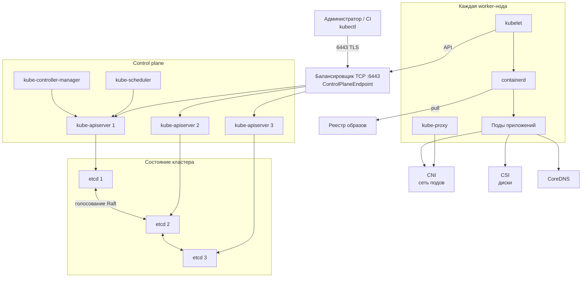

# Kubernetes 1.36.4 — развёртывание и настройка

Kubernetes — оркестратор контейнеров: вы описываете «какие поды должны бежать», а кластер сам запускает их, чинит упавшие и раскладывает по машинам. Этот документ про **свою установку** версии **1.36.4** (патч линии 1.36; тег GitHub опубликован 20 августа 2026; на дату подготовки — последний стабильный патч поддерживаемой линии 1.36). Тега **v1.37.0** ещё нет (есть pre-release `v1.37.0-rc.1`). Страница https://kubernetes.io/releases/ на этот момент отставала (показывала 1.36.2) — номер патча брать из [релизов GitHub](https://github.com/kubernetes/kubernetes/releases).

Документация: https://kubernetes.io/docs/home/  
Релизы и поддержка: https://kubernetes.io/releases/  
Установка HA (официальный путь проекта): kubeadm — https://kubernetes.io/docs/setup/production-environment/tools/kubeadm/high-availability/

Релиз 1.37.0 в календаре SIG Release стоит на 26 августа 2026. В бой **не** берём RC и **не** прыгаем на 1.37 в день GA: сначала патч текущей minor, затем плановый minor без skip. Пока GA-тега нет — целевая версия **1.36.4**.

Это не облако EKS/AKS/GKE: там другие балансировщики и диски, их сюда копировать нельзя.

Этот текст — не набор команд «скопируй kubeadm init», а правила, без которых система не будет одновременно устойчивой к сбоям, масштабируемой и безопасной. Пошаговая установка — в `Kubernetes.install.md`.

---

## Назначение системы

Kubernetes нужен, чтобы **одинаково запускать много сервисов** (микросервисы, Camunda, интеграционный слой) на наборе машин, переживать падение отдельной машины и наращивать мощность добавлением подов и нод.

Система держит в etcd только «как должна выглядеть система»: какие Deployment'ы есть, какие поды должны быть, Secrets. Терабайты живут в томах приложений и в Kafka/БД. Kubernetes **не** источник истины клиентских карточек, **не** шина событий и **не** замена Grafana. Он запускает и чинит процессы; отказоустойчивость *данных* — в репликах Kafka, Postgres, CSI, не в «у нас три ноды Kubernetes».

---

## Перечень функций

Что умеет vanilla Kubernetes 1.36.4 с kubeadm:

1. **Держать желаемое состояние:** «хочу 5 реплик этого сервиса» — контроллер сам догонит факт (Deployment, ReplicaSet, StatefulSet, DaemonSet, Job).
2. **Планировать поды на ноды** (kube-scheduler): ресурсы, зоны, taint/toleration, affinity, topologySpreadConstraints.
3. **Давать стабильный вход к подам:** Service (виртуальный IP/DNS, пока поды меняют адреса). Объекты Ingress / Gateway API есть в API; **исполнителя** (контроллера) ядро не ставит.
4. **Хранить секреты и конфиги** (Secret, ConfigMap). Без отдельной настройки шифрования Secret в etcd лежит **открытым текстом**.
5. **Резать права:** RBAC (кто какие API-вызовы может делать), ServiceAccount для подов, Pod Security Admission (профили Privileged / Baseline / Restricted).
6. **Ограничивать сеть между подами** объектом NetworkPolicy — **только если** выбранный CNI это умеет. Иначе объект в API — декорация.
7. **Масштабировать поды** (HPA) по метрикам. Источник метрик (Metrics Server / Prometheus Adapter) — **не** часть kubeadm.
8. **Защищать от добровольного снятия** реплик при drain ноды (PodDisruptionBudget). Это не защита от падения дата-центра.
9. **Заказывать диск** (PersistentVolume / PVC / StorageClass). Репликация диска — задача СХД/CSI, не планировщика.
10. **Отдавать HTTP API** (kube-apiserver, обычно порт **6443**, TLS) — единственная «дверь» управления кластером.
11. **Хранить состояние кластера в etcd** (Raft): запись подтверждает большинство членов. Без большинства etcd перестаёт принимать запись — кластер «глухой» для изменений.

Чего система **не** делает и часто путают: она не даёт сеть подов «из коробки» (нужен CNI), не даёт диски (нужен CSI), не выдаёт внешний IP для Service `LoadBalancer` на железе (нужен MetalLB / ADC), не синхронизирует три control plane (нужен GitOps), не является реестром образов. Уже запущенные поды при падении control plane обычно продолжают работать, но нельзя деплоить, масштабировать и переносить упавшие поды. Штатный путь HA — kubeadm, не «два docker kubernetes».

---

## Требования к развёртыванию

### Требования к ПО

| Что | Что ставить | Комментарий |
|---|---|---|
| **Формат поставки** | Виртуальные машины (или железные серверы) с пакетами Linux | Основной путь проекта — **kubeadm**. Поды — контейнеры, но сам Kubernetes на нодах ставится пакетами (`kubeadm`, `kubelet`, `kubectl`), не «одним docker run кластера». |
| **Kubernetes** | Это и есть оркестратор | Дистрибутивы (RKE2, Talos, OpenShift) меняют установку, **не** отменяют кворум etcd, зоны и RBAC. |
| **ОС** | Linux на нодах | **Windows-ноды в этой схеме не рассматриваем.** |
| **CRI (runtime контейнеров)** | **containerd** (CRI-O допустим) | Docker-shim убран из Kubernetes 1.24. `dockerd` как runtime кластера 1.36 — не штатный путь. CRI должен работать **до** `kubeadm init`. |
| **Сеть подов** | CNI (Cilium, Calico, …) | Без CNI кластер после kubeadm **не умеет** нормально запускать поды. CNI **обязан** реализовывать NetworkPolicy, если обещаете изоляцию. |
| **Диски** | CSI-драйвер + StorageClass | Kubernetes только **заказывает** том. Для etcd — локальный SSD/NVMe, **не NFS**. |
| **Балансировщик HA** | TCP на порт **6443** перед несколькими kube-apiserver | Health check — TCP до 6443. Без `ControlPlaneEndpoint` HA control plane по kubeadm не собирают. |
| **Образы** | `registry.k8s.io` **или** зеркало / заранее пролитые образы | В закрытом контуре без зеркала кластер не встанет и не обновится. |
| **Часы** | NTP/chrony на **всех** нодах | Рассинхрон ломает TLS и путает таймауты Raft etcd. |
| **Клиент** | `kubectl` на машины администраторов | Ставится отдельно. |

Линия kubeadm 1.36 использует etcd **3.6.x**; точный патч образа смотреть командой `kubeadm config images list`, не запоминать «навсегда».

### Требования к ресурсам

Цифр «сколько worker-нод на ваши терабайты» у проекта **нет** — нагрузки в исходном запросе не было. Ниже ориентиры документации, не смета закупки.

| Роль | CPU | RAM | Диск |
|---|---|---|---|
| **Официальный минимум kubeadm** (чтобы **вообще завелось**, не бой) | порядка **2 CPU** на машину | **2 ГиБ** | плюс уникальные hostname / MAC / `product_uuid` |
| **etcd (ориентир hardware guidelines)** | запас под запись Raft; 1 GbE достаточно «для обычных» деплоев, **10 GbE** ускоряет восстановление члена | типично **8 ГиБ** (тяжелее — **16–64**) | **SSD / NVMe**, локальный. Для нагруженных контуров ориентир **500 sequential IOPS**. **Не NFS.** Квота БД: дефолт **2 ГиБ**, предлагаемый потолок обычной среды **8 ГиБ** |

Дополнительно:

- Это размер **метаданных кластера**, не озера. Раздутый etcd (тысячи огромных ConfigMap/Secret) убивает API раньше, чем закончится СХД приложений.
- Числа нод из таблиц etcd (50 / 250 / 1000) — **примеры нагрузки на сам etcd**, не расчёт вашей системы.
- На учебной песочнице 2 CPU / 2 ГиБ можно не требовать «с запасом». Этот стенд **нельзя** переносить в бой как «официальный минимум HA».
- Терабайты приложений кладут в PVC / Kafka / объектное хранилище, **не** в etcd.

---

## Основные элементы системы и зависимости

Это одно ПО из **нескольких процессов**. Ниже — те, что живут отдельными инстансами, и как они вызывают друг друга.

### Схема инстансов и потоков

Как читать схему:

1. Всё управление идёт через **kube-apiserver** (порт **6443**, TLS). В HA перед несколькими API стоит балансировщик; клиенты и kubelet ходят **на его DNS/IP**, не на «первый master».
2. **etcd** хранит состояние кластера. Запись подтверждает **большинство** членов (для трёх — двое). Это **не** озеро данных и не Kafka.
3. **kube-scheduler** выбирает ноду новому поду. **kube-controller-manager** догоняет желаемое состояние («хотели 3 реплики — сейчас 2»).
4. На каждой ноде **kubelet** следит, чтобы назначенные поды бежали. Контейнеры запускает **containerd** (или CRI-O), не сам Kubernetes.
5. **CNI** даёт сеть подов. **CSI** даёт диски. **CoreDNS** резолвит имена Service. Без них кластер «как в документации» не встанет.
6. Поды **смертны**: Kubernetes имеет право их убить и создать заново на другой ноде. Данные переживают это только если лежат на PVC / в внешней БД, не «в контейнере».

Рядом, но это уже другое ПО: Ingress/Gateway-контроллер, MetalLB, Metrics Server, Harbor, Argo CD / Flux. Их отказ проектируется отдельно.

### Что входит в состав

| Роль | Зачем | Как масштабируется |
|---|---|---|
| **kube-apiserver** | Единственная дверь API | Несколько инстансов за балансировщиком |
| **etcd** | Состояние кластера | Нечётное число: **3** (пережить 1 члена) или **5** (пережить 2). Stacked (на тех же машинах, что API) — дефолт kubeadm; external — отдельные машины |
| **kube-scheduler / kube-controller-manager** | Планирование и контроллеры | На control-plane нодах |
| **kubelet / kube-proxy** | Агент ноды и Service | На **каждой** ноде |
| **kubectl** | Клиент администратора | Без своего склада данных |
| **CoreDNS** | DNS сервисов | Аддон kubeadm, не «ядро языка» |
| **CNI / CSI** | Сеть и диски | Отдельные продукты |

**Stacked etcd** — etcd на тех же машинах, что API: проще, падение ноды бьёт сразу по API и по голосу. **External etcd** — дороже (ещё 3 хоста), отказ API не снимает голос etcd.

### Порты (контракт сети)

| Порт | Назначение | Кому открывать |
|---|---|---|
| **6443/TCP** | kube-apiserver | kubectl, kubelet, контроллеры, балансировщик. **Не** в интернет |
| **2379/TCP** | etcd, клиенты (apiserver) | Только control plane / etcd |
| **2380/TCP** | etcd, голос между членами | Только члены etcd |
| **10250/TCP** | kubelet API | apiserver, метрики. Не мир |
| **10257 / 10259/TCP** | controller-manager / scheduler | Служебные |
| порты CNI / overlay | сеть подов | По выбранному CNI; для нескольких площадок — связность **между нодами этого кластера** |

Балансировщик перед 6443 допустим и для HA **обязателен**. Голосование etcd 2380 — **прямое** соединение машина↔машина, не «один VIP на все etcd».

### Зависимости окружения

- Полная IP-связность всех нод **этого** кластера между собой (явное требование HA-гайда kubeadm).
- Диск etcd: локальный SSD/NVMe, низкий хвост fsync. Медленный диск = ложные выборы лидера.
- В Kubernetes том с режимом «один под — один диск» для stateful-нагрузки. `emptyDir` как каталог данных Kafka/БД = потеря при рестарте пода.
- Ярлык зоны `topology.kubernetes.io/zone` — иначе scheduler не знает площадки.
- Идентификация: люди — OIDC / клиентские сертификаты; сервисы — свой ServiceAccount с минимумом прав. Общий `cluster-admin` у приложений запрещён.

---

## Краткие вводные

### Как устроена отказоустойчивость

Это **два разных слоя**, их постоянно путают.

**1) Control plane (etcd + API)**

Живёт, пока жив **кворум etcd**. Чтобы пережить N одновременных отказов членов, нужно 2N+1. Три etcd → переживёте **одного** члена. Пять → двоих.

| Что падает | Что происходит |
|---|---|
| Один etcd из трёх | Большинство есть, выбирается другой лидер, запись жива |
| Два etcd из трёх | Большинства нет. Запись в API **встаёт**. Уже запущенные поды обычно продолжают работать |
| Все etcd в одном дата-центре | Падение площадки = нельзя управлять кластером, даже если воркеры живы в других местах |
| Control plane, etcd ещё жив | Нельзя деплоить и переносить упавшие поды, пока API не вернётся |
| Диск etcd, нет снимка | Потеря состояния кластера (не данных Kafka/БД — у них свой RPO) |

Официальная документация etcd: **члены etcd по возможности держать в одном дата-центре**, чтобы не платить задержкой и риском partition. Растянуть один Kubernetes на три площадки — **конфликт** с этой рекомендацией, его нельзя «закрыть настройкой».

Падение control plane **не** равно падению бизнеса в ту же секунду: kubelet продолжает держать уже запущенные поды. Если за время «глухого» API умрёт ещё и worker — эти поды никто не поднимет.

**2) Приложения**

Реплики подов + PDB + разложение по зонам + **репликация самих данных** (RF Kafka, реплики Postgres, CSI). Kubernetes перезапустит под. Он **не** восстановит данные, если единственная копия лежала на умершем диске.

**3) Балансировщик API**

Один VIP в одном шкафу = скрытая точка отказа control plane, даже если etcd тройка.

### Как устроено масштабирование

Две оси, не одна:

1. **Больше процессов приложения** → больше подов (HPA / replica). Потолок — сколько влезает на текущие ноды; для stateful — ещё партиции/шарды **приложения**. «Просто добавь под» Kafka не увеличивает партиции.
2. **Больше машин** → worker-ноды (закупка / Cluster Autoscaler, если умеете заказать VM «из воздуха»). Рост нод увеличивает давление на etcd и apiserver. «Ещё 200 нод» может упереться в control plane, не в CPU воркеров.

«Терабайты» почти наверняка лежат **не в etcd**. Квота etcd по умолчанию **2 ГиБ**, рекомендуемый максимум для обычных сред — **8 ГиБ**. Политика: в etcd только метаданные.

Пулы нод (taint): `control-plane` (kubeadm так делает); `platform` (Kafka, тяжёлые БД); `general` (микросервисы); при необходимости `ingress` / `integration-dmz`.

### Безопасность самого Kubernetes

Компрометация `admin.conf` / учётки cluster-admin = права на все Secrets, все поды, все namespace. Кто снял снимок диска etcd без encryption at rest — читает пароли Kafka, токены API, ключи.

Официальная документация: без `--encryption-provider-config` API-сервер кладёт ресурсы в etcd **открытым текстом**. TLS к API от этого **не** спасает.

Слои, все нужны в бою:

1. Сеть до API — только с jump/VPN, не 6443 в интернет.
2. TLS kubeadm не ослаблять (`insecure-skip-tls-verify` — не бой).
3. Люди — OIDC к IdP (или клиентские сертификаты). Файл `admin.conf` — не процесс на 50 человек.
4. RBAC: сервису свой ServiceAccount, только свой namespace. Не `cluster-admin` приложениям.
5. PSA: прикладные namespace `restricted` или минимум `baseline`. `privileged` — kube-system и оговорённые CSI/CNI.
6. NetworkPolicy default-deny, затем DNS + свои зависимости. Работает только с правильным CNI.
7. Encryption at rest для Secrets **до** боевых секретов. KMSv2 — рекомендация Kubernetes 1.36, если есть KMS; иначе `aesgcm` локальным ключом (ключ не в Git). KMSv1 не использовать: deprecated с 1.28, выключен по умолчанию с 1.29.
8. Audit log apiserver.
9. Образы только со своего registry; не `:latest`.
10. Сертификаты kubeadm по умолчанию живут **1 год** — процедура ротации часть эксплуатации, не «фаза 2».

Не публиковать Kubernetes Dashboard с token-admin. Не оставлять анонимный list. Анонимный 6443 в интернет — ключ от кластера, не «удобство CI».

---

## Допущения

Ниже то, чего не было в исходном запросе, но без чего нельзя нарисовать конкретную схему. Если допущение неверно — схему надо пересмотреть.

1. Берём **vanilla Kubernetes 1.36.4 + kubeadm** как документированный проектом путь HA. Дистрибутивы меняют плейбук, не правила кворума.
2. Бой **on-prem в ваших дата-центрах**, не managed EKS/AKS/GKE.
3. Три дата-центра = три независимых отказа (питание, сеть). Три зала с общим ИБП эту схему не спасают.
4. ОС нод — **Linux**. Смешанные Windows-ноды не закладываем.
5. CRI — **containerd** (CRI-O допустим; на правила HA это не влияет).
6. CNI будет выбран отдельно и **обязан** реализовывать NetworkPolicy.
7. Stretch одного Kubernetes на 3 площадки принимается **только если** сеть между членами etcd достаточно быстрая и стабильная. Порога RTT в документации **проекта Kubernetes нет**. Документация etcd: по возможности один ЦОД; дефолты heartbeat **100 ms**, election timeout **1000 ms**; election timeout должен быть **не меньше 10× RTT**. Пока RTT не измерили — stretch **гипотеза**.
8. Нагрузки нет — поэтому **нет** числа worker-нод «хватит для боя» и **нет** размера дисков приложений.
9. Формального SLA / RPO / RTO нет. Потеря **двух** площадок при трёх членах etcd кворум, как правило, убивает.
10. Корпоративный PKI / KMS для ключей шифрования Secrets либо будет, либо на старте — локальный `aesgcm`.
11. Учебный стенд изолирован. На нём допустим один control plane. Манифесты приложений лучше сразу писать без `privileged` и без hostNetwork.
12. Kafka, Camunda, озеро, интеграционное API — workload. Их RF, PVC и сетевые политики — в их документах.
13. Решение «один Kubernetes или три» **зависит** от схемы Kafka (stretch vs MirrorMaker) — это не ортогональные выборы.

---

## Критически важные условия, которых нет в исходном контексте

Их нужно закрыть **до** закупки «кластера на три площадки».

| Пробел | Почему это ломает решение |
|---|---|
| **RTT и потери между дата-центрами** (p50/p95/p99, все пары) | Запись в etcd не быстрее репликации на большинство. Плавающий RTT → выборы лидера, таймауты API, **весь** кластер нестабилен |
| **Один Kubernetes или три независимых** | Stretch vs острова — разные RPO/RTO, разный GitOps, разная схема Kafka. «Мы используем Kubernetes» этого выбора не содержит |
| **Как устроена L3 между площадками и нужны ли overlay** | Overlay добавляет латентность и проблемы MTU. Для Kafka (прямые соединения брокер–брокер) плохая подложка может сделать stretch Kafka невозможным даже при «живом» Kubernetes |
| **Профиль нагрузки** (сервисы, поды, QPS к API, частота деплоев) | Без этого нельзя сказать ни число нод, ни «готовы к высокой нагрузке» |
| **Где живут терабайты** | Если кто-то предложит «сложить в etcd / в ConfigMap» — деградация control plane |
| **Формальные RPO/RTO и что значит «упал ЦОД»** | Stretch etcd переживает **один** ЦОД при 3 членах. Два — нет. Три независимых кластера переживают смерть площадки как площадки, но приложение должно уметь работать на оставшихся |
| **Балансировщик перед apiserver** | SPOF control plane часто оказывается не etcd, а один HAProxy в одном шкафу |
| **Требования ИБ: ГОСТ, 152-ФЗ, КИИ** | Меняют PKI, допустимость образов с Docker Hub, KMS/HSM, аудит. Штатный TLS — не СКЗИ |
| **Реестр образов и выход в интернет с нод** | Закрытый контур без зеркала = кластер не встанет |
| **Кто оперирует 24/7** | Истёкший сертификат apiserver (дефолт kubeadm — **1 год**) — полный простой управления |

---

## Краткое описание ключевых этапов и элементов развертывания

Общий каркас (и тест, и бой):

1. Зафиксировать **1.36.4**. Проект **запрещает** skip minor даже на одном apiserver.
2. Поставить CRI, выключить или корректно настроить swap по текущим требованиям kubeadm/kubelet.
3. Поднять etcd-кворум и control plane (тест — 1 узел; бой — 3 или 5).
4. Поставить **CNI**, затем CSI, проверить CoreDNS.
5. Выставить зоны (`topology.kubernetes.io/zone`), taint'ы пулов нод.
6. Включить безопасность **до** боевых namespace (RBAC, PSA, encryption at rest, audit, NetworkPolicy default-deny).
7. Отдать разработчикам не cluster-admin, а namespace + лимиты.
8. Мониторинг: здоровье etcd (лидер, fsync, peer RTT p99), latency API, диск etcd, число объектов, сертификаты, not-ready ноды.

Боевая схема на несколько дата-центров, порядок включения и проверки — в `Kubernetes.install.md`. Ниже — только тестовый стенд.

---

### 1 инстанс: тестовый стенд, 1 площадка, без нагрузки

**Цель стенда:** чтобы команда деплоила сервисы, отлаживала манифесты, подключалась к Kafka/Camunda. **Не** цель: доказать отказ дата-центра.

Официальные минимальные пути (выберите один):

**Путь A — kubeadm на одну–две машины** (ближе к бою):

- 1 control-plane (stacked etcd, один член — кворума «пережить отказ» нет) и 0–2 worker, один дата-центр.
- CNI любой простой для dev.
- Storage: hostPath / local-path-provisioner.
- PSA: `baseline` на dev-namespace уже полезен, `privileged` только для системных аддонов.
- Официальный минимум kubeadm: порядка 2 CPU и 2 ГиБ RAM на машину.

**Путь B — kind / k3d / minikube:** если цель только API и поды на ноутбуке. Команды зависят от локального tooling; это **не** тот же бой.

Режим «три control-plane без балансировщика и без понимания кворума» для знакомства **не нужен**.

#### Что сознательно упрощаем

| Параметр | На тесте | Почему можно |
|---|---|---|
| Один etcd | да | Некому строить кворум |
| Без ControlPlaneEndpoint-LB | да | Один apiserver |
| Encryption at rest | можно отложить | Изолированный стенд; в бою — нет |
| LoadBalancer / MetalLB | опционально | NodePort хватит |
| Мониторинг | минимум | Нет нагрузки |

#### Чего на тесте **не** стоит упрощать в манифестах приложений

- `resources.requests` (иначе в бою scheduler и HPA живут в другом мире).
- Запрет `privileged` / hostNetwork без нужды.
- StatefulSet + volumeClaimTemplates, если в бою будет CSI.
- Секреты не в Git.
- Версия **1.36.4**, не «какой скачается».

#### Сильные стороны такой схемы

- Поднимается за часы, дёшево.
- Совпадает с практикой проекта: однонодовый кластер для разработки допустим.

#### Слабые стороны (обязательно понимать)

- Падение единственной ноды = простой всего.
- Стенд **не** ловит: выборы etcd, topologySpread, CSI WaitForFirstConsumer, латентность CNI между площадками, истечение сертификатов на трёх API.
- Успешный тест на kind **не** является доказательством готовности боя.

Практическая рекомендация: препрод = маленькая **копия боевой топологии control plane** (3 stacked или 3+3 external) даже без боевой нагрузки, **в одном** дата-центре. Иначе первый сюрприз — кворум и сертификаты на пользователях.

---

## Сводка: что считать «экземпляр готов»

| Требование | Тест (1 площадка) | Бой |
|---|---|---|
| Отказоустойчивость | Не требуется | Не меньше трёх control-plane; кворум etcd; LB на 6443 не SPOF одной машины; бэкап etcd с учебной восстановкой; зоны и topologySpread у приложений. Схема на 2–3 дата-центра — в `Kubernetes.install.md` |
| Производительность / масштаб | Не требуется | Рост подов и нод раздельно; requests; HPA для stateless; etcd не склад терабайт; локальные диски для etcd |
| Безопасность | Изолированная сеть | API не в интернете; OIDC/RBAC least privilege; PSA; NetworkPolicy с рабочим CNI; encryption at rest; audit; свой registry |

**Не готов к бою**, если: один etcd «на всех трёх ЦОДах в уме»; PLAIN Secrets в etcd; CNI без NetworkPolicy при обещании изоляции; все реплики без zone labels; cluster-admin у приложений; NFS под etcd; сертификаты без процедуры ротации; RTT неизвестен, а схема уже stretch; восстановление etcd из снимка не делали.

---

## Источники (чтобы не принимать на веру)

- Релиз 1.36.4: https://github.com/kubernetes/kubernetes/releases/tag/v1.36.4
- Поддерживаемые линии и EOL: https://kubernetes.io/releases/
- Version skew, запрет skip minor для kube-apiserver: https://kubernetes.io/releases/version-skew-policy/
- HA topology stacked vs external etcd, минимум 3 CP: https://kubernetes.io/docs/setup/production-environment/tools/kubeadm/ha-topology/
- Сборка HA kubeadm, LB :6443: https://kubernetes.io/docs/setup/production-environment/tools/kubeadm/high-availability/
- etcd hardware, «один ЦОД когда возможно», SSD, 8 ГиБ RAM как typical: https://etcd.io/docs/v3.6/op-guide/hardware/
- etcd tuning heartbeat/election, дефолты 100 ms / 1000 ms, election ≥ 10× RTT: https://etcd.io/docs/v3.6/tuning/
- etcd quota 2 ГиБ дефолт, 8 ГиБ suggested max: https://etcd.io/docs/v3.6/dev-guide/limit/
- Secrets в etcd по умолчанию plaintext; EncryptionConfiguration: https://kubernetes.io/docs/tasks/administer-cluster/encrypt-data/
- KMSv2 рекомендуется, KMSv1 deprecated/disabled: https://kubernetes.io/docs/tasks/administer-cluster/kms-provider/
- Pod Security Standards: https://kubernetes.io/docs/concepts/security/pod-security-standards/

Утверждения про конкретный миллисекундный порог RTT «для здорового etcd» в документации **проекта Kubernetes отсутствуют**. Цифра «< 50 ms» у вендоров (например OpenShift) **не** выдаётся здесь за стандарт Kubernetes. Дефолты heartbeat/election etcd — из документации etcd; подставлять в них ваш замер можно только после того, как замер появится.
