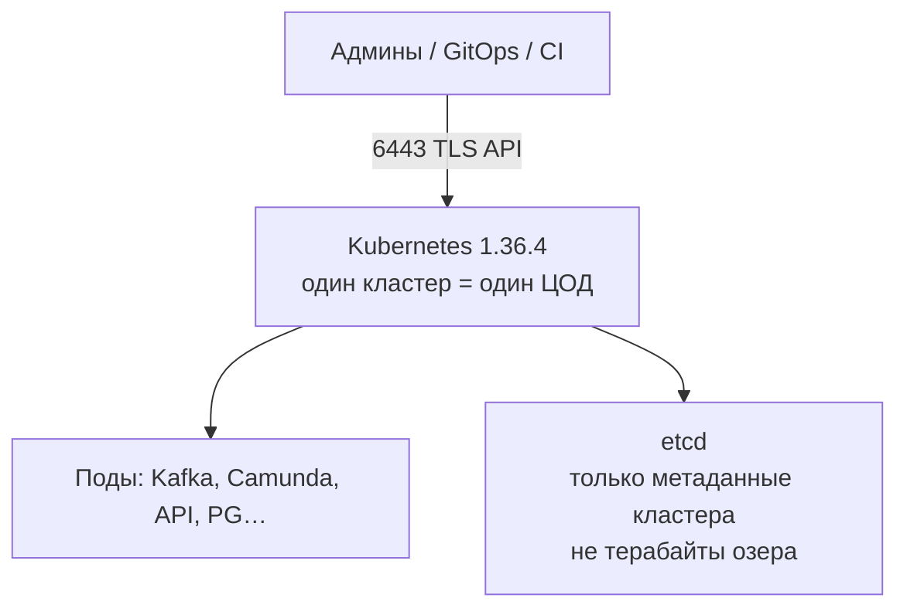
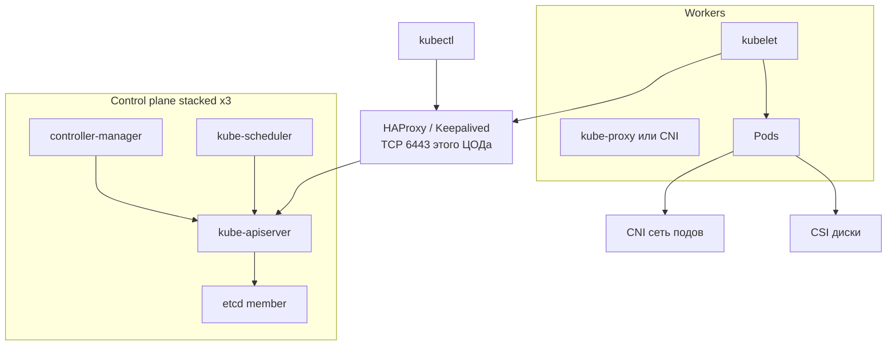
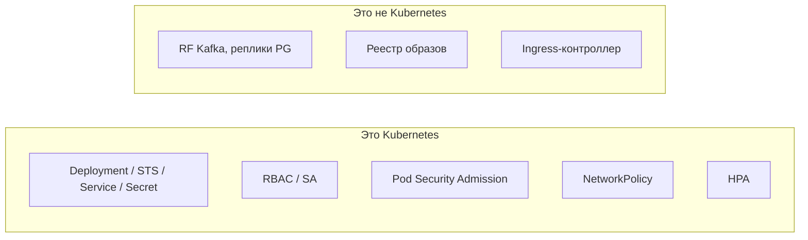
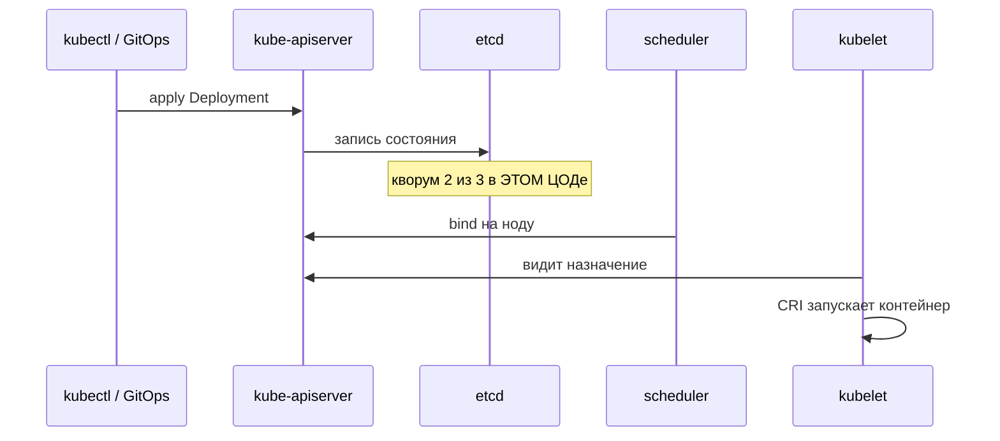
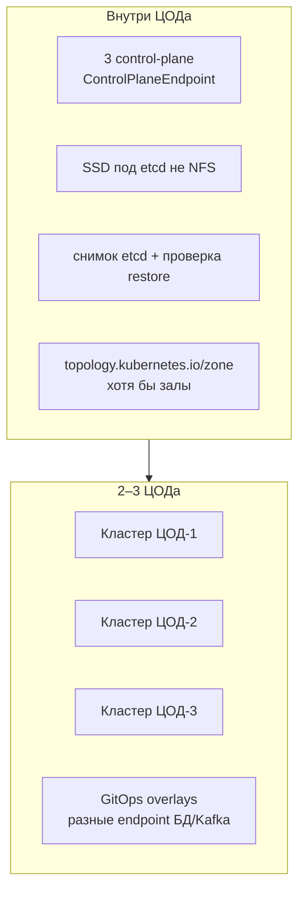
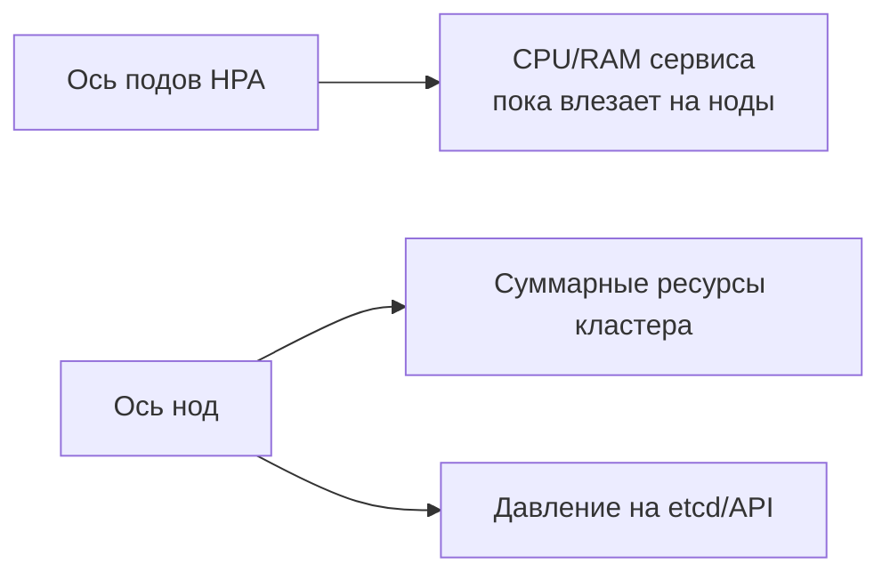
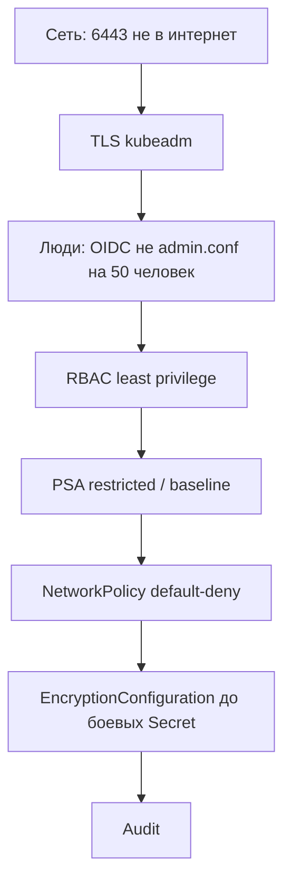

# Kubernetes 1.36.4 — схемы устройства

Связанные документы: `Kubernetes.md`, `Kubernetes.install.md`.

C4 / «D4»: платформа оркестрации, не озеро данных. Stretch etcd на 2–3 ЦОДа **нет**.

Допущения: kubeadm, containerd, Linux; CNI обязан уметь NetworkPolicy (конкретный продукт не зафиксирован); нагрузки нет.

---

## 1. Контекст

Уже запущенные поды переживают короткое падение API. Новые деплои, failover подов, смена Service — **нет**, пока control plane глухой. Терабайты живут в PVC/Kafka/БД, не в etcd (квота порядка 2–8 ГиБ метаданных).

---

## 2. Контейнеры control plane и ноды

Без CNI после `kubeadm init` поды не станут Running. Без CSI нет нормальных дисков для Kafka/Postgres. LoadBalancer «из облачного гайда» на железе сам не появится.

---

## 3. Компоненты, которые путают с «кластером приложений»

HPA масштабирует **поды**. Для Kafka «ещё под» не создаёт партиции. PDB защищает от **добровольного** drain, не от падения ЦОДа.

---

## 4. Поток: создать под

Каждая запись в API платит за Raft etcd **локальной** площадки.

---

## 5. Отказоустойчивость — что настраивать

| Ручка | Если забыть |
|---|---|
| LB :6443 переживает 1 машину | HA control plane на бумаге |
| 3 etcd | Один член = нет переживания отказа |
| zone labels + topologySpread | Все реплики приложения в одном зале |
| encryption at rest Secrets | plaintext в etcd |
| сертификаты kubeadm ~1 год | Внезапный простой API |

Антипаттерн: etcd только в ЦОД-1, воркеры везде. Смерть ЦОД-1 = нельзя поднять поды на живых площадках.

---

## 6. Масштабируемость — что настраивать

Requests обязательны, иначе BestEffort выкинут первыми. Числа «50/250/1000 нод» в доке etcd — примеры нагрузки **на etcd**, не смета вашей системы.

---

## 7. Безопасность (слои)

NetworkPolicy без CNI с поддержкой политик — декорация. KMSv2 если есть KMS; иначе aesgcm с ключом не в Git. KMSv1 не использовать.

---

## 8. Сильное / слабое острова на ЦОД

**Сильное:** etcd локальный, blast radius = площадка, согласовано с документацией etcd.  
**Слабое:** 2–3 PKI, 2–3 upgrade; приложение само активно на нескольких кластерах; без GitOps конфиги разъедутся.

Источники: `Kubernetes.md`. Порога RTT «для etcd» у проекта Kubernetes **нет**.
