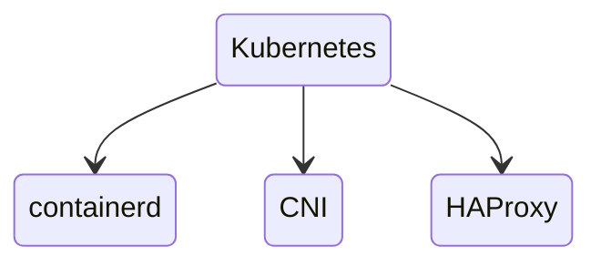
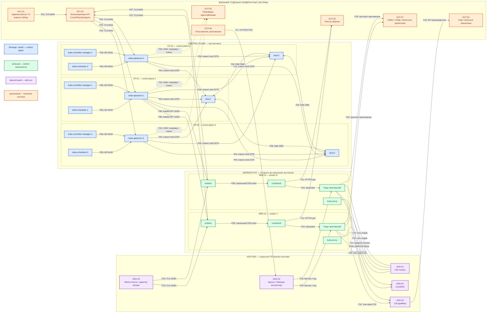

# Kubernetes 1.36.4 — назначение и архитектура

Kubernetes — платформа управления контейнерными приложениями. В этой карточке зафиксирована архитектура **vanilla Kubernetes 1.36.4**, собранного с помощью **kubeadm** и использующего **containerd**. Пошаговая установка вынесена в `Kubernetes.install.md`.

Официальная документация: https://kubernetes.io/docs/home/  
Релиз 1.36.4: https://github.com/kubernetes/kubernetes/releases/tag/v1.36.4  
HA-топология kubeadm: https://kubernetes.io/docs/setup/production-environment/tools/kubeadm/ha-topology/

## Назначение системы

Kubernetes нужен, чтобы одинаково запускать много сервисов на наборе машин, поддерживать заданное число экземпляров, переразмещать процессы после отказа отдельной машины и наращивать вычислительную мощность добавлением подов и нод.

В контексте платформы Kubernetes запускает микросервисы, Camunda и интеграционный слой. В etcd он хранит состояние управления: описания ресурсов, настройки и Secrets. Прикладные терабайты находятся в томах приложений, Kafka, СУБД или объектном хранилище.

Kubernetes **не** является:

- источником истины клиентских карточек;
- шиной событий;
- реестром контейнерных образов;
- системой мониторинга;
- системой репликации прикладных данных;
- автоматическим механизмом синхронизации независимых кластеров.

Он восстанавливает процессы, но сохранность данных обеспечивают сами системы данных и их хранилища.

## Перечень функций

Vanilla Kubernetes 1.36.4 с kubeadm выполняет следующие функции:

1. Поддерживает желаемое состояние приложений через Deployment, ReplicaSet, StatefulSet, DaemonSet и Job.
2. Назначает поды на подходящие ноды с учётом ресурсов, меток, ограничений и правил распределения.
3. Даёт подам стабильные внутренние адреса через Service и DNS.
4. Хранит конфигурацию и секретные значения через ConfigMap и Secret.
5. Ограничивает доступ к API через RBAC и ServiceAccount.
6. Применяет ограничения безопасности подов через Pod Security Admission.
7. Описывает сетевые ограничения через NetworkPolicy при условии, что выбранный CNI их реализует.
8. Масштабирует число подов через HPA при наличии источника метрик.
9. Учитывает PodDisruptionBudget при добровольном выводе нод из эксплуатации.
10. Заказывает постоянные тома через PersistentVolume, PVC и StorageClass при наличии CSI.
11. Предоставляет управляющий HTTPS API через kube-apiserver на порту **6443/TCP**.
12. Хранит состояние кластера в etcd и подтверждает записи большинством его членов.

Объекты Ingress и Gateway API присутствуют в API, но обрабатывающий их контроллер ставится отдельно. Сеть подов, диски, внешний адрес для Service типа `LoadBalancer`, метрики и реестр образов также не появляются из kubeadm автоматически.

## Основные элементы системы и зависимости

### Что входит в состав

Vanilla Kubernetes 1.36.4, собранный kubeadm, состоит из **трёх разных слоёв**. Control plane, worker и add-ons — не синонимы и не взаимозаменяемые названия одной и той же группы процессов.

Официальный обзор: https://kubernetes.io/docs/concepts/overview/components/

**Control plane** управляет состоянием кластера и принимает решения. Это не пул прикладных подов.

| Компонент | Назначение | Принадлежность |
|---|---|---|
| **kube-apiserver** | HTTPS API кластера; единственный компонент, который напрямую читает и пишет состояние в etcd | Control plane, ядро Kubernetes |
| **etcd** | Согласованное хранилище состояния API | Control plane; отдельный проект CNCF, kubeadm поставляет его для этой топологии |
| **kube-scheduler** | Выбирает ноду для пода без назначения | Control plane, ядро Kubernetes |
| **kube-controller-manager** | Запускает контроллеры, которые сближают фактическое состояние с желаемым | Control plane, ядро Kubernetes |
| **cloud-controller-manager** | Интеграция с API облачного провайдера | Опциональный control plane; в on-prem топологии этой карточки не используется |

**Worker** — роль ноды, на которой исполняются прикладные и системные поды. Официально это *node components*: они поддерживают runtime на каждой ноде.

| Компонент | Назначение | Принадлежность |
|---|---|---|
| **kubelet** | Получает PodSpec и держит нужные контейнеры запущенными через CRI | Компонент ноды. Стоит и на control-plane-нодах, чтобы запускать статические поды управления; это не превращает control plane в worker-пул |
| **containerd** | Загружает образы и создаёт контейнеры по запросу kubelet | Runtime ноды этой карточки; не ядро Kubernetes. Альтернатива — CRI-O. Docker Engine здесь не CRI |
| **kube-proxy** | Реализует Service правилами на ноде | Компонент ноды; официально опционален, потому что часть CNI полностью его заменяет |

**Add-ons** расширяют кластер сетью, DNS, хранилищем, входящим трафиком и метриками. Их не следует называть ни control plane, ни worker-компонентами: это отдельный программный слой, обычно сам работающий как поды.

| Компонент | Назначение | Обязательность |
|---|---|---|
| **CNI-плагин** | Сеть подов; выбранная реализация должна уметь NetworkPolicy, если нужна изоляция | Обязателен для рабочего кластера: без CNI после `kubeadm init` поды не станут Running |
| **CoreDNS** | DNS имён Service и подов | DNS add-on; kubeadm ставит его по умолчанию |
| **CSI-драйвер** | Создание и монтирование томов через API конкретной СХД | Нужен для постоянных томов; kubeadm его автоматически не ставит |
| **Ingress / Gateway-контроллер** | Входящий HTTP/HTTPS к Service и подам | Опциональный add-on. Объекты Ingress и Gateway API без контроллера трафик не обслуживают |
| **Metrics Server / адаптер метрик** | Метрики ресурсов или приложений для HPA | Опциональный add-on, не часть базового control plane |

Инструменты **kubeadm** и **kubectl** входят в поставку установки и администрирования, но не являются постоянно работающим слоем кластера.

**Внешние системы** в состав Kubernetes не входят и эксплуатируются отдельно: балансировщик `ControlPlaneEndpoint`, реестр образов, СХД, IdP, Kafka, СУБД и объектное хранилище.

### Схема инстансов и потоков

### Как читать схему

1. Сначала смотрите на цвет и рамку блока. Синие блоки принимают и сохраняют управляющие решения. Зелёные блоки исполняют эти решения на worker-узлах. Фиолетовые блоки добавляют функции, которых нет в базовой установке kubeadm. Оранжевые блоки не принадлежат кластеру и имеют собственный жизненный цикл.
2. Идентификаторы `CP-*`, `WRK-*`, `ADD-*` и `EXT-*` однозначно связывают схему с описаниями ниже. Суффиксы `1`, `2`, `3` показывают независимые инстансы, а `N` — повторяемый worker.
3. Стрелка показывает инициатора соединения. Подпись `F01`–`F20` задаёт поток, протокол или локальный интерфейс. Линия без TCP-порта означает, что точный транспорт определяется реализацией либо взаимодействие происходит локально на ноде.
4. Управляющий путь начинается в `EXT-01`: kubectl или CI обращается к `EXT-02`, а тот выбирает доступный kube-apiserver. Клиент не должен зависеть от адреса одного control-plane-инстанса.
5. kube-apiserver — единственный компонент, который напрямую читает и изменяет состояние Kubernetes в etcd. Каждый kube-apiserver знает адреса всех членов etcd; линии `F04` не означают три изолированные пары. Scheduler и controller-manager работают через API, а не записывают данные в etcd самостоятельно.
6. Три etcd обмениваются сообщениями Raft напрямую по **2380/TCP**. Для подтверждения записи нужны голоса большинства. Балансировщик между членами etcd не используется.
7. На worker-узле kubelet получает назначения через API и просит containerd запустить контейнеры через локальный CRI-сокет. Этот поток не требует открытия сетевого порта между машинами.
8. Путь пользовательского запроса не проходит через kube-apiserver. Пользователь обращается к отдельно установленному входному контроллеру, тот выбирает Service и под приложения.
9. Путь данных приложения к Kafka, СУБД или объектному хранилищу отделён от управляющего пути. Kubernetes может перезапустить под, но не заменяет репликацию и восстановление данных во внешней системе.
10. На схеме add-ons показаны логически по одному разу. В реальном кластере их серверные части могут иметь несколько реплик, а узловые агенты CNI и CSI — работать на каждой подходящей ноде.
11. Схема показывает **stacked etcd**: член etcd находится на том же control-plane-узле, что и kube-apiserver. При варианте external etcd блоки `etcd-1..3` переносятся на отдельные машины, а остальные потоки сохраняются.
12. Схема не означает растяжку одного кластера между дата-центрами. Для контекста платформы базовый вариант — независимый кластер на каждой площадке; данные между площадками реплицируют профильные системы.

### Описание блоков

#### CP-01, CP-02, CP-03 — control-plane-инстансы

- **Назначение:** размещают процессы управления кластером и образуют отказоустойчивый control plane.
- **Реализация:** Linux-узлы, подготовленные kubeadm. На каждом работают kube-apiserver, kube-scheduler и kube-controller-manager; в показанном варианте также локальный член etcd.
- **Варианты:** stacked etcd проще и является вариантом kubeadm по умолчанию. External etcd отделяет хранилище состояния на три дополнительные машины.
- **Принадлежность:** ядро Kubernetes, роль **control plane**. Это не worker-пул и не add-on.

#### kube-apiserver-1..3

- **Назначение:** принимает все управляющие запросы, проверяет их и читает либо изменяет состояние через etcd.
- **Реализация:** несколько stateless-инстансов за `ControlPlaneEndpoint`; каждый слушает **6443/TCP** с TLS.
- **Варианты:** число инстансов и балансировщик зависят от топологии. Управляемые облачные Kubernetes скрывают реализацию, но логическая роль остаётся.
- **Принадлежность:** ядро Kubernetes, **control plane**.

#### kube-scheduler-1..3

- **Назначение:** выбирает ноду для нового пода, который ещё не получил назначение.
- **Реализация:** по экземпляру на control-plane-узел; активное решение принимает лидер.
- **Варианты:** стандартный scheduler допускает профили и расширения; возможен дополнительный scheduler для специальных нагрузок.
- **Принадлежность:** ядро Kubernetes, **control plane**.

#### kube-controller-manager-1..3

- **Назначение:** запускает контроллеры, которые сближают фактическое состояние с желаемым.
- **Реализация:** по экземпляру на control-plane-узел с выбором лидера.
- **Варианты:** внешние операторы добавляют собственные контроллеры, но не становятся частью kube-controller-manager.
- **Принадлежность:** ядро Kubernetes, **control plane**.

#### etcd-1..3

- **Назначение:** хранит состояние Kubernetes и согласует изменения протоколом Raft.
- **Реализация:** нечётное число членов; три члена сохраняют возможность записи при отказе одного. Клиентский порт — **2379/TCP**, обмен членов — **2380/TCP**.
- **Варианты:** stacked etcd на control-plane-узлах или external etcd на отдельных узлах. etcd не предназначен для прикладных терабайтов.
- **Принадлежность:** обязательное хранилище состояния **control plane**, отдельный проект CNCF, поставляемый kubeadm для этой топологии.

#### WRK-01..WRK-N — worker-инстансы

- **Назначение:** предоставляют CPU, RAM и локальные устройства для запуска прикладных и системных подов.
- **Реализация:** Linux-узлы с kubelet, containerd и kube-proxy либо его заменой в выбранном CNI.
- **Варианты:** отдельные пулы для общих, stateful, ingress- или DMZ-нагрузок; число нод определяется измеренной нагрузкой.
- **Принадлежность:** роль **worker**. Процессы scheduler, controller-manager и etcd на таких узлах не требуются.

#### kubelet

- **Назначение:** агент ноды, который получает PodSpec и поддерживает нужные контейнеры запущенными.
- **Реализация:** системный процесс на каждой ноде; обращается к API по **6443/TCP** и предоставляет защищённый API на **10250/TCP**.
- **Варианты:** конфигурация зависит от ОС и политики кластера, но kubelet не заменяется containerd.
- **Принадлежность:** компонент Kubernetes на **worker** и также на control-plane-нодах, где он запускает статические поды.

#### containerd

- **Назначение:** загружает образы и создаёт контейнеры по запросам kubelet.
- **Реализация:** отдельный системный процесс, доступный kubelet через локальный CRI-сокет.
- **Варианты:** CRI-O является альтернативой. Docker Engine не используется как CRI этой карточки.
- **Принадлежность:** инфраструктура ноды, внешний по отношению к ядру Kubernetes runtime; работает на **worker** и control-plane-нодах.

#### kube-proxy

- **Назначение:** реализует маршрутизацию Service на узле.
- **Реализация:** обычно DaemonSet, настраивающий правила ядра Linux.
- **Варианты:** режимы реализации зависят от ОС; некоторые CNI полностью заменяют kube-proxy.
- **Принадлежность:** сетевой компонент Kubernetes на **worker** и других нодах с сетевыми workload.

#### Поды приложений

- **Назначение:** запускают контейнеры бизнес-сервисов и платформенных продуктов.
- **Реализация:** один или несколько контейнеров с общей сетевой областью и подключаемыми томами.
- **Варианты:** управляются Deployment, StatefulSet, DaemonSet, Job либо специализированным оператором.
- **Принадлежность:** workload внутри Kubernetes, обычно на **worker**-узлах; это не control plane.

#### ADD-01 — CNI-плагин

- **Назначение:** создаёт сетевую связность подов; выбранная реализация должна поддерживать NetworkPolicy, если требуется сетевая изоляция.
- **Реализация:** отдельный продукт, например Cilium или Calico, с узловыми агентами и конфигурацией CNI.
- **Варианты:** overlay, маршрутизируемая сеть или eBPF-реализация; набор портов зависит от продукта.
- **Принадлежность:** обязательный для рабочего кластера **add-on**, не часть control plane и не внешняя бизнес-система.

#### ADD-02 — CoreDNS

- **Назначение:** разрешает имена Service и другие внутренние DNS-имена.
- **Реализация:** Deployment и Service в кластере; запросы подов идут на **53/UDP** и при необходимости **53/TCP**.
- **Варианты:** число реплик масштабируется; upstream DNS задаётся конфигурацией.
- **Принадлежность:** DNS **add-on**, который kubeadm устанавливает по умолчанию.

#### ADD-03 — CSI-драйвер

- **Назначение:** создаёт, подключает и монтирует тома через API конкретной системы хранения.
- **Реализация:** контроллерные поды и узловые агенты; фактические данные находятся в `EXT-04`.
- **Варианты:** драйвер СХД, облачного диска, распределённого хранилища или локальных томов.
- **Принадлежность:** **add-on** внутри Kubernetes; сама СХД является внешней системой.

#### ADD-04 — Ingress / Gateway-контроллер

- **Назначение:** принимает внешний прикладной HTTP/HTTPS-трафик и направляет его к Service и подам.
- **Реализация:** отдельный контроллер и data plane, обычно с несколькими репликами.
- **Варианты:** ingress-nginx, Envoy Gateway, HAProxy Ingress и другие совместимые продукты.
- **Принадлежность:** опциональный **add-on**. Объекты Ingress и Gateway API без контроллера трафик не обслуживают.

#### ADD-05 — Metrics Server / адаптер метрик

- **Назначение:** предоставляет метрики ресурсов или приложений для HPA и пользовательских запросов.
- **Реализация:** Metrics Server читает kubelet API; адаптер может публиковать метрики внешнего мониторинга.
- **Варианты:** Metrics Server, Prometheus Adapter или другой совместимый источник.
- **Принадлежность:** опциональный **add-on**, не kube-scheduler и не часть базового control plane.

#### EXT-01 — администратор и CI

- **Назначение:** отправляет декларации и команды в Kubernetes API.
- **Реализация:** kubectl, Helm, GitLab Agent, Argo CD, Flux или клиент Kubernetes API.
- **Варианты:** ручное управление, CI/CD или GitOps.
- **Принадлежность:** внешняя отдельно эксплуатируемая система либо рабочая станция; не компонент кластера.

#### EXT-02 — балансировщик API

- **Назначение:** предоставляет стабильный `ControlPlaneEndpoint` и направляет TCP-соединение на доступный kube-apiserver.
- **Реализация:** отказоустойчивая пара HAProxy, аппаратный ADC или облачный load balancer.
- **Варианты:** конкретный продукт выбирается инфраструктурой; проверка доступности должна соответствовать HA-схеме.
- **Принадлежность:** внешняя отдельно развёрнутая система перед control plane.

#### EXT-03 — реестр образов

- **Назначение:** хранит версии контейнерных образов, которые загружает containerd.
- **Реализация:** корпоративный Harbor или другой OCI-совместимый registry; для системных образов возможны `registry.k8s.io` или зеркало.
- **Варианты:** локальный, облачный или проксирующий реестр.
- **Принадлежность:** внешняя отдельно развёрнутая система.

#### EXT-04 — система хранения

- **Назначение:** физически хранит данные PersistentVolume.
- **Реализация:** СХД, облачные диски или распределённая система хранения с подходящим CSI-драйвером.
- **Варианты:** блочное, файловое или объектное хранилище — по возможностям приложения и драйвера.
- **Принадлежность:** внешняя отдельно развёрнутая система; CSI внутри кластера является только её интеграционным слоем.

#### EXT-05 — провайдер идентификации

- **Назначение:** аутентифицирует людей и выдаёт удостоверяющие токены.
- **Реализация:** корпоративный IdP с OIDC; права после аутентификации определяет RBAC Kubernetes.
- **Варианты:** другой поддерживаемый kube-apiserver механизм аутентификации.
- **Принадлежность:** внешняя отдельно развёрнутая система.

#### EXT-06 — пользователь приложения

- **Назначение:** вызывает бизнес-сервис, работающий в подах.
- **Реализация:** браузер, мобильное приложение или внешняя информационная система.
- **Варианты:** HTTP/HTTPS или иной опубликованный приложением протокол.
- **Принадлежность:** внешний клиент; не пользователь Kubernetes API.

#### EXT-07 — Kafka, СУБД и объектное хранилище

- **Назначение:** хранят и передают прикладные данные.
- **Реализация:** определяется отдельными карточками соответствующих продуктов.
- **Варианты:** система может находиться вне Kubernetes или запускаться как stateful workload, но её модель репликации остаётся собственной.
- **Принадлежность:** на схеме показана как внешняя система, чтобы не смешивать управление подами и сохранность бизнес-данных.

### Порты (контракт сети)

| Порт или интерфейс | Назначение | Кому открывать |
|---|---|---|
| **6443/TCP** | HTTPS API kube-apiserver | kubectl, CI/GitOps, kubelet, контроллеры и балансировщик. Не публиковать в интернет |
| **2379/TCP** | Клиентский API etcd | Только kube-apiserver и разрешённые административные операции etcd |
| **2380/TCP** | Обмен Raft между членами etcd | Только члены одного etcd-кластера, напрямую друг к другу |
| **10250/TCP** | API kubelet | kube-apiserver и разрешённые системы метрик. Не публиковать в интернет |
| **10257/TCP** | Защищённый endpoint kube-controller-manager | Только служебная связность и мониторинг control plane |
| **10259/TCP** | Защищённый endpoint kube-scheduler | Только служебная связность и мониторинг control plane |
| **53/UDP, 53/TCP** | DNS-запросы подов к CoreDNS Service | Внутри сети кластера |
| **локальный CRI-сокет** | kubelet вызывает containerd | Только на той же ноде; сетевой порт не открывается |
| **порты CNI / overlay** | Передача трафика подов и служебного трафика выбранной сети | Между нодами одного кластера согласно документации выбранного CNI |
| **порты CSI / СХД** | Управление и передача данных томов | Согласно документации CSI-драйвера и системы хранения |
| **HTTP/HTTPS приложения** | Входящий бизнес-трафик | Через выбранный Ingress/Gateway и внешний балансировщик |

Балансировщик API работает перед **6443/TCP**. Он не заменяет прямой обмен etcd по **2380/TCP**. Порты CNI, CSI, реестра, IdP и приложений нельзя назначить «общим стандартом Kubernetes»: их фиксируют после выбора конкретных продуктов.

## Архитектурные свойства и ограничения

### Отказоустойчивость

Control plane доступен для изменений, пока kube-apiserver может записывать в etcd-кворум. Три члена etcd сохраняют кворум при отказе одного, но теряют возможность записи при отказе двух. Уже запущенные поды обычно продолжают работать при временной недоступности control plane, однако новые назначения, масштабирование и перенос упавших подов невозможны.

Отказоустойчивость приложения требует отдельно:

- нескольких реплик подов;
- правил распределения по нодам и зонам;
- PodDisruptionBudget для плановых работ;
- репликации данных средствами Kafka, СУБД или СХД.

Один Kubernetes-кластер не следует растягивать на три дата-центра при неизвестной задержке. Документация etcd рекомендует по возможности размещать членов в одном дата-центре. В контексте этой платформы используются независимые кластеры по площадкам, а межплощадочную репликацию выполняют профильные системы.

### Масштабирование

Масштабирование имеет две независимые оси:

1. Увеличение числа подов даёт больше экземпляров приложения, пока хватает ресурсов существующих нод.
2. Добавление worker-нод увеличивает доступные вычислительные ресурсы, но одновременно повышает нагрузку на kube-apiserver и etcd.

Добавление пода stateful-продукта не гарантирует увеличение ёмкости или отказоустойчивости его данных. Партиции, шарды и коэффициент репликации настраиваются в самом продукте.

### Безопасность

Kubernetes разделяет аутентификацию, авторизацию и политики выполнения. Людей аутентифицирует IdP или клиентские сертификаты; RBAC ограничивает API-действия; ServiceAccount идентифицирует workload; Pod Security Admission ограничивает свойства подов; NetworkPolicy ограничивает сетевые потоки при поддержке со стороны CNI.

TLS до kube-apiserver защищает данные в сети, но не шифрует Secrets на диске etcd. Без EncryptionConfiguration API-сервер сохраняет эти ресурсы в etcd без шифрования содержимого. Компрометация `admin.conf` или учётной записи `cluster-admin` означает административный доступ ко всему кластеру.

## Глоссарий

- **ADC** — аппаратный или программный контроллер доставки приложений, который может выполнять роль балансировщика.
- **Add-on** — отдельный программный компонент, расширяющий Kubernetes; не относится к ядру control plane.
- **Affinity** — правило предпочтительного или обязательного совместного либо раздельного размещения подов.
- **API** — программный интерфейс, через который клиенты читают и изменяют ресурсы Kubernetes.
- **API endpoint** — сетевой адрес, на котором доступен API.
- **Аутентификация** — проверка того, кем является клиент.
- **Авторизация** — проверка того, разрешено ли клиенту конкретное действие.
- **CI/CD** — автоматизированный процесс сборки, проверки и доставки изменений.
- **CNI** — стандарт подключения контейнеров к сети и программный плагин, который этот стандарт реализует.
- **ConfigMap** — объект Kubernetes для несекретной конфигурации.
- **Container runtime** — программа, которая загружает образы и запускает контейнеры.
- **containerd** — используемый в этой карточке container runtime.
- **Control plane** — группа компонентов, принимающих и сохраняющих управляющие решения кластера.
- **ControlPlaneEndpoint** — стабильный адрес API, обычно указывающий на балансировщик перед несколькими kube-apiserver.
- **Контейнер** — изолированный процесс с упакованным приложением и его зависимостями.
- **Контроллер** — цикл управления, который сравнивает желаемое и фактическое состояния и устраняет расхождение.
- **CRI** — стандарт взаимодействия kubelet с container runtime.
- **CSI** — стандарт интеграции оркестратора с системами хранения и драйвер, который его реализует.
- **DaemonSet** — контроллер, поддерживающий под на каждой подходящей ноде.
- **Data plane** — компоненты, через которые проходит прикладной трафик.
- **Deployment** — контроллер обновления и масштабирования взаимозаменяемых подов.
- **DMZ** — изолированный сетевой сегмент для систем, доступных из менее доверенных сетей.
- **DNS** — система преобразования имён в сетевые адреса.
- **Drain** — управляемое выселение подов с ноды перед обслуживанием.
- **eBPF** — механизм ядра Linux, который некоторые CNI используют для сети, наблюдаемости и политик.
- **EncryptionConfiguration** — конфигурация kube-apiserver для шифрования выбранных ресурсов перед записью в etcd.
- **etcd** — распределённое хранилище состояния Kubernetes.
- **External etcd** — топология, в которой члены etcd работают на отдельных от control plane машинах.
- **Gateway API** — набор ресурсов Kubernetes для описания публикации и маршрутизации сетевого трафика.
- **GitOps** — управление состоянием системы через декларации в Git и автоматический контроллер синхронизации.
- **HA** — архитектура, сохраняющая сервис при предусмотренных отказах компонентов.
- **Helm** — клиент и формат пакетов шаблонов ресурсов Kubernetes.
- **HPA** — контроллер, изменяющий число подов по метрикам.
- **IdP** — внешняя система, которая аутентифицирует пользователей.
- **Ingress** — ресурс с правилами публикации HTTP/HTTPS-сервисов.
- **Инстанс** — отдельный запущенный экземпляр процесса или отдельная машина заданной роли.
- **Job** — контроллер выполнения завершающейся задачи.
- **Кластер** — совместно управляемая группа control-plane- и worker-узлов.
- **KMS** — внешняя система управления криптографическими ключами.
- **kubeadm** — официальный инструмент подготовки control plane и присоединения нод Kubernetes.
- **kubectl** — командный клиент Kubernetes API.
- **kube-apiserver** — сервер управляющего API Kubernetes.
- **kube-controller-manager** — процесс стандартных контроллеров Kubernetes.
- **kubelet** — агент ноды, управляющий назначенными ей подами через CRI.
- **kube-proxy** — узловой компонент реализации Service; может заменяться возможностями CNI.
- **kube-scheduler** — компонент, выбирающий ноду для нового пода.
- **Кворум** — минимальное большинство членов etcd, необходимое для согласованной записи.
- **Leader election** — выбор одного активного исполнителя среди нескольких экземпляров.
- **Load balancer** — система, распределяющая соединения между доступными инстансами.
- **Manifest** — декларативное описание ресурса Kubernetes, обычно в YAML.
- **Metrics Server** — add-on, публикующий метрики CPU и памяти нод и подов.
- **Namespace** — логическая область группировки и разграничения ресурсов Kubernetes.
- **NetworkPolicy** — объект с правилами разрешённого сетевого обмена подов.
- **Нода** — машина, включённая в кластер Kubernetes.
- **OCI registry** — сервер хранения контейнерных образов совместимого формата.
- **OIDC** — протокол передачи удостоверяющей информации от IdP клиенту и API.
- **Оператор** — специализированный контроллер для управления приложением через собственные ресурсы Kubernetes.
- **Overlay** — виртуальная сеть поверх существующей сети нод.
- **PersistentVolume** — объект, представляющий постоянный том.
- **Pod** — минимальная единица запуска Kubernetes из одного или нескольких контейнеров.
- **PodDisruptionBudget** — ограничение числа одновременно недоступных реплик при добровольных операциях.
- **Pod Security Admission** — встроенный механизм применения профилей безопасности к подам.
- **PodSpec** — часть описания пода с контейнерами и параметрами выполнения.
- **Prometheus Adapter** — add-on, публикующий метрики Prometheus через API метрик Kubernetes.
- **PVC** — запрос workload на постоянный том.
- **Raft** — протокол согласования состояния между членами etcd.
- **RBAC** — модель авторизации по ролям и привязкам ролей.
- **ReplicaSet** — контроллер, поддерживающий заданное число одинаковых подов.
- **Secret** — объект Kubernetes для чувствительных значений; сам тип объекта не гарантирует шифрование в etcd.
- **Service** — стабильная сетевая точка доступа к группе подов.
- **ServiceAccount** — идентичность workload для обращения к Kubernetes API.
- **SPOF** — единственный компонент, отказ которого останавливает сервис.
- **Stacked etcd** — топология, в которой член etcd работает на каждом control-plane-узле.
- **Stateful workload** — нагрузка, корректность которой зависит от сохраняемого состояния и стабильной идентичности.
- **StatefulSet** — контроллер подов со стабильными именами и связанными томами.
- **StorageClass** — описание класса хранилища и способа динамического создания томов.
- **Taint / toleration** — метка запрета на ноде и явное разрешение поду этот запрет принять.
- **TLS** — криптографическая защита сетевого соединения с проверкой сертификатов.
- **TopologySpreadConstraints** — правила равномерного распределения подов по доменам топологии.
- **VIP** — виртуальный IP-адрес, который предоставляет отказоустойчивая группа балансировщиков.
- **Worker** — роль ноды, на которой запускаются прикладные и системные поды.
- **Workload** — приложение или задача, запускаемые Kubernetes.

## Источники

- Релиз Kubernetes 1.36.4: https://github.com/kubernetes/kubernetes/releases/tag/v1.36.4
- Компоненты Kubernetes: https://kubernetes.io/docs/concepts/overview/components/
- Порты и протоколы: https://kubernetes.io/docs/reference/networking/ports-and-protocols/
- HA-топологии kubeadm, stacked и external etcd: https://kubernetes.io/docs/setup/production-environment/tools/kubeadm/ha-topology/
- Сборка HA kubeadm и балансировщик API: https://kubernetes.io/docs/setup/production-environment/tools/kubeadm/high-availability/
- Сетевая модель и CNI: https://kubernetes.io/docs/concepts/cluster-administration/networking/
- CSI и постоянные тома: https://kubernetes.io/docs/concepts/storage/volumes/
- DNS для Service и подов: https://kubernetes.io/docs/concepts/services-networking/dns-pod-service/
- etcd hardware и рекомендация размещения: https://etcd.io/docs/v3.6/op-guide/hardware/
- Шифрование данных Kubernetes API в etcd: https://kubernetes.io/docs/tasks/administer-cluster/encrypt-data/
- Pod Security Standards: https://kubernetes.io/docs/concepts/security/pod-security-standards/
