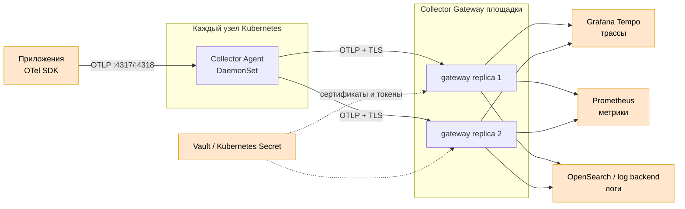

# OpenTelemetry Collector 0.159.0 — приём и маршрутизация телеметрии

В запросе продукт назван **Open Telemetry Controller**. Официальное название — **OpenTelemetry Collector** (далее Collector): отдельная программа, которая принимает телеметрию, обрабатывает её и экспортирует в один или несколько бэкендов.

Этот документ фиксирует дистрибутивы Collector **0.159.0**, выпущенные 18 августа 2026. Используем конкретный тег, не `latest`. Выбор Core, Contrib или Kubernetes distribution делается по необходимым компонентам; их состав различается.

Документация: https://opentelemetry.io/docs/collector/  
Релизы: https://github.com/open-telemetry/opentelemetry-collector-releases/releases  
Архитектура: https://opentelemetry.io/docs/collector/architecture/

---

## Назначение системы

Collector отделяет приложения от хранилищ наблюдаемости. Приложение отправляет OTLP в стабильный локальный endpoint, а Collector выполняет пакетирование, ограничение памяти, фильтрацию, обогащение ресурсными атрибутами, сэмплирование, повторные отправки и маршрутизацию.

Collector **не** является долговременной базой, очередью уровня Kafka или интерфейсом аналитики. При переполнении памяти/очереди данные могут быть отброшены. Хранение и поиск обеспечивают Tempo, Prometheus, OpenSearch и другие внешние системы.

---

## Перечень функций

1. **Принимать** трассы, метрики и логи через receivers; основной внутренний контракт — OTLP.
2. **Обрабатывать** данные processors: batch, memory limiter, фильтрация, преобразование, resource/k8s attributes.
3. **Экспортировать** данные через exporters в OTLP-бэкенды, Prometheus/remote write, журнальные системы и другие цели.
4. **Разветвлять** один вход в несколько pipelines и бэкендов.
5. **Буферизовать и повторять отправку** через sending queue; это ограниченная очередь, а не гарантированное долговременное хранение.
6. **Выполнять tail sampling** после получения спанов трейса, если все спаны одного Trace ID маршрутизированы в один обработчик.
7. **Собирать локальную телеметрию узла/кластера** через подходящие receivers дистрибутива.
8. **Экспортировать собственные метрики** (`otelcol_*`) для Prometheus.
9. **Работать как agent, gateway или двухуровневая схема**.
10. **Управляться OpenTelemetry Operator** в Kubernetes через ресурс `OpenTelemetryCollector`.

Чего система не гарантирует: долговременное хранение, exactly-once, автоматическую HA любого stateful processor и безопасность открытого OTLP endpoint без TLS/сетевой политики.

---

## Основные элементы системы и зависимости

### Схема инстансов и потоков

Оранжевые блоки — части других систем. Collector состоит из agent/gateway процессов и загруженных в них компонентов.

### Описание компонентов

- **Receiver** — вход конвейера. Может слушать OTLP или сам опрашивать источник. Реализован модулем Collector.
- **Processor** — изменяет, ограничивает, пакетирует или сэмплирует данные. Работает внутри процесса Collector.
- **Exporter** — выход конвейера в целевой бэкенд. Хранит ограниченную очередь в памяти или, при поддерживаемой конфигурации, на локальном диске.
- **Connector** — связывает два pipeline как exporter одного и receiver другого.
- **Extension** — служебная функция процесса: health check, диагностика, auth и другие возможности конкретного дистрибутива.
- **Agent Collector** — экземпляр рядом с источником, обычно DaemonSet на узлах Kubernetes. Собирает локальные данные и отправляет gateway.
- **Gateway Collector** — один или несколько централизованных экземпляров площадки. Выполняет общую фильтрацию, сэмплирование и экспорт.
- **OpenTelemetry Operator** — отдельный Kubernetes Operator, создающий Collector и автоинструментацию. Не входит в бинарник Collector.
- **Tempo, Prometheus, OpenSearch, Vault** — внешние системы; их отказоустойчивость Collector не обеспечивает.

### Как читать схему

1. Приложение отправляет данные локальному agent, уменьшая зависимость от внешней сети.
2. Agent добавляет сведения об узле и отправляет OTLP в gateway своей площадки.
3. Без tail sampling обычный Kubernetes Service может распределять запросы между gateway.
4. При tail sampling все спаны одного Trace ID должны попасть в одну gateway-реплику; для этого нужен trace-aware `loadbalancingexporter` в предыдущем уровне.
5. Gateway разделяет сигналы: трассы в Tempo, метрики в Prometheus, логи в журнальный бэкенд.
6. Поток между площадками не изображён: при неизвестном RTT каждая площадка имеет собственный доступный gateway.

Термины:

- **Pipeline** — цепочка receivers → processors → exporters для одного типа сигнала.
- **Agent** — Collector рядом с источником телеметрии.
- **Gateway** — централизованный Collector за стабильным endpoint.
- **Tail sampling** — решение о сохранении после получения частей трейса.
- **Backpressure** — замедление/отказ при невозможности быстро передать данные дальше.
- **Sending queue** — ограниченная очередь exporter перед повторной отправкой.
- **Distribution** — готовая сборка Collector с определённым набором компонентов.

### Что входит в состав

| Элемент | Назначение | Масштабирование |
|---|---|---|
| Collector process | Запускает service и pipelines | Больше независимых реплик |
| Receivers | Приём/сбор данных | Зависит от receiver; некоторые должны быть одиночными |
| Processors | Обработка и защита ресурсов | Stateless — горизонтально; stateful требует маршрутизации |
| Exporters | Отправка в бэкенды | По репликам, с лимитами целевой системы |
| Connectors | Связь pipelines | Внутри процесса |
| Extensions | Health/auth/диагностика | Внутри процесса |

### Порты (контракт сети)

| Порт | Назначение | Кому открывать |
|---|---|---|
| **4317/TCP** | OTLP/gRPC receiver | SDK/agent → Collector |
| **4318/TCP** | OTLP/HTTP receiver | SDK/agent → Collector |
| **8888/TCP** | Prometheus-метрики самого Collector в официальном compose-примере | Только Prometheus |
| **8889/TCP** | Prometheus exporter в примере | Только согласованному потребителю |
| **13133/TCP** | health_check extension, если включено | Kubernetes probes/внутренняя сеть |
| **55679/TCP** | zPages, если включено | Только диагностика в закрытом контуре |

Collector открывает только endpoint компонентов, включённых в конфигурацию. Диагностические порты не публиковать наружу.

---

## Краткие вводные

### Отказоустойчивость

Stateless gateway масштабируется несколькими репликами за Service. Stateful processors меняют модель:

- tail sampling требует собрать один трейс на одной реплике;
- receivers, читающие один источник, могут дублировать данные при слепом масштабировании;
- локальная очередь конкретного пода исчезает вместе с диском/подом;
- живой Collector не компенсирует недоступный Tempo, Prometheus или OpenSearch бесконечно.

### Масштабирование

Основные сигналы: входные items/bytes в секунду, CPU, RSS memory, длина и заполнение sending queue, dropped/refused telemetry, latency и ошибки exporter. Реплики добавляют только после проверки stateful-компонентов и семантики источника.

### Безопасность

- OTLP ingress и egress в бою — TLS/mTLS и NetworkPolicy.
- Токены бэкендов — в Secret/Vault, не в ConfigMap и не в git.
- Фильтровать секреты и персональные данные до экспорта.
- zPages и подробный `debug` exporter могут раскрывать содержимое телеметрии.
- Ограничивать размеры сообщений, память и очереди; открытый receiver — канал DoS и подделки телеметрии.

---

## Допущения

1. Используется Collector **0.159.0** с зафиксированным дистрибутивом.
2. Для Kubernetes выбран официальный Operator или официальный Helm chart; это проектное решение, не часть самого бинарника.
3. На каждой площадке есть agent DaemonSet и минимум две gateway-реплики.
4. Приложения используют OTLP, а vendor-specific receivers включаются только при необходимости.
5. Tail sampling включается лишь после настройки Trace ID-aware маршрутизации.
6. Нагрузка неизвестна, поэтому CPU/RAM и размер очередей не выдумываются — нужны измерения.

---

## Источники

- Collector overview: https://opentelemetry.io/docs/collector/
- Релизы 0.159.0: https://github.com/open-telemetry/opentelemetry-collector-releases/releases/tag/v0.159.0
- Дистрибутивы: https://opentelemetry.io/docs/collector/distributions/
- Архитектура и pipelines: https://opentelemetry.io/docs/collector/architecture/
- Конфигурация: https://opentelemetry.io/docs/collector/configuration/
- Agent deployment: https://opentelemetry.io/docs/collector/deploy/agent/
- Gateway deployment: https://opentelemetry.io/docs/collector/deploy/gateway/
- Agent-to-gateway: https://opentelemetry.io/docs/collector/deploy/other/agent-to-gateway/
- Масштабирование: https://opentelemetry.io/docs/collector/scaling/
- Устранение неполадок: https://opentelemetry.io/docs/collector/troubleshooting/
- Operator: https://opentelemetry.io/docs/platforms/kubernetes/operator/
