# OpenTelemetry Collector 0.159.0 — приём и маршрутизация телеметрии

В запросе продукт назван **Open Telemetry Controller**. Официальное название — **OpenTelemetry Collector** (далее Collector): отдельная программа, которая принимает телеметрию, обрабатывает её и экспортирует в один или несколько бэкендов.

Этот документ фиксирует дистрибутивы Collector **0.159.0**, выпущенные 18 августа 2026 года. Используется конкретный тег, не `latest`. Выбор Core, Contrib, Kubernetes или OTLP distribution зависит от необходимых компонентов: состав сборок различается и проверяется по `manifest.yaml`.

Документация: https://opentelemetry.io/docs/collector/  
Релиз 0.159.0: https://github.com/open-telemetry/opentelemetry-collector-releases/releases/tag/v0.159.0  
Архитектура: https://opentelemetry.io/docs/collector/architecture/

---

## Назначение системы

Collector отделяет приложения от хранилищ наблюдаемости. Приложение отправляет OTLP в стабильный локальный endpoint, а Collector выполняет пакетирование, ограничение памяти, фильтрацию, обогащение ресурсными атрибутами, сэмплирование, повторные отправки и маршрутизацию.

Collector **не** является долговременной базой, очередью уровня Kafka или интерфейсом аналитики. При переполнении памяти/очереди данные могут быть отброшены. Хранение и поиск обеспечивают Tempo, Prometheus, OpenSearch и другие внешние системы.

---

## Перечень функций

1. **Принимать** трассы, метрики и логи через receivers; основной внутренний контракт — OTLP.
2. **Обрабатывать** данные processors: batch, memory limiter, фильтрация, преобразование, resource/k8s attributes.
3. **Экспортировать** данные через exporters в OTLP-бэкенды, Prometheus/remote write, журнальные системы и другие цели.
4. **Разветвлять** один вход в несколько pipelines и бэкендов.
5. **Буферизовать и повторять отправку** через sending queue; это ограниченная очередь, а не гарантированное долговременное хранение.
6. **Выполнять tail sampling** после получения спанов трейса, если все спаны одного Trace ID маршрутизированы в один обработчик.
7. **Собирать локальную телеметрию узла/кластера** через подходящие receivers дистрибутива.
8. **Экспортировать собственные метрики** (`otelcol_*`) для Prometheus.
9. **Работать как agent, gateway или двухуровневая схема**.
10. **Управляться OpenTelemetry Operator** в Kubernetes через ресурс `OpenTelemetryCollector`.

Чего система не гарантирует: долговременное хранение, exactly-once, автоматическую HA любого stateful processor и безопасность открытого OTLP endpoint без TLS/сетевой политики.

---

## Основные элементы системы и зависимости

Показанная ниже схема — точная модель потоков для рассматриваемого варианта с тремя Kubernetes-площадками, а не требование к любому внедрению. Число узлов, agent- и gateway-инстансов, состав pipelines, протокол к каждому бэкенду и использование Operator определяются проектом. Допустимы и более простые модели: только agent, только gateway либо прямая отправка в бэкенд.

### Что входит в состав

| Элемент | Назначение | Масштабирование |
|---|---|---|
| Collector process | Запускает service и pipelines | Больше независимых реплик |
| Receivers | Приём/сбор данных | Зависит от receiver; некоторые должны быть одиночными |
| Processors | Обработка и защита ресурсов | Stateless — горизонтально; stateful требует маршрутизации |
| Exporters | Отправка в бэкенды | По репликам, с лимитами целевой системы |
| Connectors | Связь pipelines | Внутри процесса |
| Extensions | Health/auth/диагностика | Внутри процесса |

Фактический набор модулей определяется выбранным distribution. Например, в `otelcol-k8s` 0.159.0 есть OTLP receiver/exporters, `loadbalancing` exporter, `memory_limiter`, `batch`, `tail_sampling`, `file_storage` и `health_check`, но нет `prometheus` и `prometheusremotewrite` exporters; оба присутствуют в `otelcol-contrib` 0.159.0. Это различие не делает Contrib обязательным: можно выбрать иной готовый distribution или собственную сборку после проверки manifest.

### Порты (контракт сети)

| Порт | Назначение | Кому открывать |
|---|---|---|
| **4317/TCP** | OTLP/gRPC receiver, если настроен этот endpoint | SDK/agent → Collector |
| **4318/TCP** | OTLP/HTTP receiver, если настроен этот endpoint | SDK/agent → Collector |
| **8888/TCP** | Prometheus-метрики самого Collector в официальном compose-примере | Только Prometheus |
| **8889/TCP** | Prometheus exporter в официальном примере | Только согласованному потребителю |
| **13133/TCP** | `health_check` extension, если включено | Kubernetes probes/внутренняя сеть |
| **55679/TCP** | zPages, если включено | Только диагностика в закрытом контуре |

Это известные порты, а не список автоматически открываемых сокетов. Collector слушает только endpoint компонентов, включённых в конфигурацию; адрес привязки и порт можно изменить. Диагностические endpoint не следует публиковать во внешнюю сеть.

### Схема инстансов и потоков

```mermaid
flowchart LR
  subgraph SITE1["Площадка 1 — Kubernetes"]
    W1["Рабочие нагрузки 1<br/>OTel SDK / иные источники"]
    AG1["Agent-инстансы 1[1..N]<br/>Collector Pods / DaemonSet"]
    SVC1["Gateway endpoint 1<br/>Service или headless Service"]
    GW1["Gateway-инстансы 1[1..M]<br/>Collector Pods"]
    SEC1["Kubernetes Secret 1"]
    W1 -->|"телеметрия: OTLP/gRPC :4317<br/>или OTLP/HTTP :4318"| AG1
    AG1 -->|"вариант A: OTLP через Service"| SVC1
    SVC1 -->|"распределение соединений"| GW1
    AG1 -->|"вариант B вместо Service proxy:<br/>маршрутизация по данным"| GW1
    SEC1 -.->|"сертификаты / токены<br/>через конфигурацию Pod"| AG1
    SEC1 -.->|"сертификаты / токены<br/>через конфигурацию Pod"| GW1
  end

  subgraph SITE2["Площадка 2 — Kubernetes"]
    W2["Рабочие нагрузки 2<br/>OTel SDK / иные источники"]
    AG2["Agent-инстансы 2[1..N]<br/>Collector Pods / DaemonSet"]
    SVC2["Gateway endpoint 2<br/>Service или headless Service"]
    GW2["Gateway-инстансы 2[1..M]<br/>Collector Pods"]
    SEC2["Kubernetes Secret 2"]
    W2 -->|"телеметрия: OTLP"| AG2
    AG2 -->|"вариант A: OTLP через Service"| SVC2
    SVC2 -->|"распределение соединений"| GW2
    AG2 -->|"вариант B вместо Service proxy:<br/>маршрутизация по данным"| GW2
    SEC2 -.-> AG2
    SEC2 -.-> GW2
  end

  subgraph SITE3["Площадка 3 — Kubernetes"]
    W3["Рабочие нагрузки 3<br/>OTel SDK / иные источники"]
    AG3["Agent-инстансы 3[1..N]<br/>Collector Pods / DaemonSet"]
    SVC3["Gateway endpoint 3<br/>Service или headless Service"]
    GW3["Gateway-инстансы 3[1..M]<br/>Collector Pods"]
    SEC3["Kubernetes Secret 3"]
    W3 -->|"телеметрия: OTLP"| AG3
    AG3 -->|"вариант A: OTLP через Service"| SVC3
    SVC3 -->|"распределение соединений"| GW3
    AG3 -->|"вариант B вместо Service proxy:<br/>маршрутизация по данным"| GW3
    SEC3 -.-> AG3
    SEC3 -.-> GW3
  end

  TEMPO["Grafana Tempo<br/>хранение трасс"]
  METRICS["Prometheus / совместимый бэкенд<br/>хранение метрик"]
  LOGS["OpenSearch / иной log backend<br/>хранение логов"]
  VAULT["Vault<br/>источник секретов, если используется"]

  GW1 -->|"трассы: настроенный exporter"| TEMPO
  GW2 -->|"трассы: настроенный exporter"| TEMPO
  GW3 -->|"трассы: настроенный exporter"| TEMPO
  GW1 -->|"метрики: remote write / OTLP<br/>если поддержано целью и distribution"| METRICS
  GW2 -->|"метрики: настроенный exporter"| METRICS
  GW3 -->|"метрики: настроенный exporter"| METRICS
  METRICS -->|"альтернатива push: scrape<br/>настроенного Prometheus endpoint"| GW1
  METRICS -->|"scrape, если выбран этот вариант"| GW2
  METRICS -->|"scrape, если выбран этот вариант"| GW3
  GW1 -->|"логи: настроенный exporter"| LOGS
  GW2 -->|"логи: настроенный exporter"| LOGS
  GW3 -->|"логи: настроенный exporter"| LOGS
  VAULT -.->|"синхронизация определяется платформой"| SEC1
  VAULT -.->|"синхронизация определяется платформой"| SEC2
  VAULT -.->|"синхронизация определяется платформой"| SEC3

  subgraph LEGEND["Легенда"]
    LC["Синий — процесс(ы) Collector"]
    LP["Серый — объект Kubernetes"]
    LE["Оранжевый — отдельно развёрнутая<br/>внешняя система или нагрузка"]
    LD["Сплошная стрелка — поток телеметрии"]
    LM["Пунктирная стрелка — передача<br/>конфигурации или секретов"]
  end

  classDef collector fill:#d9eaff,stroke:#2563eb,color:#111827;
  classDef platform fill:#eeeeee,stroke:#666666,color:#111111;
  classDef external fill:#ffe6cc,stroke:#d79b00,color:#111111;
  class AG1,AG2,AG3,GW1,GW2,GW3,LC collector;
  class SVC1,SVC2,SVC3,SEC1,SEC2,SEC3,LP platform;
  class W1,W2,W3,TEMPO,METRICS,LOGS,VAULT,LE external;
```

### Описание компонентов схемы

- **Рабочие нагрузки 1–3** — приложения, sidecar-процессы или другие источники сигналов на соответствующей площадке. Технологии: OpenTelemetry SDK, автоинструментация либо поддерживаемый receiver-протокол. Назначение — создать или предоставить телеметрию. Это не часть Collector и развёртывается отдельно.
- **Agent-инстансы 1–3 `[1..N]`** — процессы Collector рядом с источниками; в показанном Kubernetes-варианте это Pods, обычно управляемые DaemonSet, где `N` — фактическое число выбранных узлов. Возможны также sidecar и отдельный процесс на VM. Назначение — локальный приём, сбор узловых данных, лёгкая обработка и отправка на gateway. Это экземпляры продукта Collector; модель agent не является отдельным бинарным продуктом.
- **Gateway endpoint 1–3** — сетевое имя перед gateway-инстансами. Варианты: обычный Kubernetes Service для stateless-потока или headless Service/DNS как источник адресов для `loadbalancing` exporter. Назначение — обнаружение и достижимость gateway. Это объект Kubernetes, не часть бинарника Collector.
- **Gateway-инстансы 1–3 `[1..M]`** — процессы Collector, принимающие потоки площадки, выполняющие настроенную централизованную обработку и экспорт; `M` — проектное число реплик, включая вариант `M=1`. Технологии развёртывания: Deployment/StatefulSet, Helm chart, манифесты или OpenTelemetry Operator. Это экземпляры продукта Collector; gateway — роль процесса, а не отдельный продукт.
- **Kubernetes Secret 1–3** — объекты Kubernetes API для передачи Pod сертификатов, ключей и токенов. Назначение — не помещать секретные значения непосредственно в git или обычный ConfigMap. Это часть Kubernetes, не Collector. Само наличие Secret не гарантирует ротацию или безопасную доставку.
- **Grafana Tempo** — специализированный бэкенд хранения и поиска трасс. Возможный транспорт от Collector — OTLP, если endpoint Tempo так настроен. Это отдельная внешняя система; Collector не управляет её хранением и отказоустойчивостью.
- **Prometheus / совместимый бэкенд** — система хранения и запросов метрик. Варианты потока: Prometheus забирает метрики с endpoint `prometheus` exporter либо Collector отправляет их через `prometheusremotewrite`/OTLP в совместимую цель. Это отдельная внешняя система. Наличие нужного exporter проверяется в manifest выбранного distribution.
- **OpenSearch / иной log backend** — долговременное хранилище и поиск логов. Технология отправки зависит от API цели и доступного exporter; универсального обязательного exporter схема не задаёт. Это отдельная внешняя система.
- **Vault** — внешний менеджер секретов, показанный как возможный источник значений для Kubernetes Secret. Вместо него могут применяться другие механизмы платформы или только Kubernetes Secret. Vault развёртывается и сопровождается отдельно от Collector.
- **Receiver** — вход pipeline внутри каждого процесса Collector. Варианты: сетевой OTLP receiver, Prometheus scraper, file log receiver и другие модули. Receiver принимает push-данные либо сам опрашивает источник; входит в Collector только при наличии в выбранном distribution и включении в конфигурации.
- **Processor** — модуль внутри pipeline, который может ограничивать память, пакетировать, фильтровать, изменять или сэмплировать данные. Примеры: `memory_limiter`, `batch`, `k8sattributes`, `tail_sampling`. Входит в Collector при наличии в distribution; processors необязательны для формально допустимого pipeline.
- **Exporter** — выход pipeline внутри Collector. Отправляет данные во внешнюю цель; может использовать ограниченные retry/sending queue. Варианты зависят от протокола бэкенда и manifest. Очередь exporter не превращает Collector в долговременное хранилище и не даёт exactly-once.
- **Connector** — внутренний компонент, который является exporter одного pipeline и receiver другого, например для получения метрик из трасс. Это модуль Collector, если включён в distribution и конфигурацию; на схеме отдельный сетевой инстанс ему не соответствует.
- **Extension** — служебный модуль процесса Collector: health check, аутентификация, диагностика или storage extension. Это часть выбранной сборки Collector, но не элемент цепочки `receiver → processor → exporter`.
- **OpenTelemetry Operator** — отдельный Kubernetes Operator, который при выбранном способе управления создаёт и обновляет ресурсы Collector и может управлять автоинструментацией. Он не входит в бинарник Collector и на схеме не показан, потому что поток телеметрии через него не проходит.

### Как читать схему

1. Синие прямоугольники обозначают реальные процессы Collector. Обозначение `[1..N]` или `[1..M]` — диапазон фактически созданных экземпляров, а не предписанное число. Agent и gateway могут использовать один и тот же distribution, но разные конфигурации.
2. Оранжевые прямоугольники — процессы и системы, которые развёртываются независимо от Collector. Рабочие нагрузки создают телеметрию; Tempo, Prometheus-совместимая система и log backend хранят её; Vault, если выбран, хранит секреты.
3. Серые прямоугольники — объекты Kubernetes. Service/его DNS-имя предоставляет адрес gateway, а Secret передаёт конфигурационные значения Pod. Они не выполняют pipeline Collector.
4. Сплошные стрелки показывают передачу телеметрии. Подпись на стрелке задаёт роль протокола, но конкретные TLS-параметры, endpoint и exporter определяются конфигурацией. Стрелка к нескольким типам бэкендов означает разделение по pipelines сигналов, а не преобразование любого сигнала в любой другой.
5. Из приложения к agent показаны два стандартных OTLP-варианта: gRPC на настроенном endpoint, часто `4317/TCP`, и HTTP на endpoint, часто `4318/TCP`. Эти порты существуют только если соответствующие протоколы receiver включены и опубликованы.
6. Между agent и gateway нарисованы **два альтернативных пути**, а не дублирование одного сообщения. Вариант A проходит через обычный Service и подходит для независимой stateless-обработки. Вариант B означает data-aware маршрутизацию из `loadbalancing` exporter к обнаруженным gateway endpoint и выбирается для обработки, состояние которой должно видеть согласованный поток.
7. Для `tail_sampling` все спаны одного Trace ID должны попасть в один gateway-инстанс. Обычное распределение Service этого не гарантирует. Маршрутизация по Trace ID уменьшает этот риск, но изменение состава gateway может перераспределить ключи; поэтому корректность и поведение при масштабировании проверяются нагрузочным и отказным тестом.
8. Для stateful-преобразований метрик нужен соответствующий ключ маршрутизации и соблюдение single-writer для ряда выходных систем. Нельзя автоматически переносить правило Trace ID на метрики: ключ выбирают по семантике конкретного processor.
9. Для метрик показаны альтернативные направления. При scrape Prometheus инициирует чтение endpoint Collector. При remote write или OTLP Collector инициирует отправку. Одновременное включение обоих путей возможно только как осознанное разветвление и может создать две копии потока.
10. Пунктирные стрелки не несут телеметрию. Они показывают возможную цепочку Vault → Kubernetes Secret → Pod. Реальный механизм синхронизации, монтирования и ротации задаётся платформой.
11. Межплощадочный поток между Collectors не показан: схема моделирует локальный agent-to-gateway путь каждой площадки и общий доступ к внешним бэкендам. Если бэкенды или gateway раздельны по площадкам, соответствующие оранжевые блоки также дублируются.
12. На схеме не показаны внутренние `receiver → processor → exporter`, очереди и extensions: они находятся внутри каждого синего процесса и создаются из его конфигурации. Несколько pipelines могут использовать общий receiver/exporter согласно правилам Collector, но processor имеет отдельный runtime-инстанс для каждого pipeline.

### Глоссарий

- **Agent** — роль Collector рядом с источником телеметрии.
- **Auto-instrumentation (автоинструментация)** — подключение библиотек наблюдаемости к приложению средствами платформы без ручного изменения каждой точки создания сигналов.
- **Backend (бэкенд)** — целевая система приёма, хранения и запросов телеметрии.
- **Backpressure** — замедление или отказ приёма, когда следующий компонент не успевает принимать данные.
- **Connector** — мост между двумя pipelines внутри процесса Collector.
- **DaemonSet** — контроллер Kubernetes, поддерживающий Pod на каждом подходящем узле.
- **Data-aware routing** — маршрутизация по ключу из телеметрии, например Trace ID, а не только по сетевому соединению.
- **Distribution (дистрибутив)** — готовая сборка Collector с зафиксированным набором модулей.
- **Endpoint** — сетевой адрес и порт, на котором компонент принимает соединения либо к которому подключается.
- **Exactly-once** — гарантия, что каждое событие будет обработано ровно один раз; Collector её не предоставляет.
- **Exporter** — выходной компонент pipeline.
- **Extension** — служебный компонент процесса вне pipeline.
- **Gateway** — роль централизованного Collector с доступным клиентам endpoint.
- **Headless Service** — Service Kubernetes без виртуального ClusterIP, обычно используемый для DNS-обнаружения отдельных Pod endpoint.
- **OTLP** — OpenTelemetry Protocol для передачи трасс, метрик и логов по gRPC или HTTP.
- **OpenTelemetry SDK** — библиотека внутри приложения, создающая и экспортирующая телеметрию; это не Collector.
- **Pipeline** — путь сигнала внутри Collector: один или несколько receivers, ноль или несколько processors, один или несколько exporters.
- **Processor** — компонент обработки данных внутри pipeline.
- **Receiver** — входной компонент pipeline.
- **Remote write** — HTTP-протокол отправки метрик в Prometheus-совместимый приёмник.
- **Resource attributes** — атрибуты сущности, создавшей телеметрию, например сервиса, Pod или узла.
- **Retry** — повторная попытка отправки после временной ошибки.
- **Sending queue** — ограниченная очередь exporter перед отправкой и повторами.
- **Signal (сигнал)** — один из типов телеметрии: трассы, метрики или логи.
- **Single-writer principle** — требование, чтобы одну и ту же временную серию в заданный момент записывал один логический источник.
- **Stateful processor** — processor, результат которого зависит от накопленного состояния и согласованности поступающего потока.
- **Stateless processor** — processor, обрабатывающий элемент без зависимости от истории на конкретной реплике.
- **Tail sampling** — решение о сохранении трейса после получения его спанов.
- **Telemetry (телеметрия)** — трассы, метрики и логи, описывающие работу системы.
- **Trace ID** — идентификатор, объединяющий спаны одного распределённого трейса.
- **zPages** — диагностические веб-страницы процесса Collector; могут раскрывать операционные сведения и не предназначены для открытой публикации.

---

## Источники

- Collector overview: https://opentelemetry.io/docs/collector/
- Релиз 0.159.0: https://github.com/open-telemetry/opentelemetry-collector-releases/releases/tag/v0.159.0
- Дистрибутивы и правило проверки manifest: https://opentelemetry.io/docs/collector/distributions/
- Manifest Kubernetes distribution 0.159.0: https://github.com/open-telemetry/opentelemetry-collector-releases/blob/v0.159.0/distributions/otelcol-k8s/manifest.yaml
- Manifest Contrib distribution 0.159.0: https://github.com/open-telemetry/opentelemetry-collector-releases/blob/v0.159.0/distributions/otelcol-contrib/manifest.yaml
- Архитектура и pipelines: https://opentelemetry.io/docs/collector/architecture/
- Конфигурация: https://opentelemetry.io/docs/collector/configuration/
- Agent-to-gateway: https://opentelemetry.io/docs/collector/deploy/other/agent-to-gateway/
- Масштабирование: https://opentelemetry.io/docs/collector/scaling/
- Operator: https://opentelemetry.io/docs/platforms/kubernetes/operator/
