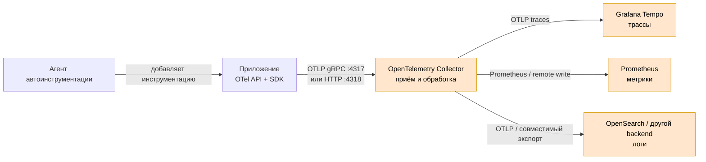

# OpenTelemetry — стандартизация телеметрии приложений

OpenTelemetry (сокращённо OTel) — открытый набор API, SDK, соглашений и протоколов для формирования и передачи трасс, метрик и логов. Это **не готовая система хранения и не интерфейс аналитики**: данные принимает отдельный OpenTelemetry Collector, а хранит выбранный бэкенд — например, Grafana Tempo, Prometheus или OpenSearch.

Документация: https://opentelemetry.io/docs/  
Спецификации: https://opentelemetry.io/docs/specs/  
OTLP: https://opentelemetry.io/docs/specs/otlp/

---

## Назначение системы

OpenTelemetry нужен, чтобы приложения платформы создавали телеметрию единообразно и не зависели от формата конкретного поставщика наблюдаемости. Код сервиса формирует спаны, метрики и коррелированные записи журналов через OTel API/SDK и передаёт их по OTLP в Collector.

Для платформы это общий контракт между микросервисами и средствами наблюдаемости. OTel помогает связать запрос через API, Kafka и Camunda одним Trace ID, но **не** исполняет бизнес-процессы, не хранит эталонные данные и не заменяет Prometheus, Tempo, OpenSearch или Zabbix.

---

## Перечень функций

1. **Создание распределённых трасс**: спаны, Trace ID, Span ID, родительские связи, события и атрибуты.
2. **Создание метрик**: счётчики, гистограммы и другие инструменты SDK с ресурсными атрибутами сервиса.
3. **Корреляция логов** с Trace ID и Span ID; сам OTel не является хранилищем журналов.
4. **Автоматическая инструментация** поддерживаемых языков и фреймворков без ручного изменения каждого вызова.
5. **Ручная инструментация** бизнес-значимых операций через стабильный API.
6. **Контекст между сервисами** через стандарт W3C Trace Context (`traceparent`, `tracestate`) и baggage.
7. **Экспорт телеметрии по OTLP** поверх gRPC или HTTP.
8. **Независимость приложения от бэкенда**: SDK отправляет данные в Collector, а маршрут в Tempo, Prometheus или иной приёмник меняется вне кода.
9. **Сэмплирование на стороне SDK** до отправки данных; итоговое сэмплирование по результату всего трейса обычно выполняет Collector.
10. **Семантические соглашения** для одинаковых имён атрибутов HTTP, БД, брокеров и Kubernetes.

Чего OpenTelemetry не делает: не хранит историю, не рисует дашборды, не маршрутизирует дежурных, не гарантирует доставку после завершения процесса без Collector и не делает попадание персональных данных безопасным.

---

## Основные элементы системы и зависимости

OpenTelemetry в приложении — это библиотеки и агент инструментации. Отдельно запущенные Collector и бэкенды являются соседними системами.

### Схема инстансов и потоков

Оранжевые блоки — **отдельно развёртываемые системы**, а не библиотеки OpenTelemetry внутри приложения.

### Описание компонентов

- **OTel API** — интерфейсы, которые вызывает прикладной код. Реализация зависит от языка. Разворачивается как библиотека приложения.
- **OTel SDK** — реализация API: создаёт, агрегирует, сэмплирует и экспортирует телеметрию. Разворачивается внутри процесса приложения.
- **Автоинструментация** — агент или набор библиотек, автоматически оборачивающий поддерживаемые фреймворки. Для Java это Java agent; для других языков механизм отличается. Это часть запуска приложения, не сервер.
- **OTLP exporter** — компонент SDK, отправляющий данные по OpenTelemetry Protocol. Работает в процессе приложения.
- **OpenTelemetry Collector** — отдельная программа на Go с конвейерами receiver → processor → exporter. Разворачивается отдельно и описана в карточке `Open Telemetry Controller`.
- **Tempo, Prometheus, OpenSearch** — внешние хранилища/системы обработки. Они не входят в OpenTelemetry и имеют собственные требования к отказоустойчивости.

### Как читать схему

1. Автоинструментация или ручной код создают телеметрию через API; SDK выполняет фактическую работу.
2. Приложение отправляет данные в ближайший Collector. Если Collector недоступен, SDK имеет ограниченную очередь; это не долговременный брокер.
3. Collector применяет общую политику и разветвляет сигналы по разным хранилищам.
4. Приложение не должно знать адреса и секреты всех бэкендов: этот контракт сосредоточен в Collector.

Термины:

- **Телеметрия** — технические данные о работе системы: трассы, метрики и логи.
- **Трейс** — дерево операций одного распределённого запроса.
- **Спан** — одна операция внутри трейса.
- **Контекст** — идентификаторы и служебные данные, передаваемые между вызовами.
- **Сэмплирование** — выбор части данных для сохранения.
- **OTLP** — стандартный протокол передачи данных OpenTelemetry.
- **Ресурс** — атрибуты источника: имя сервиса, версия, окружение, кластер.
- **Семантические соглашения** — стандартные имена и смысл атрибутов.

### Что входит в состав

| Элемент | Где работает | Назначение |
|---|---|---|
| API | В процессе приложения | Стабильный интерфейс для прикладного кода |
| SDK | В процессе приложения | Создание, агрегация и экспорт сигналов |
| Инструментация | В процессе приложения | Формирование телеметрии библиотек и фреймворков |
| OTLP exporter | В процессе приложения | Передача в Collector или совместимый endpoint |
| Semantic conventions | В коде и конфигурации | Единая модель атрибутов |

Collector и бэкенды в состав библиотек OpenTelemetry **не входят**.

### Порты (контракт сети)

| Порт | Назначение | Кому открывать |
|---|---|---|
| **4317/TCP** | OTLP/gRPC | Приложение → Collector |
| **4318/TCP** | OTLP/HTTP (`/v1/traces`, `/v1/metrics`, `/v1/logs`) | Приложение → Collector |

Порты относятся к принимающей стороне. SDK обычно сам ничего не слушает.

---

## Краткие вводные

### Отказоустойчивость и масштабирование

SDK живёт вместе с приложением и масштабируется с его репликами. При падении процесса несброшенная очередь может быть потеряна. Для боя приложения отправляют данные на доступный Service нескольких Collector. Долговременную доставку и хранение обеспечивает не OpenTelemetry API, а архитектура Collector и целевого бэкенда.

### Безопасность

- OTLP между приложением и Collector в бою защищать TLS или mTLS и сетевыми политиками.
- Не помещать тела запросов, токены, пароли, ИНН и иные персональные данные в атрибуты, baggage и события спанов.
- Baggage передаётся дальше по цепочке и может выйти за границу доверия.
- Адреса и токены бэкендов хранить у Collector; приложение должно знать только внутренний OTLP endpoint.

---

## Допущения

1. Используется vendor-neutral OpenTelemetry, а не проприетарный дистрибутив поставщика.
2. Боевые приложения работают в Kubernetes каждой площадки.
3. Основной протокол между приложениями и Collector — OTLP.
4. Collector разворачивается отдельно на каждой площадке; отправка через неизвестный межЦОДовый RTT не считается надёжной по умолчанию.
5. Трассы хранятся в Tempo, метрики — в Prometheus, логи — в принятом журналирующем бэкенде.
6. Политика допустимых атрибутов и сэмплирования ещё должна быть согласована с ИБ и владельцами систем.

---

## Источники

- Обзор OpenTelemetry: https://opentelemetry.io/docs/what-is-opentelemetry/
- Компоненты и сигналы: https://opentelemetry.io/docs/concepts/components/
- Трассировка: https://opentelemetry.io/docs/concepts/signals/traces/
- Метрики: https://opentelemetry.io/docs/concepts/signals/metrics/
- Логи: https://opentelemetry.io/docs/concepts/signals/logs/
- Контекст и propagation: https://opentelemetry.io/docs/concepts/context-propagation/
- OTLP и стандартные порты: https://opentelemetry.io/docs/specs/otlp/
- Конфигурация OTLP exporter: https://opentelemetry.io/docs/languages/sdk-configuration/otlp-exporter/
- Семантические соглашения: https://opentelemetry.io/docs/specs/semconv/
