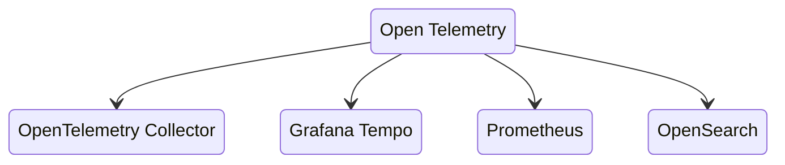
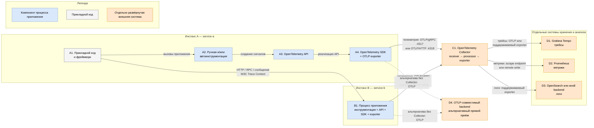

# OpenTelemetry — стандартизация телеметрии приложений

OpenTelemetry (сокращённо OTel) — открытый набор спецификаций, API, SDK, инструментации, соглашений и протоколов для формирования и передачи трасс, метрик и логов. Это **не готовая система хранения, не интерфейс аналитики и не единый обязательный deployment**. Данные может принимать отдельно запущенный OpenTelemetry Collector либо совместимый endpoint, а хранит их выбранный бэкенд — например, Grafana Tempo, Prometheus или OpenSearch.

Документация: https://opentelemetry.io/docs/  
Спецификации: https://opentelemetry.io/docs/specs/  
OTLP: https://opentelemetry.io/docs/specs/otlp/

---

## Назначение системы

OpenTelemetry нужен, чтобы приложения платформы создавали телеметрию единообразно и не зависели от формата конкретного поставщика наблюдаемости. Код сервиса формирует спаны, метрики и коррелированные записи журналов через OTel API/SDK и передаёт их по OTLP в Collector.

Для платформы это общий контракт между микросервисами и средствами наблюдаемости. OTel помогает связать запрос через API, Kafka и Camunda одним Trace ID, но **не** исполняет бизнес-процессы, не хранит эталонные данные и не заменяет Prometheus, Tempo, OpenSearch или Zabbix.

---

## Перечень функций

1. **Создание распределённых трасс**: спаны, Trace ID, Span ID, родительские связи, события и атрибуты.
2. **Создание метрик**: счётчики, гистограммы и другие инструменты SDK с ресурсными атрибутами сервиса.
3. **Корреляция логов** с Trace ID и Span ID; сам OTel не является хранилищем журналов.
4. **Автоматическая инструментация** поддерживаемых языков и фреймворков без ручного изменения каждого вызова.
5. **Ручная инструментация** бизнес-значимых операций через стабильный API.
6. **Контекст между сервисами** через стандарт W3C Trace Context (`traceparent`, `tracestate`) и baggage.
7. **Экспорт телеметрии по OTLP** поверх gRPC или HTTP.
8. **Независимость приложения от бэкенда**: SDK отправляет данные в Collector, а маршрут в Tempo, Prometheus или иной приёмник меняется вне кода.
9. **Сэмплирование на стороне SDK** до отправки данных; итоговое сэмплирование по результату всего трейса обычно выполняет Collector.
10. **Семантические соглашения** для одинаковых имён атрибутов HTTP, БД, брокеров и Kubernetes.

Чего OpenTelemetry не делает: не хранит историю, не рисует дашборды, не маршрутизирует дежурных, не гарантирует доставку после завершения процесса без Collector и не делает попадание персональных данных безопасным.

---

## Основные элементы системы и зависимости

OpenTelemetry не задаёт единственную обязательную топологию. Спецификации и семантические соглашения вообще не разворачиваются; API, SDK, инструментация и exporter обычно работают в процессе приложения; Collector — отдельная программа проекта OpenTelemetry, которую при необходимости разворачивают независимо; хранилища и средства анализа являются внешними системами.

Ниже показан **референсный поток платформы**, а не обязательный deployment OpenTelemetry: два инстанса приложений передают сигналы ближайшему Collector, который направляет их в профильные бэкенды. Пунктиром показан допустимый альтернативный путь в OTLP-совместимый бэкенд без Collector. Его применимость зависит от возможностей бэкенда и требований платформы.

### Схема инстансов и потоков

Цвет обозначает границу эксплуатации, а не владельца исходного кода: Collector относится к проекту OpenTelemetry, но оранжевый, поскольку это отдельный процесс; Tempo, Prometheus и OpenSearch не входят в OpenTelemetry.

### Описание блоков

#### A1. Прикладной код и фреймворк

- **Технологии и варианты:** любой поддерживаемый язык и его фреймворк; конкретная поддержка проверяется в документации языка и [реестре инструментации](https://opentelemetry.io/ecosystem/registry/).
- **Назначение:** исполняет бизнес-логику и создаёт места, к которым привязывается телеметрия.
- **Граница продукта:** входит в продукт, но не является компонентом OpenTelemetry.

#### A2. Ручная и/или автоинструментация

- **Технологии и варианты:** вызовы API из кода, библиотеки инструментации либо доступный для языка механизм zero-code/автоинструментации; механизмы Java, .NET, Python и JavaScript различаются.
- **Назначение:** замечает операции приложения, создаёт спаны, измерения и связь логов с контекстом. Автоинструментация покрывает известные библиотеки, а ручная добавляет бизнес-смысл.
- **Граница продукта:** работает в процессе приложения и поставляется с ним; отдельным сервером не является.

#### A3. OpenTelemetry API

- **Технологии и варианты:** языковые интерфейсы для трасс, метрик и логов; доступность и статус каждого сигнала проверяются для конкретной языковой реализации.
- **Назначение:** отделяет прикладной и библиотечный код от конкретной реализации SDK.
- **Граница продукта:** библиотека внутри продукта; не отдельная система.

#### A4. OpenTelemetry SDK и OTLP exporter

- **Технологии и варианты:** SDK конкретного языка; пакетная или простая обработка спанов, readers для метрик, head sampler; OTLP exporter через gRPC либо HTTP с Protobuf/JSON там, где вариант поддержан языковой реализацией.
- **Назначение:** реализует API, формирует resource, обрабатывает и сэмплирует сигналы, затем передаёт их в настроенный endpoint. Его очередь ограничена памятью процесса и не является долговременным хранилищем.
- **Граница продукта:** работает внутри инстанса приложения и входит в его поставку.

#### B1. Процесс приложения service-b

- **Технологии и варианты:** тот же логический состав, что A1–A4, но язык, фреймворк и способ инструментации могут отличаться.
- **Назначение:** показывает второй независимо работающий инстанс и продолжение распределённого трейса через межсервисный вызов.
- **Граница продукта:** прикладной процесс; библиотеки OTel входят в поставку этого сервиса, но не образуют отдельный OTel-сервер.

#### C1. OpenTelemetry Collector

- **Технологии и варианты:** отдельная программа OpenTelemetry Collector; доступны разные дистрибутивы и наборы компонентов. Типовой pipeline состоит из receiver, processor и exporter.
- **Назначение:** принимает телеметрию, при необходимости обрабатывает, группирует и направляет её в один или несколько бэкендов.
- **Граница продукта:** компонент проекта OpenTelemetry, но отдельная от приложений система. Он **не появляется автоматически** при подключении SDK и не обязателен самой спецификацией; для данной платформы на схеме показан референсный маршрут через Collector. Детали находятся в карточке `Open Telemetry Controller`.

#### D1. Grafana Tempo

- **Технологии и варианты:** Grafana Tempo; вместо него возможен другой бэкенд трасс, поддерживаемый выбранным exporter или OTLP.
- **Назначение:** хранит и предоставляет поиск трейсов.
- **Граница продукта:** отдельно развёрнутая внешняя система; не входит в OpenTelemetry.

#### D2. Prometheus

- **Технологии и варианты:** Prometheus может забирать метрики с endpoint, опубликованного Collector, либо получать их через совместимый remote write путь; конкретный вариант определяется интеграцией и версиями.
- **Назначение:** хранит временные ряды метрик и вычисляет правила.
- **Граница продукта:** отдельно развёрнутая внешняя система; не входит в OpenTelemetry.

#### D3. OpenSearch или иной журнальный бэкенд

- **Технологии и варианты:** OpenSearch либо другая система, для которой у Collector есть подходящий exporter или шлюз интеграции.
- **Назначение:** долговременно хранит, индексирует и ищет логи.
- **Граница продукта:** отдельно развёрнутая внешняя система; не входит в OpenTelemetry.

#### D4. OTLP-совместимый бэкенд

- **Технологии и варианты:** любой продукт, который документированно принимает нужные сигналы и выбранный вариант OTLP.
- **Назначение:** показывает, что SDK технически может отправлять данные напрямую, если endpoint совместим. Такой путь убирает обработку и маршрутизацию Collector и связывает конфигурацию приложения с бэкендом.
- **Граница продукта:** отдельно развёрнутая внешняя система; не входит в OpenTelemetry. Блок является альтернативой C1 и D1–D3, а не дополнительной обязательной ступенью.

### Как читать схему

1. **Сначала смотрите на границы.** Большие рамки `Инстанс A` и `Инстанс B` — два независимо работающих процесса. Синие блоки находятся внутри поставки приложения. Оранжевые блоки имеют собственный жизненный цикл и не являются библиотеками внутри приложения.
2. **Сплошные стрелки внутри Инстанса A** показывают не сетевой обмен, а логическую цепочку. Код и инструментация обращаются к API, а реальную обработку выполняет SDK.
3. **Стрелка A1 → B1** — бизнес-вызов между приложениями, например HTTP, RPC или сообщение. Вместе с ним переносится W3C Trace Context, поэтому спаны обоих сервисов могут попасть в один трейс. Это не отправка телеметрии.
4. **Стрелки A4/B1 → C1** — отдельный поток телеметрии. На принимающей стороне стандартно используются 4317/TCP для OTLP/gRPC или 4318/TCP для OTLP/HTTP; фактический endpoint задаётся конфигурацией SDK.
5. **Стрелки C1 → D1/D2/D3** показывают разветвление по сигналам. Название протокола у каждой стрелки важно: экспорт в бэкенд не обязан использовать тот же транспорт, которым Collector получил данные.
6. **Пунктир A4/B1 → D4** — альтернативный, а не параллельно обязательный маршрут. Он подчёркивает, что спецификация OpenTelemetry не требует единой схемы с Collector. Если используется прямой маршрут, SDK должен быть совместим с endpoint по сигналу, протоколу, аутентификации и модели данных.
7. **Схема не изображает хранилище внутри OTel SDK или Collector.** SDK буферизует ограниченный объём данных, Collector обрабатывает поток, а долговременное хранение выполняют D1–D4.
8. **Контекст и телеметрия движутся разными путями.** Контекст сопровождает рабочий запрос между сервисами; готовые сигналы асинхронно уходят в Collector или совместимый endpoint.
9. **Секреты и персональные данные не становятся безопасными из-за OTel.** Токены, тела запросов, идентификаторы клиентов и другие чувствительные значения нельзя без отдельной политики помещать в attributes, span events, logs или baggage.

### Что входит в состав

| Элемент | Где работает | Назначение |
|---|---|---|
| API | В процессе приложения | Стабильный интерфейс для прикладного кода |
| SDK | В процессе приложения | Создание, агрегация и экспорт сигналов |
| Инструментация | В процессе приложения | Формирование телеметрии библиотек и фреймворков |
| OTLP exporter | В процессе приложения | Передача в Collector или совместимый endpoint |
| Semantic conventions | В коде и конфигурации | Единая модель атрибутов |

Спецификация определяет ожидаемое поведение реализаций, но не является исполняемым компонентом. Collector входит в проект OpenTelemetry как самостоятельная программа, однако не входит в процесс приложения и не устанавливается вместе с SDK автоматически. Бэкенды хранения в OpenTelemetry не входят.

### Порты (контракт сети)

| Порт | Назначение | Кому открывать |
|---|---|---|
| **4317/TCP** | OTLP/gRPC | Приложение → Collector |
| **4318/TCP** | OTLP/HTTP (`/v1/traces`, `/v1/metrics`, `/v1/logs`) | Приложение → Collector |

Порты относятся к принимающей стороне. SDK обычно сам ничего не слушает.

---

## Глоссарий

- **API (Application Programming Interface)** — набор интерфейсов, через которые код создаёт и связывает телеметрию, не выбирая её конкретную реализацию.
- **Attributes** — пары «ключ — значение», описывающие resource, span, metric data point или log record.
- **Auto-instrumentation / zero-code instrumentation** — добавление инструментации поддерживаемых библиотек с минимальными изменениями исходного кода или без них; механизм зависит от языка.
- **Backend** — внешняя система приёма, хранения, поиска или анализа телеметрии.
- **Baggage** — прикладные пары «ключ — значение», передаваемые вместе с контекстом через границы сервисов; baggage не является безопасным хранилищем секретов.
- **Camunda** — внешняя платформа исполнения и управления бизнес-процессами; OpenTelemetry может наблюдать связанные с ней вызовы, но не заменяет её.
- **Collector** — отдельная vendor-neutral программа OpenTelemetry, принимающая, обрабатывающая и экспортирующая телеметрию.
- **Context** — служебное состояние текущей операции, включая идентификаторы активного span, которое переносится между вызовами.
- **Counter / счётчик** — инструмент метрик, отражающий накопление значения.
- **Data point** — отдельное значение метрики с моментом времени и набором attributes.
- **Deployment / развёртывание** — конкретный способ запуска и соединения процессов; OpenTelemetry допускает разные топологии и не задаёт одну обязательную.
- **Dashboard / дашборд** — визуальное представление показателей; его предоставляет система визуализации, а не OpenTelemetry.
- **Endpoint** — сетевой адрес принимающей стороны протокола.
- **Exporter** — компонент SDK или Collector, передающий сигнал следующей системе.
- **Framework / фреймворк** — программная основа приложения, для которой может существовать готовая библиотека инструментации.
- **Grafana Tempo** — внешний бэкенд хранения и поиска трейсов.
- **gRPC** — транспорт на основе HTTP/2 и Protocol Buffers; один из вариантов переноса OTLP.
- **Head sampling** — решение о записи трейса, принимаемое SDK при его начале.
- **Histogram / гистограмма** — инструмент метрик, распределяющий измерения по диапазонам.
- **HTTP** — прикладной сетевой протокол; в OTLP/HTTP данные передаются HTTP-запросами.
- **JSON (JavaScript Object Notation)** — текстовый формат сериализации; OTLP/HTTP допускает его, если реализация поддерживает `http/json`.
- **Instrumentation** — код, который наблюдает операции приложения и создаёт телеметрию.
- **Instance / инстанс** — отдельно запущенный экземпляр процесса приложения или системы.
- **Kafka** — внешняя распределённая платформа обмена событиями; контекст трассировки переносится через сообщения при поддержке инструментации.
- **Log / log record** — запись о событии; OpenTelemetry может формировать, коррелировать и передавать записи, но не является их хранилищем.
- **Metric** — числовое измерение поведения системы во времени.
- **OpenSearch** — внешняя система хранения, индексирования и поиска данных, в том числе логов.
- **OTel** — общепринятое сокращение OpenTelemetry.
- **OTLP (OpenTelemetry Protocol)** — протокол и модель передачи сигналов OpenTelemetry.
- **Pipeline** — настроенная последовательность приёма, обработки и экспорта одного типа сигнала в Collector.
- **Pod** — минимальная запускаемая единица Kubernetes, содержащая один или несколько контейнеров.
- **Prometheus** — внешняя система сбора, хранения и обработки метрик.
- **Processor** — этап pipeline Collector или SDK, изменяющий, фильтрующий, группирующий либо подготавливающий данные.
- **Protobuf (Protocol Buffers)** — формат сериализации, используемый OTLP/gRPC и OTLP/HTTP с `http/protobuf`.
- **Propagation** — перенос context и baggage через границы процессов и сервисов.
- **Reader** — компонент Metrics SDK, управляющий сбором и экспортом агрегированных метрик.
- **Receiver** — входной компонент Collector, принимающий данные по определённому протоколу.
- **Remote write** — протокол отправки метрик в совместимое с Prometheus удалённое хранилище или приёмник.
- **Resource** — описание сущности, создавшей телеметрию, например сервиса, процесса, pod или хоста.
- **RPC (Remote Procedure Call)** — вызов операции другого процесса через сеть.
- **Sampler / сэмплер** — компонент, принимающий решение, какие трейсы записывать.
- **Sampling / сэмплирование** — ограничение объёма записываемых трасс путём выбора их части.
- **SDK (Software Development Kit)** — языковая реализация OpenTelemetry API, обработки и экспорта сигналов.
- **Semantic conventions / семантические соглашения** — стандартные имена и смысл атрибутов, ресурсов и операций.
- **Signal / сигнал** — тип телеметрии; в этой карточке рассматриваются трейсы, метрики и логи.
- **Span** — одна именованная операция в составе трейса с временем, статусом, атрибутами и событиями.
- **Span event** — отмеченное временем событие внутри span.
- **Tail sampling** — решение о сохранении трейса после получения его спанов; обычно выполняется в Collector или бэкенде.
- **Telemetry / телеметрия** — технические данные о работе системы: трейсы, метрики и логи.
- **Temporality** — способ представления изменений метрики между последовательными экспортами, например cumulative или delta.
- **Trace** — причинно связанный набор спанов одного распределённого выполнения.
- **Trace Context** — стандарт W3C для передачи идентификаторов трассировки и параметров обработки.
- **Trace ID** — идентификатор трейса, общий для всех его спанов.
- **Span ID** — идентификатор конкретного span внутри трейса.
- **Scrape endpoint** — HTTP endpoint, с которого Prometheus периодически забирает опубликованные метрики.
- **TCP (Transmission Control Protocol)** — транспортный сетевой протокол, на котором доступны указанные в карточке порты.
- **`traceparent`** — основной HTTP-заголовок W3C Trace Context с Trace ID, Span ID и флагами.
- **`tracestate`** — дополнительный HTTP-заголовок W3C Trace Context с vendor-specific состоянием.
- **Vendor-neutral** — не привязанный к одному поставщику продукта или бэкенда.
- **W3C** — организация, публикующая веб-стандарты, включая Trace Context.
- **Zabbix** — внешняя система инфраструктурного мониторинга; OpenTelemetry её не заменяет.

---

## Источники

- Обзор OpenTelemetry: https://opentelemetry.io/docs/what-is-opentelemetry/
- Компоненты и сигналы: https://opentelemetry.io/docs/concepts/components/
- Спецификации API, SDK и данных: https://opentelemetry.io/docs/specs/
- Трассировка: https://opentelemetry.io/docs/concepts/signals/traces/
- Метрики: https://opentelemetry.io/docs/concepts/signals/metrics/
- Логи: https://opentelemetry.io/docs/concepts/signals/logs/
- Контекст и propagation: https://opentelemetry.io/docs/concepts/context-propagation/
- OTLP и стандартные порты: https://opentelemetry.io/docs/specs/otlp/
- Конфигурация OTLP exporter: https://opentelemetry.io/docs/languages/sdk-configuration/otlp-exporter/
- Семантические соглашения: https://opentelemetry.io/docs/specs/semconv/
- Реестр инструментации и интеграций: https://opentelemetry.io/ecosystem/registry/
