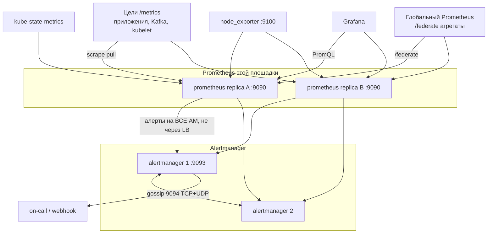

# Prometheus 3.13.2 LTS — развёртывание и настройка

Prometheus — система метрик: сам ходит по HTTP на `/metrics`, забирает числа, хранит ряды во времени, считает правила и отдаёт PromQL. Этот документ про **свою установку** версии **3.13.2** (LTS, релиз 29 июля 2026; на дату подготовки — текущая LTS-линия на https://prometheus.io/download/). Позже вышел **3.14.0** (17 августа 2026) — это latest, не LTS. В бой этого документа берём **3.13.2**, чтобы совпасть с тем, что кладёт актуальный Kubernetes-стек, а не «поставили latest вчера вечером».

Документация: https://prometheus.io/docs/  
Образы: `quay.io/prometheus/prometheus:v3.13.2` (в Helm-чарте — `v3.13.2-distroless`).  
На Kubernetes официально поддерживаемый путь сообщества: **kube-prometheus-stack 88.3.0** (11 августа 2026) — Prometheus Operator **v0.93.0**, Prometheus **v3.13.2-distroless**, Alertmanager **v0.33.1**, node-exporter **v1.12.1-distroless**. Требование чарта: Kubernetes **≥ 1.25**.  
Отдельно latest Alertmanager — **0.34.0** (16 августа 2026). С чартом 88.3.0 его **не** подмешивать «на глаз».

Это не Grafana Cloud / AMP: там другие диски и обещания, их сюда копировать нельзя.

Этот текст — не набор команд «скопируй prometheus.yml», а правила, без которых система не будет одновременно устойчивой к сбоям, масштабируемой и безопасной. Пошаговая установка — в `Prometheus.install.md`.

---

## Назначение системы

Prometheus нужен, чтобы **видеть числа во времени**: жив ли сервис (`up`), какая задержка, сколько ошибок, не забит ли диск. Без метрик вы не отличите «Kafka тормозит» от «Camunda ждёт внешний API 40 секунд» от «узел забился диском».

Система **снимает** (pull) уже крутящиеся цели. Она **не** шина событий, **не** озеро эталона, **не** замена логов (Loki) и трейсов (Tempo), **не** SIEM и **не** ходит в госслужбы. Проект сам формулирует нишу: числовые ряды, **надёжность важнее биллинговой точности**. Во время аварии этот ящик ещё должен открываться. 100% точность для биллинга — официально **не** тот инструмент.

---

## Перечень функций

Что умеет self-hosted Prometheus OSS 3.13.2 и соседние бинари экосистемы:

1. **Снимать метрики по HTTP** с `/metrics` целей (scrape). Дефолт интервала в спецификации конфига — **1m**; в примере first steps — 15s. Таймаут дефолт **10s**, не может быть больше interval.
2. **Хранить ряды в локальной TSDB** на диске. **Не кластер**: один процесс — один каталог. Официально на диске в среднем **1–2 байта** на сэмпл. Если не задать retention — **15d**. В kube-prometheus-stack 88.3.0 дефолт чарта — **10d**.
3. **Находить цели сам** (service discovery: Kubernetes, DNS, файлы) и **переписывать labels до записи** (relabeling) — главный фильтр «не снимать мусор».
4. **Считать PromQL** (Grafana и алерты говорят на нём). Recording rule заранее считает тяжёлый запрос; alerting rule при выполнении условия шлёт в Alertmanager. Практики проекта: без `for:` один неудачный scrape может дёрнуть тревогу.
5. **Работать двумя (и больше) одинаковыми серверами** на одних целях — это отказоустойчивость съёма, не шардирование. Базы у них **разные**. Отличают реплики `external_labels`.
6. **Отдавать выбранные ряды другому Prometheus** через `/federate` — официальный способ вырасти на много площадок.
7. **Писать сэмплы ещё куда-то** (remote write 1.0 стабилен; 2.0 в доке — experimental). Remote read официально **не** стабильный API.
8. **Отдавать HTTP** на порту **9090** (UI, API, свой `/metrics`). Дефолт `--web.listen-address=0.0.0.0:9090`.
9. **Маршрутизировать алерты** отдельным бинарём Alertmanager (порт **9093**, gossip **9094** TCP+UDP): группировка, silence, дедуп. Кворума нет: fail-open — лучше два письма, чем ноль.
10. **Снимать машины и объекты Kubernetes** рядом стоящими node_exporter (**9100**) и kube-state-metrics. На Kubernetes конфиг собирает Prometheus Operator по CRD (`ServiceMonitor`, `PrometheusRule`). Оператор **не** использует аннотацию `prometheus.io/scrape` как основной способ.

Чего система **не** делает и часто путают: нет кластера TSDB «как у Kafka»; два пода Prometheus ≠ одна база. Нет автовыбора лидера диска. Service перед двумя репликами даёт доступность, **не** дедуп графиков (без Thanos Query графики могут «прыгать»). Не класть логи в Prometheus. Pushgateway — только короткие batch-джобы, не замена pull. Чарта 88.3.0 по умолчанию: **`replicas: 1`** — это стенд, не бой.

---

## Требования к развёртыванию

### Требования к ПО

| Что | Что ставить | Комментарий |
|---|---|---|
| **Формат поставки** | Контейнеры Docker **или** поды Kubernetes | Образ `quay.io/prometheus/prometheus:v3.13.2`. Для Kubernetes — **kube-prometheus-stack 88.3.0**. На VM те же правила HA, меняется только оркестрация диска. |
| **Kubernetes** | Свой кластер ≥ **1.25**, если идёте чартом | CSI под PVC Prometheus/Alertmanager. Образы из **вашего** registry, теги как в чарте, не `latest`. Не подмешивать 3.14.0 в чарт 88.3.0 без проверки Operator. |
| **ОС** | Linux x86_64 / ARM64 в бою типичен | Бинарь Go. Windows-сборка сервера есть; **node_exporter — про Unix**. Боевой Prometheus на Windows-хосте в схеме с Kubernetes не предполагается. |
| **Диск TSDB** | Локальная POSIX-ФС, block CSI / local SSD | Официальный CAUTION: **NFS (включая AWS EFS) не поддерживается**. Не-POSIX — риск нечинящейся порчи. У каждой реплики **свой** диск: общий PVC на двоих некорректен. |
| **Сеть pull** | Prometheus должен достучаться HTTP(S) до каждой цели | В трёх изолированных кластерах «один центральный Prometheus» без сети до подов — фантазия. |
| **Alertmanager** | Тот же контур, версия как в чарте (**v0.33.1**) | Без приёмника (почта/webhook/on-call) HA Alertmanager бессмысленна. |
| **PKI** | Корпоративный для боя | TLS на 9090; mTLS на 9094, если gossip идёт по недоверенной сети. Basic Auth без TLS = пароль в открытую (так пишет security model). |
| **Часы** | NTP | Иначе окна правил и scrape «плывут». |

Java на сам Prometheus **не нужна**. Java понадобится рядом для JMX exporter у Kafka.

### Требования к ресурсам

Цифр «N ГиБ PVC под терабайты озера» у проекта **нет** — нагрузки не было, и озеро клиентских данных ≠ TSDB. Ниже то, что есть в документации и в исходном тексте.

| Что | Цифра из документации | Комментарий |
|---|---|---|
| **Формула диска** | `retention_seconds × ingested_samples_per_second × (1…2 байта)` | Когда появятся сэмплы/с — подставляете. Выдумать PVC «под терабайты» нельзя |
| **Retention, если не задать** | **15 дней** | Чарта 88.3.0: **10d**. Год истории = диск и, если в labels персональные данные, юридический объект |
| **Запас диска под compaction** | **не больше 80–85%** тома | Остальное на двойное место во время слияния блоков |
| **WAL** | сегменты по **128 МБ**, минимум три файла | После краша процесс проигрывает WAL. Без снимка риск потерять последние **~2–3 часа** |
| **Active series на один инстанс** | FAQ: **десятки миллионов** | Потолок порядка, не ваш замер. Ваш потолок — RAM, CPU PromQL, compaction |
| **Alertmanager в одном дата-центре** | типично **2–3** реплики | **4–5** в multi-DC / особо критичном. Чёт/нечет **не** важен (это не Raft) |
| **Чарта из коробки** | Prometheus `replicas: 1`, retention **10d** | Стенд. В бой переопределить |

Дополнительно:

- Кардинальность labels (`user_id`, UUID, ИНН) раздует ряды быстрее, чем «много гигабайт в MinIO».
- На учебной песочнице emptyDir допустим. В бой так нельзя.
- Thanos/Mimir не обязательны, чтобы считать Prometheus поставленным. Они нужны для **одной** дедуплицированной истории.

---

## Основные элементы системы и зависимости

Это несколько **отдельных программ**. Ниже — те, что живут отдельными инстансами, и как они вызывают друг друга.

### Схема инстансов и потоков

Как читать схему:

1. Prometheus **сам ходит** на цели (pull). Цель не пушит в него постоянно. Если канал до цели плохой относительно `scrape_timeout` (дефолт 10s) — цель будет `DOWN`, хотя сервис жив.
2. Две реплики снимают **одни и те же** цели независимо. У каждой свой диск. Съём не синхронен до миллисекунды — ответы PromQL могут чуть расходиться.
3. Алерты уходят **на все** инстансы Alertmanager, **не** через балансировщик. LB между ними — официальный anti-pattern.
4. Alertmanager сплетничает по **9094**. При split-brain намеренно возможны **дубли** писем (fail-open).
5. Grafana спрашивает PromQL. Права на дашборд **не** равны правам на произвольный запрос в Explore.
6. На много площадок официальный путь — **federation**: локальный Prometheus держит детали, глобальный снимает агрегаты через `/federate`.

Рядом, но это уже другое ПО: Grafana, Thanos/Mimir, Prometheus Adapter для HPA (чарт **явно не ставит** Adapter), Pushgateway. Их отказ проектируется отдельно.

### Что входит в состав

| Роль | Зачем | Как масштабируется |
|---|---|---|
| **Prometheus server** | Съём, TSDB, правила, PromQL | Вертикально: CPU/RAM/диск. Горизонтально: ещё инстансы (HA-реплики и/или шарды). Встроенного кластера TSDB **нет** |
| **Alertmanager** | Маршрутизация алертов | HA-кластер gossip. Кворума нет |
| **Node exporter** | Метрики ОС | По числу машин (DaemonSet) |
| **kube-state-metrics** | Состояние объектов K8s | Несколько реплик (stateless), если API-сервер жив |
| **Exporters** (JMX, Blackbox, …) | То, что само не умеет `/metrics` | По числу снимаемых инстансов |
| **Prometheus Operator** | Собирает конфиг из CRD | В чарте — **один** под. Падение не останавливает уже запущенный Prometheus, останавливает применение новых ServiceMonitor/Rule |

### Порты (контракт сети)

| Порт | Назначение | Кому открывать |
|---|---|---|
| **9090/TCP** | UI, HTTP API, `/metrics` Prometheus | Grafana / внутренняя сеть. **Не** в интернет |
| **9091/TCP** | Pushgateway | Только эфемерные job. 9092 специально **не** занят проектом (коллизия с Kafka) |
| **9093/TCP** | Alertmanager UI/API | On-call контур, не мир |
| **9094 TCP+UDP** | Gossip Alertmanager. При TLS-транспорте — только TCP | Только между членами AM |
| **9100/TCP** | node_exporter | Только Prometheus |
| порт сервиса + `/metrics` | Съём приложения | Только Prometheus |

Дефолт listen 9090 на `0.0.0.0` — контракт, не приглашение в интернет.

### Зависимости окружения

- Проект специально: сервер автономен, без зависимости от distributed storage — чтобы во время аварии мониторинг ещё отвечал.
- RBAC Operator минимальный, но честный: он создаёт StatefulSet и секреты в namespace.
- Идентификация: `--web.config.file` с TLS + bcrypt или mTLS. Люди в бой ходят в Grafana с SSO, не все в Explore Prometheus.
- Метрики **не** считаются секретом. Если в label попал ИНН — это уже ваша утечка.

---

## Краткие вводные

### Как устроена отказоустойчивость

Это **не один кластер**, а несколько независимых приёмов.

**1) Prometheus server (TSDB)**

Официальный FAQ: *run identical Prometheus servers on two or more separate machines*. Operator: те же цели и правила, **разный** external label.

| Что падает | Что происходит |
|---|---|
| Один из двух HA-реплик | Второй продолжает снимать и алертить. Дырка в **его** локальном TSDB. История второго цела |
| Оба в одном дата-центре, площадка мертва | Нет метрик **этого** контура, если не было реплики в другом месте и не было federation/remote write |
| Диск / порча TSDB | Процесс может не стартовать. Бэкап **снимком**; NFS «чтобы PVC жил» — путь к порче, не к HA |
| Operator под | Уже запущенные Prometheus/Alertmanager живут. Новые ServiceMonitor не применятся |

HA **съёма и алертов** = ≥2 Prometheus + Alertmanager-кластер. HA **истории графиков** = смириться с локальным диском каждой реплики либо remote write (другое ПО).

**2) Alertmanager**

Настоящий кластер: gossip, репликация силенсов. Кворума нет: жив один — уведомления идут. Advertise-address — **IP:port**, не hostname. По умолчанию gossip **без шифрования**; для WAN док требует **mTLS**.

Алерты сами **не** пишутся на диск Alertmanager: их регулярно пересылает Prometheus.

Падение сети между членами: **дубли уведомлений** — задокументированная цель дизайна, не баг.

**3) Exporters / цели**

Падение цели = ряд `up=0` (если Prometheus жив). Падение node_exporter = слепая эта нода, не весь кластер. kube-state-metrics без HA API-сервера бесполезен.

### Как устроено масштабирование

Четыре независимые оси:

1. **Меньше рядов / реже scrape** — главный рычаг. Урезать series эффективнее, чем удлинить interval (сэмплы в ряде хорошо жмутся).
2. **Больше железа одному Prometheus** — FAQ: tens of millions active series как порядок.
3. **Функциональные шарды** — шарда X снимает сервисы A/B/C, шарда Y — D/E/F. Предпочтительнее «автошарда по адресу».
4. **Иерархическая federation** — официально для *tens of data centers*: детальный Prometheus в площадке, глобальный снимает **агрегаты**.

`sample_limit` / `label_limit` / `target_limit` на опасных job: лучше отвалить цель, чем положить весь TSDB.

Шардирование: сначала **функциональное** (отдельный Prometheus на Kafka-платформу), не автоматический shard по hash. Operator честно пишет: автошард усложняет запросы.

### Безопасность самого Prometheus

Модель безопасности проекта жёсткая и честная:

- Считается, что **недоверенный** пользователь **уже** может открыть HTTP Prometheus → он видит **все** ряды.
- Эндпоинты **не** торчат в интернет: UI, API, `/metrics` целей, `/pprof`. Иначе DoS «дорогим запросом» — ожидаемое поведение.
- `--web.enable-admin-api` (удаление рядов) и `--web.enable-lifecycle` (`/-/reload`, `/-/quit`) по умолчанию **выключены**. CSRF на admin-ручке нет специально (чтобы curl работал). Обратный прокси должен **резать** `/api/*/admin/` и `/-/quit`.
- `honor_labels: true` и открытый Pushgateway = любой, кто дотянулся, может **нарисовать любой ряд**.
- Blackbox/SNMP-exporter с целью из URL: кто дошёл до exporter, может заставить его сходить «куда угодно».
- Grafana в proxy mode: кто открыл Explore, тот гоняет произвольные PromQL.

Компрометация Prometheus = карта инфраструктуры, RPS интеграций, имена сервисов, иногда идентификаторы в кривых labels. Это не «просто графики». Штатный TLS — Go `crypto/tls`, минимум TLS 1.2, не СКЗИ КИИ.

---

## Допущения

Ниже то, чего не было в исходном запросе, но без чего нельзя нарисовать конкретную схему. Если допущение неверно — схему надо пересмотреть.

1. Берём **self-hosted Prometheus 3.13.2 LTS**, не Grafana Cloud / AMP.
2. Бой в Kubernetes, инсталлятор — **kube-prometheus-stack 88.3.0** (Operator 0.93.0). Не подмешиваем 3.14.0 в этот чарт без проверки.
3. Три дата-центра = три зоны отказа. Пока RTT неизвестен, честный бой: **локальный съём** (Prometheus видит цели своей площадки с запасом до `scrape_timeout`).
4. Цель отказа: пережить **1** дата-центр для алертов и текущего съёма, не 2 из 3 и не «вечная история без remote write».
5. Нагрузка неизвестна — нет цифры «N Gi PVC и M millicores».
6. «Система 24/7» ≠ «ни один scrape не пропущен». SLA на полноту рядов — отдельно с бизнесом.
7. On-call будет. Правила без маршрута в Alertmanager — декорация.
8. Корпоративный PKI есть или будет. Self-signed — для теста.
9. Приложения сами отдают `/metrics` (или рядом exporter). «Поставили чарт — увидели Camunda и Kafka» **не** случится без ServiceMonitor.
10. Grafana — сосед, не этот документ. Дефолтный admin чарта в бой не переносится.
11. Thanos/Mimir не обязательны в день один.
12. Лицензия Apache 2.0. License-server нет. Сборка бинарей у проекта идёт на чужой CI: кого это смущает — собираете сами.
13. Учебный стенд изолирован. На нём допустимы `replicas: 1`, emptyDir, без TLS. В бой не копируем.

---

## Критически важные условия, которых нет в исходном контексте

Их нужно закрыть **до** «helm install и забыли».

| Пробел | Почему это ломает решение |
|---|---|
| **RTT и потери между дата-центрами** | `scrape_timeout` по умолчанию 10s. Gossip Alertmanager пробивает пиров раз в 1s. Порога в мс у проекта нет. Stretch «один Prometheus на три ЦОДа» без замера — лотерея `UP`/`DOWN` |
| **Один Kubernetes или три** | Один Prometheus CR или три + federation. Pull не работает сквозь глухой firewall |
| **Где живут цели** (Kafka/Camunda в какой площадке) | Съём лучше **рядом** с целью. Иначе авария канала = «всё красное», хотя сервисы живы |
| **Кардинальность** (`client_id`, ИНН, `trace_id` в метриках) | Один «удобный» label важнее терабайт озера: съест RAM head |
| **Срок хранения и 152-ФЗ** | Дефолт 15d (чарт 10d). Год истории = диск и юридический объект, если в labels ПДн |
| **Куда торчит 9090/9093** | Публичный UI = карта инфраструктуры |
| **Кто принимает алерты** | Без приёмника HA Alertmanager бессмысленна |
| **StorageClass: local vs NFS** | NFS официально не поддерживается |
| **Нужен ли HPA по кастомным метрикам** | Adapter чарт не ставит |
| **Закрытый контур / свои registry** | Образы quay.io должны быть зеркалом |
| **Стык с Wazuh/Falco/HAProxy** | Три источника «диск полный». Нужна матрица: кто алертит, кто логирует |

---

## Краткое описание ключевых этапов и элементов развертывания

Общий каркас (и тест, и бой):

1. Зафиксировать **Prometheus 3.13.2** + способ: бинарь/compose **или** kube-prometheus-stack **88.3.0**. Не смешивать 2.x и 3.x «на глаз».
2. Сначала **диск и сеть съёма**, потом правила алертов, потом красота Grafana.
3. Включить метрики самого Prometheus: `up`, `prometheus_tsdb_head_series`, `prometheus_target_interval_length_seconds`, `prometheus_rule_evaluation_failures_total`, `alertmanager_cluster_members`.
4. Поставить **хотя бы одну** цель, которая не «сам себя»: node_exporter или `/metrics` вашего API. Проверка: `up{job="..."} == 1`.
5. Подключить Alertmanager и **одно** тестовое правило с `for:` (практики проекта: ориентир **не меньше 5 минут**, если нет особой причины). Убедиться, что уведомление дошло.
6. Только потом — ServiceMonitor на Kafka/Camunda/интеграции и борьба с кардинальностью.

Боевая схема на несколько дата-центров — в `Prometheus.install.md`. Ниже — только учебный стенд.

---

### 1 инстанс: тестовый стенд, 1 площадка, без нагрузки

**Цель стенда:** увидеть scrape, PromQL, шум дефолтных kube-правил, понять UI. **Не** цель: доказать падение дата-центра и кардинальность интеграционного API.

**Путь A — бинарь / Docker** (быстрее понять продукт):

- Образ `quay.io/prometheus/prometheus:v3.13.2`, порт 9090 на localhost.
- Пример first steps: процесс снимает сам себя с `/metrics`.
- Рядом при желании Alertmanager 0.33.1 на :9093 — чтобы увидеть цепочку алерта, не только график.

**Путь B — Kubernetes, чарт как есть** (ближе к бою):

- `kube-prometheus-stack` **88.3.0**, namespace вроде `monitoring`.
- Оставить **`replicas: 1`** у Prometheus и Alertmanager.
- emptyDir на тесте допустим (история переживёт только жизнь пода).
- Не открывать LoadBalancer 9090 в интернет.

Режим «replicas: 2 + Thanos + federation на Minikube» для знакомства **не нужен**: создаст ложное чувство HA и сгорит по RAM.

#### Что сознательно упрощаем

| Параметр | На тесте | Почему можно |
|---|---|---|
| Реплики Prometheus / AM | 1 | Нет требования пережить выкат |
| TLS / basic auth | можно без | Иначе PKI раньше PromQL |
| Retention | дефолт чарта 10d или меньше | Нет боевой истории |
| PVC | маленький / emptyDir | Не цель — ёмкость |
| Federation / remote write | выкл | Нечего агрегировать |
| Pushgateway | выкл | Без batch-job только лишняя дыра |

#### Чего на тесте **не** стоит упрощать

- Версия **3.13.2** (не «чарт 88.3.0 + latest»).
- Хотя бы один `up==1` не про сам Prometheus.
- Понимание: дефолт чарта **не HA**. Успешный график CPU ноды **не** доказывает две реплики и gossip 9094.
- Не включать `honor_labels` «чтобы заработало» на всём подряд.
- Не класть в labels идентификаторы клиентов «для удобства отладки».

#### Сильные стороны такой схемы

- Поднимается за часы. Совпадает с first steps / values чарта.
- Дешево показывает, какие ряды уже орёт Kubernetes mixin.

#### Слабые стороны (обязательно понимать)

- Нет модели отказа площадки, нет второго TSDB, нет доказанной кардинальности Kafka/Java.
- Service перед единственным подом — не HA.
- Привычка `helm install` с `replicas: 1` уезжает в бой вместе с values.

Практическая рекомендация: препрод = маленький **боевой профиль** (2 Prometheus, ≥2 Alertmanager, свои PVC block-storage, TLS, один ServiceMonitor на настоящее приложение), даже без боевого трафика. Всё это **в одном** дата-центре.

---

## Сводка: что считать «экземпляр готов»

| Требование | Тест (1 площадка) | Бой |
|---|---|---|
| Отказоустойчивость | Не требуется | ≥2 Prometheus с разными external_labels и своими PVC; AM-кластер ≥2, **без LB** на пути алертов; бэкап снимком TSDB. Схема на 2–3 дата-центра — в `Prometheus.install.md` |
| Производительность / масштаб | Не требуется | Лимиты кардинальности; формула диска от **сэмплов**, не от озера; functional shards / federation при росте; recording rules; локальный съём при неизвестном RTT |
| Безопасность | UI не с мира | 9090/9093 закрыты; TLS(+auth); pin 3.13.2; без Pushgateway «для всех сервисов»; labels без ПДн; admin API выкл |

**Не готов к бою**, если: `replicas: 1` как единственный съём на все площадки; общий NFS-PVC; LB перед Alertmanager; `latest`; 9090 из LoadBalancer в интернет; `honor_labels` на всём; `trace_id` в labels; ждут, что Prometheus заменит логи и Kafka; ждут 100% данных для биллинга; RTT не мерили, а scrape тянется через три площадки; чарт 88.3.0 «как есть» с дефолтным одним подом.

---

## Источники (чтобы не принимать на веру)

- Download, LTS 3.13.2 / latest 3.14.0: https://prometheus.io/download/
- Overview (pull, автономность, не для биллинга): https://prometheus.io/docs/introduction/overview/
- FAQ (HA = идентичные серверы, tens of millions series, не логи): https://prometheus.io/docs/introduction/faq/
- Storage: не кластер, не NFS, 15d, 1–2 байта/сэмпл, WAL, compaction 80–85%: https://prometheus.io/docs/prometheus/latest/storage/
- Конфиг: scrape_interval 1m, scrape_timeout 10s: https://prometheus.io/docs/prometheus/latest/configuration/configuration/
- Federation: https://prometheus.io/docs/prometheus/latest/federation/
- Security model: https://prometheus.io/docs/operating/security/
- Alertmanager HA (fail-open, не LB, 9093/9094, 2–3 / 4–5): https://prometheus.io/docs/alerting/latest/high_availability/
- Operator HA: https://prometheus-operator.dev/docs/platform/high-availability/
- kube-prometheus-stack 88.3.0: https://github.com/prometheus-community/helm-charts/tree/kube-prometheus-stack-88.3.0/charts/kube-prometheus-stack

Утверждения вида «Prometheus переживёт два дата-центра» или «N Gi на брокер Kafka» в документации проекта **отсутствуют**. Порога RTT в миллисекундах нет: его надо измерить у себя.
