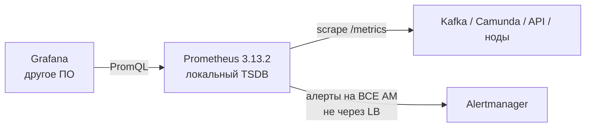
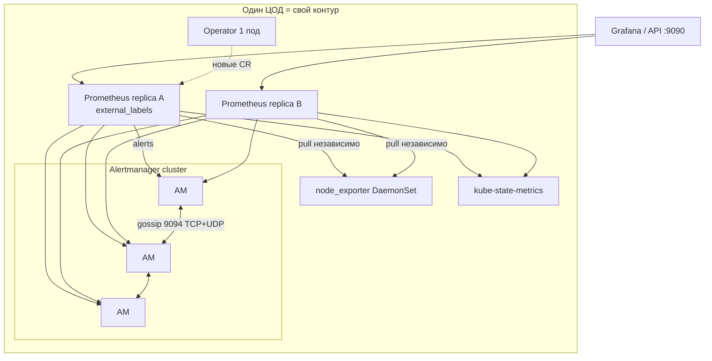
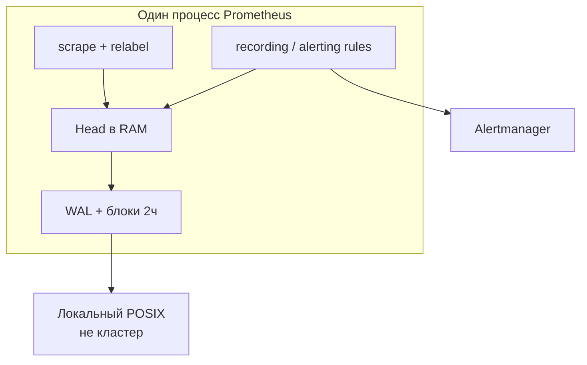
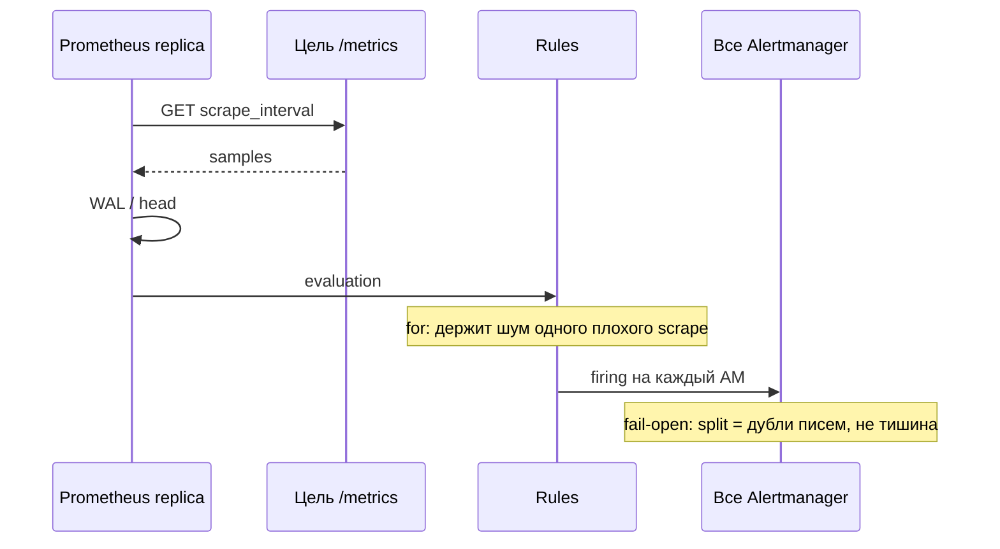
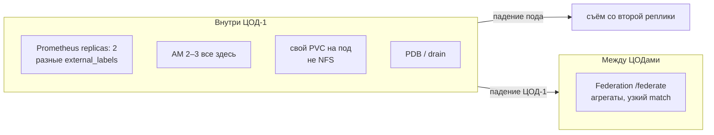
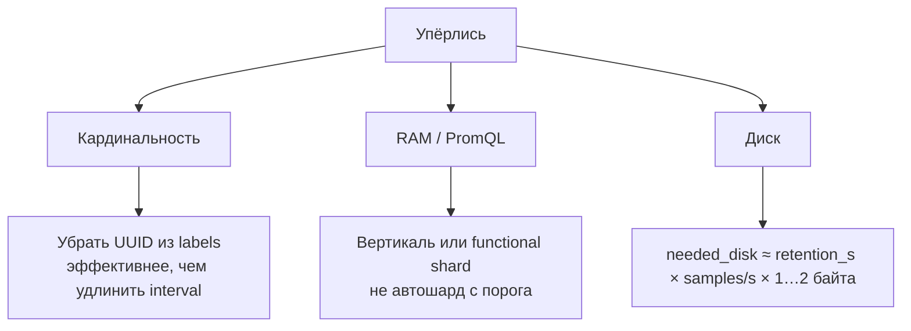
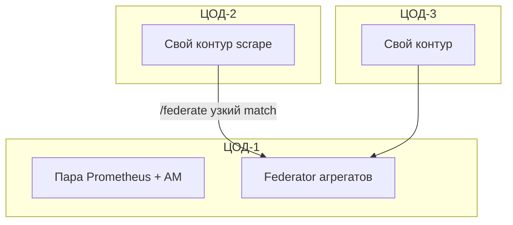

# Prometheus 3.13.2 LTS — схемы устройства

Связанные документы: правила — `Prometheus.md`; установка — `Prometheus.install.md`.

C4 / «D4»: контекст → контейнеры → компоненты. Код экспортёров не рисуем.

Допущения: stretch scrape и gossip Alertmanager на 2–3 ЦОДа **нет**; **не** кластерный TSDB; kube-prometheus-stack **88.3.0** (Operator 0.93.0, Alertmanager 0.33.1); не подмешивать latest 3.14.0; нагрузка не замерена.

---

## 1. Контекст

Prometheus — **pull-метрики и правила**. Не логи, не шина, не биллинг с точностью до копейки.

Проект: надёжность важнее биллинговой точности. `user_id` / UUID / ИНН в label — классический способ **убить** инстанс кардинальностью.

---

## 2. Контейнеры (экосистема, не один TSDB)

Две HA-реплики Prometheus — **два независимых диска**, одинаковый scrape. Это не шарды одной базы.

Порты: **9090** Prometheus, **9093** AM UI, **9094** gossip, **9100** node_exporter. Диск TSDB — block CSI, **не NFS** (официальный CAUTION). У каждой реплики **свой** PVC.

**Сильное:** падение одной реплики — вторая продолжает снимать. **Слабое:** PromQL на A и B чуть расходятся; без Thanos графики «прыгают». Thanos — отдельный проект, не обязателен «чтобы считать Prometheus поставленным».

---

## 3. Компоненты внутри сервера

| Компонент | Для чего настраивать |
|---|---|
| Labels / relabel | Главный фильтр мусора **до** записи |
| `scrape_timeout` | Дефолт **10s**. Чужой ЦОД съест окно → ложный `DOWN` |
| Retention | Без флагов **15d**; чарт 88.3.0 — **10d**. `retention.size` ≤ 80–85% PVC |
| `sample_limit` / `label_limit` | Лучше отвалить цель, чем положить head |

Operator падение: уже запущенный scrape жив; новые ServiceMonitor/Rule не применятся.

---

## 4. Поток: scrape и алерт

LB **между** Prometheus и Alertmanager — официальный anti-pattern.

---

## 5. Что настраивать: отказоустойчивость

| Ручка | Если забыть |
|---|---|
| `replicas: 2` (дефолт чарта **1**) | Выкат = дырка съёма |
| Алерты на все AM, не Ingress | SPOF и ломает дедуп |
| `replicaExternalLabelNameClear: false` | Чарт запрещает чистить для HA |
| Снимок TSDB | `cp` живого каталога + NFS = порча |

Падение двух ЦОДов при мозге в одном — нет детальных рядов этой площадки. AM gossip **не** растягивать: probe 1s, порога RTT нет.

---

## 6. Что настраивать: масштабируемость

FAQ: один инстанс тянет *tens of millions* active series — потолок **порядка**, не ваш замер. Озеро клиентов и TSDB — разные объёмы.

---

## 7. Прод: 2 или 3 ЦОДа без stretch

Один Prometheus, который scrape'ит три Kubernetes, при плохом RTT рисует `DOWN` живых целей. Третий ЦОД **не** входит в gossip AM ЦОД-1.

**Сильное:** съём локальный — авария канала ≠ ложный DOWN всего. **Слабое:** два слоя правил; широкий `match[]` = второй полный TSDB; federator — SPOF картины (его тоже HA внутри его ЦОДа).

---

## 8. Безопасность (ручки на той же схеме)

Кто открыл HTTP 9090 — видит **все** ряды (модель проекта). 9090/9093 не в интернет. TLS + bcrypt или mTLS; basic без TLS модель запрещает смыслом. Admin/lifecycle API дефолт выкл. `honor_labels` + открытый Pushgateway = подмена рядов. Метрики не секрет: ПДн в label — ваша утечка.

Источники: `Prometheus.md`. Порога RTT у проекта **нет**.
