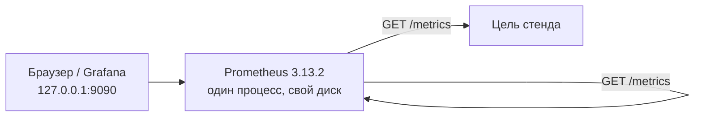

# Prometheus 3.13.2 LTS — установка (учебный контур)

Prometheus — система метрик: сам ходит по HTTP на **`/metrics`** цели (**scrape**, съём), хранит ряды во времени в локальной **TSDB** (база на диске этого процесса), считает PromQL и правила. Это не облако вендора и не Grafana.

**Допущение:** закрытая сеть, одна машина, Docker. Docker — программа, которая запускает **образ** (упакованная программа с зависимостями) как контейнер. Версия **3.13.2** LTS (29 июля 2026), образ `quay.io/prometheus/prometheus:v3.13.2`. Latest **3.14.0** в этот стенд не брать. Учебный запуск в бой не копировать.

Официальный путь учёбы: [Installation](https://prometheus.io/docs/prometheus/3.13/installation/) (Docker на Quay.io / Docker Hub) + конфиг [First steps](https://prometheus.io/docs/introduction/first_steps/) (снять себя с `:9090/metrics`). Если стенд уже Kubernetes — чарт сообщества **kube-prometheus-stack 88.3.0** (Operator v0.93.0, Kubernetes ≥ 1.25, дефолт `replicas: 1`); это другой инсталлятор, не «чуть подкрученный» `docker run`.

---

## Куда ставить и сколько ресурсов (учебный контур)

**Куда.** Одна Linux-машина (или Docker Desktop с Linux-контейнерами) **в закрытой сети**. Процесс слушает **9090**. Живой съём — рядом с целью: `scrape_timeout` по умолчанию **10s**; порога RTT в мс у проекта **нет**, поэтому один Prometheus на три ЦОДа здесь не ставим.

Каталог TSDB — **локальный POSIX-диск**. NFS (включая AWS EFS) официально **не поддерживается**.



**Сколько.** Минимум CPU/RAM, «чтобы процесс поднялся», в мануале вендора **не опубликован**. Не подставлять «хватит N ядер». Диск считают, когда появятся сэмплы:

`needed_disk_space = retention_seconds × ingested_samples_per_second × (1…2 байта)` — [Storage](https://prometheus.io/docs/prometheus/latest/storage/). Если не задать retention — **15d**. Запас под compaction: не больше **80–85%** тома. Нагрузки платформы нет — PVC «под терабайты озера» не считать. На учёбе: каталог Docker / named volume на локальном диске; emptyDir допустим (история живёт, пока жив контейнер).

**Сильная сторона:** совпадает с first steps, один процесс, минуты. **Слабая:** один процесс = один TSDB; падение машины = нет съёма и нет рядов (если не было volume + снимка). Две копии — два независимых съёма, не кластер.

**Критично:** **9090** не публиковать в интернет (модель безопасности: кто открыл HTTP — видит **все** ряды). Не `latest`. Не NFS. `--web.enable-admin-api` и `--web.enable-lifecycle` по умолчанию выкл — так и оставить.

---

## Установка для новичка

Команды — **в bash на Linux-стенде** (или Git Bash / WSL), не как путь вендора в PowerShell. Страницы шагов: https://prometheus.io/docs/prometheus/3.13/installation/ и https://prometheus.io/docs/introduction/first_steps/

### Что должно быть до установки

**Есть:**

- Docker Engine; демон запущен
- на хосте свободен порт **9090**
- закрытая сеть; вход с jump-хоста / VPN
- локальный диск под данные контейнера (не NFS)

**Нет** (и не должно появиться на этом стенде):

- публикация 9090 в интернет (`-p 9090:9090` без `127.0.0.1`)
- тег `latest` / образ **3.14.0**
- NFS-том под `/prometheus`
- Pushgateway «для всех сервисов»
- `honor_labels: true` на всём подряд
- labels с `user_id` / UUID / ИНН / `trace_id`

### Этап 1. Docker

**Что делаем:** проверяем, что Docker жив. Без демона образ не стартует.

```bash
docker version
```

Успех: клиент и Server отвечают. `Cannot connect to the Docker daemon` — демон не запущен.

### Этап 2. Минимальный `prometheus.yml`

**Что делаем:** пишем конфиг first steps. Prometheus снимает **сам себя**: цель `localhost:9090`, путь по умолчанию `/metrics`. Интервал в этом примере — **15s** (в спецификации конфига глобальный дефолт — **1m**; это разные цифры, не ошибка).

```yaml
global:
  scrape_interval:     15s
  evaluation_interval: 15s

rule_files:
  # - "first.rules"
  # - "second.rules"

scrape_configs:
  - job_name: prometheus
    static_configs:
      - targets: ['localhost:9090']
```

Файл — рядом с командой запуска, например `./prometheus.yml`. Успех: YAML сохранён, без табов.

Внутри контейнера `localhost:9090` — это **этот** Prometheus (он слушает 9090 в сети контейнера). Сервис на хосте так не снять.

### Этап 3. Запуск контейнера

**Что делаем:** скачиваем pin-образ и стартуем. Публикация **только** на loopback хоста: внутри контейнера дефолт `--web.listen-address=0.0.0.0:9090`, режет доступ публикация `-p`. Данные — named volume (без него рестарт контейнера стирает ряды — так в [Installation](https://prometheus.io/docs/prometheus/3.13/installation/)).

```bash
docker volume create prometheus-data
docker run -d --name prometheus-dev \
  -p 127.0.0.1:9090:9090 \
  -v "$PWD/prometheus.yml:/etc/prometheus/prometheus.yml:ro" \
  -v prometheus-data:/prometheus \
  quay.io/prometheus/prometheus:v3.13.2
```

Эквивалент на Docker Hub: `prom/prometheus:v3.13.2`. Не смешивать с `latest`.

Лишние аргументы после имени образа **затирают** CMD образа: если понадобится флаг — заново указать и дефолты из Dockerfile этого тега ([Installation](https://prometheus.io/docs/prometheus/3.13/installation/)). Для этого стенда флаги не нужны.

Успех: `docker ps` — контейнер `Up`; образ **v3.13.2**.

### Этап 4. Процесс отвечает

**Что делаем:** ждём готовности (first steps: порядка **30 с** на первый self-scrape) и проверяем health, ready, версию и `up`.

```bash
curl -sS -o /dev/null -w "%{http_code}\n" http://127.0.0.1:9090/-/healthy
curl -sS -o /dev/null -w "%{http_code}\n" http://127.0.0.1:9090/-/ready
curl -sS 'http://127.0.0.1:9090/api/v1/query?query=prometheus_build_info'
curl -sS 'http://127.0.0.1:9090/api/v1/query?query=up'
```

Успех:

- `/-/healthy` и `/-/ready` → **200**. `/-/healthy` — процесс жив, **не** проверка всех exporter'ов.
- в `prometheus_build_info` версия **3.13.2**.
- `up{job="prometheus"}` = **1**.

UI: http://127.0.0.1:9090 → Status → Targets: job `prometheus` **UP**. Expression: http://127.0.0.1:9090/query — запрос `up`. Свои метрики: http://127.0.0.1:9090/metrics.

### Этап 5. Одна чужая цель (не «сам себя»)

**Что делаем:** добавляем job на HTTP `/metrics` вашего сервиса **в той же Docker-сети** (имя контейнера:порт) либо node_exporter на **9100**, если он уже слушает *внутри* сети Prometheus. С хоста цель `localhost:…` из контейнера **не** видна.

```yaml
  - job_name: app
    static_configs:
      - targets: ['имя-контейнера:порт']
```

Пересоздать контейнер с тем же volume и новым файлом **или** послать `SIGHUP` / `POST /-/reload` — reload по HTTP выключен, пока не включите `--web.enable-lifecycle` (дефолт **false**; на стенде не включать «чтобы curl работал»).

Успех: `up{job="app"}` = **1**. Цель не отвечает за `scrape_timeout` (дефолт **10s**) → `up=0`, хотя сервис на другой машине может быть жив.

**Чего этот стенд не доказывает:** отказ зала; вторая реплика / «кластерный TSDB» (его нет); gossip Alertmanager и доставка письма; кардинальность интеграционного API; нагрузка и размер диска по формуле; federation `/federate` между ЦОДами; выборы лидера (их в сервере нет). `/-/ready` ≠ все цели UP.

---

## Первый запуск — URL, порт, учётка, смена пароля

**URL:** http://127.0.0.1:9090/ — UI, API, свой `/metrics`. Порт **9090** ([`--web.listen-address`](https://prometheus.io/docs/prometheus/3.13/command-line/prometheus/), дефолт `0.0.0.0:9090`). Открывать **с той же машины / VPN**, не из интернета. Эндпоинты не торчат в мир: UI, API, `/metrics` целей, `/pprof` — [Security model](https://prometheus.io/docs/operating/security/).

Проверка UI: Targets **UP**; Graph/Table по `up` и `prometheus_build_info`. Часовой пояс UI — **UTC** (так задумано проектом).

**Учётка.** У Prometheus **нет** заводского логина и пароля. Пустой `basic_auth_users` = basic auth **не требуется** ([HTTPS and authentication](https://prometheus.io/docs/prometheus/latest/configuration/https/)). **Не** подставлять `admin` / `admin`: это дефолт **Grafana**, другой продукт ([Grafana support](https://prometheus.io/docs/visualization/grafana/)). Кто дошёл до 9090 без прокси с auth — читает все ряды.

**Смена пароля.** Менять нечего, пока не включите `--web.config.file`: TLS и/или bcrypt-хеши в `basic_auth_users`. Пароль в YAML открытым текстом не кладут — bcrypt. Basic без TLS = пароль в сети открытым текстом (так пишет security model). На закрытом стенде TLS можно отложить; привычку «9090 без auth в интернет» в бой не уносить. Admin API (`--web.enable-admin-api`) и lifecycle (`/-/reload`, `/-/quit`) по умолчанию **выкл**.

---

## Подключение к своей системе

Prometheus **сам ходит** scrape (pull). Приложение не пушит в него постоянно. Клиент — процесс Prometheus; цель должна быть достижима HTTP(S) **из контейнера/пода Prometheus**, не «с вашего ноутбука».

Кто отдаёт `/metrics`:

| Источник | Кто слушает | Как появляется в Prometheus |
|---|---|---|
| Ваш микросервис | HTTP `/metrics` на инстансе (клиентская библиотека языка) | `static_configs` или SD; path дефолт `/metrics` |
| Машина Linux | **node_exporter :9100** | отдельный job, как в [Node Exporter](https://prometheus.io/docs/guides/node-exporter/) |
| Kafka / JVM без своей `/metrics` | **JMX exporter** рядом | job на адрес exporter, не «каждый топик×partition» без потолка |
| Kubernetes (не этот Docker-стенд) | kubelet, kube-state-metrics, node_exporter | CR **ServiceMonitor** у Operator; аннотация `prometheus.io/scrape` — не основной способ |

Сеть площадки: Prometheus → цели **этого** зала. Чужой ЦОД через неизвестный RTT упрётся в `scrape_timeout` **10s** → ложный `DOWN`. Интеграции с ведомствами Prometheus не вызывает: снимает числа **вашего** API.

**Grafana** (другое ПО, этот файл её не ставит): источник типа Prometheus, URL — как Grafana достучится до **9090**. Grafana на хосте: `http://127.0.0.1:9090`. Grafana в другом контейнере: `http://prometheus-dev:9090` в общей сети, **не** `localhost` внутри Grafana. Save & Test. Права на дашборд **не** равны правам на произвольный PromQL в Explore (proxy mode).

### Секреты (не в git)

| Секрет | Где живёт | Куда не класть |
|---|---|---|
| Пароли scrape (`basic_auth`, bearer, TLS key цели) | поля `<secret>` в конфиге / файлы на диске | git, чат, образ |
| bcrypt в `--web.config.file` | web.yml на диске стенда | git открытым паролем |
| Метрики | TSDB | не секрет проекта; **ПДн в label** — уже ваша утечка |

В git — `prometheus.yml` без секретов и процедура. Стендовые хеши в бой не копировать.

### Чем продукт не является

| Сосед | Чем отличается |
|---|---|
| Grafana | Рисует; ряды хранит Prometheus |
| Логи (Loki / OpenSearch) | FAQ: логи в Prometheus **не** класть |
| Трейсы (Tempo) | Другой сигнал, не TSDB метрик |
| Zabbix / SIEM (Wazuh) | Другой контур проверок и событий |
| Kafka / Camunda / озеро | Не шина и не эталон клиентов |
| Биллинг «до копейки» | Надёжность съёма важнее биллинговой точности |
| Кластерный TSDB / Thanos | Две реплики = два диска. Thanos этот файл не ставит |

Pushgateway (**9091**) — только короткие batch-джобы, не замена pull.

---

## Ссылки на материал

| Факт | URL |
|---|---|
| LTS **3.13.2** (29 июля 2026); latest 3.14.0 — другая линия | https://prometheus.io/download/ |
| Docker: Quay.io / Hub, `-p 9090:9090`, volume `/prometheus`, bind-mount `prometheus.yml` | https://prometheus.io/docs/prometheus/3.13/installation/ |
| First steps: self-scrape `:9090/metrics`, пример YAML 15s, UI, ~30 с | https://prometheus.io/docs/introduction/first_steps/ |
| `--web.listen-address` дефолт `0.0.0.0:9090`; admin/lifecycle выкл | https://prometheus.io/docs/prometheus/3.13/command-line/prometheus/ |
| `scrape_interval` дефолт **1m**, `scrape_timeout` **10s**, `metrics_path` `/metrics` | https://prometheus.io/docs/prometheus/latest/configuration/configuration/ |
| TSDB не кластер, не NFS, 1–2 байта/сэмпл, 15d, compaction 80–85% | https://prometheus.io/docs/prometheus/latest/storage/ |
| `/-/healthy`, `/-/ready`; reload/quit по HTTP выкл без lifecycle | https://prometheus.io/docs/prometheus/latest/management_api/ |
| Instant query `GET /api/v1/query` | https://prometheus.io/docs/prometheus/latest/querying/api/ |
| Нет basic auth, пока пустой `basic_auth_users`; bcrypt; TLS experimental | https://prometheus.io/docs/prometheus/latest/configuration/https/ |
| 9090 не в интернет; кто открыл HTTP — все ряды; basic без TLS = plaintext | https://prometheus.io/docs/operating/security/ |
| HA = идентичные серверы; не логи; tens of millions series — порядок | https://prometheus.io/docs/introduction/faq/ |
| Grafana datasource, пример URL `http://localhost:9090/`; admin/admin — Grafana | https://prometheus.io/docs/visualization/grafana/ |
| Клиентские библиотеки: приложение само отдаёт `/metrics` | https://prometheus.io/docs/instrumenting/clientlibs/ |
| node_exporter **:9100** | https://prometheus.io/docs/guides/node-exporter/ |
| Federation `/federate` (этот стенд не ставит) | https://prometheus.io/docs/prometheus/latest/federation/ |
| kube-prometheus-stack **88.3.0**, Operator v0.93.0, K8s ≥ 1.25 | https://github.com/prometheus-community/helm-charts/tree/kube-prometheus-stack-88.3.0/charts/kube-prometheus-stack |
| Зачем продукт, порты, железо | `Prometheus.md` |
| Словарь | `Prometheus.info.md` |
| Схема стыковки с платформой | `Prometheus.shema.md` |
| Роль консультанта | `Prometheus.consultant.md` |
| Grafana (источник данных, не этот процесс) | `Grafana.md`, `Grafana.install.md` |

**В доке вендора нет (и здесь не выдумано):** минимум CPU/RAM «чтобы поднялся»; порог RTT между ЦОДами в мс; заводской пароль Prometheus (`admin`/`admin` — не этот продукт); размер PVC под нагрузку платформы; готовый scrape-файл для Kafka/Camunda/ведомств; обещание, что один процесс переживёт отказ зала.
