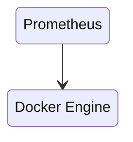
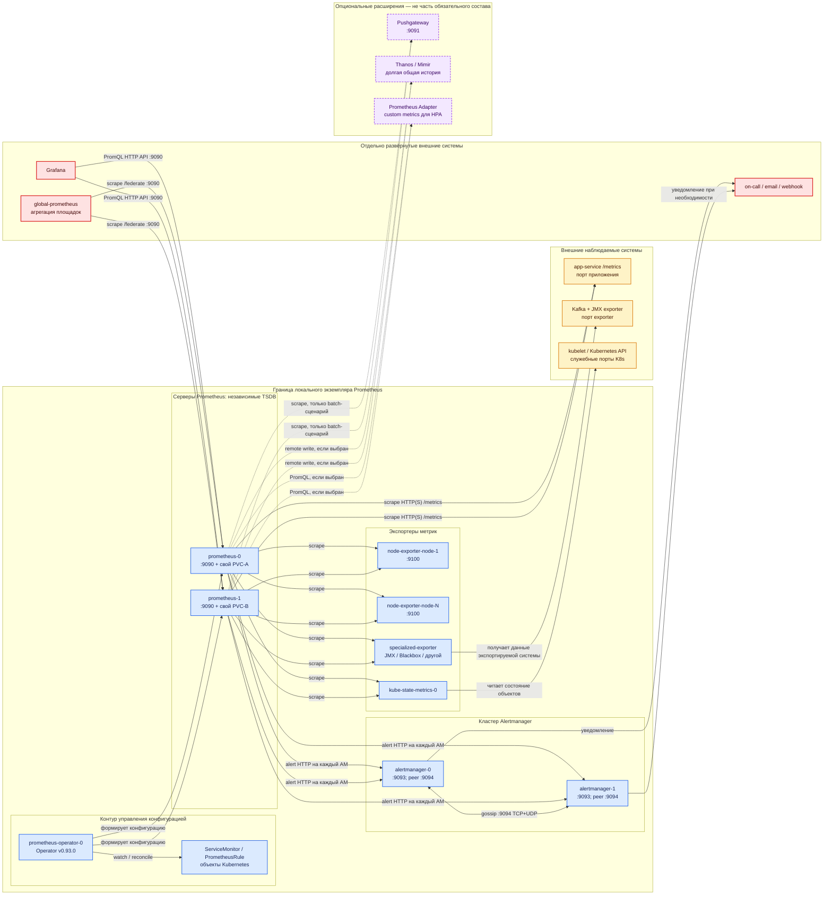

# Prometheus 3.13.2 LTS — назначение, состав и архитектура

Prometheus — self-hosted система метрик: она сама обращается по HTTP к целям, забирает числовые измерения, хранит временные ряды, вычисляет правила и отвечает на запросы PromQL. В принятом профиле используется **Prometheus 3.13.2 LTS** и, для Kubernetes, **kube-prometheus-stack 88.3.0**: Prometheus Operator **v0.93.0**, Alertmanager **v0.33.1**, node-exporter **v1.12.1-distroless**.

Документация: https://prometheus.io/docs/  
Образ: `quay.io/prometheus/prometheus:v3.13.2` (в чарте — `v3.13.2-distroless`).  
Пошаговая установка вынесена в `Prometheus.install.md`.

---

## Назначение системы

Prometheus нужен, чтобы **видеть числа во времени**: жив ли сервис (`up`), какова задержка, сколько происходит ошибок, не заканчивается ли место на диске. Эти данные помогают отличить, например, замедление Kafka от ожидания внешнего API в Camunda или нехватки ресурсов узла.

Система **снимает** метрики с уже работающих целей по pull-модели. Она **не** является шиной событий, озером эталонных данных, хранилищем логов или трассировок, SIEM и средством интеграции с ведомствами. Prometheus предназначен для эксплуатационных числовых рядов, где доступность мониторинга важнее абсолютной точности учёта; для биллинга со 100-процентной полнотой он не предназначен.

---

## Перечень функций

Self-hosted Prometheus OSS 3.13.2 и входящие в рассматриваемую экосистему отдельные программы выполняют следующие функции:

1. **Снимают метрики по HTTP** с endpoint `/metrics` целей. Интервал `scrape_interval` по умолчанию в спецификации конфигурации — **1m**, тайм-аут `scrape_timeout` — **10s** и не может превышать интервал.
2. **Хранят временные ряды в локальной TSDB**. Один процесс использует один собственный каталог: встроенного распределённого кластера TSDB нет. Если retention не задан, Prometheus хранит данные **15d**; в kube-prometheus-stack 88.3.0 исходное значение чарта — **10d**.
3. **Обнаруживают цели** через Kubernetes, DNS или файлы и меняют набор labels до записи с помощью relabeling.
4. **Выполняют PromQL и правила**. Recording rule заранее вычисляет выражение; alerting rule создаёт алерт и передаёт его в Alertmanager.
5. **Обеспечивают независимый HA-съём** двумя и более одинаково настроенными серверами. Реплики снимают одни цели, но имеют отдельные TSDB и различаются через `external_labels`; это не шардирование и не общая база.
6. **Предоставляют federation**: другой Prometheus забирает выбранные ряды через `/federate`.
7. **Передают сэмплы во внешнее хранилище** через remote write. Это интеграционная возможность, но внешнее хранилище не является обязательной частью Prometheus.
8. **Предоставляют HTTP UI и API** на **9090/TCP**, включая собственный `/metrics`.
9. **Маршрутизируют алерты** через отдельный Alertmanager: клиентский HTTP API — **9093/TCP**, обмен между репликами — **9094/TCP+UDP**.
10. **Получают инфраструктурные метрики** через node_exporter на **9100/TCP**, kube-state-metrics и специализированные exporters. В Kubernetes Prometheus Operator формирует конфигурацию из CRD, включая `ServiceMonitor` и `PrometheusRule`.

Prometheus не хранит логи, не выбирает лидера общей TSDB и не превращает две реплики в единую базу. Pushgateway применим только для ограниченного сценария короткоживущих batch-задач. Grafana, Thanos/Mimir и Prometheus Adapter могут дополнять решение, но не являются обязательными компонентами продукта.

---

## Основные элементы системы и зависимости

### Схема инстансов и потоков

Схема показывает одну площадку с двумя независимыми репликами Prometheus и двумя репликами Alertmanager. Количество реплик описывает эту архитектурную модель, а не заводские значения чарта. Все стрелки направлены **от инициатора сетевого обращения к получателю**.

**Легенда:**

- ■ Синий — компоненты локального экземпляра и поставки kube-prometheus-stack.
- ■ Красный — отдельные внешние системы, которые развёртываются, обновляются и восстанавливаются независимо.
- ■ Жёлтый — наблюдаемые приложения и инфраструктура; они предоставляют данные, но не входят в продукт.
- ■ Фиолетовый пунктир — опциональные интеграции. Их отсутствие не означает неполную установку Prometheus.
- Сплошная стрелка — основной запрос или передача данных; пунктирная — поток, возникающий только при осознанном выборе опции.

### Как читать потоки

1. **Направление стрелки показывает инициатора соединения.** Стрелка `prometheus-0 → app-service` означает, что Prometheus открывает HTTP(S)-соединение к `/metrics`. Приложение не отправляет метрики в TSDB само. Это исправляет распространённую ошибку, когда scrape изображают в направлении от цели к Prometheus.
2. **Каждая синяя реплика Prometheus выполняет собственный scrape.** `prometheus-0` и `prometheus-1` независимо обращаются к одним и тем же endpoint. Полученные сэмплы записываются соответственно в PVC-A и PVC-B; между TSDB нет репликации, консенсуса и общего диска.
3. **Exporter является переводчиком, а не центральным хранилищем.** Prometheus снимает с exporter формат `/metrics`; exporter получает исходные показатели у ОС, JVM, устройства или API. Для приложения, которое уже отдаёт Prometheus-метрики, промежуточный exporter не нужен.
4. **Поток конфигурации отделён от потока метрик.** Operator наблюдает Kubernetes CRD и формирует конфигурацию серверов. Он не проксирует scrape и не участвует в PromQL-запросах. Если Operator временно недоступен, уже запущенные серверы продолжают работать со своей текущей конфигурацией.
5. **Алерты отправляются каждой репликой Prometheus на все Alertmanager.** На этом пути не нужен балансировщик, скрывающий членов кластера. Alertmanager группирует и дедуплицирует алерты, а реплики обмениваются состоянием по gossip на 9094.
6. **Gossip не является потоком метрик.** По 9094 передаётся кластерное состояние Alertmanager. При разделении сети используется fail-open: уведомления могут продублироваться, чтобы не потеряться полностью.
7. **Grafana читает данные, но не хранит локальную TSDB Prometheus.** Она вызывает HTTP API на 9090 и отправляет PromQL. На схеме Grafana красная, потому что это отдельный продукт со своим жизненным циклом.
8. **Federation также следует pull-модели.** Отдельный `global-prometheus` сам вызывает `/federate` локальных серверов. Обычно наверх отдают выбранные агрегаты, а подробные ряды остаются на площадке.
9. **Пунктирные потоки существуют только при выбранном расширении.** Remote write передаёт сэмплы в Thanos/Mimir или другое совместимое хранилище; Adapter запрашивает Prometheus для HPA; Pushgateway временно принимает метрики коротких batch-задач, после чего Prometheus снимает их обычным scrape.
10. **Сетевой сбой читается со стороны инициатора.** Если Prometheus не успел получить ответ до `scrape_timeout`, цель становится `DOWN` с точки зрения этой реплики, даже если сам процесс цели продолжает работать. Поэтому результат отражает одновременно состояние цели и доступность сетевого пути.

### Компоненты, технологии и граница ответственности

#### Prometheus server (`prometheus-0`, `prometheus-1`)

Это основной бинарь на Go: HTTP-клиент для scrape, локальная TSDB, движок PromQL, evaluator правил, UI и API на 9090. Варианты запуска — самостоятельный бинарь/контейнер или StatefulSet, которым управляет Prometheus Operator. Несколько HA-реплик дают независимость съёма и алертинга, но не общую историю и не автоматическую дедупликацию результатов запросов. В границу продукта входят сервер, его конфигурация и собственный диск каждой реплики; внешнее распределённое хранилище не входит.

#### Alertmanager (`alertmanager-0`, `alertmanager-1`)

Отдельная программа экосистемы Prometheus принимает алерты на 9093, группирует, подавляет, дедуплицирует и маршрутизирует их получателям. Реплики образуют gossip-кластер через 9094 TCP+UDP без кворума. Возможны одна или несколько реплик; HA-контур на схеме показан двумя. Email-сервер, webhook и on-call-платформа находятся за границей продукта.

#### Prometheus Operator (`prometheus-operator-0`)

Kubernetes-оператор на Go преобразует декларативные CRD в StatefulSet, конфигурацию и связанные ресурсы Prometheus/Alertmanager. `ServiceMonitor`, `PodMonitor` и `PrometheusRule` — варианты CRD для описания целей и правил. Operator относится к Kubernetes-варианту поставки; при запуске чистого бинаря или контейнера его нет, и конфигурационными файлами управляют другим способом.

#### Node exporter (`node-exporter-node-*`)

Отдельный stateless-процесс для Unix-подобных ОС предоставляет на 9100 метрики ядра, CPU, памяти, файловых систем и сетевых интерфейсов. В Kubernetes обычно запускается DaemonSet — по экземпляру на узел. Он входит в состав kube-prometheus-stack, но не является частью бинаря Prometheus.

#### kube-state-metrics (`kube-state-metrics-0`)

Stateless-сервис читает Kubernetes API и преобразует состояние объектов Deployment, Pod, Node и других ресурсов в метрики. Он не собирает CPU или память из процессов и не заменяет node_exporter. Компонент относится к Kubernetes-профилю; вне Kubernetes не нужен.

#### Specialized exporters (`specialized-exporter`)

Exporters адаптируют системы, не поддерживающие Prometheus exposition format. Варианты: JMX exporter для JVM/Kafka, Blackbox exporter для внешних HTTP/TCP/ICMP-проверок, SNMP exporter для сетевого оборудования. Нужен только exporter, соответствующий конкретной наблюдаемой системе; установка всех exporters не является обязательной.

#### Наблюдаемые цели (`app-service`, Kafka, kubelet/Kubernetes API)

Это приложения и инфраструктура платформы, а не компоненты Prometheus. Цель либо предоставляет собственный `/metrics`, либо наблюдается через exporter. Приложение отвечает за смысл, тип и labels метрик; Prometheus отвечает за их периодический съём, хранение и вычисление.

#### Grafana

Отдельно развёртываемая система визуализации. Она использует Prometheus как data source и отправляет PromQL через API 9090. Grafana не обязательна для работы scrape, TSDB и правил; без неё доступны API и встроенный UI Prometheus. Её SSO, дашборды, плагины и резервное копирование находятся за границей продукта.

#### Получатели уведомлений (`on-call / email / webhook`)

Это внешние системы доставки и обработки инцидентов. Alertmanager знает маршруты и параметры подключения, но не отвечает за доступность почтового сервера или on-call-платформы. Без настроенного получателя правила всё ещё вычисляются, однако эксплуатационная цепочка уведомления не завершается.

#### Global Prometheus

Отдельный сервер Prometheus, который через `/federate` забирает выбранные ряды локальных площадок. Это архитектурный вариант для сводного представления, а не обязательный третий инстанс локального HA-контура. Его TSDB, правила и доступность проектируются отдельно.

#### Опциональные Pushgateway, Thanos/Mimir и Prometheus Adapter

- **Pushgateway** на 9091 применяют для метрик завершившихся batch-задач, которые Prometheus не успевает снять напрямую. Это не универсальная замена pull и не обязательная часть состава.
- **Thanos/Mimir** могут предоставить длительное распределённое хранение, глобальные запросы и дедупликацию. Prometheus полностью работоспособен без них.
- **Prometheus Adapter** преобразует результаты PromQL в Kubernetes Custom Metrics API для HPA. kube-prometheus-stack не делает Adapter обязательной частью мониторинга.

### Состав

| Компонент | Статус в рассматриваемом составе | Масштабирование |
|---|---|---|
| **Prometheus server** | Ядро продукта | Вертикально; независимые HA-реплики; функциональные шарды при необходимости |
| **Alertmanager** | Компонент цепочки алертинга | Gossip-кластер без кворума |
| **Prometheus Operator** | Входит в Kubernetes-вариант | Обычно один управляющий pod; не стоит на пути данных |
| **Node exporter** | Входит в Kubernetes-стек для метрик узлов | По экземпляру на машину / DaemonSet |
| **kube-state-metrics** | Входит в Kubernetes-стек | Stateless-реплики |
| **Specialized exporters** | По необходимости наблюдаемых систем | По топологии и нагрузке конкретного exporter |
| **Grafana, получатели, global Prometheus** | Внешние системы | Проектируются и эксплуатируются отдельно |
| **Pushgateway, Thanos/Mimir, Adapter** | Опциональные расширения | Не являются критерием полноты базового продукта |

### Порты

| Порт | Назначение | Кому открывать |
|---|---|---|
| **9090/TCP** | Prometheus UI, HTTP API, `/metrics`, `/federate` | Grafana, global Prometheus и доверенная внутренняя сеть; не интернет |
| **9091/TCP** | Опциональный Pushgateway | Только разрешённым batch-задачам и Prometheus; **9092** продукт не занимает |
| **9093/TCP** | Alertmanager UI и API | Prometheus и доверенный контур эксплуатации |
| **9094/TCP+UDP** | Gossip между Alertmanager; при TLS-транспорте используется TCP | Только членам одного AM-кластера |
| **9100/TCP** | node_exporter `/metrics` | Только Prometheus |
| **Порт сервиса + `/metrics`** | Метрики приложения или exporter | Только Prometheus |

Адрес прослушивания Prometheus по умолчанию `0.0.0.0:9090` означает привязку ко всем интерфейсам, но не разрешение публиковать endpoint в интернет.

### Граница продукта

В базовую границу входят серверы Prometheus с собственными TSDB, конфигурация scrape и правил и, при использовании Kubernetes-стека, Alertmanager, Operator, node_exporter и kube-state-metrics. Специализированный exporter входит в решение только для той системы, которой он нужен.

За границей находятся наблюдаемые приложения, Kafka и Kubernetes как источник данных, Grafana, каналы уведомлений, глобальная федерация и внешнее долговременное хранилище. Отказ внешней системы может нарушить соответствующий поток, но не превращает её в скрытый обязательный компонент Prometheus.

---

## Глоссарий

| Термин | Значение в этом документе |
|---|---|
| **Alert** | Результат alerting rule в активном состоянии, периодически отправляемый Prometheus в Alertmanager. |
| **CRD** | Custom Resource Definition — расширение API Kubernetes собственным типом объекта, например `ServiceMonitor`. |
| **Exporter** | Отдельный адаптер, который получает показатели системы и публикует их в формате `/metrics`. |
| **external_labels** | Labels, добавляемые сервером ко всем рядам и алертам для различения площадки или HA-реплики. |
| **Fail-open** | Поведение Alertmanager, при котором при сетевом разделении допустим дубль уведомления вместо риска не отправить его. |
| **Federation** | Pull выбранных рядов одним Prometheus с endpoint `/federate` другого Prometheus. |
| **Gossip** | Протокол обмена состоянием между репликами Alertmanager на 9094; это не Raft и не поток метрик. |
| **HA-реплика** | Независимый Prometheus с теми же целями и правилами, но со своей TSDB; не член общего кластера хранения. |
| **Label** | Пара ключ-значение, идентифицирующая временной ряд вместе с именем метрики. |
| **PromQL** | Язык запросов Prometheus для выборки и вычислений над временными рядами. |
| **Pull** | Модель, в которой Prometheus инициирует получение метрик у цели. |
| **PVC** | PersistentVolumeClaim — запрос Kubernetes на постоянный том; каждой реплике Prometheus нужен отдельный том. |
| **Recording rule** | Правило, которое заранее вычисляет PromQL-выражение и сохраняет результат как новый ряд. |
| **Relabeling** | Изменение или отбрасывание labels и целей до scrape либо до записи сэмплов. |
| **Remote write** | Отправка сэмплов из Prometheus во внешнюю совместимую систему хранения. |
| **Retention** | Период или лимит объёма, в пределах которого локальная TSDB сохраняет данные. |
| **Scrape** | Один цикл HTTP-запроса Prometheus к `/metrics`, разбора ответа и записи сэмплов. |
| **Service discovery** | Автоматическое получение списка целей из Kubernetes, DNS, файлов или других поддерживаемых источников. |
| **Сэмпл** | Значение временного ряда с временной меткой. |
| **Silence** | Временное правило Alertmanager, подавляющее уведомления по совпадающим labels. |
| **TSDB** | Time Series Database — локальное хранилище временных рядов внутри каждого Prometheus. |

---

## Источники

- Версия Prometheus 3.13.2 LTS: https://prometheus.io/download/
- Назначение и pull-модель: https://prometheus.io/docs/introduction/overview/
- HA и границы применения: https://prometheus.io/docs/introduction/faq/
- Локальная TSDB и retention: https://prometheus.io/docs/prometheus/latest/storage/
- `scrape_interval` и `scrape_timeout`: https://prometheus.io/docs/prometheus/latest/configuration/configuration/
- Federation: https://prometheus.io/docs/prometheus/latest/federation/
- Alertmanager HA и сетевые потоки: https://prometheus.io/docs/alerting/latest/high_availability/
- Prometheus Operator HA: https://prometheus-operator.dev/docs/platform/high-availability/
- kube-prometheus-stack 88.3.0: https://github.com/prometheus-community/helm-charts/tree/kube-prometheus-stack-88.3.0/charts/kube-prometheus-stack
