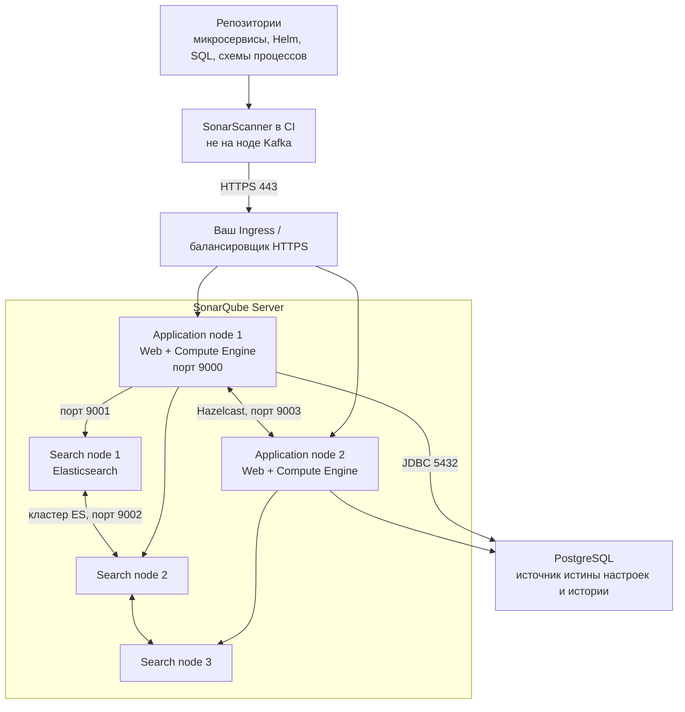

# SonarQube Server 2026.1.5 LTA — развёртывание и настройка

SonarQube — сервер отчётов статического анализа кода: сканер в CI смотрит исходники в момент сборки и отправляет отчёт; сервер превращает его в замечания, метрики и порог «можно сливать / нельзя». Это **не** сканер работающего контейнера (Falco), **не** SIEM (Wazuh), **не** WAF и не «кнопка качество включена».

Версия для боя: **SonarQube Server 2026.1.5** (Long-Term Active / LTA; патч 7 августа 2026). На дату подготовки это текущий LTA-патч линии 2026.1. Активная поддержка LTA — до 30 января 2027, security-фиксы — до 2 августа 2027 (по таблице endoflife.date, сверка 7 августа 2026).

Latest на ту же дату: **2026.4.1**. Официальный Helm-чарт `sonarsource/sonarqube` / `sonarqube-dce` **2026.4.1** ставит именно Latest, не LTA — образ и values в бою **пинить на 2026.1.5**. Community Build (бесплатная линейка, это уже **не** «Community Edition») на странице загрузок: **26.8.0.126808**; чарт 2026.4.1 по умолчанию тянет Community **26.7.0.124771**.

Документация LTA: https://docs.sonarsource.com/sonarqube-server/2026.1/  
Helm: https://artifacthub.io/packages/helm/sonarqube/sonarqube и `.../sonarqube-dce`  
Образы: линейка `sonarqube` на Docker Hub / зеркале поставщика.

Коммерческий продукт (Developer / Enterprise / Data Center) лицензируется **на инстанс в год** от объёма строк кода (LOC). Community Build — отдельная бесплатная линейка без LTA: поддерживается только свежий релиз. Единственная редакция, в которой поставщик даёт **кластер и отказоустойчивость самого SonarQube** — Data Center Edition (DCE). Без ключа DCE штатного кластера приложения нет.

Этот текст — не набор команд «скопируй values.yaml», а правила, без которых система не будет одновременно устойчивой к сбоям, масштабируемой и безопасной. Пошаговая установка — в `SonarQube.install.md`.

---

## Назначение системы

SonarQube нужен, чтобы **до выкладки** ответить: этот коммит или merge-request можно вливать по правилам качества и статическому анализу. Сканер живёт **в CI**, сервер сам репозиторий с диска разработчика не читает.

Система хранит issues кода, настройки, пользователей и историю анализов. Она **не** участвует в шине событий, **не** исполняет бизнес-процессы и **не** ходит в государственные сервисы. Kafka, Camunda, озеро и интеграционное API — **проекты** в SonarQube (их репозитории), не рантайм-зависимости сервера.

Падение SonarQube **не должно** ронять Kafka и Camunda. Падение SonarQube **должно** быть заложено в CI: либо пайплайн ждёт, либо (хуже) люди льют в обход порога качества.

---

## Перечень функций

Что умеет SonarQube Server (по документации поставщика; набор зависит от редакции):

1. **Принимать отчёты сканера** по HTTPS: UI и REST API (процесс Web). Сканер — отдельная программа в CI (Maven/Gradle/CLI/.NET/npm…), ключ — токен `sonar.token`, не пароль.
2. **Разбирать отчёты в фоне** (Compute Engine): очередь background tasks. Узкое место «сканы зависли» смотрят в Administration → Projects → Background Tasks (`pending_count` / `pending_time`). Параллельных разборов больше одного — **Enterprise и выше**, в UI. На DCE число **глобальное** и на каждом application-узле **повторяется**.
3. **Искать issues и код** через Elasticsearch. В Developer/Enterprise поиск **вшит в тот же процесс**. В DCE — **отдельные** search-ноды, это отдельный кластер Elasticsearch.
4. **Держать порог Quality Gate**: покрытие, баги, уязвимости. В коммерческих редакциях умеет **блокировать merge** pull request. Анализ веток и PR — **Developer и выше**; в Community Build этого фокуса нет.
5. **Хранить источник истины** во **внешней** базе (PostgreSQL, реже Oracle/SQL Server): настройки, пользователи, история анализов, лицензионное состояние. Встроенная H2 — только тест; в бою поставщик **запрещает**. С 2026.1 Helm **больше не кладёт PostgreSQL в чарт**.
6. **Кластеризовать приложение** только в DCE: несколько application-нод (Web + Compute Engine) плюс search-ноды, шина Hazelcast между application (отдельно Hazelcast ставить **не нужно**). Балансировщику **не** нужны sticky sessions — сессии в JWT-cookie.
7. **Входить через IdP**: SAML, LDAP, GitLab; JIT (пользователь создаётся при первом входе); SCIM (автосинхронизация групп) — **Enterprise+**.
8. **Масштабировать application-ноды** HPA в Kubernetes — только чарт `sonarqube-dce`. Search-ноды HPA **не** масштабирует.

Чего система **не** делает и часто путают: она не даёт отказоустойчивость приложения без DCE (второй процесс Community/Developer/Enterprise — это второй **инстанс**, не кластер); не ходит в read-only реплику PostgreSQL как во второй живой сервер; не обещает пережить два дата-центра из трёх на трёх search-нодах; не анализирует «терабайты озера» (ёмкость — в LOC и отчётах CI); не ставит плагины «на одну ноду — разъедутся сами» (ставить на **все** application-ноды, при установке **все** application стопают). Rolling upgrade без простоя кластера DCE нет: нужен простой всего кластера. ArgoCD поставщик помечает как *not currently fully supported*.

---

## Требования к развёртыванию

### Требования к ПО

| Что | Что ставить | Комментарий |
|---|---|---|
| **Формат поставки** | Контейнеры Docker / поды Kubernetes **или** ZIP на Linux | Бой DCE: Helm **`sonarqube-dce`**, тег образа **2026.1.5**, не дефолт чарта 2026.4.1. Тест без ключа DCE: чарт **`sonarqube`** с Community **или** Developer, если ключ уже есть. |
| **Kubernetes** | Официальные чарты `sonarqube` и `sonarqube-dce` | Совместимость версий Kubernetes — в README чарта. CSI + StorageClass с RWO **в нужной зоне** (search-под после бинда PVC обычно не переедет в другой дата-центр). Fargate / App Runner / Azure App Service поставщик **не поддерживает**. Azure Fileshare PVC — известный слом прав NTFS. |
| **ОС** | Linux x64/AArch64 (основной контур) | Windows x64 и macOS x64/AArch64 поставщик заявляет для ZIP; z/OS нет. **Боевой SonarQube на Windows-хосте в схеме с Kubernetes не предполагается.** |
| **Java (только ZIP)** | JDK **21 или 25** | Образы Docker/Helm уже несут свою JVM. |
| **Ядро Linux под Elasticsearch** | `vm.max_map_count ≥ 524288`, `fs.file-max ≥ 131072` | У пользователя SonarQube: `nofile ≥ 131072`, `nproc ≥ 8192`, **seccomp** включён, **`/tmp` доступен на запись**. Не путать со старым 262144 из части гайдов Docker. В проде privileged `initSysctl` выключают — sysctl делает администратор нод. |
| **Диск search** | Локальный **SSD** | Поставщик: *Do not use remote-mounted storage (NFS, SMB/CIFS, NAS)*. RAID-зеркало «для ES» не нужно — реплики ES и primary хранилище = база. |
| **База боя** | Отдельный PostgreSQL **14–18**, charset **UTF-8** | Низкая задержка до нод SonarQube. H2 — не бой (нет репликации, HA, нормальных бэкапов — формулировка поставщика). Oracle/SQL Server — если сознательно выберете. |
| **Helm 2026.1.0+** | Обязательный JDBC (`jdbcOverwrite.*`) | Встроенный PostgreSQL-subchart **удалён**. Нет JDBC → либо H2 (тест), либо инстанс не о том. |
| **Лицензия** | Ключ Developer / Enterprise / DCE | Community Build ключа DCE не заменит. Без DCE нет штатного кластера приложения. |
| **Сканер в CI** | SonarScanner на агентах | Сеть CI → HTTPS VIP. Самоподписанный сертификат на прокси = доверие **на всех агентах и в IDE**. |
| **Вход** | Свой Ingress/Gateway | Nginx из чарта поставщик относит к тесту; зависимость ещё и deprecated. |

### Требования к ресурсам

Цифр «сколько ядер на ваши репозитории» у проекта **нет** — нагрузки и LOC в исходном запросе не было. Ниже ориентиры поставщика, не смета закупки.

| Сценарий | CPU | RAM | Диск |
|---|---|---|---|
| **Референс до ~10 млн LOC** (один хост Server, не DCE) | Хост SonarQube: **2 ядра**; PostgreSQL: **2 vCPU** | Хост: **4 ГиБ**; PostgreSQL: **8 ГиБ** | Tablespace PostgreSQL: **30 ГиБ** |
| **Референс до ~50 млн LOC** (Enterprise) | Хост: **8 ядер**; PostgreSQL: **4 vCPU** | Хост: **16 ГиБ**; PostgreSQL: **16 ГиБ** | Tablespace: **150 ГиБ**; **+30%**, если включён Advanced Security |
| **Валидация поставщика на 200 млн issues (DCE)** | Search: **8 vCPU**; application: **4 vCPU** | Search: **32 ГиБ** (из них **16 ГиБ** под Elasticsearch); application: **16 ГиБ** | SSD search; **10%+** свободно всегда (при ~90% диск Elasticsearch экономит, при **95%** может закрыть индексы на запись) |
| **Дефолт Helm `sonarqube` (не DCE)** | Как в values | Request **2048 МиБ** / limit **6144 МиБ** | Это стенд, не план ёмкости |
| **Дефолт Helm `sonarqube-dce`** | HPA app по умолчанию: **400–800m** CPU | Search **3072 МиБ**, app **4096 МиБ** (под Xmx search 2 ГиБ / app 3 ГиБ и правило ~80%); HPA RAM **3072 МиБ** | PVC search **5 ГиБ** — для боя с большой историей issues заведомо мало как план |

Дополнительно:

- Heap Elasticsearch: ориентир поставщика «50% RAM ноды, не больше **32 ГиБ**».
- HPA application-нод: `minReplicas: 2`, `maxReplicas: 10`, по умолчанию **выключен**. Не ставить `minReplicas` ниже 2; на время длинного апгрейда HPA **выключить**. Search HPA не масштабирует.
- Все search-ноды **идентичны** по CPU/RAM/диску. По одной машине/ноде на процесс — рекомендация поставщика.
- Дефолты HPA «400m CPU / 3072 МиБ» рассчитаны на дефолтные resources чарта, не на таблицу 16 ГиБ.
- Usage patterns сильно разные — **мониторить и подкручивать**. Неизвестная нагрузка = эти таблицы единица пересчёта, не смета.

---

## Основные элементы системы и зависимости

Это одно ПО из **нескольких процессов**. Ниже — те, что живут отдельными инстансами, и как они вызывают друг друга.

### Схема инстансов и потоков

Как читать схему:

1. Сканер в CI отправляет отчёт на HTTPS-вход. Люди открывают тот же VIP. На порты поиска **9001/9002** и шины **9003** клиентов не пускают.
2. **Application-нода** принимает UI/API и разбирает отчёты. В Community/Developer/Enterprise это **один** процесс. В DCE — не меньше двух нод за балансировщиком с health check, **без** sticky sessions.
3. **Search-ноды** (только DCE) — отдельный кластер Elasticsearch: поиск issues и кода. Индекс после failover Kubernetes-кластера поставщик требует **принудительно перестроить**. Пока индекс строится — поиск/часть UI деградируют, PostgreSQL при этом может быть цела.
4. **PostgreSQL** — настоящий источник истины. Индекс поиска можно перестроить. Потеря базы без бэкапа — потеря инстанса: пользователи, настройки, история, лицензионное состояние. HA базы — Patroni / ваш контур PostgreSQL, не фича SonarQube. Живой SonarQube в read-only реплику **не ходит**.

Рядом, но это уже другое ПО: CI, IdP, Ingress. Их отказ проектируется отдельно. Сканер падает вместе с агентом CI — это нормально.

### Что входит в состав

| Роль | Зачем | Как масштабируется |
|---|---|---|
| **Scanner** | Анализ кода в CI | Горизонтально: больше агентов CI. Это **не** часть StatefulSet SonarQube |
| **Application (Web + Compute Engine)** | UI, API, разбор отчётов | Community/Developer/Enterprise: **один** процесс. DCE: **≥ 2** application-нод, дальше — ещё ноды / HPA |
| **Search (Elasticsearch)** | Поиск issues/кода | Вшит в единственный процесс **или** 3+ search-нод в DCE |
| **База (ваша)** | Настройки, пользователи, история анализов | Отдельный PostgreSQL со **своей** HA. SonarQube базу не кластеризует |

Редакции — это не «тариф UI», это разные машины отказа:

| Нужно | Community Build | Developer | Enterprise | **Data Center** |
|---|---|---|---|---|
| Бесплатно / без LOC-лицензии Server | да | нет | нет | нет |
| Анализ веток / PR | нет | да | да | да |
| Несколько CE workers из UI | нет | нет | да | да |
| Кластер application + search, HA самого SQ | **нет** | **нет** | **нет** | **да** |
| HPA application-нод в Kubernetes | нет | нет | нет | да (чарт `sonarqube-dce`) |
| SAML SSO | по матрице — коммерческие | да | да | да |
| SCIM (Entra/Okta) | нет | нет | да | да |

Фраза из документации редакций: DCE — для very large / mission-critical, фокус **HA, redundancy, autoscaling in Kubernetes**. Сотрудник Sonar в community-треде: *HA isn’t supported in any edition below Data Center Edition.*

**Следствие:** без лицензии DCE у SonarQube **нет** штатного кластера. Можно сделать устойчивую **базу** и холодный стенд — это уже не HA приложения, это восстановление после аварии.

### Порты (контракт сети)

| Порт | Назначение | Кому открывать |
|---|---|---|
| **9000/TCP** | UI и API (`sonar.web.port`), сюда же CI | Только через HTTPS-прокси / Ingress. Не в интернет |
| **9001/TCP** | Application → Search | Только application-ноды |
| **9002/TCP** | Search → Search (кластер Elasticsearch) | Только search-ноды |
| **9003/TCP** | Application → Application (Hazelcast) | Только application-ноды |
| **5432/TCP** | PostgreSQL | Только application-ноды. Не мир |

Три TCP-сети, которые поставщик просит мыслить отдельно: Hazelcast (app↔app), Elasticsearch (search↔search), search (app↔search). Их можно сегментировать настройками хоста.

В Developer/Enterprise снаружи обычно виден только **9000** (+ JDBC до базы). Вшитый Elasticsearch наружу не торчит как отдельный продукт — но ядро всё равно требует `vm.max_map_count` и диск.

### Зависимости окружения (что ещё должно быть)

- Стабильный DNS до writer PostgreSQL; низкая задержка JDBC.
- В Kubernetes том с режимом «один под — один диск» на каждую search-ноду. Access mode в чарте — `ReadWriteOnce`.
- Идентификация: люди — IdP; сканеры — токены с правом Execute Analysis. Общий `admin`/`admin` у CI запрещён.
- Force user authentication по умолчанию **включён**. Выключение открывает куски API анонимно (список в документации) — для контура с госинтеграциями так нельзя.

---

## Краткие вводные

### Как устроена отказоустойчивость

Три разных контура. Путать их — главная ошибка.

**1) Приложение SonarQube**

| Редакция | Что падает | Что происходит |
|---|---|---|
| Community / Developer / Enterprise | Единственный хост/под | UI, API, приём отчётов — **всё**. CI красный. Данные живы, **если** жива PostgreSQL и есть бэкап. Референс-архитектуры: resiliency = мониторинг + бэкап базы + быстрый restore; *If high availability is critical, DCE is recommended* |
| DCE, дефолтная топология (2 application + 3 search) | Один application | Цитата: *one application node and one search node can be lost without impacting users*. Балансировщик не должен слать трафик на мёртвую ноду |
| DCE | Два application из двух | Нет UI/API. Search и база могут быть живы — пользователям всё равно темно. Два пода в одной зоне = один дата-центр убивает оба |
| DCE | Плагин / апгрейд | Нужен **простой всего кластера**. Это не Kafka rolling |

**2) Search (Elasticsearch)**

| Что падает | Что происходит |
|---|---|
| Одна search-нода из трёх (и шардные реплики на месте) | Дефолтная топология это переживает вместе с одним application |
| Две search-ноды / два дата-центра, где они жили | Кворум из трёх — как у любого Elasticsearch: запись/стабильность под вопросом. Поставщик **не** обещает «два из трёх» |
| Весь индекс после failover Kubernetes | Официально: **forced reindex** |
| Диск ≥ 90–95% | Индексы только чтение / падение поиска. «Терабайты» здесь ни при чём: это заполненный PVC |

Поставщик: три search-ноды можно разнести по **разным зонам одной region**. Stretch Elasticsearch «на всякий случай на три площадки» без замера задержки — не из гайда.

**3) База PostgreSQL**

HA базы — **ваша** схема PostgreSQL. Официальный пример восстановления: primary + replica PostgreSQL, **writer endpoint**, два Kubernetes-кластера SonarQube, балансировщик с **priority** на primary. Второй SonarQube **холодный**. После включения replica-кластера — переиндексация поиска. Read-only реплика для живого SonarQube **не поддерживается**.

**4) Сканеры**

Сканер падает вместе с агентом CI. Пока сервер мёртв, отчёты не принять. Политика CI (ждать / падать / идти без порога) — ваше решение.

### Как устроено масштабирование

Четыре независимые оси:

1. **Больше репозиториев / чаще PR** → очередь Compute Engine. Enterprise+: больше workers **и** больше heap (память **делится** между workers). DCE: workers × число application-нод. HPA в DCE целится в CPU application-подов; цель — чтобы background tasks не копились.
2. **Больше UI и приёма отчётов** → больше application-нод (DCE).
3. **Больше индекса issues** → RAM/диск **search** (SSD, не NFS), не «ещё один брокер Kafka».
4. **Тяжёлый сам скан** (большой Java-граф) → CPU/RAM **агента CI**. Это про сканер, не про то, что DCE «проглотит любой монолит».

Горизонтально растут: application-ноды (DCE) и агенты CI. Вертикально — диск и RAM search и PostgreSQL.

### Безопасность самого SonarQube

Компрометация сервера = компрометация **карты вашего кода**: findings по интеграциям с госслужбами, секреты, которые правила ещё не вычистили, токены CI, список проектов. Токен админа = полный инстанс.

Опасные значения «из коробки / из примера»:

| Что | Как в примере | Почему опасно |
|---|---|---|
| Первый вход | **`admin` / `admin`**, сразу просит смену | Первый же сканер на порту 9000 |
| Helm `setAdminPassword.newPassword` | дефолт **`AdminAdmin_12$`** (публичный values) | Известный пароль |
| Helm `setAdminPassword.currentPassword` | **`admin`** | Чтобы hook сменил заводской — в бой не оставлять |
| Группа админов | **`sonar-administrators`** | Поставщик **настоятельно** советует переименовать: при синхронизации групп с IdP это типичный путь захвата |
| JWT DCE | без своего `applicationNodes.jwtSecret` | Кластер сессий не тот / подделка сессий |
| Force authentication | по умолчанию **включён** | Выключение открывает в том числе `api/users/search`, `api/system/status`, куски профилей правил |

Сканер: только `sonar.token`, не пароль в `settings.xml` в Git.

DCE: включить **аутентификацию Elasticsearch** (`sonar.cluster.search.password` / Helm `searchAuthentication`) и **TLS** app↔search (`nodeEncryption.enabled`). Иначе 9001/9002 — открытый поисковый кластер во внутренней сети.

FIPS: SonarQube на RHEL «с ограничениями». Известные: аутентификация ES в DCE на FIPS **не работает** (PEM пока не поддерживается); SAML с подписью/шифрованием assertion — **ещё нет**. Webhook secret в FIPS ≥ 16 символов.

«Включили Helm с встроенным ingress-nginx и H2 и открыли LoadBalancer» — это новая поверхность атаки, не контур качества.

---

## Допущения

Ниже то, чего не было в исходном запросе, но без чего нельзя нарисовать конкретную схему. Если допущение неверно — схему надо пересмотреть.

1. Берём **свою установку SonarQube Server**, не SonarQube Cloud. Три своих дата-центра облако поставщика не заменяют.
2. Для боя, который должен переживать отказ узла приложения, берём **DCE**. Без DCE честно описан только «один узел + HA PostgreSQL + холодный запас». Нельзя написать «Community в трёх дата-центрах = HA».
3. Версия боя — **2026.1.5 LTA**, не Latest 2026.4.1. У Latest окно поддержки ~до следующего релиза. Если платформа сознательно сидит на Helm «всегда latest» — это другое допущение (в 2026.4 ещё и переезд на Elasticsearch 9 с пересборкой индекса).
4. Бой крутится в Kubernetes, установщик DCE — Helm **`sonarqube-dce`**. Тест без лицензии DCE — чарт **`sonarqube`**.
5. Три дата-центра = три зоны отказа одной region (город). Search-ноды поставщик разрешает разносить по зонам **внутри region**. Пока задержку не измерили — честный бой либо один логический DCE после **замера**, либо search+база в одной площадке, а третья — холодный запас.
6. Цель отказа: пережить **1** дата-центр, не 2 из 3. На трёх search-нодах (по одной на площадку) потеря двух площадок снимает кворум Elasticsearch.
7. Нагрузка и LOC неизвестны — нет цифры «N application-нод и M терабайт PVC». Есть сигналы (очередь CE, heap, диск search, latency JDBC) и рычаги (workers, ноды, SSD, PostgreSQL).
8. Формального SLA на CI нет. «Система 24/7» про бизнес-контур. Нужна явная политика: блокирует ли красный/недоступный SonarQube поставку.
9. CI и IdP будут. Без пайплайна сервер — пустой UI. Без IdP в бою останетесь с локальным `admin`.
10. PostgreSQL — ваша платформенная база. HA базы проектируется отдельно.
11. Учебный стенд изолирован. На нём допустимы H2 / один под / дефолтный пароль *внутри песочницы*. В бой их не копируем.
12. Camunda, Kafka, озеро, интеграционное API — **проекты** в SonarQube, не рантайм-зависимости. Ноды брокеров сервер не мониторит.
13. Лицензия DCE куплена или будет куплена до боя. Иначе раздел боя для приложения неисполним; остаётся Enterprise/Developer + холодный запас.
14. Не используем ArgoCD как единственный путь выката, пока поставщик пишет, что это не fully supported.
15. PKCS#12 для Elasticsearch собирается алгоритмом, который читает JVM образа (в доке 2026.1 ещё пометка *readable by Java 17* — проверять на вашей JVM 21/25).

---

## Критически важные условия, которых нет в исходном контексте

Их нужно закрыть **до** «helm install и забыли».

| Пробел | Почему это ломает решение |
|---|---|
| **Редакция и бюджет LOC** | Без DCE нет HA приложения. Без Developer нет нормального PR-порога. Без цифры LOC нельзя ни лицензию, ни «small vs 50M» железо |
| **Задержка и потери между дата-центрами** (app↔search 9001/9002, search↔search 9002, JDBC) | Поставщик требует low latency до базы и same region для search. Без замера stretch Elasticsearch — лотерея |
| **Один Kubernetes на три площадки или три кластера** | От этого зависит: один DCE с topologySpread или официальные **два кластера** (живой + холодный) |
| **Где живёт writer PostgreSQL** | SonarQube не ходит в read-only replica. Падение площадки с writer = падение инстанса, пока не сработает **ваш** failover базы |
| **Политика CI при недоступном сервере** | Не спроектировали — в инциденте либо встанет весь релизный поезд, либо все обойдут порог |
| **IdP и судьба группы `sonar-administrators`** | Синхронизация групп с IdP + дефолтное имя = типовой захват админки |
| **Куда смотрит UI** | Публичный 443 с `admin`/`admin` или `AdminAdmin_12$` — инцидент |
| **StorageClass: локальный SSD vs сеть vs «один NFS на три search»** | Второе поставщик запрещает для Elasticsearch. Третье — одна точка отказа и задержка |
| **Нужен ли FIPS / отдельная криптография** | DCE ES-auth и часть SAML на FIPS официально ограничены |
| **Плагины** | Выкат = простой **всего** DCE; забыть ноду = расхождение |
| **Срок хранения issues / персональные данные** | В индексе и базе может оказаться фрагмент кода с персональными данными. Политика хранения — ИБ, не дефолт Helm 5 ГиБ |

---

## Краткое описание ключевых этапов и элементов развертывания

Общий каркас (и тест, и бой):

1. Зафиксировать **продукт и версию**: Community Build **или** Server 2026.1.5 LTA + редакция. Не смешивать Community 26.8 с образом DCE 2026.1 «на глаз».
2. Сначала **PostgreSQL UTF-8** (даже на серьёзном тесте; H2 — только «пощупать UI за час»). Потом SonarQube. Потом CI-сканер.
3. Выпустить **свои** пароли, JWT, JDBC secret, сертификаты прокси **до** первого боевого проекта.
4. Сменить `admin`/`admin` (или Helm-дефолт `AdminAdmin_12$`). Переименовать `sonar-administrators`. Включить HTTPS. Оставить Force authentication.
5. Прогнать **один** репозиторий до зелёного/красного Quality Gate в UI и увидеть background task *SUCCESS*.
6. Включить метрики: очередь CE, heap Web/CE/ES, диск search, latency JDBC, health application-нод.
7. Только потом — профили правил, блок merge, IdP, размазывание по площадкам.

Боевая схема на несколько дата-центров — в `SonarQube.install.md`. Ниже — только учебный стенд.

---

### 1 инстанс: тестовый стенд, 1 площадка, без нагрузки

**Цель стенда:** увидеть проект, отчёт сканера, шум правил на *вашем* Java/Helm, понять UI и Quality Gate. **Не** цель: доказать падение дата-центра и сотню параллельных PR.

Два официальных минимальных пути (выберите один):

**Путь A — Docker / ZIP, один хост** (быстрее понять продукт):

- Образ Community или Developer.
- UI: `http://localhost:9000`, вход `admin`/`admin`, смена пароля.
- База: лучше сразу маленький PostgreSQL рядом, не H2, если стенд живёт дольше недели.
- Ядро Linux: `vm.max_map_count=524288` и лимиты файлов/тредов из pre-installation.

**Путь B — Kubernetes, чарт `sonarqube` (не `sonarqube-dce`)** — ближе к оркестратору:

- `community.enabled=true` **или** `edition=developer` + ключ;
- **своя** JDBC-строка на стендовый PostgreSQL; не оставлять H2, если на стенде будут реальные проекты;
- свой Ingress выключен (`ingress-nginx.enabled=false` — рекомендация production use case; на тесте можно временно включить, понимая, что зависимость deprecated);
- `initSysctl` на тесте часто оставляют `true` (privileged), чтобы не драться с ядром; в бой его выключают;
- пароль админа — свой, не `AdminAdmin_12$`, даже на тесте, если до стенда есть сеть кроме вашей.

Режим «три search-ноды DCE на ноутбуке» для знакомства **не нужен**: создаст ложное чувство HA и сгорит по RAM. DCE без ключа всё равно не взлетит как кластер.

#### Что сознательно упрощаем

| Параметр | На тесте | Почему можно |
|---|---|---|
| Кластер DCE | нет | Нет требования пережить узел |
| Replica search | вшитый Elasticsearch в одном поде | Иначе yellow/кворум на одном диске |
| Сертификаты | самоподписанные / HTTP внутри песочницы | Иначе команда утонет в PKI раньше, чем в правилах |
| Единый вход | локальные пользователи | На тесте важнее контур сканера |
| HPA | выкл | Нет нагрузки |
| PVC 5 ГиБ | можно | Нет истории issues |
| CE workers | дефолт | Нет Enterprise-очереди |
| CPU/память | как в чарте | Не цель — ёмкость |

#### Чего на тесте **не** стоит упрощать

- Внешняя PostgreSQL, если стенд не однодневный.
- Хотя бы один скан реального сервиса. Проверка: задача в Background Tasks = SUCCESS, issues видны.
- Понимание: **сканер живёт в CI**, сервер без пайплайна пустой.
- Force authentication оставить включённым, если стенд хоть как-то маршрутизируется.
- Запомнить: успех на одном поде **не** доказывает DCE и не доказывает JDBC через три площадки.

#### Сильные стороны такой схемы

- Поднимается за часы.
- Совпадает с Try-out / Helm non-DCE.
- Дёшево показывает шум правил на вашем коде.

#### Слабые стороны (обязательно понимать)

- Нет модели отказа площадки, нет доказанной ёмкости CE, нет балансировщика на два application.
- Зелёный порог на игрушечном репозитории **не** доказывает, что очередь CE выдержит монорепозиторий.
- Дефолтные пароли и встроенный ingress приучают «открыть и зайти».
- Community Build без анализа PR легко уехать в бой «потому что на тесте хватало» — для микросервисов это ловушка.

Практическая рекомендация: препрод = маленький **боевой профиль** (DCE 2+3 или хотя бы Enterprise на отдельной PostgreSQL, свои секреты, HTTPS, один проект из CI, свой Ingress), даже без боевого трафика. Всё это **в одном** дата-центре.

---

## Сводка: что считать «экземпляр готов»

| Требование | Тест (1 площадка) | Бой |
|---|---|---|
| Отказоустойчивость | Не требуется | **DCE** ≥2 application / 3 search, разнесение по нодам, балансировщик с health check, HA **writer** PostgreSQL, бэкап базы с учебной восстановкой. Схема на 2–3 дата-центра — в `SonarQube.install.md`. Переживание **двух** площадок не обещать |
| Производительность / масштаб | Не требуется | Очередь CE под контролем; workers только с запасом heap/CPU/базы; HPA осторожно; PVC search не 5 ГиБ «как в чарте»; сканер масштабируется CI, не StatefulSet сервера |
| Безопасность | Дефолт паролей только в изоляции; UI не с мира | Нет заводских паролей/JWT; HTTPS; force auth; IdP; ES auth+TLS; 9001–9003 закрыты; pin 2026.1.5; токены в CI; админ-группа переименована |

**Не готов к бою**, если: Community/Developer/Enterprise «в трёх дата-центрах для HA»; H2 или PostgreSQL из старого subchart; один search PVC на NFS; `admin`/`admin` или `AdminAdmin_12$`; встроенный ingress-nginx в интернет; `latest`; DCE без ключа; три полноценных инстанса без причины; read-replica как второй живой сервер; задержку не мерили, а Elasticsearch растянули на три площадки; нет учения отказа writer и одной search-зоны; CI обходит Quality Gate; ждут, что SonarQube заменит Falco/Wazuh/WAF или проанализирует озеро клиентских данных вместо репозиториев.

---

## Источники (чтобы не принимать на веру)

- Релиз 2026.4 / патчи 2026.4.1 и 2026.1.5 (7 Aug 2026): https://docs.sonarsource.com/sonarqube-server/server-update-and-maintenance/release-notes
- Загрузки LTA 2026.1.5 / Community 26.8.0.126808: https://www.sonarsource.com/products/sonarqube/downloads/
- Окна поддержки: https://endoflife.date/sonarqube-server
- Редакции Server, LOC, DCE = HA: https://docs.sonarsource.com/sonarqube-server/2026.1/discovering/sonarqube-server-editions.md
- DCE topology, 2 app + 3 search, потеря 1+1, same region / разные AZ: https://docs.sonarsource.com/sonarqube-server/2026.1/server-installation/data-center-edition/dce-topology.md
- DCE requirements, железо 200M issues, 3 сети, LB без sticky: https://docs.sonarsource.com/sonarqube-server/2026.1/server-installation/data-center-edition/installation-requirements.md
- Порты 9000–9003: https://docs.sonarsource.com/sonarqube-server/2026.1/server-installation/data-center-edition/network-security/network-rules.md
- ES auth/TLS: https://docs.sonarsource.com/sonarqube-server/2026.1/server-installation/data-center-edition/network-security/elasticsearch-security-features.md
- Host: RAM/CPU, 10% диск, не NFS, heap ES 50%, Java 21/25: https://docs.sonarsource.com/sonarqube-server/2026.1/server-installation/server-host-requirements.md
- Linux: `vm.max_map_count=524288`: https://docs.sonarsource.com/sonarqube-server/2026.1/server-installation/pre-installation/linux.md
- База отдельно, PostgreSQL 14–18, H2 не прод: https://docs.sonarsource.com/sonarqube-server/2026.1/server-installation/installing-the-database.md
- Референс до 10M / 50M LOC: https://docs.sonarsource.com/sonarqube-server/2026.1/server-installation/reference-architectures/up-to-10m-loc.md и `.../up-to-50m-loc.md`
- K8s DCE, свой Ingress/БД, нет PostgreSQL dependency с 2026.1: https://docs.sonarsource.com/sonarqube-server/2026.1/server-installation/data-center-edition/on-kubernetes-or-openshift/before-you-start.md
- DR: Active-Cold, нет read-only DB, reindex: https://docs.sonarsource.com/sonarqube-server/2026.1/server-installation/data-center-edition/on-kubernetes-or-openshift/setting-up-disaster-recovery.md
- HPA только app nodes: https://docs.sonarsource.com/sonarqube-server/2026.1/server-installation/data-center-edition/on-kubernetes-or-openshift/setting-up-autoscaling.md
- Helm `sonarqube` / `sonarqube-dce`: https://artifacthub.io/packages/helm/sonarqube/sonarqube
- CE workers EE+: https://docs.sonarsource.com/sonarqube-server/2026.1/server-update-and-maintenance/maintenance/improving-performance.md
- Force authentication: https://docs.sonarsource.com/sonarqube-server/2026.1/instance-administration/security/user-accounts.md
- IdP, переименовать `sonar-administrators`: https://docs.sonarsource.com/sonarqube-server/2026.1/instance-administration/authentication/overview.md
- `admin`/`admin`: https://docs.sonarsource.com/sonarqube-server/2026.1/try-out-sonarqube
- HA только в DCE: https://community.sonarsource.com/t/sonarqube-enterprise-edition-setup-for-high-availability/139918

Утверждения вида «SonarQube переживёт два дата-центра» или «N millicores на интеграционный сервис» в документации поставщика **отсутствуют** — поэтому в этом файле их нет. Порога задержки в миллисекундах нет: его надо измерить у себя на JDBC и портах 9001–9003.
