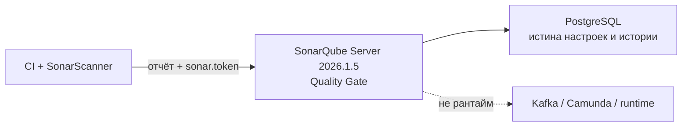
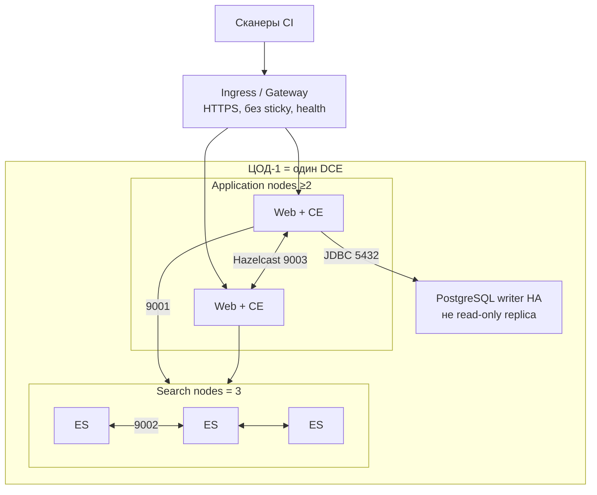
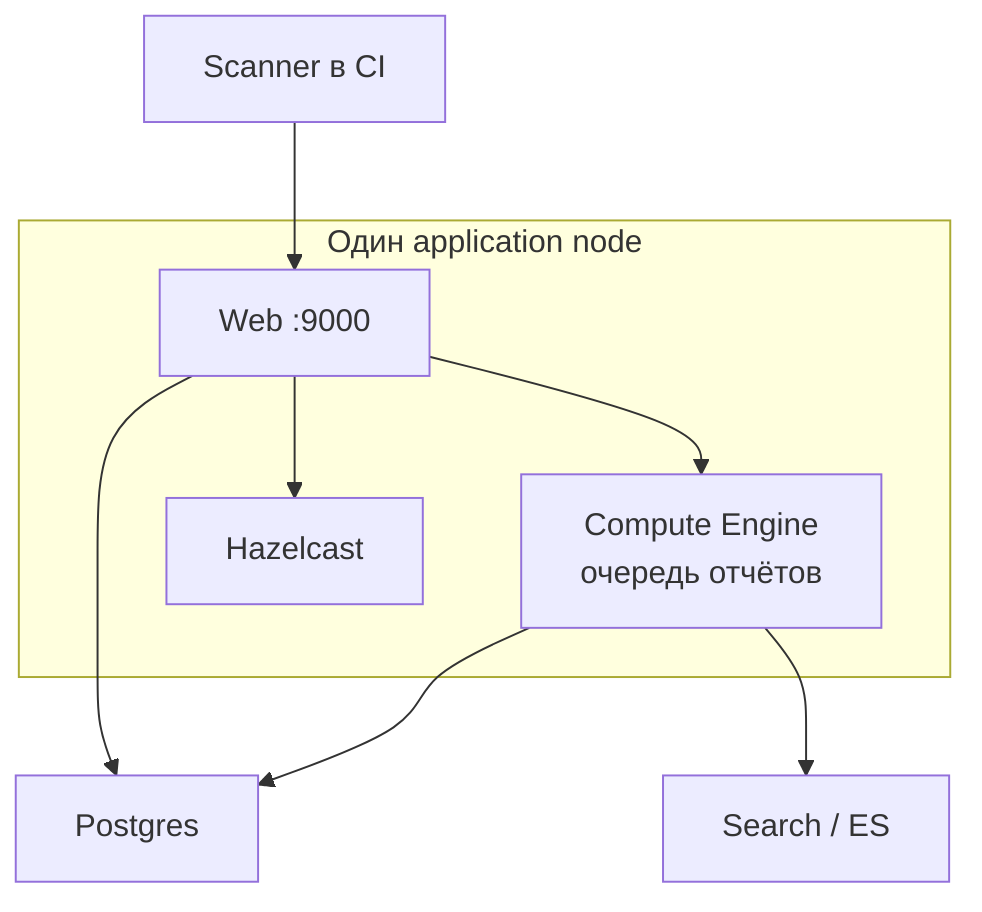
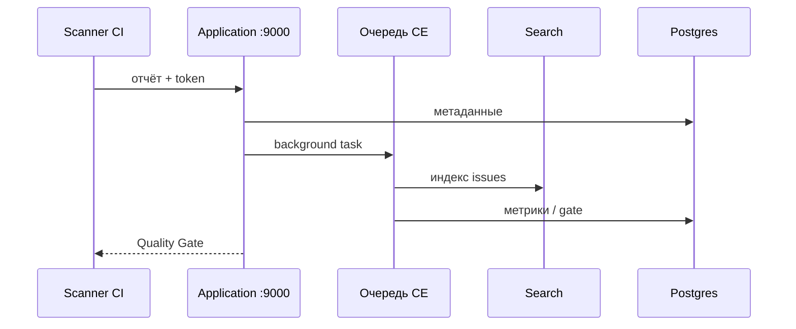
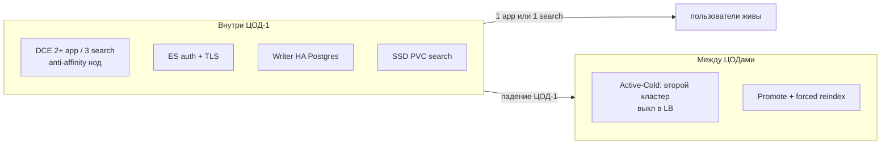
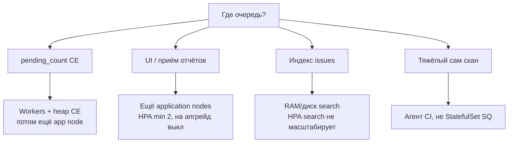
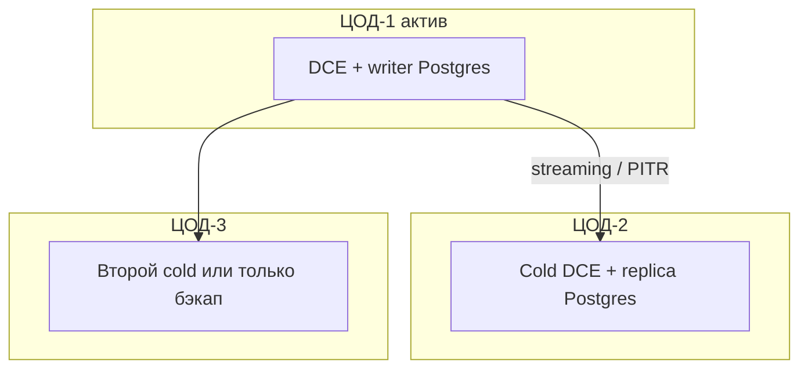

# SonarQube Server 2026.1.5 LTA — схемы устройства

Связанные документы: правила — `SonarQube.md`; установка — `SonarQube.install.md`.

C4 / «D4»: контекст → контейнеры → компоненты. Код сканера в CI не рисуем.

Допущения: stretch app/search на 2–3 ЦОДа **нет**; прод — **2026.1.5 LTA**, не Helm latest **2026.4.1**; HA приложения — только **DCE**; Community Build — **другая линейка**; нагрузка и LOC не замерены.

---

## 1. Контекст

SonarQube — **сервер отчётов SAST**, не сканер на ноде Kafka и не Falco.

Падение SQ **не должно** ронять шину. Политика CI (ждать / падать / обход gate) — ваша, её нет в продукте. Лицензия Server — **на инстанс / LOC**, не «терабайты озера».

---

## 2. Контейнеры (DCE в одном ЦОДе)

Community/Developer/Enterprise = **один** процесс. Второй под без DCE — второй **инстанс**, не кластер.

Порты DCE: **9000** UI/API, **9001** app→search, **9002** ES↔ES, **9003** Hazelcast. С 2026.1 Helm **не** кладёт Postgres в чарт. H2 в проде запрещена вендором.

Вендор: *one application node and one search node can be lost*. Два app в одной зоне = один ЦОД убивает оба.

---

## 3. Компоненты внутри инстанса

| Компонент | Для чего настраивать |
|---|---|
| CE workers | Enterprise+: параллель отчётов. На DCE число **глобальное**, на каждом app **повторяется** |
| ES диск | SSD, не NFS; watermark ~90–95% → индекс read-only. Дефолт PVC чарта **5G** — не план |
| `vm.max_map_count` | ≥ **524288** на нодах search (дока 2026.1) |
| JWT | Одинаковый `jwtSecret` на всех app; sticky не нужен |

Плагины **не шарятся**: ставить на все app; выкат = простой **всего** кластера.

---

## 4. Поток: скан → Quality Gate

После failover K8s вендор требует **forced ES reindex**. UI может встать, Postgres жив — индекс отстраивают заново.

---

## 5. Что настраивать: отказоустойчивость

| Ручка | Если забыть |
|---|---|
| Ключ DCE | Community/EE «в трёх ЦОДах» ≠ HA приложения |
| Pin **2026.1.5** | Чарт 2026.4.1 поставит Latest |
| Не ходить в read-only replica | Вендор: *does not support* Active/Active на RO БД |
| Свои пароли | `admin`/`admin` и Helm `AdminAdmin_12$` публичны |

Без DCE честный прод приложения — один узел + HA Postgres + холодный DR.

---

## 6. Что настраивать: масштабируемость

LOC и таблицы 10M/50M вендора — единица пересчёта, не смета. Search HPA **нет**.

---

## 7. Прод: 2 или 3 ЦОДа без stretch

Не класть search «по одному на ЦОД» без замера 9001–9003. Три полноценных инстанса = тройной LOC и три Quality Gate.

**Сильное:** ES и JDBC локальные. **Слабое:** падение ЦОД-1 = нет SQ, пока DR; RTO включает reindex (минут в цитате вендора нет).

---

## 8. Безопасность (ручки на той же схеме)

Force authentication оставить. Переименовать `sonar-administrators` **до** синхронизации групп с IdP. 9001–9003 не с мира. Сканер — `sonar.token`, не пароль в Git. ArgoCD вендор помечает как *not currently fully supported*.

Источники: `SonarQube.md`. Порога RTT у вендора **нет**.
