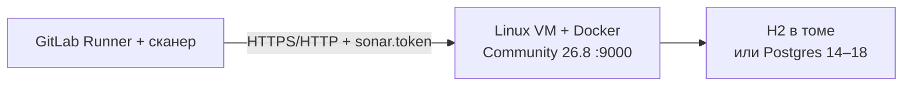

# SonarQube Server 2026.1.5 LTA — установка (учебный контур)

SonarQube — сервер отчётов **SAST**: **сканер** (программа в CI) смотрит исходники в момент сборки и шлёт отчёт; сервер превращает его в замечания и **Quality Gate** (порог «можно сливать / нельзя»). Сервер сам репозиторий с диска разработчика не читает.

**Допущение:** закрытая сеть, одна Linux-машина, Docker. Учебный стенд — **SonarQube Community Build 26.8.0.126808**, образ `sonarqube:26.8.0.126808-community`. Это **другая линейка**, не Server **2026.1.5** LTA и не «бесплатный DCE». Экран Community с LTA 2026.1.5 не путать. Учебный запуск в прод не копировать.

Официальный путь учёбы: [Try out Community Build](https://docs.sonarsource.com/sonarqube-community-build/try-out-sonarqube.md) + [Docker Hub `sonarqube`](https://hub.docker.com/_/sonarqube/). **Docker** — программа, которая запускает **образ** (упакованная программа с зависимостями) как контейнер. Образ уже несёт JVM: JDK на хост для Docker-пути не ставят. Docker Engine **≥ 20.10**. Не `sonarqube:latest` и не `sonarqube:community` без номера сборки.

Elasticsearch **вшит в тот же процесс**. Отдельный Elasticsearch не ставим. **H2** (встроенная файловая БД) — дефолт образа, вендор разрешает для теста/пробы и **запрещает** в проде. PostgreSQL **14–18** UTF-8 — если стенд живёт дольше недели.

---

## Куда ставить и сколько ресурсов (учебный контур)

**Куда.** Выделенная Linux-машина (x64 или AArch64) **рядом** с учебным Kubernetes, не под DCE и не «три search на ноутбуке». На этой VM — Docker. UI/API слушает **9000/TCP** (`sonar.web.port`). Привязка к `127.0.0.1`: с мира порт не виден. Каталог данных Elasticsearch — **локальный диск**, не NFS/SMB/NAS.



**Сколько.** «Чтобы процесс поднялся» отдельной цифры у вендора нет. Стартовая точка small-scale (Community / до ~1 млн LOC):

| Зачем | CPU | RAM | Диск | Откуда |
|---|---|---|---|---|
| Small-scale, старт новой установки | **2 ядра**, 64-bit | **4 ГБ** | **30 ГБ**, всегда **≥ 10%** свободно | [Host requirements Community](https://docs.sonarsource.com/sonarqube-community-build/server-installation/server-host-requirements.md) |

Цифры — справка вендора, не смета вашей нагрузки: LOC платформы не заданы. Референс «до 10 млн LOC» (хост 4 vCPU / 8 ГБ + отдельный Postgres) — другая страница, не этот стенд.

**Сильная сторона:** один контейнер, официальный Try-out. **Слабая:** падение VM = нет UI и нет приёма отчётов; один процесс ≠ кластер.

**Критично:** **9000** в интернет не публиковать. Не `latest`. Community без ключа DCE кластером не станет. `admin`/`admin` — только закрытый стенд.

---

## Установка для новичка

Команды — **на Linux-машине стенда**, не в PowerShell. Страницы шагов: [Try out](https://docs.sonarsource.com/sonarqube-community-build/try-out-sonarqube.md), [Linux / Elasticsearch](https://docs.sonarsource.com/sonarqube-community-build/server-installation/pre-installation/linux.md), [Docker Hub](https://hub.docker.com/_/sonarqube/).

### Что должно быть до установки

**Есть:**

- Linux x64 или AArch64, закрытая сеть (VPN / jump-хост)
- Docker Engine ≥ 20.10; пользователь в группе `docker` или root
- свободен порт **9000** на localhost
- локальный диск под том `/opt/sonarqube/data` (не NFS)

**Нет** (и не должно появиться на этой VM):

- отдельный Elasticsearch / OpenSearch «для SonarQube»
- публикация **9000** в интернет
- `sonarqube:latest`, образ DCE без ключа
- пароль `admin` и токен сканера в git
- H2, если стенд заведомо живёт месяцами — сразу Postgres (этап 5)

### Этап 1. Проверка машины и Docker

**Что делаем:** убеждаемся, что архитектура 64-bit, хватает места, Docker жив.

```bash
uname -m
nproc
free -h
df -h
docker version
```

Успех: `x86_64` или `aarch64`; свободно с запасом под 30 ГБ и 10%; `docker version` без ошибки, Engine ≥ 20.10.

### Этап 2. Ядро под вшитый Elasticsearch

**Что делаем:** на **хосте** (для Docker те же sysctl попадают в контейнер) выставляем лимиты вендора. Не путать со старым **262144**.

```bash
sysctl vm.max_map_count
sysctl fs.file-max
```

Если меньше порога — как root, на текущую сессию:

```bash
sysctl -w vm.max_map_count=524288
sysctl -w fs.file-max=131072
ulimit -n 131072
ulimit -u 8192
```

Чтобы пережило перезагрузку — в `/etc/sysctl.d/99-sonarqube.conf`:

```
vm.max_map_count=524288
fs.file-max=131072
```

затем `sysctl --system`.

Успех: `sysctl vm.max_map_count` → **≥ 524288**; `fs.file-max` → **≥ 131072**. Seccomp на ядре включён (`grep SECCOMP /boot/config-$(uname -r)` — `CONFIG_SECCOMP=y`). `/tmp` у контейнера доступен на запись (дефолтный `docker run` так и есть; `read_only: true` на этом стенде не включаем).

### Этап 3. Запуск Community 26.8.0.126808

**Что делаем:** поднимаем один контейнер. Порт только на loopback. Тома — данные (H2 + индекс ES), логи, плагины. Тег с [загрузок](https://www.sonarsource.com/products/sonarqube/downloads/) / [Docker Hub tags](https://hub.docker.com/_/sonarqube/tags), не `latest`.

```bash
docker run -d --name sq-dev \
  -p 127.0.0.1:9000:9000 \
  -v sq-dev-data:/opt/sonarqube/data \
  -v sq-dev-logs:/opt/sonarqube/logs \
  -v sq-dev-extensions:/opt/sonarqube/extensions \
  sonarqube:26.8.0.126808-community
```

Успех: `docker ps` — `sq-dev` в статусе `Up`; `docker inspect --format '{{.Config.Image}}' sq-dev` → `sonarqube:26.8.0.126808-community`.

Если Elasticsearch ругается на bootstrap checks — сначала добейте этап 2. Флаг Try-out `SONAR_ES_BOOTSTRAP_CHECKS_DISABLE=true` маскирует проверку ядра: для одноразовой пробы допустим, как постоянная привычка стенда — нет.

### Этап 4. Дождаться «operational»

**Что делаем:** первый старт занимает минуты (точного таймаута у вендора нет). Смотрим лог, затем HTTP.

```bash
docker logs -f sq-dev
```

Успех в логе: строка **`SonarQube is operational`**. Затем:

```bash
curl -sI http://127.0.0.1:9000/ | head -n 1
```

Успех: **HTTP 200**. Страница входа открывается с этой машины. Циклический Restart — смотреть `docker logs sq-dev`: чаще `vm.max_map_count` или занят 9000.

### Этап 5. PostgreSQL — только если стенд не однодневный

**Что делаем:** H2 не умеет нормальный бэкап/HA (формулировка вендора). Для стенда дольше недели — пустая БД PostgreSQL **14–18**, charset **UTF-8**, пользователь с правом создавать объекты. JDBC задаётся переменными образа. Пароль — свой, не из примера.

На уже существующем Postgres (не в этом контейнере):

```sql
CREATE USER mySonarUser WITH ENCRYPTED PASSWORD 'свой-пароль';
CREATE DATABASE sonarqube WITH OWNER mySonarUser ENCODING 'UTF8';
```

Контейнер пересоздать **с тем же томом data нельзя вслепую** при смене движка БД — для перехода с H2 проще новый том:

```bash
docker stop sq-dev && docker rm sq-dev
docker run -d --name sq-dev \
  -p 127.0.0.1:9000:9000 \
  -e SONAR_JDBC_URL=jdbc:postgresql://<хост-postgres>:5432/sonarqube \
  -e SONAR_JDBC_USERNAME=mySonarUser \
  -e SONAR_JDBC_PASSWORD='свой-пароль' \
  -v sq-dev-pg-data:/opt/sonarqube/data \
  -v sq-dev-logs:/opt/sonarqube/logs \
  -v sq-dev-extensions:/opt/sonarqube/extensions \
  sonarqube:26.8.0.126808-community
```

Успех: снова `SonarQube is operational`; в логе нет ошибки JDBC. Пароль JDBC не в git и не в истории чата как «боевой». Два процесса SonarQube на **одну** схему БД вендор запрещает — будет порча данных.

**Чего этот стенд не доказывает:** отказ зала, DCE 2+3, выборы лидера (их в Community нет), очередь Background Tasks под пачку PR, анализ веток/MR (это **Developer+**; Community — **только main**), JDBC через три площадки, HA Postgres, нагрузку в LOC.

---

## Первый запуск — URL, порт, учётка, смена пароля

**URL:** `http://127.0.0.1:9000/` — порт контейнера **9000**, с хоста только loopback. Открывать с самой машины стенда / jump-хоста, не из интернета.

Страницы: [Try out Community](https://docs.sonarsource.com/sonarqube-community-build/try-out-sonarqube.md) (то же для Server 2026.1: [Try out Server](https://docs.sonarsource.com/sonarqube-server/2026.1/try-out-sonarqube.md)).

**Учётка из коробки** (сверка для Community 26.8 и для линейки Server 2026.1):

| Поле | Значение |
|---|---|
| Логин | `admin` |
| Пароль | `admin` |

Продукт **сразу** просит сменить пароль. Новый — только закрытый стенд, вне git (сейф / Vault). В прод `admin`/`admin` не переносить.

**Force user authentication** по умолчанию **включён** — так и оставить. Выключение открывает куски API анонимно (`api/users/search`, `api/system/status` и др.).

Проверка «стенд живой»: вошли, пароль сменён, Administration → About / System — линейка **Community 26.8.x**, не Latest Server 2026.4 и не «как будто LTA 2026.1.5».

---

## Подключение к своей системе

Клиент — **сканер в GitLab CI**, не процесс на ноде Kafka. Нужен Runner с **Docker executor**. Протокол: HTTP(S) на URL сервера, порт **9000** (на стенде `http://127.0.0.1:9000` только если Runner на **той же** машине; иначе URL, который Runner реально резолвит, всё ещё не с мира).

Падение SonarQube **не должно** ронять Kafka и Camunda. Политика CI при недоступном сервере или красном Quality Gate (ждать / падать / идти без порога) — ваша, её нет в продукте.

### Секреты (не в git)

| Секрет | Где живёт | Куда не класть |
|---|---|---|
| Пароль `admin` после смены | сейф / Vault | git, образ, `.gitlab-ci.yml` |
| `SONAR_TOKEN` | CI/CD variable GitLab, **masked** | git, `settings.xml`, чат |
| `SONAR_HOST_URL` | CI/CD variable | пароль сюда не кладут |
| `SONAR_JDBC_PASSWORD` (если этап 5) | env контейнера / Secret | git |

Токен: My Account → Security (или токен проекта). Нужно право **Execute Analysis**. В сканере — `sonar.token` / `$SONAR_TOKEN`, не логин-пароль (`sonar.login`/`sonar.password` устарели).

### Job в `.gitlab-ci.yml`

Community **не** анализирует несколько веток — только **main**. Пример вендора (Maven); `GIT_DEPTH: "0"` обязателен, иначе «Missing blame information»:

```yaml
sonarqube-check:
  image: maven:3.9.3-eclipse-temurin-17
  variables:
    SONAR_USER_HOME: "${CI_PROJECT_DIR}/.sonar"
    GIT_DEPTH: "0"
  cache:
    key: "${CI_JOB_NAME}"
    paths:
      - .sonar/cache
  script:
    - mvn org.sonarsource.scanner.maven:sonar-maven-plugin:sonar
  allow_failure: true
  rules:
    - if: $CI_COMMIT_REF_NAME == "main"
```

Переменные GitLab: `SONAR_TOKEN`, `SONAR_HOST_URL`. В примере вендора CLI-образ — `sonarsource/sonar-scanner-cli:latest`; **пина тега сканера в этой карточке нет** — в своём registry поставьте конкретный тег, не копируйте `latest` в привычку.

`sonar.qualitygate.wait=true` заставляет job ждать порог (дефолт таймаута **300 с**) и краснеть вместе с Quality Gate. На первом учебном прогоне удобнее **без** wait: сначала увидеть задачу.

Успех: Administration → Projects → **Background Tasks** = **SUCCESS**; issues видны в проекте. Без токена сканер получает отказ.

### Чем продукт не является

| Сосед | Чем отличается |
|---|---|
| GitLab SAST | Другой движок; может дополнять, это не этот сервер |
| Falco / Wazuh / WAF | Runtime / SIEM / вход HTTP, не дерево исходников в пайплайне |
| Kafka / Camunda | Не шина и не BPM; их репозитории — **проекты** в SonarQube |
| Озеро / SoT | Не анализирует терабайты клиентских данных |
| DCE / кластер приложения | Community — один процесс. Второй контейнер на ту же БД = порча схемы |

На учебном стенде прямой заход на `:9000` с jump-хоста нормален. Сканер в git с паролем `admin` — дыра даже на стенде, если до порта есть сеть кроме вашей.

---

## Ссылки на материал

| Факт | URL |
|---|---|
| Community **26.8.0.126808**, LTA **2026.1.5** на загрузках | https://www.sonarsource.com/products/sonarqube/downloads/ |
| Try-out Community: Docker, `:9000`, `admin`/`admin`, смена пароля | https://docs.sonarsource.com/sonarqube-community-build/try-out-sonarqube.md |
| Try-out Server 2026.1: те же `admin`/`admin` и `:9000` | https://docs.sonarsource.com/sonarqube-server/2026.1/try-out-sonarqube.md |
| Образ, порт 9000, H2 не прод, тома, `vm.max_map_count=524288` на хосте Docker | https://hub.docker.com/_/sonarqube/ |
| Тег `26.8.0.126808-community` | https://hub.docker.com/_/sonarqube/tags |
| Docker Engine ≥ 20.10, UI `http://localhost:9000`, `admin`/`admin` | https://docs.sonarsource.com/sonarqube-community-build/server-installation/from-docker-image/installation-overview.md |
| `docker run`, `SONAR_JDBC_*`, тома, порт 9000 | https://docs.sonarsource.com/sonarqube-server/2026.1/server-installation/from-docker-image/set-up-and-start-container.md |
| `vm.max_map_count ≥ 524288`, `fs.file-max ≥ 131072`, nofile/nproc, seccomp, `/tmp` writable | https://docs.sonarsource.com/sonarqube-community-build/server-installation/pre-installation/linux.md |
| То же для Server 2026.1 | https://docs.sonarsource.com/sonarqube-server/2026.1/server-installation/pre-installation/linux.md |
| Small-scale: 2 ядра / 4 ГБ / 30 ГБ, 10% свободно, не NFS | https://docs.sonarsource.com/sonarqube-community-build/server-installation/server-host-requirements.md |
| H2 только тест; Postgres **14–18** UTF-8 | https://docs.sonarsource.com/sonarqube-server/2026.1/server-installation/installing-the-database.md |
| GitLab CI: `SONAR_TOKEN`, `SONAR_HOST_URL`, Docker executor, только **main** в Community | https://docs.sonarsource.com/sonarqube-community-build/devops-platform-integration/gitlab-integration/adding-analysis-to-gitlab-ci-cd.md |
| Токен = `sonar.token` / `SONAR_TOKEN`, не пароль | https://docs.sonarsource.com/sonarqube-server/2026.1/user-guide/managing-tokens.md |
| Force authentication включён по умолчанию | https://docs.sonarsource.com/sonarqube-server/2026.1/instance-administration/security/user-accounts.md |
| Документация LTA Server | https://docs.sonarsource.com/sonarqube-server/2026.1/ |
| Helm (в этот стенд не входит; чарт Latest ≠ LTA) | https://artifacthub.io/packages/helm/sonarqube/sonarqube |
| Зачем продукт, порты, железо | `SonarQube.md` |
| Словарь | `SonarQube.info.md` |
| Схема стыковки с платформой | `SonarQube.shema.md` |
| Роль консультанта | `SonarQube.consultant.md` |
| CI платформы | `GitLab CI.install.md` |
| Postgres платформы | `PostgreSQL.install.md` |

**В доке вендора нет (и здесь не выдумано):** порог RTT между залами; «N ядер / гигабайт на ваши репозитории»; минимальный RAM «чтобы контейнер просто встал» ниже small-scale 4 ГБ; пин тега `sonar-scanner-cli` (в примере вендора — `latest`); Community как HA приложения; read-only реплика Postgres для живого SonarQube.
