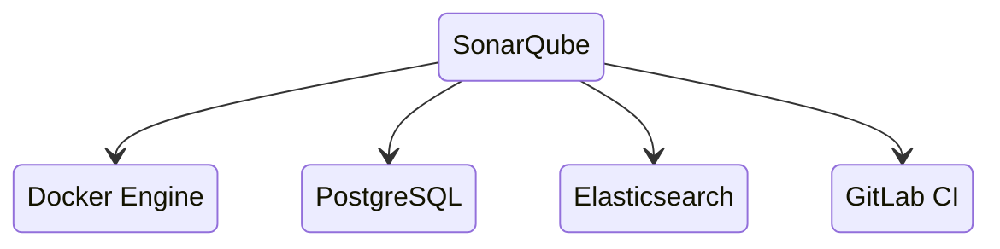
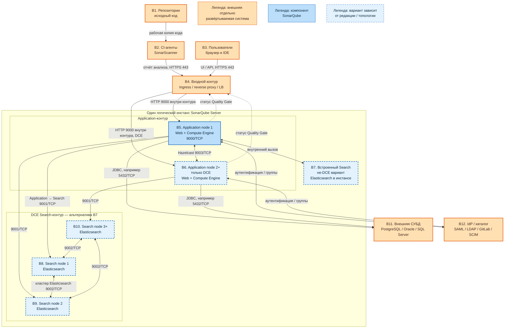

# SonarQube Server 2026.1.5 LTA — назначение и архитектура

SonarQube — сервер отчётов статического анализа кода. Сканер в CI анализирует исходный код во время сборки и передаёт результат серверу; сервер хранит результаты, показывает замечания и метрики и вычисляет порог качества для решения о слиянии изменений.

Для коммерческого боевого контура рассматривается **SonarQube Server 2026.1.5 LTA**. **Community Build 26.8.x** — отдельная бесплатная линейка, а не бесплатная редакция Server LTA. Штатная отказоустойчивость самого приложения и кластер из нескольких узлов доступны только в **Data Center Edition (DCE)**.

SonarQube не является средством анализа работающих контейнеров, SIEM, WAF или системой исполнения бизнес-процессов. Он проверяет код проектов Kafka, Camunda, озера данных и интеграционного API, но не становится runtime-зависимостью этих систем.

## Назначение системы

SonarQube нужен, чтобы до выкладки ответить, соответствует ли коммит, ветка или merge request принятым правилам качества и статического анализа.

Система:

- принимает результаты анализа исходного кода от сканеров в CI;
- хранит замечания, метрики, настройки, пользователей и историю анализов;
- применяет профили правил и вычисляет Quality Gate;
- показывает результаты людям через веб-интерфейс и системам через REST API;
- поддерживает централизованное управление качеством нескольких репозиториев.

Сканер запускается на агенте CI и читает рабочую копию репозитория. Сервер SonarQube сам не читает диск разработчика и не забирает исходный код из репозитория как фоновый сервис.

Недоступность SonarQube не должна останавливать Kafka, Camunda и другие рабочие приложения. Влияние на поставку определяется политикой CI: ждать восстановления, завершать pipeline ошибкой или разрешать отдельно согласованный обход Quality Gate.

## Перечень функций

Набор функций зависит от редакции.

1. **Приём результатов анализа.** SonarScanner передаёт отчёт через HTTP(S) в Web-процесс. Для аутентификации используется `sonar.token`, а не пароль пользователя, сохранённый в репозитории.
2. **Фоновая обработка.** Compute Engine разбирает принятые отчёты через очередь Background Tasks. Несколько параллельных workers настраиваются в Enterprise Edition и DCE; в DCE их количество применяется к каждой application-ноде.
3. **Поиск по результатам.** Elasticsearch индексирует issues и данные, необходимые интерфейсу поиска. В Community Build, Developer Edition и Enterprise Edition поиск встроен в единственный инстанс. В DCE он вынесен на отдельные search-ноды.
4. **Контроль Quality Gate.** Сервер вычисляет итог по заданным условиям, например по новым багам, уязвимостям, покрытию и дублированию. Анализ веток и pull/merge requests доступен в Developer Edition и выше.
5. **Хранение состояния.** Внешняя поддерживаемая СУБД хранит настройки, пользователей, историю анализов и лицензионное состояние. Поисковый индекс является производным и может быть перестроен из данных сервера и базы.
6. **Кластеризация приложения.** Только DCE объединяет несколько application-нод и отдельные search-ноды в один кластер SonarQube. Hazelcast встроен в application-ноды и синхронизирует их; отдельный сервер Hazelcast не нужен.
7. **Интеграция с системой идентификации.** В зависимости от редакции и провайдера поддерживаются SAML, LDAP, GitLab, автоматическое создание пользователя при первом входе и SCIM-синхронизация.
8. **Интеграция с CI и системой контроля версий.** SonarQube возвращает статус анализа и Quality Gate, который pipeline или проверка merge request может использовать как условие продолжения.
9. **Масштабирование.** Агенты со сканерами масштабируются в CI. В DCE можно горизонтально масштабировать application-ноды, в том числе HPA в Kubernetes; search-ноды масштабируются и изменяются отдельно.

## Архитектурные варианты по редакциям и топологиям

### Вариант A: один инстанс

Используется Community Build, Developer Edition или Enterprise Edition. Один процесс SonarQube содержит Web, Compute Engine и встроенный Elasticsearch. Внешними остаются CI со сканером, входной прокси или Ingress, система идентификации и боевая база данных.

Второй независимо запущенный процесс такой редакции не становится частью кластера: это другой инстанс со своей лицензией и состоянием. Отказ единственного процесса делает UI, API и приём отчётов недоступными, даже если база продолжает работать.

### Вариант B: кластер DCE

Один логический инстанс DCE состоит минимум из двух application-нод и обычно трёх search-нод. Входной балансировщик распределяет запросы между application-нодами; sticky sessions не требуются. Application-ноды взаимодействуют между собой через встроенный Hazelcast, а search-ноды образуют отдельный кластер Elasticsearch.

Эта топология обеспечивает штатную избыточность внутри поддерживаемой топологии DCE. Она не означает автоматическую возможность растянуть живой кластер между независимыми дата-центрами с неизвестной задержкой.

### Вариант C: Active-Cold для аварийного восстановления

Основной кластер обслуживает запросы, а второй кластер SonarQube остаётся холодным. Состояние базы реплицируется средствами СУБД; после переключения холодный кластер подключается к доступному writer endpoint, а поисковый индекс принудительно перестраивается. Это аварийное восстановление, а не два одновременно активных инстанса.

Живой SonarQube не использует read-only реплику базы как альтернативный сервер записи. Лицензионные условия для второго инстанса необходимо учитывать отдельно.

## Основные элементы системы и зависимости

SonarQube — одно серверное ПО из нескольких логических процессов. На схеме сплошные голубые блоки входят в SonarQube, голубые пунктирные блоки показывают взаимоисключающие варианты внутреннего поиска, а оранжевые блоки — отдельно развёртываемые внешние системы.

### Схема инстансов и потоков

### Описание блоков

#### B1. Репозитории

- **Сущность:** хранилища исходного кода и конфигурации проектов.
- **Технологии и варианты:** GitLab, GitHub, Bitbucket и другие Git-совместимые системы; репозитории приложений, Helm-чартов, SQL и схем процессов.
- **Назначение:** предоставляют рабочую копию кода заданию CI.
- **Размещение:** отдельная внешняя система; не входит в SonarQube.

#### B2. CI-агенты и SonarScanner

- **Сущность:** исполняемые задания pipeline и запускаемый ими клиент анализа.
- **Технологии и варианты:** SonarScanner CLI, Maven, Gradle, .NET, npm и интеграции CI.
- **Назначение:** анализируют рабочую копию кода и передают отчёт серверу с токеном `sonar.token`.
- **Размещение:** отдельная внешняя система; сканер работает на агенте CI, а не на application- или search-ноде SonarQube.

#### B3. Пользователи

- **Сущность:** разработчики, специалисты качества и администраторы.
- **Технологии и варианты:** браузер для UI, IDE-плагин или API-клиент.
- **Назначение:** просматривают issues, метрики и Quality Gate, управляют доступными им настройками.
- **Размещение:** внешние клиенты; не входят в SonarQube.

#### B4. Входной контур

- **Сущность:** единая точка сетевого входа и распределения запросов.
- **Технологии и варианты:** Kubernetes Ingress, reverse proxy, API gateway или внешний load balancer.
- **Назначение:** завершает HTTPS, публикует адрес SonarQube и в DCE распределяет запросы между application-нодами по результатам health check.
- **Размещение:** отдельная внешняя система. Внутренний Web-порт SonarQube — 9000/TCP; клиентский HTTPS обычно публикуется на 443/TCP.

#### B5. Application node 1

- **Сущность:** обязательный серверный узел SonarQube с процессами Web и Compute Engine.
- **Технологии и варианты:** контейнер, pod Kubernetes или процесс ZIP-дистрибутива; присутствует во всех редакциях.
- **Назначение:** обслуживает UI и REST API, принимает отчёты и обрабатывает Background Tasks.
- **Размещение:** встроенный компонент SonarQube. В одноинстансной топологии это единственная application-нода.

#### B6. Application node 2+

- **Сущность:** дополнительные узлы Web и Compute Engine одного логического инстанса.
- **Технологии и варианты:** DCE; фиксированное количество реплик или HPA application-подов в Kubernetes.
- **Назначение:** даёт избыточность и увеличивает пропускную способность application-контура.
- **Размещение:** встроенный компонент SonarQube, но существует только в DCE. Между application-нодами работает встроенный Hazelcast на 9003/TCP.

#### B7. Встроенный Search

- **Сущность:** Elasticsearch внутри единственного инстанса SonarQube.
- **Технологии и варианты:** топология Community Build, Developer Edition и Enterprise Edition.
- **Назначение:** индексирует issues и обслуживает поиск для UI.
- **Размещение:** встроенный компонент, не отдельная внешняя система и не отдельный кластер. Этот блок используется вместо B8–B10.

#### B8. Search node 1

- **Сущность:** первый отдельный узел поискового кластера DCE.
- **Технологии и варианты:** Elasticsearch под управлением SonarQube; входит в типовую топологию из трёх search-нод.
- **Назначение:** хранит часть поискового индекса и его реплик, выполняет поисковые запросы application-нод.
- **Размещение:** встроенный компонент логического инстанса DCE, но отдельный процесс или pod; используется вместо B7.

#### B9. Search node 2

- **Сущность:** второй отдельный узел того же поискового кластера DCE.
- **Технологии и варианты:** Elasticsearch с той же конфигурацией роли и ресурсов, что и у остальных search-нод.
- **Назначение:** участвует в распределении индекса, репликации и обработке поиска, обеспечивая избыточность Search-контура.
- **Размещение:** встроенный компонент логического инстанса DCE, развёрнутый отдельным процессом или pod; не является внешним Elasticsearch.

#### B10. Search node 3+

- **Сущность:** третий и, в поддерживаемом варианте, последующие узлы поискового кластера DCE.
- **Технологии и варианты:** Elasticsearch; типовая DCE-топология содержит три search-ноды, а допустимое изменение количества определяется документацией DCE.
- **Назначение:** завершает типовую избыточную топологию Search-контура и участвует в хранении реплик и выполнении поиска.
- **Размещение:** встроенный компонент логического инстанса DCE, развёрнутый отдельным процессом или pod; B8–B10 вместе являются альтернативой B7.

#### B11. Внешняя СУБД

- **Сущность:** основное долговременное хранилище состояния SonarQube.
- **Технологии и варианты:** PostgreSQL 14–18, а также поддерживаемые Oracle или Microsoft SQL Server; конкретный JDBC-порт зависит от выбранной СУБД.
- **Назначение:** хранит пользователей, настройки, историю анализов и лицензионное состояние. Для PostgreSQL стандартный порт — 5432/TCP.
- **Размещение:** отдельная внешняя система со своей схемой доступности. SonarQube не кластеризует СУБД и не использует read-only реплику как writer.

#### B12. IdP или каталог

- **Сущность:** корпоративный источник идентичностей и групп.
- **Технологии и варианты:** SAML, LDAP, GitLab authentication и, для поддерживаемых редакций, SCIM.
- **Назначение:** аутентифицирует пользователей и при поддерживаемом режиме синхронизирует их членство в группах.
- **Размещение:** отдельная внешняя система. Конкретные протоколы и порты зависят от выбранного IdP и способа интеграции.

### Как читать схему

1. Начальная точка машинного потока — **B1**. CI получает рабочую копию репозитория, после чего **B2** запускает сканер. Сервер SonarQube не инициирует чтение B1.
2. Сканер передаёт результат не прямо на внутреннюю ноду, а через **B4**. Пользователи из **B3** используют тот же опубликованный HTTPS-адрес. Оранжевый цвет означает, что жизненный цикл, доступность и масштабирование этих блоков проектируются отдельно от SonarQube.
3. За B4 всегда есть **B5**. В не-DCE топологии на этом application-инстансе заканчивается горизонтальное масштабирование сервера. В DCE рядом работает **B6**, и балансировщик может направлять запросы на обе ноды без sticky sessions.
4. Пунктирные голубые блоки показывают выбор топологии. Для Community Build, Developer Edition и Enterprise Edition используется **B7**. Для DCE вместо B7 используются отдельные **B8–B10**. Одновременно считать B7 и B8–B10 частями одной топологии нельзя.
5. В DCE application-ноды синхронизируются по **9003/TCP**. Этот поток относится к Hazelcast и не должен быть доступен пользовательским клиентам.
6. Application-ноды обращаются к search-нодам по **9001/TCP**. Search-ноды обмениваются кластерными данными по **9002/TCP**. Порты 9001–9003 являются внутренними сетями кластера, а не альтернативными входами в UI.
7. **B11** связан только с application-контуром по JDBC. База — долговременный источник состояния, тогда как Elasticsearch хранит производный поисковый индекс. Поэтому восстановление базы и восстановление поискового индекса — разные операции.
8. **B12** участвует во входе пользователей и синхронизации групп, но не обрабатывает отчёты сканера. Сканер обычно аутентифицируется собственным токеном.
9. Пунктирные стрелки статуса Quality Gate показывают логический ответ серверной части через тот же входной контур. CI решает, как этот статус влияет на pipeline.
10. Для Active-Cold схема читается как два отдельных набора внутренних блоков SQ: только один набор активен, а переключение включает смену writer endpoint базы и последующую переиндексацию. Это не active-active связь между двумя схемами.

### Состав системы

| Элемент | Основная роль | Варианты масштабирования |
|---|---|---|
| **SonarScanner** | Анализ кода в CI и отправка отчёта | Больше параллельных агентов CI; не является частью StatefulSet SonarQube |
| **Application: Web + Compute Engine** | UI, API, приём и фоновая обработка отчётов | Один инстанс в Community Build / Developer / Enterprise; две и более ноды или HPA в DCE |
| **Search: Elasticsearch** | Индексация и поиск issues | Встроен в один инстанс не-DCE либо вынесен на отдельные search-ноды DCE |
| **Внешняя СУБД** | Пользователи, настройки, история и лицензионное состояние | Масштабируется и резервируется средствами выбранной СУБД, независимо от SonarQube |
| **Входной контур** | HTTPS-вход и балансировка application-нод | Масштабируется как отдельная платформенная система |
| **IdP / каталог** | Пользовательская аутентификация и группы | Масштабируется как отдельная корпоративная система |

### Возможности редакций, влияющие на архитектуру

| Возможность | Community Build | Developer | Enterprise | Data Center |
|---|---:|---:|---:|---:|
| Бесплатная отдельная линейка | да | нет | нет | нет |
| Анализ веток и pull/merge requests | нет | да | да | да |
| Несколько Compute Engine workers | нет | нет | да | да |
| Кластер application- и search-нод | нет | нет | нет | да |
| HPA application-нод в Kubernetes | нет | нет | нет | да |
| SCIM-синхронизация | нет | нет | да | да |

Без DCE устойчивость внешней базы не превращает единственный процесс SonarQube в отказоустойчивый кластер приложения. Холодный второй инстанс относится к восстановлению после аварии, а не к горизонтальному кластеру.

### Порты и сетевые потоки

| Порт | Поток | Назначение | Кому доступен |
|---|---|---|---|
| **443/TCP** | Клиенты и CI → входной контур | Публикуемый HTTPS для UI, REST API и отчётов сканера | Пользователям и доверенным CI-агентам |
| **9000/TCP** | Входной контур → Application | Внутренний UI и API SonarQube, параметр `sonar.web.port` | Входному прокси или балансировщику; не публиковать напрямую в интернет |
| **9001/TCP** | Application → Search | Вызовы выделенного Search в DCE | Только application- и search-нодам нужного инстанса |
| **9002/TCP** | Search ↔ Search | Кластерный обмен Elasticsearch в DCE | Только search-нодам нужного инстанса |
| **9003/TCP** | Application ↔ Application | Встроенная шина Hazelcast в DCE | Только application-нодам нужного инстанса |
| **5432/TCP** | Application → PostgreSQL | JDBC к PostgreSQL writer endpoint | Только application-нодам; для другой СУБД порт будет другим |

Порты 9001, 9002 и 9003 образуют три разные внутренние сети DCE: Application-to-Search, Search-to-Search и Application-to-Application. В одноинстансной топологии наружу обычно нужен только путь к 9000 через HTTPS-вход и JDBC-путь к базе; встроенный Elasticsearch не публикуется как самостоятельный сервис.

## Глоссарий

- **Active-Cold** — схема аварийного восстановления, в которой основной инстанс работает, а резервный запускается или активируется только после переключения.
- **Application-нода** — узел SonarQube с процессами Web и Compute Engine.
- **Background Tasks** — очередь фоновой обработки принятых отчётов анализа.
- **CI (Continuous Integration)** — система, которая автоматически собирает и проверяет изменения кода.
- **Compute Engine (CE)** — процесс SonarQube, который в фоне обрабатывает отчёты сканеров.
- **DCE (Data Center Edition)** — редакция SonarQube Server со штатным кластером application- и search-нод.
- **Elasticsearch** — встроенная в SonarQube поисковая технология, создающая индекс для поиска issues и данных интерфейса.
- **Failover** — переключение работы с отказавшего основного компонента на доступный резервный.
- **Git** — распределённая система управления версиями исходного кода.
- **Hazelcast** — встроенная технология обмена кластерным состоянием между application-нодами DCE.
- **Health check** — автоматическая проверка, по которой балансировщик определяет, можно ли направлять запросы на ноду.
- **HPA (Horizontal Pod Autoscaler)** — механизм Kubernetes, который изменяет количество pod по метрикам.
- **HTTP(S)** — протокол передачи веб-запросов; HTTPS означает защищённое TLS-соединение.
- **IdP (Identity Provider)** — внешняя система, которая подтверждает личность пользователя.
- **IDE** — среда разработки, в которой пользователь редактирует код и может видеть связанные результаты анализа.
- **Ingress** — объект и контроллер Kubernetes, публикующий HTTP(S)-сервисы за пределы кластера.
- **Инстанс** — одна логическая установка SonarQube со своей базой, конфигурацией и лицензией; в DCE один инстанс включает несколько нод.
- **Issue** — найденное анализом замечание: потенциальный дефект, уязвимость или проблема сопровождения.
- **JDBC** — интерфейс Java для подключения приложения к реляционной базе данных.
- **JIT provisioning** — создание локальной учётной записи при первом успешном входе через внешний IdP.
- **JWT-cookie** — подписанная cookie с данными пользовательской сессии; позволяет DCE обходиться без sticky sessions.
- **Kubernetes** — оркестратор контейнеров, управляющий pod, сетью и масштабированием.
- **LTA (Long-Term Active)** — линия SonarQube Server с более длительным окном сопровождения по сравнению с Latest.
- **LDAP** — протокол доступа к корпоративному каталогу пользователей и групп.
- **Load balancer (LB)** — балансировщик, распределяющий сетевые запросы между доступными application-нодами.
- **LOC (Lines of Code)** — объём анализируемого кода в строках, используемый в лицензировании коммерческих редакций.
- **Merge request / pull request** — запрос на включение изменений из одной ветки репозитория в другую.
- **Pipeline** — последовательность автоматических заданий CI.
- **Pod** — минимальная запускаемая единица Kubernetes, содержащая один или несколько контейнеров.
- **Quality Gate** — набор условий, который даёт итоговый статус прохождения или непрохождения анализа.
- **REST API** — программный HTTP-интерфейс SonarQube.
- **Reverse proxy** — промежуточный сервер, принимающий клиентский HTTP(S)-трафик и передающий его приложению.
- **SAML** — протокол федеративного входа через внешний IdP.
- **SCIM** — стандарт автоматической передачи пользователей и групп из IdP в приложение.
- **Search-нода** — отдельный процесс Elasticsearch в DCE, обслуживающий поисковый индекс.
- **SIEM** — система централизованного сбора и анализа событий информационной безопасности; SonarQube ею не является.
- **SonarScanner** — клиентская программа анализа, запускаемая рядом с кодом в CI и отправляющая результат серверу.
- **StatefulSet** — контроллер Kubernetes для pod со стабильной идентичностью и постоянными томами.
- **Sticky sessions** — режим балансировщика, закрепляющий пользовательскую сессию за одной серверной нодой; DCE его не требует.
- **TLS** — криптографическая защита сетевого соединения, используемая HTTPS.
- **Токен `sonar.token`** — секрет, которым сканер подтверждает право передать анализ.
- **WAF** — межсетевой экран для веб-приложений; SonarQube его не заменяет.
- **Web** — процесс SonarQube, который обслуживает UI и REST API.
- **Worker** — параллельный исполнитель задач Compute Engine.
- **Writer endpoint** — адрес базы данных, принимающий операции записи после возможного переключения её основного узла.
- **Переиндексация** — повторное построение поискового индекса Elasticsearch из сохранённого состояния.
- **Статический анализ** — проверка исходного кода без запуска приложения.

## Источники

- Документация SonarQube Server 2026.1: https://docs.sonarsource.com/sonarqube-server/2026.1/
- Редакции SonarQube Server: https://docs.sonarsource.com/sonarqube-server/2026.1/discovering/sonarqube-server-editions.md
- Топология DCE: https://docs.sonarsource.com/sonarqube-server/2026.1/server-installation/data-center-edition/dce-topology.md
- Требования и сети DCE: https://docs.sonarsource.com/sonarqube-server/2026.1/server-installation/data-center-edition/installation-requirements.md
- Правила сети и порты 9000–9003: https://docs.sonarsource.com/sonarqube-server/2026.1/server-installation/data-center-edition/network-security/network-rules.md
- Поддерживаемые базы данных: https://docs.sonarsource.com/sonarqube-server/2026.1/server-installation/installing-the-database.md
- Аварийное восстановление DCE: https://docs.sonarsource.com/sonarqube-server/2026.1/server-installation/data-center-edition/on-kubernetes-or-openshift/setting-up-disaster-recovery.md
- Автомасштабирование DCE: https://docs.sonarsource.com/sonarqube-server/2026.1/server-installation/data-center-edition/on-kubernetes-or-openshift/setting-up-autoscaling.md
- Аутентификация и внешние IdP: https://docs.sonarsource.com/sonarqube-server/2026.1/instance-administration/authentication/overview.md
