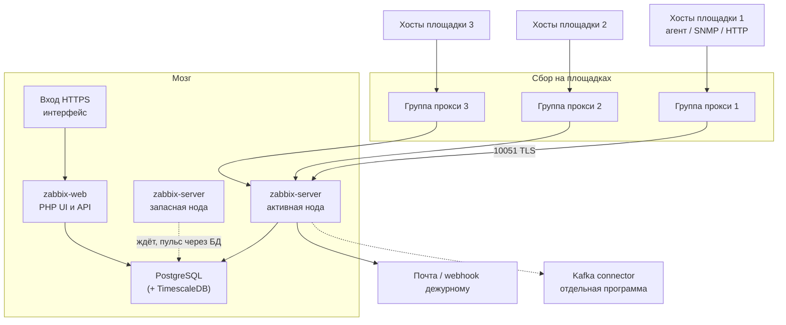

# Zabbix 7.0.30 LTS — развёртывание и настройка

Zabbix — система наблюдения: хосты, проверки, пороги «это плохо», эскалации. Этот документ про **свою установку** версии **7.0.30** (LTS, релиз 25 августа 2026). Это не Zabbix Cloud.

Полная поддержка линии **7.0 LTS**: до **30 июня 2027**; ограниченная — до **30 июня 2029**. В тот же день вышел **7.4.14** — текущая стандартная линия, не LTS. Линию **8.0 LTS** политика обещает, но на странице исходников на дату подготовки её **нет**. В бой берём **7.0.30**, не «вчерашний latest».

Документация: https://www.zabbix.com/documentation/7.0/en/manual/  
Образы (Docker Hub `zabbix/`): `zabbix-server-pgsql`, `zabbix-web-nginx-pgsql` (или Apache), `zabbix-proxy-sqlite3` / `zabbix-proxy-pgsql`, `zabbix-agent2`, `zabbix-java-gateway`, `zabbix-web-service`. Метка патча **7.0.30**, не `latest`.  
Compose: https://github.com/zabbix/zabbix-docker , ветка **7.0**.

На Kubernetes **первого** оператора «поставь весь Zabbix 7.0 в бой» у поставщика нет. Официальный Helm ставит **мониторинг Kubernetes из уже существующего** Zabbix, а не сам сервер. OpenShift Operator в старых мануалах — линии 5.0/6.0, для 7.0 не брать.

Этот текст — не набор команд «скопируй compose и запусти», а правила, без которых система не будет одновременно устойчивой к сбоям, масштабируемой и безопасной. Пошаговая установка — в `Zabbix.install.md`.

Zabbix **не** замена Prometheus, **не** SIEM (Wazuh), **не** склад логов (OpenSearch) и **не** шина событий.

---

## Назначение системы

Zabbix нужен, чтобы **видеть, что живы машины, порты и проверки**, и **донести проблему до дежурного**. Сервер считает пороги и пишет историю. Прокси собирает «на месте» и копит, если канал до сервера моргнул. Люди смотрят интерфейс в браузере.

Система **хранит метрики наблюдения**, не эталон клиентских карточек. Она **не** исполняет бизнес-процессы и **не** ходит в государственные сервисы за данными заявки. Может *проверить*, что интеграционное API живо, и *опционально* отдать события в Kafka отдельным коннектором.

Для кардинальности микросервисов и Kubernetes `/metrics` у вас уже есть Prometheus. Два полных контура «снимаем всё и орём обо всём» = двойные инциденты. Кто алертит диск, SNMP и «порт ведомства открыт» — решить **до** установки.

---

## Перечень функций

Что умеет self-hosted Zabbix 7.0:

1. **Снимать проверки** с хостов: агент, SNMP, ICMP, HTTP, JMX (через отдельный Java-шлюз), значения, которые присылают сами (`zabbix_sender`).
2. **Считать пороги** (триггеры) и заводить проблемы. Без правила «куда слать» проблема живёт только на экране.
3. **Эскалировать**: почта, webhook, скрипт.
4. **Хранить сырую историю** и почасовые сводки (минимум/максимум/среднее). Устаревшее вычищает housekeeper — процесс сервера, раз в час по умолчанию.
5. **Держать запасной сервер** (native HA): несколько процессов `zabbix_server` на **одной** базе. Живой сбор и пороги — только у **одной** активной ноды; остальные ждут.
6. **Собирать через прокси**: своя база у прокси, буфер, если сервер недоступен. Группа прокси (7.0+): сервер сам раскладывает хосты, если один прокси молчит.
7. **Автоматически заводить проверки** (обнаружение дисков, интерфейсов, подов) и вешать шаблоны.
8. **Шифровать** канал агент/прокси/сервер (PSK или сертификат) на тех же портах 10050/10051.
9. **Подтягивать секреты** из HashiCorp Vault (только чтение) или CyberArk.
10. **Отдавать значения и события наружу** по HTTP; для Kafka поставщик даёт отдельный коннектор (это не брокер).
11. **Рисовать PDF-отчёты** отдельным процессом (нужен браузер без окна).

Чего система **не** делает и часто путают: она не кластер «как три брокера Kafka» (активный сервер в каждый момент **один**), не кворум истории (история живёт в **PostgreSQL**), не озеро эталона, не SIEM, не ГОСТ-криптография. Официального оператора Kubernetes на весь сервер 7.0 нет. Elasticsearch как боевая история в документации — экспериментально, в этой схеме не кладём. Порога задержки сети между площадками в миллисекундах **нет**.

---

## Требования к развёртыванию

### Требования к ПО

| Что | Что ставить | Комментарий |
|---|---|---|
| **Формат поставки** | Пакеты Linux **или** официальные контейнеры | Образы `zabbix/…` с меткой **7.0.30**. Community Helm с витрин чартов — не сертификат поставщика на 7.0.30 |
| **Kubernetes** | Нет штатного установщика «весь сервер» | Образы есть. Официальный Helm — мониторинг Kubernetes **поверх уже живого** сервера. Боевой путь: ваши манифесты. Сервер HA — **не** Deployment с общим диском и двумя репликами без имён нод |
| **ОС сервера** | UNIX / Linux | **Windows как сервер Zabbix не заявлена.** Агенты — Linux и Windows (Agent 2: Windows 10 / Server 2016+) |
| **База сервера** | PostgreSQL **13–18** (18.x с 7.0.20) | Oracle с 7.0 **не рекомендуется**. MySQL не запрещён; в этом документе якорь — PostgreSQL |
| **Сжатие истории** | TimescaleDB Community Edition **2.13.0–2.29.X** (2.29.X — с 7.0.30) | Отдельная лицензия Timescale, не «просто расширение из Debian». На тесте достаточно чистого PostgreSQL |
| **База прокси** | SQLite3 **или** MySQL/PostgreSQL | **Нельзя** ту же базу, что у сервера. SQLite в памяти официально запрещён |
| **Интерфейс** | PHP **8.0–8.5** (8.5.x с 7.0.25), Nginx 1.20+ или Apache 2.4+ | Расширения pgsql, gd, bcmath, mbstring, xml; для SAML — php-openssl |
| **Часы** | NTP на **всех** компонентах | Поставщик называет это настоятельно рекомендованным. Без общего времени пороги и «пульс» HA живут в кривой вселенной |
| **Лицензия** | AGPLv3 с 7.0 | Юридический факт, не «опенсорс как Linux». Этот файл не заменяет заключение |

Лимит файлов и пул соединений базы — по нагрузке. Имена нод HA лучше фиксировать **DNS-именем**, не случайным именем пода.

### Требования к ресурсам

Цифр «сколько ядер на ваши терабайты озера» нет — нагрузки в исходном запросе не было. Ниже **примеры старта поставщика**, не смета закупки. Поставщик прямо: каждая установка уникальна, замер на стенде обязателен.

| Сценарий поставщика | «Метрик»* | CPU | RAM |
|---|---|---|---|
| **Small** | 1 000 | **2** | **8 ГиБ** |
| **Medium** | 10 000 | **4** | **16 ГиБ** |
| **Large** | 100 000 | **16** | **64 ГиБ** (базу лучше отдельно) |
| **Very large** | 1 000 000 | **32** | **96 ГиБ** (базу отдельно) |

\*В этой таблице 1 «метрика» = 1 проверка + 1 порог + 1 график. Примеры на Amazon EC2 — иллюстрация класса, не требование облака.

Диск считают от числа новых значений в секунду и срока хранения, не от объёма клиентских данных. Ориентир размера одного числа ~**90 байт** (в документации это оценка для MySQL; для PostgreSQL «может отличаться»):

```text
история  ≈ дни × (число проверок / интервал_сек) × 24 × 3600 × ~90
сводки   ≈ дни × (число проверок / 3600) × 24 × 3600 × ~90
события  ≈ дни × событий_в_сек × 24 × 3600 × (~330 + метки×100)
конфиг   ≈ обычно ≤ 10 МБ
```

Пример из документации: 3000 проверок раз в 60 с = 50 новых значений в секунду, 30 дней истории ≈ **10.9 ГиБ**. Текст/лог — ориентир **~500 байт** на значение, «точно предсказать нельзя».

Дополнительно:

- Для Large/Very large поставщик **настоятельно** рекомендует базу на **отдельных** машинах.
- Три копии сервера HA **не** утраивают диск истории: история одна, в PostgreSQL.
- Логи интеграций в проверке типа «текст» раздувают диск быстрее чисел.

---

## Основные элементы системы и зависимости

Это одно ПО из **нескольких процессов**. Ниже — те, что живут отдельными инстансами, и как они вызывают друг друга.

### Схема инстансов и потоков



Как читать схему:

1. Хосты отдают проверки **прокси своей площадки** (или агент сам приносит значения). Прокси копит у себя, если мозг недоступен.
2. Прокси стучатся на порт **10051** сервера. Запасная нода сервера **не слушает** этот порт — нельзя повесить TCP-балансировщик «на все поды сервера».
3. Активный сервер пишет пульс в PostgreSQL каждые **5 секунд**. Запасной смотрит на эту метку. Без живой базы выбрать лидера не из чего.
4. Интерфейс данных мониторинга не хранит — они в базе. Несколько копий PHP смотрят в ту же базу. При HA адрес сервера в конфиге PHP **не** зашивают: фронт читает активную ноду из таблицы.
5. Коннектор в Kafka — **другое** ПО. Java-шлюз (порт 10052) и сервис PDF (10053) на схеме не обязательны.

Рядом, но это уже другое ПО: PostgreSQL (отдельный документ), Vault, Prometheus, Wazuh, Kafka.

### Что входит в состав

| Роль | Зачем | Как масштабируется |
|---|---|---|
| **Server (активный)** | Пороги, история, эскалации, иногда съём без прокси | Вертикально: процессы опроса на **одной** активной ноде. Горизонталь съёма — **прокси**, не второй активный сервер |
| **Server (запасной)** | Перехватить роль | 1–2 штуки. Они **не** делят нагрузку съёма |
| **Frontend** | UI и API | Несколько копий за балансировщиком. Состояние — в базе |
| **PostgreSQL** | Конфиг, история, таблица нод HA | Это **другое ПО**. Native HA Zabbix базу **не** кластеризует |
| **Proxy** | Съём «на месте», буфер | По площадкам. Внутри площадки — группа |
| **Agent 2** | Метрики ОС и плагины | По числу машин. Не кластер |
| **Java gateway** | JMX | Обычно рядом с Java-парком |
| **Web service** | PDF | Без своего склада данных |
| **Kafka connector** | Выгрузка наружу | Отдельный бинарь |

### Официальные порты (менять можно, это контракт сети)

| Порт | Назначение |
|---|---|
| **10050/TCP** | Агент, когда сервер/прокси **спрашивает** |
| **10051/TCP** | Активный агент/прокси, приём значений, связь прокси↔сервер |
| **10052/TCP** | Java-шлюз, JMX |
| **10053/TCP** | PDF-отчёты |
| **80 / 443** | Интерфейс и API |

Шифрование TLS **не** открывает новый порт: тот же 10050/10051 принимает и открытый текст, и TLS. Файрвол режет по адресам и политике «что принимаем», не «отдельным TLS-портом».

### Зависимости окружения

- Сеть: сервер → база; прокси → сервер (или наоборот, если прокси пассивный); агенты — по выбранной модели.
- В Kubernetes: диск ReadWriteOnce под PostgreSQL (не общий NFS на два главных); стабильные DNS-имена для нод HA; сетевая политика на 10051/10050/443.
- Канал алертов: почта/webhook. Интерфейс без правила «куда слать» — музей порогов.
- PKI или общий секрет, если включаете TLS (в бою включать).

---

## Краткие вводные

### Как устроена отказоустойчивость

Это **не один механизм**. Путать native HA сервера с HA базы и с группой прокси — главная ошибка.

**1) Сервер (native HA)**

Несколько `zabbix_server` + **одна** база. Активный пишет пульс каждые **5 секунд**.

| Что падает | Что происходит |
|---|---|
| Активный корректно остановился | Другая нода поднимается **примерно за 5 с** |
| Активный исчез (kill, сеть, площадка) | Запасной ждёт **задержку переключения + 5 с** (заводская задержка = **1 мин**, диапазон 10 с – 15 мин) |
| Нет ни одной запасной | Переключать некуда. Это одиночка с красивым именем |
| Связь активного с базой дольше, чем задержка минус 5 с | Активный **обязан** бросить работу. Мозг без базы не живёт |
| База мертва | Пульс не пишется. Native HA **не из чего** выбрать лидера. Прокси могут ещё копить |

Поставщик: решение включается явно, *умеет работать across sites*, *не предъявляет особых требований к базам, которые Zabbix знает*. Перевод: **сервер** умеет разъехаться по площадкам; **базу** обеспечиваете вы.

Запасной **не слушает** 10051. Прокси и агенты получают **список имён нод**.

**2) База**

Падение PostgreSQL = нет интерфейса, нет новой истории на сервере, нет выбора HA. Прокси с буфером «на сколько часов копить» продолжают копить. Это **деградация**, не «Zabbix пережил площадку». Реплика PostgreSQL — отдельный контур. Цифр «синхронная копия при вашей задержке сети» **нет**.

**3) Прокси и группа**

Обрыв площадка↔мозг: данные в буфере прокси, если диск и часы посчитаны. Упал один прокси группы — хосты раскидывают. Агент 7.0+ в режиме «сам приносит» должен достучаться **до всех** членов группы. Прокси **не** считает глобальные пороги и не шлёт ваши эскалации.

**4) Интерфейс**

Падение UI ≠ падение сбора. Один под интерфейса — точка отказа **просмотра**. Сессии PHP по умолчанию локальные: без прилипания на балансировщике дежурный будет «вылогиниваться».

**5) Агенты**

Упал агент = слепой хост. Упал Java-шлюз = слепой JMX, не весь Zabbix.

### Как устроено масштабирование

Четыре оси (их нельзя путать):

1. **Меньше новых значений в секунду** — главный рычаг. Реже интервал, не плодить обнаружение «по каждому поду каждую метрику как в Prometheus без фильтра».
2. **Вертикаль активного сервера** — больше процессов опроса, база на отдельных машинах.
3. **Прокси** — разрезать парк по площадкам и по типу съёма.
4. **База** — TimescaleDB Community: партиции и сжатие. Housekeeper тогда **удаляет партиции**, если включены переопределение срока истории **и** внутреннее вычищение. Иначе партиции копятся.

Горизонтально растёт съём (прокси). Второй активный сервер нагрузку **не** делит.

### Безопасность самого Zabbix

Компрометация Super Admin = карта инфраструктуры, **глобальные скрипты** на сервере, макросы (пароли SNMP, community). Это не «просто графики».

- Первый вход: пользователь **`Admin`**, пароль **`zabbix`**. Сменить **сразу**.
- После 5 неудачных логинов интерфейс **молчит 30 секунд** — грубая защита, не WAF.
- Пароль: минимум 8 символов, обрезка после 72; сложность включается отдельно.
- TLS 1.2/1.3. Имя PSK — не секрет (его шлют открытым текстом). LibreSSL для Agent 2 **не** поддерживается.
- Агент на той же машине, что сервер, — **другим** UNIX-пользователем: иначе читает пароль базы из конфига сервера.
- Глобальные скрипты: выключать, если не нужны. На прокси удалённые команды по умолчанию выкл. На агенте `system.run` по умолчанию выкл.
- HTTP-аутентификацию фронта можно выключить отдельным флагом.
- Между сервером и прокси при секретах из Vault **нужен TLS**.
- «Поднять compose и выдать 80 / Admin / zabbix в сеть» — новая поверхность атаки, не мониторинг.

---

## Допущения

Ниже то, чего не было в исходном запросе, но без чего нельзя нарисовать конкретную схему. Если допущение неверно — схему надо пересмотреть.

1. Self-hosted **7.0.30 LTS**, не облако и не 7.4.14.
2. Бэкенд — PostgreSQL из диапазона 13–18. Oracle не берём.
3. TimescaleDB Community на бою, если срок хранения больше нескольких недель или поток значений выйдет за стенд.
4. Бой в Kubernetes образами поставщика. Community Helm — опция команды, не сертификат вендора.
5. Три дата-центра = три зоны отказа. Пока задержку сети не измерили — честный сбор **прокси в каждом зале**, а не один сервер, который опрашивает три площадки вслепую.
6. Цель отказа: пережить **1** дата-центр для *сбора* (прокси + буфер) и для *обработки*, только если жива база. Пережить 2 из 3 native HA **не обещает**.
7. Нагрузка неизвестна — нет цифры «N ядер и M ТБ». Есть сигналы (очередь, новые значения в секунду, кэш, housekeeper, буфер прокси) и рычаги.
8. «Круглосуточно» ≠ «ни одна проверка не пропущена». Прокси буферизует; пороги на сервере в это время могут не считаться.
9. Канал до дежурного будет. Иначе HA бессмысленна.
10. Корпоративные сертификаты есть или будут. PSK допустим для агентов, если PKI не успевает.
11. Разделение с Prometheus / Grafana / Wazuh согласовано.
12. Учебный стенд изолирован. В бой его настройки не копируем.
13. Юристы приняли AGPLv3 (или выбрали другой продукт).
14. Интеграционное API и Kafka — цели наблюдения и опциональный приёмник коннектора, не часть установщика Zabbix.

---

## Критически важные условия, которых нет в исходном контексте

Их нужно закрыть **до** «накатили образы и забыли».

| Пробел | Почему это ломает решение |
|---|---|
| **Задержка и потери между дата-центрами** | Таймаут проверки, пульс HA через базу, синхронная копия PostgreSQL. Порога в мс у Zabbix **нет** |
| **Один Kubernetes на три площадки или три кластера** | Одни DNS-имена нод HA или три входа + прокси |
| **Где живёт PostgreSQL при падении площадки** | Native HA сервера **не** спасает мёртвую базу. Главная точка отказа, о которой в слайде «поставили HA» часто забывают |
| **Что именно снимаете** | Разный поток значений, срок хранения, нужны ли JMX и SNMP trap |
| **Срок хранения и персональные данные** | Формула диска. Не класть тела ответов ведомств в текст проверки |
| **Куда торчит 443 / 10051** | Публичный UI с `Admin`/`zabbix` = инвентаризация сети для атакующего |
| **Кто принимает проблемы** | Без канала до дежурного HA сервера — зелёный под |
| **Совместимость версий** | Прокси = версия сервера. Агент для группы в режиме «сам приносит» — **≥ 7.0** |
| **Матрица с Prometheus** | Иначе два пейджера на один диск |
| **Закрытый контур** | Образы должны быть в своём реестре |
| **Лицензия Timescale Community** | Без неё нет официально требуемого пути сжатия |
| **AGPLv3** | Модификации, отдаваемые как сетевой сервис, могут требовать раскрытия исходников |

---

## Краткое описание ключевых этапов и элементов развертывания

Общий каркас (и тест, и бой):

1. Зафиксировать **7.0.30** на сервере, интерфейсе, прокси, агенте, Java-шлюзе. Не смешивать 7.0 и 7.4.
2. Поднять PostgreSQL (на тесте можно рядом; на бою — отдельный контур с бэкапом). Прогнать схему Zabbix.
3. Поднять **один** сервер, сменить `Admin`/`zabbix`, закрыть UI сетью.
4. Поставить хотя бы одну цель не «сам себя». Проверка: последние данные растут, порог умеет стать проблемой и вернуться.
5. Подключить канал до дежурного. Убедиться, что уведомление **дошло**.
6. Включить TLS (хотя бы PSK) на 10051/10050 **до** массовой раскатки агентов.
7. Только потом — шаблоны на Kafka/Camunda/Kubernetes, прокси по площадкам, запасная нода, TimescaleDB.

Боевая схема на несколько дата-центров — в `Zabbix.install.md`. Ниже — только учебный стенд.

---

### 1 инстанс: тестовый стенд, 1 площадка, без нагрузки

**Цель стенда:** увидеть хост, проверку, порог, уведомление, UI, API, один агент. **Не** цель: доказать отказ дата-центра и поток значений интеграций.

**Путь A — пакеты Linux** (быстрее понять файлы конфига):

- Страница https://www.zabbix.com/download : версия **7.0**, ваша ОС, PostgreSQL, nginx или Apache.
- На одной машине: сервер + интерфейс + Agent 2 + PostgreSQL.
- Сразу сменить пароль `Admin`. Не публиковать порт 80.

**Путь B — официальный Docker Compose** (ближе к образам боя):

- Репозиторий `zabbix-docker`, ветка **7.0**, файл `compose_pgsql.yaml`.
- Это **быстрый** путь поставщика, не топология трёх площадок.

На Kubernetes для теста: один Deployment сервера (**имя ноды HA не задавать**), один интерфейс, один PostgreSQL с диском, опционально DaemonSet Agent 2. Не включать две реплики сервера «чтобы как в бою» без параметров HA: получите двух писателей или сломанный старт.

#### Что сознательно упрощаем

| Параметр | На тесте | Почему можно |
|---|---|---|
| HA сервера | выкл | Нет требования пережить выкат |
| Прокси / группа | выкл | Нечего разносить |
| TimescaleDB | выкл | Поток стенда не греет housekeeper |
| TLS | можно HTTP внутри изолированной сети | Иначе сертификаты раньше порогов |
| Java-шлюз / PDF | выкл, пока нет JMX/отчётов | Лишние части |
| Срок хранения | короткий | Нет боевой истории |
| Коннектор → Kafka | выкл | Не цель стенда |

#### Чего на тесте **не** стоит упрощать

- Версия **7.0.30** на всех компонентах.
- Смена **`Admin` / `zabbix`** в день установки.
- Хотя бы одна проверка не про localhost и одно **дошедшее** уведомление.
- Понимание: успешный график CPU **не** доказывает, что запасной подхватит роль и что прокси переживёт обрыв.
- Не включать `system.run` «чтобы удобно отладить».
- Не класть в проверку тело ответа интеграционного API.

#### Сильные стороны такой схемы

- Поднимается за часы, совпадает с официальным download/compose.
- Дешево показывает шум шаблонов «из коробки» на *вашем* Linux.
- Одиночка официально штатный режим (HA включается явно).

#### Слабые стороны (обязательно понимать)

- Нет модели отказа площадки, нет буфера прокси, нет доказанной ёмкости базы.
- Привычка «всё в одном compose» уедет в бой вместе с одной PostgreSQL без бэкапа.
- HTTP и заводской Super Admin на тесте, который «чуть-чуть торчит» — уже инцидент.

Практическая рекомендация: препрод = маленький **боевой профиль** (2 ноды сервера, отдельный PostgreSQL с бэкапом, группа из 2 прокси, TLS, свой пароль/единый вход) даже без боевого потока значений. Всё это **в одном** дата-центре.

---

## Сводка: что считать «экземпляр готов»

| Требование | Тест (1 площадка) | Бой |
|---|---|---|
| Отказоустойчивость | Не требуется | Прокси и буфер на каждой площадке съёма; группа ≥ 2; сервер HA ≥ 2 ноды; PostgreSQL с бэкапом и понятным переключением. Схема на 2–3 дата-центра — в `Zabbix.install.md` |
| Производительность / масштаб | Не требуется | Единица нагрузки — новые значения в секунду; прокси режут съём; вертикаль только активной ноды; TimescaleDB на длинной истории; не дублировать кардинальность Prometheus |
| Безопасность | Смена `Admin`/`zabbix`; UI не в интернет | TLS 10050/10051; HTTPS; единый вход; нет открытого текста до базы; Vault или эквивалент; скрипты выкл |

**Не готов к бою**, если: пароль `zabbix`; HTTP UI снаружи; два сервера без имён HA на одной базе; прокси в той же базе, что сервер; буфер прокси только в памяти; нет бэкапа PostgreSQL; все прокси в одном зале «мозга»; задержку сети не мерили, а PostgreSQL уже синхронно на три стороны; версии прокси ≠ сервер; Zabbix назначен эталоном клиентских данных; тот же набор алертов без договорённости с Prometheus/Wazuh.

---

## Источники (чтобы не принимать на веру)

- Релиз 7.0.30: https://www.zabbix.com/download_sources
- Жизненный цикл, AGPLv3: https://www.zabbix.com/life_cycle_and_release_policy
- Native HA: https://www.zabbix.com/documentation/7.0/en/manual/concepts/server/ha
- Требования, порты, примеры железа, формулы диска: https://www.zabbix.com/documentation/7.0/en/manual/installation/requirements
- Контейнеры: https://www.zabbix.com/documentation/7.0/en/manual/installation/containers
- Прокси и группы: https://www.zabbix.com/documentation/7.0/en/manual/concepts/proxy · https://www.zabbix.com/documentation/7.0/en/manual/distributed_monitoring/proxies/ha
- Шифрование: https://www.zabbix.com/documentation/7.0/en/manual/encryption
- Дефолт `Admin` / `zabbix`: https://www.zabbix.com/documentation/7.0/en/manual/quickstart/basic_config/login
- Vault: https://www.zabbix.com/documentation/7.0/en/manual/config/secrets
- Helm мониторинга Kubernetes (не сервер): https://git.zabbix.com/projects/ZT/repos/kubernetes-helm/browse

Утверждения вида «Zabbix переживёт два дата-центра» или «N миллисекунд — можно синхронный PostgreSQL на три площадки» в документации **отсутствуют**. Задержку сети и переключение базы надо измерить у себя. Таблица Small/Medium/Large — примеры старта, не расчёт под ваши терабайты озера.
