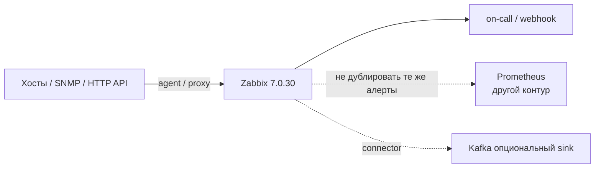
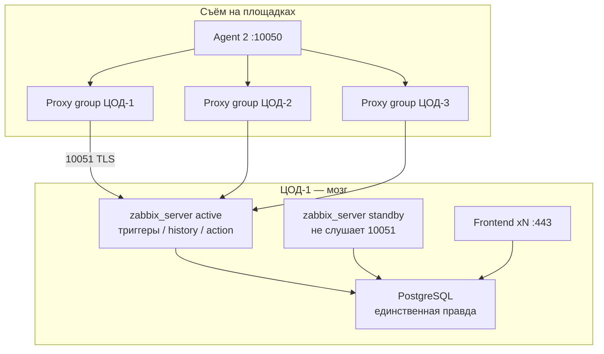
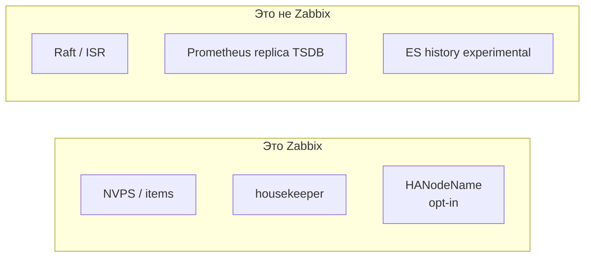
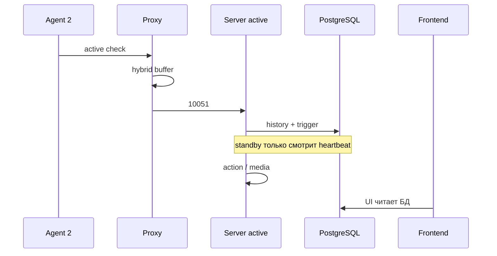
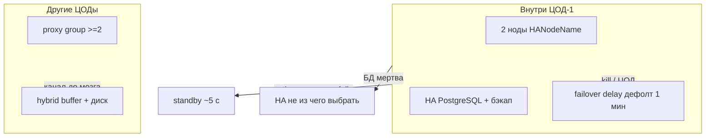
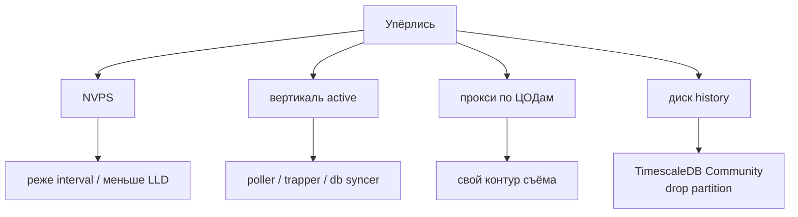
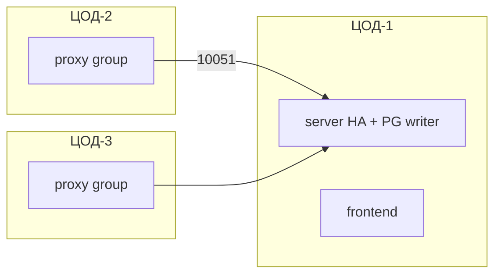

# Zabbix 7.0.30 — схемы устройства

Связанные документы: правила — `Zabbix.md`; установка — `Zabbix.install.md`.

C4 / «D4»: контекст → контейнеры → компоненты. Шаблоны item'ов не рисуем.

Допущения: **7.0.30 LTS**, не 7.4. Stretch server+PostgreSQL на 2–3 ЦОДа **нет**. Native HA — **active-passive**, один writer. Другие ЦОДы — **proxy groups**. Официального Helm «весь server в K8s» у вендора нет. Нагрузки/NVPS нет.

---

## 1. Контекст

Zabbix — **мониторинг и эскалации**, не SoT клиентов, не SIEM, не Prometheus.

Типичная нарезка (допущение, не вендор): Prometheus — кардинальность подов; Zabbix — железо, SNMP, ICMP, «порт ведомства открыт». Payload ответа СМЭВ в item **не** класть.

---

## 2. Контейнеры решения

Порты: агент **10050**, server/proxy/trapper **10051**, Java gateway **10052**, web service **10053**, UI **80/443**. TLS **не** новый порт: тот же 10051 принимает plaintext и TLS. Standby порты **не** слушает — LB «на все HA-поды» ломает модель.

Heartbeat active → БД каждые **5 с**. Frontend при HA **не** прописывает address:port сервера в `zabbix.conf.php` — читает активную ноду из таблицы.

---

## 3. Компоненты, которые путают с кворумом

Два `replicas: 2` без `HANodeName` = два писателя на одну БД. Прокси **своя** БД, не серверная. `ProxyBufferMode=memory` при рестарте **теряет** буфер; новые 7.0 — **hybrid**. Elasticsearch как history в прод этого файла **не** кладём.

---

## 4. Поток: значение item → проблема

Обрыв ЦОД↔мозг: данные в `ProxyOfflineBuffer`, триггеры на сервере в это время могут **не** считаться. Прокси не заменяет упавший server.

---

## 5. Отказоустойчивость — что настраивать

| Ручка | Если забыть |
|---|---|
| Список нод в `Server=` / `ServerActive` | Прокси не найдёт новый active |
| Не TCP-LB на standby | Пассивный не примет агентов |
| Proxy group + агент ≥7.0 active | Failover active checks, если нет доступа ко **всем** членам группы |
| Restore PG | Реплики server не бэкап |
| Media / action | HA без on-call = зелёный под |

Корректный stop active → другая нода ~**5 с**. Исчезновение — delay **+ 5 с** (диапазон delay 10 с–15 мин). Связь с БД потеряна дольше `failover delay − 5 с` → active **обязан** уйти в standby.

---

## 6. Масштабируемость — что настраивать

Горизонтали **записи триггеров** нет: один active. Таблица Small/Medium/Large — примеры вендора, не смета. Формула диска от NVPS × retention, не от терабайт озера. Housekeeper без партиций на большой history сам становится аварией.

---

## 7. 2–3 ЦОДа без stretch

Третий writer server **не** появляется. Stretch sync Postgres между площадками не обещать: порога мс у Zabbix нет.

**Сильное:** сбор переживает обрыв канала (буфер); один UI эскалаций. **Слабое:** падение ЦОДа с БД = нет обработки и нет выбора HA, пока restore; остаются только буферы прокси.

---

## 8. Безопасность

1. Сразу сменить `Admin` / `zabbix`. После 5 неудач UI молчит 30 с — не WAF.
2. `TLSConnect`/`TLSAccept` не `unencrypted` на 10050/10051. PSK identity — не секрет.
3. Агент не под UNIX-пользователем server (иначе читает `DBPassword`).
4. `EnableGlobalScripts=0`, если нет регламента. `system.run` на агенте по умолчанию выкл.
5. HTTPS frontend, SSO; Super Admin не в CI. AGPLv3 с 7.0 — юридический факт.
6. Образы pin `alpine-7.0.30` / `ubuntu-7.0.30`, не `latest`.

Источники: `Zabbix.md`. «Переживёт два ЦОДа» вендор **не** утверждает.
