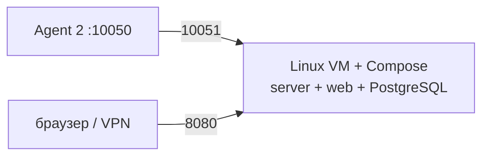

# Zabbix 7.0.30 LTS — установка (учебный контур)

Zabbix — система наблюдения: хост, проверка (item), порог (trigger), эскалация. Ставите **свою** копию **7.0.30** LTS (релиз 25 августа 2026; полная поддержка линии 7.0 до 30 июня 2027), не облако и не 7.4.14.

**Допущение:** закрытая сеть, одна Linux-машина (Windows как **сервер** Zabbix не заявлена). Docker — программа, которая запускает **образ** (упакованная программа с зависимостями) как контейнер; Compose поднимает пачку контейнеров по YAML. Учебный запуск в бой не копировать. Не `latest`, не 7.4 «новее = лучше».

Официальный путь учёбы: репозиторий [zabbix-docker](https://github.com/zabbix/zabbix-docker), ветка **7.0**, файл `compose_pgsql.yaml`, метка образов **`alpine-7.0.30`** (или `ubuntu-7.0.30`). Страница: https://www.zabbix.com/documentation/7.0/en/manual/installation/containers

---

## Куда ставить и сколько ресурсов (учебный контур)

**Куда.** Выделенная Linux-машина **рядом** с учебным контуром, не «весь сервер в Kubernetes». Официального чарта «поставь весь Zabbix 7.0» нет: Helm вендора мониторит Kubernetes **из уже живого** сервера. OpenShift Operator линий 5/6 для 7.0 не брать.

На этой VM: Docker Compose → PostgreSQL (база конфига, истории и пульса HA) + `zabbix-server` (считает пороги, пишет историю) + frontend PHP/Nginx (UI и JSON-RPC API). Agent 2 — на наблюдаемой машине (на стенде — на этой же). Прокси, Java-шлюз, PDF, TimescaleDB, native HA **не** входят в учебный контур.



Порты (менять можно, это контракт сети): агент **10050/TCP**, server/trapper **10051/TCP**, UI **80/443** (на стенде UI на **8080**, не в интернет). TLS **не** открывает новый порт: тот же 10050/10051 принимает открытый текст и TLS. Java **10052** и PDF **10053** на этом стенде не слушаем.

**Сколько.** Цифры «хватит N ядер учебному стенду» в мануале **нет**. Ниже — **пример старта** вендора, не смета боя. Каждая установка уникальна; замер — на стенде.

| Зачем | CPU | RAM | Откуда |
|---|---|---|---|
| Пример старта Small (1 000 «метрик»*) | **2** | **8 ГиБ** | [Requirements](https://www.zabbix.com/documentation/7.0/en/manual/installation/requirements) |

\*1 «метрика» в этой таблице = 1 item + 1 trigger + 1 graph. Amazon EC2 в той же таблице — иллюстрация класса. Формула диска (~90 байт на значение) — ориентир для истории, не «терабайт озера». TimescaleDB Community на стенде не нужен.

Для закрытого стенда без нагрузки берите машину **не слабее Small**, локальный диск (не NFS как единственный том Postgres: в доке вендора такого рецепта нет). PostgreSQL в compose — образ `postgres:16-alpine` (ветка 7.0); диапазон сервера 7.0 — PostgreSQL **13–18**.

**Сильная сторона:** официальный Compose, server + frontend + БД за минуты. **Слабая:** одна VM = нет отказа зала, нет буфера прокси, нет выборов лидера.

**Критично:** UI и **10051** не в интернет. Пароль `Admin`/`zabbix` — только закрытый стенд, сменить в день установки. Один процесс сервера без `HANodeName` — штатная одиночка, не кластер. Мозг и writer Postgres на 2–3 дата-центра не растягивать: порога RTT у Zabbix **нет**.

---

## Установка для новичка

Команды — **на Linux-машине стенда**, не в PowerShell. Страница контейнеров: https://www.zabbix.com/documentation/7.0/en/manual/installation/containers

### Что должно быть до установки

**Есть:**

- Linux, Docker Engine, Compose **v2** (`docker compose`, два слова; README репозитория — ≥ 2.24)
- закрытая сеть; вход с jump-хоста / VPN
- NTP/chrony (вендор *strongly recommended*)
- свободны на хосте **8080** (UI), **10051** (server), **10050** (если Agent 2 на этой же машине)

**Нет** (и не должно появиться):

- публикация 80/443/8080/10051 в интернет
- `ZBX_IMAGE_TAG=…-latest` или `latest`
- `--profile all` / `full` / `elasticsearch` (прокси, Java, SNMP traps, PDF, Elasticsearch)
- две реплики server без `HANodeName`
- Windows как хост **сервера**
- `.env` с паролем БД в git

### Этап 1. Проверка машины

**Что делаем:** убеждаемся, что это Linux и Docker отвечает.

```bash
uname -s
docker version
docker compose version
ss -lnt | grep -E ':8080|:10051|:10050' || true
timedatectl
```

Успех: `Linux`; `docker compose version` ≥ 2.24; порты 8080/10051 свободны.

### Этап 2. Клон `zabbix-docker`, ветка 7.0

**Что делаем:** берём официальные Compose-файлы линии **7.0**, не `master`/`7.4`.

```bash
git clone https://github.com/zabbix/zabbix-docker.git
cd zabbix-docker
git checkout 7.0
git rev-parse --abbrev-ref HEAD
```

Успех: ветка `7.0`, в каталоге есть `compose_pgsql.yaml` и `.env`.

### Этап 3. Pin 7.0.30 и порт UI

**Что делаем:** дефолт `.env` ветки 7.0 — `ZBX_IMAGE_TAG=${OS}-${ZBX_VERSION}-latest` (= `alpine-7.0-latest`). Это **запрещено**. UI по умолчанию публикуется на **80** всех интерфейсов — меняем на 8080.

В `.env` (не в git своего проекта):

```bash
OS=alpine
ZBX_VERSION=7.0
ZBX_IMAGE_TAG=alpine-7.0.30
ZABBIX_WEB_NGINX_HTTP_PORT=8080
ZABBIX_WEB_NGINX_HTTPS_PORT=8443
ZABBIX_SERVER_PORT=10051
```

Успех: `grep ZBX_IMAGE_TAG .env` → `alpine-7.0.30`; HTTP-порт **8080**. Официальный YAML **не** задаёт `host_ip: 127.0.0.1` — слушатель будет `0.0.0.0`. Режет файрвол / закрытая сеть, не «порт сам localhost».

Пароль PostgreSQL — файлы-секреты `env_vars/.POSTGRES_USER` и `env_vars/.POSTGRES_PASSWORD` клона. **Сменить до** `up`. Значения из публичного репозитория известны всем. В git своего проекта эти файлы не класть.

### Этап 4. Подъём server + frontend + PostgreSQL

**Что делаем:** Compose тянет образы, создаёт сети, инициализирует схему БД (`server-db-init`, команда `init_db_only`) и стартует три долгих сервиса. Без `--profile`. Обычно 1–3 минуты.

```bash
cd zabbix-docker
docker compose -f ./compose_pgsql.yaml up -d
```

Успех: команда без ошибки.

### Этап 5. Контейнеры живы

**Что делаем:** проверяем состав **до** браузера. Init-контейнер **не** должен остаться `Up`.

```bash
docker compose -f ./compose_pgsql.yaml ps
docker compose -f ./compose_pgsql.yaml images
```

Успех:

- `postgres-server`, `zabbix-server`, `zabbix-web-nginx-pgsql` — `Up` (web — healthy)
- `server-db-init` — завершён (`Exited` 0), не циклический рестарт
- тег образов Zabbix — **`alpine-7.0.30`**, не `alpine-7.0-latest`
- прокси / agent / java / snmptraps / web-service / elasticsearch **нет** в списке (их профили)

Если сервис `Exited` — `docker compose -f ./compose_pgsql.yaml logs <имя>`. `Cannot connect to the Docker daemon` — демон не запущен.

### Этап 6. Agent 2 на этой же машине

**Что делаем:** в `compose_pgsql.yaml` сервиса Agent **2 нет** (есть Agent 1, и то в профиле `full`/`all` — не включаем). Ставим Agent 2 пакетом: https://www.zabbix.com/download — версия **7.0**, ваша ОС, компонент **Agent 2**. Команды репозитория — **с той страницы**, не из памяти.

В `/etc/zabbix/zabbix_agent2.conf`:

```text
Server=127.0.0.1
ServerActive=127.0.0.1
Hostname=stand-linux
```

`Server` / `ServerActive` — куда агент пускает **пассивные** запросы и куда **сам** приносит значения (порт server **10051** уже на хосте). `Hostname` — имя хоста **в UI**, не обязательно hostname Linux.

```bash
sudo systemctl enable --now zabbix-agent2
sudo systemctl status zabbix-agent2
zabbix_agent2 -V
```

Успех: сервис active; версия линии **7.0.30**. Агент — пользователь `zabbix`, не root (`AllowRoot` не включать). `system.run` по умолчанию выкл — так и оставить.

Пакетный путь «весь сервер» (https://www.zabbix.com/download, PostgreSQL + nginx) — запасной, если Docker нельзя. Тогда UI обычно `http://<host>/zabbix`, не корень `/`. Два пути сразу на одной машине не смешивать.

### Этап 7. Хост и проверка в UI

**Что делаем:** заводской хост «Zabbix server» с агентом на `127.0.0.1` смотрит **внутрь контейнера server**, где агента нет. Заводим свой хост.

1. Войти (следующий раздел), сменить пароль.
2. Data collection → Hosts → Create host: **Host name** = `stand-linux` (как `Hostname` агента).
3. Интерфейс Agent: IP `127.0.0.1`, порт **10050**.
4. Шаблон: Linux by Zabbix agent (или active — см. [Monitor Linux](https://www.zabbix.com/documentation/7.0/en/manual/quickstart/linux)).
5. Monitoring → Latest data: значения растут.
6. Триггер: проблема появляется и гаснет (можно временно сломать проверку и вернуть).

Успех: last check свежий; есть проблема и восстановление. График CPU **не** доказывает HA и прокси.

**Чего этот стенд не доказывает:** отказ зала; буфер прокси (`ProxyOfflineBuffer`); выборы лидера native HA (один server без `HANodeName` — одиночка); нагрузка / NVPS; синхронный Postgres через город (не делаем; порога мс нет); TLS на 10050/10051; канал до дежурного; Helm «всего сервера» (его нет).

---

## Первый запуск — URL, порт, учётка, смена пароля

**URL (Compose, как в этапе 3):** `http://127.0.0.1:8080/` — с VPN / hop-хоста, не из интернета. Внутри контейнера Nginx слушает **8080**; на хосте — `ZABBIX_WEB_NGINX_HTTP_PORT`. Путь **`/`**, не `/zabbix` (это пакетный Apache). HTTPS на стенде не обязателен; порт 8443 тоже не публиковать наружу.

Страница входа: https://www.zabbix.com/documentation/7.0/en/manual/quickstart/basic_config/login  
Проверено для мануала **7.0** (линия **7.0.30**).

**Учётка Super Admin (только закрытый стенд):**

| Поле | Значение |
|---|---|
| Пользователь | `Admin` (с заглавной A) |
| Пароль | `zabbix` |

Вендор: сменить **сразу** после первого входа. После **5** неудачных логинов UI **молчит 30 секунд** — защита от перебора, не WAF. IP неудачи покажут после успешного входа.

**Смена пароля:** иконка пользователя → User profile → **Change password** (старый / новый / новый ещё раз). Внутренняя аутентификация. Успех → сессии сбрасываются. Минимум **8** символов, обрезка после **72**; сложность — отдельно в Users → Authentication.

Новый пароль — сейф / Vault, не git и не чат. В бою этот `zabbix` не использовать; люди — SSO (SAML в мануале: Entra ID / Okta / OneLogin), автоматизация — **API-токен** (показывается **один** раз), не пароль Super Admin в CI.

Guest-учётку на стенде не включать «для удобства».

---

## Подключение к своей системе

Zabbix **проверяет, что цель жива**, и эскалирует. Он **не** ходит в ведомства за телом заявки и **не** эталон клиентских карточек. Падение Zabbix шину Kafka не роняет.

| Цель | Как | Порт / протокол | Кто клиент |
|---|---|---|---|
| Linux / Windows VM, нода | **Agent 2** (предпочтителен). Passive: server спрашивает агента. Active: агент сам приносит (`ServerActive`) | **10050** к агенту; агент → **10051** server | хост, который наблюдаете |
| Коммутатор / SNMP | интерфейс SNMP на хосте, OID / `walk[]`; community — макрос | UDP/161 к устройству (стандарт SNMP, не порт Zabbix) | сеть, не приложение |
| «Порт ведомства открыт» | item HTTP agent или simple check; **код ответа**, не тело | HTTP(S) до **вашего** интеграционного API | Zabbix server (или прокси, когда появится) |
| Автоматизация UI | JSON-RPC 2.0, `POST …/api_jsonrpc.php` | тот же HTTP(S), что UI | скрипт / CI с токеном |

Агент на Windows: Agent 2 с Windows 10 / Server 2016+. На машине, где крутится server/прокси, агент — **другим** UNIX-пользователем (иначе читает пароль БД).

Прокси на учебном контуре нет. Когда появится: своя БД, не серверная; версия = 7.0.30; между server и proxy при макросах из Vault **нужен TLS**.

### Секреты (не в git)

| Секрет | Где живёт | Куда не класть |
|---|---|---|
| Пароль `Admin` после смены | сейф / Vault | git, образ, чат |
| `env_vars/.POSTGRES_PASSWORD` | только на машине Compose | git своего проекта |
| Community SNMP / PSK | макрос; в бою — Vault KV v2 (Zabbix только **читает**) | шаблон в git открытым текстом |
| API-токен | сейф; значение — один раз при создании | CI как Super Admin / `zabbix` |
| Identity PSK | можно в конфиге | сам **ключ** PSK — нет (identity шлют открытым текстом, это не секрет) |

В git — процедура и имена переменных без значений.

### Чем продукт не является

| Сосед | Чем отличается |
|---|---|
| Prometheus / Grafana | Другой стек метрик и дашбордов. Кардинальность подов `/metrics` — там. Одни и те же алерты на диск/SNMP без договора = два пейджера |
| Wazuh | SIEM: события безопасности, не пороги «порт закрыт» |
| Официальный Helm 7.0 | Мониторинг Kubernetes **поверх уже существующего** Zabbix, не установщик server+БД |
| Kafka / Camunda | Шина и процессы. Zabbix может проверить, что они **отвечают**; коннектор в Kafka — **отдельная** программа вендора |
| Эталон СУБД / озеро | История item'ов ≠ карточки клиентов. Тело ответа СМЭВ в item не класть |

---

## Ссылки на материал

| Факт | URL |
|---|---|
| Релиз **7.0.30** (25 Aug 2026), линия 7.0 LTS; рядом 7.4.14 — не LTS | https://www.zabbix.com/download_sources |
| Жизненный цикл, AGPLv3 с 7.0 | https://www.zabbix.com/life_cycle_and_release_policy |
| Compose: clone, `checkout 7.0`, `compose_pgsql.yaml`, 1–3 мин, `docker compose ps` | https://www.zabbix.com/documentation/7.0/en/manual/installation/containers |
| Тег образа `alpine-7.0.30` / `ubuntu-7.0.30`; не `latest` | https://hub.docker.com/r/zabbix/zabbix-server-pgsql/tags?name=alpine-7.0.30 |
| `.env` ветки 7.0: `ZBX_IMAGE_TAG=${OS}-${ZBX_VERSION}-latest`, порты 80/443/10051/10050 | https://github.com/zabbix/zabbix-docker/blob/7.0/.env |
| `compose_pgsql.yaml` | https://github.com/zabbix/zabbix-docker/blob/7.0/compose_pgsql.yaml |
| Small 2 CPU / 8 ГиБ; PostgreSQL 13–18; порты 10050/10051/80/443; TimescaleDB 2.13.0–2.29.X на 7.0.30 | https://www.zabbix.com/documentation/7.0/en/manual/installation/requirements |
| Вход `Admin` / `zabbix`; сменить сразу; 5 неудач → пауза 30 с | https://www.zabbix.com/documentation/7.0/en/manual/quickstart/basic_config/login |
| Смена пароля в User profile; сброс сессий | https://www.zabbix.com/documentation/7.0/en/manual/web_interface/user_profile |
| Хост Linux + агент | https://www.zabbix.com/documentation/7.0/en/manual/quickstart/linux |
| Agent / Agent 2, passive vs active, порт 10050 | https://www.zabbix.com/documentation/7.0/en/manual/concepts/agent |
| Пакет Agent 2 под вашу ОС | https://www.zabbix.com/download |
| JSON-RPC, `api_jsonrpc.php` | https://www.zabbix.com/documentation/7.0/en/manual/api |
| SNMP items | https://www.zabbix.com/documentation/7.0/en/manual/config/items/itemtypes/snmp |
| Vault (чтение KV v2); TLS к Vault | https://www.zabbix.com/documentation/7.0/en/manual/config/secrets |
| Native HA (на этом стенде выкл) | https://www.zabbix.com/documentation/7.0/en/manual/concepts/server/ha |
| Прокси / группы (на этом стенде выкл) | https://www.zabbix.com/documentation/7.0/en/manual/concepts/proxy |
| Helm мониторинга Kubernetes, не сервер | https://git.zabbix.com/projects/ZT/repos/kubernetes-helm/browse |
| Образы `zabbix/*` | https://hub.docker.com/u/zabbix |
| Зачем продукт, порты, железо | `Zabbix.md` |
| Словарь | `Zabbix.info.md` |
| Схема стыковки с платформой | `Zabbix.shema.md` |
| Роль консультанта | `Zabbix.consultant.md` |

**В доке вендора нет (и здесь не выдумано):** порог RTT между залами; «N ядер именно учебному стенду» отдельно от таблицы Small/Medium/Large; `host_ip: 127.0.0.1` в официальном Compose; сервис `zabbix-agent2` в `compose_pgsql.yaml`; готовый чарт «весь server 7.0.30 в Kubernetes»; обещание пережить 2 из 3 ЦОДов native HA.
