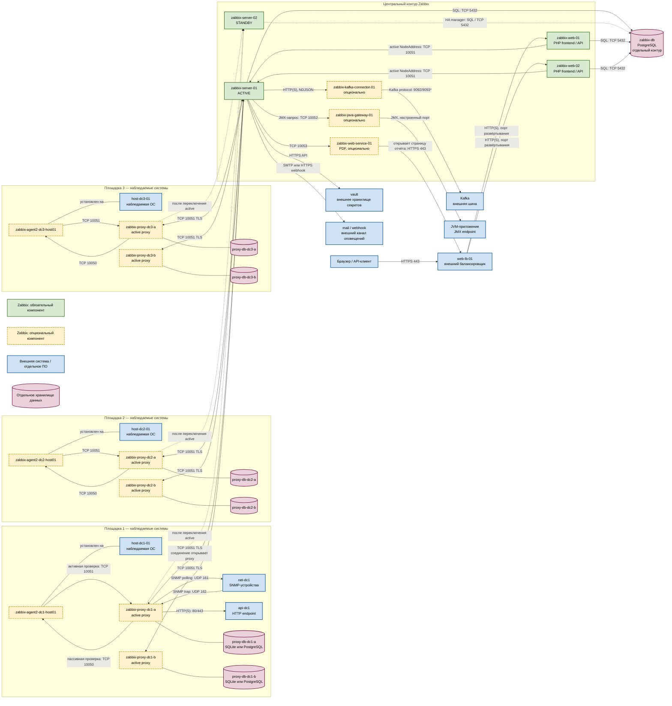

# Zabbix 7.0.30 LTS — назначение и состав

Zabbix — self-hosted-система наблюдения за инфраструктурой и сервисами. Для платформы зафиксирована версия **7.0.30 LTS**; это не Zabbix Cloud. Серверная часть использует модель active-passive: в каждый момент сбор, обработку и расчёт триггеров выполняет только одна активная нода.

Документация: https://www.zabbix.com/documentation/7.0/en/manual/  
Официальные образы: `zabbix/zabbix-server-pgsql`, `zabbix/zabbix-web-nginx-pgsql` или вариант с Apache, `zabbix/zabbix-proxy-sqlite3` / `zabbix/zabbix-proxy-pgsql`, `zabbix/zabbix-agent2`, `zabbix/zabbix-java-gateway`, `zabbix/zabbix-web-service`. Для воспроизводимости используется метка **7.0.30**, а не `latest`.

Zabbix **не** заменяет Prometheus, SIEM Wazuh, хранилище логов OpenSearch или шину Kafka.

---

## Назначение системы

Zabbix нужен, чтобы:

- проверять доступность машин, сетевых устройств, портов, URL и прикладных интерфейсов;
- получать технические метрики и состояние ОС;
- выявлять отклонения по заданным правилам;
- сохранять историю наблюдений и агрегированные значения;
- показывать состояние в веб-интерфейсе и передавать проблемы дежурным.

Система хранит **данные мониторинга**, а не эталонные клиентские карточки. Она не исполняет бизнес-процессы и не получает бизнес-данные напрямую из государственных систем. Zabbix может проверить доступность интеграционного API и опционально передать значения или события во внешнюю Kafka через отдельный коннектор.

Метрики Kubernetes и микросервисов уже собирает Prometheus. Границы ответственности нужно разделить: например, Zabbix отвечает за ОС, SNMP и доступность портов, а Prometheus — за высококардинальные метрики приложений. Иначе один отказ породит дублирующиеся оповещения.

---

## Перечень функций

Self-hosted Zabbix 7.0 умеет:

1. **Получать данные** через Agent/Agent 2, SNMP, ICMP, HTTP, JMX через Java gateway и `zabbix_sender`.
2. **Вычислять триггеры** — правила, переводящие значения в состояние проблемы и обратно.
3. **Эскалировать проблемы** через почту, webhook или скрипт.
4. **Хранить историю** исходных значений и trends — почасовые минимум, максимум, среднее и количество значений.
5. **Работать в native HA**: несколько экземпляров `zabbix_server` используют одну базу, но активен только один.
6. **Собирать данные через proxy** и сохранять их в локальном буфере при разрыве связи с server.
7. **Объединять proxy в группы**, чтобы перераспределять наблюдаемые хосты при недоступности одного proxy.
8. **Автоматически обнаруживать объекты** и назначать им шаблоны проверок.
9. **Шифровать взаимодействие** Agent/Proxy/Server с помощью PSK или сертификатов на тех же портах 10050/10051.
10. **Читать секреты** из HashiCorp Vault или CyberArk.
11. **Передавать значения и события наружу** по HTTP; Kafka используется через отдельный коннектор.
12. **Формировать PDF-отчёты** через отдельный Zabbix web service.

Zabbix не создаёт многопишущий кластер наподобие Kafka: запасные server-ноды не делят нагрузку с активной. История и состояние HA находятся в СУБД.

---

## Основные элементы системы и зависимости

### Схема инстансов и потоков

На схеме показана принятая логическая топология для трёх площадок. Имена внутри блоков — имена ролей/инстансов, а не обязательные DNS-имена. Группы proxy и Agent 2 опциональны для Zabbix как продукта, но нужны там, где выбран соответствующий способ сбора.

\* `9092/9093` — распространённые порты Kafka, но фактические адреса и TLS-порт задаются конфигурацией конкретного кластера; это не порты Zabbix.

### Как читать потоки

1. **Сплошная стрелка показывает рабочее сетевое соединение.** Направление стрелки — кто начинает запрос. Две стрелки на одной линии означают обмен в обе стороны внутри соединения.
2. **Пунктир к standby не является рабочим параллельным потоком.** Пока `zabbix-server-02` в состоянии STANDBY, он запускает только HA manager, не выполняет проверки и не слушает рабочие порты. Proxy сможет обратиться к нему только после того, как эта нода станет ACTIVE.
3. **Пассивная проверка Agent 2:** proxy или server открывает соединение к Agent 2 на **TCP 10050**, запрашивает ключ и получает ответ.
4. **Активная проверка Agent 2:** Agent 2 сам открывает соединение к proxy или server на **TCP 10051**, получает список проверок и отправляет значения. Слова «активный» и «пассивный» здесь описывают инициатора соединения, а не важность агента.
5. **Active proxy** сам соединяется с активной server-нодой на **TCP 10051**: запрашивает конфигурацию и передаёт накопленные данные. Для passive proxy стрелка была бы направлена от server к proxy на тот же порт.
6. **Локальная база каждого proxy** хранит его конфигурацию и буфер. Она не является частью `zabbix-db` и не может быть общей с server.
7. **Server и frontend обращаются к одной Zabbix DB.** Активный server записывает историю, события и состояние HA. Standby через ту же БД видит состояние кластера. Frontend читает конфигурацию и историю напрямую из БД.
8. **Frontend в режиме HA** читает активную ноду из таблицы `nodes` и использует её `NodeAddress`. Поэтому линия `frontend → server` ведёт к текущей ACTIVE-ноде, а не через TCP-балансировщик на обе server-ноды.
9. **Пользовательский поток отделён от сбора:** браузер идёт через внешний балансировщик к одной из копий PHP frontend. Отказ frontend мешает просмотру, но сам по себе не останавливает сбор server/proxy.
10. **JMX и PDF — отдельные опциональные ветви.** Server или proxy обращается к Java gateway на 10052; server обращается к web service на 10053, а web service открывает страницу frontend для рендеринга отчёта.
11. **Kafka connector — приёмник HTTP-потока Zabbix, а не часть Kafka.** Server отправляет ему значения/события в NDJSON по HTTP(S), затем коннектор публикует их в Kafka.
12. **Внешние блоки окрашены синим.** Их жизненный цикл, отказоустойчивость и резервное копирование не обеспечивает native HA Zabbix.

### Zabbix server: активная нода

- **Экземпляр на схеме:** `zabbix-server-01`.
- **Назначение:** центральная обработка проверок, расчёт триггеров, создание событий, выполнение действий, запись истории и раздача конфигурации proxy.
- **Технологии и варианты:** процесс `zabbix_server`; пакет Linux либо официальный контейнер `zabbix/zabbix-server-pgsql`. Для выбранной архитектуры — вариант с PostgreSQL.
- **Принадлежность:** входит в Zabbix.
- **Обязательность:** обязателен; активной одновременно может быть только одна server-нода.

### Zabbix server: standby-нода

- **Экземпляр на схеме:** `zabbix-server-02`.
- **Назначение:** следить за состоянием native HA через общую БД и принять роль ACTIVE при переключении.
- **Технологии и варианты:** тот же бинарь и версия, что у активной ноды; задаются уникальный `HANodeName` и доступный `NodeAddress`.
- **Принадлежность:** входит в Zabbix.
- **Обязательность:** опциональна для одиночной установки, обязательна только если нужен native HA server. Standby не делит нагрузку и не слушает рабочие порты.

### Zabbix proxy

- **Экземпляры на схеме:** пары `zabbix-proxy-dcN-a/b` на каждой площадке.
- **Назначение:** выполнять проверки рядом с целями, локально буферизовать результаты и передавать их server. Группа proxy позволяет перераспределить хосты при отказе одного участника.
- **Технологии и варианты:** `zabbix_proxy` в active- или passive-режиме; официальные контейнеры/пакеты с SQLite, PostgreSQL или MySQL. На схеме выбран active proxy.
- **Принадлежность:** входит в Zabbix.
- **Обязательность:** опционален для продукта; нужен для распределённого сбора, локального буфера и принятой многоплощадочной топологии. Версия proxy должна соответствовать версии server.

### Локальная база proxy

- **Экземпляры на схеме:** `proxy-db-dcN-a/b`, отдельная база для каждого proxy.
- **Назначение:** хранить локальную конфигурацию proxy и очередь данных до отправки server.
- **Технологии и варианты:** встроенный файл SQLite либо отдельно запущенные PostgreSQL/MySQL. SQLite в памяти не используется.
- **Принадлежность:** хранилище обслуживает proxy, но выбранная СУБД является отдельным ПО; SQLite поставляется как библиотечная зависимость варианта proxy.
- **Обязательность:** обязательна для каждого proxy. Базу proxy нельзя совмещать с Zabbix DB server.

### Zabbix Agent 2

- **Экземпляры на схеме:** `zabbix-agent2-dcN-host01`, установленные на внешних `host-dcN-01`.
- **Назначение:** получать метрики ОС и приложений через плагины и отдавать их в passive- или active-режиме.
- **Технологии и варианты:** `zabbix_agent2` для Linux и Windows; классический `zabbix_agentd` остаётся альтернативой, но Agent 2 предпочтителен для новых интеграций.
- **Принадлежность:** входит в Zabbix, хотя устанавливается на наблюдаемую машину.
- **Обязательность:** опционален: хост можно наблюдать по SNMP, HTTP, ICMP или agentless-проверками.

### Zabbix frontend и API

- **Экземпляры на схеме:** `zabbix-web-01` и `zabbix-web-02`.
- **Назначение:** веб-интерфейс операторов и HTTP API для автоматизации. Собственного хранилища истории не имеет.
- **Технологии и варианты:** PHP с Nginx или Apache; официальные образы `zabbix-web-nginx-pgsql` и соответствующие Apache-варианты. Несколько frontend-инстансов могут работать с одной БД.
- **Принадлежность:** входит в Zabbix.
- **Обязательность:** формально server может собирать данные без frontend, но для администрирования и штатной работы интерфейс практически необходим. Горизонтальное дублирование frontend опционально.

### Zabbix DB

- **Экземпляр на схеме:** логическая точка `zabbix-db`.
- **Назначение:** хранить конфигурацию, историю, trends, события, проблемы и таблицу состояния HA server.
- **Технологии и варианты:** в принятой схеме PostgreSQL **13–18**; опционально TimescaleDB Community для партиционирования и сжатия истории. Zabbix также поддерживает другие СУБД, но они не показаны.
- **Принадлежность:** PostgreSQL и TimescaleDB — отдельное ПО, не процессы Zabbix.
- **Обязательность:** постоянная БД обязательна. Native HA server не создаёт HA базы и не заменяет её резервирование.

### Внешний балансировщик

- **Экземпляр на схеме:** `web-lb-01`.
- **Назначение:** единая HTTPS-точка входа и распределение запросов между frontend-инстансами.
- **Технологии и варианты:** платформенный ingress, HAProxy, Nginx, аппаратный или облачный балансировщик.
- **Принадлежность:** не входит в Zabbix.
- **Обязательность:** опционален при одном frontend; нужен для единой точки входа к нескольким frontend. Он не должен балансировать TCP 10051 между ACTIVE и STANDBY server-нодами.

### Java gateway

- **Экземпляр на схеме:** `zabbix-java-gateway-01`.
- **Назначение:** посредник между server/proxy и JMX-интерфейсом JVM-приложения.
- **Технологии и варианты:** процесс Zabbix Java gateway, пакет или контейнер `zabbix-java-gateway`; слушает **TCP 10052** по умолчанию.
- **Принадлежность:** входит в Zabbix.
- **Обязательность:** опционален, нужен только для JMX-проверок.

### Zabbix web service

- **Экземпляр на схеме:** `zabbix-web-service-01`.
- **Назначение:** формировать запланированные PDF-отчёты, открывая страницу frontend в headless-браузере.
- **Технологии и варианты:** отдельный процесс/контейнер `zabbix-web-service`; слушает **TCP 10053** по умолчанию.
- **Принадлежность:** входит в Zabbix.
- **Обязательность:** опционален, если PDF-отчёты не нужны.

### Kafka connector

- **Экземпляр на схеме:** `zabbix-kafka-connector-01`.
- **Назначение:** принять поток значений и событий от Zabbix server по HTTP в формате NDJSON и опубликовать его в Kafka.
- **Технологии и варианты:** отдельный лёгкий сервер на Go из примеров/интеграций Zabbix; endpoint, аутентификация и Kafka bootstrap servers задаются отдельно.
- **Принадлежность:** не входит в основной server/frontend/proxy и развёртывается отдельным процессом.
- **Обязательность:** опционален; для штатного мониторинга не нужен.

### HashiCorp Vault или CyberArk

- **Экземпляр на схеме:** `vault`.
- **Назначение:** хранить секреты, на которые ссылаются secret macros Zabbix.
- **Технологии и варианты:** HashiCorp Vault KV v2 или CyberArk Central Credential Provider.
- **Принадлежность:** внешняя система.
- **Обязательность:** опциональна для Zabbix; в платформе предпочтительнее хранения паролей в открытых макросах.

### Наблюдаемые системы

- **Экземпляры на схеме:** хосты, SNMP-устройства, HTTP API и JVM-приложение.
- **Назначение:** источники метрик либо цели проверок.
- **Технологии и варианты:** Agent 2, SNMP, ICMP, HTTP(S), JMX и другие поддерживаемые типы item.
- **Принадлежность:** сами системы внешние; установленный на хост Agent 2 относится к Zabbix.
- **Обязательность:** должна быть хотя бы одна цель наблюдения, но конкретный протокол и агент опциональны.

### Каналы оповещений

- **Экземпляр на схеме:** `mail / webhook`.
- **Назначение:** доставить информацию о проблеме дежурному или внешней системе управления инцидентами.
- **Технологии и варианты:** SMTP, HTTP(S) webhook, пользовательский media type или скрипт.
- **Принадлежность:** почтовая система и получатели webhook внешние; механизмы action/media type входят в Zabbix.
- **Обязательность:** технически опциональны, но без них проблема остаётся только в интерфейсе.

### Kafka

- **Экземпляр на схеме:** внешний кластер `Kafka`.
- **Назначение:** принять опубликованные коннектором значения или события для дальнейшей обработки.
- **Технологии и варианты:** Apache Kafka с настроенными bootstrap servers и принятой в платформе схемой защиты.
- **Принадлежность:** внешняя система; Zabbix не является брокером.
- **Обязательность:** опциональна и не влияет на основной цикл мониторинга.

---

## Порты и сетевые направления

### Порты Zabbix по умолчанию

| Порт | Кто слушает | Кто подключается | Назначение |
|---|---|---|---|
| **10050/TCP** | Agent / Agent 2 | Server или proxy | Пассивная агентская проверка |
| **10051/TCP** | Активный server; active-check endpoint proxy; passive proxy | Active agent, active proxy, `zabbix_sender`; либо server для passive proxy | Приём значений, конфигурация и обмен server↔proxy |
| **10052/TCP** | Java gateway | Server или proxy | JMX-проверки через Java gateway |
| **10053/TCP** | Zabbix web service | Server | Формирование отчётов |
| **80/443 TCP** | Web server frontend или внешний вход | Браузер, API-клиент, web service | UI и HTTP API |

TLS не создаёт отдельный порт: защищённое и незащищённое взаимодействие Agent/Proxy/Server использует те же 10050/10051, а разрешённый режим задаётся настройками компонентов.

### Связанные порты внешних технологий

| Порт | Технология | Примечание |
|---|---|---|
| **5432/TCP** | PostgreSQL | Значение по умолчанию; фактический порт задаёт администратор БД |
| **161/UDP** | SNMP polling | Proxy/server отправляет запрос устройству |
| **162/UDP** | SNMP traps | Приём обычно организует `snmptrapd` рядом с server/proxy |
| **9092/9093 TCP** | Kafka | Частые варианты без TLS/с TLS; фактические listeners определяет Kafka |
| **443/TCP** | HTTPS | Webhook, Vault API, Kafka connector endpoint и пользовательский вход — по конфигурации |

---

## Глоссарий

**Active agent check** — режим, в котором Agent сам соединяется с server/proxy на 10051, получает перечень проверок и отправляет значения.

**Active proxy** — proxy, который сам открывает соединение к server на 10051 для получения конфигурации и отправки данных.

**ACTIVE server** — единственная server-нода native HA, которая сейчас выполняет сбор, обработку, триггеры и действия.

**Agent / Agent 2** — программа на наблюдаемой машине, которая читает метрики ОС и приложений. Agent 2 — более новый вариант с плагинной архитектурой.

**Frontend** — PHP-приложение с пользовательским интерфейсом и HTTP API; историю хранит не у себя, а в Zabbix DB.

**HA manager** — процесс `zabbix_server`, который координирует состояние server-нод через базу.

**History** — исходные значения item за заданный срок хранения.

**Item** — одна настроенная проверка или показатель, например свободное место на диске.

**JMX** — интерфейс управления и мониторинга Java-приложений; Zabbix обращается к нему через Java gateway.

**NDJSON** — поток JSON-объектов, где каждый объект занимает отдельную строку; используется для экспорта значений и событий.

**Native HA** — встроенный active-passive-механизм Zabbix server. Он переключает server-ноды, но не кластеризует PostgreSQL, frontend или proxy.

**NodeAddress** — адрес server-ноды, сохранённый для HA; frontend находит адрес текущей ACTIVE-ноды через таблицу `nodes`.

**Passive agent check** — режим, в котором server/proxy соединяется с Agent на 10050 и запрашивает значение.

**Passive proxy** — proxy, к которому server сам подключается на 10051 за данными и для передачи конфигурации.

**Problem** — зафиксированное событие о переходе триггера в проблемное состояние.

**Proxy** — промежуточный процесс сбора с собственной локальной базой и буфером; глобальные триггеры и действия остаются на server.

**Proxy group** — группа proxy, между которыми Zabbix может перераспределять наблюдаемые хосты.

**PSK** — предварительно согласованный секрет для TLS-аутентификации компонентов.

**Server** — центральный процесс Zabbix, который обрабатывает данные, вычисляет триггеры, создаёт события и управляет конфигурацией.

**SNMP** — протокол наблюдения за сетевыми и инфраструктурными устройствами; polling — запросы к устройству, trap — сообщение от устройства.

**STANDBY server** — резервная server-нода, где работает только HA manager; до переключения она не собирает данные и не слушает рабочие порты.

**Trend** — почасовая агрегированная запись: минимум, максимум, среднее и количество значений.

**Trigger** — логическое выражение над item, определяющее нормальное или проблемное состояние.

**Webhook** — исходящий HTTP(S)-вызов во внешнюю систему при выполнении действия.

---

## Источники

- Версия 7.0.30: https://www.zabbix.com/download_sources
- Жизненный цикл и лицензия: https://www.zabbix.com/life_cycle_and_release_policy
- Zabbix server и native HA: https://www.zabbix.com/documentation/7.0/en/manual/concepts/server/ha
- Proxy и группы proxy: https://www.zabbix.com/documentation/7.0/en/manual/concepts/proxy; https://www.zabbix.com/documentation/7.0/en/manual/distributed_monitoring/proxies/ha
- Agent, active и passive checks: https://www.zabbix.com/documentation/7.0/en/manual/appendix/items/activepassive
- Frontend: https://www.zabbix.com/documentation/7.0/en/manual/installation/frontend
- Поддерживаемые СУБД и порты: https://www.zabbix.com/documentation/7.0/en/manual/installation/requirements
- Java gateway: https://www.zabbix.com/documentation/7.0/en/manual/concepts/java
- Web service: https://www.zabbix.com/documentation/7.0/en/manual/appendix/config/zabbix_web_service
- Поток во внешние системы и Kafka connector: https://www.zabbix.com/documentation/7.0/en/manual/config/export/streaming
- Секреты: https://www.zabbix.com/documentation/7.0/en/manual/config/secrets
- Шифрование: https://www.zabbix.com/documentation/7.0/en/manual/encryption
