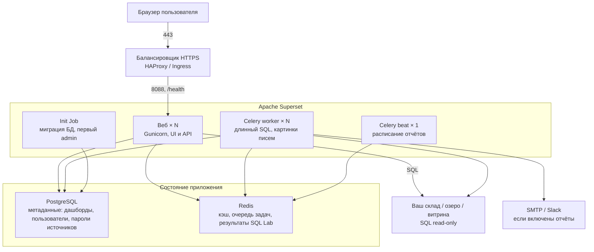

# Apache Superset 6.1.0 — развёртывание и настройка

Apache Superset — платформа для бизнес-аналитики: люди рисуют графики и дашборды **SQL-запросами** к базам, которые вы подключили. Само **не хранит** терабайты озера: оно *спрашивает* склад и показывает таблицу или картинку. Этот документ про **свою установку** версии **6.1.0** (релиз 13 мая 2026, на дату подготовки — последний стабильный релиз линии 6.1). Это не Preset Cloud и не форк вендора.

Документация линейки: https://superset.apache.org/  
Образ: `apache/superset:6.1.0` (Docker Hub). Helm-чарт по умолчанию тянет тот же тег через Scarf Gateway: `apachesuperset.docker.scarf.sh/apache/superset:6.1.0`.  
PyPI: `apache_superset==6.1.0`. Исходный релиз: https://downloads.apache.org/superset/6.1.0/  
Лицензия дистрибутива: **Apache License 2.0**.

На Kubernetes страница установки проекта (обновлялась 26 августа 2026) указывает **Helm-чарт** из `https://apache.github.io/superset`. На Artifact Hub актуальная связка: чарт **`superset/superset` 0.21.1** (18 июля 2026), `appVersion` **6.1.0**.  
Альтернатива: **Superset Kubernetes Operator 0.2.0** (11 августа 2026), репозиторий `apache/superset-kubernetes-operator`, Helm `oci://ghcr.io/apache/superset-kubernetes-operator/charts/superset-operator`. Оператор **не ставит** PostgreSQL и Redis (их приносите сами). Описание объекта на момент README оператора — `superset.apache.org/v1alpha1`. Официальная страница «Installing on Kubernetes» **по-прежнему** описывает Helm, не оператор. В этом файле боевой путь — **Helm 0.21.1 + образ 6.1.0**; оператор — осознанная альтернатива, не «тот же установщик».

Этот текст — не набор команд «скопируй helm install», а правила, без которых экземпляр не будет одновременно устойчивым к сбоям, масштабируемым и безопасным. Пошаговая установка — в `Apache Superset.install.md`.

---

## Назначение системы

Superset — слой **просмотра и анализа уже подготовленных данных в SQL**. Руководитель или аналитик открывает в браузере дашборд и видит цифры по заявкам, клиентам, филиалам — **если** снизу жива витрина.

Система **читает** данные из ваших баз и складов. Она **не** хранит эталон клиентских карточек, **не** заменяет очередь событий (Kafka), **не** исполняет бизнес-процессы (Camunda), **не** ходит сама в государственные сервисы и **не** заменяет Grafana (метрики и алерты инфраструктуры — другой контур и другие зрители). Без витрин в SQL Superset — пустая рамка. Он **не создаёт** озеро.

---

## Перечень функций

Что умеет self-hosted Apache Superset OSS:

1. **Показывать чарты и дашборды** в браузере: один график = один SQL-запрос + картинка; дашборд — экран из чартов. Пока дашборд не опубликован, его не видят остальные (правило документации Security).
2. **Подключать чужие базы** как источники: PostgreSQL озера, аналитический склад, иногда OpenSearch. Пароль подключения лежит в метаданных, зашифрованный ключом приложения. Официальный образ **не** содержит все диалекты: для каждого источника нужен драйвер.
3. **Собирать набор данных** (таблица или SQL-вид, из которого рисуют чарт). Права часто вешаются на набор данных, не на отдельный график.
4. **Конструктор без SQL** (Explore) и **встроенный SQL-редактор** (SQL Lab). Редактор — консоль к вашей базе **от имени учётки, которой подключили источник**. Не «безопасно, потому что внутри UI».
5. **Ограничивать строки на стороне приложения** фильтрами вида «этому человеку добавляй условие по филиалу». Это **не** ограничение строк PostgreSQL и **не** файрвол. Обойти можно SQL Lab, другим источником или прямым доступом к складу.
6. **Разграничивать доступ** встроенными ролями: Admin (полный контроль, включая CSS и шаблоны; вендор прямо: векторы «нужен Admin» **не** считаются уязвимостью), Alpha, Gamma (смотрит то, к чему выдан доступ, может собирать чарты), `sql_lab`, Public (роль анонимов — сама по себе интернет не открывает). Команда `superset init` **перезаписывает** права встроенных ролей.
7. **Единый вход**: LDAP или OAuth через Flask-AppBuilder.
8. **Кэшировать** объекты и результаты чартов. Дефолт — кэша нет: каждый refresh бьёт в склад. Состояние фильтров дашборда по умолчанию живёт таблицей в метаданных — несколько веб-реплик это переживают.
9. **Гонять длинные запросы и расписания** отдельными процессами: worker (асинхронный SQL Lab, прогрев кэша, картинки писем) и beat (будильник расписаний; процесс **должен быть один**, два beat = двойные письма).
10. **Слать отчёты по расписанию** (Alerts & Reports): выполнить запрос или снять PNG дашборда, послать email/Slack. Нужны: флаг функции, beat, worker, браузер без окна, SMTP. В первом боевом контуре не обязательны.
11. **Встраивать дашборд** в чужой сайт по JWT. Флаг по умолчанию выключен. Дефолтные секреты JWT в конфиге — тестовые строки.
12. **Заливать дашборды и источники** YAML/ZIP (из git), а не только кликами.
13. **Резать выборку в UI**: в 6.1.0 потолок чарта **50 000** строк, SQL Lab — **100 000**. Это защита экрана, не склада.

Чего система **не** делает и часто путают: она не озеро эталона, не шина событий, не BPMN, не Grafana, не файрвол базы (`DISALLOWED_SQL_FUNCTIONS` — **дополнение**, не замена прав на складе). Отказоустойчивость самой базы метаданных — отдельное ПО (Patroni / CloudNativePG). Кворума «2 из 3 веб-подов» нет: жив хотя бы один веб **и** жива база метаданных — экран есть. Официальной поддержки Windows нет (документация Docker Compose). Порога задержки сети между дата-центрами в документации нет.

---

## Требования к развёртыванию

### Требования к ПО

| Что | Что ставить | Комментарий |
|---|---|---|
| **Формат поставки** | Контейнеры Docker **или** поды Kubernetes | Образ `apache/superset:6.1.0`. Для Kubernetes в этом документе — Helm **0.21.1**. Оператор 0.2.0 — альтернатива с теми же правилами (общая база метаданных + Redis), страница k8s проекта его не описывает как единственный путь. `superset run` / `flask run` — **не** бой. |
| **ОС** | Linux | Основной контур (Docker / Kubernetes). **Windows для стенда и боя проектом не обещан.** |
| **Оркестратор боя** | Kubernetes (свой) | Чарты и образ фиксировать **тегом и digest**, не `latest`. В закрытом контуре образ `apache/superset`, не Scarf Gateway. |
| **База метаданных** | PostgreSQL **10.x–17.x** или MySQL **5.7 / 8.x** | Драйверы: `psycopg2` / `mysqlclient`. SQLite в том же документе для боя **настоятельно не рекомендован** (безопасность, масштаб, целостность). Это **не** озеро клиентов: здесь пользователи, дашборды, сохранённые запросы, расписания, зашифрованные пароли источников. |
| **Очередь и кэш** | Redis (типичный бой) | Дефолт в `config.py` 6.1.0 — **SQLite** как брокер задач и часто «кэша нет». Для нескольких подов нужен **общий** Redis (или иной брокер из документации Celery) и общий бэкенд результатов, не диск пода. Redis не обязателен, чтобы процесс *стартанул*. |
| **Веб-сервер** | Gunicorn, вендор рекомендует async / gevent | Пример, который «известно, что работает»: **10** воркеров, `--worker-connections 1000`, `--timeout 120`. BigQuery Python SDK **несовместим с gevent** — тогда другой тип воркера. |
| **Драйвер склада** | Свой: в образ кладут пакеты через **`uv pip install`** (с 6.1.0, UPDATING.md, PR 31260) | Не «просто pip» в старых скриптах на каждом старте от root. Документация k8s: для боя собрать свой образ в CI. |
| **Зависимости Helm-чарта 0.21.1** | Bitnami PostgreSQL **16.7.27** и Redis **17.9.4** (`oci://registry-1.docker.io/bitnamicharts`), если включить сабчарты | Artifact Hub для 0.21.1 показывает образы `bitnamilegacy/postgresql:14.17.0-...` и `bitnamilegacy/redis:7.0.10-...`. Это **стендовые** сабчарты, не ваш боевой Postgres. |
| **Сертификаты** | TLS на Ingress / HAProxy | Сам процесс обычно за прокси; `ENABLE_PROXY_FIX = True`. Самоподписанные — только стенд. |

Исходящая сеть до Scarf / Docker Hub — **по умолчанию** при pull через gateway. В закрытом контуре: образ `apache/superset`, `SCARF_ANALYTICS=false`. Mapbox / Slack SaaS — только если информационная безопасность разрешит.

### Требования к ресурсам

Цифр «сколько ядер Superset на ваши терабайты озера» у проекта **нет** — нагрузки не было, и эти терабайты Superset не хранит. Ниже то, что есть у вендора, не смета закупки.

| Роль | CPU | RAM | Диск |
|---|---|---|---|
| **Веб (Gunicorn)** | Пример доки: **10** воркеров gevent — **пример**, не формула. Потолок автомасштабирования в чарте: `maxReplicas: 100` — потолок HPA из values, не обещание, что 100 реплик разумны. Дефолт чарта: **1** реплика, `resources: {}` пустые | Смотреть throttling и задержку чартов на **ваших** дашбордах | Почти пустой: состояние в Postgres |
| **Celery worker** | Дефолт чарта **1** реплика; в бою ≥ 2 | Каждая реплика открывает свои соединения к складу | Результаты длинного SQL Lab — в общий Redis, не диск пода |
| **Celery beat** | **Ровно 1** реплика | Небольшая | Нет своего склада фактов |
| **База метаданных** | По правилам вашего Postgres | Метаданные остаются маленькими (определения дашбордов, пользователи), пока не распухнут историей SQL Lab | Бэкап этой БД = бэкап дашбордов и зашифрованных паролей источников |
| **Учебный один контейнер** | Скромные requests | Меньше боевого | SQLite в томе compose **не бэкапится** (дока) |

Дополнительно:

- Таймауты из 6.1.0: синхронный SQL Lab **30 с**; пример Gunicorn `--timeout 120`; таймаут веб-сервера по умолчанию **60 с**. Согласовать: statement_timeout склада ≤ таймаут SQL Lab ≤ Gunicorn ≤ Ingress. Иначе балансировщик рвёт, а запрос на складе живёт дальше.
- Срок токена CSRF в 6.1.0 — **1 неделя**.
- Нагрузка на склад с N веб-подов ≈ N × (процессы Gunicorn) × (одновременные чарты) × (1 − попадания в кэш). Если кэша нет, попадания = 0. Дашборд с автообновлением **10 секунд** при отсутствии кэша = постоянный шторм SQL (такой интервал в UI **есть**).
- Пул соединений: в `config.py` 6.1.0 опции движка пустые (комментарий: для обычной работы рекомендуют isolation **READ COMMITTED**). Явного `pool_size` проект **не** нормирует. Считать сами: процессы веба **и** worker, каждый со своим пулом к метаданным **и** к каждому складу. Иначе «добавили реплик для устойчивости» съест лимит соединений Postgres озера.
- На тестовой песочнице боевой запас можно не требовать. Этот стенд **нельзя** переносить в бой как официальный минимум.

---

## Основные элементы системы и зависимости

Это одно ПО из **нескольких процессов**. Несколько веб-реплик — одинаковые процессы без своего склада фактов, с **общей** базой метаданных и **общим** Redis. Это **не** кластер с голосованием вроде Kafka.

### Схема инстансов и потоков



Как читать схему:

1. Человек заходит по HTTPS на балансировщик, тот отдаёт запрос на **любой** веб-процесс (порт сервиса Helm по умолчанию **8088**). Проверка жизни — `/health`: HTTP 200 и тело `OK`, если веб-процесс жив. Это **не** проверка Postgres, Redis и склада.
2. Веб рисует UI, ходит в **базу метаданных** (права, дашборды) и в **склад** (цифры). Сессия в cookie, подписанная общим ключом приложения; «липкость» балансировщика для обычного логина **не** нужна (серверное хранилище сессий по умолчанию выкл).
3. **Worker** берёт задачи из Redis: длинный SQL Lab, прогрев кэша, PNG для письма. Без воркеров асинхронные задачи **не выполняются**. Если результат лежит на диске пода, пользователь на вебе A не заберёт то, что worker записал на поде B.
4. **Beat** — один будильник расписаний. Два процесса = двойные письма. Падение beat: экран жив, расписание нет. Падение всех worker: экран жив, асинхрон и отчёты нет.
5. Init Job гоняет миграцию базы и `superset init` **разово** на установке и обновлении, не как часть ежедневной устойчивости.
6. Kafka, Camunda, интеграционное API **не входят** в Superset. Их можно показать, только если состояние уже лежит в SQL.

Рядом, но это уже другое ПО: Ingress/HAProxy, IdP, браузер без окна для PNG, SMTP, драйверы складов, Grafana (другой класс дашбордов). Flower (порт **5555**, в чарте по умолчанию выкл) — UI очереди, в интернет не выставлять. Вебсокеты чарта (порт **8080**, по умолчанию выкл) нужны только при экспериментальных асинхронных запросах в режиме `ws`; официального образа вебсокетов **нет**, чарт ставит community-образ.

### Что входит в состав

| Компонент | Зачем | Как масштабируется |
|---|---|---|
| **Веб (Gunicorn)** | UI, API, синхронные запросы чартов | Горизонтально: реплики Deployment. Вертикально: число воркеров Gunicorn и RAM |
| **Celery worker** | Асинхронный SQL Lab, прогрев кэша, скриншоты отчётов | Горизонтально: реплики. Каждая открывает свои соединения к складу |
| **Celery beat** | Тикает cron отчётов | **Ровно 1** реплика. Это не голосование, это «не запустить два будильника» |
| **База метаданных** | Состояние приложения | Кластер PostgreSQL / MySQL, не «ещё один контейнер в чарте» |
| **Redis** | Кэш, брокер задач, результаты SQL Lab, по желанию сессии на сервере и счётчики лимитов | Отдельное ПО. Redis из values чарта — удобство стенда |
| **Init Job** | Миграция, init, создание admin | Разово. Не часть runtime |

### Официальные порты (менять можно, это контракт сети)

| Порт | Назначение | Кому открывать |
|---|---|---|
| **8088/TCP** | UI и API веба (дефолт сервиса Helm) | С балансировщика. Не мир. Пример Gunicorn в доке крутит `-b 0.0.0.0:6666` — это **иллюстрация**, не дефолт образа |
| **6379/TCP** | Не Superset, а Redis | Только веб / worker / beat / init |
| **5432 / 3306** | Не Superset, а PostgreSQL / MySQL метаданных | Только веб / worker / beat / init |
| **5555/TCP** | Celery Flower (Helm, дефолт **выкл.**) | Не в интернет |
| **8080/TCP** | Вебсокеты чарта (дефолт **выкл.**) | Только если включили экспериментальный режим; community-образ `latest` в контур с персональными данными не тащить |

Балансировщик перед 8088 официально входит в схему «за LB»: health — `/health`. HAProxy платформы — этот слой, не часть образа Superset.

### Зависимости окружения (что ещё должно быть)

- Отдельная база `superset`, не та же, что у Grafana / Camunda / озера. HA этой БД — отдельный проект.
- Redis: разные логические базы, как делает Helm (`redis_celery_db` 0, `redis_cache_db` 1), чтобы ключи задач не дрались с кэшем чартов. Чарт умеет Sentinel (`cache.sentinel`).
- Vault (или аналог): ключ приложения, пароль базы метаданных, пароли складов, секрет OAuth. Шифрование паролей *внутри* метаданных — не замена Vault.
- Исходящие с веба и worker — только разрешенные витрины, не подсеть интеграционного API к ведомствам.
- Журналы входов и SQL Lab — в SIEM / Wazuh, не только stdout.

---

## Краткие вводные

### Как устроена отказоустойчивость

Это **не** голосование Raft. Независимые слои.

**1) Веб-процессы**

| Что падает | Что происходит |
|---|---|
| Один веб-под при двух или больше и живых Postgres+Redis | Балансировщик уводит трафик (`/health`). Экран жив |
| Все веб-поды | Нет интерфейса. Worker и beat могут ещё крутить отчёты, люди — нет |
| `/health` зелёный, Postgres мёртв | Балансировщик счастлив, логина и дашбордов нет. Проверка жизни **не** смотрит метаданные |

**2) База метаданных**

| Что падает | Что происходит |
|---|---|
| SQLite на диске одного пода | Рестарт или другая реплика = другая «правда» или пусто |
| Главная Postgres без переключения | Все веб и worker не пишут. Дашборды и пользователи недоступны |
| Потеря большинства Postgres, растянутого на три площадки вслепую | Это история **PostgreSQL**, не Superset |

**3) Redis и очередь задач**

| Что падает | Что происходит |
|---|---|
| Redis при отсутствии кэша и без асинхрона | Чарт может жить (каждый раз SQL в склад). Асинхронный SQL Lab и общий кэш — нет |
| Redis = брокер, workers живы | Задачи не берутся. Отчёты молчат |
| Два Celery beat | Дубли писем |
| Результаты на файлах пода | Пользователь на вебе A не заберёт результат worker B |

**4) Склад (озеро)**

Падение склада или read-only реплики = пустые чарты и упавший SQL Lab. Superset тут ни при чём. Для «система круглосуточно» BI считается **по самому слабому** из: веб, база метаданных, Redis, склад, SMTP (если отчёты — часть дежурства).

### Как устроено масштабирование

Три оси (их путают):

1. **Больше людей смотрят дашборды** → реплики веба + воркеры Gunicorn + **кэш** (не «кэша нет») + не ставить автообновление дашборда в **10 секунд** на тяжёлые чарты.
2. **Больше тяжёлых SQL / асинхронный SQL Lab** → реплики **worker** + Redis как хранилище результатов + таймауты. Упереться можно в **склад**, не в «ещё один под Superset».
3. **Терабайты** → масштаб **озера и склада**. База метаданных остаётся маленькой. Потолки строк режут выборку в UI, они не индексируют озеро.

Агрегации — во вьюхах и материализованных витринах склада, не «SELECT * из сырого озера в чарте». Читать **реплику** озера, не главную копию эталона.

### Безопасность самой Superset

Компрометация Admin = компрометация **конфигурации UI**, шаблонов CSS/Jinja и **всех паролей источников** в метаданных (они зашифрованы ключом приложения). Gamma с доступом к клиентскому набору данных видит строки озера в браузере — это штатно, это и есть BI.

Опасные значения «из коробки / из примера» версии **6.1.0**:

| Что | Как в примере | Почему опасно |
|---|---|---|
| Ключ приложения | `CHANGE_ME_TO_A_COMPLEX_RANDOM_SECRET` | Не-debug процесс **отказывается стартовать**. Если обойти debug'ом — один ключ на все наивные установки |
| Запасной ключ Helm (дока Kubernetes) | `thisISaSECRET_1234` | Ключ известен; дамп метаданных расшифровывается |
| Первый admin (Compose / Helm init) | `admin` / `admin` | Первый вход с мира = чужой Admin |
| URI метаданных | SQLite файл | Нет устойчивости, слабая модель доступа |
| Брокер и результат задач | SQLite файлы | Не для нескольких подов |
| Кэш чартов | «кэша нет» | Каждый смотрит свежие персональные данные — и бьёт склад |
| Cookie «только HTTPS» | `False` | Сессия может уехать по HTTP |
| Доверять заголовкам прокси | `False` | За TLS-прокси ломаются cookie и адрес возврата OAuth |
| Лимит попыток входа | включён, только если `SUPERSET_ENV=production`; **5 в секунду** когда включён | На стенде с боевым профилем без этой переменной лимиты молчат; без Redis счётчики **по процессу** |
| Роль анонимов | пока не включили — ок | Включить «как Gamma» + клиентские наборы = интернет читает озеро |
| Шаблоны в SQL набора данных | выкл | Включение без политики = пользователь влияет на SQL |
| SSH-туннель из пода | выкл | Туннель в чужую сеть — отдельный риск |
| Встраивание дашборда | выкл; секреты JWT — строки `test-...-change-me` | Не включать без своего секрета и политики CSP |
| Запрет небезопасных URI баз | вкл | Не выключать: sqlite и локальные файлы — вектор |
| Импорт набора данных с URL | разрешены **любые** URL | Пока не сузите список — запрос куда угодно с пода |
| REST API прав | **включён** в `config.py` 6.1.0 (страница Security говорит «по умолчанию выкл» — для **этого тега** верьте файлу) | Сузьте сетью и ролями |
| Пользователь процесса Helm | **root (0)** | README чарта: в бою так не рекомендуется; для bootstrap часто оставляют root «чтобы apt/pip» |
| Пароль сабчарта Postgres в доке | `superset` | Пароль из примера |
| Pull образа | Scarf Gateway | Счётчик установок; в закрытом контуре — прямой Docker Hub |
| Flower | выкл | Если включить без входа — карта очередей наружу |
| Отчёты | выкл | Включение без браузера и SMTP = мёртвая кнопка; с браузером = Chromium в кластере |

«Выставили балансировщик в интернет с `admin` / `admin`» — это новая поверхность атаки на **озеро**, не удобные графики. SQL Lab: учётка источника с `INSERT` / `COPY` / `FILE` = аналитик пишет в эталон. Документация: минимум прав, лучше read-only, лучше отдельные роли БД.

Заголовки Content-Security-Policy по умолчанию **включены**. Выключать «чтобы заработало Mapbox или iframe» — снимать защиту от XSS. CSRF по умолчанию включён.

Штатный TLS прокси — не криптография по требованиям КИИ, если информационная безопасность её выдвинет.

---

## Допущения

Ниже то, чего не было в исходном запросе, но без чего нельзя нарисовать конкретную схему. Если допущение неверно — схему надо пересмотреть.

1. Берём **свою установку Apache Superset OSS 6.1.0**, не Preset Cloud и не форк вендора.
2. Бой крутится в Kubernetes, установщик — Helm **`superset/superset` 0.21.1**, образ **`apache/superset:6.1.0`** (фиксировать digest). Operator 0.2.0 — допустимая альтернатива с теми же правилами.
3. База метаданных — **PostgreSQL** из поддерживаемых 10–17 (практически — актуальный 16/17 вашего платформенного Postgres), отдельная база `superset`. HA этой БД — отдельное ПО.
4. Redis — отдельный кластер, не одиночный из сабчарта Bitnami. Разные логические базы: брокер задач и кэш/результаты.
5. Три дата-центра = три независимых отказа. Веб и worker можно размазать. **Синхронный Postgres метаданных и Redis** — нет, пока задержку не измерили. В инструкции установки живой стек держат **в одной площадке**.
6. Цель отказа: пережить **1** дата-центр для экрана, **если** в живых зонах остались веб-поды **и** доступны база метаданных и Redis. Пережить 2 из 3, если Postgres жил только в мёртвых двух — нельзя.
7. Нагрузка неизвестна — поэтому **нет** цифры «N реплик и M millicores». Есть рычаги (реплики веба и worker, кэш, не умножать соединения, не refresh 10 с).
8. Озеро или склад как SQL-источник будет. Этот документ его не проектирует. Без витрины «готовность Superset» бессмысленна.
9. Единый вход будет (LDAP или OAuth). Локальный `admin` в бою — запасная учётка в сейфе. Роль при саморегистрации из примера Helm OAuth (`Admin`) **не** копировать.
10. Закрытый контур. Scarf выкл, образы из внутреннего registry.
11. Учебный стенд изолирован. На нём допустимы SQLite / сабчарты, `admin` / `admin`, учебные примеры. В бой не копируем.
12. Camunda, Kafka, интеграционное API — не источники «на бою под Admin». Их операционные БД не открывать аналитикам. Смотреть витрины в озере.
13. Отчёты с PNG и встраивание в первом бою не обязательны. Иначе лишний Chromium, SMTP наружу и гостевой JWT.
14. SQL Lab в бою — отдельное решение информационной безопасности, не «включено, потому что кнопка есть». По умолчанию роль `sql_lab` выдаём узко.
15. Формального обещания «дашборд открылся за 2 секунды» нет. Задержка = склад + кэш + сеть.

---

## Критически важные условия, которых нет в исходном контексте

Их нужно закрыть **до** «поставили Helm и открыли :8088».

| Пробел | Почему это ломает решение |
|---|---|
| **Что такое «озеро» технически** (PostgreSQL? ClickHouse? Iceberg+Trino? Mongo?) | От этого зависят драйвер в образе, gevent vs sync, пулы, ограничение строк. Без типа склада нет схемы |
| **Задержка и фильтрация между дата-центрами на 5432 и 6379** | Веб в зоне A и Postgres в зоне B с большой задержкой = медленный логин и таймауты чартов. Redis как брокер ещё чувствительнее к потерям |
| **Один Kubernetes на три площадки или три кластера** | Один Deployment + одна БД **или** три независимых Superset (три правды дашбордов — плохо для руководства) |
| **Где живёт Postgres метаданных** | Поды переживают зону. Главная копия в одном дата-центре — смерть зоны = смерть BI везде, пока нет переключения |
| **Число зрителей, дашбордов, SQL Lab, refresh** | Без этого нельзя выбрать число реплик и размер склада |
| **Персональные данные в чартах** | Gamma с набором данных клиентов = законный читатель ФИО/ИНН в браузере. Нужны фильтры приложения **и** права на складе **и** запрет выгрузки CSV тем, кому нельзя |
| **Кто имеет SQL Lab и с какой учёткой БД** | Это главный внутренний вектор «вынесли эталон» |
| **Куда смотрит UI** (только внутренняя сеть? единый вход?) | Публичный 443 с `admin` / `admin` — инцидент на клиентских данных, не на CPU |
| **Уже есть Grafana** | Два «дашборд-инструмента» без разделения ролей = двойные права и путаница, кто алертит |
| **Нужны ли письма с PNG дашбордов** | Да → браузер без окна, beat = 1, исходящий SMTP, внутренний URL для съёмки и внешний HTTPS для людей. Нет → не включать отчёты |
| **Юридический контур образов** | Scarf, Docker Hub, Bitnami / bitnamilegacy сабчарты — отдельные решения закупок и безопасности |

---

## Краткое описание ключевых этапов и элементов развертывания

Общий каркас (и тест, и бой):

1. Зафиксировать **Superset 6.1.0** и способ: Docker Compose **или** Helm 0.21.1 **или** Operator 0.2.0. Не смешивать 5.x UI с 6.1 БД «на глаз» без UPDATING.md.
2. Сначала **база метаданных**, потом Redis (для всего, что не одноразовый ноутбук), потом веб, потом worker. Init: миграция + init + admin.
3. Выпустить **свои** ключ приложения (рекомендация вендора: `openssl rand -base64 42`), пароль admin, пароль БД, TLS **до** вывода в бой. Смена ключа потом — предыдущий ключ + команда перешифровки секретов.
4. Подключить **один** источник (не Kafka) учёткой только на чтение. Чарт «витрина жива». Проверка: панель обновилась.
5. Включить `/health` на балансировщике. Журналы веба и worker — в тот же контур, что и остальной аудит.
6. Только потом — единый вход, роли Gamma vs sql_lab, ограничение строк, запрет Public.

Боевая схема на несколько дата-центров — в `Apache Superset.install.md`. Ниже — только тестовый стенд.

---

### 1 инстанс: тестовый стенд, 1 площадка, без нагрузки

**Цель стенда:** открыть UI, подключить *ваш* тестовый SQL, понять Explore vs SQL Lab vs Grafana. **Не** цель: доказать, что бой переживёт падение дата-центра и 200 аналитиков по клиентам.

Два официальных минимальных пути (выберите один):

**Путь A — Docker Compose, тег релиза** (быстрее понять продукт). Документация: Compose **не** поддерживается как устойчивость и бой; для одиночного хоста вендор скорее рекомендует minikube+Helm. Compose годится как «пощупать»:

```text
export TAG=6.1.0
git fetch --depth=1 origin tag $TAG && git checkout $TAG
docker compose -f docker-compose-image-tag.yml up
```

Вход: http://localhost:8088 , `admin` / `admin`. Метаданные — Postgres **в томе compose** (дока прямо: том **не бэкапится**). Удалили том — удалили дашборды.

Для `docker-compose-image-tag.yml` документация 2026 года всё ещё приводит пример `TAG=5.0.0` и оговорку про суффикс `-dev` из‑за `psycopg2-binary`. Для 6.1.0 сверяйте тег и digest в Docker Hub **перед** тем, как копировать пример 5.x буквально.

**Путь B — Helm в namespace `bi`** (ближе к вашему оркестратору):

- репозиторий `https://apache.github.io/superset`, чарт **0.21.1**;
- образ `apache/superset:6.1.0`;
- свой ключ приложения в секрете, даже на тесте;
- одна веб-реплика;
- встроенные postgresql+redis сабчарты **допустимы на тесте**;
- Ingress / port-forward только во внутренней сети;
- загрузка учебных примеров — по желанию, жрёт CPU на старте.

Режим «три реплики веба + SQLite + диск, который можно отдать только одному поду» для знакомства **не нужен**.

#### Что сознательно упрощаем

| Параметр | На тесте | Почему можно |
|---|---|---|
| База метаданных | SQLite или Postgres сабчарта | Нет требования пережить выкат пода |
| Redis | сабчарт из одной машины или даже без (лёгкий compose) | Нет цели устойчивости |
| Реплики веба и worker | 1 | Нет цели устойчивости |
| Beat / отчёты | выкл | Не цель |
| Сертификаты | самоподписанные / SSH-туннель | Иначе команда утонет в PKI раньше, чем в SQL |
| Пароль admin | сменить с `admin`, но не городить единый вход | На тесте важнее контур данных |
| Scarf | можно оставить, **если** стенд без персональных данных и с интернетом | В чек-лист боя не переносить |
| SQL Lab | можно потрогать на **синтетике** | Боевое озеро не подключать |
| CPU / память | скромные requests | Не цель — ёмкость склада |

#### Чего на тесте **не** стоит упрощать

- Тег **6.1.0**, не `latest`.
- Свой ключ приложения, не `CHANGE_ME_...` и не `thisISaSECRET_1234`.
- Хотя бы один чарт, который показывает **не** пусто. Проверка: Explore тот же запрос живой.
- Понимание: дашборд только в UI **умрёт** вместе с томом. Имеет смысл сразу выгрузить в git.
- Не публиковать 8088 в интернет «на минутку».
- Не подключать боевое озеро учёткой superuser «потому что так быстрее».
- Не ставить роль при саморегистрации `Admin` из примера OAuth.

#### Сильные стороны такой схемы

- Compose поднимается за минуты; Helm — за час.
- Совпадает с официальным quickstart / k8s getting-started.
- Дешево показывает, какие витрины у вас **уже есть**, а каких нет (часто нет нормализованного ответа интеграционного API в SQL).

#### Слабые стороны (обязательно понимать)

- Нет модели отказа площадки, нет устойчивости Postgres и Redis.
- Успешный график на ноутбуке **не** доказывает, что 5 веб-реплик не убьют лимит соединений озера.
- Привычка `admin` / `admin`, root и LoadBalancer из примера уедет в бой, если не запретить явно.
- Учебные дашборды не имеют отношения к вашей доменной модели.

Практическая рекомендация: препрод = маленький **боевой профиль** (внешний Postgres, Redis, 2 веб, ≥ 1 worker, свой секрет, заглушка единого входа, Scarf выкл, источник только на чтение), даже без боевого трафика. Всё это **в одном** дата-центре.

---

## Сводка: что считать «экземпляр готов»

| Требование | Тест (1 площадка) | Бой |
|---|---|---|
| Отказоустойчивость | Не требуется | ≥ 2 веб, ≥ 2 worker, beat не больше 1, **Postgres с переключением** (не SQLite), **Redis с переключением**, балансировщик на `/health`; склад — отдельный проект. Схема на 2–3 дата-центра — в `Apache Superset.install.md` |
| Производительность / масштаб | Не требуется | Кэш не «выкл»; не refresh 10 с вслепую; терабайты — задача склада; считать соединения (веб+worker) × процессы × пул; драйвер в образе; смотреть задержку чартов |
| Безопасность | `admin` только в изоляции; 8088 не с мира; свой ключ приложения; не боевое озеро | Свой ключ; нет дефолт-пароля; единый вход; не root; Scarf выкл; TLS + cookie только HTTPS + доверие заголовкам прокси; Public и встраивание выкл; SQL Lab ограничен; учётка склада только на чтение; тег 6.1.0; UI не публичный |

**Не готов к бою**, если: одна реплика с SQLite или Postgres из сабчарта на три дата-центра; ключ из констант 6.1.0 или `thisISaSECRET_1234`; `admin` / `admin`; `latest`; root + apt в bootstrap; Superset в интернет; Public на персональных данных; кэша нет и «готовы к высокой нагрузке»; SQL Lab под superuser озера; ждут, что Superset *хранит* терабайты; ждут, что это Grafana; задержку не мерили, а Postgres растянули на 3 дата-центра; два Celery beat; дашборды только в UI без git и без бэкапа Postgres; учение отказа пода / БД / склада не делали.

---

## Источники (чтобы не принимать на веру)

- Релиз 6.1.0 (13 May 2026): https://github.com/apache/superset/releases/tag/6.1.0
- Source tarball: https://downloads.apache.org/superset/6.1.0/
- UPDATING.md 6.1.0 (`uv pip`, отказ стартовать на дефолтном ключе с 2.1.0): https://github.com/apache/superset/blob/6.1.0/UPDATING.md
- Константа запрещённого ключа: https://raw.githubusercontent.com/apache/superset/6.1.0/superset/constants.py
- `config.py` 6.1.0 (SQLite, отсутствие кэша, Celery на SQLite, таймауты, флаги, cookie, Talisman, тестовые JWT, Security REST вкл, любые URL импорта, запрет небезопасных URI): https://raw.githubusercontent.com/apache/superset/6.1.0/superset/config.py
- Настройка: ключ приложения, Postgres 10–17 / MySQL 5.7+8, пример Gunicorn gevent `-w 10`, `/health`, заголовки прокси, OAuth, LDAP, очистка SQL Lab, лимит вёрстки дашборда 65535: https://superset.apache.org/docs/configuration/configuring-superset
- Security: роли, Public, субъекты, режим «зритель обходит проверки набора данных», «не файрвол», API ключи выкл: https://superset.apache.org/docs/security/
- Стандартные роли: https://raw.githubusercontent.com/apache/superset/6.1.0/RESOURCES/STANDARD_ROLES.md
- Docker Compose: не бой, не устойчивость, Windows не поддерживается, `admin` / `admin`, Scarf, том метаданных без бэкапа: https://superset.apache.org/docs/installation/docker-compose
- Kubernetes + Helm: ключ, `thisISaSECRET_1234`, пароль `superset`, OAuth-пример с ролью Admin, отчёты + beat + браузер, Scarf: https://superset.apache.org/docs/installation/kubernetes
- Helm 0.21.1, app 6.1.0, значения (1 реплика, root, init admin/admin, Flower/beat/ws выкл, `/health`, Bitnami): https://artifacthub.io/packages/helm/superset/superset/0.21.1 · Chart.yaml тега `superset-helm-chart-0.21.1`
- Асинхронный SQL Lab / Celery / Redis как хранилище результатов: https://superset.apache.org/docs/configuration/async-queries-celery
- Operator 0.2.0 (11 Aug 2026), свои БД и кэш: https://github.com/apache/superset-kubernetes-operator/releases · https://github.com/apache/superset-kubernetes-operator
- SIP-149 (Helm deprecate after operator stable): https://github.com/apache/superset/issues/31408

Утверждения вида «Superset переживёт два дата-центра» или «N millicores на терабайт озера» в документации проекта **отсутствуют** — поэтому в этом файле их нет. Задержку между дата-центрами на путь *браузер → веб* надо измерить как для любого HTTPS; на Postgres и Redis — как для любого синхронного клиента. Порога в миллисекундах у Superset нет.
